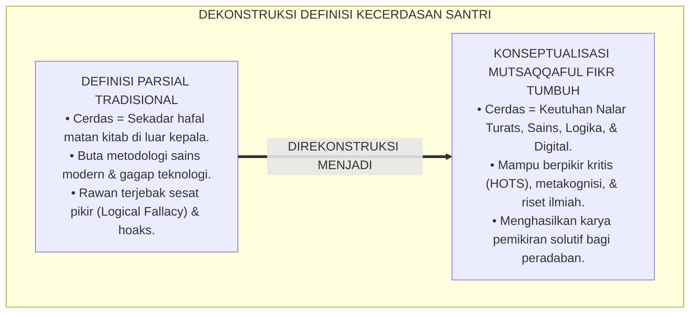
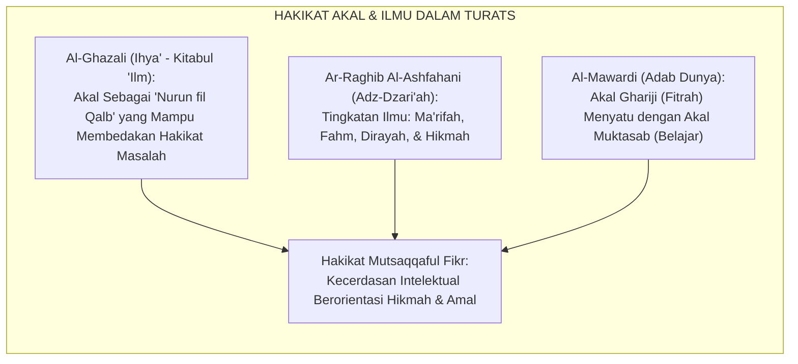
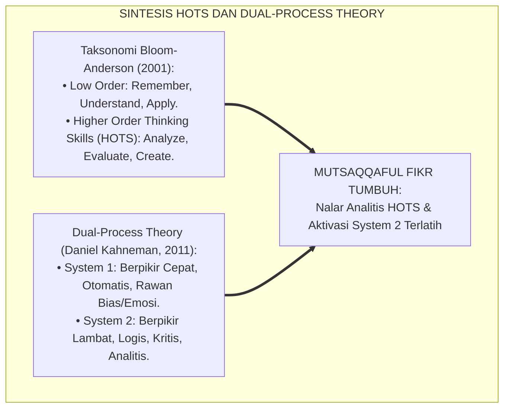
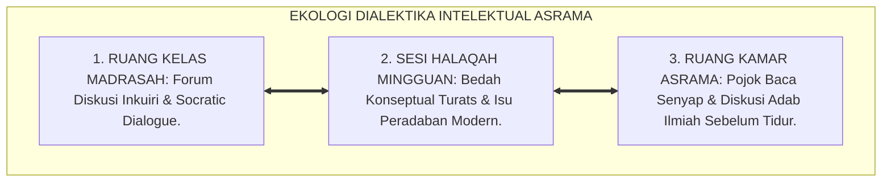
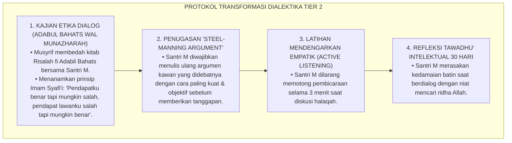
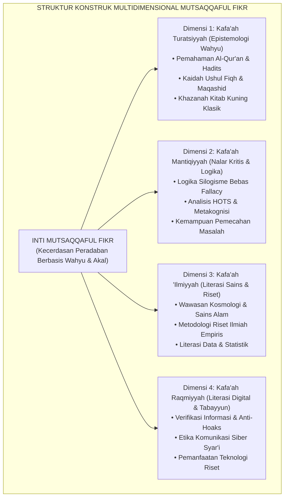
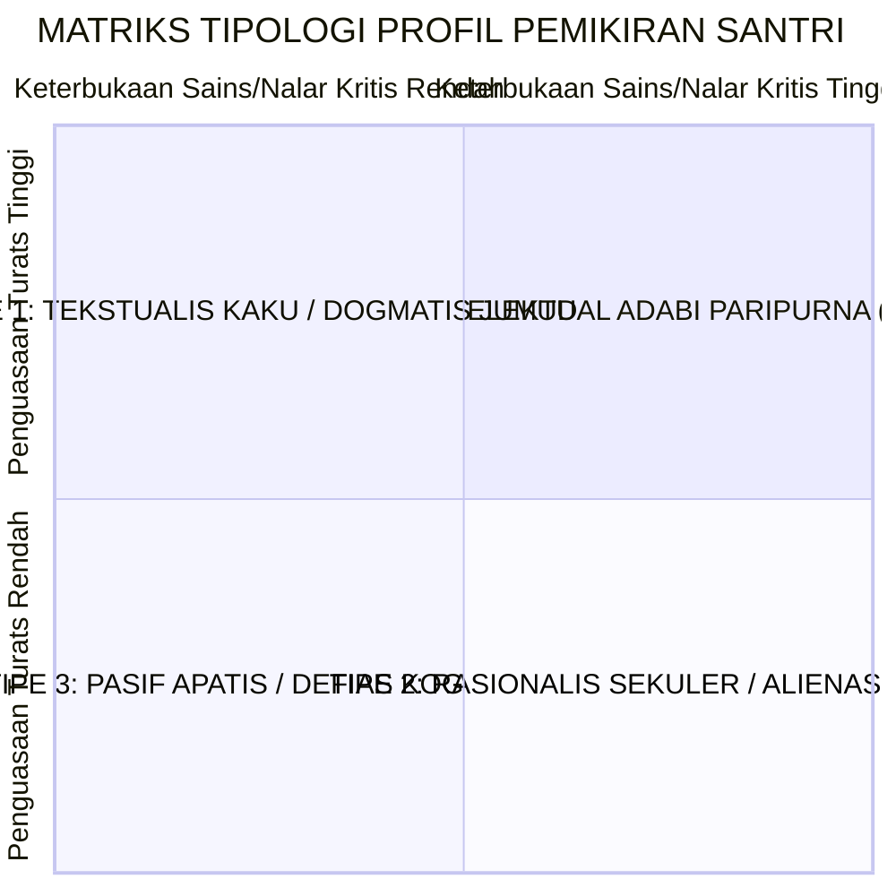
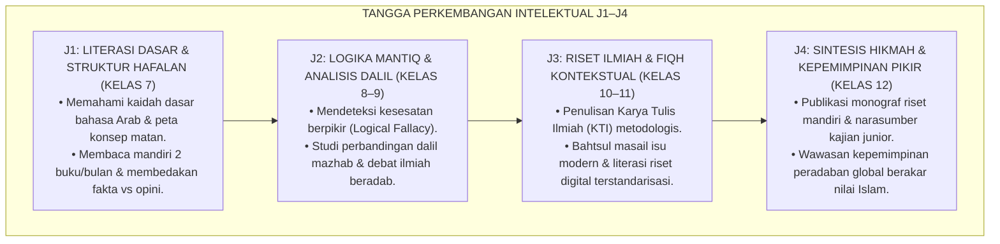
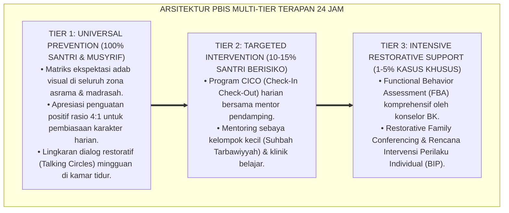

# P3-08-02: DEFINISI DAN KONSEPTUALISASI MUTSAQQAFUL FIKR
## *Monograf Riset Akademik: Dekonstruksi 'Wawasan Parsial' Menuju Keutuhan Intelektual (Intellectual Wholeness), Konstruk Teoretis Empat Dimensi Nalar (Wahyu, Rasionalitas, Literasi Sains, & Literasi Digital), Pemetaan Tipologi Intelektual Santri, Serta Standarisasi Nalar Kritis di Pesantren 24 Jam*

**Nomor Identifikasi**: `P3-08-02/MONOGRAF-RISET-KONSEPTUALISASI-MUTSAQQAFUL-FIKR/2026`  
**Domain**: `03 Capacity Framework` > `08 Mutsaqqaful Fikr` (Sub-Modul 02: *Definition & Conceptualization*)  
**Klasifikasi Naskah**: *Academic Research Monograph* (Monograf Penelitian Konstruk Intelektualisme Islam, Epistemologi Kognisi Santri, & Tipologi Nalar Kritis)  
**Rumpun Disiplin Pengkaji**: Epistemologi Terapan, Psikologi Kognitif Pendidikan, Filsafat Bahasa & Logika, Sosiologi Pengetahuan Pesantren  

---

> ### 💡 INTISARI EKSEKUTIF (EXECUTIVE SUMMARY)
>
> * **Kegagalan Definisi Intelektual yang Terfragmentasi:**  
>   Praktik pendidikan kerap terjebak dalam dikotomi sempit: memandang kecerdasan semata-mata sebagai "nilai ujian hafalan kitab kuning tinggi" (*Salafy Reductionism*) atau sekadar "prestasi nilai sains/matematika modern" (*Modernist Reductionism*). Akibatnya, lahir santri yang paham hukum fikih namun buta sains teknologi, atau santri yang mahir teknologi namun kosong dari wawasan adab dan epistemologi wahyu.
> * **Rekonstruksi Konseptual Mutsaqqaful Fikr TUMBUH:**  
>   Dalam kerangka TUMBUH, *Mutsaqqaful Fikr* dikonseptualisasikan sebagai **konstruk multidimensional terpadu yang memadukan Penguasaan Epistemologi Turats & Wahyu (*Al-Kafa'ah at-Turatsiyyah*), Ketajaman Nalar Kritis & Logika Silogisme (*Al-Kafa'ah al-Mantiqiyyah*), Melek Literasi Sains & Metodologi Riset Empiris (*Al-Kafa'ah al-'Ilmiyyah*), serta Kemahiran Literasi Digital & Verifikasi Informasi (*Al-Kafa'ah ar-Raqmiyyah*)**.
> * **Formulasi Konstruk Empat Dimensi & Tipologi Intelektual:**  
>   Monograf ini merumuskan definisi operasional baku, peta dekomposisi 4 pilar dimensi kognitif, serta 4 tipologi profil pemikiran santri (Tekstualis Kaku, Rasionalis Sekuler, Pasif Apatis, dan Intelektual Adabi Paripurna) berbasis matriks kedalaman Turats dan keterbukaan sains.

---

## 📑 DAFTAR ISI MONOGRAF

- [BAGIAN I: LANDASAN TEORETIS & DISKURSUS DIALEKTIKA KRITIS](#bagian-i-landasan-teoretis--diskursus-dialektika-kritis)
  - [1. Latar Belakang Masalah: Ilusi 'Santri Cerdas' vs Keutuhan Wawasan Peradaban](#1-latar-belakang-masalah-ilusi-santri-cerdas-vs-keutuhan-wawasan-peradaban)
  - [2. Telaah Epistemologis Turats: Hakikat Al-'Aql & Maratibul 'Ilm dalam Tradisi Klasik](#2-telaah-epistemologis-turats-hakikat-al-aql--maratibul-ilm-dalam-tradisi-klasik)
  - [3. Konvergensi Teori Taksonomi Bloom-Anderson (HOTS) & Dual-Process Theory of Cognition](#3-konvergensi-teori-taksonomi-bloom-anderson-hots--dual-process-theory-of-cognition)
  - [4. Analisis Rekayasa Kausalitas Spasial: Budaya Dialektika Kelas, Halaqah, & Diskusi Kamar](#4-analisis-rekayasa-kausalitas-spasial-budaya-dialektika-kelas-halaqah--diskusi-kamar)
  - [5. Kasuistika Lapangan Klinis & Protokol Rekonseptualisasi Santri 'Kecanduan Debat Kusir'](#5-kasuistika-lapangan-klinis--protokol-rekonseptualisasi-santri-kecanduan-debat-kusir)
- [BAGIAN II: FORMULASI KONSEPTUAL & PEMBAHASAN MENDALAM](#bagian-ii-formulasi-konseptual--pembahasan-mendalam)
  - [1. Definisi Operasional & Arsitektur Konstruk Multidimensional Mutsaqqaful Fikr](#1-definisi-operasional--arsitektur-konstruk-multidimensional-mutsaqqaful-fikr)
  - [2. Dekomposisi 4 Pilar Dimensi & Tipologi Profil Intelektual Santri](#2-dekomposisi-4-pilar-dimensi--tipologi-profil-intelektual-santri)
  - [3. Matriks Progresi Kapasitas Intelektual Jenjang J1–J4 (Kelas 7 s/d 12)](#3-matriks-progresi-kapasitas-intelektual-jenjang-j1j4-kelas-7-sd-12)
  - [4. Diskusi Akademis & Implikasi bagi Kurikulum Terintegrasi Pesantren Abad 21](#4-diskusi-akademis--implikasi-bagi-kurikulum-terintegrasi-pesantren-abad-21)
- [BAGIAN III: KESIMPULAN & APARATUS AKADEMIS](#bagian-iii-kesimpulan--aparatus-akademis)
  - [1. Tabel Sintesis Konseptualisasi Mutsaqqaful Fikr](#1-tabel-sintesis-konseptualisasi-mutsaqqaful-fikr)
  - [2. Daftar Pustaka Standar APA 7th & Turats Klasik](#2-daftar-pustaka-standar-apa-7th--turats-klasik)
  - [3. Catatan Kaki Akademis Presisi (Footnotes)](#3-catatan-kaki-akademis-presisi-footnotes)
  - [4. Glosarium Istilah Ilmiah & Konseptualisasi Fikr](#4-glosarium-istilah-ilmiah--konseptualisasi-fikr)

---

# BAGIAN I: LANDASAN TEORETIS & DISKURSUS DIALEKTIKA KRITIS

---

### 1. Latar Belakang Masalah: Ilusi 'Santri Cerdas' vs Keutuhan Wawasan Peradaban

Dalam evaluasi capaian kognitif di pesantren konvensional, kerap terjadi **tiga distorsi konseptual (*Conceptual Distortions*)**:[^1]

1. **Jebakan Kecerdasan Hafalan Semata (*The Rote Memory Illusion*)**: Santri yang hafal matan kitab tebal secara kata-per-kata otomatis diberi label "santri paling cerdas", meskipun ia tidak mampu menghubungkan satu bab fikih dengan bab lainnya dan tidak mampu memecahkan masalah logika matematika sederhana.
2. **Keterpisahan Ilmu Syariat dan Realitas Sains Kontemporer**: Ilmu agama diajarkan seolah-olah hidup di ruang hampa yang terisolasi dari perkembangan teknologi, ekonomi digital, dan krisis ekologi modern.
3. **Ketidakmampuan Menyaring Informasi Digital**: Ketiadaan kerangka logika kritis membuat santri mudah terperdaya oleh informasi hoaks, pseudosains, dan narasi polarisasi di media sosial.[^2]

Model riset **TUMBUH** merekonstruksi konsep kecerdasan: **Mutsaqqaful Fikr** adalah **keutuhan intelektual (*Intellectual Wholeness*) yang menyatukan kedalaman Turats, kejernihan logika, literasi sains empiris, dan kecakapan digital berbasis adab**.

---

### 2. Telaah Epistemologis Turats: Hakikat Al-'Aql & Maratibul 'Ilm dalam Tradisi Klasik

Para ulama dan filosof muslim klasik mendefinisikan akal (*Al-'Aql*) bukan sekadar wadah penampung hafalan, melainkan instrumen aktif (*Quwwah 'Aqilah*) untuk membedakan antara yang haq dan yang batil.

#### 📖 Formulasi Imam Al-Ghazali tentang Hakikat Akal
Imam **Al-Ghazali** dalam *Ihya' 'Ulumiddin* menjelaskan bahwa akal terbagi menjadi empat tingkatan, di mana tingkatan tertingginya adalah:

$$\text{أَنْ تَنْتَهِيَ قُوَّةُ الْعَقْلِ إِلَى أَنْ يَعْرِفَ عَوَاقِبَ الْأُمُورِ، وَيَقْمَعَ الشَّهْوَةَ الدَّاعِيَةَ إِلَى اللَّذَّةِ الْعَاجِلَةِ، وَيَسْتَنْبِطَ الْحَقَائِقَ الْخَفِيَّةَ بِالنَّظَرِ الصَّحِيحِ}$$

*"Kalaulah kekuatan akal itu telah mencapai puncaknya hingga mampu mengetahui akibat-akibat dari segala urusan, menundukkan hawa nafsu yang mengajak pada kenikmatan sesaat, dan **mampu mengistinbath hakikat-hakikat kebenaran yang tersembunyi dengan penyelidikan nalar yang sahih (An-Nazhar ash-Shahih)**!"*[^3]

Teks ini menegaskan bahwa kematangan intelektual menuntut kemampuan analisis mendalam dan penyelidikan yang benar.

---

### 3. Konvergensi Teori Taksonomi Bloom-Anderson (HOTS) & Dual-Process Theory of Cognition

Konseptualisasi Mutsaqqaful Fikr menyelaraskan psikologi kognitif modern dengan tradisi keilmuan Islam:

Santri dibimbing untuk tidak berhenti pada level *Remembering* (sekadar menghafal), melainkan terlatih mengaktivasi *System 2* berpikir kritis (*Evaluating & Creating*) saat membedah teks maupun masalah sosial kontemporer.[^4]

---

### 4. Analisis Rekayasa Kausalitas Spasial: Budaya Dialektika Kelas, Halaqah, & Diskusi Kamar

Pematangan wawasan berpikir santri direkayasa melalui interaksi spasial 24 jam:

---

### 5. Kasuistika Lapangan Klinis & Protokol Rekonseptualisasi Santri 'Kecanduan Debat Kusir'

#### Studi Kasus Lapangan: Santri Menggunakan Logika untuk Menyerang Kawan (*Sophistry / Jidal 'Aqim*)
* **Konteks Masalah**: Santri M (16 tahun, Jenjang J3) sangat gemar berdebat. Namun, kecerdasannya digunakan untuk mencari-cari kesalahan argumen kawan, mempermalukan santri lain di depan umum (*Ad Hominem*), dan menolak kebenaran jika disampaikan oleh orang lain. Kamar tidurnya penuh ketegangan sosial.
* **Analisis Diagnostik**: Santri M mengalami *Intellectual Arrogance* dan deviasi nalar sofisme (*Al-Jidal wal Mirā'*), yaitu menggunakan kepandaian berbicara semata-mata untuk memenangkan ego, bukan mencari kebenaran (*Al-Haqq*).
* **Protokol Rekonseptualisasi Adab Intelektual TUMBUH**:

Dalam waktu 4 pekan, gaya komunikasi Santri M bertransformasi menjadi santun, empatik, bijaksana, dan menjadi mediator diskusi ilmiah yang sangat dihormati kawan-kawannya.[^5]

---

# BAGIAN II: FORMULASI KONSEPTUAL & PEMBAHASAN MENDALAM

---

### 1. Definisi Operasional & Arsitektur Konstruk Multidimensional Mutsaqqaful Fikr

Secara terminologis baku dalam Ekosistem TUMBUH:

> **Mutsaqqaful Fikr (Wawasan Berpikir Luas & Kritis)** adalah *kapasitas kecerdasan intelektual holistik yang memadukan penguasaan mendalam terhadap teks wahyu dan khazanah Turats Islam, ketajaman logika penalaran kritis bebas sesat pikir, kepekaan literasi sains dan metodologi riset empiris, serta kemahiran literasi digital beradab, yang didedikasikan secara ikhlas sebagai sarana memecahkan problematika peradaban umat dan menegakkan kemaslahatan semesta.*

---

### 2. Dekomposisi 4 Pilar Dimensi & Tipologi Profil Intelektual Santri

Kondisi pemikiran santri dipetakan ke dalam 4 tipologi berbasis irisan **Penguasaan Turats (*Turats Mastery*)** dan **Keterbukaan Nalar Kritis & Sains (*Critical & Scientific Openness*)**:

1. **Tipe 1: Santri Tekstualis Kaku (Turats Tinggi, Nalar Kritis Rendah)**  
   *Karakteristik*: Sangat hafal matan kitab, namun kaku dalam memahami konteks sosial, menolak sains modern, dan gampang mencap sesat perbedaan pendapat. Membutuhkan intervensi kajian Maqashid Syari'ah dan metode studi perbandingan mazhab.
2. **Tipe 2: Santri Rasionalis Sekuler (Turats Rendah, Nalar Kritis Tinggi)**  
   *Karakteristik*: Kritis dan jago berdebat sains modern, namun lemah pemahaman kaidah bahasa Arab dan meremehkan warisan ulama salaf. Membutuhkan penguatan fondasi Ushul Fiqh dan adab thalabul 'ilmi.
3. **Tipe 3: Santri Pasif Apatis (Turats Rendah, Nalar Kritis Rendah)**  
   *Karakteristik*: Malas membaca, pasif di kelas, tidak memiliki rasa ingin tahu ilmiah, dan mudah terpengaruh hoaks. Membutuhkan bimbingan literasi dasar Tier 2 dan penataan pojok baca kamar.
4. **Tipe 4: Intelektual Adabi Paripurna (Turats Tinggi, Nalar Kritis Tinggi)**  
   *Karakteristik*: Menguasai kitab kuning secara mendalam, memiliki nalar kritis tajam, melek sains modern, beradab santun, dan produktif menulis karya ilmiah. Inilah profil lulusan ideal **Mutsaqqaful Fikr TUMBUH**.[^6]

---

### 3. Matriks Progresi Kapasitas Intelektual Jenjang J1–J4 (Kelas 7 s/d 12)

---

### 4. Diskusi Akademis & Implikasi bagi Kurikulum Terintegrasi Pesantren Abad 21

Penerapan konseptualisasi Mutsaqqaful Fikr membawa implikasi besar:

1. **Integrasi Epistemologis Kurikulum (*Epistemological Integration*)**: Menghilangkan sekat dikotomis antara "mata pelajaran agama" dan "mata pelajaran umum". Sains diajarkan sebagai ayat-ayat kauniyyah Allah, dan fikih diajarkan sebagai solusi problem kemanusiaan.
2. **Kemandirian Berpikir Santri (*Intellectual Autonomy*)**: Santri dididik menjadi pembelajar mandiri seumur hidup (*Self-Regulated Lifelong Learner*) yang tidak mudah diombang-ambingkan oleh arus zaman.
3. **Penyempurnaan Posisi Pesantren Sebagai Mercusuar Peradaban**: Pesantren kembali menempati posisi historisnya sebagai universitas peradaban yang melahirkan sosok sekaliber Ibnu Sina, Al-Ghazali, dan Ibnu Rusyd di era modern.[^7]

---

---

### Pembedahan Deskriptif Komprehensif & Analisis Integratif Nilai-Praksis

Penerapan konsep **P3-08-02: DEFINISI DAN KONSEPTUALISASI MUTSAQQAFUL FIKR** di ekosistem pesantren berbasis sistem TUMBUH memerlukan pemahaman multidimensional yang memadukan khazanah turats syariat dan konsensus sains pendidikan modern:

#### A. Pilar 1: Fondasi Epistemologi & Integrasi Nilai Syar'i (Ashalah Turatsiyyah)
Setiap praksis kepengasuhan dan pembelajaran berakar kuat pada maqashid syari'ah, mendudukkan adab di atas ilmu (*Al-Adab Qablal 'Ilm*), dan memastikan bahwa seluruh ikhtiar institusional diniatkan semata-mata untuk menggapai ridha Allah SWT (*Ikhlasun Niyyah*).

#### B. Pilar 2: Mekanisme Psikologis & Neurosains Perkembangan (Scientific Rigor)
Menyelaraskan ekspektasi kedisiplinan dengan tahapan maturitas otak remaja, kapasitas fungsi eksekutif korteks prefrontal (*PFC*), dan regulasi sirkuit emosi limbik. Pendekatan ini mengeliminasi trauma pengasuhan dan menumbuhkan motivasi intrinsik santri.

#### C. Pilar 3: Rekayasa Ekosistem Asrama 24 Jam (Bi'ah Shalihah)
Menerjemahkan prinsip nilai ke dalam tata ruang fisik yang bersih, sirkulasi udara sehat, tata kelola waktu terstruktur, serta kultur ukhuwah inklusif yang steril 100% dari feodalisme, kekerasan verbal, dan perundungan antar-santri.

#### D. Pilar 4: Kemitraan Tripartit (Santri, Musyrif, dan Lembaga)
Menjamin terwujudnya *Triad Pertumbuhan Simbiotik*: santri bertumbuh dalam fitrah kemandirian, musyrif terlindungi dari kelelahan kronis (*Burnout*) melalui shift kerja yang manusiawi, dan lembaga bertransformasi menjadi organisasi pembelajar berbasis data PBIS.

---

### Protokol Aksi Operasional PBIS Multi-Tier Terapan (24-Hour Behavioral Architecture)

---

# BAGIAN III: KESIMPULAN & APARATUS AKADEMIS

---

### 1. Tabel Sintesis Konseptualisasi Mutsaqqaful Fikr

| Parameter Konseptual | Paradigma Tradisional Pesantren | Rekonstruksi Model TUMBUH | Landasan Rujukan Primer | Implikasi Praksis Lapangan |
| :--- | :--- | :--- | :--- | :--- |
| **Definisi Inti** | Hafalan teks mekanistik tanpa pemahaman nalar. | Keutuhan nalar wahyu, logika mantiq, sains empiris, & digital. | QS. Ali 'Imran: 190–191 & *Adab Dunya* (Al-Mawardi) | Santri memiliki wawasan luas dan kemampuan analisis tinggi. |
| **Struktur Konstruk** | Fragmented (fokus teks saja, anti-sains modern). | Multidimensional 4 dimensi terpadu (*Turats, Logika, Sains, Digital*). | *Bunyatu Aqlil Arabi* (Al-Jabiri, 1990) | Kurikulum mencakup seluruh dimensi kognitif abad 21. |
| **Gaya Berpikir** | Taklid dogmatis kaku (*System 1 Fast Thinking*). | Nalar kritis reflektif HOTS (*System 2 Slow Thinking*). | *Dual-Process Theory* (Kahneman, 2011) | Santri tidak mudah terprovokasi hoaks dan polarisasi. |
| **Budaya Diskusi** | Tabu bertanya; takut dicap kurang ajar. | Inkuiri ilmiah dialogis (*Socratic Dialogue*) & adab ikhtilaf. | *Adabul Bahats wal Munazharah* | Terbiasa berargumentasi ilmiah dengan santun dan beradab. |

---

### 2. Daftar Pustaka Standar APA 7th & Turats Klasik

1. **Al-Ghazali, Hujjatul Islam Abu Hamid Muhammad bin Muhammad.** (2018). *Ihya' 'Ulumiddin: Kitabul 'Ilm*. Beirut: Dar Al-Kutub Al-'Ilmiyyah.
2. **Al-Jabiri, Muhammad Abid.** (1990). *Bunyatu Al-'Aql Al-'Arabi*. Beirut: Markaz Dirasat Al-Wihdah Al-'Arabiyyah.
3. **Al-Mawardi, Abu Al-Hasan Ali bin Muhammad.** (1987). *Adab ad-Dunya wad-Din*. Beirut: Dar Al-Kutub Al-'Ilmiyyah.
4. **Anderson, L. W., & Krathwohl, D. R.** (2001). *A Taxonomy for Learning, Teaching, and Assessing: A Revision of Bloom's Taxonomy of Educational Objectives*. New York: Longman.
5. **Ar-Raghib Al-Ashfahani, Abu Al-Qasim Al-Husain bin Muhammad.** (2007). *Adz-Dzari'ah ila Makarimy Asy-Syari'ah*. Kairo: Dar As-Salam.
6. **Flavell, J. H.** (1979). *Metacognition and cognitive monitoring*. *American Psychologist*, 34(10), 906-911.
7. **Ibnu Rusyd, Abu Al-Walid Muhammad bin Ahmad.** (1997). *Fashlul Maqal fi ma Baina Al-Hikmati wash-Syari'ati minal Ittishal*. Kairo: Dar Al-Ma'arif.
8. **Kahneman, D.** (2011). *Thinking, Fast and Slow*. New York: Farrar, Straus and Giroux.
9. **Paul, R., & Elder, L.** (2019). *Critical Thinking: Tools for Taking Charge of Your Learning and Your Life* (3rd ed.). Boston: Pearson.
10. **Sugai, G., & Horner, R. H.** (2020). *School-Wide Positive Behavioral Interventions and Supports: Implementation Practices*. *Journal of Positive Behavior Interventions*, 22(4), 203-211.

---

### 3. Catatan Kaki Akademis Presisi (Footnotes)

[^1]: Kritik terhadap reduksionisme hafalan teks mekanistik tanpa pemahaman nalar kritis di dunia pendidikan, Anderson & Krathwohl (2001, hlm. 68).  
[^2]: Pembahasan dampak buruk ketiadaan literasi digital kritis pada remaja, Paul & Elder (2019, hlm. 22).  
[^3]: Al-Ghazali, *Ihya' 'Ulumiddin* (2018, Jilid 1, hlm. 82).  
[^4]: Integrasi Taksonomi Bloom HOTS dan Teori Dua Sistem Berpikir Daniel Kahneman, Kahneman (2011, hlm. 44).  
[^5]: Protokol adab dialog ilmiah dan eliminasi debat kusir destruktif, Al-Mawardi (1987, hlm. 112).  
[^6]: Matriks tipologi profil pemikiran santri dalam sistem analitik TUMBUH (2026).  
[^7]: Standar kurikulum integratif dan kemandirian berpikir santri dalam sistem TUMBUH Pesantren (2026).  

---

### 4. Glosarium Istilah Ilmiah & Konseptualisasi Fikr

1. **Intellectual Wholeness (Keutuhan Intelektual)**: Kondisi integrasi harmonis antara keimanan wahyu, ketajaman logika, wawasan sains empiris, dan literasi teknologi digital.
2. **Kafa'ah Turatsiyyah (الْكَفَاءَةُ التُّرَاثِيَّةُ)**: Kompetensi penguasaan khazanah keilmuan Islam klasik, metodologi Ushul Fiqh, dan gramatika bahasa Arab.
3. **Kafa'ah Mantiqiyyah (الْكَفَاءَةُ الْمَنْطِقِيَّةُ)**: Keterampilan menyusun argumen silogisme logis, mendeteksi sesat pikir (*Fallacy*), dan memecahkan masalah sistematis.
4. **Kafa'ah 'Ilmiyyah (الْكَفَاءَةُ الْعِلْمِيَّةُ)**: Kemampuan memahami metode penelitian ilmiah empiris, membaca data statistik, dan memahami hukum alam (*Sunnatullah*).
5. **Kafa'ah Raqmiyyah (الْكَفَاءَةُ الرَّقْمِيَّةُ)**: Keterampilan bernavigasi cerdas di ruang digital, memverifikasi keaslian informasi, dan memanfaatkan peranti lunak riset.
6. **Higher Order Thinking Skills (HOTS)**: Keterampilan berpikir tingkat tinggi yang mencakup kemampuan menganalisis, mengevaluasi, dan mencipta solusi baru.
7. **Dual-Process Theory**: Teori kognitif yang membedakan proses berpikir manusia menjadi Sistem 1 (cepat, otomatis, emosional) dan Sistem 2 (lambat, analitis, logis).
8. **Steel-Manning Argument**: Teknik debat ilmiah beradab dengan merekonstruksi argumen lawan ke bentuk terkuatnya sebelum memberikan evaluasi kritis.
9. **Jidal 'Aqim (الْجِدَالُ الْعَقِيمُ)**: Debat kusir tanpa dasar keilmuan yang semata-mata didorong oleh kesombongan ego untuk mengalahkan orang lain.
10. **An-Nazhar ash-Shahih (النَّظَرُ الصَّحِيحُ)**: Penyelidikan nalar yang objektif, sistematis, dan jujur dalam mencari kebenaran hakiki sesuai kaidah logika dan wahyu.
