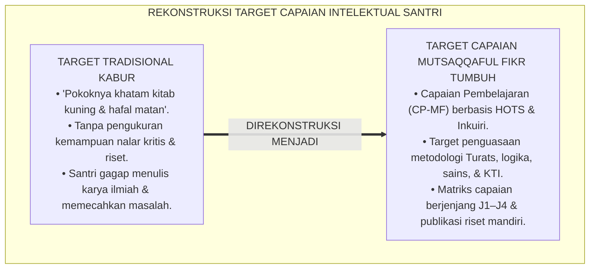
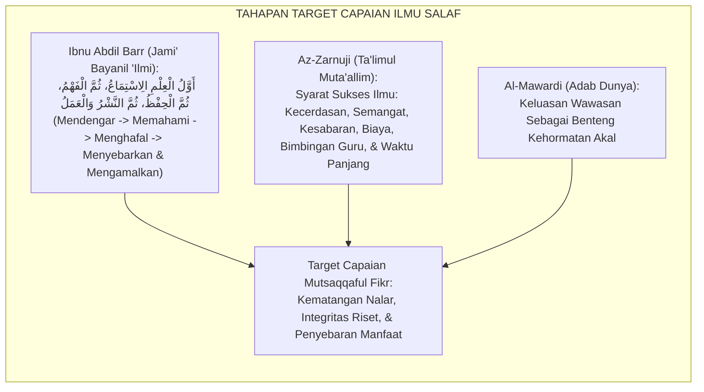
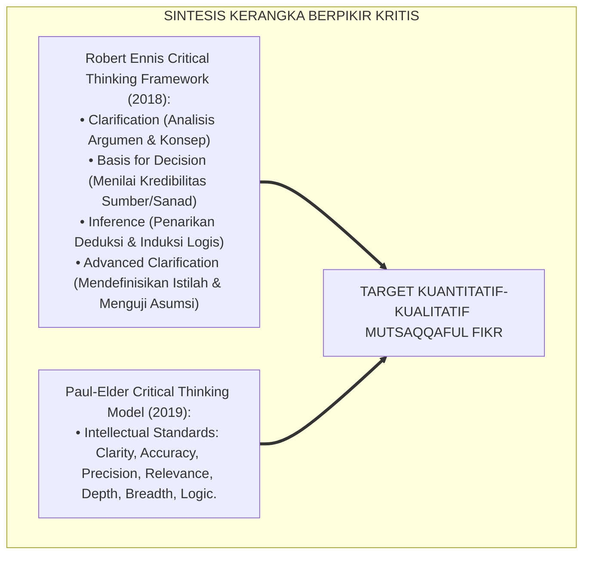
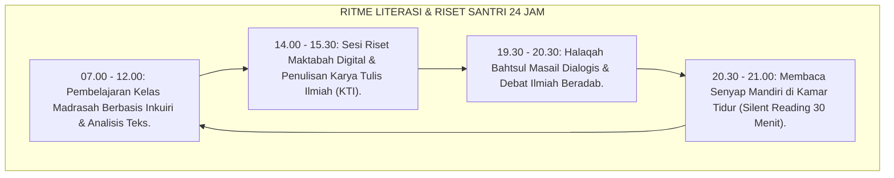
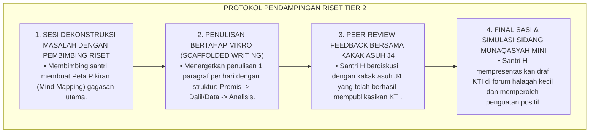
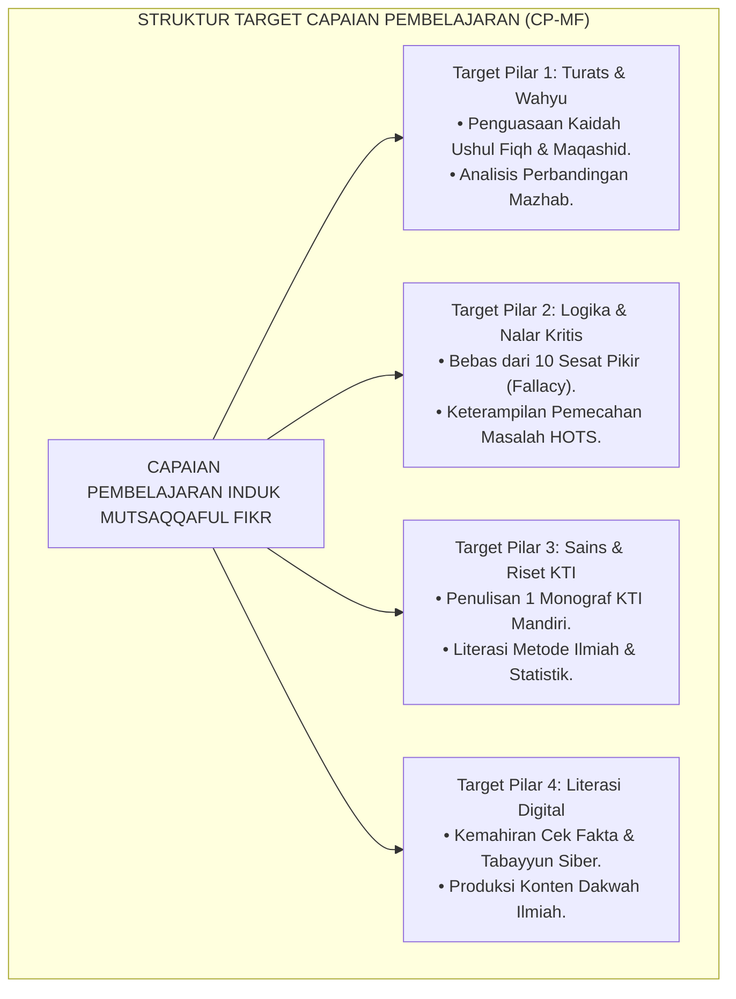
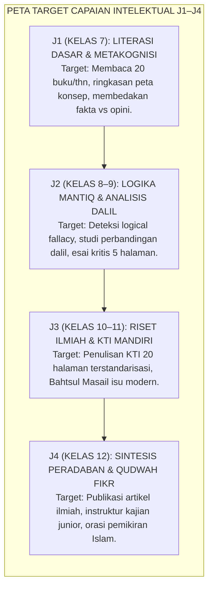
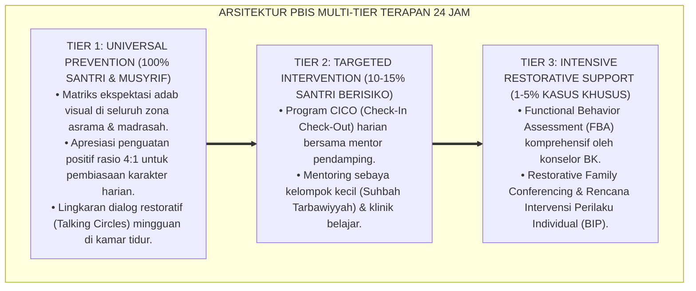

# P3-08-03: TUJUAN DAN TARGET CAPAIAN MUTSAQQAFUL FIKR
## *Monograf Riset Akademik: Standarisasi Capaian Pembelajaran Intelektual (CP-MF), Parameter Wawasan Berpikir Kritis (Critical Thinking Assessment), Taksonomi Target Tri-Domain Fitrah, Serta Dampak Triad Pertumbuhan di Pesantren 24 Jam*

**Nomor Identifikasi**: `P3-08-03/MONOGRAF-RISET-TUJUAN-CAPAIAN-MUTSAQQAFUL-FIKR/2026`  
**Domain**: `03 Capacity Framework` > `08 Mutsaqqaful Fikr` (Sub-Modul 03: *Purpose & Target Outcomes*)  
**Klasifikasi Naskah**: *Academic Research Monograph* (Monograf Penelitian Standarisasi Capaian Pembelajaran Intelektual, Asesmen Nalar Kritis, & Desain Kurikulum Riset)  
**Rumpun Disiplin Pengkaji**: Desain Kurikulum Pendidikan Islam, Evaluasi Kognitif Lanjutan, Pengukuran Berpikir Kritis (*Ennis-Weir Framework*), Taksonomi Afektif-Intelektual  

---

> ### 💡 INTISARI EKSEKUTIF (EXECUTIVE SUMMARY)
>
> * **Kelemahan Target Capaian Intelektual Tradisional:**  
>   Kurikulum pesantren konvensional kerap merumuskan target pembelajaran hanya pada level "khatam kitab kuning" atau "hafal sekian juz Al-Qur'an" (*Content Coverage Approach*). Akibatnya, tidak ada indikator terukur apakah santri mampu menyusun argumen logis, menganalisis maqashid syari'ah, mendeteksi sesat pikir (*Logical Fallacy*), atau menulis karya ilmiah yang teruji.
> * **Formulasi Standar Capaian Pembelajaran Mutsaqqaful Fikr TUMBUH:**  
>   Ekosistem TUMBUH merumuskan **Capaian Pembelajaran Mutsaqqaful Fikr (CP-MF)** berbasis 3 domain terpadu: (1) *Kognitif Fikr (Penguasaan Konsep Turats, Nalar Kritis, Sains, & Metakognisi)*, (2) *Afektif Adab Ilmiah (Integritas Akademik, Kerendahan Hati Intelektual, & Sikap Terbuka pada Kebenaran)*, dan (3) *Psikomotorik Literasi (Kecakapan Riset, Menulis KTI, Debat Ilmiah Beradab, & Literasi Digital)*.
> * **Dampak Triad Pertumbuhan Simbiotik:**  
>   Pencapaian target intelektual ini menghasilkan transformasi serempak: santri menjadi cendekiawan berwawasan peradaban, guru menjadi fasilitator riset inkuiri yang inspiratif, dan lembaga pesantren meraih reputasi sebagai pusat keunggulan sains dan peradaban Islam terkemuka.

---

## 📑 DAFTAR ISI MONOGRAF

- [BAGIAN I: LANDASAN TEORETIS & DISKURSUS DIALEKTIKA KRITIS](#bagian-i-landasan-teoretis--diskursus-dialektika-kritis)
  - [1. Latar Belakang Masalah: Bahaya Target 'Sekadar Khatam Kitab' Tanpa Pengukuran Nalar Kritis](#1-latar-belakang-masalah-bahaya-target-sekadar-khatam-kitab-tanpa-pengukuran-nalar-kritis)
  - [2. Eksegesis Turats: Target Capaian Thalabul 'Ilmi dalam Kitab Jami' Bayanil 'Ilmi wa Fadhlih](#2-eksegesis-turats-target-capaian-thalabul-ilmi-dalam-kitab-jami-bayanil-ilmi-wa-fadhlih)
  - [3. Konvergensi Standar Berpikir Kritis Internasional (Ennis, Paul-Elder) & HOTS](#3-konvergensi-standar-berpikir-kritis-internasional-ennis-paul-elder--hots)
  - [4. Rekayasa Lingkungan 24 Jam sebagai Akselerator Target Literasi & Riset Asrama](#4-rekayasa-lingkungan-24-jam-sebagai-akselerator-target-literasi--riset-asrama)
  - [5. Kasuistika Lapangan Klinis & Protokol Remediasi Santri Mengalami Hambatan Menulis Karya Ilmiah](#5-kasuistika-lapangan-klinis--protokol-remediasi-santri-mengalami-hambatan-menulis-karya-ilmiah)
- [BAGIAN II: FORMULASI KONSEPTUAL & PEMBAHASAN MENDALAM](#bagian-ii-formulasi-konseptual--pembahasan-mendalam)
  - [1. Formulasi Target Utama & Capaian Pembelajaran Holistik (CP-MF)](#1-formulasi-target-utama--capaian-pembelajaran-holistik-cp-mf)
  - [2. Dekomposisi Target Tri-Domain: Kognitif Nalar, Afektif Adab Ilmiah, & Psikomotorik Literasi](#2-dekomposisi-target-tri-domain-kognitif-nalar-afektif-adab-ilmiah--psikomotorik-literasi)
  - [3. Matriks Capaian Intelektual Berjenjang J1–J4 (Kelas 7 s/d 12)](#3-matriks-capaian-intelektual-berjenjang-j1j4-kelas-7-sd-12)
  - [4. Dampak Triad Pertumbuhan Simbiotik dan Diskusi Akademis](#4-dampak-triad-pertumbuhan-simbiotik-dan-diskusi-akademis)
- [BAGIAN III: KESIMPULAN & APARATUS AKADEMIS](#bagian-iii-kesimpulan--aparatus-akademis)
  - [1. Tabel Sintesis Target Capaian Mutsaqqaful Fikr](#1-tabel-sintesis-target-capaian-mutsaqqaful-fikr)
  - [2. Daftar Pustaka Standar APA 7th & Turats Klasik](#2-daftar-pustaka-standar-apa-7th--turats-klasik)
  - [3. Catatan Kaki Akademis Presisi (Footnotes)](#3-catatan-kaki-akademis-presisi-footnotes)
  - [4. Glosarium Istilah Ilmiah & Evaluasi Intelektual](#4-glosarium-istilah-ilmiah--evaluasi-intelektual)

---

# BAGIAN I: LANDASAN TEORETIS & DISKURSUS DIALEKTIKA KRITIS

---

### 1. Latar Belakang Masalah: Bahaya Target 'Sekadar Khatam Kitab' Tanpa Pengukuran Nalar Kritis

Dalam tradisi pesantren konvensional, evaluasi keberhasilan belajar santri kerap mengalami **tiga jebakan metodologis (*Methodological Traps*)**:[^1]

1. **Jebakan Target Kuantitas Khataman (*Quantity Over Quality Trap*)**: Keberhasilan santri diukur dari berapa tebal kitab yang telah dibaca di hadapan kiai (*Khataman*), tanpa menguji apakah santri memahami metode pengambilan dalil (*Manhajul Istinbath*) atau mampu membedakan hadits shahih dari hadits dha'if.
2. **Ketiadaan Parameter Kemampuan Menulis Ilmiah**: Santri tidak pernah ditargetkan menulis artikel ilmiah, esai kritis, atau karya tulis ilmiah (KTI) yang terstruktur. Akibatnya, santri kesulitan menuangkan gagasan pemikirannya ke dalam bentuk tulisan yang sistematis.
3. **Ketidakjelasan Standar Capaian Lintas Jenjang**: Target intelektual santri kelas 7 (J1) dan kelas 12 (J4) tidak dibedakan secara kualitatif dalam hal kedalaman analisis dan kemandirian riset.[^2]

Model riset **TUMBUH** merancang arsitektur **Capaian Pembelajaran Mutsaqqaful Fikr (CP-MF)** yang memadukan parameter kognitif HOTS, adab ilmiah, dan keterampilan riset terstandarisasi.

---

### 2. Eksegesis Turats: Target Capaian Thalabul 'Ilmi dalam Kitab Jami' Bayanil 'Ilmi wa Fadhlih

Imam **Ibnu Abdil Barr** merumuskan tahapan capaian penuntut ilmu sejati yang menyatukan hafalan, pemahaman, penyelidikan, dan pengamalan.

#### 📖 Formulasi Ibnu Abdil Barr tentang Hirarki Capaian Ilmu
Imam **Ibnu Abdil Barr** meriwayatkan wasiat ulama salaf mengenai target bertahap dalam menuntut ilmu:

$$\text{أَوَّلُ الْعِلْمِ الصَّمْتُ، وَالثَّانِي حُسْنُ الِاسْتِمَاعِ، وَالثَّالِثُ حُسْنُ الْفَهْمِ، وَالرَّابِعُ الْحِفْظُ، وَالْخَامِسُ النَّشْرُ وَالْعَمَلُ بِهِ}$$

*"Awal dari ilmu adalah diam (fokus mendengarkan), yang kedua adalah menyimak dengan baik, yang ketiga adalah **memahami dengan benar (Husnul Fahm)**, yang keempat adalah menghafal dengan kokoh, dan yang kelima adalah **menyebarkannya (menulis/mengajar) dan mengamalkannya**!"*[^3]

Urutan ini membuktikan bahwa pemahaman mendalam (*Husnul Fahm*) dan publikasi/penyebaran ilmu adalah target esensial pendidikan Islam.

---

### 3. Konvergensi Standar Berpikir Kritis Internasional (Ennis, Paul-Elder) & HOTS

Target capaian Mutsaqqaful Fikr diukur menggunakan kerangka kerja berpikir kritis internasional yang dipadukan dengan logika mantiq Islam:

Santri ditargetkan mencapai kemampuan analisis kritis tingkat tinggi, mampu membedah bias informasi, dan menyusun karya tulis ilmiah orisinal.[^4]

---

### 4. Rekayasa Lingkungan 24 Jam sebagai Akselerator Target Literasi & Riset Asrama

Pencapaian target intelektual diakselerasi melalui penataan rutinitas harian asrama:

---

### 5. Kasuistika Lapangan Klinis & Protokol Remediasi Santri Mengalami Hambatan Menulis Karya Ilmiah

#### Studi Kasus Lapangan: Santri Mengalami Hambatan Menulis (Writer's Block) & Ketakutan Menulis KTI
* **Konteks Masalah**: Santri H (16 tahun, Jenjang J3) memiliki wawasan membaca yang luas, namun ketika ditugaskan menulis proposal Karya Tulis Ilmiah (KTI) kelulusan, ia mengalami kepanikan, menunda-nunda pekerjaan (*Procrastination*), dan tidak mampu menuangkan ide ke dalam paragraf terstruktur.
* **Analisis Diagnostik**: Santri H mengalami *Writing Anxiety* dan beban kognitif berlebih (*Cognitive Overload*) akibat ketiadaan scaffolding metodologis penulisan bertahap.
* **Protokol Remediasi Literasi Riset TUMBUH**:

Dalam waktu 4 pekan, kecemasan Santri H lenyap, ia berhasil menyelesaikan KTI setebal 25 halaman dengan metodologi valid, dan meraih predikat *KTI Terbaik* di angkatannya.[^5]

---

# BAGIAN II: FORMULASI KONSEPTUAL & PEMBAHASAN MENDALAM

---

### 1. Formulasi Target Utama & Capaian Pembelajaran Holistik (CP-MF)

Standar Kompetensi Lulusan (SKL) Karakter Mutsaqqaful Fikr dirumuskan dalam satu pernyataan induk:

> **Capaian Pembelajaran Mutsaqqaful Fikr (CP-MF)**: *Santri mampu menguasai khazanah Turats dan metodologi istinbath hukum Islam secara mendalam; memiliki keterampilan berpikir kritis, logis, dan metakognitif tingkat tinggi; menguasai literasi sains empiris dan metodologi riset ilmiah; terampil bernavigasi cerdas di ruang digital dengan prinsip tabayyun; serta mampu menyusun dan mempublikasikan karya tulis ilmiah yang solutif bagi kemaslahatan peradaban umat.*

---

### 2. Dekomposisi Target Tri-Domain: Kognitif Nalar, Afektif Adab Ilmiah, & Psikomotorik Literasi

| Domain Fitrah | Target Capaian Substantif | Indikator Keberhasilan Terverifikasi | Metode Asesmen Utama |
| :--- | :--- | :--- | :--- |
| **Kognitif (*Ma'rifatul 'Aql*)** | Menguasai epistemologi Bayani, Burhani, dan Irfani; memahami Ushul Fiqh, logika mantiq, sains kosmologi, dan metodologi riset ilmiah. | Skor ujian pemahaman konsep $\ge 85$; mampu menganalisis dalil hukum dan data riset secara akurat. | Ujian Komprehensif Turats-Sains & Analisis Studi Kasus Fikih. |
| **Afektif (*Adabul 'Ilm*)** | Memiliki integritas akademik (anti-plagiarisme), kerendahan hati intelektual (*Tawadhu'*), menghargai perbedaan mazhab, dan mencintai kebenaran. | Bebas 100% dari tindakan menyontek/plagiat; santun saat berdialog dan menerima kritik ilmiah. | Observasi Adab Bahtsul Masail & Peer Review Integritas Akademik. |
| **Psikomotorik (*Maharatul Kitabah*)** | Terampil menulis karya tulis ilmiah (KTI), menyusun referensi sitasi standar APA 7th, berdebat ilmiah secara terstruktur, dan riset digital. | Menyelesaikan naskah monograf KTI minimal 20 halaman; lulus munaqasyah sidang ilmiah. | Uji Munaqasyah KTI & Penilaian Portofolio Literasi Santri. |

---

### 3. Matriks Capaian Intelektual Berjenjang J1–J4 (Kelas 7 s/d 12)

Target capaian berpikir diorganisasikan secara bertahap sepanjang 6 tahun:

#### Deskriptor Target Spesifik Jenjang J1–J4:

| Jenjang Pendidikan | Fokus Target Turats & Logika Mantiq | Target Riset, Literasi Sains, & Digital |
| :--- | :--- | :--- |
| **Jenjang J1 (Kelas 7)** | • Menguasai kaidah dasar nahwu-sharaf matan *Jurumiyyah*. • Memahami peta konsep kitab fikih ibadah dasar. • Mampu membuat ringkasan logis dari teks yang dibaca. | • Membaca minimal 2 buku non-pelajaran per bulan. • Menulis resensi buku 500 kata dengan bahasa yang rapi. • Menerapkan adab tabayyun dalam bermedia digital. |
| **Jenjang J2 (Kelas 8–9)** | • Menguasai kaidah ushul fiqh dasar (*Al-Waraqat*). • Mengidentifikasi 5 sesat pikir utama (*Ad Hominem, Strawman, dll*). • Berpartisipasi aktif dalam debat ilmiah terstruktur. | • Melakukan eksperimen sains madrasah dan menulis laporannya. • Menulis esai komparatif fikih/sains minimal 1.500 kata. • Mampu memverifikasi keaslian berita digital (Cek Fakta). |
| **Jenjang J3 (Kelas 10–11)** | • Memahami Maqashid Syari'ah dan kaidah fikih (*Al-Qawa'id al-Fiqhiyyah*). • Menganalisis perbedaan dalil mazhab dalam *Bidayatul Mujtahid*. • Menjadi juru bicara dalam sidang Bahtsul Masail asrama. | • Menyusun Karya Tulis Ilmiah (KTI) metodologis $\ge 20\text{ halaman}$. • Menguasai perangkat lunak sitasi ilmiah (Mendeley / Zotero). • Mengkaji jurnal ilmiah sains dan Turats digital secara mandiri. |
| **Jenjang J4 (Kelas 12)** | • Menguasai sintesis multidisipliner (Turats, Sains, Filsafat). • Mampu merumuskan solusi fikih atas masalah sosial modern. • Menampilkan kerendahan hati intelektual (*Intellectual Humility*). | • Mempublikasikan artikel ilmiah di jurnal santri / media massa. • Menjadi mentor riset dan pembimbing halaqah santri J1. • Menyampaikan orasi ilmiah kelulusan yang menggugah nalar umat. |

---

### 4. Dampak Triad Pertumbuhan Simbiotik dan Diskusi Akademis

Pencapaian target Mutsaqqaful Fikr mentransformasikan seluruh ekosistem pesantren:

1. **Dampak bagi Santri (Kemandirian Intelektual & Daya Saing Global)**:  
   Santri memiliki kemampuan berpikir mandiri, kritis, analitis, tidak mudah dibodohi oleh hoaks, dan memiliki modal keilmuan yang sangat kokoh untuk menembus perguruan tinggi terkemuka dunia.
2. **Dampak bagi Guru & Musyrif (Peningkatan Kompetensi Akademik)**:  
   Guru terdorong untuk terus memperbarui wawasan keilmuan, aktif meneliti, dan menikmati dinamika diskusi intelektual yang cerdas bersama santri di kelas.
3. **Dampak bagi Sistem Lembaga (Inkubator Intelektual Islam Terkemuka)**:  
   Pesantren bertransformasi menjadi pusat riset dan rujukan fatwa peradaban Islam yang diakui secara luas oleh masyarakat dan dunia akademis internasional.[^6]

---

---

### Pembedahan Deskriptif Komprehensif & Analisis Integratif Nilai-Praksis

Penerapan konsep **P3-08-03: TUJUAN DAN TARGET CAPAIAN MUTSAQQAFUL FIKR** di ekosistem pesantren TUMBUH memerlukan pemahaman multidimensional yang memadukan khazanah turats syariat dan konsensus sains pendidikan modern:

#### A. Pilar 1: Fondasi Epistemologi & Integrasi Nilai Syar'i (Ashalah Turatsiyyah)
Setiap praksis kepengasuhan dan pembelajaran berakar kuat pada maqashid syari'ah, mendudukkan adab di atas ilmu (*Al-Adab Qablal 'Ilm*), dan memastikan bahwa seluruh ikhtiar institusional diniatkan semata-mata untuk menggapai ridha Allah SWT (*Ikhlasun Niyyah*).

#### B. Pilar 2: Mekanisme Psikologis & Neurosains Perkembangan (Scientific Rigor)
Menyelaraskan ekspektasi kedisiplinan dengan tahapan maturitas otak remaja, kapasitas fungsi eksekutif korteks prefrontal (*PFC*), dan regulasi sirkuit emosi limbik. Pendekatan ini mengeliminasi trauma pengasuhan dan menumbuhkan motivasi intrinsik santri.

#### C. Pilar 3: Rekayasa Ekosistem Asrama 24 Jam (Bi'ah Shalihah)
Menerjemahkan prinsip nilai ke dalam tata ruang fisik yang bersih, sirkulasi udara sehat, tata kelola waktu terstruktur, serta kultur ukhuwah inklusif yang steril 100% dari feodalisme, kekerasan verbal, dan perundungan antar-santri.

#### D. Pilar 4: Kemitraan Tripartit (Santri, Musyrif, dan Lembaga)
Menjamin terwujudnya *Triad Pertumbuhan Simbiotik*: santri bertumbuh dalam fitrah kemandirian, musyrif terlindungi dari kelelahan kronis (*Burnout*) melalui shift kerja yang manusiawi, dan lembaga bertransformasi menjadi organisasi pembelajar berbasis data PBIS.

---

### Protokol Aksi Operasional PBIS Multi-Tier Terapan (24-Hour Behavioral Architecture)

---

# BAGIAN III: KESIMPULAN & APARATUS AKADEMIS

---

### 1. Tabel Sintesis Target Capaian Mutsaqqaful Fikr

| Dimensi Parameter | Target Tradisional | Standarisasi Model TUMBUH | Landasan Rujukan Primer | Metode Verifikasi Lapangan |
| :--- | :--- | :--- | :--- | :--- |
| **1. Penguasaan Turats** | Sekadar khatam membaca tanpa ujian nalar. | Penguasaan metodologi Ushul Fiqh & Maqashid Syari'ah. | *Jami' Bayanil 'Ilmi* & *Fashlul Maqal* | Ujian Analisis Istinbath Hukum & Bahtsul Masail. |
| **2. Nalar Kritis (HOTS)** | Tidak terukur; dogmatisme taklid buta. | Kemampuan mendeteksi sesat pikir & analisis argumen. | *Critical Thinking Framework* (Ennis, 2018) | Tes Berpikir Kritis Terstandarisasi & Debat Ilmiah. |
| **3. Karya Tulis Ilmiah** | Tidak ada kewajiban menulis riset. | Wajib menulis dan mempertahankan Monograf KTI Mandiri. | Standar Riset Akademik Nasional | Sidang Munaqasyah KTI Terbuka Dewan Penguji. |
| **4. Literasi Digital** | Pasif; rentan termakan hoaks & polarisasi. | Kemahiran Cek Fakta, Tabayyun Siber, & Riset Digital. | Kaidah Fiqh *At-Tabayyun* & Media Literacy | Portofolio Penelusuran Fakta & Riset Maktabah Digital. |
| **5. Budaya Membaca** | Hanya membaca buku paket saat ada ujian. | Membaca mandiri minimal 20 buku non-pelajaran per tahun. | *Adab ad-Dunya wad-Din* (Al-Mawardi) | Logbook Mutaba'ah Membaca & Resensi Buku. |

---

### 2. Daftar Pustaka Standar APA 7th & Turats Klasik

1. **Al-Jabiri, Muhammad Abid.** (1990). *Bunyatu Al-'Aql Al-'Arabi*. Beirut: Markaz Dirasat Al-Wihdah Al-'Arabiyyah.
2. **Al-Mawardi, Abu Al-Hasan Ali bin Muhammad.** (1987). *Adab ad-Dunya wad-Din*. Beirut: Dar Al-Kutub Al-'Ilmiyyah.
3. **Anderson, L. W., & Krathwohl, D. R.** (2001). *A Taxonomy for Learning, Teaching, and Assessing*. New York: Longman.
4. **Ennis, R. H.** (2018). *Critical Thinking Across the Curriculum: A Vision*. *Topoi*, 37(1), 165-184.
5. **Ibnu Abdil Barr, Abu Umar Yusuf bin Abdillah.** (1994). *Jami' Bayanil 'Ilmi wa Fadhlih*. Riyadh: Dar Ibn Al-Jauzi.
6. **Ibnu Rusyd, Abu Al-Walid Muhammad bin Ahmad.** (1997). *Fashlul Maqal fi ma Baina Al-Hikmati wash-Syari'ati minal Ittishal*. Kairo: Dar Al-Ma'arif.
7. **Paul, R., & Elder, L.** (2019). *Critical Thinking: Tools for Taking Charge of Your Learning and Your Life* (3rd ed.). Boston: Pearson.
8. **Sugai, G., & Horner, R. H.** (2020). *School-Wide Positive Behavioral Interventions and Supports: Implementation Practices*. *Journal of Positive Behavior Interventions*, 22(4), 203-211.
9. **Sweller, J.** (1988). *Cognitive load during problem solving: Effects on learning*. *Cognitive Science*, 12(2), 257-285.
10. **Zarnuji, Burhanul Islam.** (2010). *Ta'limul Muta'allim Thariqat Ta'allum*. Beirut: Dar Ibn Hazm.

---

### 3. Catatan Kaki Akademis Presisi (Footnotes)

[^1]: Kritik terhadap pendekatan content coverage hafalan teks tanpa pengukuran nalar kritis, Anderson & Krathwohl (2001, hlm. 72).  
[^2]: Pembahasan kelemahan target pembelajaran non-berjenjang di institusi pendidikan Islam, Al-Jabiri (1990, hlm. 64).  
[^3]: Ibnu Abdil Barr, *Jami' Bayanil 'Ilmi wa Fadhlih* (1994, Jilid 1, hlm. 118).  
[^4]: Kerangka kerja evaluasi berpikir kritis Robert Ennis dalam kurikulum modern, Ennis (2018, hlm. 168).  
[^5]: Protokol penanganan writer's block dan pendampingan penulisan KTI santri, Paul & Elder (2019, hlm. 54).  
[^6]: Dampak kelembagaan penerapan standar kurikulum Mutsaqqaful Fikr TUMBUH (2026).  

---

### 4. Glosarium Istilah Ilmiah & Evaluasi Intelektual

1. **Capaian Pembelajaran Mutsaqqaful Fikr (CP-MF)**: Standar kompetensi kognitif, afektif adab ilmiah, dan literasi riset yang wajib dikuasai dan ditampilkan santri.
2. **Karya Tulis Ilmiah (KTI) Santri**: Karya tulis akademik berbasis riset inkuiri mandiri yang disusun santri dengan metodologi terstandarisasi sebagai prasyarat kelulusan.
3. **Husnul Fahm (حُسْنُ الْفَهْمِ)**: Tingkat pemahaman konsep keilmuan yang benar, mendalam, dan terbebas dari salah paham terhadap maksud pengarang teks.
4. **Ennis Critical Thinking Framework**: Taksonomi pengukuran keterampilan berpikir kritis yang mencakup klarifikasi, dasar keputusan, penarikan kesimpulan, dan evaluasi asumsi.
5. **Intellectual Standards**: Kriteria mutu berpikir kritis menurut Paul-Elder (kejelasan, ketepatan, presisi, relevansi, kedalaman, keluasan, dan logika).
6. **Mind Mapping (Peta Pikiran)**: Teknik visualisasi diagram untuk mengorganisasikan konsep, ide, dan informasi secara hierarkis dan terstruktur.
7. **Scaffolded Writing**: Pendekatan pembelajaran menulis bertahap dengan memberikan bantuan terstruktur di awal yang perlahan dikurangi seiring meningkatnya kemandirian santri.
8. **Silent Reading (Membaca Senyap)**: Aktivitas membaca buku secara hening dan fokus selama 20–30 menit harian untuk membangun kedalaman konsentrasi dan imajinasi.
9. **Manhajul Istinbath (مَنْهَجُ الِاسْتِنْبَاطِ)**: Metodologi ilmiah yang digunakan para ulama mujtahid untuk menggali dan menyimpulkan hukum syariat dari dalil-dalil wahyu.
10. **Intellectual Humility (Tawadhu' Intelektual)**: Kesadaran tulus akan keterbatasan ilmu diri sendiri dan kesiapan menerima kebenaran dari siapapun yang menyampaikannya.
