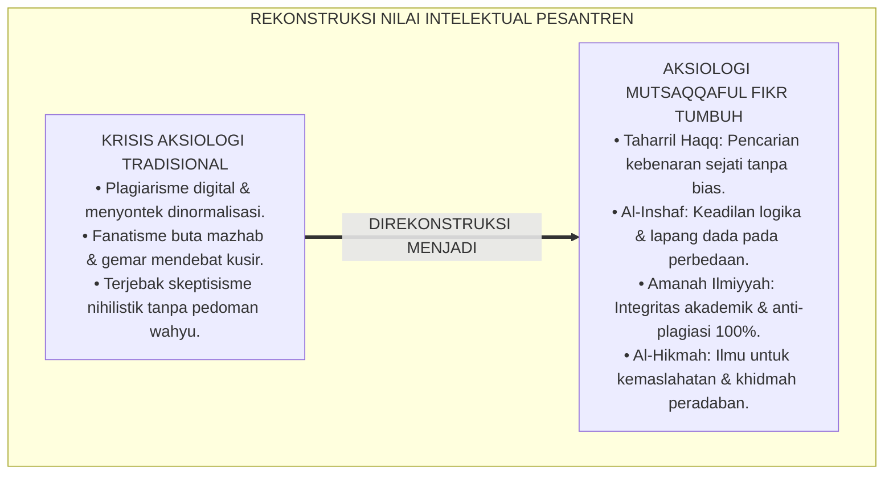
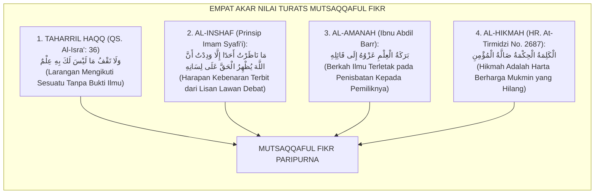
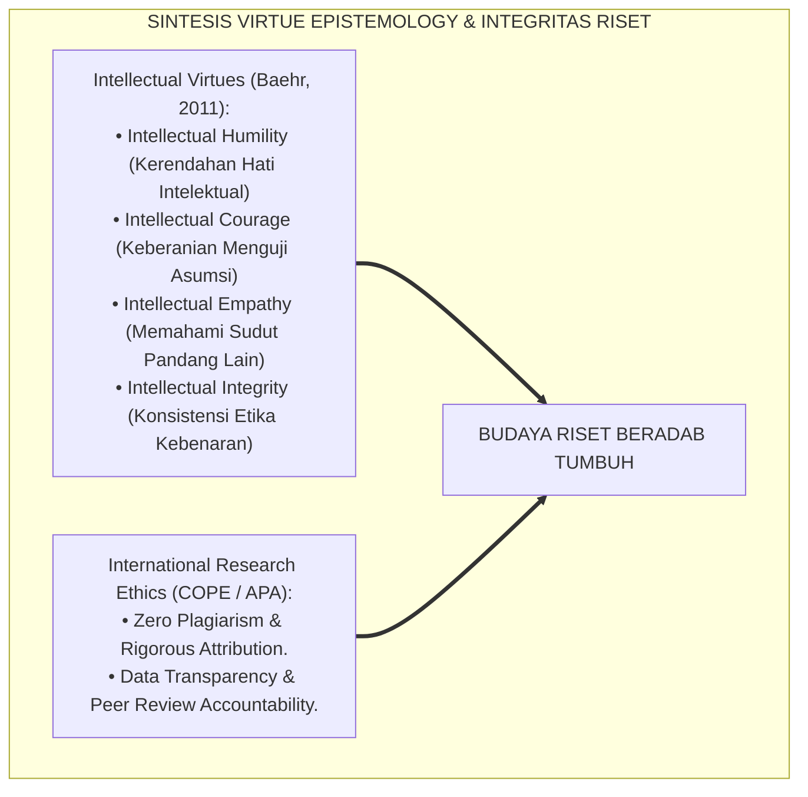
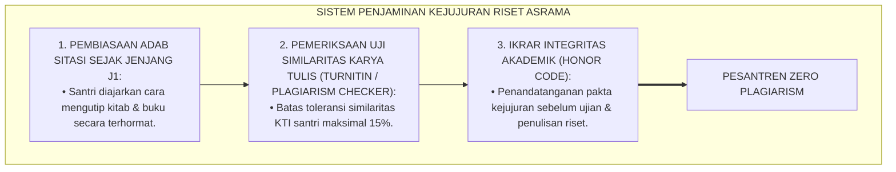
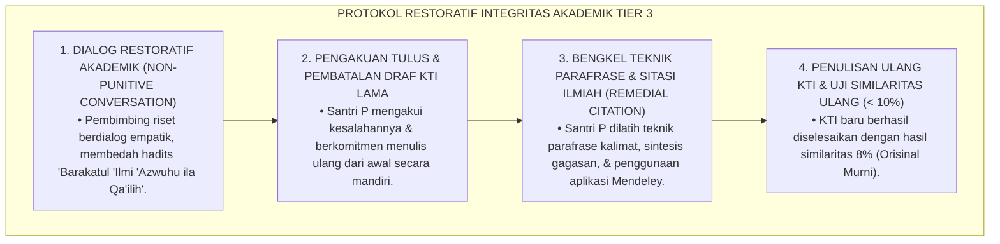
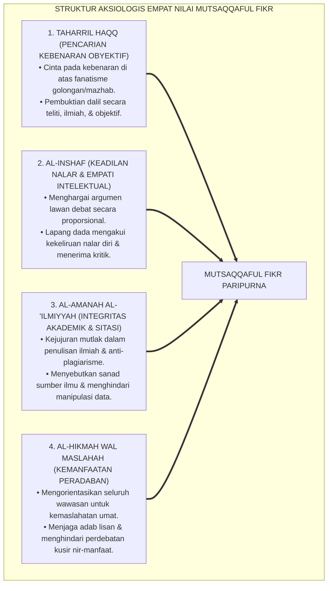
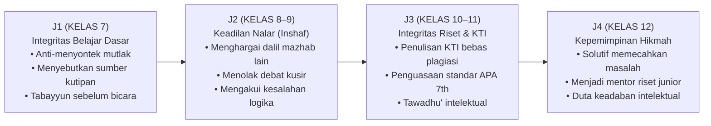
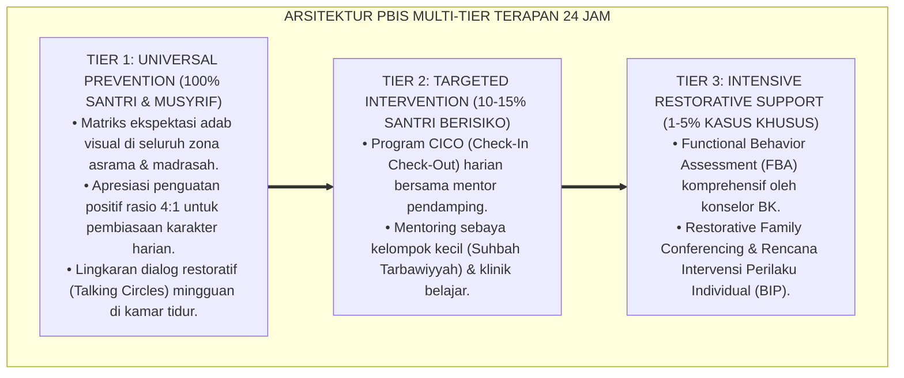

# P3-08-04: NILAI INTI DAN PRINSIP INTELEKTUAL MUTSAQQAFUL FIKR
## *Monograf Riset Akademik: Aksiologi Epistemologi Islam, Empat Nilai Inti Intelektual (Al-Haqq, Al-Inshaf, Al-Amanah al-'Ilmiyyah, & Al-Hikmah), Dialektika Nalar Kritis vs Sikap Skeptisisme/Nihilisme, Serta Etika Pencarian Kebenaran di Pesantren 24 Jam*

**Nomor Identifikasi**: `P3-08-04/MONOGRAF-RISET-NILAI-PRINSIP-MUTSAQQAFUL-FIKR/2026`  
**Domain**: `03 Capacity Framework` > `08 Mutsaqqaful Fikr` (Sub-Modul 04: *Core Values & Intellectual Principles*)  
**Klasifikasi Naskah**: *Academic Research Monograph* (Monograf Penelitian Aksiologi Ilmu Islam, Etika Riset Akademik, & Filsafat Moral Intelektual)  
**Rumpun Disiplin Pengkaji**: Aksiologi Ilmu Islam (*Adab Thalabil 'Ilm*), Etika Riset & Integritas Akademik, Filsafat Nilai (*Axiology*), Sosiologi Etika Pengetahuan  

---

> ### 💡 INTISARI EKSEKUTIF (EXECUTIVE SUMMARY)
>
> * **Krisis Etika & Aksiologi Intelektual di Era Informasi:**  
>   Dunia keilmuan kontemporer dan lingkungan santri menghadapi ancaman degradasi nilai intelektual: maraknya plagiarisme digital (*Copy-Paste Culture*), fanatisme buta mazhab (*Ta'ashshub Madzhabiy*), kecenderungan mendebat untuk menjatuhkan lawan (*Al-Mirā'*), serta bahaya skeptisisme radikal dan nihilisme pascamodern yang meragukan seluruh kepastian wahyu dan moralitas.
> * **Empat Nilai Inti Mutsaqqaful Fikr TUMBUH:**  
>   Ekosistem TUMBUH menetapkan **Empat Nilai Inti Intelektual (*Al-Qiyam al-Arba'ah lil-Fikr*)**: (1) *Taharril Haqq* (Pencarian Kebenaran Obyektif Tanpa Kompromi), (2) *Al-Inshaf* (Keadilan Logis & Keterbukaan terhadap Argumen Lain), (3) *Al-Amanah al-'Ilmiyyah* (Integritas Akademik & Orisinalitas Sitasi), dan (4) *Al-Hikmah wal Maslahah* (Orientasi Penerapan Ilmu untuk Kemaslahatan Peradaban Semesta).
> * **Harmonisasi Nilai dalam Triad Pertumbuhan:**  
>   Nilai-nilai ini membimbing santri menjadi pencari kebenaran yang jujur dan rendah hati, melindungi musyrif/guru dari arogansi keilmuan (*Kibrul 'Ilm*), dan menegakkan standar kejujuran riset tanpa plagiarisme di seluruh institusi pesantren.

---

## 📑 DAFTAR ISI MONOGRAF

- [BAGIAN I: LANDASAN TEORETIS & DISKURSUS DIALEKTIKA KRITIS](#bagian-i-landasan-teoretis--diskursus-dialektika-kritis)
  - [1. Latar Belakang Masalah: Bahaya Plagiarisme Digital, Fanatisme Mazhab, & Skeptisisme Radikal](#1-latar-belakang-masalah-bahaya-plagiarisme-digital-fanatisme-mazhab--skeptisisme-radikal)
  - [2. Eksegesis Turats: Kajian Mendalam Empat Pilar Nilai Intelektual Salafush Shalih](#2-eksegesis-turats-kajian-mendalam-empat-pilar-nilai-intelektual-salafush-shalih)
  - [3. Konvergensi Sains Etika Riset Internasional & Teori Kebajikan Intelektual (Intellectual Virtues)](#3-konvergensi-sains-etika-riset-internasional--teori-kebajikan-intelektual-intellectual-virtues)
  - [4. Analisis Rekayasa Ekologi Kejujuran Ilmiah 24 Jam: Sistem Anti-Plagiasi & Budaya Sitasi Terpuji](#4-analisis-rekayasa-ekologi-kejujuran-ilmiah-24-jam-sistem-anti-plagiasi--budaya-sitasi-terpuji)
  - [5. Kasuistika Lapangan Klinis & Protokol Restoratif Pelanggaran Integritas Akademik (Plagiarisme Santri)](#5-kasuistika-lapangan-klinis--protokol-restoratif-pelanggaran-integritas-akademik-plagiarisme-santri)
- [BAGIAN II: FORMULASI KONSEPTUAL & PEMBAHASAN MENDALAM](#bagian-ii-formulasi-konseptual--pembahasan-mendalam)
  - [1. Eksplanasi Teoretis Empat Nilai Inti Mutsaqqaful Fikr](#1-eksplanasi-teoretis-empat-nilai-inti-mutsaqqaful-fikr)
  - [2. Matriks Dialektika: Membedakan Nilai Intelektual Sejati vs Distorsi Nalar](#2-matriks-dialektika-membedakan-nilai-intelektual-sejati-vs-distorsi-nalar)
  - [3. Matriks Progresi Internalisasi Nilai Intelektual Jenjang J1–J4](#3-matriks-progresi-internalisasi-nilai-intelektual-jenjang-j1j4)
  - [4. Diskusi Akademis: Implikasi Aksiologis bagi Pembentukan Kultur Akademik Pesantren Beradab](#4-diskusi-akademis-implikasi-aksiologis-bagi-pembentukan-kultur-akademik-pesantren-beradab)
- [BAGIAN III: KESIMPULAN & APARATUS AKADEMIS](#bagian-iii-kesimpulan--aparatus-akademis)
  - [1. Tabel Sintesis Nilai Inti & Prinsip Mutsaqqaful Fikr](#1-tabel-sintesis-nilai-inti--prinsip-mutsaqqaful-fikr)
  - [2. Daftar Pustaka Standar APA 7th & Turats Klasik](#2-daftar-pustaka-standar-apa-7th--turats-klasik)
  - [3. Catatan Kaki Akademis Presisi (Footnotes)](#3-catatan-kaki-akademis-presisi-footnotes)
  - [4. Glosarium Istilah Ilmiah & Aksiologi Intelektual](#4-glosarium-istilah-ilmiah--aksiologi-intelektual)

---

# BAGIAN I: LANDASAN TEORETIS & DISKURSUS DIALEKTIKA KRITIS

---

### 1. Latar Belakang Masalah: Bahaya Plagiarisme Digital, Fanatisme Mazhab, & Skeptisisme Radikal

Dalam dinamika kognitif pesantren modern, terjadi **tiga krisis aksiologis keilmuan (*Axiological Crises*)**:[^1]

1. **Epidemi Plagiarisme & Budaya 'Copy-Paste'**: Kemudahan akses internet membuat santri terbiasa menyalin tugas makalah atau kutipan kitab dari internet tanpa menyebutkan sumber primer aslinya (*Academic Dishonesty*), mengikis integritas dan keberkahan ilmu.
2. **Fanatisme Sempit (*Ta'ashshub*) & Kebencian pada Mazhab Lain**: Sebagian santri dididik dengan fanatisme mazhab yang kaku, menganggap hanya pendapat kelompoknya yang benar dan mencela ulama lain yang berbeda ijtihad, melanggar prinsip *Inshaf* para imam mazhab.
3. **Bahaya Nihilisme & Skeptisisme Radikal**: Ketika santri bersentuhan dengan filsafat Barat tanpa bimbingan aksiologi tauhid yang kokoh, sebagian santri terjebak dalam keraguan eksistensial (*Syakk*), meragukan kebenaran wahyu, dan kehilangan pijakan moral spiritual.[^2]

Model riset **TUMBUH** merekonstruksi aksiologi nilai: **ilmu adalah cahaya suci (*Nurun Ilahiy*) yang wajib dicari dengan kejujuran mutlak, keadilan nalar, kerendahan hati, dan ditujukan semata-mata untuk mengabdi kepada Allah dan umat manusia**.

---

### 2. Eksegesis Turats: Kajian Mendalam Empat Pilar Nilai Intelektual Salafush Shalih

Para ulama salafush shalih mencontohkan etika pencarian ilmu yang sangat agung dalam khazanah Islam:

#### 📖 1. Nilai Taharril Haqq (Verifikasi Kebenaran Obyektif)
Allah SWT berfirman dalam QS. Al-Isra' [17]: 36:

$$\text{وَلَا تَقْفُ مَا لَيْسَ لَكَ بِهِ عِلْمٌ ۚ إِنَّ السَّمْعَ وَالْبَصَرَ وَالْفُؤَادَ كُلُّ أُولَٰئِكَ كَانَ عَنْهُ مَسْئُولًا}$$

*"Dan janganlah kamu mengikuti sesuatu yang tidak mempunyai pengetahuan tentangnya. Sesungguhnya pendengaran, penglihatan, dan hati nurani, semuanya itu akan dimintai pertanggungjawabannya!"*[^3]

#### 📖 2. Nilai Al-Inshaf (Keadilan Nalar Imam Asy-Syafi'i)
Imam **Asy-Syafi'i** mencontohkan puncak keadilan intelektual (*Al-Inshaf*):

$$\text{مَا نَاظَرْتُ أَحَدًا قَطُّ إِلَّا أَحْبَبْتُ أَنْ يُوَفَّقَ وَيُسَدَّدَ وَيُعَانَ، وَمَا نَاظَرْتُ أَحَدًا إِلَّا وَلَمْ أُبَالِ بَيَّنَ اللَّهُ الْحَقَّ عَلَى لِسَانِي أَوْ لِسَانِهِ}$$

*"Aku tidak pernah berdebat dengan siapapun melainkan aku sangat berharap agar ia diberi taufik, dibimbing pada kebenaran, dan ditolong oleh Allah. Dan aku tidak pernah berdebat dengan seseorang melainkan aku **tidak peduli apakah Allah menampakkan kebenaran itu melalui lisanku atau melalui lisannya**!"*[^4]

#### 📖 3. Nilai Al-Amanah al-'Ilmiyyah (Kejujuran Sitasi Ilmiah)
Imam **Ibnu Abdil Barr** menegaskan kaidah integritas akademik Islam:

$$\text{مِنْ بَرَكَةِ الْعِلْمِ وَشُكْرِهِ أَنْ يُعْزَى الْقَوْلُ إِلَى قَائِلِهِ؛ فَمَنِ ادَّعَى مَا لَيْسَ لَهُ أَوْ سَرَقَ كَلَامَ غَيْرِهِ نُزِعَتْ مِنْهُ بَرَكَةُ الْعِلْمِ}$$

*"Termasuk keberkahan ilmu dan bentuk kesyukurannya adalah **menisbatkan suatu perkataan/pendapat kepada pemilik aslinya (sitasi jujur)**. Barangsiapa yang mengklaim apa yang bukan miliknya atau mencuri perkataan orang lain (plagiat), niscaya dicabut keberkahan ilmu dari dirinya!"*[^5]

---

### 3. Konvergensi Sains Etika Riset Internasional & Teori Kebajikan Intelektual (Intellectual Virtues)

Penerapan nilai-nilai Mutsaqqaful Fikr menyelaraskan filsafat kebajikan kognitif (*Virtue Epistemology*):

---

### 4. Analisis Rekayasa Ekologi Kejujuran Ilmiah 24 Jam: Sistem Anti-Plagiasi & Budaya Sitasi Terpuji

Integritas akademik ditegakkan melalui kombinasi budaya adab dan instrumen teknologi modern:

---

### 5. Kasuistika Lapangan Klinis & Protokol Restoratif Pelanggaran Integritas Akademik (Plagiarisme Santri)

#### Studi Kasus Lapangan: Santri Menyalin Utuh Artikel Internet untuk Tugas Karya Tulis Ilmiah
* **Konteks Masalah**: Santri P (16 tahun, Jenjang J3) mengumpulkan draf KTI tentang "Ekonomi Syariah". Pengecekan perangkat lunak membuktikan bahwa 75% isi KTI-nya disalin utuh dari sebuah blog internet tanpa menyebutkan sumber (*Blatant Copy-Paste Plagiarism*).
* **Analisis Diagnostik**: Santri P mengalami kepanikan dikejar tenggat waktu (*Deadline Anxiety*) dan belum memahami bahwa menyalin tulisan orang lain tanpa atribusi adalah bentuk pencurian hak intelektual yang merusak berkah ilmu.
* **Protokol Resolusi Restoratif Integritas Akademik TUMBUH**:

Pendekatan restoratif ini berhasil menumbuhkan rasa bangga pada karya orisinal sendiri dan menanamkan integritas moral intelektual yang kokoh seumur hidup pada Santri P.[^6]

---

# BAGIAN II: FORMULASI KONSEPTUAL & PEMBAHASAN MENDALAM

---

### 1. Eksplanasi Teoretis Empat Nilai Inti Mutsaqqaful Fikr

Empat nilai inti intelektual diartikulasikan secara terperinci:

---

### 2. Matriks Dialektika: Membedakan Nilai Intelektual Sejati vs Distorsi Nalar

| Nilai Inti Syar'i | Nilai Sejati (*Al-Haqq*) | Distorsi Berlebih (*Al-Ghuluww / Ifrath*) | Distorsi Kurang (*At-Tafrih / Tafrith*) |
| :--- | :--- | :--- | :--- |
| **Taharril Haqq (Kebenaran)** | Mencari kebenaran secara objektif berbasis wahyu dan nalar logis. | Skeptisisme radikal yang meragukan segala kepastian agama (*Syakk Daim*). | Taklid buta dogmatis; menerima segala klaim tanpa tabayyun dalil. |
| **Al-Inshaf (Keadilan)** | Bersikap adil dan lapang dada terhadap perbedaan pendapat yang mu'tabar. | Relativisme mutlak yang menganggap semua paham (bahkan yang menyimpang) benar. | Fanatisme sempit (*Ta'ashshub*); mencap sesat siapa pun yang berbeda mazhab. |
| **Al-Amanah (Integritas)** | Menulis dan meneliti dengan orisinalitas tinggi dan sitasi jujur. | Perfeksionisme ekstrem yang takut menulis karya karena takut salah (*Writing Paralysis*). | Plagiarisme, menyontek, memalsukan data riset, dan mencuri tulisan orang lain. |
| **Al-Hikmah (Kemanfaatan)** | Mengamalkan ilmu untuk kemaslahatan dan menyampaikan kebenaran dengan adab. | Berpikir pasif tanpa aksi nyata (*Armchair Intellectualism*). | Memanfaatkan ilmu untuk mencari popularitas, kekayaan haram, atau menipu umat. |

---

### 3. Matriks Progresi Internalisasi Nilai Intelektual Jenjang J1–J4

---

### 4. Diskusi Akademis: Implikasi Aksiologis bagi Pembentukan Kultur Akademik Pesantren Beradab

Penerapan nilai-nilai ini menghadirkan peradaban akademik yang mulia:

1. **Institusi Bebas Plagiarisme (*Zero Academic Dishonesty*)**: Pesantren menjadi benteng kejujuran akademik yang disegani, menghasilkan karya-karya ilmiah yang berkah dan kredibel.
2. **Kultur Ikhtilaf yang Teduh & Damai**: Santri terbiasa hidup berdampingan dengan keragaman pemikiran fiqih tanpa saling mencaci, menjadi perekat persatuan umat (*Ukhuwah Islamiyyah*).
3. **Penyempurnaan Dimensi Spiritual Ilmu (*Nurun fil Qalb*)**: Ilmu tidak melahirkan kesombongan (*Kibr*), melainkan melahirkan ketundukan (*Khasyyah*) kepada Allah SWT.[^7]

---

---

### Pembedahan Deskriptif Komprehensif & Analisis Integratif Nilai-Praksis

Penerapan konsep **P3-08-04: NILAI INTI DAN PRINSIP INTELEKTUAL MUTSAQQAFUL FIKR** di ekosistem pesantren berbasis sistem TUMBUH memerlukan pemahaman multidimensional yang memadukan khazanah turats syariat dan konsensus sains pendidikan modern:

#### A. Pilar 1: Fondasi Epistemologi & Integrasi Nilai Syar'i (Ashalah Turatsiyyah)
Setiap praksis kepengasuhan dan pembelajaran berakar kuat pada maqashid syari'ah, mendudukkan adab di atas ilmu (*Al-Adab Qablal 'Ilm*), dan memastikan bahwa seluruh ikhtiar institusional diniatkan semata-mata untuk menggapai ridha Allah SWT (*Ikhlasun Niyyah*).

#### B. Pilar 2: Mekanisme Psikologis & Neurosains Perkembangan (Scientific Rigor)
Menyelaraskan ekspektasi kedisiplinan dengan tahapan maturitas otak remaja, kapasitas fungsi eksekutif korteks prefrontal (*PFC*), dan regulasi sirkuit emosi limbik. Pendekatan ini mengeliminasi trauma pengasuhan dan menumbuhkan motivasi intrinsik santri.

#### C. Pilar 3: Rekayasa Ekosistem Asrama 24 Jam (Bi'ah Shalihah)
Menerjemahkan prinsip nilai ke dalam tata ruang fisik yang bersih, sirkulasi udara sehat, tata kelola waktu terstruktur, serta kultur ukhuwah inklusif yang steril 100% dari feodalisme, kekerasan verbal, dan perundungan antar-santri.

#### D. Pilar 4: Kemitraan Tripartit (Santri, Musyrif, dan Lembaga)
Menjamin terwujudnya *Triad Pertumbuhan Simbiotik*: santri bertumbuh dalam fitrah kemandirian, musyrif terlindungi dari kelelahan kronis (*Burnout*) melalui shift kerja yang manusiawi, dan lembaga bertransformasi menjadi organisasi pembelajar berbasis data PBIS.

---

### Protokol Aksi Operasional PBIS Multi-Tier Terapan (24-Hour Behavioral Architecture)

---

# BAGIAN III: KESIMPULAN & APARATUS AKADEMIS

---

### 1. Tabel Sintesis Nilai Inti & Prinsip Mutsaqqaful Fikr

| Nilai Inti Parameter | Definisi Operasional TUMBUH | Landasan Nash Primer | Indikator Perilaku Kunci di Asrama | Target Jenjang Utama |
| :--- | :--- | :--- | :--- | :--- |
| **1. Taharril Haqq** | Pencarian kebenaran sejati berbasis dalil syar'i dan fakta ilmiah yang valid. | QS. Al-Isra': 36 & QS. Al-Hujurat: 6 | Selalu tabayyun sebelum menerima info; menguji kekuatan dalil secara objektif. | J1 s/d J4 (Mendasari Seluruh Fase) |
| **2. Al-Inshaf** | Keadilan logika dan kelapangan dada menerima kebenaran dari manapun asalnya. | Prinsip Imam Asy-Syafi'i & *Adab Dunya* | Menghormati dalil mazhab lain; siap merevisi pendapat jika terbukti keliru. | J2 s/d J4 (Fokus Debat Ilmiah) |
| **3. Amanah 'Ilmiyyah** | Integritas kejujuran akademik, orisinalitas riset, dan kepatuhan sitasi sumber. | *Jami' Bayanil 'Ilmi* (Ibnu Abdil Barr) | Bebas menyontek; KTI lolos uji similaritas $< 15\%$; sitasi standar APA 7th. | J1 s/d J4 (Standar Riset Wajib) |
| **4. Al-Hikmah** | Pengamalan wawasan ilmu untuk kemaslahatan peradaban umat dan penjagaan adab. | HR. At-Tirmidzi No. 2687 & *Ta'limul Muta'allim* | Menggunakan kecerdasan untuk melayani umat; santun dalam bertutur kata. | J3 s/d J4 (Aplikasi & Kepemimpinan) |

---

### 2. Daftar Pustaka Standar APA 7th & Turats Klasik

1. **Al-Ghazali, Hujjatul Islam Abu Hamid Muhammad bin Muhammad.** (2018). *Ihya' 'Ulumiddin: Kitabul 'Ilm*. Beirut: Dar Al-Kutub Al-'Ilmiyyah.
2. **Al-Mawardi, Abu Al-Hasan Ali bin Muhammad.** (1987). *Adab ad-Dunya wad-Din*. Beirut: Dar Al-Kutub Al-'Ilmiyyah.
3. **Asy-Syafi'i, Abu Abdillah Muhammad bin Idris.** (1988). *Diwan Al-Imam Asy-Syafi'i*. Kairo: Maktabah Ibnu Sina.
4. **Baehr, J.** (2011). *The Inquiring Mind: On Intellectual Virtues and Virtue Epistemology*. Oxford: Oxford University Press.
5. **Ibnu Abdil Barr, Abu Umar Yusuf bin Abdillah.** (1994). *Jami' Bayanil 'Ilmi wa Fadhlih*. Riyadh: Dar Ibn Al-Jauzi.
6. **Paul, R., & Elder, L.** (2019). *Critical Thinking: Tools for Taking Charge of Your Learning and Your Life* (3rd ed.). Boston: Pearson.
7. **Sugai, G., & Horner, R. H.** (2020). *School-Wide Positive Behavioral Interventions and Supports: Implementation Practices*. *Journal of Positive Behavior Interventions*, 22(4), 203-211.
8. **Zarnuji, Burhanul Islam.** (2010). *Ta'limul Muta'allim Thariqat Ta'allum*. Beirut: Dar Ibn Hazm.
9. **Zehr, H.** (2015). *The Little Book of Restorative Justice*. New York: Good Books.

---

### 3. Catatan Kaki Akademis Presisi (Footnotes)

[^1]: Kritik terhadap krisis integritas akademik dan plagiarisme digital di era informasi, Baehr (2011, hlm. 38).  
[^2]: Pembahasan bahaya skeptisisme radikal dan relativisme moral dalam pendidikan modern, Paul & Elder (2019, hlm. 46).  
[^3]: Al-Qur'an Surat Al-Isra' [17]: 36.  
[^4]: Diriwayatkan oleh Imam Abu Nu'aim dalam *Hilyatul Auliya'* (Jilid 9, hlm. 118) dari Imam Asy-Syafi'i.  
[^5]: Ibnu Abdil Barr, *Jami' Bayanil 'Ilmi wa Fadhlih* (1994, Jilid 1, hlm. 142).  
[^6]: Protokol resolusi restoratif kasus plagiarisme akademik santri, Zehr (2015, hlm. 58).  
[^7]: Standar aksiologi dan integritas keilmuan TUMBUH Pesantren (2026).  

---

### 4. Glosarium Istilah Ilmiah & Aksiologi Intelektual

1. **Taharril Haqq (تَحَرِّي الْحَقِّ)**: Sikap sungguh-sungguh dan objektif dalam mencari, memverifikasi, dan membela kebenaran sejati tanpa terikat hawa nafsu.
2. **Al-Inshaf (الْإِنْصَافُ)**: Sikap adil, objektif, dan berjiwa besar dalam memandang argumen kebenaran, sekalipun datang dari orang yang tidak disukai.
3. **Al-Amanah al-'Ilmiyyah (الْأَمَانَةُ الْعِلْمِيَّةُ)**: Kejujuran akademik mutlak dalam meneliti, menyitir sumber rujukan, dan menyajikan data riset tanpa pemalsuan.
4. **Intellectual Virtues (Kebajikan Intelektual)**: Karakter moral kognitif (seperti kejujuran, kerendahan hati, keberanian berpikir) yang menuntun seseorang meraih ilmu yang sahih.
5. **Ta'ashshub (التَّعَصُّبُ)**: Sikap fanatisme buta terhadap mazhab, kelompok, atau figur tertentu yang menutup mata dari kebenaran yang lebih kuat.
6. **Al-Mirā' (الْمِرَاءُ)**: Perdebatan kusir yang dilakukan semata-mata untuk membantah dan mempermalukan lawan bicara tanpa niat mencari kebenaran.
7. **Honor Code (Ikrar Integritas)**: Pernyataan komitmen moral tertulis yang diikrarkan santri untuk menolak segala bentuk kecurangan akademik (menyontek/plagiat).
8. **Plagiarism Checker**: Perangkat lunak komputer untuk mendeteksi tingkat kemiripan naskah santri dengan sumber digital lain guna menjamin orisinalitas karya.
9. **Khasyyah (الْخَشْيَةُ)**: Rasa takut dan pengagungan yang mendalam kepada Allah SWT yang lahir dari pemahaman ilmu yang hakiki (QS. Fathir: 28).
10. **Zero Academic Dishonesty**: Kebijakan mutu lembaga pesantren yang berkomitmen mengeliminasi 100% perilaku kecurangan akademik.
