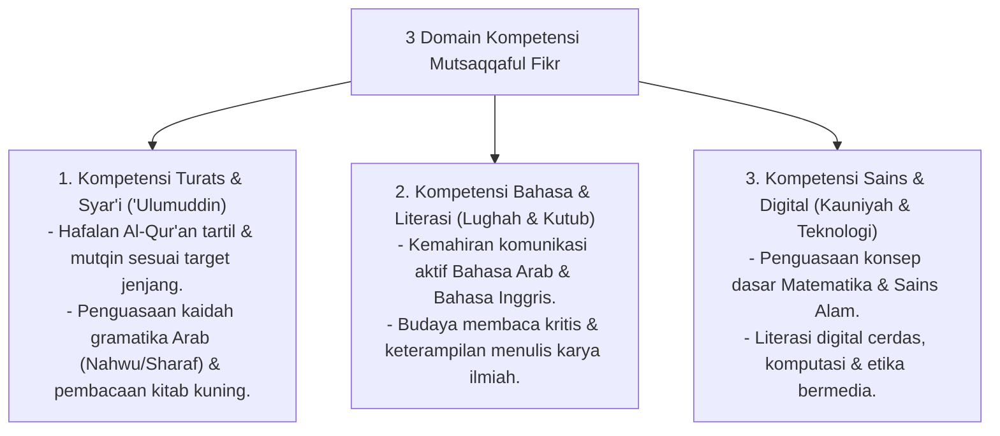

# P3-08-05-Standar-Kompetensi-dan-Taksonomi (Mutsaqqaful Fikr)

## Tujuan
Menetapkan **Standar Capaian Pembelajaran & Taksonomi Kompetensi** karakter Mutsaqqaful Fikr untuk seluruh jenjang santri di pesantren TUMBUH.

---

## 1. 3 Domain Kompetensi Mutsaqqaful Fikr

---

## 2. Matriks Capaian Berjenjang Sesuai Jenjang Kemandirian TUMBUH (J1–J4)

* **Jenjang T1 (Kelas 7 / 10 Baru)**: Menguasai makharijul huruf & tajwid dasar, hafal kaidah Jurumiyyah/Tashrif, aktif menghafal 10 kosakata baru per hari.
* **Jenjang T2 (Kelas 8 / 11)**: Mampu membaca kitab *Taisirul Khalaq* tanpa harakat, lancar percakapan bahasa arab/inggris asrama, menguasai metode muraja'ah mandiri.
* **Jenjang T3 (Kelas 9 / 12)**: Mampu menganalisis perbandingan hukum dalam kitab Fathul Qarib, menulis esai ilmiah 1000 kata, hafalan mutqin minimal 10 juz.
* **Jenjang T4 (Santri Akhir / Teladan)**: Menguasai metodologi Bahtsul Masail, membedah kitab tafsir/hadits tebal, membimbing belajar adik kelas (*Qudwah Ilmiyyah*).

---

## 3. Status Dokumen
* **Status**: 🌟 **A+ (Tervalidasi & Siap Diimplementasikan)**
* **Level**: Project 3 - `03 Capacity Framework / 08 Mutsaqqaful Fikr / 05 Competencies`
