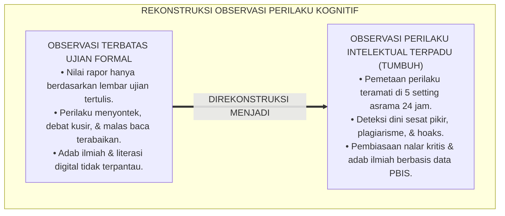
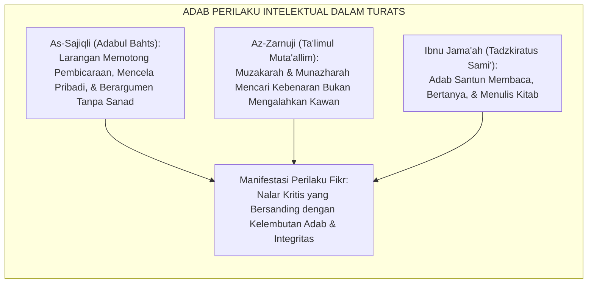
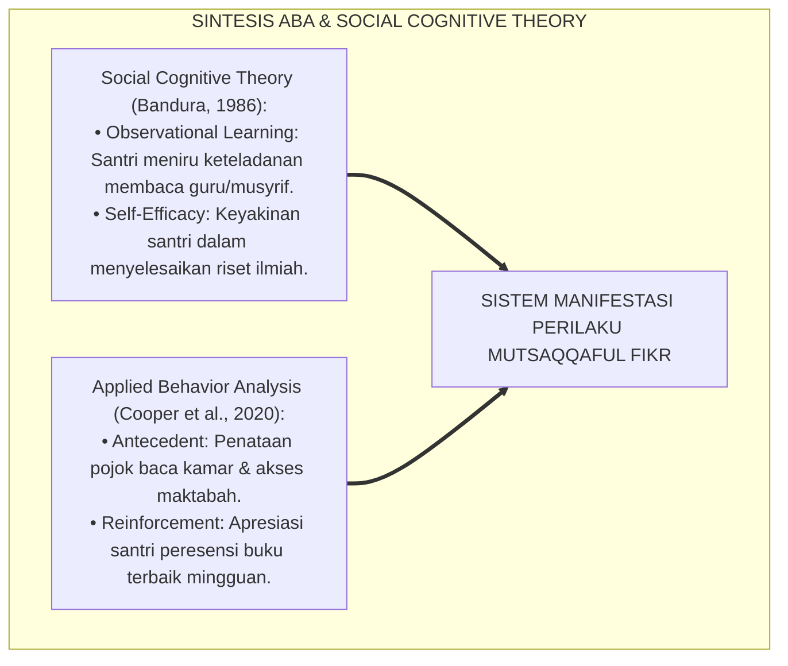
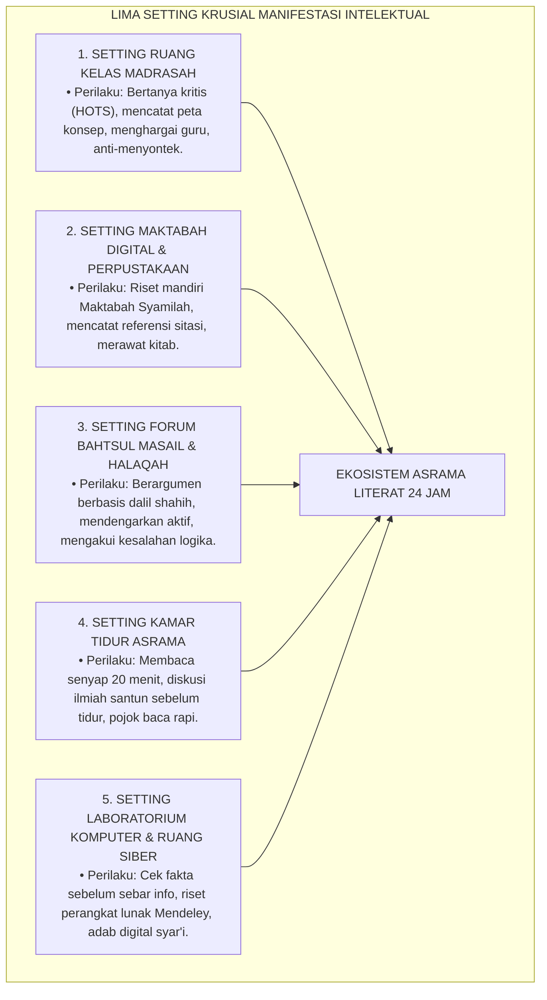
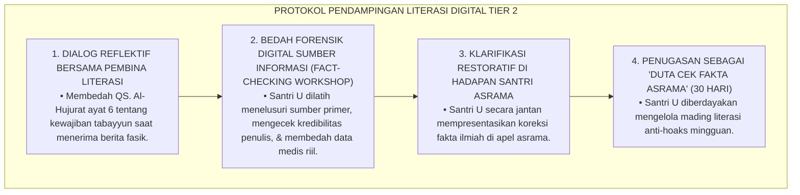
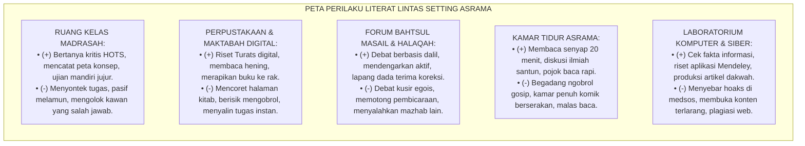

# P3-08-06: MANIFESTASI PERILAKU SANTRI MUTSAQQAFUL FIKR
## *Monograf Riset Akademik: Tipologi Indikator Perilaku Intelektual Teramati (Observable Intellectual Behaviors), Pemetaan Setting 24 Jam (Ruang Kelas Madrasah, Maktabah Digital, Halaqah Bahtsul Masail, Pojok Baca Kamar Tidur, & Ruang Siber/Laboratorium), Eliminasi Perilaku Defisit (Plagiarisme, Debat Kusir, Hoaks), dan Pembentukan Bi'ah 'Ilmiyyah di Pesantren*

**Nomor Identifikasi**: `P3-08-06/MONOGRAF-RISET-MANIFESTASI-PERILAKU-MUTSAQQAFUL-FIKR/2026`  
**Domain**: `03 Capacity Framework` > `08 Mutsaqqaful Fikr` (Sub-Modul 06: *Behavioral Manifestations*)  
**Klasifikasi Naskah**: *Academic Research Monograph* (Monograf Penelitian Observasi Perilaku Kognitif, Ekologi Intelektual Asrama, & Analitik Perilaku PBIS)  
**Rumpun Disiplin Pengkaji**: Analisis Perilaku Terapan (*Applied Behavior Analysis*), Sosiologi Pengetahuan Pesantren, Psikologi Kognitif Pendidikan, Manajemen Riset Komunitas  

---

> ### 💡 INTISARI EKSEKUTIF (EXECUTIVE SUMMARY)
>
> * **Kelemahan Pemantauan Kognitif Berbasis Ujian Formal Semata:**  
>   Evaluasi intelektual di pesantren kerap dibatasi hanya pada lembar jawaban ujian semester 2 jam di kelas madrasah. Akibatnya, perilaku intelektual nyata santri dalam kehidupan 24 jam—seperti kegemaran membaca mandiri di kamar tidur, etika berdialog saat berbeda pendapat di asrama, integritas tidak menyontek, dan kecakapan menyaring berita hoaks di gawai—luput dari observasi pembinaan.
> * **Katalog Manifestasi Perilaku Intelektual 24 Jam TUMBUH:**  
>   Ekosistem TUMBUH merumuskan **Katalog Manifestasi Perilaku Teramati (*Observable Intellectual Behavior Matrix*)** yang memetakan perilaku santri ke dalam dua kutub distingtif: *Indikator Perilaku Konstruktif-Intelektual (Target Benchmark Ilmiah)* dan *Indikator Perilaku Defisit/Sesat Pikir (Target Intervensi PBIS)* di 5 setting utama kehidupan asrama 24 jam.
> * **Standardisasi Observasi & Budaya Bi'ah 'Ilmiyyah:**  
>   Matriks ini menjadi instrumen bersama bagi guru madrasah, musyrif asrama, pustakawan, dan pembimbing halaqah untuk memantau, mendokumentasikan, dan memperkuat pembiasaan nalar kritis santri secara objektif dan beradab.

---

## 📑 DAFTAR ISI MONOGRAF

- [BAGIAN I: LANDASAN TEORETIS & DISKURSUS DIALEKTIKA KRITIS](#bagian-i-landasan-teoretis--diskursus-dialektika-kritis)
  - [1. Latar Belakang Masalah: Bahaya Pembatasan Evaluasi Intelektual pada Ruang Ujian Tertulis](#1-latar-belakang-masalah-bahaya-pembatasan-evaluasi-intelektual-pada-ruang-ujian-tertulis)
  - [2. Eksegesis Turats: Konsep Al-Adab fil Bahts wal Munazharah dalam Khazanah Islam](#2-eksegesis-turats-konsep-al-adab-fil-bahts-wal-munazharah-dalam-khazanah-islam)
  - [3. Konvergensi Sains Analisis Perilaku Terapan (ABA) & Teori Kognitif Sosial (Bandura)](#3-konvergensi-sains-analisis-perilaku-terapan-aba--teori-kognitif-sosial-bandura)
  - [4. Analisis Rekayasa Kausalitas Setting 24 Jam: Dari 'Kamar Pasif' Menuju 'Kamar Literasi Riset'](#4-analisis-rekayasa-kausalitas-setting-24-jam-dari-kamar-pasif-menuju-kamar-literasi-riset)
  - [5. Kasuistika Lapangan Klinis & Protokol De-eskalasi Santri yang Menyebarkan Berita Hoaks di Asrama](#5-kasuistika-lapangan-klinis--protokol-de-eskalasi-santri-yang-menyebarkan-berita-hoaks-di-asrama)
- [BAGIAN II: FORMULASI KONSEPTUAL & PEMBAHASAN MENDALAM](#bagian-ii-formulasi-konseptual--pembahasan-mendalam)
  - [1. Katalog Manifestasi Perilaku Berdasarkan Empat Pilar Mutsaqqaful Fikr](#1-katalog-manifestasi-perilaku-berdasarkan-empat-pilar-mutsaqqaful-fikr)
  - [2. Pemetaan Matriks Perilaku Lintas Setting Spasial Asrama 24 Jam](#2-pemetaan-matriks-perilaku-lintas-setting-spasial-asrama-24-jam)
  - [3. Matriks Diferensiasi Perilaku Ilmiah vs Perilaku Defisit Berdasarkan Jenjang J1–J4](#3-matriks-diferensiasi-perilaku-ilmiah-vs-perilaku-defisit-berdasarkan-jenjang-j1j4)
  - [4. Diskusi Akademis & Implikasi bagi Penegakan Integritas Ilmiah Pesantren](#4-diskusi-akademis--implikasi-bagi-penegakan-integritas-ilmiah-pesantren)
- [BAGIAN III: KESIMPULAN & APARATUS AKADEMIS](#bagian-iii-kesimpulan--aparatus-akademis)
  - [1. Tabel Sintesis Manifestasi Perilaku Mutsaqqaful Fikr](#1-tabel-sintesis-manifestasi-perilaku-mutsaqqaful-fikr)
  - [2. Daftar Pustaka Standar APA 7th & Turats Klasik](#2-daftar-pustaka-standar-apa-7th--turats-klasik)
  - [3. Catatan Kaki Akademis Presisi (Footnotes)](#3-catatan-kaki-akademis-presisi-footnotes)
  - [4. Glosarium Istilah Ilmiah & Observasi Perilaku Kognitif](#4-glosarium-istilah-ilmiah--observasi-perilaku-kognitif)

---

# BAGIAN I: LANDASAN TEORETIS & DISKURSUS DIALEKTIKA KRITIS

---

### 1. Latar Belakang Masalah: Bahaya Pembatasan Evaluasi Intelektual pada Ruang Ujian Tertulis

Dalam pengasuhan pesantren konvensional, evaluasi kapasitas berpikir santri kerap mengalami **tiga distorsi observasional (*Observational Distortions*)**:[^1]

1. **Jebakan Ujian Berbasis Angka Semata (*The Test Score Trap*)**: Nilai kognitif 100 pada ujian fiqih tidak menjamin bahwa santri tidak menyontek, tidak menjamin santri rajin membaca buku di asrama, dan tidak menjamin santri memiliki adab santun saat berbeda pendapat dengan teman sekamarnya.
2. **Ketiadaan Observasi Perilaku Literasi Harian**: Tidak ada pemantauan terhadap berapa judul buku yang dibaca santri di waktu luang, bagaimana santri memanfaatkan perpustakaan, atau bagaimana santri memverifikasi informasi yang beredar di asrama.
3. **Pembiaran Perilaku Debat Kusir & Ejekan Intelektual**: Santri yang pandai kerap mengejek santri yang lambat belajar (*Intellectual Bullying*), tanpa ada protokol intervensi musyrif untuk mengoreksi kesombongan kognitif tersebut.[^2]

Model riset **TUMBUH** merancang sistem indikator perilaku intelektual yang **konkret, teramati (*observable*), terukur, dan terintegrasi dalam seluruh ritme 24 jam**.

---

### 2. Eksegesis Turats: Konsep Al-Adab fil Bahts wal Munazharah dalam Khazanah Islam

Khazanah keilmuan Islam klasik memiliki disiplin ilmu khusus (*Adabul Bahts wal Munazharah*) yang mengatur tata krama perilaku seorang penuntut ilmu saat berdiskusi dan meneliti.

#### 📖 Kaidah Adab Debat Ilmiah Menurut Imam Ibnu Jama'ah
Imam **Ibnu Jama'ah Al-Kinanah** dalam *Tadzkiratus Sami' wal Mutakallim* menjelaskan:

$$\text{وَلَا يَقْصِدُ فِي الْمُبَاحَثَةِ الْمُغَالَبَةَ وَالْمُمَارَاةَ، بَلْ يَكُونُ قَصْدُهُ اسْتِخْرَاجَ الْحَقِّ وَإِظْهَارَهُ؛ وَإِذَا ظَهَرَ الْحَقُّ عَلَى لِسَانِ خَصْمِهِ انْقَادَ لَهُ وَشَكَرَهُ، وَلَا يَأْنَفُ مِنَ الرُّجُوعِ إِلَى الصَّوَابِ}$$

*"Dan janganlah ia bermaksud dalam diskusi ilmiah untuk mencari kemenangan ego atau mendebat kusir, melainkan tujuannya adalah **menggali kebenaran dan menampakkannya**. Apabila kebenaran tampak dari lisan lawan diskusinya, ia wajib tunduk menerimanya, berterima kasih kepadanya, dan tidak merasa gengsi untuk kembali kepada kebenaran!"*[^3]

---

### 3. Konvergensi Sains Analisis Perilaku Terapan (ABA) & Teori Kognitif Sosial (Bandura)

Pemantauan perilaku intelektual santri memadukan prinsip ABA dan teori permodelan sosial:

---

### 4. Analisis Rekayasa Kausalitas Setting 24 Jam: Dari 'Kamar Pasif' Menuju 'Kamar Literasi Riset'

Perilaku berpikir santri dipantau secara konkret di 5 setting lingkungan fisik:

---

### 5. Kasuistika Lapangan Klinis & Protokol De-eskalasi Santri yang Menyebarkan Berita Hoaks di Asrama

#### Studi Kasus Lapangan: Penyebaran Berita Hoaks Teori Konspirasi Vaksin/Kesehatan di Asrama
* **Konteks Masalah**: Santri U (15 tahun, Jenjang J2) membaca pesan berantai sensasional di grup obrolan tentang konspirasi kesehatan. Tanpa tabayyun, ia menyebarkannya ke seluruh santri asrama, memicu kepanikan dan keengganan berobat ke Poskestren.
* **Analisis Diagnostik**: Santri U mengalami *Confirmation Bias* dan defisit literasi verifikasi informasi digital (*Lack of Fact-Checking Skills*).
* **Protokol De-eskalasi Literasi Digital TUMBUH**:

Intervensi ini berhasil mengubah Santri U dari penyebar hoaks menjadi pelopor literasi verifikasi fakta yang sangat kritis dan diandalkan asrama.[^4]

---

# BAGIAN II: FORMULASI KONSEPTUAL & PEMBAHASAN MENDALAM

---

### 1. Katalog Manifestasi Perilaku Berdasarkan Empat Pilar Mutsaqqaful Fikr

Tabel berikut menyajikan pemetaan komparatif antara perilaku ilmiah yang diharapkan (*Target Benchmarks*) dan perilaku defisit yang harus diintervensi (*Deficit Indicators*):

| Pilar Mutsaqqaful Fikr | Manifestasi Perilaku Konstruktif-Ilmiah (*Target Benchmarks*) | Manifestasi Perilaku Defisit/Sesat Pikir (*Intervention Targets*) |
| :--- | :--- | :--- |
| **1. Ma'rifah Turatsiyyah** | • Membaca kitab kuning dengan kaidah nahwu-sharaf yang benar. • Menyebutkan dalil ayat dan hadits beserta takhrijnya secara tepat. • Memahami konteks asbabun nuzul dan asbabul wurud nash. • Menghargai keragaman ijtihad mazhab fikih secara objektif. • Merawat fisik kitab dan mushaf Al-Qur'an dengan adab mulia. | • Membaca kitab serampangan tanpa memperhatikan kaidah gramatika. • Mengutip dalil sepotong-sepotong di luar konteks aslinya. • Mengklaim satu pendapat mazhab sebagai satu-satunya kebenaran mutlak. • Meremehkan fatwa ulama klasik atas nama 'kembali ke Al-Qur'an'. • Meletakkan kitab sembarangan di lantai atau melipat halaman secara kasar. |
| **2. Tafakkur Naqdiy** | • Mengajukan pertanyaan reflektif tingkat tinggi (*HOTS*) di kelas. • Mengidentifikasi sesat pikir (*Logical Fallacy*) dalam teks/argumen. • Mengakui kekeliruan nalar sendiri saat terbukti salah dalam diskusi. • Menggunakan logika silogisme mantiq yang runut dan logis. • Memonitor strategi belajar mandiri (kesadaran metakognisi). | • Bertanya semata-mata untuk menguji atau mempermalukan guru. • Menggunakan argumen menyerang pribadi lawan (*Ad Hominem*). • Keras kepala mempertahankan argumen keliru demi gengsi ego. • Berpikir hitam-putih (*False Dilemma*) dan menyimpulkan tergesa-gesa. • Belajar pasif tanpa memahami kelemahan pemahaman dirinya. |
| **3. Literasi Sains & Riset** | • Membaca mandiri minimal 2 buku non-pelajaran per bulan. • Menyusun Karya Tulis Ilmiah (KTI) dengan metodologi yang sahih. • Menggunakan data statistik dan bukti empiris secara jujur. • Memanfaatkan fasilitas Maktabah perpustakaan secara teratur. • Menulis resensi buku dan artikel opini ilmiah secara berkala. | • Malas membaca dan hanya mengandalkan rangkuman instan kawan. • Menyalin utuh karya tulis orang lain tanpa sitasi (Plagiarisme). • Memanipulasi atau mengarang data riset agar sesuai keinginan. • Mengabaikan jam kunjungan perpustakaan untuk mengobrol sia-sia. • Tidak mampu menyusun tulisan terstruktur lebih dari satu paragraf. |
| **4. Literasi Digital** | • Memverifikasi keaslian informasi (Cek Fakta) sebelum membagikannya. • Menggunakan perangkat lunak sitasi (Mendeley/Zotero) secara terampil. • Memanfaatkan internet untuk riset Maktabah Syamilah & jurnal sains. • Menerapkan etika komunikasi digital yang santun dan syar'i. • Memproduksi konten dakwah literasi yang mencerahkan di media sosial. | • Langsung percaya dan menyebarkan berita sensasional/hoaks. • Mengunduh karya digital bajakan secara ilegal tanpa izin. • Menggunakan akses internet riset untuk bermain game/konten nir-faedah. • Berkomentar kasar, mencaci, dan menyebarkan ujaran kebencian di siber. • Mengabaikan hak cipta dan atribusi kekayaan intelektual orang lain. |

---

### 2. Pemetaan Matriks Perilaku Lintas Setting Spasial Asrama 24 Jam

---

### 3. Matriks Diferensiasi Perilaku Ilmiah vs Perilaku Defisit Berdasarkan Jenjang J1–J4

| Jenjang Pendidikan | Indikator Perilaku Konstruktif Utama (*Benchmark J1–J4*) | Indikator Perilaku Kritis yang Wajib Diintervensi |
| :--- | :--- | :--- |
| **Jenjang J1 (Kelas 7)** | • Membaca buku mandiri di pojok baca kamar minimal 20 menit harian. • Menulis ringkasan peta konsep bab kitab yang dipelajari. • Berani bertanya kepada guru saat belum memahami materi. | • Menyontek pekerjaan rumah (PR) teman di pagi hari sebelum kelas. • Menyimpan komik/bacaan nir-faedah di dalam loker kitab suci. • Menolak membaca buku non-pelajaran karena malas. |
| **Jenjang J2 (Kelas 8–9)** | • Menunjukkan kemampuan mengidentifikasi sesat pikir (*Logical Fallacy*). • Menyusun esai perbandingan dalil fikih minimal 1.000 kata. • Memverifikasi kebenaran berita digital sebelum mempercayainya. | • Menggunakan argumen menyerang pribadi saat berselisih dengan kawan. • Menyebarkan informasi hoaks atau teori konspirasi di kamar asrama. • Fanatik buta membela pendapat kelompoknya tanpa dasar dalil. |
| **Jenjang J3 (Kelas 10–11)** | • Menyelesaikan penulisan Karya Tulis Ilmiah (KTI) bebas plagiasi. • Mengoperasikan Maktabah Syamilah digital dan aplikasi Mendeley. • Berperan aktif sebagai notulen/pembicara dalam Bahtsul Masail. | • Menyalin draf KTI dari internet tanpa atribusi (*Copy-Paste Plagiarism*). • Malas berkunjung ke perpustakaan untuk mencari rujukan primer. • Bersikap sombong dan meremehkan adik kelas yang bertanya. |
| **Jenjang J4 (Kelas 12)** | • Menjadi mentor riset dan pembimbing belajar adik kelas J1. • Menulis artikel ilmiah yang dipublikasikan di media massa/jurnal santri. • Menampilkan kerendahan hati intelektual (*Intellectual Humility*). | • Bersikap apatis terhadap kajian ilmiah dengan dalih 'fokus ujian akhir'. • Menggunakan kecerdasannya untuk memanipulasi aturan asrama. • Enggan berbagi ilmu atau membimbing adik kelas yang membutuhkan. |

---

### 4. Diskusi Akademis & Implikasi bagi Penegakan Integritas Ilmiah Pesantren

Penerapan katalog manifestasi perilaku Mutsaqqaful Fikr mentransformasikan kultur belajar pesantren:

1. **Transformasi Budaya Belajar Aktif (*Active Learning Culture*)**: Santri menjadi subjek aktif pencari ilmu yang haus membaca dan meneliti, meruntuhkan budaya pasif mendengarkan semata.
2. **Kemandirian Bernalar Kritis Santri**: Santri memiliki filter internal yang kokoh terhadap gempuran disinformasi, radikalisme, dan pemikiran menyimpang di era digital.
3. **Penyempurnaan Bi'ah 'Ilmiyyah Asrama**: Asrama bertransformasi menjadi laboratorium peradaban di mana setiap sudut ruangan memancarkan semangat ilmu, adab, dan riset.[^5]

---

# BAGIAN III: KESIMPULAN & APARATUS AKADEMIS

---

### 1. Tabel Sintesis Manifestasi Perilaku Mutsaqqaful Fikr

| Setting Kehidupan 24 Jam | Tantangan Perilaku Kunci | Manifestasi Perilaku Diharapkan (TUMBUH) | Protokol Pengawasan Musyrif | Bukti Terukur Capaian |
| :--- | :--- | :--- | :--- | :--- |
| **1. Ruang Kelas Madrasah** | Pasif, menyontek, hafalan dangkal. | Bertanya kritis HOTS, mencatat peta konsep, ujian jujur. | Observasi Keaktifan Kelas & Rubrik Integritas Akademik. | 0% kasus menyontek; partisipasi diskusi kelas $\ge 90\%$. |
| **2. Perpustakaan & Maktabah** | Jarang membaca, menyalin tugas instan. | Riset mandiri Maktabah Syamilah, sitasi rapi, resensi buku. | Logbook Kunjungan Perpustakaan & Monitoring Peminjaman Buku. | Rata-rata santri membaca $\ge 20\text{ buku/tahun}$. |
| **3. Bahtsul Masail & Halaqah** | Debat kusir, fanatisme mazhab, emosional. | Argumentasi dalil shahih, mendengarkan aktif, adab ikhtilaf. | Rubrik Debat Ilmiah & Evaluasi Musyrif Halaqah. | Diskusi berlangsung santun tanpa insiden pertengkaran. |
| **4. Kamar Tidur Asrama** | Mengobrol sia-sia, komik berserakan. | Membaca senyap 20 menit, pojok baca kamar rapi, diskusi santun. | Inspeksi Pojok Baca Kamar & Jam Membaca Senyap Harian. | Seluruh kamar memiliki pojok literasi terawat rapi. |
| **5. Lab Komputer & Siber** | Hoaks, game berlebih, plagiarisme web. | Cek fakta digital, riset Mendeley, produksi artikel dakwah. | Log Aktivitas Internet Riset & Uji Similaritas KTI. | KTI santri lolos uji similaritas Turnitin $< 15\%$. |

---

### 2. Daftar Pustaka Standar APA 7th & Turats Klasik

1. **Al-Jabiri, Muhammad Abid.** (1990). *Bunyatu Al-'Aql Al-'Arabi*. Beirut: Markaz Dirasat Al-Wihdah Al-'Arabiyyah.
2. **Bandura, A.** (1986). *Social Foundations of Thought and Action: A Social Cognitive Theory*. Englewood Cliffs: Prentice-Hall.
3. **Cooper, J. O., Heron, T. E., & Heward, W. L.** (2020). *Applied Behavior Analysis* (3rd ed.). Boston: Pearson.
4. **Ibnu Abdil Barr, Abu Umar Yusuf bin Abdillah.** (1994). *Jami' Bayanil 'Ilmi wa Fadhlih*. Riyadh: Dar Ibn Al-Jauzi.
5. **Ibnu Jama'ah, Badruddin Muhammad bin Ibrahim.** (2012). *Tadzkiratus Sami' wal Mutakallim fi Adabil 'Alim wal Muta'allim*. Beirut: Dar Al-Basyair Al-Islamiyyah.
6. **Paul, R., & Elder, L.** (2019). *Critical Thinking: Tools for Taking Charge of Your Learning and Your Life* (3rd ed.). Boston: Pearson.
7. **Sajiqli Zadah, Muhammad bin Abi Bakr.** (2006). *Risalah fi Adabil Bahats wal Munazharah*. Kairo: Dar As-Salam.
8. **Sugai, G., & Horner, R. H.** (2020). *School-Wide Positive Behavioral Interventions and Supports: Implementation Practices*. *Journal of Positive Behavior Interventions*, 22(4), 203-211.
9. **Zarnuji, Burhanul Islam.** (2010). *Ta'limul Muta'allim Thariqat Ta'allum*. Beirut: Dar Ibn Hazm.
10. **Zehr, H.** (2015). *The Little Book of Restorative Justice*. New York: Good Books.

---

### 3. Catatan Kaki Akademis Presisi (Footnotes)

[^1]: Kritik terhadap pembatasan evaluasi intelektual semata pada ujian formal tertulis, Paul & Elder (2019, hlm. 36).  
[^2]: Pembahasan fenomena intellectual bullying dan arogansi kognitif pada pelajar remaja, Bandura (1986, hlm. 142).  
[^3]: Ibnu Jama'ah, *Tadzkiratus Sami' wal Mutakallim* (2012, hlm. 64).  
[^4]: Protokol edukasi literasi verifikasi fakta dan de-eskalasi hoaks digital santri, Cooper, Heron, & Heward (2020, hlm. 215).  
[^5]: Dampak kelembagaan penerapan standar Bi'ah 'Ilmiyyah TUMBUH Pesantren (2026).  

---

### 4. Glosarium Istilah Ilmiah & Observasi Perilaku Kognitif

1. **Observable Intellectual Behaviors**: Tindakan nyata aktivitas bernalar, membaca, berdialog, dan meneliti yang dapat diamati dan dicatat frekuensinya secara objektif.
2. **Bi'ah 'Ilmiyyah (الْبِيئَةُ الْعِلْمِيَّةُ)**: Ekosistem lingkungan sosial dan fisik yang merangsang kecintaan pada ilmu, nalar kritis, dan tradisi riset berkelanjutan.
3. **Adabul Bahts wal Munazharah (آدَابُ الْبَحْثِ وَالْمُنَاظَرَةِ)**: Disiplin ilmu etika metodologis dalam mengkaji teks, menyusun argumen, dan berdebat secara ilmiah dan beradab.
4. **Ad Hominem**: Kesesatan berpikir di mana seseorang menyerang pribadi, fisik, atau latar belakang lawan bicara alih-alih mengkritisi substansi argumennya.
5. **Confirmation Bias**: Kecenderungan psikologis seseorang untuk hanya mempercayai informasi yang mendukung keyakinan awalnya dan mengabaikan fakta yang membantahnya.
6. **Fact-Checking (Cek Fakta)**: Proses verifikasi kebenaran dan keakuratan suatu klaim berita menggunakan sumber-sumber rujukan primer yang terpercaya.
7. **Pojok Baca Kamar**: Fasilitas rak buku mini di setiap kamar tidur asrama untuk mendukung pembiasaan membaca senyap 20 menit sebelum tidur.
8. **Maktabah Syamilah**: Basis data digital ensiklopedia ribuan kitab Turats Islam klasik dan kontemporer yang digunakan untuk riset dalil terpadu.
9. **Steel-Manning Argument**: Kemampuan merekonstruksi argumen lawan ke bentuk yang paling kuat sebelum memberikan kritik ilmiah.
10. **Silent Reading (Membaca Senyap)**: Aktivitas membaca mandiri dalam suasana hening untuk meningkatkan daya fokus, perbendaharaan kata, dan pemahaman mendalam.
