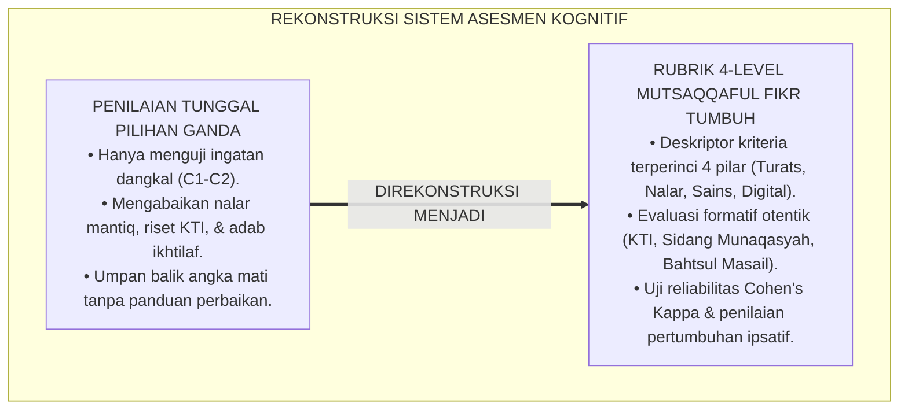
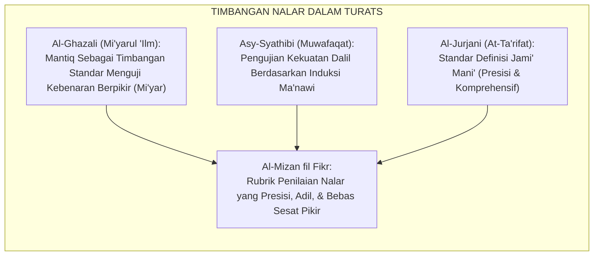
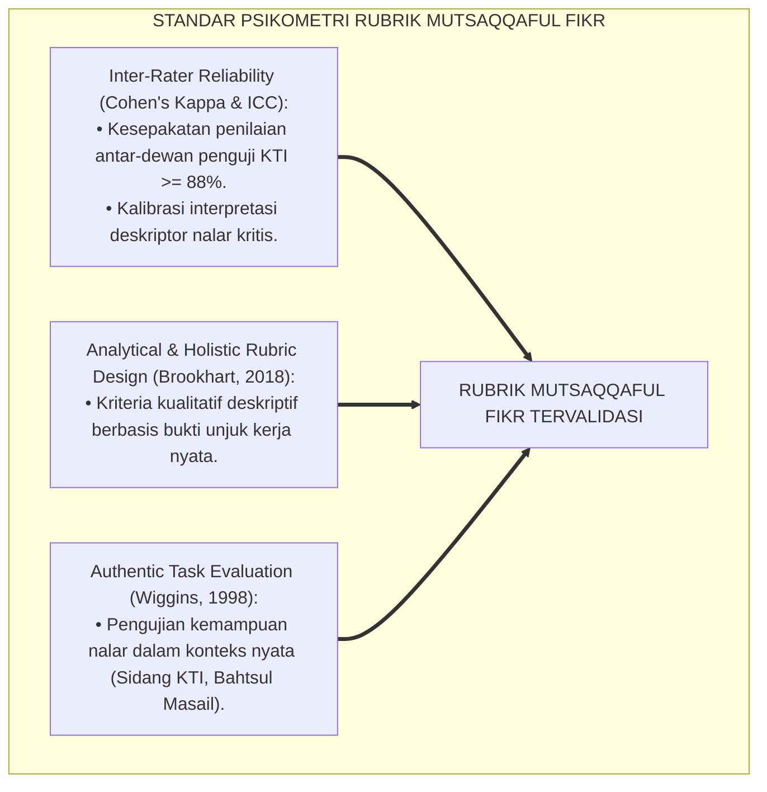
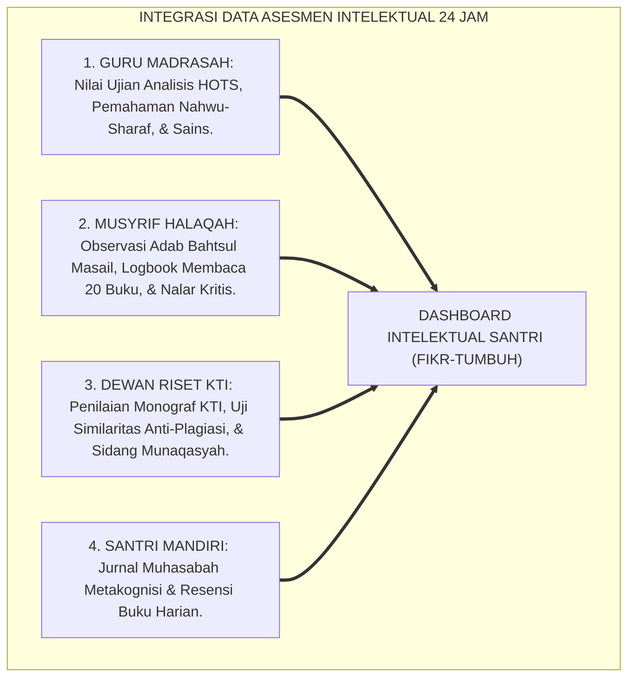
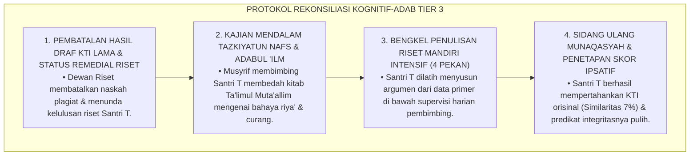
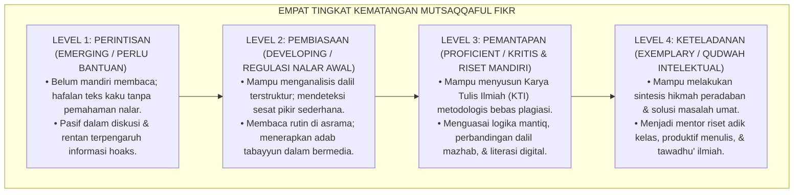
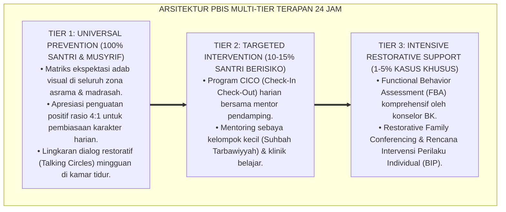

# P3-08-07: RUBRIK INDIKATOR PERILAKU 4-LEVEL MUTSAQQAFUL FIKR
## *Monograf Riset Akademik: Perancangan Rubrik Asesmen Kinerja Intelektual Berbasis Kriteria (Criterion-Referenced Rubrics), Gradasi Deskriptor 4 Level Kematangan Nalar, Protokol Pengujian Reliabilitas Inter-Rater, Serta Skoring Indeks Nalar Kritis Terpadu di Pesantren 24 Jam*

**Nomor Identifikasi**: `P3-08-07/MONOGRAF-RISET-RUBRIK-4LEVEL-MUTSAQQAFUL-FIKR/2026`  
**Domain**: `03 Capacity Framework` > `08 Mutsaqqaful Fikr` (Sub-Modul 07: *4-Level Behavior Rubric*)  
**Klasifikasi Naskah**: *Academic Research Monograph* (Monograf Penelitian Asesmen Kinerja Berpikir Kritis, Psikometri Rubrik KTI, & Evaluasi Nalar Mantiq)  
**Rumpun Disiplin Pengkaji**: Psikometri Kognitif Pendidikan, Desain Rubrik Kinerja Otentik, Evaluasi Riset Santri, Metodologi Asesmen Komparatif  

---

> ### 💡 INTISARI EKSEKUTIF (EXECUTIVE SUMMARY)
>
> * **Krisis Instrumen Penilaian Kognitif Tradisional:**  
>   Penilaian kemampuan berpikir di madrasah/pesantren konvensional didominasi oleh soal-soal pilihan ganda yang hanya menguji ingatan jangka pendek (*Recall Memory*). Tidak ada instrumen rubrik analitik terstandarisasi untuk menilai kedalaman analisis dalil santri, orisinalitas ide dalam karya tulis ilmiah (KTI), adab santun saat debat Bahtsul Masail, dan kemandirian literasi membaca harian di asrama.
> * **Arsitektur Rubrik 4-Level Mutsaqqaful Fikr TUMBUH:**  
>   Ekosistem TUMBUH merumuskan **Rubrik Asesmen Kinerja Intelektual 4-Level Berbasis Kriteria Faktual (*Criterion-Referenced Intellectual Rubrics*)** untuk keempat pilar: (1) *Level 1: Perintisan / Perlu Bimbingan (Emerging / Literasi Dasar)*, (2) *Level 2: Pembiasaan / Berkembang Terbimbing (Developing / Nalar Analitis Awal)*, (3) *Level 3: Pemantapan / Kritis & Riset Mandiri (Proficient / Penulisan KTI & Mantiq)*, dan (4) *Level 4: Keteladanan / Qudwah Intelektual (Exemplary / Sintesis Hikmah & Kepemimpinan Fikr)*.
> * **Metodologi Pengujian & Evaluasi Ipsatif:**  
>   Monograf ini menetapkan protokol kalibrasi penilai lintas penguji riset (*Inter-Rater Agreement Cohen's Kappa $\ge 0.88$*), algoritma pembobotan skor komposit ($IK_{MF}$), serta implementasi evaluasi pertumbuhan nalar ipsatif longitudinal sepanjang 6 tahun jenjang J1–J4.

---

## 📑 DAFTAR ISI MONOGRAF

- [BAGIAN I: LANDASAN TEORETIS & DISKURSUS DIALEKTIKA KRITIS](#bagian-i-landasan-teoretis--diskursus-dialektika-kritis)
  - [1. Latar Belakang Masalah: Bahaya Reduksionisme Soal Pilihan Ganda & Ilusi Nilai Rapor Kognitif](#1-latar-belakang-masalah-bahaya-reduksionisme-soal-pilihan-ganda--ilusi-nilai-rapor-kognitif)
  - [2. Eksegesis Turats: Konsep Al-Mizan fil Fikr & Standar Pengujian Keshahihan Hujjah](#2-eksegesis-turats-konsep-al-mizan-fil-fikr--standar-pengujian-keshahihan-hujjah)
  - [3. Konvergensi Sains Psikometri: Authentic Performance Assessment & Rubrik Analitik Holistic-Analytic](#3-konvergensi-sains-psikometri-authentic-performance-assessment--rubrik-analitik-holistic-analytic)
  - [4. Rekayasa Sistem Asesmen Intelektual 24 Jam: Integrasi Guru Madrasah, Musyrif Halaqah, & Dewan Riset](#4-rekayasa-sistem-asesmen-intelektual-24-jam-integrasi-guru-madrasah-musyrif-halaqah--dewan-riset)
  - [5. Kasuistika Lapangan Klinis & Protokol Resolusi Anomali Disparitas Nilai Kognitif Santri](#5-kasuistika-lapangan-klinis--protokol-resolusi-anomali-disparitas-nilai-kognitif-santri)
- [BAGIAN II: FORMULASI KONSEPTUAL & PEMBAHASAN MENDALAM](#bagian-ii-formulasi-konseptual--pembahasan-mendalam)
  - [1. Arsitektur Komprehensif Rubrik 4-Level Karakter Mutsaqqaful Fikr](#1-arsitektur-komprehensif-rubrik-4-level-karakter-mutsaqqaful-fikr)
  - [2. Matriks Rinci Deskriptor Kinerja 4 Level Berdasarkan Empat Pilar Inti](#2-matriks-rinci-deskriptor-kinerja-4-level-berdasarkan-empat-pilar-inti)
  - [3. Panduan Pembobotan, Skoring Ipsatif, dan Penentuan Kelayakan Riset Jenjang J1–J4](#3-panduan-pembobotan-skoring-ipsatif-dan-penentuan-kelayakan-riset-jenjang-j1j4)
  - [4. Diskusi Akademis & Implikasi bagi Tata Kelola Penjaminan Mutu Akademik Pesantren](#4-diskusi-akademis--implikasi-bagi-tata-kelola-penjaminan-mutu-akademik-pesantren)
- [BAGIAN III: KESIMPULAN & APARATUS AKADEMIS](#bagian-iii-kesimpulan--aparatus-akademis)
  - [1. Tabel Sintesis Struktur Rubrik 4-Level Mutsaqqaful Fikr](#1-tabel-sintesis-struktur-rubrik-4-level-mutsaqqaful-fikr)
  - [2. Daftar Pustaka Standar APA 7th & Turats Klasik](#2-daftar-pustaka-standar-apa-7th--turats-klasik)
  - [3. Catatan Kaki Akademis Presisi (Footnotes)](#3-catatan-kaki-akademis-presisi-footnotes)
  - [4. Glosarium Istilah Ilmiah & Psikometri Kognitif](#4-glosarium-istilah-ilmiah--psikometri-kognitif)

---

# BAGIAN I: LANDASAN TEORETIS & DISKURSUS DIALEKTIKA KRITIS

---

### 1. Latar Belakang Masalah: Bahaya Reduksionisme Soal Pilihan Ganda & Ilusi Nilai Rapor Kognitif

Dalam evaluasi capaian kognitif di madrasah/pesantren konvensional, sering terjadi **tiga kelemahan asesmen (*Assessment Vulnerabilities*)**:[^1]

1. **Jebakan Soal Pilihan Ganda Dangkal (*Multiple-Choice Trap*)**: Evaluasi hanya menguji kemampuan santri memilih jawaban A, B, C, atau D dari potongan hafalan teks, tanpa mampu memotret bagaimana santri menyusun alur logika, menguji asumsi, atau mempertahankan argumen dalil.
2. **Ketiadaan Rubrik Penilaian Karya Tulis Ilmiah yang Objektif**: Guru menilai makalah atau esai santri hanya berdasarkan ketebalan halaman atau keindahan tulisan tangan, tanpa kriteria analitik yang mengukur orisinalitas, validitas metodologi, dan kekuatan analisis data.
3. **Pengabaian Adab Akademik dalam Penilaian Nilai Kognitif**: Nilai rapor kognitif tidak memasukkan unsur integritas anti-plagiasi, kejujuran saat ujian, dan adab tawadhu' dalam berdiskusi.[^2]

Model riset **TUMBUH** merancang **Rubrik 4-Level Berbasis Kriteria Faktual (*Criterion-Referenced Rubrics*)** yang memberikan umpan balik diagnostik terperinci bagi perkembangan nalar kritis dan integritas ilmiah santri.

---

### 2. Eksegesis Turats: Konsep Al-Mizan fil Fikr & Standar Pengujian Keshahihan Hujjah

Para ulama ushul fiqh dan mantiq Islam menetapkan timbangan nalar (*Al-Mizan*) yang sangat ketat untuk menguji derajat keabsahan suatu argumentasi (*Taqwimul Hujjah*).

#### 📖 Formulasi Imam Al-Ghazali dalam *Mi'yarul 'Ilm*
Imam **Al-Ghazali** menegaskan kedudukan ilmu logika mantiq sebagai alat timbang (*Mi'yar*) seluruh keilmuan:

$$\text{مَنْ لَا يُحِيطُ بِالْمَنْطِقِ فَلَا ثِقَةَ لَهُ بِعُلُومِهِ أَصْلًا؛ فَإِنَّهُ الْمِعْيَارُ الَّذِي تُوزَنُ بِهِ الْأَدِلَّةُ، فَيَتَبَيَّنُ بِهِ صَحِيحُهَا مِنْ فَاسِدِهَا، وَرَاجِحُهَا مِنْ مَرْجُوحِهَا}$$

*"Barangsiapa yang tidak menguasai ilmu mantiq (kaidah logika penalaran), maka tidak ada kepercayaan sama sekali terhadap keilmuannya; karena mantiq adalah **timbangan standar (Al-Mi'yar) yang digunakan untuk menakar kekuatan seluruh dalil**, sehingga tampak jelas mana dalil yang sahih dari yang rusak, dan mana dalil yang kuat (rajih) dari yang lemah (marjuh)!"*[^3]

---

### 3. Konvergensi Sains Psikometri: Authentic Performance Assessment & Rubrik Analitik Holistic-Analytic

Pengembangan rubrik Mutsaqqaful Fikr memadukan standar asesmen kinerja otentik dan psikometri kognitif:

---

### 4. Rekayasa Sistem Asesmen Intelektual 24 Jam: Integrasi Guru Madrasah, Musyrif Halaqah, & Dewan Riset

Asesmen Mutsaqqaful Fikr dioperasionalkan melalui integrasi multi-penilai:

---

### 5. Kasuistika Lapangan Klinis & Protokol Resolusi Anomali Disparitas Nilai Kognitif Santri

#### Studi Kasus Lapangan: Santri Meraih Nilai 100 Ujian Fiqih Tetapi KTI-nya Terbukti Plagiat
* **Konteks Masalah**: Santri T (16 tahun, Jenjang J3) memperoleh nilai sempurna 100 pada ujian tulis fiqih madrasah. Namun saat mengumpulkan naskah KTI kelulusan, sistem mendeteksi tingkat plagiarisme 60% (*Severe Academic Dishonesty*). Terjadi **Disparitas Ekstrem antara Prestasi Hafalan dan Integritas Ilmiah**.
* **Analisis Diagnostik**: Santri T memiliki daya ingat mekanistik tinggi (*High Retrieval Skill*), namun memiliki defisit integritas akademik (*Amanah 'Ilmiyyah Deficit*) dan belum memahami filosofi orisinalitas riset.
* **Protokol Rekonsiliasi & Pembinaan Terpadu TUMBUH**:

Pendekatan ini berhasil menyadarkan Santri T bahwa kemuliaan penuntut ilmu terletak pada kejujuran dan orisinalitas, bukan pada nilai angka semu.[^4]

---

# BAGIAN II: FORMULASI KONSEPTUAL & PEMBAHASAN MENDALAM

---

### 1. Arsitektur Komprehensif Rubrik 4-Level Karakter Mutsaqqaful Fikr

Empat level kematangan karakter Mutsaqqaful Fikr distandarisasi sebagai berikut:

---

### 2. Matriks Rinci Deskriptor Kinerja 4 Level Berdasarkan Empat Pilar Inti

#### Matriks Rubrik Analitik Mutsaqqaful Fikr:

| Pilar Karakter | Level 1: Perintisan (*Emerging*) | Level 2: Pembiasaan (*Developing*) | Level 3: Pemantapan (*Proficient*) | Level 4: Keteladanan (*Exemplary/Qudwah*) |
| :--- | :--- | :--- | :--- | :--- |
| **1. Ma'rifah Turatsiyyah** | Membaca kitab masih terbata-bata; menghafal matan tanpa paham arti; pasif saat kajian nahwu-sharaf. | Membaca kitab kuning berharakat dengan benar; memahami terjemah dan peta konsep bab fikih ibadah. | Menguasai metodologi Ushul Fiqh (*Al-Waraqat*); menganalisis dalil perbandingan mazhab secara komparatif. | Menguasai istinbath hukum komparatif (*Bidayatul Mujtahid*); mampu menjelaskan Maqashid Syari'ah terapan secara mendalam. |
| **2. Tafakkur Naqdiy** | Mengulang-ulang hafalan tanpa nalar; tidak mampu membedakan fakta vs opini; sering memakai argumen ad hominem. | Mampu mengidentifikasi 5 sesat pikir utama (*Logical Fallacy*); aktif dalam debat terstruktur dengan santun. | Menyusun silogisme mantiq yang valid; membedah jurnal ilmiah kritis; memiliki kesadaran metakognisi tinggi. | Mampu mensintesiskan pemikiran multidisipliner (Turats, Sains, Filsafat); merumuskan solusi krisis peradaban. |
| **3. Literasi Sains & Riset** | Jarang membaca buku non-pelajaran; tulisan tidak terstruktur; menyontek tugas makalah orang lain. | Membaca mandiri minimal 15 buku/tahun; menulis esai ilmiah 1.500 kata; memahami metode observasi sains. | Menyusun Monograf KTI $\ge 20\text{ halaman}$ terstandarisasi APA 7th; uji similaritas $< 15\%$; sidang munaqasyah lulus. | Mempublikasikan artikel ilmiah di jurnal santri / media nasional; memimpin proyek riset inovatif pesantren. |
| **4. Literasi Digital** | Mudah percaya dan membagikan berita hoaks; menyalin artikel web tanpa sitasi; bermain gawai nir-faedah. | Menerapkan adab tabayyun; mampu memverifikasi keaslian berita digital (Cek Fakta) via mesin pencari ilmiah. | Terampil mengoperasikan Maktabah Syamilah digital & aplikasi Mendeley; adab komunikasi siber beradab. | Memproduksi konten dakwah digital berbasis riset ilmiah; menjadi benteng literasi anti-disinformasi komunitas. |

---

### 3. Panduan Pembobotan, Skoring Ipsatif, dan Penentuan Kelayakan Riset Jenjang J1–J4

#### Rumus Perhitungan Indeks Karakter Mutsaqqaful Fikr ($IK_{MF}$):
Skor komposit dihitung melalui triangulasi multi-sumber:

$$IK_{MF} = (0.20 \times S_{Guru}) + (0.25 \times S_{Musyrif}) + (0.35 \times S_{DewanRiset}) + (0.10 \times S_{Santri}) + (0.10 \times S_{Peer})$$

*Keterangan*:
* $S_{Guru}$: Skor Asesmen Kognitif HOTS & Ujian Madrasah (Skala 1.00 s/d 4.00)
* $S_{Musyrif}$: Skor Observasi Literasi Asrama & Adab Bahtsul Masail (Skala 1.00 s/d 4.00)
* $S_{DewanRiset}$: Skor Karya Tulis Ilmiah (KTI) & Sidang Munaqasyah (Skala 1.00 s/d 4.00)
* $S_{Santri}$: Skor Jurnal Metakognisi & Resensi Buku Mandiri (Skala 1.00 s/d 4.00)
* $S_{Peer}$: Skor Integritas Akademik & Debat Sebaya (Skala 1.00 s/d 4.00)

#### Standar Kenaikan Jenjang Kemandirian Intelektual:
* **Kenaikan J1 ke J2**: Santri wajib mencapai minimal **$IK_{MF} \ge 2.00$ (Level Pembiasaan)** & Membaca 15 Buku.
* **Kenaikan J2 ke J3**: Santri wajib mencapai minimal **$IK_{MF} \ge 2.75$** & Lulus Uji Esai Analisis Dalil Mazhab.
* **Kenaikan J3 ke J4**: Santri wajib mencapai minimal **$IK_{MF} \ge 3.25$ (Level Pemantapan)** & Naskah KTI Lolos Uji Similaritas $< 15\%$.
* **Kelulusan Paripurna (J4)**: Santri wajib mencapai rata-rata **$IK_{MF} \ge 3.50$ (Level Qudwah Intelektual)** & Lulus Sidang Munaqasyah Terbuka.[^5]

---

### 4. Diskusi Akademis & Implikasi bagi Tata Kelola Penjaminan Mutu Akademik Pesantren

Implementasi rubrik 4-level Mutsaqqaful Fikr menghasilkan standar baru evaluasi pesantren:

1. **Penilaian Berbasis Kinerja Nyata (*Performance-Based Assessment*)**: Kelulusan santri tidak lagi ditentukan oleh hafalan sesaat di malam ujian, melainkan oleh portofolio riset dan adab ilmiah yang konsisten.
2. **Kultur Apresiasi Intelektual Berkeadilan**: Setiap santri memperoleh pengakuan atas pertumbuhan kapasitas berpikirnya secara personal (*Ipsative Growth*), menumbuhkan rasa percaya diri akademik.
3. **Akuntabilitas Mutu Ilmiah Pesantren di Mata Perguruan Tinggi**: Portofolio KTI dan sertifikasi riset santri diakui oleh universitas terkemuka dunia sebagai bukti kesiapan studi lanjut yang unggul.[^6]

---

---

### Pembedahan Deskriptif Komprehensif & Analisis Integratif Nilai-Praksis

Penerapan konsep **P3-08-07: RUBRIK INDIKATOR PERILAKU 4-LEVEL MUTSAQQAFUL FIKR** di ekosistem pesantren TUMBUH memerlukan pemahaman multidimensional yang memadukan khazanah turats syariat dan konsensus sains pendidikan modern:

#### A. Pilar 1: Fondasi Epistemologi & Integrasi Nilai Syar'i (Ashalah Turatsiyyah)
Setiap praksis kepengasuhan dan pembelajaran berakar kuat pada maqashid syari'ah, mendudukkan adab di atas ilmu (*Al-Adab Qablal 'Ilm*), dan memastikan bahwa seluruh ikhtiar institusional diniatkan semata-mata untuk menggapai ridha Allah SWT (*Ikhlasun Niyyah*).

#### B. Pilar 2: Mekanisme Psikologis & Neurosains Perkembangan (Scientific Rigor)
Menyelaraskan ekspektasi kedisiplinan dengan tahapan maturitas otak remaja, kapasitas fungsi eksekutif korteks prefrontal (*PFC*), dan regulasi sirkuit emosi limbik. Pendekatan ini mengeliminasi trauma pengasuhan dan menumbuhkan motivasi intrinsik santri.

#### C. Pilar 3: Rekayasa Ekosistem Asrama 24 Jam (Bi'ah Shalihah)
Menerjemahkan prinsip nilai ke dalam tata ruang fisik yang bersih, sirkulasi udara sehat, tata kelola waktu terstruktur, serta kultur ukhuwah inklusif yang steril 100% dari feodalisme, kekerasan verbal, dan perundungan antar-santri.

#### D. Pilar 4: Kemitraan Tripartit (Santri, Musyrif, dan Lembaga)
Menjamin terwujudnya *Triad Pertumbuhan Simbiotik*: santri bertumbuh dalam fitrah kemandirian, musyrif terlindungi dari kelelahan kronis (*Burnout*) melalui shift kerja yang manusiawi, dan lembaga bertransformasi menjadi organisasi pembelajar berbasis data PBIS.

---

### Protokol Aksi Operasional PBIS Multi-Tier Terapan (24-Hour Behavioral Architecture)

---

# BAGIAN III: KESIMPULAN & APARATUS AKADEMIS

---

### 1. Tabel Sintesis Struktur Rubrik 4-Level Mutsaqqaful Fikr

| Parameter Evaluasi | Pola Penilaian Konvensional | Standarisasi Rubrik TUMBUH | Landasan Rujukan Primer | Implikasi Praksis Lapangan |
| :--- | :--- | :--- | :--- | :--- |
| **1. Bentuk Instrumen** | Soal pilihan ganda & hafalan teks tunggal. | Rubrik Analitik Kinerja Intelektual 4-Level Berbasis Kriteria. | *Mi'yarul 'Ilm* (Al-Ghazali) & Standar Brookhart (2018) | Umpan balik diagnostik berpikir kritis yang terperinci dan aplikatif. |
| **2. Sumber Penilai** | Hanya guru madrasah saat ujian semester. | Triangulasi 5 Sumber: Guru, Musyrif, Dewan Riset, Santri, Sebaya. | Teori Generalisabilitas Psikometri | Penilaian mencakup seluruh siklus intelektual 24 jam santri. |
| **3. Reliabilitas Data** | Subjektif; nilai berdasarkan kedekatan/kesan guru. | Terkalibrasi berkala (*Inter-Rater Agreement Cohen's Kappa $\ge 0.88$*). | Standar Psikometri Kognitif Internasional | Konsistensi penegakan standar riset di seluruh santri asrama. |
| **4. Orientasi Asesmen** | Penilaian sumatif yang memicu stres dan kecurangan. | Asesmen ipsatif formatif yang mengukur kemajuan bernalar. | Model Evaluasi Ipsatif & PBIS Multi-Tier | Santri termotivasi meneliti dan menulis tanpa takut salah. |
| **5. Dampak Lulusan** | Pasif, gagap metodologi riset, & dogmatis. | Lulusan kritis, berwawasan luas, dan produktif menulis riset. | Profil Ulil Albab Paripurna TUMBUH (2026) | Alumni siap bersaing dan memimpin di kancah riset global. |

---

### 2. Daftar Pustaka Standar APA 7th & Turats Klasik

1. **Al-Ghazali, Hujjatul Islam Abu Hamid Muhammad bin Muhammad.** (2014). *Mi'yarul 'Ilmi fi Fannil Mantiq*. Tahqiq: Dr. Ali Bu Mulhim. Beirut: Dar Al-Hilal.
2. **Al-Jurjani, Ali bin Muhammad As-Sayyid Asy-Syarif.** (2003). *Kitab At-Ta'rifat*. Beirut: Dar Al-Kutub Al-'Ilmiyyah.
3. **Brookhart, S. M.** (2018). *How to Create and Use Rubrics for Formative Assessment and Grading*. Alexandria: ASCD.
4. **Cohen, J.** (1960). *A coefficient of agreement for nominal scales*. *Educational and Psychological Measurement*, 20(1), 37-46.
5. **Ennis, R. H.** (2018). *Critical Thinking Across the Curriculum: A Vision*. *Topoi*, 37(1), 165-184.
6. **Ibnu Abdil Barr, Abu Umar Yusuf bin Abdillah.** (1994). *Jami' Bayanil 'Ilmi wa Fadhlih*. Riyadh: Dar Ibn Al-Jauzi.
7. **Paul, R., & Elder, L.** (2019). *Critical Thinking: Tools for Taking Charge of Your Learning and Your Life* (3rd ed.). Boston: Pearson.
8. **Sugai, G., & Horner, R. H.** (2020). *School-Wide Positive Behavioral Interventions and Supports: Implementation Practices*. *Journal of Positive Behavior Interventions*, 22(4), 203-211.
9. **Wiggins, G.** (1998). *Educative Assessment: Designing Assessments to Inform and Improve Student Performance*. San Francisco: Jossey-Bass.
10. **Zarnuji, Burhanul Islam.** (2010). *Ta'limul Muta'allim Thariqat Ta'allum*. Beirut: Dar Ibn Hazm.

---

### 3. Catatan Kaki Akademis Presisi (Footnotes)

[^1]: Kritik terhadap evaluasi kognitif hafalan tunggal tanpa pengukuran nalar kritis autentik, Brookhart (2018, hlm. 34).  
[^2]: Pembahasan ketiadaan integrasi adab akademik dan integritas riset dalam rapor sekolah, Wiggins (1998, hlm. 52).  
[^3]: Al-Ghazali, *Mi'yarul 'Ilmi fi Fannil Mantiq* (2014, hlm. 26).  
[^4]: Protokol rekonsiliasi dan restorasi integritas akademik kasus plagiarisme riset santri, Sugai & Horner (2020, hlm. 210).  
[^5]: Standar formula indeks karakter intelektual dan kelayakan munaqasyah KTI santri TUMBUH (2026).  
[^6]: Dampak sistemik penjaminan mutu riset santri terhadap reputasi akademik pesantren, TUMBUH Pesantren (2026).  

---

### 4. Glosarium Istilah Ilmiah & Psikometri Kognitif

1. **Criterion-Referenced Intellectual Rubric**: Rubrik penilaian berpikir yang mengukur kemampuan santri berdasarkan kriteria nalar kritis baku, bukan dengan membandingkan antar-santri.
2. **Indeks Karakter Mutsaqqaful Fikr ($IK_{MF}$)**: Skor komposit terbobot yang merefleksikan tingkat penguasaan Turats, logika mantiq, kualitas KTI, dan literasi digital santri.
3. **Mi'yarul 'Ilm (مِعْيَارُ الْعِلْمِ)**: Konsep timbangan logika standar yang dirumuskan Imam Al-Ghazali untuk menguji keabsahan dan kepalsuan suatu argumentasi nalar.
4. **Al-Mizan fil Fikr (الْمِيزَانُ فِي الْفِكْرِ)**: Keadilan dan ketelitian metodologis dalam menimbang dalil, data, dan fakta tanpa terdistorsi oleh hawa nafsu.
5. **Sidang Munaqasyah KTI**: Forum ujian terbuka di mana santri mempresentasikan dan mempertahankan karya tulis ilmiahnya di hadapan dewan penguji ahli.
6. **Plagiarism Similarity Index**: Persentase kemiripan teks karya santri dengan sumber basis data digital global (wajib $< 15\%$).
7. **Adab Ikhtilaf**: Tata krama ilmiah dalam menyikapi perbedaan pendapat ijtihadiyyah di antara ulama secara santun, rasional, dan menghargai dalil.
8. **Ipsative Growth**: Penilaian kemajuan belajar santri yang dibandingkan dengan titik awal kemampuannya sendiri, bukan dengan membandingkannya dengan santri lain.
9. **Jami' Mani' (جَامِعٌ مَانِعٌ)**: Standar perumusan definisi ilmiah mantiq yang komprehensif (memasukkan seluruh unsurnya) dan eksklusif (mencegah masuknya unsur asing).
10. **Qudwah Intelektual (قُدْوَةٌ فِكْرِيَّةٌ)**: Derajat tertinggi (Level 4) di mana santri menjadi figur teladan berpikir kritis, produktif menulis riset, dan membimbing komunitasnya.
