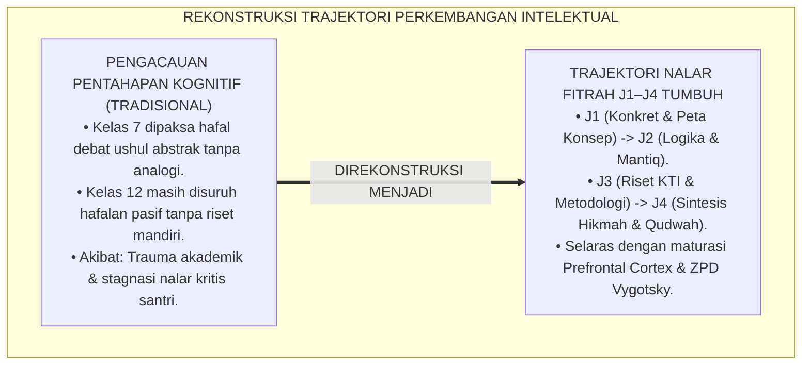
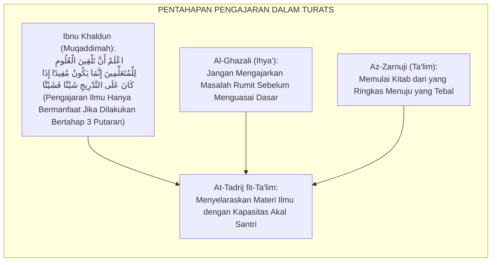
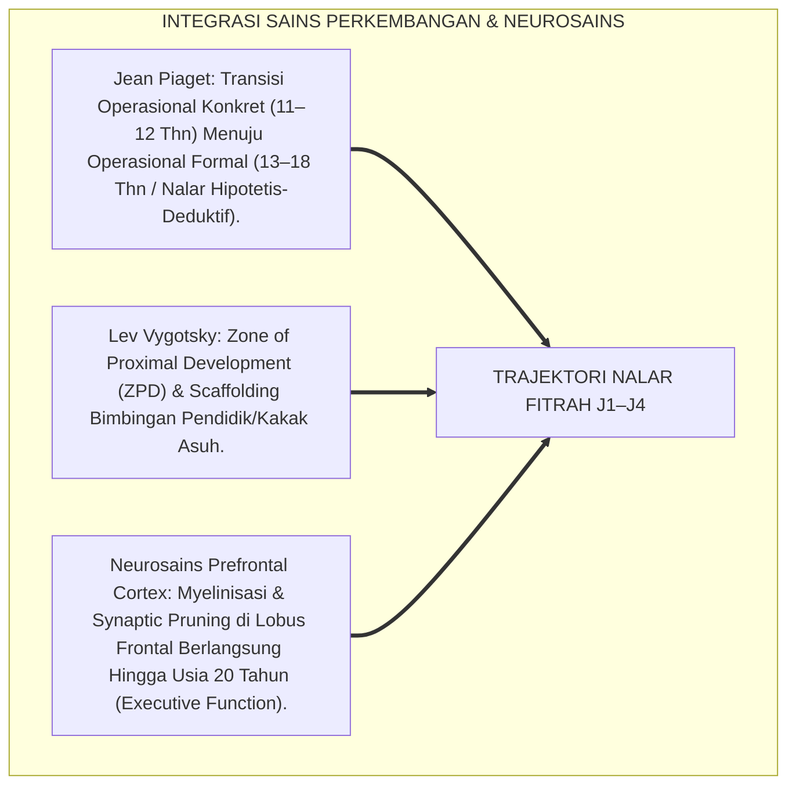
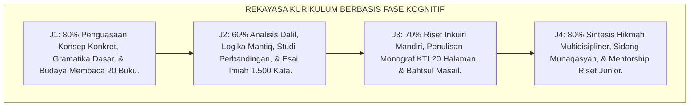
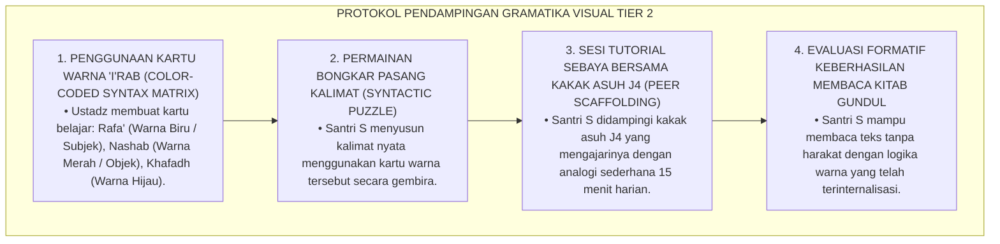
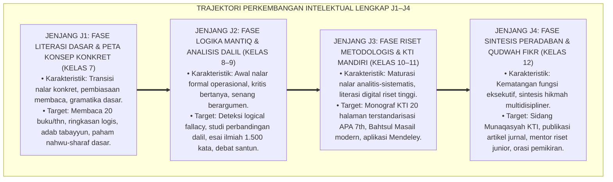
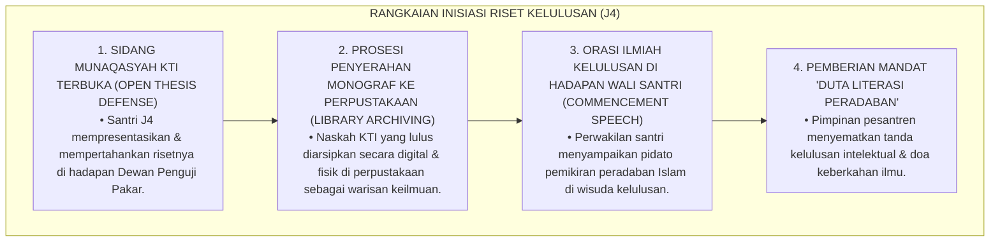

# P3-08-08: TAHAPAN PERKEMBANGAN JENJANG J1–J4 MUTSAQQAFUL FIKR
## *Monograf Riset Akademik: Trajektori Perkembangan Kognitif & Nalar Epistemologis Remaja Pesantren (Usia 12–18 Tahun), Transisi Nalar Konkret Menuju Nalar Abstrak-Dialektis (Piagetian-Vygotskian Transition), Maturasi Prefrontal Cortex, Serta Desain Kurikulum Intelektual Berjenjang J1–J4*

**Nomor Identifikasi**: `P3-08-08/MONOGRAF-RISET-TRAJEKTORI-J1J4-MUTSAQQAFUL-FIKR/2026`  
**Domain**: `03 Capacity Framework` > `08 Mutsaqqaful Fikr` (Sub-Modul 08: *J1–J4 Developmental Stages*)  
**Klasifikasi Naskah**: *Academic Research Monograph* (Monograf Penelitian Psikologi Perkembangan Kognitif, Epistemologi Tarbiyah Berjenjang, & Kurikulum Nalar Kritis)  
**Rumpun Disiplin Pengkaji**: Psikologi Perkembangan Kognitif Remaja, Neurosains Kognisi Pendidikan, Epistemologi Ushul Fiqh Berjenjang, Kurikulum Riset Pesantren  

---

> ### 💡 INTISARI EKSEKUTIF (EXECUTIVE SUMMARY)
>
> * **Krisis Penanganan Perkembangan Kognitif Remaja di Pesantren:**  
>   Pesantren kerap mengajarkan materi kitab kuning tingkat tinggi yang sarat logika abstrak rumit (seperti ushul fiqh perbandingan atau mantiq filosofis) kepada santri baru (usia 12–13 tahun, Jenjang J1) yang struktur otaknya (*Prefrontal Cortex*) masih berada pada fase nalar operasional konkret. Akibatnya, santri mengalami kebingungan kognitif (*Cognitive Overload*), frustrasi belajar, dan terpaksa menghafal tanpa pernah memahami logika di balik teks tersebut.
> * **Pemetaan Trajektori Intelektual 6 Tahun TUMBUH (J1–J4):**  
>   Ekosistem TUMBUH merumuskan **Trajektori Perkembangan Nalar Epistemologis Berkelanjutan** yang disinkronkan dengan 4 fase maturasi neurobiologis: (1) *Jenjang J1 (Kelas 7, Usia 12–13 Thn): Fase Literasi Dasar, Peta Konsep Konkret, & Scaffolding Membaca*, (2) *Jenjang J2 (Kelas 8–9, Usia 13–15 Thn): Fase Logika Mantiq, Analisis Dalil Komparatif, & Debat Terstruktur*, (3) *Jenjang J3 (Kelas 10–11, Usia 15–17 Thn): Fase Riset Metodologis, Fiqh Kontekstual, & Penulisan KTI Mandiri*, dan (4) *Jenjang J4 (Kelas 12, Usia 17–18 Thn): Fase Sintesis Peradaban (Civilizational Synthesis) & Qudwah Intelektual*.
> * **Integrasi Teori Kognitif & Tarbiyah Turats:**  
>   Monograf ini memadukan teori perkembangan Jean Piaget, Lev Vygotsky (*Zone of Proximal Development*), dan neurosains maturasi lobus frontal dengan pentahapan thalabul 'ilmi salaf, menjamin proses pembentukan intelektual santri berlangsung alamiah, menggugah nalar, dan tanpa trauma akademik.

---

## 📑 DAFTAR ISI MONOGRAF

- [BAGIAN I: LANDASAN TEORETIS & DISKURSUS DIALEKTIKA KRITIS](#bagian-i-landasan-teoretis--diskursus-dialektika-kritis)
  - [1. Latar Belakang Masalah: Bahaya Pemaksaan Nalar Abstrak Prematur vs Stagnasi Kognitif Remaja](#1-latar-belakang-masalah-bahaya-pemaksaan-nalar-abstrak-prematur-vs-stagnasi-kognitif-remaja)
  - [2. Eksegesis Turats: Konsep At-Tadrij fit-Ta'lim & Wasiat Pentahapan Ilmu Ibnu Khaldun](#2-eksegesis-turats-konsep-at-tadrij-fit-talim--wasiat-pentahapan-ilmu-ibnu-khaldun)
  - [3. Konvergensi Sains Perkembangan Kognitif (Piaget, Vygotsky) & Neurosains Prefrontal Cortex](#3-konvergensi-sains-perkembangan-kognitif-piaget-vygotsky--neurosains-prefrontal-cortex)
  - [4. Analisis Rekayasa Kurikulum Berbasis Maturasi Otak 24 Jam di Madrasah & Asrama](#4-analisis-rekayasa-kurikulum-berbasis-maturasi-otak-24-jam-di-madrasah--asrama)
  - [5. Kasuistika Lapangan Klinis & Protokol Pendampingan Santri Mengalami Hambatan Transisi Nalar Formal](#5-kasuistika-lapangan-klinis--protokol-pendampingan-santri-mengalami-hambatan-transisi-nalar-formal)
- [BAGIAN II: FORMULASI KONSEPTUAL & PEMBAHASAN MENDALAM](#bagian-ii-formulasi-konseptual--pembahasan-mendalam)
  - [1. Arsitektur Komprehensif Trajektori Intelektual Jenjang J1–J4](#1-arsitektur-komprehensif-trajektori-intelektual-jenjang-j1j4)
  - [2. Matriks Integrasi Kognisi, Karakter Kitab, & Target Riset Lintas Jenjang](#2-matriks-integrasi-kognisi-karakter-kitab--target-riset-lintas-jenjang)
  - [3. Protokol Transisi & Inisiasi Riset Kelulusan (Rites of Passage Intelektual) di Asrama](#3-protokol-transisi--inisiasi-riset-kelulusan-rites-of-passage-intelektual-di-asrama)
  - [4. Diskusi Akademis & Implikasi bagi Tata Kelola Kurikulum Terpadu Pesantren](#4-diskusi-akademis--implikasi-bagi-tata-kelola-kurikulum-terpadu-pesantren)
- [BAGIAN III: KESIMPULAN & APARATUS AKADEMIS](#bagian-iii-kesimpulan--aparatus-akademis)
  - [1. Tabel Sintesis Trajektori Perkembangan Intelektual J1–J4](#1-tabel-sintesis-trajektori-perkembangan-intelektual-j1j4)
  - [2. Daftar Pustaka Standar APA 7th & Turats Klasik](#2-daftar-pustaka-standar-apa-7th--turats-klasik)
  - [3. Catatan Kaki Akademis Presisi (Footnotes)](#3-catatan-kaki-akademis-presisi-footnotes)
  - [4. Glosarium Istilah Ilmiah & Perkembangan Kognitif](#4-glosarium-istilah-ilmiah--perkembangan-kognitif)

---

# BAGIAN I: LANDASAN TEORETIS & DISKURSUS DIALEKTIKA KRITIS

---

### 1. Latar Belakang Masalah: Bahaya Pemaksaan Nalar Abstrak Prematur vs Stagnasi Kognitif Remaja

Dalam pedagogi pesantren tradisional, kerap terjadi **dua ekstrem kegagalan pentahapan kognitif (*Developmental Extremes*)**:[^1]

1. **Ekstrem Pemaksaan Abstrak Prematur (*Premature Abstract Forcing*)**: Santri usia 12–13 tahun (fase peralihan SD ke SMP) langsung disodori perdebatan filsafat kalam atau rumusan logika mantiq tingkat tinggi tanpa jembatan visual dan analogi konkret. Santri merasa bodoh, tertekan, dan menganggap ilmu Turats sebagai "beban tak terpahami".
2. **Ekstrem Stagnasi Hafalan Anak-anak (*Rote Stagnation*)**: Sebaliknya, di jenjang Aliyah (kelas 10–12), santri masih diperlakukan seperti anak-anak yang hanya disuruh mengulang hafalan tanpa pernah dilatih menulis karya ilmiah mandiri, berdebat kritis, atau memecahkan masalah fikih sosial.
3. **Ketiadaan Peta Progresi Membaca & Riset Berjenjang**: Tidak ada panduan bertahap berapa judul buku yang harus dibaca di setiap tingkatan usia dan bagaimana teknik penulisan riset ditingkatkan dari esai pendek menuju monograf ilmiah terstandarisasi.[^2]

Model riset **TUMBUH** merancang arsitektur perkembangan intelektual yang **selaras dengan ritme biologis maturasi otak remaja sepanjang 6 tahun**.

---

### 2. Eksegesis Turats: Konsep At-Tadrij fit-Ta'lim & Wasiat Pentahapan Ilmu Ibnu Khaldun

Pakar sosiologi dan pendidikan Islam terbesar, **Ibnu Khaldun**, dalam *Muqaddimah*-nya merumuskan hukum pentahapan pengajaran (*At-Tadrij fit-Ta'lim*) sebagai syarat mutlak keberhasilan intelektual.

#### 📖 Formulasi Monumental Ibnu Khaldun dalam *Muqaddimah*
Imam **Ibnu Khaldun** menjelaskan metode tiga putaran pembelajaran (*Tsalatsu Maratib*):

$$\text{إِنَّ تَلْقِينَ الْعُلُومِ لِلْمُتَعَلِّمِينَ إِنَّمَا يَكُونُ مُفِيدًا إِذَا كَانَ عَلَى التَّدْرِيجِ شَيْئًا فَشَيْئًا؛ وَذَلِكَ أَنَّهُ يَقْصِدُ أَوَّلًا إِلَى إِعْطَاءِ مَسَائِلِ كُلِّ بَابٍ مُجْمَلَةً عَلَى سَبِيلِ التَّقْرِيبِ... ثُمَّ يُعِيدُ الْفَنَّ ثَانِيَةً وَيَرْفَعُهُ فِي التَّلْقِينِ عَنْ تِلْكَ الرُّتْبَةِ... ثُمَّ يُعِيدُهُ ثَالِثَةً فَلَا يَتْرُكُ شَيْئًا عُوَيْصًا إِلَّا بَيَّنَهُ}$$

*"Ketahuilah bahwa mengajarkan ilmu kepada para penuntut ilmu hanya akan membuahkan manfaat apabila dilakukan secara **bertahap sedikit demi sedikit (At-Tadrij)**; yaitu guru pertama-tama menyajikan masalah pokok setiap bab secara global dan konkret (mudah dicerna)... kemudian mengulanginya pada putaran kedua dengan tingkat analisis yang lebih mendalam... lalu mengulanginya pada putaran ketiga dengan mengupas seluruh kerumitan dan perbedaan dalil secara tuntas!"*[^3]

Teks ini menjadi landasan bahwa kurikulum Mutsaqqaful Fikr wajib dirancang melingkar bertingkat (*Spiral Curriculum*) melintasi jenjang J1 hingga J4.

---

### 3. Konvergensi Sains Perkembangan Kognitif (Piaget, Vygotsky) & Neurosains Prefrontal Cortex

Trajektori Mutsaqqaful Fikr mengintegrasikan teori perkembangan kognitif dan neurosains otak remaja:

1. **Fase Jenjang J1 (Maturasi Nalar Konkret Menuju Formal)**: Memerlukan visualisasi peta konsep (*Concept Mapping*) dan analogi riil untuk menjembatani kaidah nahwu dan fikih.
2. **Fase Jenjang J2–J3 (Perkembangan Nalar Hipotetis-Deduktif)**: Otak siap mengolah silogisme mantiq, perbandingan mazhab, dan metodologi riset inkuiri.
3. **Fase Jenjang J4 (Puncak Fungsi Eksekutif / Executive Functioning)**: Kapasitas metakognisi, perencanaan riset mandiri, dan sintesis etika peradaban mencapai kematangan optimal.[^4]

---

### 4. Analisis Rekayasa Kurikulum Berbasis Maturasi Otak 24 Jam di Madrasah & Asrama

Struktur kurikulum intelektual diorganisasikan selaras dengan fase perkembangan kognitif:

---

### 5. Kasuistika Lapangan Klinis & Protokol Pendampingan Santri Mengalami Hambatan Transisi Nalar Formal

#### Studi Kasus Lapangan: Santri J1 Mengalami Frustrasi Belajar Nahwu Karena Sulit Memahami Konsep 'I'rab Abstrak
* **Konteks Masalah**: Santri S (12 tahun, Jenjang J1) menangis setiap malam karena tidak memahami konsep *Rafa'*, *Nashab*, *Khafadh*, dan *Jazm* dalam kitab Jurumiyyah. Ia merasa dirinya tidak berbakat menjadi santri dan berniat berhenti mondok.
* **Analisis Diagnostik**: Santri S mengalami *Abstract Reasoning Gap*. Guru nahwu mengajarkan definisi gramatika secara verbal hafalan tanpa alat bantu visual yang mengaitkan fungsi kata dalam kalimat.
* **Protokol Intervensi Scaffolding Visual TUMBUH**:

Dalam waktu 3 pekan, pemahaman Santri S melonjak drastis, rasa takutnya berubah menjadi antusiasme tinggi, dan ia meraih nilai tertinggi dalam ujian baca kitab kuning.[^5]

---

# BAGIAN II: FORMULASI KONSEPTUAL & PEMBAHASAN MENDALAM

---

### 1. Arsitektur Komprehensif Trajektori Intelektual Jenjang J1–J4

Progresi kapasitas berpikir diorganisasikan dalam empat tangga perkembangan yang koheren:

---

### 2. Matriks Integrasi Kognisi, Karakter Kitab, & Target Riset Lintas Jenjang

| Parameter Trajektori | Jenjang J1 (Kelas 7, Usia 12–13) | Jenjang J2 (Kelas 8–9, Usia 13–15) | Jenjang J3 (Kelas 10–11, Usia 15–17) | Jenjang J4 (Kelas 12, Usia 17–18) |
| :--- | :--- | :--- | :--- | :--- |
| **Status Perkembangan Kognitif** | Transisi Operasional Konkret menuju Formal; butuh visualisasi peta konsep. | Operasional Formal Awal; mampu berpikir hipotetis & silogisme logis. | Kematangan Operasional Formal; mampu riset metodologis & analisis data. | Puncak Fungsi Eksekutif; mampu sintesis multidisipliner & metakognisi otonom. |
| **Fokus Rujukan Kitab Turats** | *Matan Al-Jurumiyyah*, *Al-Amtsilah At-Tashrifiyyah*, *Safinatun Najah*, *Ta'limul Muta'allim*. | *Al-Waraqat*, *Matan As-Sullam fil Mantiq*, *Fathul Qarib*, *Tadzkiratus Sami'*. | *Ghayatul Wushul*, *Bidayatul Mujtahid*, *Ihya' 'Ulumiddin*, *Al-Qawa'id al-Fiqhiyyah*. | *Al-Muwafaqat* (Asy-Syathibi), *Fashlul Maqal* (Ibnu Rusyd), *Muqaddimah* (Ibnu Khaldun). |
| **Target Karya Tulis & Literasi** | Membaca 20 buku; menulis 10 resensi buku pendek (500 kata); ringkasan bab. | Menulis 4 esai ilmiah komparatif (1.500 kata); laporan eksperimen sains. | Menyelesaikan naskah Monograf KTI Mandiri ($\ge 20\text{ hal}$) terstandarisasi APA 7th. | Mempublikasikan artikel ilmiah di jurnal santri; menyusun orasi pemikiran kelulusan. |
| **Budaya Diskusi & Digital** | Adab mendengarkan aktif; tabayyun informasi dasar; dilarang menyontek. | Debat ilmiah terstruktur; deteksi 5 logical fallacy; cek fakta digital. | Juru bicara Bahtsul Masail; mengoperasikan Mendeley & Maktabah Syamilah. | Sidang Munaqasyah Terbuka; mentor riset junior; pembicara kajian peradaban. |

---

### 3. Protokol Transisi & Inisiasi Riset Kelulusan (Rites of Passage Intelektual) di Asrama

Untuk memuliakan pencapaian intelektual santri, pesantren menyelenggarakan rangkaian tradisi akademis beradab:

---

### 4. Diskusi Akademis & Implikasi bagi Tata Kelola Kurikulum Terpadu Pesantren

Penerapan trajektori perkembangan kognitif J1–J4 membawa transformasi kelembagaan:

1. **Penataan Kurikulum Spiral Berkelanjutan (*Spiral Curriculum Design*)**: Materi keilmuan dirancang berkesinambungan tanpa tumpang tindih dan tanpa lonjakan beban yang tidak realistis.
2. **Kemitraan Madrasah dengan Lembaga Riset & Perguruan Tinggi**: KTI santri jenjang J3–J4 dibimbing dengan standar metodologi akademik universitas, memudahkan santri meraih beasiswa internasional.
3. **Pemberdayaan Santri J4 Sebagai Asisten Peneliti & Pengajar**: Santri kelas 12 dilatih mentransfer ilmu kepada adik kelas, membangun tradisi kaderisasi keilmuan yang hidup (*Isnadul 'Ilmi*).[^6]

---

# BAGIAN III: KESIMPULAN & APARATUS AKADEMIS

---

### 1. Tabel Sintesis Trajektori Perkembangan Intelektual J1–J4

| Jenjang & Rentang Usia | Fase Perkembangan Kognitif | Fokus Kurikulum & Metodologi | Standar Karya Tulis Wajib | Profil Kematangan Akhir Jenjang |
| :--- | :--- | :--- | :--- | :--- |
| **Jenjang J1 (Kelas 7, 12–13 Thn)** | Transisi Operasional Konkret ke Formal. | Literasi dasar, nahwu-sharaf terjemah, peta konsep visual, membaca senyap. | 10 Resensi Buku (500 kata) & Ringkasan Peta Konsep Kitab. | Membaca mandiri 20 buku/thn; mampu membuat ringkasan logis; tabayyun info. |
| **Jenjang J2 (Kelas 8–9, 13–15 Thn)** | Operasional Formal Awal (Logika Deduktif). | Kaidah ushul fiqh pemula, logika mantiq, studi perbandingan dalil, debat terstruktur. | 4 Esai Analisis Dalil & Isu Sains (1.500 kata per naskah). | Mampu mendeteksi sesat pikir (*Fallacy*); aktif debat santun; cek fakta digital. |
| **Jenjang J3 (Kelas 10–11, 15–17 Thn)** | Kematangan Operasional Formal & Riset. | Maqashid Syari'ah, metodologi riset inkuiri, Bahtsul Masail, sitasi Mendeley. | 1 Monograf Karya Tulis Ilmiah (KTI $\ge 20\text{ hal}$) Mandiri. | Lulus uji similaritas anti-plagiasi $< 15\%$; mahir riset Maktabah Syamilah. |
| **Jenjang J4 (Kelas 12, 17–18 Thn)** | Puncak Fungsi Eksekutif & Sintesis Hikmah. | Sintesis multidisipliner (Turats-Sains), fatwa kontemporer, orasi pemikiran. | Artikel Jurnal Santri & Naskah Orasi Ilmiah Kelulusan. | Lulus Sidang Munaqasyah Terbuka; mentor riset junior; wawasan peradaban. |

---

### 2. Daftar Pustaka Standar APA 7th & Turats Klasik

1. **Al-Jabiri, Muhammad Abid.** (1990). *Bunyatu Al-'Aql Al-'Arabi*. Beirut: Markaz Dirasat Al-Wihdah Al-'Arabiyyah.
2. **Anderson, L. W., & Krathwohl, D. R.** (2001). *A Taxonomy for Learning, Teaching, and Assessing*. New York: Longman.
3. **Diamond, A.** (2013). *Executive functions*. *Annual Review of Psychology*, 64, 135-168.
4. **Ibnu Khaldun, Abdurrahman bin Muhammad.** (2005). *Muqaddimah Ibnu Khaldun*. Tahqiq: Dr. Darwisy Al-Juwaini. Beirut: Al-Maktabah Al-'Ashriyyah.
5. **Piaget, J.** (1972). *The Psychology of the Child*. New York: Basic Books.
6. **Ratey, J. J., & Hagerman, E.** (2013). *Spark: The Revolutionary New Science of Exercise and the Brain*. New York: Little, Brown and Company.
7. **Sugai, G., & Horner, R. H.** (2020). *School-Wide Positive Behavioral Interventions and Supports: Implementation Practices*. *Journal of Positive Behavior Interventions*, 22(4), 203-211.
8. **Vygotsky, L. S.** (1978). *Mind in Society: The Development of Higher Psychological Processes*. Cambridge: Harvard University Press.
9. **Zarnuji, Burhanul Islam.** (2010). *Ta'limul Muta'allim Thariqat Ta'allum*. Beirut: Dar Ibn Hazm.

---

### 3. Catatan Kaki Akademis Presisi (Footnotes)

[^1]: Kritik terhadap pemaksaan materi kognitif abstrak prematur tanpa kesiapan biologis remaja, Piaget (1972, hlm. 58).  
[^2]: Pembahasan ketiadaan kurikulum riset berjenjang di institusi pendidikan Islam, Al-Jabiri (1990, hlm. 76).  
[^3]: Ibnu Khaldun, *Muqaddimah Ibnu Khaldun* (2005, Jilid 2, hlm. 248).  
[^4]: Maturasi Prefrontal Cortex dan perkembangan fungsi eksekutif pada masa remaja akhir, Diamond (2013, hlm. 142).  
[^5]: Protokol perancangan scaffolding visual sintaksis nahwu berbasis Zone of Proximal Development, Vygotsky (1978, hlm. 86).  
[^6]: Standar kurikulum spiral dan sistem kaderisasi riset santri TUMBUH Pesantren (2026).  

---

### 4. Glosarium Istilah Ilmiah & Perkembangan Kognitif

1. **Trajektori Perkembangan Kognitif**: Peta alur kemajuan kemampuan berpikir santri dari masa transisi operasional konkret (J1) menuju kematangan fungsi eksekutif dan sintesis hikmah (J4).
2. **At-Tadrij fit-Ta'lim (التَّدْرِيجُ فِي التَّعْلِيمِ)**: Kaidah pedagogi Islam klasik yang mewajibkan penyampaian ilmu secara bertahap, melingkar, dan disesuaikan dengan kapasitas akal peserta didik.
3. **Operasional Formal**: Tahap perkembangan kognitif Piaget di mana remaja mulai mampu berpikir abstrak, logis, menyusun hipotesis, dan menarik kesimpulan deduktif.
4. **Zone of Proximal Development (ZPD)**: Rentang antara kemampuan belajar mandiri santri dengan tingkat potensi yang dapat dicapai melalui bimbingan orang dewasa atau teman sebaya yang lebih mahir.
5. **Scaffolding**: Dukungan instruksional terstruktur yang diberikan pendidik di awal pembelajaran yang secara bertahap dikurangi saat kemandirian santri meningkat.
6. **Executive Functioning (Fungsi Eksekutif)**: Rangkaian proses kognitif tingkat tinggi di lobus frontal otak yang mengontrol fokus, memori kerja, perencanaan, dan regulasi diri.
7. **Spiral Curriculum (Kurikulum Melingkar)**: Desain kurikulum di mana konsep-konsep kunci dipelajari kembali di setiap jenjang dengan tingkat kedalaman dan kompleksitas yang semakin tinggi.
8. **Color-Coded Syntax Matrix**: Media pembelajaran nahwu yang menggunakan kode warna untuk mempermudah identifikasi fungsi gramatikal kata dalam kalimat Arab.
9. **Civilizational Synthesis (Sintesis Peradaban)**: Kemampuan tingkat tinggi jenjang J4 dalam memadukan teks wahyu, sains empiris, dan filsafat untuk merumuskan solusi atas krisis kemanusiaan.
10. **Open Thesis Defense (Sidang Munaqasyah Terbuka)**: Ujian presentasi dan pertahanan naskah KTI santri di hadapan dewan penguji ahli sebagai pembuktian kelayakan intelektual.
