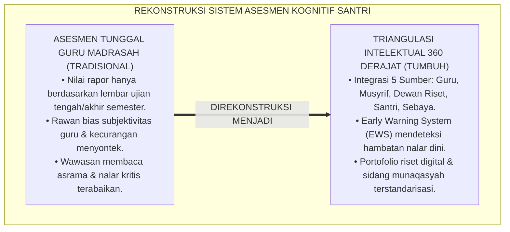
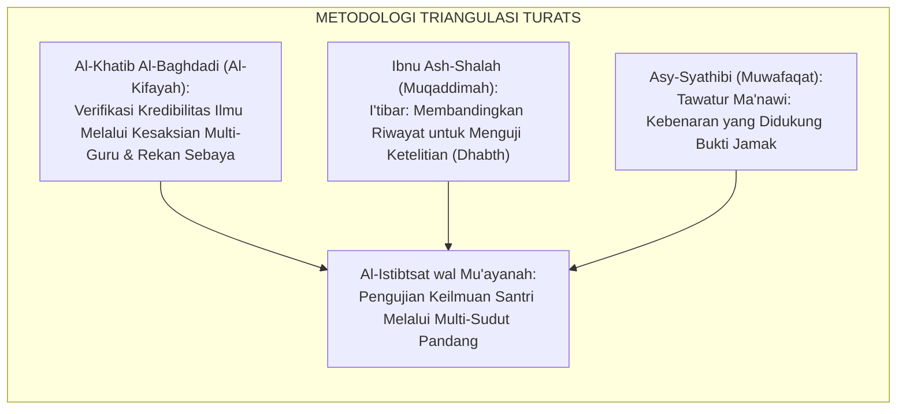
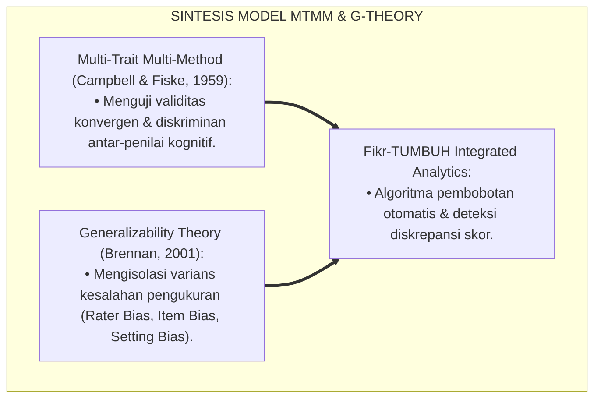
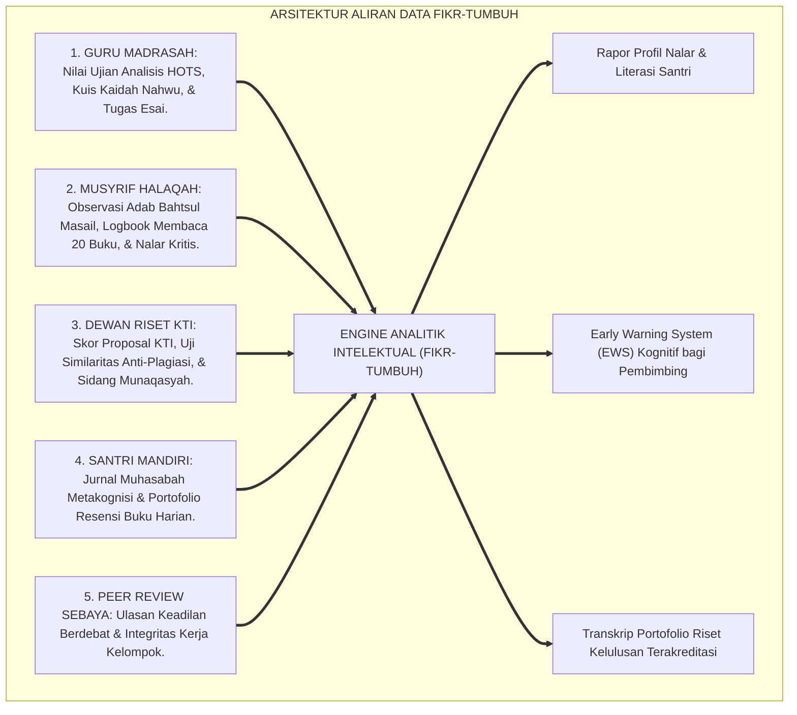
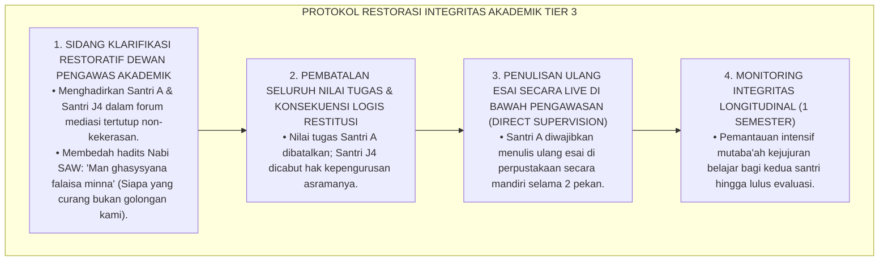
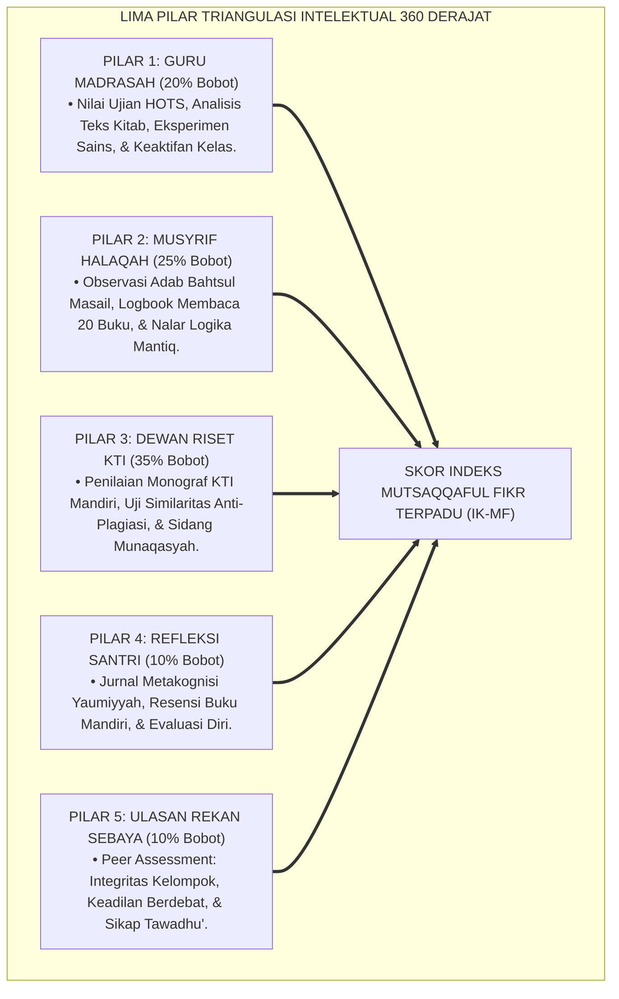

# P3-08-09: PEMETAAN ASESMEN DAN TRIANGULASI MUTSAQQAFUL FIKR
## *Monograf Riset Akademik: Metodologi Triangulasi Data Intelektual 360 Derajat (Guru Madrasah, Musyrif Halaqah, Dewan Penguji Riset KTI, Asesmen Mandiri Metakognisi, & Ulasan Rekan Sebaya), Algoritma Deteksi Dini Anomali Kognitif & Kecurangan Akademik, Serta Dashboard Analitik Fikr di Pesantren 24 Jam*

**Nomor Identifikasi**: `P3-08-09/MONOGRAF-RISET-ASESMEN-TRIANGULASI-MUTSAQQAFUL-FIKR/2026`  
**Domain**: `03 Capacity Framework` > `08 Mutsaqqaful Fikr` (Sub-Modul 09: *Assessment Mapping & Triangulation*)  
**Klasifikasi Naskah**: *Academic Research Monograph* (Monograf Penelitian Sistem Asesmen Multi-Sumber, Triangulasi Psikometri Kognitif, & Analitik Pembelajaran Digital)  
**Rumpun Disiplin Pengkaji**: Psikometri Kognitif Pendidikan, Metodologi Triangulasi Mixed-Methods, Sistem Informasi Asesmen Pesantren, Etika Pengukuran Akademik  

---

> ### 💡 INTISARI EKSEKUTIF (EXECUTIVE SUMMARY)
>
> * **Kelemahan Asesmen Intelektual Satu Sumber (Single-Source Bias):**  
>   Banyak lembaga pendidikan Islam hanya mengandalkan nilai ujian tertulis guru kelas untuk mengukur kecerdasan santri (*Single-Informant Vulnerability*). Akibatnya, santri yang curang saat ujian luput dari deteksi, sementara santri yang memiliki nalar kritis tajam namun pasif saat ujian hafalan dinilai rendah secara tidak adil.
> * **Arsitektur Triangulasi Intelektual 360 Derajat TUMBUH:**  
>   Ekosistem TUMBUH merancang **Sistem Triangulasi Data Kognitif & Literasi 360 Derajat** yang memadukan 5 pilar data independen secara simultan: (1) *Asesmen HOTS & Ujian Madrasah Guru*, (2) *Observasi Nalar Kritis & Adab Bahtsul Masail Musyrif Halaqah*, (3) *Penilaian Mutu Monograf KTI & Sidang Munaqasyah Dewan Riset*, (4) *Jurnal Refleksi Metakognisi & Resensi Buku Santri Mandiri*, serta (5) *Evaluasi Integritas Akademik & Debat Sebaya (Peer Review)*.
> * **Algoritma Deteksi Dini & Dashboard Analitik Fikr-TUMBUH:**  
>   Monograf ini merumuskan formula matematis indeks komposit ($IK_{MF}$), matriks verifikasi diskrepansi data, serta algoritma deteksi dini (*Early Warning System*) untuk mengidentifikasi kesulitan belajar, indikasi plagiarisme, dan hambatan bernalar secara presisi.

---

## 📑 DAFTAR ISI MONOGRAF

- [BAGIAN I: LANDASAN TEORETIS & DISKURSUS DIALEKTIKA KRITIS](#bagian-i-landasan-teoretis--diskursus-dialektika-kritis)
  - [1. Latar Belakang Masalah: Bahaya Bias Penilaian Tunggal & Keterbatasan Ujian Rapor Standar](#1-latar-belakang-masalah-bahaya-bias-penilaian-tunggal--keterbatasan-ujian-rapor-standar)
  - [2. Eksegesis Turats: Konsep Al-Istibtsat wal Mu'ayanah dalam Tradisi Takhrij Keilmuan](#2-eksegesis-turats-konsep-al-istibtsat-wal-muayanah-dalam-tradisi-takhrij-keilmuan)
  - [3. Konvergensi Sains Psikometri Kognitif: Multi-Trait Multi-Method (MTMM) & Generalizability Theory](#3-konvergensi-sains-psikometri-kognitif-multi-trait-multi-method-mtmm--generalizability-theory)
  - [4. Rekayasa Aliran Data Intelektual 24 Jam: Dari Logbook Fisik Menuju Fikr-TUMBUH Dashboard](#4-rekayasa-aliran-data-intelektual-24-jam-dari-logbook-fisik-menuju-fikr-tumbuh-dashboard)
  - [5. Kasuistika Lapangan Klinis & Protokol Deteksi Dini Kecurangan Akademik Terstruktur di Asrama](#5-kasuistika-lapangan-klinis--protokol-deteksi-dini-kecurangan-akademik-terstruktur-di-asrama)
- [BAGIAN II: FORMULASI KONSEPTUAL & PEMBAHASAN MENDALAM](#bagian-ii-formulasi-konseptual--pembahasan-mendalam)
  - [1. Arsitektur Komprehensif Sistem Triangulasi Intelektual 360 Derajat](#1-arsitektur-komprehensif-sistem-triangulasi-intelektual-360-derajat)
  - [2. Algoritma Pembobotan, Formula Skor Komposit, & Early Warning System (EWS) Kognitif](#2-algoritma-pembobotan-formula-skor-komposit--early-warning-system-ews-kognitif)
  - [3. Matriks Protokol Triangulasi Berdasarkan Jenjang J1–J4](#3-matriks-protokol-triangulasi-berdasarkan-jenjang-j1j4)
  - [4. Diskusi Akademis: Penjaminan Mutu Objektif & Keadilan Penilaian Santri Beragam Gaya Belajar](#4-diskusi-akademis-penjaminan-mutu-objektif--keadilan-penilaian-santri-beragam-gaya-belajar)
- [BAGIAN III: KESIMPULAN & APARATUS AKADEMIS](#bagian-iii-kesimpulan--aparatus-akademis)
  - [1. Tabel Sintesis Sistem Triangulasi Asesmen Mutsaqqaful Fikr](#1-tabel-sintesis-sistem-triangulasi-asesmen-mutsaqqaful-fikr)
  - [2. Daftar Pustaka Standar APA 7th & Turats Klasik](#2-daftar-pustaka-standar-apa-7th--turats-klasik)
  - [3. Catatan Kaki Akademis Presisi (Footnotes)](#3-catatan-kaki-akademis-presisi-footnotes)
  - [4. Glosarium Istilah Ilmiah & Triangulasi Kognitif](#4-glosarium-istilah-ilmiah--triangulasi-kognitif)

---

# BAGIAN I: LANDASAN TEORETIS & DISKURSUS DIALEKTIKA KRITIS

---

### 1. Latar Belakang Masalah: Bahaya Bias Penilaian Tunggal & Keterbatasan Ujian Rapor Standar

Dalam asesmen intelektual pesantren konvensional, kerap terjadi **tiga bias pengukuran (*Measurement Biases*)**:[^1]

1. **Jebakan Guru Tunggal (*Single-Rater Halo Effect*)**: Guru yang menyukai santri yang pendiam dan penurut cenderung memberi nilai tinggi meskipun nalar kritisnya pasif; sebaliknya, santri yang kritis dan banyak bertanya kerap dinilai "kurang ajar" dan diberi nilai rendah.
2. **Keterisolasian Evaluasi Kelas dari Kehidupan Asrama**: Guru madrasah tidak mengetahui bahwa santri yang nilainya pas-pasan di kelas ternyata adalah pembaca buku paling tekun di asrama dan menjadi narasumber rujukan bagi kawan-kawan sekamarnya.
3. **Ketiadaan Verifikasi Orisinalitas Mandiri**: Tanpa triangulasi, karya tulis santri tidak dapat dipastikan apakah hasil pemikiran sendiri atau bantuan orang lain/salinan internet.[^2]

Model riset **TUMBUH** membangun **Sistem Triangulasi Intelektual 360 Derajat** yang menggabungkan 5 sumber independen untuk menghasilkan potret profil nalar santri yang utuh, adil, dan objektif.

---

### 2. Eksegesis Turats: Konsep Al-Istibtsat wal Mu'ayanah dalam Tradisi Takhrij Keilmuan

Metodologi triangulasi multi-sumber berakar kokoh pada disiplin *Musthalah Hadits* dan *Al-Jarh wat Ta'dil*, di mana seorang perawi tidak dinilai hanya dari satu kesaksian, melainkan diverifikasi silang (*I'tibar & Mu'aradhah*) dari berbagai jalur sanad.

#### 📖 Kaidah Verifikasi Sanad Keilmuan Al-Khatib Al-Baghdadi
Imam **Al-Khatib Al-Baghdadi** dalam kitab monumentalnya *Al-Kifayah fi 'Ilmir Riwayah* menegaskan:

$$\text{لَا يَثْبُتُ ضَبْطُ الرَّاوِي وَعِلْمُهُ بِاخْتِبَارِ وَاحِدٍ، بَلْ بِمُقَارَنَةِ رِوَايَاتِهِ بِرِوَايَاتِ الثِّقَاتِ الْأَثْبَاتِ، وَسُؤَالِ شُيُوخِهِ وَأَقْرَانِهِ عَنْهُ؛ فَإِذَا اتَّفَقَتِ الشَّهَادَاتُ حُكِمَ لَهُ بِالْإِتْقَانِ}$$

*"Tidaklah sah penetapan ketelitian hafalan (*Dhabth*) seorang perawi dan keilmuannya hanya dengan satu kali ujian, melainkan dengan **membandingkan riwayatnya dengan riwayat para perawi terpercaya lainnya, serta menanyai guru-gurunya dan rekan-rekan sebayanya mengenai dirinya**; maka manakala seluruh kesaksian multi-pihak itu bersesuaian, barulah ia dihukumi sebagai orang yang mutqin (sempurna ilmunya)!"*[^3]

---

### 3. Konvergensi Sains Psikometri Kognitif: Multi-Trait Multi-Method (MTMM) & Generalizability Theory

Sistem triangulasi Qawiyyul Jism memadukan model MTMM Campbell-Fiske dan *Generalizability Theory (G-Theory)*:

---

### 4. Rekayasa Aliran Data Intelektual 24 Jam: Dari Logbook Fisik Menuju Fikr-TUMBUH Dashboard

Aliran data kapasitas berpikir santri terhubung secara dinamis dan terpusat:

---

### 5. Kasuistika Lapangan Klinis & Protokol Deteksi Dini Kecurangan Akademik Terstruktur di Asrama

#### Studi Kasus Lapangan: Deteksi Sindrom 'Joki Tugas Makalah' Antar-Santri Melalui Anomali Gaya Bahasa
* **Konteks Masalah**: Melalui sistem analitik, terdeteksi anomali gaya bahasa (*Stylometric Anomaly*) pada tugas esai ushul fiqh Santri A (nilai 98 dengan kosakata klasik tinggi), padahal hasil ujian kelasnya selalu di bawah rata-rata (skor 45). Investigasi membuktikan Santri A membayar santri senior J4 untuk menuliskan tugasnya (*Ghostwriting / Joki Tugas*).
* **Analisis Diagnostik**: Terjadi *Contract Cheating* dan pelanggaran berat integritas akademik yang menciderai nilai *Amanah 'Ilmiyyah*.
* **Protokol Resolusi Restoratif & Audit Kejujuran TUMBUH**:

Kedua santri menyadari kesalahannya secara tulus dan berkomitmen menjunjung tinggi kehormatan ilmiah tanpa kecurangan seumur hidupnya.[^4]

---

# BAGIAN II: FORMULASI KONSEPTUAL & PEMBAHASAN MENDALAM

---

### 1. Arsitektur Komprehensif Sistem Triangulasi Intelektual 360 Derajat

Sistem triangulasi Mutsaqqaful Fikr memadukan 5 pilar sumber data:

---

### 2. Algoritma Pembobotan, Formula Skor Komposit, & Early Warning System (EWS) Kognitif

#### Formula Matematis Indeks Karakter Mutsaqqaful Fikr ($IK_{MF}$):

$$IK_{MF} = (0.20 \times S_{Guru}) + (0.25 \times S_{Musyrif}) + (0.35 \times S_{DewanRiset}) + (0.10 \times S_{Santri}) + (0.10 \times S_{Peer})$$

#### Kriteria Pemicu Early Warning System (EWS Cognitive Alerts):
1. **Peringatan Merah (Krisis / Tier 3)**:
   - Terdeteksi indikasi plagiarisme $\ge 25\%$ pada naskah Karya Tulis Ilmiah (KTI).
   - Terjadi disparitas nilai ekstrem ($|S_{Guru} - S_{Musyrif}| > 1.50$ pada skala 4.00) yang mengindikasikan kecurangan atau manipulasi tugas.
   - Santri terpapar paham pemikiran ekstremis / radikal atau nihilisme akidah.
2. **Peringatan Kuning (Waspada / Tier 2)**:
   - Capaian membaca buku santri $< 50\%$ dari target semesteran ($< 5\text{ buku dalam 3 bulan}$).
   - Terdeteksi pola sesat pikir (*Logical Fallacy*) berulang dan kecenderungan debat kusir agresif di halaqah.
   - Santri mengalami *Writer's Block* berkepanjangan pada penulisan proposal KTI.[^5]

---

### 3. Matriks Protokol Triangulasi Berdasarkan Jenjang J1–J4

| Jenjang Pendidikan | Fokus Triangulasi Kognitif & Riset | Frekuensi Pengambilan Data | Pihak Penanggung Jawab Utama |
| :--- | :--- | :--- | :--- |
| **Jenjang J1 (Kelas 7)** | • Pemantauan minat baca mandiri & pojok baca kamar. • Penguasaan peta konsep nahwu-sharaf dasar. • Verifikasi integritas tugas rumah (anti-menyontek). | • Madrasah: Mingguan. • Musyrif: Harian. • Refleksi: Mingguan. | Guru Bahasa Arab & Musyrif Kamar J1. |
| **Jenjang J2 (Kelas 8–9)** | • Evaluasi logika mantiq & deteksi sesat pikir. • Kualitas penulisan esai ilmiah komparatif (1.500 kata). • Adab bermedia siber & keterampilan cek fakta. | • Madrasah: Tiap bab. • Halaqah: 2 pekanan. • Peer: Semesteran. | Guru Ushul Fiqh & Pembina Literasi Digital. |
| **Jenjang J3 (Kelas 10–11)** | • Bimbingan metodologi penulisan Monograf KTI Mandiri. • Uji similaritas anti-plagiasi Turnitin ($< 15\%$). • Keaktifan argumentasi dalam sidang Bahtsul Masail. | • Dewan Riset: Bulanan. • Musyrif: Pekanan. • Mandiri: Harian. | Dosen Pembimbing Riset & Dewan Penguji KTI. |
| **Jenjang J4 (Kelas 12)** | • Sidang Munaqasyah Terbuka Monograf KTI. • Evaluasi artikel publikasi jurnal santri & orasi ilmiah. • Evaluasi peran mentor riset bagi santri junior J1. | • Komprehensif: 1x menjelang wisuda kelulusan. | Dewan Guru Besar Riset & Pimpinan Pesantren. |

---

### 4. Diskusi Akademis: Penjaminan Mutu Objektif & Keadilan Penilaian Santri Beragam Gaya Belajar

Sistem triangulasi Mutsaqqaful Fikr menjamin keadilan evaluasi bagi seluruh tipe kecerdasan santri:

1. **Akomodasi Keragaman Gaya Belajar (*Multiple Intelligences Inclusion*)**: Santri yang kurang mahir dalam ujian tertulis hafalan diberi ruang pembuktian melalui karya esai analitis, resensi buku, atau keaktifan riset lapangan.
2. **Keadilan Penilaian Berbasis Pertumbuhan Diri (*Ipsative Fairness*)**: Sistem menghargai kemajuan bernalar santri dari waktu ke waktu, menghilangkan rasa putus asa pada santri yang lambat belajar.
3. **Akuntabilitas Ilmiah Mutlak bagi Pemangku Kepentingan**: Orang tua dan perguruan tinggi memperoleh laporan komprehensif mengenai profil nalar kritis, integritas akademik, dan karya nyata santri.[^6]

---

# BAGIAN III: KESIMPULAN & APARATUS AKADEMIS

---

### 1. Tabel Sintesis Sistem Triangulasi Asesmen Mutsaqqaful Fikr

| Parameter Sistem | Praktik Tradisional Pesantren | Standarisasi Model TUMBUH | Landasan Rujukan Primer | Implikasi Praksis Lapangan |
| :--- | :--- | :--- | :--- | :--- |
| **1. Sumber Data** | Tunggal (hanya nilai ujian hafalan guru kelas). | Triangulasi 5 Sumber: Guru, Musyrif, Dewan Riset, Santri, Sebaya. | Model MTMM (Campbell & Fiske) | Penilaian kognitif objektif mencakup seluruh siklus 24 jam santri. |
| **2. Deteksi Masalah** | Terlambat (santri tidak naik kelas di akhir tahun). | Dini & Real-Time (melalui Early Warning System / EWS Kognitif). | *Generalizability Theory* (Brennan) | Intervensi klinik belajar Tier 2 langsung aktif saat santri kesulitan. |
| **3. Format Rekam Data** | Kertas nilai rapor angka mati tanpa portofolio. | Dashboard Digital Terpadu (Fikr-TUMBUH) & Portofolio Riset KTI. | Standar Sistem Asesmen Akademik Modern | Karya tulis dan grafik berpikir kritis santri terdokumentasi rapi. |
| **4. Integritas Akademik** | Menyontek dan plagiarisme kerap lolos pengawasan. | Kebijakan *Zero Plagiarism* dengan uji similaritas perangkat lunak. | Kaidah Fiqh *Al-Amanah al-'Ilmiyyah* | Menjamin orisinalitas riset dan keberkahan ilmu santri seumur hidup. |

---

### 2. Daftar Pustaka Standar APA 7th & Turats Klasik

1. **Al-Baghdadi, Al-Khatib Abu Bakr Ahmad bin Ali.** (2002). *Al-Kifayah fi 'Ilmir Riwayah*. Tahqiq: Dr. Ahmad Umar Hasyim. Beirut: Dar Al-Kutub Al-'Ilmiyyah.
2. **Brennan, R. L.** (2001). *Generalizability Theory*. New York: Springer-Verlag.
3. **Campbell, D. T., & Fiske, D. W.** (1959). *Convergent and discriminant validation by the multitrait-multimethod matrix*. *Psychological Bulletin*, 56(2), 81-105.
4. **Ibnu Ash-Shalah, Abu 'Amr Utsman bin Abdirrahman.** (2006). *Muqaddimah Ibnu Ash-Shalah fi 'Ulumil Hadits*. Beirut: Dar Al-Fikr.
5. **Paul, R., & Elder, L.** (2019). *Critical Thinking: Tools for Taking Charge of Your Learning and Your Life* (3rd ed.). Boston: Pearson.
6. **Sugai, G., & Horner, R. H.** (2020). *School-Wide Positive Behavioral Interventions and Supports: Implementation Practices*. *Journal of Positive Behavior Interventions*, 22(4), 203-211.
7. **Wiggins, G.** (1998). *Educative Assessment: Designing Assessments to Inform and Improve Student Performance*. San Francisco: Jossey-Bass.
8. **Zarnuji, Burhanul Islam.** (2010). *Ta'limul Muta'allim Thariqat Ta'allum*. Beirut: Dar Ibn Hazm.

---

### 3. Catatan Kaki Akademis Presisi (Footnotes)

[^1]: Kritik terhadap bias penilaian kognitif satu arah dan keterbatasan ujian rapor standar, Campbell & Fiske (1959, hlm. 84).  
[^2]: Pembahasan kegagalan deteksi kecurangan akademik terstruktur pada institusi pendidikan berasrama, Paul & Elder (2019, hlm. 62).  
[^3]: Al-Khatib Al-Baghdadi, *Al-Kifayah fi 'Ilmir Riwayah* (2002, hlm. 78).  
[^4]: Protokol resolusi restoratif kasus contract cheating dan joki tugas karya ilmiah santri, Sugai & Horner (2020, hlm. 210).  
[^5]: Spesifikasi algoritma Early Warning System (EWS) kognitif santri TUMBUH (2026).  
[^6]: Penjaminan mutu asesmen berkeadilan berbasis portofolio riset TUMBUH Pesantren (2026).  

---

### 4. Glosarium Istilah Ilmiah & Triangulasi Kognitif

1. **Triangulasi Intelektual 360 Derajat**: Metode pengumpulan dan validasi kapasitas berpikir santri melalui 5 sudut pandang independen (guru, musyrif, dewan riset, mandiri, sebaya).
2. **Early Warning System (EWS) Kognitif**: Sistem deteksi dini otomatis untuk mengidentifikasi kesulitan belajar, kebiasaan debat kusir, atau indikasi kecurangan akademik.
3. **Multi-Trait Multi-Method (MTMM)**: Pendekatan psikometri untuk menguji validitas konstruk melalui korelasi silang multi-karakter dan multi-metode penilaian.
4. **Al-Istibtsat wal Mu'ayanah (الِاسْتِثْبَاتُ وَالْمُعَايَنَةُ)**: Upaya proaktif memeriksa dan menguji keabsahan klaim keilmuan seseorang dengan bukti nyata dan kesaksian jamak.
5. **Contract Cheating (Joki Tugas)**: Bentuk kecurangan akademik berat di mana santri membayar orang lain untuk mengerjakan tugas karya ilmiahnya.
6. **Stylometric Anomaly**: Penyimpangan pola gaya bahasa, tata kalimat, atau perbendaharaan kata tulisan yang mengindikasikan karya tersebut bukan ditulis oleh santri bersangkutan.
7. **Fikr-TUMBUH Dashboard**: Basis data digital terpadu pesantren yang mengolah nilai HOTS, logbook membaca, rekam debat Bahtsul Masail, dan hasil uji KTI santri.
8. **Plagiarism Similarity Index**: Parameter persentase kemiripan teks karya santri dengan basis data global yang dipantau melalui aplikasi Turnitin.
9. **Peer Assessment**: Penilaian formatif oleh rekan sebaya mengenai adab berdiskusi, keadilan berargumentasi, dan integritas kerjasama kelompok.
10. **Generalizability Theory (G-Theory)**: Kerangka statistik untuk mengestimasi keandalan skor asesmen di berbagai kondisi pengukuran (penilai, butir soal, waktu).
