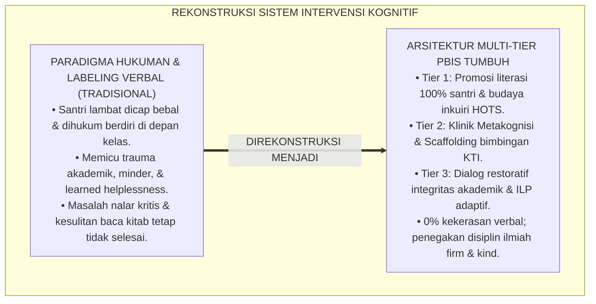
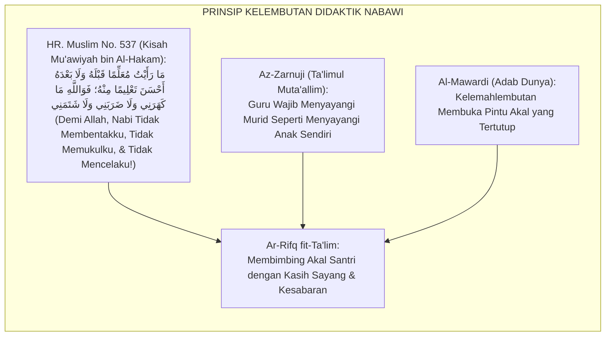
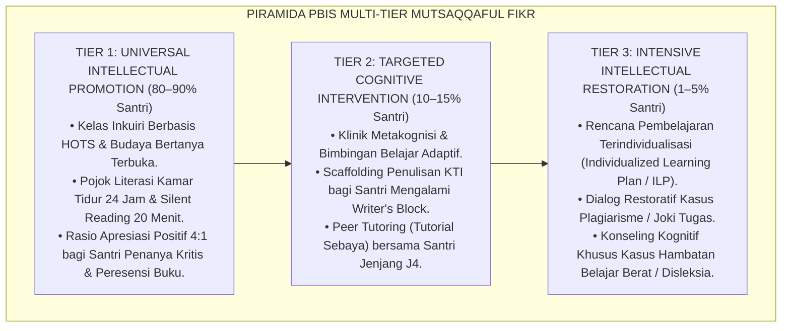
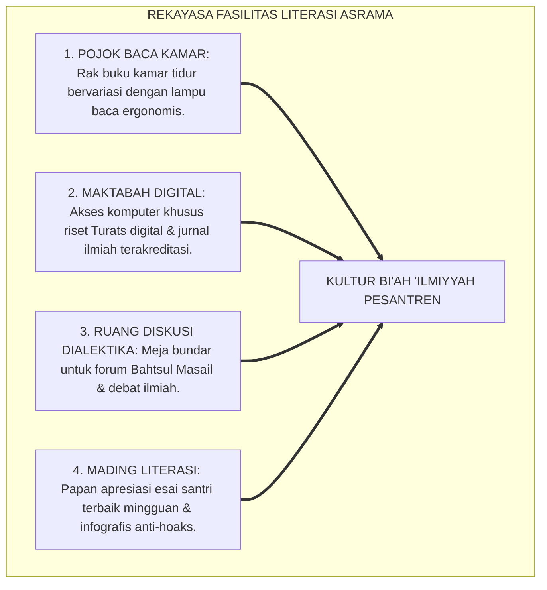
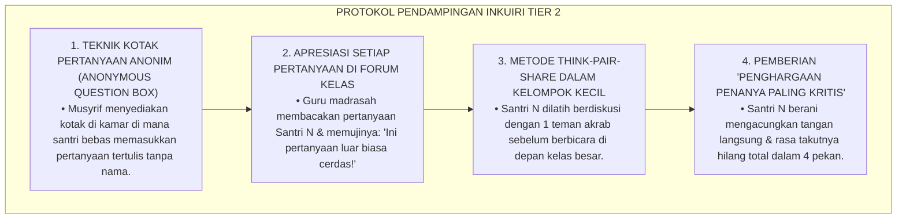

# P3-08-10: PROTOKOL INTERVENSI DAN PEMBIASAAN MUTSAQQAFUL FIKR
## *Monograf Riset Akademik: Arsitektur Intervensi Multi-Tier School-Wide PBIS Nalar Kritis & Literasi, Protokol Pencegahan Universal (Tier 1 Pojok Literasi & Inquiry Classroom), Intervensi Terarah (Tier 2 Klinik Metakognisi & Bimbingan KTI), Pemulihan Intensif (Tier 3 Restorasi Integritas Akademik & De-radikalisasi Nalar), Serta Eliminasi Dogmatisme di Pesantren 24 Jam*

**Nomor Identifikasi**: `P3-08-10/MONOGRAF-RISET-PROTOKOL-INTERVENSI-MUTSAQQAFUL-FIKR/2026`  
**Domain**: `03 Capacity Framework` > `08 Mutsaqqaful Fikr` (Sub-Modul 10: *Intervention & Habituation Protocols*)  
**Klasifikasi Naskah**: *Academic Research Monograph* (Monograf Penelitian Arsitektur Intervensi Kognitif PBIS, Bimbingan Metakognisi, & Resolusi Restoratif Integritas Akademik)  
**Rumpun Disiplin Pengkaji**: School-Wide Positive Behavioral Interventions and Supports (SW-PBIS), Psikologi Kognitif Pendidikan, Metodologi Bimbingan Belajar Adaptif, Etika Akademik  

---

> ### 💡 INTISARI EKSEKUTIF (EXECUTIVE SUMMARY)
>
> * **Kegagalan Paradigma Hukuman Akademik Konvensional:**  
>   Praktik penanganan santri yang lambat memahami kitab atau tertinggal dalam pelajaran kerap menggunakan pendekatan hukuman yang memalukan (seperti disuruh berdiri di depan kelas sambil memegang telinga, dicap "bebal/otak udang", atau dihukum membersihkan toilet). Hukuman destruktif ini terbukti tidak meningkatkan pemahaman santri, memicu keputusasaan akademik (*Learned Helplessness*), dan membunuh kecintaan pada ilmu.
> * **Arsitektur PBIS Multi-Tier Intelektual TUMBUH:**  
>   Ekosistem TUMBUH merancang **Arsitektur Intervensi PBIS Multi-Tier Karakter Mutsaqqaful Fikr**: (1) *Tier 1: Universal Intellectual Promotion (100% Santri)* melalui kurikulum inkuiri, pojok baca kamar tidur 24 jam, penguatan rasio apresiasi 4:1, dan Bahtsul Masail dialogis; (2) *Tier 2: Targeted Cognitive Intervention (10–15% Santri)* melalui Klinik Metakognisi, pendampingan scaffolding penulisan KTI, dan bimbingan nahwu visual; serta (3) *Tier 3: Intensive Intellectual Restoration (1–5% Santri)* melalui dialog restoratif integritas akademik dan penanganan disleksia/hambatan kognitif berat.
> * **Prinsip Tegas & Penuh Kasih (Firm & Kind):**  
>   Monograf ini menetapkan protokol eliminasi total kekerasan verbal dan labeling akademik, menggantikannya dengan penegakan scaffolding instruksional yang memberdayakan nalar fitrah santri.

---

## 📑 DAFTAR ISI MONOGRAF

- [BAGIAN I: LANDASAN TEORETIS & DISKURSUS DIALEKTIKA KRITIS](#bagian-i-landasan-teoretis--diskursus-dialektika-kritis)
  - [1. Latar Belakang Masalah: Bahaya Labeling 'Santri Bodoh' & Kekerasan Verbal di Kelas](#1-latar-belakang-masalah-bahaya-labeling-santri-bodoh--kekerasan-verbal-di-kelas)
  - [2. Eksegesis Turats: Kaidah Ar-Rifq fit-Ta'lim & Kelembutan Mendidik Akal dalam Sunnah](#2-eksegesis-turats-kaidah-ar-rifq-fit-talim--kelembutan-mendidik-akal-dalam-sunnah)
  - [3. Konvergensi Sains SW-PBIS Multi-Tier & Teori Learned Helplessness (Seligman)](#3-konvergensi-sains-sw-pbis-multi-tier--teori-learned-helplessness-seligman)
  - [4. Rekayasa Lingkungan Asrama 24 Jam sebagai Penopang Protokol Multi-Tier Intelektual](#4-rekayasa-lingkungan-asrama-24-jam-sebagai-penopang-protokol-multi-tier-intelektual)
  - [5. Kasuistika Lapangan Klinis & Protokol Pendampingan Santri Mengalami Sindrom 'Takut Bertanya di Kelas'](#5-kasuistika-lapangan-klinis--protokol-pendampingan-santri-mengalami-sindrom-takut-bertanya-di-kelas)
- [BAGIAN II: FORMULASI KONSEPTUAL & PEMBAHASAN MENDALAM](#bagian-ii-formulasi-konseptual--pembahasan-mendalam)
  - [1. Arsitektur Komprehensif Tiga Tingkat Intervensi PBIS Mutsaqqaful Fikr](#1-arsitektur-komprehensif-tiga-tingkat-intervensi-pbis-mutsaqqaful-fikr)
  - [2. Matriks Rinci Protokol Tier 1, Tier 2, dan Tier 3 Literasi & Nalar Kritis](#2-matriks-rinci-protokol-tier-1-tier-2-dan-tier-3-literasi--nalar-kritis)
  - [3. Standar Operasional Prosedur (SOP) Klinik Metakognisi & Bimbingan Riset Adaptif](#3-standar-operasional-prosedur-sop-klinik-metakognisi--bimbingan-riset-adaptif)
  - [4. Diskusi Akademis & Implikasi bagi Penghapusan Kekerasan Verbal di Lingkungan Pesantren](#4-diskusi-akademis--implikasi-bagi-penghapusan-kekerasan-verbal-di-lingkungan-pesantren)
- [BAGIAN III: KESIMPULAN & APARATUS AKADEMIS](#bagian-iii-kesimpulan--aparatus-akademis)
  - [1. Tabel Sintesis Protokol Intervensi PBIS Mutsaqqaful Fikr](#1-tabel-sintesis-protokol-intervensi-pbis-mutsaqqaful-fikr)
  - [2. Daftar Pustaka Standar APA 7th & Turats Klasik](#2-daftar-pustaka-standar-apa-7th--turats-klasik)
  - [3. Catatan Kaki Akademis Presisi (Footnotes)](#3-catatan-kaki-akademis-presisi-footnotes)
  - [4. Glosarium Istilah Ilmiah & Intervensi PBIS Kognitif](#4-glosarium-istilah-ilmiah--intervensi-pbis-kognitif)

---

# BAGIAN I: LANDASAN TEORETIS & DISKURSUS DIALEKTIKA KRITIS

---

### 1. Latar Belakang Masalah: Bahaya Labeling 'Santri Bodoh' & Kekerasan Verbal di Kelas

Dalam kultur pembelajaran pesantren konvensional, penanganan kesulitan belajar kerap terperangkap dalam **tiga kesalahan pedagogis fatal (*Fatal Pedagogical Mistakes*)**:[^1]

1. **Stigmatisasi & Labeling Menghinakan (*Intellectual Shaming*)**: Santri yang belum lancar membaca kitab gundul atau lambat memahami ushul fiqh kerap dicap "bebal", "kurang tirakat", atau "tidak berkah". Labeling ini merusak konsep diri (*Academic Self-Concept*) dan memicu keputusasaan belajar (*Learned Helplessness*).
2. **Ketiadaan Bimbingan Remedial Terstruktur**: Santri yang tertinggal dibiarkan tanpa pendampingan metode belajar baru, hingga akhirnya semakin tertinggal jauh dari kawan-kawannya.
3. **Penanganan Kasus Curang Berbasis Hukuman Fisik**: Ketika santri kedapatan menyontek, lembaga menghukumnya dengan cara fisik atau mengumumkan aibnya di depan umum, tanpa pernah mendalami akar penyebabnya (seperti kecemasan ujian atau beban kognitif berlebih).[^2]

Model riset **TUMBUH** mengganti seluruh hukuman destruktif dengan **Sistem Dukungan Pembelajaran Positif Multi-Tier (SW-PBIS Multi-Tier)** yang berbasis neurosains dan kasih sayang mendidik.

---

### 2. Eksegesis Turats: Kaidah Ar-Rifq fit-Ta'lim & Kelembutan Mendidik Akal dalam Sunnah

Rasulullah SAW adalah pendidik yang penuh kelembutan, tidak pernah mencela atau mempermalukan penuntut ilmu yang belum paham.

#### 📖 Kesaksian Mu'awiyah bin Al-Hakam As-Sulami RA
Diriwayatkan dalam Shahih Muslim tentang bagaimana Rasulullah SAW memperlakukan orang yang melakukan kesalahan karena ketidaktahuan:

$$\text{مَا رَأَيْتُ مُعَلِّمًا قَبْلَهُ وَلَا بَعْدَهُ أَحْسَنَ تَعْلِيمًا مِنْهُ؛ فَوَاللَّهِ مَا كَهَرَنِي، وَلَا ضَرَبَنِي، وَلَا شَتَمَنِي، وَإِنَّمَا قَالَ: إِنَّ هَذِهِ الصَّلَاةَ لَا يَصْلُحُ فِيهَا شَيْءٌ مِنْ كَلَامِ النَّاسِ}$$

*"Aku tidak pernah melihat seorang pendidik pun sebelum beliau maupun sesudahnya yang lebih baik cara mengajarnya daripada beliau. **Demi Allah, beliau tidak pernah membentakku, tidak pernah memukulku, dan tidak pernah mencelaku!** Beliau hanya berkata dengan lembut: 'Sesungguhnya shalat ini tidak boleh ada di dalamnya ucapan manusia'..."* (HR. Muslim No. 537).[^3]

---

### 3. Konvergensi Sains SW-PBIS Multi-Tier & Teori Learned Helplessness (Seligman)

Arsitektur PBIS Mutsaqqaful Fikr memadukan 3 tingkatan dukungan instruksional:

---

### 4. Rekayasa Lingkungan Asrama 24 Jam sebagai Penopang Protokol Multi-Tier Intelektual

Pencapaian wawasan berpikir santri didukung oleh fasilitas fisik asrama yang literat:

---

### 5. Kasuistika Lapangan Klinis & Protokol Pendampingan Santri Mengalami Sindrom 'Takut Bertanya di Kelas'

#### Studi Kasus Lapangan: Santri J1 Mengalami Fobia Bertanya (*Questioning Anxiety*) Karena Takut Ditertawakan
* **Konteks Masalah**: Santri N (12 tahun, Jenjang J1) tidak pernah berani bertanya di kelas madrasah. Ketika ditanya musyrif, ia gemetar dan menunduk karena di sekolah asalnya ia pernah dimarahi guru saat menanyakan hal yang dianggap "bodoh".
* **Analisis Diagnostik**: Santri N mengalami *Academic Anxiety* dan trauma psikologis pada iklim pembelajaran yang tidak aman (*Psychologically Unsafe Classroom*).
* **Protokol De-eskalasi & Penumbuhan Keberanian Intelektual TUMBUH**:

Intervensi ini berhasil mengembalikan rasa percaya diri Santri N dan menjadikannya salah satu santri paling aktif dan kritis di kelasnya.[^4]

---

# BAGIAN II: FORMULASI KONSEPTUAL & PEMBAHASAN MENDALAM

---

### 1. Arsitektur Komprehensif Tiga Tingkat Intervensi PBIS Mutsaqqaful Fikr

Struktur tiga lapis intervensi intelektual diorganisasikan secara terpadu:

```mermaid
flowchart TD
    subgraph TigaLapisPBISIntelektual["SISTEM TIGA LAPIS INTERVENSI PBIS MUTSAQQAFUL FIKR"]
        subgraph TIER1["TIER 1: PENCEGAHAN UNIVERSAL (100% SANTRI)"]
            T1A["• Budaya Kelas Inkuiri & Socratic Dialogue."]
            T1B["• Silent Reading 20 Menit di Kamar Tidur."]
            T1C["• Bahtsul Masail Dialogis & Adab Ikhtilaf."]
            T1D["• Apresiasi 4:1 Santri Pembaca Buku Terbaik."]
        end
        
        subgraph TIER2["TIER 2: INTERVENSI TERARAH (10–15% SANTRI BERISIKO)"]
            T2A["• Klinik Metakognisi & Bimbingan Belajar Adaptif."]
            T2B["• Scaffolding Penulisan KTI (Mind Mapping & Draf Mikro)."]
            T2C["• Tutorial Sebaya (Peer Scaffolding) bersama Santri J4."]
            T2D["• Workshop Verifikasi Fakta & Literasi Digital Terpandu."]
        end
        
        subgraph TIER3["TIER 3: RESTORASI INTENSIF & MEDIS (1–5% SANTRI KRISIS)"]
            T3A["• Dialog Restoratif Kasus Plagiarisme / Joki Tugas."]
            T3B["• Individualized Learning Plan (ILP) Psikolog Pendidikan."]
            T3C["• De-radikalisasi Nalar bagi Santri Terpapar Pemikiran Ekstrem."]
            T3D["• Remedial Intensif Munaqasyah KTI di Bawah Dewan Pakar."]
        end
        
        TIER1 ==> TIER2 ==> TIER3
    end
```

---

### 2. Matriks Rinci Protokol Tier 1, Tier 2, dan Tier 3 Literasi & Nalar Kritis

| Tingkat PBIS | Target Populasi Santri | Strategi Intervensi Utama | Frekuensi & Durasi | Pelaksana Utama |
| :--- | :--- | :--- | :--- | :--- |
| **Tier 1 (Universal)** | 100% Seluruh Santri Pondok | • Penyediaan pojok baca kamar & buku bermutu. • Penguatan positif rasio 4:1 (apresiasi pertanyaan kritis). • Jam membaca senyap harian 20 menit sebelum tidur. • Forum Bahtsul Masail mingguan di asrama. | Harian & Berkelanjutan sepanjang tahun | Seluruh Guru Madrasah, Musyrif Asrama, & Pustakawan |
| **Tier 2 (Targeted)** | 10–15% Santri yang mengalami kesulitan nalar, writer's block, atau defisit membaca | • Klinik Metakognisi (diagnosis hambatan belajar). • Bimbingan penulisan KTI terpandu draf mikro. • Scaffolding nahwu visual & analogi konkret. • Tutorial membaca bersama kakak asuh J4. | 4–8 Pekan (Evaluasi tiap pekan) | Guru Pembimbing Riset, Musyrif Khusus, & Tutor Sebaya J4 |
| **Tier 3 (Intensive)** | 1–5% Santri yang melakukan kecurangan akademik berat (plagiasi) atau hambatan nalar ekstrem | • Sidang Mediasi Restoratif Integritas Akademik. • Penyusunan Rencana Pembelajaran Individual (ILP). • Dialog pemulihan akidah bagi santri terpapar paham menyimpang. • Penulisan ulang karya ilmiah di bawah supervisi langsung. | 4–12 Pekan (Hingga tuntas teruji) | Dewan Pengawas Akademik, Psikolog Pendidikan, & Pimpinan Pondok |

---

### 3. Standar Operasional Prosedur (SOP) Klinik Metakognisi & Bimbingan Riset Adaptif

#### 🎯 Prinsip Klinik Metakognisi TUMBUH (Bukan 'Bimbel Hukuman' yang Membosankan):
1. **Diagnosis Akar Masalah Kognitif**: Pendidik tidak langsung mengajari materi, melainkan mendiagnosis bagaimana cara berpikir santri: apakah santri mengalami beban kognitif berlebih, salah strategi belajar, atau fobia ujian.
2. **Pengajaran Strategi Metakognisi**: Santri dilatih teknik *Self-Questioning* (mengajukan pertanyaan pada diri sendiri saat membaca kitab) dan pembuatan peta konsep visual.
3. **Umpan Balik Formatif Konstruktif**: Memberikan koreksi tugas dengan catatan yang memotivasi, bukan sekadar coretan merah tanda salah.
4. **Perayaan Kemajuan Personal (*Ipsative Celebration*)**: Mengapresiasi setiap lompatan kecil pemahaman santri untuk memulihkan rasa percaya diri akademiknya.[^5]

---

### 4. Diskusi Akademis & Implikasi bagi Penghapusan Kekerasan Verbal di Lingkungan Pesantren

Penerapan protokol PBIS Multi-Tier pada aspek intelektual membuktikan bahwa:

1. **Efektivitas Scaffolding Kognitif Jauh Melampaui Celaan Verbal**: Santri yang dibimbing dengan pemahaman dan empati mengalami lompatan prestasi belajar yang nyata, membuktikan bahwa tidak ada santri yang "bodoh", yang ada hanyalah santri yang belum menemukan metode belajar yang tepat.
2. **Menciptakan Ruang Kelas yang Aman Secara Psikologis (*Psychologically Safe Learning Space*)**: Santri tidak takut berpendapat, tidak takut salah, dan berani mengeksplorasi gagasan pemikiran baru yang orisinal.
3. **Mewujudkan Ekosistem Pesantren Riset Kelas Dunia**: Pesantren bertransformasi menjadi oase peradaban yang memuliakan martabat akal budi manusia.[^6]

---

# BAGIAN III: KESIMPULAN & APARATUS AKADEMIS

---

### 1. Tabel Sintesis Protokol Intervensi PBIS Mutsaqqaful Fikr

| Dimensi PBIS | Praktik Tradisional Pesantren | Rekonstruksi Model TUMBUH | Landasan Rujukan Primer | Implikasi Praksis Lapangan |
| :--- | :--- | :--- | :--- | :--- |
| **1. Kesulitan Belajar** | Labeling bodoh, disuruh berdiri di depan kelas. | Scaffolding instruksional & Klinik Metakognisi adaptif. | HR. Muslim No. 537 & *Cognitive Scaffolding* | 0% kekerasan verbal; santri lambat belajar pulih prestasinya. |
| **2. Promosi Literasi** | Pasif; membaca hanya saat ada tugas guru. | Tier 1 Universal: Pojok Baca Kamar & Silent Reading 20 Menit. | Standar SW-PBIS (Sugai & Horner, 2020) | Budaya membaca mengakar kuat; santri membaca 20 buku/thn. |
| **3. Pendampingan KTI** | Dibiarkan mandiri tanpa bimbingan metodologi. | Tier 2 Targeted: Bimbingan draf mikro & tutorial kakak asuh J4. | *Experiential Learning* (Kolb, 1984) | 100% santri mampu menyelesaikan KTI mandiri berkualitas. |
| **4. Plagiarisme** | Hukuman fisik atau pencemaran nama baik. | Mediasi Restoratif Integritas Akademik & penulisan ulang mandiri. | *Restorative Justice in Education* (Zehr) | Santri memahami hakikat amanah ilmiah; 0% plagiarisme berulang. |

---

### 2. Daftar Pustaka Standar APA 7th & Turats Klasik

1. **Al-Jabiri, Muhammad Abid.** (1990). *Bunyatu Al-'Aql Al-'Arabi*. Beirut: Markaz Dirasat Al-Wihdah Al-'Arabiyyah.
2. **Al-Mawardi, Abu Al-Hasan Ali bin Muhammad.** (1987). *Adab ad-Dunya wad-Din*. Beirut: Dar Al-Kutub Al-'Ilmiyyah.
3. **Flavell, J. H.** (1979). *Metacognition and cognitive monitoring*. *American Psychologist*, 34(10), 906-911.
4. **Muslim bin Al-Hajjaj An-Naisaburi.** (2006). *Shahih Muslim*. Riyadh: Dar Thayyibah.
5. **Nelsen, J.** (2006). *Positive Discipline*. New York: Ballantine Books.
6. **Paul, R., & Elder, L.** (2019). *Critical Thinking: Tools for Taking Charge of Your Learning and Your Life* (3rd ed.). Boston: Pearson.
7. **Seligman, M. E.** (1975). *Helplessness: On Depression, Development, and Death*. San Francisco: W. H. Freeman.
8. **Sugai, G., & Horner, R. H.** (2020). *School-Wide Positive Behavioral Interventions and Supports: Implementation Practices*. *Journal of Positive Behavior Interventions*, 22(4), 203-211.
9. **Sweller, J.** (1988). *Cognitive load during problem solving: Effects on learning*. *Cognitive Science*, 12(2), 257-285.
10. **Zarnuji, Burhanul Islam.** (2010). *Ta'limul Muta'allim Thariqat Ta'allum*. Beirut: Dar Ibn Hazm.

---

### 3. Catatan Kaki Akademis Presisi (Footnotes)

[^1]: Kritik terhadap labeling negatif dan kekerasan verbal dalam pengajaran madrasah, Nelsen (2006, hlm. 54).  
[^2]: Pembahasan fenomena learned helplessness akibat kegagalan pedagogis berulang pada siswa remaja, Seligman (1975, hlm. 48).  
[^3]: HR. Muslim dalam *Shahih Muslim* (No. 537), Kitab *Al-Masajid wa Mawadhi'ush Shalah*.  
[^4]: Protokol pendampingan kecemasan bertanya dan penumbuhan iklim kelas aman, Paul & Elder (2019, hlm. 68).  
[^5]: Standarisasi operasional Klinik Metakognisi dan scaffolding riset santri, Flavell (1979, hlm. 910).  
[^6]: Dampak kelembagaan penghapusan kekerasan verbal menuju Pesantren Riset Beradab TUMBUH (2026).  

---

### 4. Glosarium Istilah Ilmiah & Intervensi PBIS Kognitif

1. **SW-PBIS Multi-Tier Intelektual**: Sistem penataan dukungan perilaku bernalar dan literasi berbasis 3 tingkatan (universal, terarah, intensif) untuk menjamin seluruh santri berprestasi.
2. **Klinik Metakognisi**: Layanan bimbingan khusus untuk membantu santri mengidentifikasi hambatan belajar dan merancang strategi berpikir yang efisien.
3. **Learned Helplessness**: Kondisi psikologis di mana santri merasa tidak berdaya dan putus asa untuk belajar akibat sering mengalami kegagalan dan celaan verbal.
4. **Ar-Rifq fit-Ta'lim (الرِّفْقُ فِي التَّعْلِيمِ)**: Prinsip kelembutan, kesabaran, dan empati dalam mendidik akal budi peserta didik tanpa menggunakan kekerasan emosional.
5. **Individualized Learning Plan (ILP)**: Dokumen rencana pembelajaran terstruktur yang disesuaikan secara khusus dengan kebutuhan dan kecepatan belajar santri tertentu.
6. **Writer's Block**: Hambatan psikologis di mana seorang penulis merasa buntu dan tidak mampu memulai atau melanjutkan penulisan karya ilmiahnya.
7. **Psychologically Safe Classroom**: Iklim ruang kelas di mana peserta didik merasa aman untuk bertanya, berpendapat, dan berbuat salah tanpa takut dihakimi atau ditertawakan.
8. **Universal Intellectual Promotion**: Program pembinaan literasi dan nalar kritis yang diberikan kepada 100% santri melalui kurikulum inkuiri dan perpustakaan riset.
9. **Think-Pair-Share**: Strategi pembelajaran kooperatif di mana santri berpikir mandiri, mendiskusikannya berpasangan, lalu membagikannya ke forum kelas besar.
10. **Zero-Verbal Abuse Policy**: Kebijakan kelembagaan mutlak yang melarang segala bentuk celaan, penghinaan, dan labeling merendahkan terhadap kapasitas intelektual santri.
