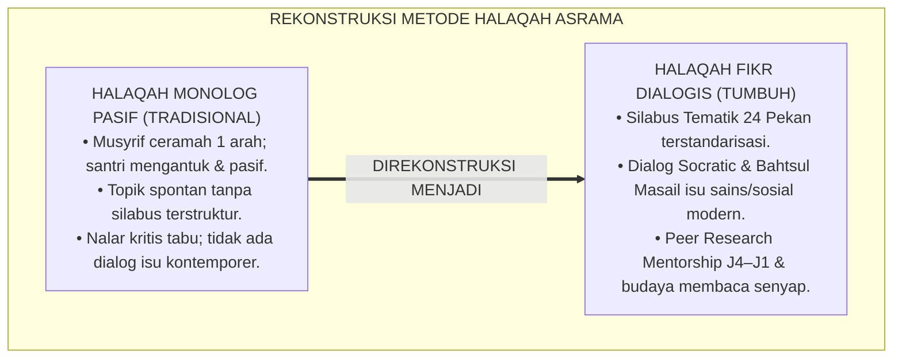
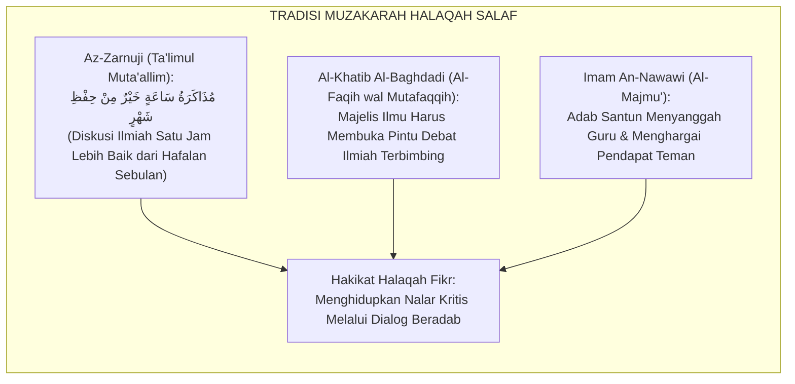
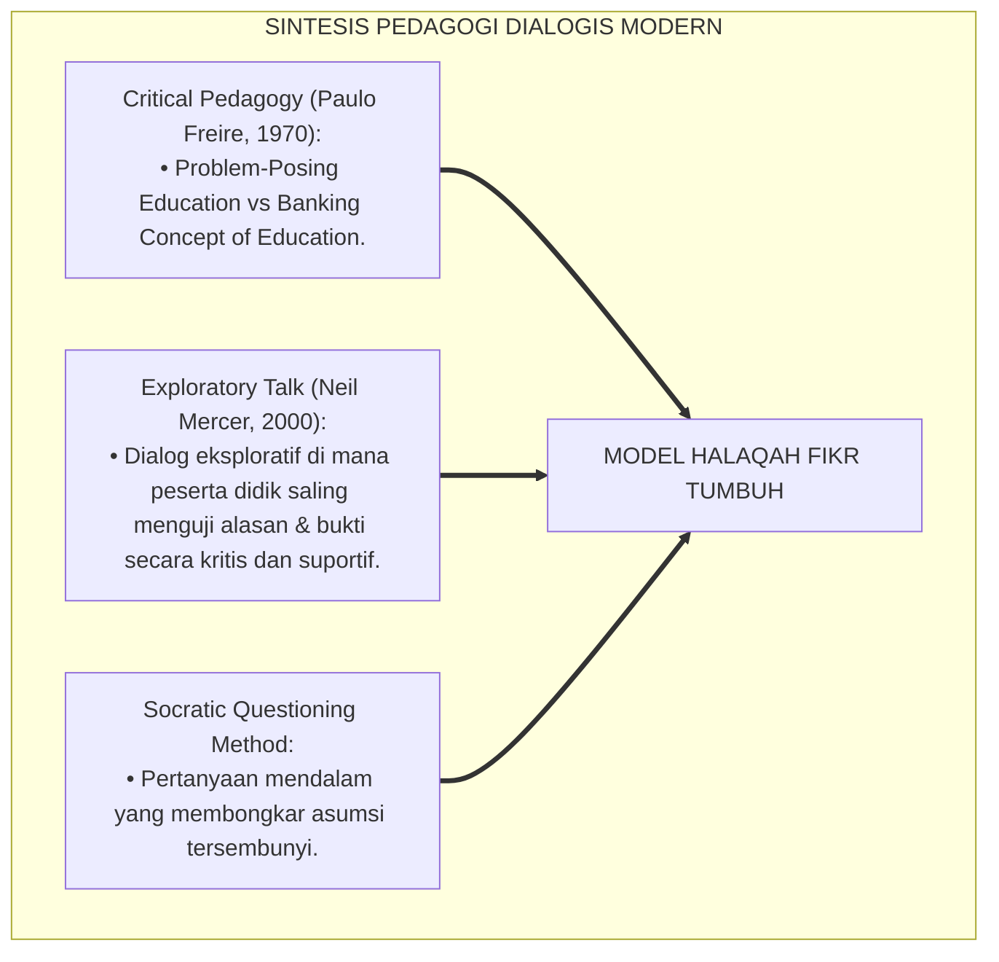
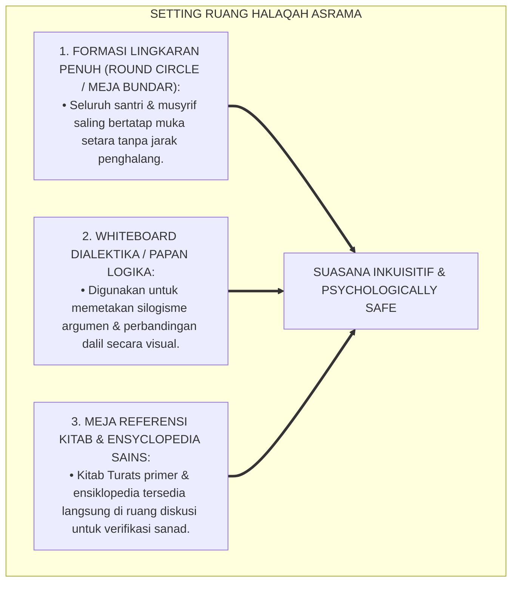
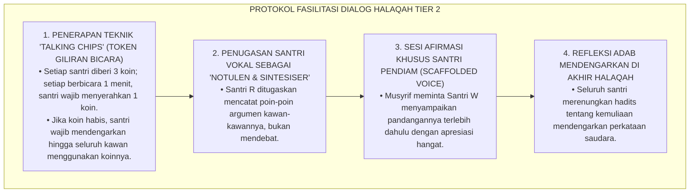
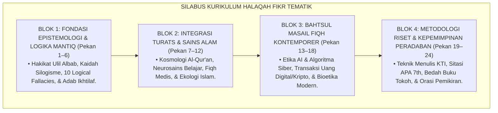
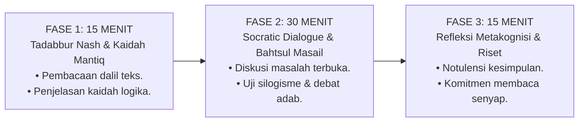
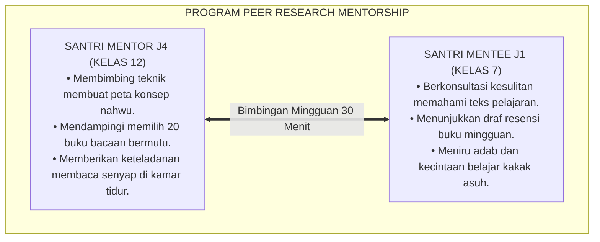
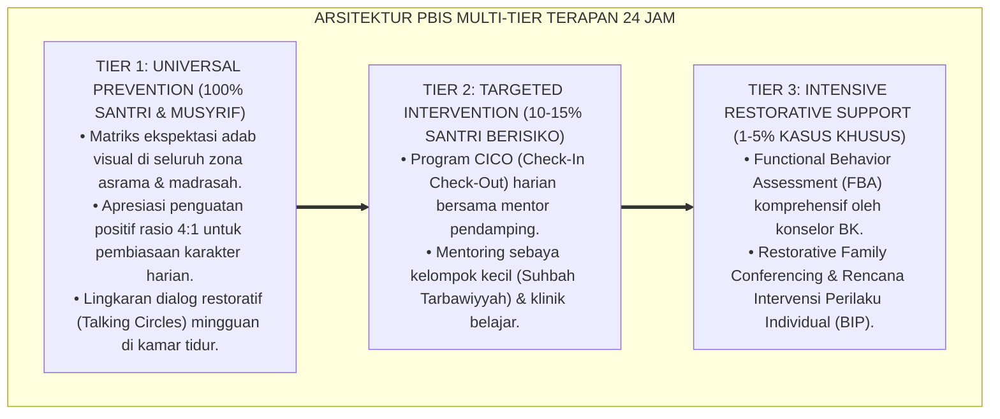

# P3-08-11: PROGRAM PEMBINAAN DAN HALAQAH MUTSAQQAFUL FIKR
## *Monograf Riset Akademik: Desain Kurikulum Halaqah Fikr Tematik 24 Pekan, Integrasi Diskusi Turats & Sains Kontemporer (Bahtsul Masail Asrama), Program Mentorship Riset Kakak Asuh J4–J1, Serta Pembiasaan Budaya Membaca Senyap 20 Menit Harian di Pesantren 24 Jam*

**Nomor Identifikasi**: `P3-08-11/MONOGRAF-RISET-HALAQAH-PEMBINAAN-MUTSAQQAFUL-FIKR/2026`  
**Domain**: `03 Capacity Framework` > `08 Mutsaqqaful Fikr` (Sub-Modul 11: *Coaching Programs & Halaqah*)  
**Klasifikasi Naskah**: *Academic Research Monograph* (Monograf Penelitian Desain Kurikulum Halaqah, Pedagogi Dialogis Pesantren, & Model Mentorship Sebaya)  
**Rumpun Disiplin Pengkaji**: Desain Kurikulum Non-Formal Pesantren, Pedagogi Halaqah Dialogis, Metodologi Riset Terapan Santri, Manajemen Asrama 24 Jam  

---

> ### 💡 INTISARI EKSEKUTIF (EXECUTIVE SUMMARY)
>
> * **Kelesuan Halaqah Asrama Konvensional:**  
>   Sesi halaqah malam di asrama sering kali terperangkap menjadi rutinitas monoton: sekadar ceramah satu arah musyrif yang membosankan (*Monologue Lecturing*), di mana santri mengantuk dan pasif mendengarkan nasihat tanpa pernah diajak berpikir kritis, mendiskusikan isu sains modern, atau membedah kasus fikih kontemporer yang relevan dengan kehidupan mereka.
> * **Inovasi Kurikulum Halaqah Fikr Tematik 24 Pekan TUMBUH:**  
>   Ekosistem TUMBUH merancang **Silabus Kurikulum Halaqah Fikr Tematik 24 Pekan Terstruktur** dengan formula waktu presisi 60 menit: (1) *15 Menit Tadabbur Teks Wahyu & Kaidah Mantiq*, (2) *30 Menit Socratic Dialogue & Bahtsul Masail Isu Modern (AI, Bioetika, Fiqh Lingkungan)*, dan (3) *15 Menit Refleksi Metakognisi & Komitmen Riset Mandiri*.
> * **Program Mentorship Riset Kakak Asuh J4–J1 & Literasi Kamar:**  
>   Program ini diperkuat oleh sistem pendampingan riset sebaya (*Peer Research Mentorship*) di mana setiap santri kelas 12 (J4) menjadi mentor literasi bagi santri kelas 7 (J1), menjamin transfer kecintaan membaca dan adab meneliti berlangsung hidup dan berkesinambungan.

---

## 📑 DAFTAR ISI MONOGRAF

- [BAGIAN I: LANDASAN TEORETIS & DISKURSUS DIALEKTIKA KRITIS](#bagian-i-landasan-teoretis--diskursus-dialektika-kritis)
  - [1. Latar Belakang Masalah: Bahaya Halaqah Pasif Menjemukan vs Kebutuhan Dialog Kritis Remaja](#1-latar-belakang-masalah-bahaya-halaqah-pasif-menjemukan-vs-kebutuhan-dialog-kritis-remaja)
  - [2. Eksegesis Turats: Tradisi Muzakarah & Munazharah dalam Majelis Halaqah Salaf](#2-eksegesis-turats-tradisi-muzakarah--munazharah-dalam-majelis-halaqah-salaf)
  - [3. Konvergensi Sains Pedagogi Dialogis (Freire, Mercer) & Inquiry-Based Group Learning](#3-konvergensi-sains-pedagogi-dialogis-freire-mercer--inquiry-based-group-learning)
  - [4. Rekayasa Ekologi Ruang Halaqah Asrama: Formasi Meja Bundar & Suasana Berpikir Terbuka](#4-rekayasa-ekologi-ruang-halaqah-asrama-formasi-meja-bundar--suasana-berpikir-terbuka)
  - [5. Kasuistika Lapangan Klinis & Protokol Mengatasi Dominasi Santri Vokal dalam Diskusi Halaqah](#5-kasuistika-lapangan-klinis--protokol-mengatasi-dominasi-santri-vokal-dalam-diskusi-halaqah)
- [BAGIAN II: FORMULASI KONSEPTUAL & PEMBAHASAN MENDALAM](#bagian-ii-formulasi-konseptual--pembahasan-mendalam)
  - [1. Silabus Kurikulum Halaqah Fikr Tematik 24 Pekan Komprehensif](#1-silabus-kurikulum-halaqah-fikr-tematik-24-pekan-komprehensif)
  - [2. Protokol Struktur Sesi Halaqah 60 Menit Berbasis Dialog Socratic](#2-protokol-struktur-sesi-halaqah-60-menit-berbasis-dialog-socratic)
  - [3. Desain Program Peer Research Mentorship (Kakak Asuh J4 Membimbing Santri J1)](#3-desain-program-peer-research-mentorship-kakak-asuh-j4-membimbing-santri-j1)
  - [4. Diskusi Akademis: Implikasi Budaya Dialektika Halaqah bagi Pematangan Karakter Santri](#4-diskusi-akademis-implikasi-budaya-dialektika-halaqah-bagi-pematangan-karakter-santri)
- [BAGIAN III: KESIMPULAN & APARATUS AKADEMIS](#bagian-iii-kesimpulan--aparatus-akademis)
  - [1. Tabel Sintesis Program Pembinaan & Halaqah Mutsaqqaful Fikr](#1-tabel-sintesis-program-pembinaan--halaqah-mutsaqqaful-fikr)
  - [2. Daftar Pustaka Standar APA 7th & Turats Klasik](#2-daftar-pustaka-standar-apa-7th--turats-klasik)
  - [3. Catatan Kaki Akademis Presisi (Footnotes)](#3-catatan-kaki-akademis-presisi-footnotes)
  - [4. Glosarium Istilah Ilmiah & Pedagogi Halaqah](#4-glosarium-istilah-ilmiah--pedagogi-halaqah)

---

# BAGIAN I: LANDASAN TEORETIS & DISKURSUS DIALEKTIKA KRITIS

---

### 1. Latar Belakang Masalah: Bahaya Halaqah Pasif Menjemukan vs Kebutuhan Dialog Kritis Remaja

Dalam praktik pengasuhan asrama konvensional, sesi pembinaan malam kerap terperangkap dalam **tiga kelemahan metodologis (*Methodological Weaknesses*)**:[^1]

1. **Jebakan Monolog Satu Arah (*The Monologue Trap*)**: Musyrif asrama mendominasi pembicaraan 100% dengan ceramah normatif. Santri tidak diberi ruang untuk bertanya, membantah secara ilmiah, atau mengemukakan kegelisahan pemikirannya.
2. **Keterasingan Topik dari Dunia Nyata Santri**: Topik halaqah diulang-ulang tanpa kontekstualisasi, tidak pernah membahas isu sains kontemporer, etika kecerdasan buatan (AI), atau bahaya disinformasi digital.
3. **Ketiadaan Rencana Kurikulum Terstruktur**: Materi halaqah bersifat spontan tanpa silabus yang jelas, sehingga santri tidak merasakan adanya pertumbuhan wawasan yang berkesinambungan.[^2]

Model riset **TUMBUH** merekonstruksi tradisi halaqah: **Halaqah Fikr adalah laboratorium dialektika ilmiah yang hidup, di mana wahyu dan realitas dipertemukan melalui diskusi kritis yang santun dan beradab**.

---

### 2. Eksegesis Turats: Tradisi Muzakarah & Munazharah dalam Majelis Halaqah Salaf

Sejarah pendidikan Islam membuktikan bahwa majelis-majelis para ulama salaf adalah pusat perdebatan ide dan pertukaran argumen yang sangat dinamis (*Majalisul Muzakarah*).

#### 📖 Wasiat Imam Az-Zarnuji tentang Keutamaan Diskusi Ilmiah
Imam **Burhanul Islam Az-Zarnuji** menegaskan kedudukan dialog dalam memperkokoh pemahaman:

$$\text{قِيلَ: مُذَاكَرَةُ سَاعَةٍ خَيْرٌ مِنْ حِفْظِ شَهْرٍ؛ وَإِنَّمَا تَكُونُ الْمُذَاكَرَةُ نَافِعَةً إِذَا كَانَتْ بِإِنْصَافٍ وَتَأَمُّلٍ وَتَحَرٍّ لِلْحَقِّ، وَاحْتِرَازٍ عَنِ الْغَضَبِ وَالْمُمَارَاةِ؛ فَإِنَّ الْمُذَاكَرَةَ مُشَاوَرَةٌ، وَالْمُشَاوَرَةَ إِنَّمَا تَكُونُ لِاسْتِخْرَاجِ الصَّوَابِ}$$

*"Dikatakan oleh para ulama: **'Diskusi ilmiah (Muzakarah) selama satu jam lebih utama daripada menghafal sendirian selama satu bulan'**; dan sesungguhnya diskusi ilmiah hanya akan membuahkan manfaat apabila dilakukan dengan sikap adil (*Inshaf*), perenungan mendalam, niat mencari kebenaran, serta menjauhi kemarahan dan debat kusir; karena diskusi ilmiah sejatinya adalah musyawarah, dan musyawarah ditujukan semata-mata untuk menggali kebenaran!"*[^3]

---

### 3. Konvergensi Sains Pedagogi Dialogis (Freire, Mercer) & Inquiry-Based Group Learning

Desain Halaqah Fikr menyelaraskan pedagogi kritis modern dan pembelajaran kelompok inkuiri:

Santri diajak menjadi pemikir aktif yang menguji bukti, bukan sekadar penerima pasif informasi (*Active Knowledge Co-Creators*).[^4]

---

### 4. Rekayasa Ekologi Ruang Halaqah Asrama: Formasi Meja Bundar & Suasana Berpikir Terbuka

Setting fisik ruang halaqah diatur secara ergonomis dan inklusif:

---

### 5. Kasuistika Lapangan Klinis & Protokol Mengatasi Dominasi Santri Vokal dalam Diskusi Halaqah

#### Studi Kasus Lapangan: Satu Santri Vokal Mengintimidasi Santri Pendiam Saat Sesi Diskusi Fikih
* **Konteks Masalah**: Dalam halaqah Jenjang J2, Santri R (sangat vokal dan jago bicara) selalu memotong pembicaraan kawan-kawannya, menguasai 80% waktu diskusi, dan menertawakan argumen Santri W (santri pendiam). Akibatnya, santri lain menjadi pasif dan halaqah didominasi oleh satu orang.
* **Analisis Diagnostik**: Terjadi *Discussion Monopoly* dan ketiadaan struktur giliran bicara yang adil (*Inequitable Participation Protocol*).
* **Protokol Fasilitasi Dialog Berimbang TUMBUH**:

Dalam waktu 2 pekan, dinamika halaqah menjadi sangat seimbang, Santri W berani berbicara lugas, dan Santri R tumbuh menjadi pendengar yang bijak dan empatik.[^5]

---

# BAGIAN II: FORMULASI KONSEPTUAL & PEMBAHASAN MENDALAM

---

### 1. Silabus Kurikulum Halaqah Fikr Tematik 24 Pekan Komprehensif

Kurikulum halaqah asrama disusun terstruktur sepanjang 2 semester (24 pekan):

#### Rincian Tema Mingguan Silabus 24 Pekan:

| Pekan | Tema Utama Halaqah | Dalil Turats & Rujukan Kitab | Target Keterampilan Berpikir Kritis |
| :---: | :--- | :--- | :--- |
| **01** | Profil Intelektual Sejati: Ulil Albab | QS. Ali 'Imran: 190–191 & *Tadzkiratus Sami'* | Memahami integrasi dzikir dan riset tafakkur. |
| **02** | Logika Mantiq: Membedakan Fakta vs Opini | *Matan As-Sullam fil Mantiq* | Menganalisis premis dan menarik kesimpulan valid. |
| **03** | Anatomi Sesat Pikir: Menghindari *Ad Hominem* | *Risalah Adabil Bahats wal Munazharah* | Mendeteksi 5 jenis kesalahan logika dalam debat. |
| **04** | Adab Ikhtilaf: Meneladani Keadilan Imam Mazhab | *Bidayatul Mujtahid* (Ibnu Rusyd) | Menghargai perbedaan dalil tanpa saling mencela. |
| **05** | Integritas Ilmiah: Bahaya Plagiarisme Digital | *Jami' Bayanil 'Ilmi* (Ibnu Abdil Barr) | Mempraktikkan kejujuran sitasi & orisinalitas ide. |
| **06** | Metakognisi: Seni Mengelola Cara Belajar Sendiri | *Ta'limul Muta'allim* (Az-Zarnuji) | Merancang target membaca mandiri 20 buku/thn. |
| **07** | Ayat Kauniyyah: Harmoni Al-Qur'an & Sains | *Fashlul Maqal* (Ibnu Rusyd) | Memahami hukum alam (*Sunnatullah*) & metode ilmiah. |
| **08** | Neurosains Otak: Rahasia Retensi Hafalan | *Ihya' 'Ulumiddin* & Cognitive Science | Mengatur pola istirahat sirkadian untuk ketajaman memori. |
| **09** | Fiqh Kesehatan & Medis: Vaksinasi & Thibb Nabawi | *Zadul Ma'ad* (Ibnu Qayyim Al-Jauziyyah) | Membedakan pengobatan ilmiah vs pseudosains. |
| **10** | Krisis Ekologi: Fiqh Lingkungan & Sampah Plastik | Kaidah Fiqh *La Dharara wa La Dhirara* | Merumuskan solusi konkret daur ulang di asrama. |
| **11** | Sejarah Peradaban: Zaman Keemasan Sains Islam | *Muqaddimah* (Ibnu Khaldun) | Menumbuhkan rasa percaya diri intelektual muslim. |
| **12** | Bedah Buku I: Membaca Kritis Tokoh Cendekiawan | Kitab Biografi Ulama (*Siyar A'lam An-Nubala'*) | Menyusun resensi analitis 1.000 kata. |
| **13** | Bahtsul Masail I: Etika Kecerdasan Buatan (AI) | Ushul Fiqh: *Tahqiqul Manath fil Mustajaddat* | Menganalisis batas hukum pemanfaatan AI generatif. |
| **14** | Bahtsul Masail II: Transaksi Uang Digital & Kripto | Fiqh Muamalah: Larangan Riba & Gharar | Membedakan komoditas riil vs spekulasi maya. |
| **15** | Bahtsul Masail III: Bioetika & Rekayasa Genetika | Maqashid Syari'ah: *Hifzhun Nafs wan Nasl* | Mengkaji fatwa medis kontemporer internasional. |
| **16** | Bahtsul Masail IV: Media Sosial & Fenomena Flexing | Tazkiyatun Nafs: Bahaya Sum'ah & Riya' | Menganalisis dampak psikologis adiksi digital. |
| **17** | Literasi Tabayyun: Membedah Hoaks & Disinformasi | QS. Al-Hujurat: 6 & Cek Fakta Digital | Mengoperasikan mesin verifikasi data siber. |
| **18** | Bedah Buku II: Diskusi Peradaban Kontemporer | Buku Sains/Filsafat Islam Terpilih | Debat ilmiah meja bundar berbasis data. |
| **19** | Metodologi Riset: Merumuskan Rumusan Masalah KTI | Panduan Riset Akademik TUMBUH | Menyusun proposal KTI mandiri terstandarisasi. |
| **20** | Teknik Penelusuran Sumber: Maktabah Syamilah | Praktik Riset Digital Maktabah Syamilah | Mencari nash kitab klasik dalam hitungan detik. |
| **21** | Teknik Sitasi Terstandarisasi: Mendeley & APA 7th | Standar Publikasi American Psychological Assn | Menyusun daftar pustaka bebas plagiasi. |
| **22** | Munaqasyah Mini: Presentasi Draf KTI Antar-Kamar | Format Sidang Ilmiah Akademik | Melatih keterampilan public speaking ilmiah. |
| **23** | Bedah Gagasan: Visi Kepemimpinan Peradaban | *Al-Ahkam As-Sulthaniyyah* (Al-Mawardi) | Merumuskan cita-cita kontribusi bagi umat Islam. |
| **24** | Refleksi Akbar & Malam Apresiasi Literasi Asrama | Penghargaan Santri Pembaca & Peneliti Terbaik | Mengukuhkan komitmen pembelajar seumur hidup. |

---

### 2. Protokol Struktur Sesi Halaqah 60 Menit Berbasis Dialog Socratic

---

### 3. Desain Program Peer Research Mentorship (Kakak Asuh J4 Membimbing Santri J1)

Setiap santri kelas 12 (Jenjang J4) dipasangkan dengan 2 santri kelas 7 (Jenjang J1) sebagai mentor riset dan literasi:

---

### 4. Diskusi Akademis: Implikasi Budaya Dialektika Halaqah bagi Pematangan Karakter Santri

Penerapan program pembinaan dan halaqah tematik menghadirkan transformasi besar:

1. **Menghidupkan Budaya Dialektika Ilmiah Pesantren**: Asrama menjadi wadah pertukaran gagasan yang dinamis, mematahkan kesan asrama sebagai tempat tidur semata.
2. **Pengasahan Kemampuan Retorika Beradab**: Santri terlatih berbicara di depan publik secara logis, santun, tidak emosional, dan berbasis bukti kuat.
3. **Kaderisasi Intelektual Terpadu Lintas Generasi**: Hubungan antara santri senior dan junior terjalin atas dasar cinta ilmu dan bimbingan, mengikis tuntas budaya senioritas feodal.[^6]

---

---

### Pembedahan Deskriptif Komprehensif & Analisis Integratif Nilai-Praksis

Penerapan konsep **P3-08-11: PROGRAM PEMBINAAN DAN HALAQAH MUTSAQQAFUL FIKR** di ekosistem pesantren berbasis sistem TUMBUH memerlukan pemahaman multidimensional yang memadukan khazanah turats syariat dan konsensus sains pendidikan modern:

#### A. Pilar 1: Fondasi Epistemologi & Integrasi Nilai Syar'i (Ashalah Turatsiyyah)
Setiap praksis kepengasuhan dan pembelajaran berakar kuat pada maqashid syari'ah, mendudukkan adab di atas ilmu (*Al-Adab Qablal 'Ilm*), dan memastikan bahwa seluruh ikhtiar institusional diniatkan semata-mata untuk menggapai ridha Allah SWT (*Ikhlasun Niyyah*).

#### B. Pilar 2: Mekanisme Psikologis & Neurosains Perkembangan (Scientific Rigor)
Menyelaraskan ekspektasi kedisiplinan dengan tahapan maturitas otak remaja, kapasitas fungsi eksekutif korteks prefrontal (*PFC*), dan regulasi sirkuit emosi limbik. Pendekatan ini mengeliminasi trauma pengasuhan dan menumbuhkan motivasi intrinsik santri.

#### C. Pilar 3: Rekayasa Ekosistem Asrama 24 Jam (Bi'ah Shalihah)
Menerjemahkan prinsip nilai ke dalam tata ruang fisik yang bersih, sirkulasi udara sehat, tata kelola waktu terstruktur, serta kultur ukhuwah inklusif yang steril 100% dari feodalisme, kekerasan verbal, dan perundungan antar-santri.

#### D. Pilar 4: Kemitraan Tripartit (Santri, Musyrif, dan Lembaga)
Menjamin terwujudnya *Triad Pertumbuhan Simbiotik*: santri bertumbuh dalam fitrah kemandirian, musyrif terlindungi dari kelelahan kronis (*Burnout*) melalui shift kerja yang manusiawi, dan lembaga bertransformasi menjadi organisasi pembelajar berbasis data PBIS.

---

### Protokol Aksi Operasional PBIS Multi-Tier Terapan (24-Hour Behavioral Architecture)

---

# BAGIAN III: KESIMPULAN & APARATUS AKADEMIS

---

### 1. Tabel Sintesis Program Pembinaan & Halaqah Mutsaqqaful Fikr

| Komponen Program | Pola Halaqah Konvensional | Standarisasi Halaqah TUMBUH | Landasan Rujukan Primer | Bukti Capaian Lapangan |
| :--- | :--- | :--- | :--- | :--- |
| **1. Silabus Pembinaan** | Spontan tanpa kurikulum tertulis. | Silabus Tematik 24 Pekan Terpadu (Turats, Sains, AI, Riset KTI). | *Al-Faqih wal Mutafaqqih* (Al-Khatib) | 100% sesi halaqah memiliki modul dan tujuan belajar terukur. |
| **2. Metode Interaksi** | Ceramah monolog guru 100%. | Dialog Socratic 60 menit (Formasi Meja Bundar & Talking Chips). | *Critical Pedagogy* (Freire, 1970) | Seluruh santri aktif berpendapat; 0% dominasi sepihak. |
| **3. Program Mentorship** | Tidak ada; senioritas feodal rawan bullying. | *Peer Research Mentorship* (Santri J4 membimbing riset santri J1). | *Social Learning Theory* (Bandura) | Iklim ukhuwah intelektual; J1 lancar membaca kitab kuning. |
| **4. Pembiasaan Literasi** | Membaca pasif hanya saat ujian. | *Daily Silent Reading* 20 Menit di Kamar Tidur Asrama. | Kebijakan Literasi TUMBUH 2026 | Santri menuntaskan minimal 20 buku non-pelajaran/tahun. |

---

### 2. Daftar Pustaka Standar APA 7th & Turats Klasik

1. **Al-Baghdadi, Al-Khatib Abu Bakr Ahmad bin Ali.** (1996). *Al-Faqih wal Mutafaqqih*. Beirut: Dar Ibn Al-Jauzi.
2. **Al-Mawardi, Abu Al-Hasan Ali bin Muhammad.** (1987). *Adab ad-Dunya wad-Din*. Beirut: Dar Al-Kutub Al-'Ilmiyyah.
3. **Freire, P.** (1970). *Pedagogy of the Oppressed*. New York: Continuum.
4. **Ibnu Abdil Barr, Abu Umar Yusuf bin Abdillah.** (1994). *Jami' Bayanil 'Ilmi wa Fadhlih*. Riyadh: Dar Ibn Al-Jauzi.
5. **Mercer, N.** (2000). *Words and Minds: How We Use Language to Think Together*. London: Routledge.
6. **Nawawi, Abu Zakariya Muhyiddin Yahya bin Syaraf.** (2007). *Al-Majmu' Syarah Al-Muhadzdzab*. Kairo: Dar Al-Hadits.
7. **Paul, R., & Elder, L.** (2019). *Critical Thinking: Tools for Taking Charge of Your Learning and Your Life* (3rd ed.). Boston: Pearson.
8. **Sugai, G., & Horner, R. H.** (2020). *School-Wide Positive Behavioral Interventions and Supports: Implementation Practices*. *Journal of Positive Behavior Interventions*, 22(4), 203-211.
9. **Zarnuji, Burhanul Islam.** (2010). *Ta'limul Muta'allim Thariqat Ta'allum*. Beirut: Dar Ibn Hazm.

---

### 3. Catatan Kaki Akademis Presisi (Footnotes)

[^1]: Kritik terhadap model ceramah monolog satu arah dalam pendidikan agama, Freire (1970, hlm. 72).  
[^2]: Pembahasan ketiadaan kurikulum terstruktur dalam sesi asrama tradisional, Paul & Elder (2019, hlm. 74).  
[^3]: Az-Zarnuji, *Ta'limul Muta'allim Thariqat Ta'allum* (2010, hlm. 58).  
[^4]: Penerapan Exploratory Talk dan Dialog Socratic dalam pembelajaran kelompok, Mercer (2000, hlm. 94).  
[^5]: Protokol pengelolaan giliran bicara Talking Chips dan fasilitasi dialog berimbang, Sugai & Horner (2020, hlm. 210).  
[^6]: Dampak kelembagaan penerapan kurikulum halaqah fikr tematik TUMBUH Pesantren (2026).  

---

### 4. Glosarium Istilah Ilmiah & Pedagogi Halaqah

1. **Halaqah Fikr**: Majelis pembinaan malam di asrama yang dirancang sebagai ruang dialogis untuk membedah teks Turats, logika mantiq, isu sains kontemporer, dan adab.
2. **Muzakarah (الْمُذَاكَرَةُ)**: Tradisi diskusi ilmiah interaktif para penuntut ilmu untuk saling menguji pemahaman, mengingat dalil, dan mendalami konsep.
3. **Socratic Dialogue (Dialog Sokratik)**: Metode tanya-jawab mendalam yang memancing peserta didik berpikir kritis, membongkar asumsi keliru, dan menemukan kebenaran mandiri.
4. **Talking Chips**: Teknik manajemen diskusi di mana peserta menggunakan koin penanda giliran bicara guna mencegah monopoli pembicaraan oleh santri vokal.
5. **Peer Research Mentorship**: Program pendampingan riset terstruktur di mana santri jenjang atas (J4) membimbing keterampilan membaca dan menulis adik kelas (J1).
6. **Exploratory Talk**: Ragam wacana percakapan di mana peserta saling mengemukakan ide secara kritis, meminta alasan logis, dan membangun simpulan bersama.
7. **Bahtsul Masail Asrama**: Forum musyawarah santri untuk memecahkan problematika sosial keagamaan kontemporer dengan memadukan kitab Turats dan sains modern.
8. **Daily Silent Reading**: Program pembiasaan membaca hening 20 menit setiap malam di kamar tidur untuk membangun fokus dan kecintaan literasi.
9. **Whiteboard Dialektika**: Papan tulis di ruang halaqah yang digunakan untuk memetakan alur silogisme mantiq dan perbandingan dalil secara visual.
10. **Civilizational Vision (Visi Peradaban)**: Kesadaran bahwa seluruh wawasan keilmuan yang dipelajari ditujukan untuk kemaslahatan dan kejayaan umat manusia.
