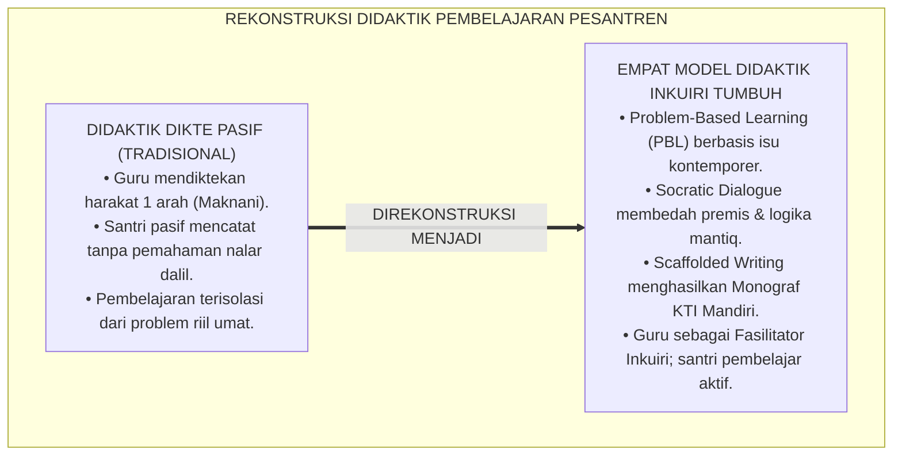
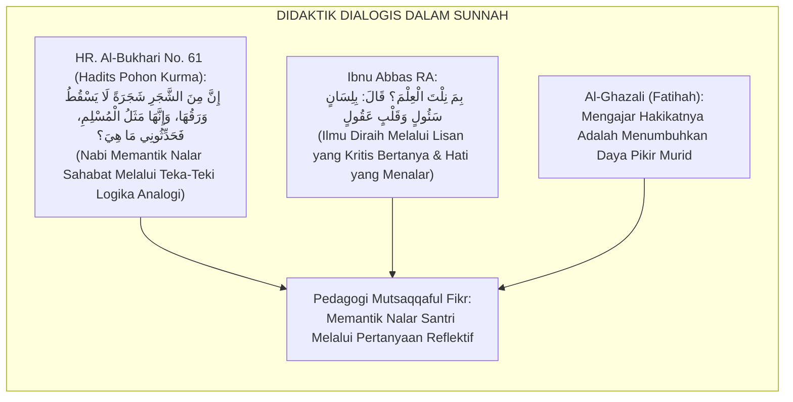
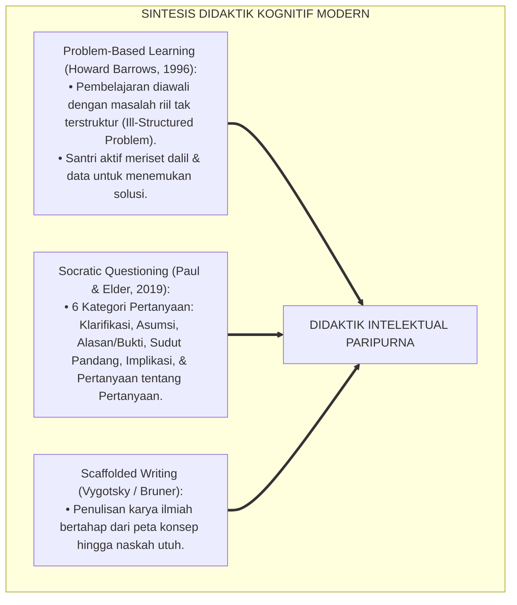
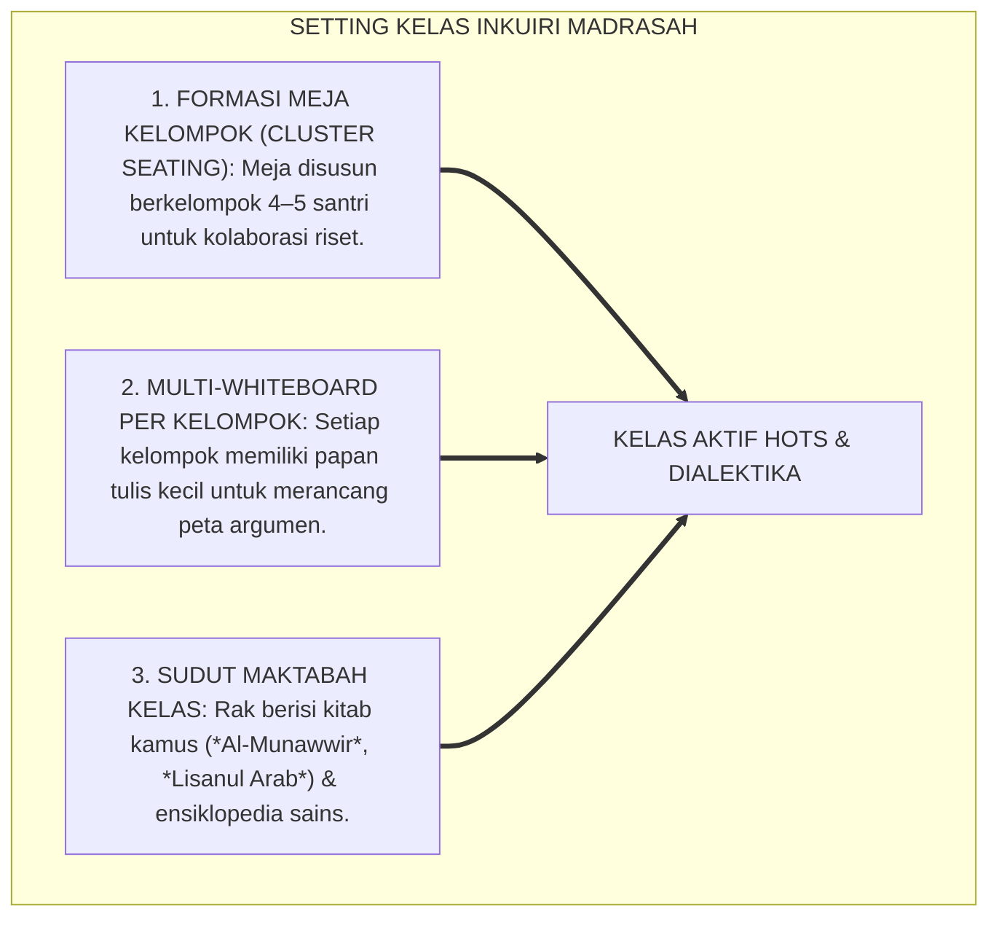
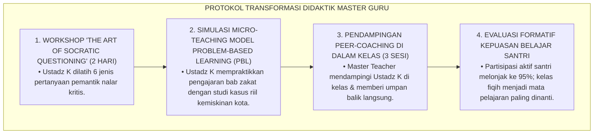
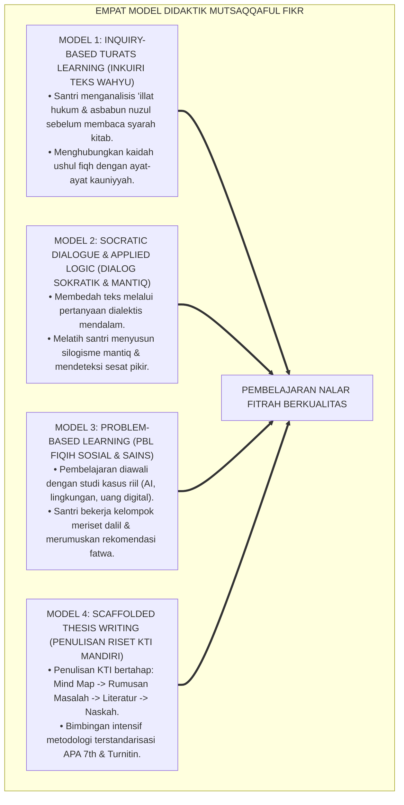
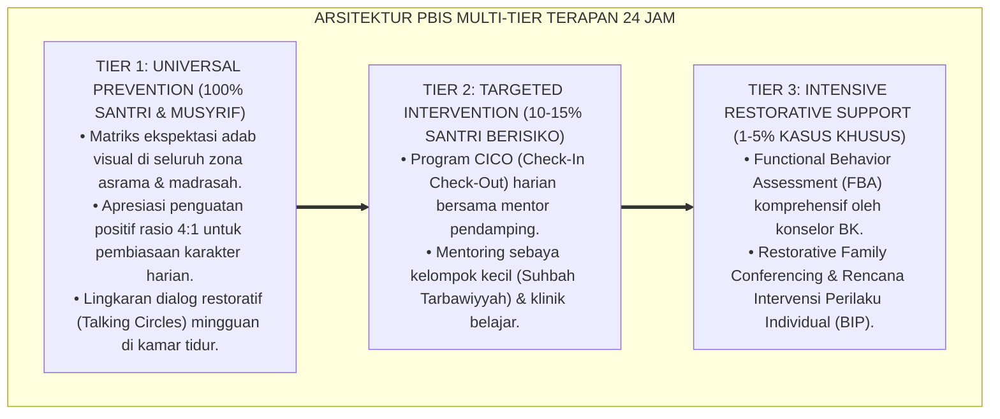

# P3-08-12: METODE PEDAGOGI DAN DIDAKTIK INTELEKTUAL MUTSAQQAFUL FIKR
## *Monograf Riset Akademik: Empat Model Instruksional Berpikir Kritis (Problem-Based Learning, Socratic Dialogue, Inquiry-Based Turats, & Scaffolded Thesis Writing), Integrasi Nalar Bayani-Burhani di Ruang Kelas Madrasah, Eliminasi Metode Ceramah Pasif, Serta Pembentukan Pendidik Fasilitator Nalar di Pesantren 24 Jam*

**Nomor Identifikasi**: `P3-08-12/MONOGRAF-RISET-PEDAGOGI-DIDAKTIK-MUTSAQQAFUL-FIKR/2026`  
**Domain**: `03 Capacity Framework` > `08 Mutsaqqaful Fikr` (Sub-Modul 12: *Pedagogical Methods & Intellectual Didactics*)  
**Klasifikasi Naskah**: *Academic Research Monograph* (Monograf Penelitian Didaktik Inkuiri Islam, Desain Instruksional HOTS, & Transformasi Pedagogi Guru Pesantren)  
**Rumpun Disiplin Pengkaji**: Pedagogi Kritis Pendidikan Islam, Desain Instruksional Modern (*Instructional Design*), Metodologi Pengajaran Turats Interaktif, Teori Belajar Kognitif  

---

> ### 💡 INTISARI EKSEKUTIF (EXECUTIVE SUMMARY)
>
> * **Kemacetan Didaktik Pengajaran Kitab Tradisional:**  
>   Metode pengajaran kitab kuning di pesantren kerap terpaku pada pola *Bandongan/Sorogan* pasif: kiai/ustadz membaca dan menerjemahkan kalimat per kalimat (*Maknani*), sementara santri sekadar mencatat harakat dan terjemahan di bawah teks (*Nganggit/Njeluk*) tanpa pernah diajak berdiskusi tentang bagaimana hukum tersebut ditarik dari dalil, apa 'illat logisnya, dan bagaimana penerapannya pada isu-isu mutakhir.
> * **Empat Model Didaktik Mutsaqqaful Fikr TUMBUH:**  
>   Ekosistem TUMBUH merumuskan **Empat Model Instruksional Nalar Kritis Terpadu**: (1) *Model Inkuiri Turats Kontekstual (Inquiry-Based Turats Learning)*, (2) *Model Dialog Sokratik & Mantiq Terapan (Socratic Dialogue & Applied Logic)*, (3) *Model Pembelajaran Berbasis Masalah Fikih Sosial (Problem-Based Learning / PBL)*, dan (4) *Model Penulisan Riset Terbimbing Bertahap (Scaffolded Thesis Writing)*.
> * **Transformasi Peran Pendidik Menjadi Fasilitator Inkuiri:**  
>   Monograf ini membimbing guru madrasah dan musyrif bertransformasi dari sekadar "sumber kebenaran tunggal" menjadi "fasilitator inkuiri yang memantik rasa ingin tahu ilmiah santri", menciptakan iklim kelas yang hidup, dialogis, dan melahirkan karya riset orisinal.

---

## 📑 DAFTAR ISI MONOGRAF

- [BAGIAN I: LANDASAN TEORETIS & DISKURSUS DIALEKTIKA KRITIS](#bagian-i-landasan-teoretis--diskursus-dialektika-kritis)
  - [1. Latar Belakang Masalah: Bahaya Metode Dikte Pasif (Maknani) Tanpa Pelatihan Nalar Kritis](#1-latar-belakang-masalah-bahaya-metode-dikte-pasif-maknani-tanpa-pelatihan-nalar-kritis)
  - [2. Eksegesis Turats: Metode Dialog Interaktif Rasulullah SAW & Seni Bertanya Ulama Salaf](#2-eksegesis-turats-metode-dialog-interaktif-rasulullah-saw--seni-bertanya-ulama-salaf)
  - [3. Konvergensi Sains Desain Instruksional: Problem-Based Learning (Barrows) & Socratic Questioning (Paul-Elder)](#3-konvergensi-sains-desain-instruksional-problem-based-learning-barrows--socratic-questioning-paul-elder)
  - [4. Rekayasa Lingkungan Belajar Interaktif 24 Jam: Dari 'Kelas Pasif' Menuju 'Laboratorium Inkuiri'](#4-rekayasa-lingkungan-belajar-interaktif-24-jam-dari-kelas-pasif-menuju-laboratorium-inkuiri)
  - [5. Kasuistika Lapangan Klinis & Protokol Pelatihan Ustadz Mengubah Metode Ceramah Menjadi Diskusi HOTS](#5-kasuistika-lapangan-klinis--protokol-pelatihan-ustadz-mengubah-metode-ceramah-menjadi-diskusi-hots)
- [BAGIAN II: FORMULASI KONSEPTUAL & PEMBAHASAN MENDALAM](#bagian-ii-formulasi-konseptual--pembahasan-mendalam)
  - [1. Arsitektur Empat Model Didaktik Intelektual Mutsaqqaful Fikr](#1-arsitektur-empat-model-didaktik-intelektual-mutsaqqaful-fikr)
  - [2. Langkah-Langkah Operasional Sintaks Pembelajaran di Kelas Madrasah & Halaqah](#2-langkah-langkah-operasional-sintaks-pembelajaran-di-kelas-madrasah--halaqah)
  - [3. Matriks Penerapan Model Didaktik Berdasarkan Jenjang J1–J4](#3-matriks-penerapan-model-didaktik-berdasarkan-jenjang-j1j4)
  - [4. Diskusi Akademis & Implikasi bagi Revitalisasi Mutu Guru Pesantren Abad 21](#4-diskusi-akademis--implikasi-bagi-revitalisasi-mutu-guru-pesantren-abad-21)
- [BAGIAN III: KESIMPULAN & APARATUS AKADEMIS](#bagian-iii-kesimpulan--aparatus-akademis)
  - [1. Tabel Sintesis Metode Pedagogi & Didaktik Mutsaqqaful Fikr](#1-tabel-sintesis-metode-pedagogi--didaktik-mutsaqqaful-fikr)
  - [2. Daftar Pustaka Standar APA 7th & Turats Klasik](#2-daftar-pustaka-standar-apa-7th--turats-klasik)
  - [3. Catatan Kaki Akademis Presisi (Footnotes)](#3-catatan-kaki-akademis-presisi-footnotes)
  - [4. Glosarium Istilah Ilmiah & Didaktik Intelektual](#4-glosarium-istilah-ilmiah--didaktik-intelektual)

---

# BAGIAN I: LANDASAN TEORETIS & DISKURSUS DIALEKTIKA KRITIS

---

### 1. Latar Belakang Masalah: Bahaya Metode Dikte Pasif (Maknani) Tanpa Pelatihan Nalar Kritis

Dalam didaktik pengajaran madrasah tradisional, kerap terjadi **tiga kebuntuan instruksional (*Instructional Bottlenecks*)**:[^1]

1. **Jebakan Metode Dikte Terjemahan Semata (*The Passive Dictation Trap*)**: Pendidik menghabiskan 90% waktu jam pelajaran hanya mendiktekan harakat dan terjemahan kata-per-kata. Akal santri tidak pernah diajak berpikir: *Mengapa teks ini berbunyi demikian? Apa premis logisnya? Bagaimana dalil ini menjawab problem masyarakat hari ini?*
2. **Ketiadaan Pembelajaran Berbasis Masalah Riil (*Abstract Isolation*)**: Materi hukum syariat diajarkan dalam contoh-contoh klasik abad pertengahan (seperti budak sahaya atau barter gandum) tanpa pernah dikontekstualisasikan ke era transaksi digital, bioetika medis, atau krisis lingkungan hidup.
3. **Monopolisasi Jawaban Benar oleh Guru**: Guru memposisikan diri sebagai satu-satunya pemilik kebenaran mutlak; santri yang mencoba memberikan sudut pandang alternatif langsung dipotong dan disalahkan.[^2]

Model riset **TUMBUH** merekonstruksi didaktik: **pengajaran kitab kuning dan sains dipadukan dalam metode inkuiri interaktif yang membangkitkan nalar kritis santri**.

---

### 2. Eksegesis Turats: Metode Dialog Interaktif Rasulullah SAW & Seni Bertanya Ulama Salaf

Rasulullah SAW dalam mendidik para sahabat kerap menggunakan metode studi kasus problematik dan pertanyaan dialektis (*Al-Hiwar al-Istifhami*).

#### 📖 Wasiat Sahabat Ibnu Abbas RA tentang Seni Bertanya
Sahabat agung **Abdullah bin Abbas RA** (pakar tafsir umat ini) ditanya tentang rahasia keluasan ilmunya:

$$\text{قِيلَ لِابْنِ عَبَّاسٍ: بِمَ نِلْتَ هَذَا الْعِلْمَ؟ قَالَ: بِلِسَانٍ سَئُولٍ، وَقَلْبٍ عَقُولٍ}$$

*"Ditanyakan kepada Ibnu Abbas: 'Dengan cara apa engkau berhasil meraih keluasan ilmu yang agung ini?' Beliau menjawab: **'Dengan lisan yang senantiasa kritis bertanya (Lisan Sa'ul), dan akal hati yang senantiasa menalar dan memahami secara mendalam (Qalb 'Aqul)'**!"*[^3]

---

### 3. Konvergensi Sains Desain Instruksional: Problem-Based Learning (Barrows) & Socratic Questioning (Paul-Elder)

Didaktik Mutsaqqaful Fikr memadukan metode PBL dan teknik *Socratic Questioning*:

---

### 4. Rekayasa Lingkungan Belajar Interaktif 24 Jam: Dari 'Kelas Pasif' Menuju 'Laboratorium Inkuiri'

Ruang kelas madrasah direkayasa untuk memfasilitasi kerja kelompok dan debat ilmiah:

---

### 5. Kasuistika Lapangan Klinis & Protokol Pelatihan Ustadz Mengubah Metode Ceramah Menjadi Diskusi HOTS

#### Studi Kasus Lapangan: Ustadz Fiqih Mengalami Kebingungan Saat Mengubah Metode Ceramah Menjadi Diskusi Interaktif
* **Konteks Masalah**: Ustadz K (pengajar fiqih senior) terbiasa berceramah monolog selama 20 tahun. Ketika diminta menerapkan metode inkuiri, kelas menjadi kacau, santri ribut tanpa arah, dan materi bab fiqih tidak selesai.
* **Analisis Diagnostik**: Ustadz K mengalami *Facilitation Anxiety* dan belum menguasai teknik fasilitasi diskusi terstruktur (*Structured Socratic Facilitation*).
* **Protokol Pelatihan Pedagogi Master Guru TUMBUH**:

Transformasi ini membuktikan bahwa dengan pelatihan yang tepat, seluruh guru senior mampu bertransformasi menjadi fasilitator nalar kritis yang sangat inspiratif.[^4]

---

# BAGIAN II: FORMULASI KONSEPTUAL & PEMBAHASAN MENDALAM

---

### 1. Arsitektur Empat Model Didaktik Intelektual Mutsaqqaful Fikr

Ekosistem TUMBUH menetapkan empat model instruksional baku:

---

### 2. Langkah-Langkah Operasional Sintaks Pembelajaran di Kelas Madrasah & Halaqah

#### Sintaks Model Problem-Based Learning (PBL) Fikih Kontemporer (Durasi: 90 Menit):
1. **Fase 1: Orientasi Masalah Kontemporer (15 Menit)**: Pendidik menyajikan video/artikel kasus riil (misal: dilema etika donor organ atau pemanfaatan AI untuk ibadah).
2. **Fase 2: Pengorganisasian Kelompok Peneliti Santri (15 Menit)**: Santri dibagi ke dalam kelompok 4 orang untuk merumuskan pertanyaan hukum dan hipotesis dalil.
3. **Fase 3: Penyelidikan Dalil Mandiri & Maktabah Digital (30 Menit)**: Santri menelusuri dalil Al-Qur'an, hadits shahih, dan kitab Turats melalui aplikasi Maktabah Syamilah di lab/laptop kelas.
4. **Fase 4: Pengembangan & Presentasi Solusi Ijtihadi (20 Menit)**: Perwakilan kelompok mempresentasikan analisis maqashid syari'ah dan solusi hukumnya di hadapan kelas.
5. **Fase 5: Evaluasi & Refleksi Metakognisi (10 Menit)**: Pendidik bersama santri mengevaluasi kekuatan argumen dan menyimpulkan hikmah keilmuan.[^5]

---

### 3. Matriks Penerapan Model Didaktik Berdasarkan Jenjang J1–J4

| Jenjang Pendidikan | Model Didaktik Dominan | Fokus Aktivitas Belajar Santri | Peran Pendidik Utama |
| :--- | :--- | :--- | :--- |
| **Jenjang J1 (Kelas 7)** | *Inquiry-Based Turats* & Scaffolding Visual | Menganalisis peta konsep nahwu-sharaf menggunakan diagram warna; membaca mandiri 20 buku. | Pemandu (*Guide*) & Penyedia Alat Bantu Visual. |
| **Jenjang J2 (Kelas 8–9)** | *Socratic Dialogue* & Mantiq Terapan | Debat ilmiah terstruktur; mendeteksi 5 logical fallacy; menulis esai ilmiah 1.500 kata. | Moderator Dialektika & Penantang Nalar (*Challenger*). |
| **Jenjang J3 (Kelas 10–11)** | *Problem-Based Learning* & Bahtsul Masail | Meriset isu kontemporer (AI, kripto, lingkungan); menyusun Monograf KTI $\ge 20\text{ hal}$. | Fasilitator Riset & Pembimbing Metodologi Ilmiah. |
| **Jenjang J4 (Kelas 12)** | *Scaffolded Thesis Writing* & Sintesis Hikmah | Mempertahankan KTI di Sidang Munaqasyah Terbuka; publikasi jurnal; mentor riset junior J1. | Promotor Akademik & Rekan Diskusi Ilmiah (*Peer Colleague*). |

---

### 4. Diskusi Akademis & Implikasi bagi Revitalisasi Mutu Guru Pesantren Abad 21

Penerapan empat model didaktik ini menghasilkan dampak revolusioner:

1. **Evolusi Budaya Akademik Madrasah**: Kelas madrasah berubah dari ruang dengar pasif yang menjemukan menjadi arena perdebatan intelektual yang hidup dan menggugah kalbu.
2. **Peningkatan Prestasi Riset & Kompetisi Ilmiah Santri**: Santri terbiasa berpikir metodologis dan percaya diri bersaing dalam Olimpiade Sains Nasional (OSN), Lomba Karya Tulis Ilmiah (LKTI), dan debat internasional.
3. **Penyempurnaan Martabat Keguruan Pesantren**: Para ustadz diakui sebagai pendidik profesional yang menguasai seni pedagogi modern tanpa kehilangan kedalaman berkah Turats salaf.[^6]

---

---

### Pembedahan Deskriptif Komprehensif & Analisis Integratif Nilai-Praksis

Penerapan konsep **P3-08-12: METODE PEDAGOGI DAN DIDAKTIK INTELEKTUAL MUTSAQQAFUL FIKR** di ekosistem pesantren berbasis sistem TUMBUH memerlukan pemahaman multidimensional yang memadukan khazanah turats syariat dan konsensus sains pendidikan modern:

#### A. Pilar 1: Fondasi Epistemologi & Integrasi Nilai Syar'i (Ashalah Turatsiyyah)
Setiap praksis kepengasuhan dan pembelajaran berakar kuat pada maqashid syari'ah, mendudukkan adab di atas ilmu (*Al-Adab Qablal 'Ilm*), dan memastikan bahwa seluruh ikhtiar institusional diniatkan semata-mata untuk menggapai ridha Allah SWT (*Ikhlasun Niyyah*).

#### B. Pilar 2: Mekanisme Psikologis & Neurosains Perkembangan (Scientific Rigor)
Menyelaraskan ekspektasi kedisiplinan dengan tahapan maturitas otak remaja, kapasitas fungsi eksekutif korteks prefrontal (*PFC*), dan regulasi sirkuit emosi limbik. Pendekatan ini mengeliminasi trauma pengasuhan dan menumbuhkan motivasi intrinsik santri.

#### C. Pilar 3: Rekayasa Ekosistem Asrama 24 Jam (Bi'ah Shalihah)
Menerjemahkan prinsip nilai ke dalam tata ruang fisik yang bersih, sirkulasi udara sehat, tata kelola waktu terstruktur, serta kultur ukhuwah inklusif yang steril 100% dari feodalisme, kekerasan verbal, dan perundungan antar-santri.

#### D. Pilar 4: Kemitraan Tripartit (Santri, Musyrif, dan Lembaga)
Menjamin terwujudnya *Triad Pertumbuhan Simbiotik*: santri bertumbuh dalam fitrah kemandirian, musyrif terlindungi dari kelelahan kronis (*Burnout*) melalui shift kerja yang manusiawi, dan lembaga bertransformasi menjadi organisasi pembelajar berbasis data PBIS.

---

### Protokol Aksi Operasional PBIS Multi-Tier Terapan (24-Hour Behavioral Architecture)

---

# BAGIAN III: KESIMPULAN & APARATUS AKADEMIS

---

### 1. Tabel Sintesis Metode Pedagogi & Didaktik Mutsaqqaful Fikr

| Dimensi Didaktik | Metode Tradisional Pesantren | Rekonstruksi Model TUMBUH | Landasan Rujukan Primer | Bukti Capaian Lapangan |
| :--- | :--- | :--- | :--- | :--- |
| **1. Pola Interaksi** | Ceramah mendiktekan harakat (Maknani pasif). | Inkuiri Turats Interaktif & Dialog Sokratik HOTS. | HR. Al-Bukhari No. 61 & *Socratic Questioning* | Partisipasi aktif kelas $\ge 90\%$; santri berani berpendapat. |
| **2. Pemecahan Masalah** | Contoh kasus klasik abstrak abad pertengahan. | Problem-Based Learning (PBL) isu kontemporer (AI, ekologi). | Teori PBL (Howard Barrows, 1996) | Santri mampu merumuskan solusi fikih atas problem sosial riil. |
| **3. Bimbingan Menulis** | Penugasan makalah tanpa bimbingan metodologi. | Scaffolded Thesis Writing menuju Monograf KTI Mandiri. | Teori Scaffolding (Vygotsky / Bruner) | 100% santri lulus mempertahankan KTI orisinal bebas plagiasi. |
| **4. Pemanfaatan Teknologi** | Menghindari komputer/internet di kelas. | Integrasi Maktabah Syamilah digital & peranti lunak Mendeley. | *Educational Technology Standards* | Santri mahir riset literatur digital dalam hitungan menit. |

---

### 2. Daftar Pustaka Standar APA 7th & Turats Klasik

1. **Al-Bukhari, Abu Abdillah Muhammad bin Ismail.** (2002). *Shahih Al-Bukhari*. Riyadh: Bait Al-Afkar Ad-Dauliyyah.
2. **Al-Jabiri, Muhammad Abid.** (1990). *Bunyatu Al-'Aql Al-'Arabi*. Beirut: Markaz Dirasat Al-Wihdah Al-'Arabiyyah.
3. **Al-Mawardi, Abu Al-Hasan Ali bin Muhammad.** (1987). *Adab ad-Dunya wad-Din*. Beirut: Dar Al-Kutub Al-'Ilmiyyah.
4. **Barrows, H. S.** (1996). *Problem-based learning in medicine and beyond: A brief overview*. *New Directions for Teaching and Learning*, 1996(68), 3-12.
5. **Ibnu Abdil Barr, Abu Umar Yusuf bin Abdillah.** (1994). *Jami' Bayanil 'Ilmi wa Fadhlih*. Riyadh: Dar Ibn Al-Jauzi.
6. **Paul, R., & Elder, L.** (2019). *The Thinker's Guide to Socratic Questioning*. Foundation for Critical Thinking.
7. **Sugai, G., & Horner, R. H.** (2020). *School-Wide Positive Behavioral Interventions and Supports: Implementation Practices*. *Journal of Positive Behavior Interventions*, 22(4), 203-211.
8. **Vygotsky, L. S.** (1978). *Mind in Society: The Development of Higher Psychological Processes*. Cambridge: Harvard University Press.
9. **Zarnuji, Burhanul Islam.** (2010). *Ta'limul Muta'allim Thariqat Ta'allum*. Beirut: Dar Ibn Hazm.

---

### 3. Catatan Kaki Akademis Presisi (Footnotes)

[^1]: Kritik terhadap metode dikte pasif hafalan kata-per-kata tanpa pemahaman nalar kritis, Barrows (1996, hlm. 6).  
[^2]: Pembahasan ketiadaan kontekstualisasi masalah kontemporer dalam pengajaran madrasah tradisional, Paul & Elder (2019, hlm. 18).  
[^3]: Diriwayatkan oleh Imam Ibnu Abdil Barr dalam *Jami' Bayanil 'Ilmi wa Fadhlih* (1994, Jilid 1, hlm. 384) dari Abdullah bin Abbas RA.  
[^4]: Protokol pelatihan fasilitasi pedagogi inkuiri bagi guru madrasah pesantren, Sugai & Horner (2020, hlm. 210).  
[^5]: Sintaks 5 langkah operasional Problem-Based Learning fikih kontemporer TUMBUH (2026).  
[^6]: Dampak kelembagaan penerapan didaktik inkuiri terhadap reputasi riset TUMBUH Pesantren (2026).  

---

### 4. Glosarium Istilah Ilmiah & Didaktik Intelektual

1. **Problem-Based Learning (PBL)**: Pendekatan pembelajaran yang menggunakan masalah nyata yang kompleks sebagai pemicu bagi peserta didik untuk meneliti dan menemukan solusi.
2. **Socratic Questioning**: Teknik bertanya reflektif tingkat tinggi yang menantang asumsi, mengevaluasi bukti, dan menuntun peserta didik menemukan kebenaran mandiri.
3. **Inquiry-Based Turats Learning**: Metode pengkajian kitab kuning di mana santri diajak meneliti 'illat hukum dan asbabun nuzul sebelum membaca kesimpulan pengarang.
4. **Scaffolded Thesis Writing**: Pendekatan pendampingan penulisan karya ilmiah bertahap yang memberikan bimbingan intensif di awal lalu dikurangi seiring kemandirian santri.
5. **Lisan Sa'ul wa Qalb 'Aqul (لِسَانٌ سَئُولٌ وَقَلْبٌ عَقُولٌ)**: Prinsip didaktik sahabat Ibnu Abbas RA: lisan yang kritis bertanya dan akal hati yang mendalam menalar.
6. **Ill-Structured Problem**: Masalah dunia nyata yang kompleks, tidak memiliki satu jawaban tunggal yang sederhana, dan menuntut investigasi multi-sudut pandang.
7. **Cluster Seating**: Penataan meja kelas dalam bentuk kelompok-kelompok kecil untuk memfasilitasi diskusi kooperatif dan riset bersama.
8. **Facilitation Anxiety**: Kecemasan yang dialami guru saat beralih dari metode ceramah satu arah menuju fasilitasi diskusi terbuka yang dinamis.
9. **Peer Coaching**: Program pendampingan sesama guru di mana guru berpengalaman mendampingi rekan sejawat untuk menyempurnakan praktik didaktik di kelas.
10. **Civilizational Intellect (Akal Peradaban)**: Kapasitas nalar santri yang mampu memadukan khazanah wahyu dan sains empiris untuk memecahkan problem kemanusiaan global.
