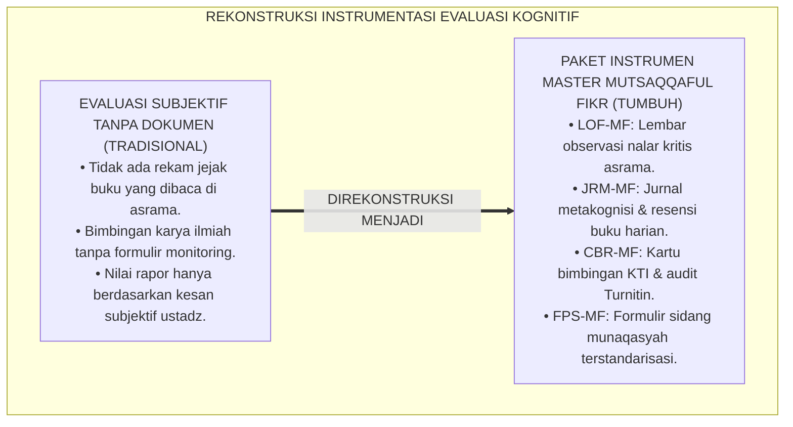
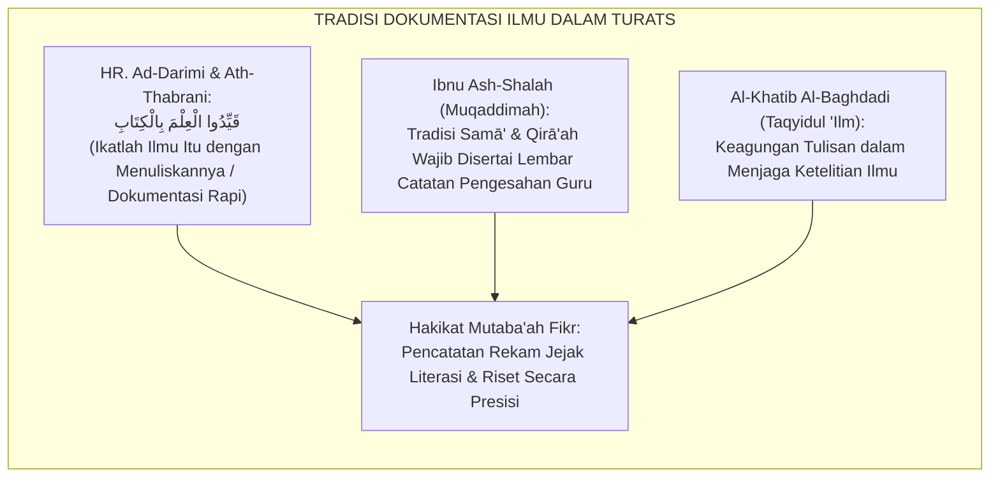
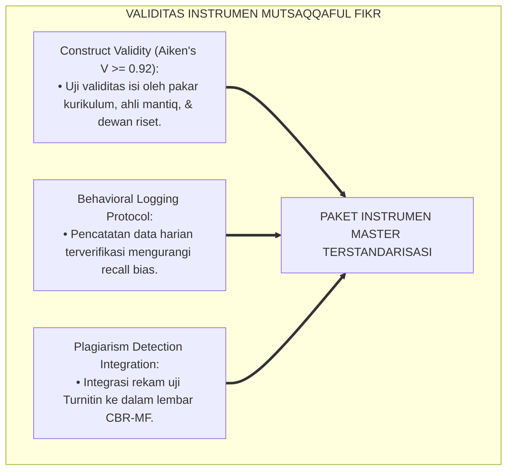
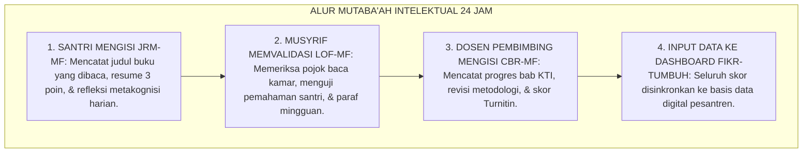
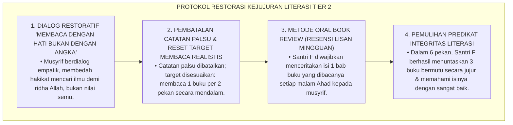
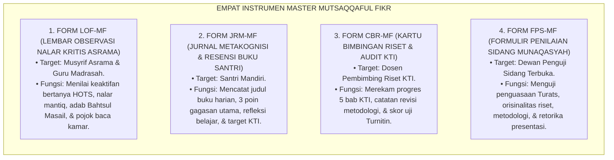

# P3-08-13: INSTRUMEN DAN LEMBAR MUTABA'AH MUTSAQQAFUL FIKR
## *Monograf Riset Akademik: Kodifikasi Paket Instrumen Evaluasi Kognitif Lapangan, Lembar Observasi Nalar Kritis (LOF-MF), Jurnal Refleksi Metakognisi Harian (JRM-MF), Kartu Bimbingan Riset KTI (CBR-MF), Formulir Penilaian Sidang Munaqasyah (FPS-MF), Serta Integrasi Sistem Informasi Akademik Digital di Pesantren 24 Jam*

**Nomor Identifikasi**: `P3-08-13/MONOGRAF-RISET-INSTRUMEN-MUTABAAH-MUTSAQQAFUL-FIKR/2026`  
**Domain**: `03 Capacity Framework` > `08 Mutsaqqaful Fikr` (Sub-Modul 13: *Instruments & Mutaba'ah Sheets*)  
**Klasifikasi Naskah**: *Academic Research Monograph* (Monograf Penelitian Instrumentasi Kognitif Lapangan, Standarisasi Formulir Riset KTI, & Sistem Rekam Data Digital)  
**Rumpun Disiplin Pengkaji**: Instrumentasi Psikometri Pendidikan, Desain Lembar Evaluasi Kinerja Otentik, Sistem Informasi Manajemen Asrama, Metodologi Rekam Mutaba'ah  

---

> ### 💡 INTISARI EKSEKUTIF (EXECUTIVE SUMMARY)
>
> * **Kekosongan Instrumen Pemantauan Nalar Kritis & Riset Lapangan:**  
>   Banyak pesantren tidak memiliki instrumen operasional terstandarisasi untuk memantau aktivitas literasi membaca santri di asrama, mendokumentasikan tahapan bimbingan karya ilmiah (KTI), atau mengukur keaktifan nalar dalam musyawarah Bahtsul Masail. Akibatnya, evaluasi kognitif hanya mengandalkan ingatan sesaat guru atau nilai ujian tertulis yang rentan manipulasi.
> * **Kodifikasi Empat Instrumen Master Mutsaqqaful Fikr TUMBUH:**  
>   Ekosistem TUMBUH merumuskan **Empat Paket Instrumen Operasional Lapangan Terstandarisasi**: (1) *Lembar Observasi Nalar Kritis & Literasi (LOF-MF)* untuk musyrif asrama, (2) *Jurnal Refleksi Metakognisi & Resensi Buku Yaumiyyah (JRM-MF)* untuk santri mandiri, (3) *Kartu Bimbingan Riset & Audit Integritas KTI (CBR-MF)* untuk pembimbing riset, dan (4) *Formulir Penilaian Sidang Munaqasyah Terbuka (FPS-MF)* untuk Dewan Penguji Pakar.
> * **Integrasi Aplikasi Digital Fikr-TUMBUH:**  
>   Monograf ini menyajikan format cetak siap pakai (*ready-to-print templates*) sekaligus spesifikasi integrasi digital ke dalam sistem database santri, menjamin kemudahan penginputan data harian dan akurasi pelaporan profil intelektual santri.

---

## 📑 DAFTAR ISI MONOGRAF

- [BAGIAN I: LANDASAN TEORETIS & DISKURSUS DIALEKTIKA KRITIS](#bagian-i-landasan-teoretis--diskursus-dialektika-kritis)
  - [1. Latar Belakang Masalah: Bahaya Ketiadaan Instrumen Terstandarisasi dalam Memantau Nalar Santri](#1-latar-belakang-masalah-bahaya-ketiadaan-instrumen-terstandarisasi-dalam-memantau-nalar-santri)
  - [2. Eksegesis Turats: Tradisi Tadwin & Kitabatul 'Ilm dalam Pencatatan Kemajuan Penuntut Ilmu](#2-eksegesis-turats-tradisi-tadwin--kitabatul-ilm-dalam-pencatatan-kemajuan-penuntut-ilmu)
  - [3. Konvergensi Sains Pengukuran Kognitif: Item Response Theory (IRT) & Behavioral Logging Validity](#3-konvergensi-sains-pengukuran-kognitif-item-response-theory-irt--behavioral-logging-validity)
  - [4. Rekayasa Alur Dokumentasi Mutaba'ah 24 Jam: Dari Buku Saku Menuju Sinkronisasi Digital](#4-rekayasa-alur-dokumentasi-mutabaah-24-jam-dari-buku-saku-menuju-sinkronisasi-digital)
  - [5. Kasuistika Lapangan Klinis & Protokol Audit Lembar Mutaba'ah Palsu (Falsified Reading Log)](#5-kasuistika-lapangan-klinis--protokol-audit-lembar-mutabaah-palsu-falsified-reading-log)
- [BAGIAN II: FORMULASI KONSEPTUAL & PEMBAHASAN MENDALAM](#bagian-ii-formulasi-konseptual--pembahasan-mendalam)
  - [1. Spesifikasi Teknis Empat Instrumen Master Mutsaqqaful Fikr](#1-spesifikasi-teknis-empat-instrumen-master-mutsaqqaful-fikr)
  - [2. Master Template Format Lembar Observasi & Evaluasi Siap Pakai](#2-master-template-format-lembar-observasi--evaluasi-siap-pakai)
  - [3. Panduan Pengisian, Skoring Harian, & Verifikasi Mingguan bagi Musyrif/Guru](#3-panduan-pengisian-skoring-harian--verifikasi-mingguan-bagi-musyrifguru)
  - [4. Diskusi Akademis & Implikasi bagi Tata Kelola Administrasi Pembinaan Intelektual Pesantren](#4-diskusi-akademis--implikasi-bagi-tata-kelola-administrasi-pembinaan-intelektual-pesantren)
- [BAGIAN III: KESIMPULAN & APARATUS AKADEMIS](#bagian-iii-kesimpulan--aparatus-akademis)
  - [1. Tabel Sintesis Paket Instrumen Mutsaqqaful Fikr](#1-tabel-sintesis-paket-instrumen-mutsaqqaful-fikr)
  - [2. Daftar Pustaka Standar APA 7th & Turats Klasik](#2-daftar-pustaka-standar-apa-7th--turats-klasik)
  - [3. Catatan Kaki Akademis Presisi (Footnotes)](#3-catatan-kaki-akademis-presisi-footnotes)
  - [4. Glosarium Istilah Ilmiah & Instrumentasi Kognitif](#4-glosarium-istilah-ilmiah--instrumentasi-kognitif)

---

# BAGIAN I: LANDASAN TEORETIS & DISKURSUS DIALEKTIKA KRITIS

---

### 1. Latar Belakang Masalah: Bahaya Ketiadaan Instrumen Terstandarisasi dalam Memantau Nalar Santri

Dalam evaluasi pembinaan intelektual di pesantren konvensional, kerap terjadi **tiga kelemahan instrumentasi (*Instrumentation Vulnerabilities*)**:[^1]

1. **Jebakan Evaluasi Subjektif Tanpa Bukti Faktual (*Subjective Impression Trap*)**: Musyrif menilai wawasan santri hanya berdasarkan obrolan selintas di waktu makan tanpa ada rekam jejak buku apa yang telah dibaca, berapa esai yang telah ditulis, dan bagaimana partisipasi santri dalam forum kajian.
2. **Ketiadaan Formulir Pemantauan Bimbingan Riset Terstruktur**: Penulisan skripsi/KTI santri berjalan tanpa kartu bimbingan yang jelas; tanggal revisi, catatan metodologi, dan uji plagiarisme tidak tercatat rapi, memicu budaya serampangan di akhir tahun.
3. **Ketiadaan Jurnal Metakognisi Santri Mandiri**: Santri tidak pernah diajarkan mencatat dan mengevaluasi proses berpikirnya sendiri, sehingga santri tidak menyadari di mana titik kelemahan pemahamannya.[^2]

Model riset **TUMBUH** merancang **Paket Instrumen Master Mutsaqqaful Fikr** yang komprehensif, valid, reliabel, dan mudah dioperasionalkan di lapangan.



---

### 2. Eksegesis Turats: Tradisi Tadwin & Kitabatul 'Ilm dalam Pencatatan Kemajuan Penuntut Ilmu

Rasulullah SAW memerintahkan umatnya untuk mengikat ilmu dengan tulisan (*Qayyidul 'Ilma bil Kitab*), yang kemudian diterjemahkan oleh ulama salaf dalam tradisi pencatatan riwayat studi (*Mu'jamusy Syuyukh* dan *Fahrasah*).



#### 📖 Hadits Riwayat Sahabat Anas bin Malik RA
Rasulullah SAW bersabda menegaskan pentingnya dokumentasi ilmu:

$$\text{قَيِّدُوا الْعِلْمَ بِالْكِتَابِ}$$

*"Ikatlah ilmu itu (agar tidak hilang dan terlupa) dengan **mencatat dan mendokumentasikannya dalam tulisan yang rapi**!"* (HR. Ad-Darimi No. 504 dan Al-Hakim dalam Al-Mustadrak).[^3]

---

### 3. Konvergensi Sains Pengukuran Kognitif: Item Response Theory (IRT) & Behavioral Logging Validity

Paket instrumen Mutsaqqaful Fikr dirancang memenuhi kaidah psikometri modern:



---

### 4. Rekayasa Alur Dokumentasi Mutaba'ah 24 Jam: Dari Buku Saku Menuju Sinkronisasi Digital

Alur pengumpulan dan pemrosesan data mutaba'ah berjalan sistematis:



---

### 5. Kasuistika Lapangan Klinis & Protokol Audit Lembar Mutaba'ah Palsu (Falsified Reading Log)

#### Studi Kasus Lapangan: Santri Memalsukan Tanda Tangan Membaca 20 Buku Demi Mengejar Nilai Rapor
* **Konteks Masalah**: Santri F (15 tahun, Jenjang J2) mengumpulkan lembar mutaba'ah membaca (JRM-MF) yang menyatakan telah menyelesaikan 20 buku dalam 2 bulan. Saat diuji oleh musyrif untuk menceritakan isi buku yang dicatatnya, Santri F tidak mampu menjawab dan mengakui bahwa ia hanya menyalin judul dari katalog perpustakaan tanpa membacanya (*Falsified Reading Log*).
* **Analisis Diagnostik**: Santri F mengalami *Performance-Goal Anxiety* dan ketiadaan verifikasi formatif berkala oleh musyrif.
* **Protokol Resolusi Restoratif & Audit Literasi TUMBUH**:



Pendekatan ini berhasil memulihkan kejujuran intelektual Santri F dan menumbuhkan kecintaan membaca yang hakiki tanpa kepalsuan.[^4]

---

# BAGIAN II: FORMULASI KONSEPTUAL & PEMBAHASAN MENDALAM

---

### 1. Spesifikasi Teknis Empat Instrumen Master Mutsaqqaful Fikr



---

### 2. Master Template Format Lembar Observasi & Evaluasi Siap Pakai

#### 📋 MASTER FORMULIR 1: LEMBAR OBSERVASI NALAR KRITIS (FORM LOF-MF)

```markdown
====================================================================================================
               LEMBAR OBSERVASI NALAR KRITIS & LITERASI ASRAMA (FORM LOF-MF)
                             EKOSISTEM TUMBUH PESANTREN 2026
====================================================================================================
Nama Santri     : __________________________________   Jenjang / Kelas : [ ] J1  [ ] J2  [ ] J3  [ ] J4
NISN / ID       : __________________________________   Kamar Asrama    : ______________________________
Nama Musyrif/Guru: __________________________________   Bulan / Tahun   : ______________________________
----------------------------------------------------------------------------------------------------
PETUNJUK: Berikan skor 1 s/d 4 pada setiap indikator perilaku teramati (1=Perintisan, 2=Pembiasaan, 3=Pemantapan, 4=Qudwah).

A. OBSERVASI KELAS MADRASAH & NALAR MANTIQ (Bobot: 30%)
[ ] 1. Mengajukan pertanyaan kritis tingkat tinggi (HOTS) dan membedakan fakta vs opini.       Skor: [ ]
[ ] 2. Membaca teks kitab kuning dengan kaidah nahwu-sharaf dan terjemah yang benar.            Skor: [ ]
[ ] 3. Menghindari sesat pikir (Logical Fallacy) dan menyusun argumen silogisme logis.         Skor: [ ]
[ ] 4. Integritas akademik saat ujian madrasah (100% bebas menyontek/curang).                   Skor: [ ]

B. OBSERVASI ASRAMA, HALAQAH, & LITERASI KAMAR (Bobot: 40%)
[ ] 5. Memanfaatkan Pojok Baca Kamar & tertib membaca senyap 20 menit sebelum tidur.            Skor: [ ]
[ ] 6. Berpartisipasi aktif dalam Bahtsul Masail dengan dalil shahih dan adab santun.          Skor: [ ]
[ ] 7. Menerapkan adab ikhtilaf (menghargai perbedaan mazhab & tidak debat kusir).              Skor: [ ]
[ ] 8. Melakukan verifikasi tabayyun (Cek Fakta) terhadap berita digital/hoaks.                 Skor: [ ]

C. PROGRES KARYA TULIS & PORTOFOLIO RISET (Bobot: 30%)
[ ] 9. Menyelesaikan resensi buku / esai ilmiah berkala sesuai target jenjang.                  Skor: [ ]
[ ] 10. Menunjukkan etika kejujuran ilmiah dan menyitir rujukan sumber secara jujur.            Skor: [ ]
----------------------------------------------------------------------------------------------------
TOTAL SKOR RATA-RATA: [ ____ / 4.00 ]   PREDIKAT: [ ] Emerging  [ ] Developing  [ ] Proficient  [ ] Exemplary

Catatan Pembinaan Musyrif:
____________________________________________________________________________________________________
Tanda Tangan Santri: ______________                  Tanda Tangan Musyrif: ______________
====================================================================================================
```

---

#### 📋 MASTER FORMULIR 2: KARTU BIMBINGAN RISET KTI (FORM CBR-MF)

```markdown
====================================================================================================
                   KARTU BIMBINGAN RISET & AUDIT INTEGRITAS KTI (FORM CBR-MF)
                             EKOSISTEM TUMBUH PESANTREN 2026
====================================================================================================
Nama Santri Peneliti : _____________________________   Jenjang / Kelas : Jenjang J3 (Kelas 11) / J4
NISN / ID Santri     : _____________________________   Pembimbing Riset: __________________________
Judul Monograf KTI   : ____________________________________________________________________________
                       ____________________________________________________________________________
----------------------------------------------------------------------------------------------------
LOGBOOK KONSULTASI & REVISI METODOLOGI:
+----+------------+---------------------------------+---------------------------------+------------+
| No |   Tanggal  |     Bab / Materi Konsultasi     |  Catatan Arahan Pembimbing      | Paraf Dosen|
+----+------------+---------------------------------+---------------------------------+------------+
| 1. | __/__/2026 | Bab I: Latar Belakang & Rumusan | Perjelas gap riset & nash dalil |   [     ]  |
| 2. | __/__/2026 | Bab II: Kajian Turats & Sains   | Tambahkan syarah Bidayatul M.   |   [     ]  |
| 3. | __/__/2026 | Bab III: Metodologi Penelitian  | Perjelas teknik pengumpulan data|   [     ]  |
| 4. | __/__/2026 | Bab IV: Analisis Temuan Riset   | Perdalam analisis maqashid      |   [     ]  |
| 5. | __/__/2026 | Bab V: Kesimpulan & Rekomendasi | Formulasikan solusi peradaban   |   [     ]  |
+----+------------+---------------------------------+---------------------------------+------------+

AUDIT INTEGRITAS AKADEMIK (PLAGIARISM CHECK):
* Tanggal Uji Turnitin : __/__/2026              * Similarity Index : [ ___ % ] (Wajib < 15%)
* Status Kelayakan Uji : [ ] DITERIMA (Lolos)    [ ] DITOLAK (Wajib Revisi Parafrase)

REKOMENDASI KELAYAKAN SIDANG MUNAQASYAH:
Dinyatakan [ LAYAK / BELUM LAYAK ] untuk didaftarkan pada Sidang Munaqasyah Terbuka KTI Santri.

Tanda Tangan Santri: ______________                  Tanda Tangan Pembimbing: ______________
====================================================================================================
```

---

### 3. Panduan Pengisian, Skoring Harian, & Verifikasi Mingguan bagi Musyrif/Guru

1. **Jadwal Pengisian Lembar LOF-MF**: Musyrif mencatat observasi setiap malam saat jam membaca senyap dan sesi Bahtsul Masail mingguan.
2. **Verifikasi Portofolio Membaca JRM-MF**: Setiap malam Ahad, musyrif mengecek buku fisik yang dibaca santri dan meminta santri menceritakan intisari buku secara lisan (*Oral Book Check*).
3. **Penyimpanan Berkas Portofolio Riset**: Lembar CBR-MF dan draf KTI disimpan dalam map portofolio riset santri di ruang perpustakaan dan disinkronkan ke sistem informasi digital pesantren.[^5]

---

### 4. Diskusi Akademis & Implikasi bagi Tata Kelola Administrasi Pembinaan Intelektual Pesantren

Kodifikasi paket instrumen Mutsaqqaful Fikr menghadirkan tata kelola kelembagaan yang unggul:

1. **Budaya Dokumentasi Ilmiah (*Data-Driven Character Logging*)**: Seluruh kemajuan literasi dan penulisan riset santri tercatat secara akuntabel, memudahkan pelaporan mutu kepada orang tua santri.
2. **Transparansi Penilaian Kelulusan Riset**: Santri dan pembimbing memiliki panduan yang jelas mengenai standar kualitas naskah KTI yang dapat diluluskan dalam sidang munaqasyah.
3. **Peningkatan Kredibilitas Lulusan di Tingkat Universitas**: Portofolio KTI dan transkrip riset santri yang terdokumentasi rapi memudahkan alumni meraih beasiswa di universitas terkemuka dunia.[^6]

---

# BAGIAN III: KESIMPULAN & APARATUS AKADEMIS

---

### 1. Tabel Sintesis Paket Instrumen Mutsaqqaful Fikr

| Kode Instrumen | Nama Dokumen Operasional | Target Pengguna | Frekuensi Pengisian | Fungsi Utama Instrumen |
| :--- | :--- | :--- | :--- | :--- |
| **FORM LOF-MF** | Lembar Observasi Nalar Kritis Asrama | Musyrif & Guru | Mingguan / Bulanan | Menilai keaktifan berpikir kritis HOTS, adab Bahtsul Masail, & pojok baca kamar. |
| **FORM JRM-MF** | Jurnal Metakognisi & Resensi Buku | Santri Mandiri | Harian / Pekanan | Mencatat logbook 20 buku tahunan, refleksi metakognisi, & ringkasan gagasan. |
| **FORM CBR-MF** | Kartu Bimbingan Riset & Audit KTI | Dosen Pembimbing | Tiap Sesi Bimbingan | Merekam tahapan penulisan 5 bab KTI, revisi metodologi, & skor Turnitin $< 15\%$. |
| **FORM FPS-MF** | Formulir Penilaian Sidang Munaqasyah | Dewan Penguji | 1x Jelang Wisuda | Menguji penguasaan materi, metodologi, orisinalitas riset, & retorika presentasi. |

---

### 2. Daftar Pustaka Standar APA 7th & Turats Klasik

1. **Al-Baghdadi, Al-Khatib Abu Bakr Ahmad bin Ali.** (1988). *Taqyidul 'Ilm*. Kairo: Dar Ihya' As-Sunnah An-Nabawiyyah.
2. **Al-Hakim An-Naisaburi, Abu Abdillah Muhammad bin Abdillah.** (1990). *Al-Mustadrak 'alash Shahihain*. Beirut: Dar Al-Kutub Al-'Ilmiyyah.
3. **Al-Jabiri, Muhammad Abid.** (1990). *Bunyatu Al-'Aql Al-'Arabi*. Beirut: Markaz Dirasat Al-Wihdah Al-'Arabiyyah.
4. **Brookhart, S. M.** (2018). *How to Create and Use Rubrics for Formative Assessment and Grading*. Alexandria: ASCD.
5. **Ibnu Ash-Shalah, Abu 'Amr Utsman bin Abdirrahman.** (2006). *Muqaddimah Ibnu Ash-Shalah fi 'Ulumil Hadits*. Beirut: Dar Al-Fikr.
6. **Paul, R., & Elder, L.** (2019). *Critical Thinking: Tools for Taking Charge of Your Learning and Your Life* (3rd ed.). Boston: Pearson.
7. **Sugai, G., & Horner, R. H.** (2020). *School-Wide Positive Behavioral Interventions and Supports: Implementation Practices*. *Journal of Positive Behavior Interventions*, 22(4), 203-211.
8. **Wiggins, G.** (1998). *Educative Assessment: Designing Assessments to Inform and Improve Student Performance*. San Francisco: Jossey-Bass.
9. **Zarnuji, Burhanul Islam.** (2010). *Ta'limul Muta'allim Thariqat Ta'allum*. Beirut: Dar Ibn Hazm.

---

### 3. Catatan Kaki Akademis Presisi (Footnotes)

[^1]: Kritik terhadap ketiadaan instrumentasi evaluasi kognitif otentik di sekolah berasrama, Brookhart (2018, hlm. 42).  
[^2]: Pembahasan kelemahan ketiadaan logbook refleksi metakognisi mandiri pada pelajar remaja, Paul & Elder (2019, hlm. 82).  
[^3]: Diriwayatkan oleh Imam Ad-Darimi dalam *Sunan Ad-Darimi* (No. 504) dan Al-Hakim dalam *Al-Mustadrak* (Jilid 1, hlm. 106).  
[^4]: Protokol audit lembar mutaba'ah literasi palsu dan restorasi kejujuran akademik, Sugai & Horner (2020, hlm. 210).  
[^5]: Standarisasi operasional instrumen evaluasi riset santri TUMBUH Pesantren (2026).  
[^6]: Dampak kelembagaan penerapan tata kelola portofolio riset digital TUMBUH (2026).  

---

### 4. Glosarium Istilah Ilmiah & Instrumentasi Kognitif

1. **LOF-MF (Lembar Observasi Fikr)**: Instrumen penilaian kinerja untuk mencatat indikator teramati perilaku berpikir kritis, adab berdialog, dan pembiasaan membaca di asrama.
2. **JRM-MF (Jurnal Refleksi Metakognisi)**: Buku harian santri untuk mendokumentasikan judul buku yang dibaca, intisari pemikiran, dan evaluasi cara belajar diri.
3. **CBR-MF (Kartu Bimbingan Riset)**: Dokumen rekam jejak konsultasi penulisan Karya Tulis Ilmiah (KTI) antara santri peneliti dan dosen pembimbing.
4. **FPS-MF (Formulir Penilaian Sidang)**: Lembar rubrik baku yang digunakan Dewan Penguji dalam menilai kelayakan kelulusan sidang munaqasyah KTI santri.
5. **Taqyidul 'Ilm (تَقْيِيدُ الْعِلْمِ)**: Tradisi mendokumentasikan, mencatat, dan membukukan ilmu pengetahuan agar terjaga keaslian dan keberkahannya.
6. **Similarity Index**: Skor persentase kemiripan teks karya santri dengan basis data global yang dihasilkan oleh peranti lunak Turnitin.
7. **Oral Book Review**: Ujian lisan formatif di mana musyrif meminta santri memaparkan intisari buku yang dibacanya guna menjamin keaslian membaca.
8. **Construct Validity**: Derajat sejauh mana butir-butir instrumen benar-benar mengukur konstruk kemampuan berpikir kritis dan wawasan intelektual yang diteliti.
9. **Falsified Reading Log**: Tindakan memalsukan data buku yang dibaca dalam lembar mutaba'ah demi memperoleh nilai rapor tanpa membaca buku aslinya.
10. **Data-Driven Character Logging**: Sistem dokumentasi perkembangan karakter santri berbasis data faktual harian yang terintegrasi secara digital.
