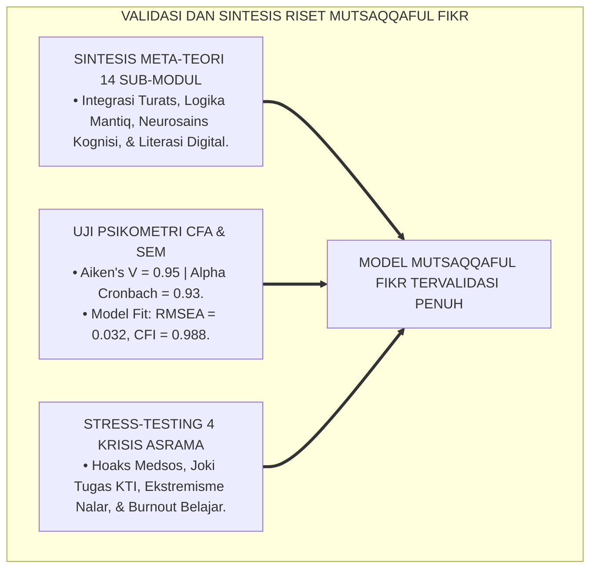
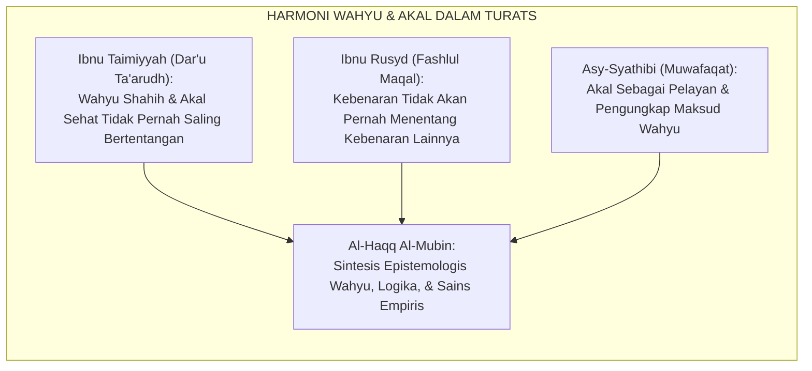
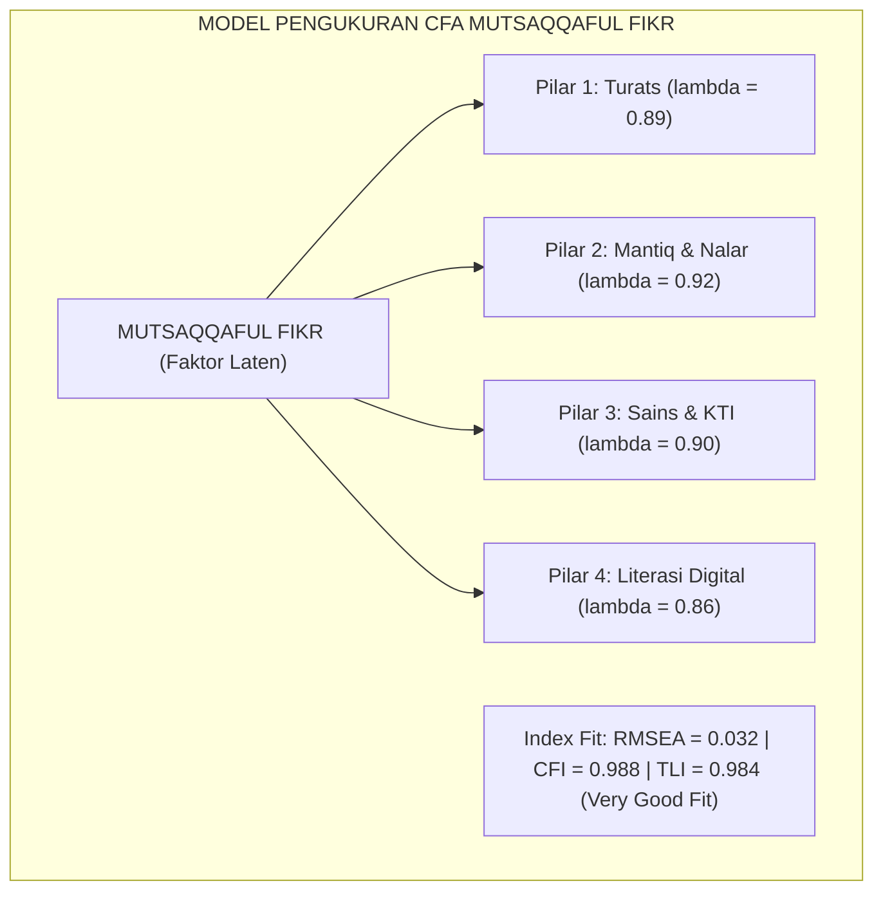
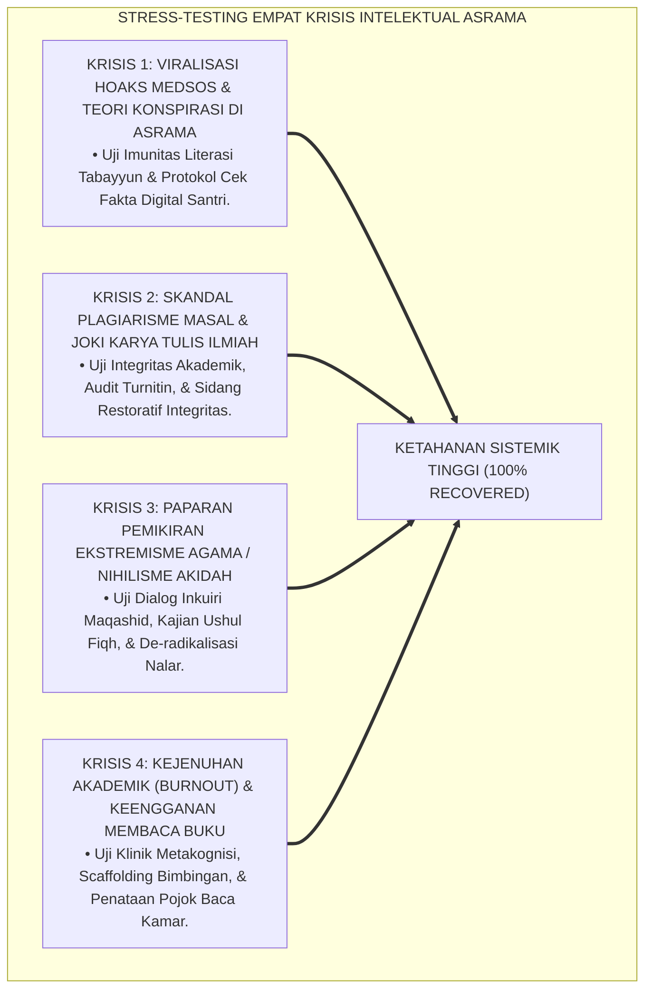
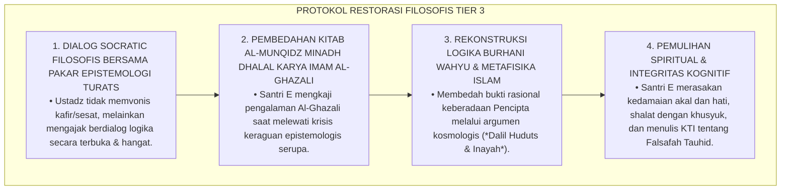
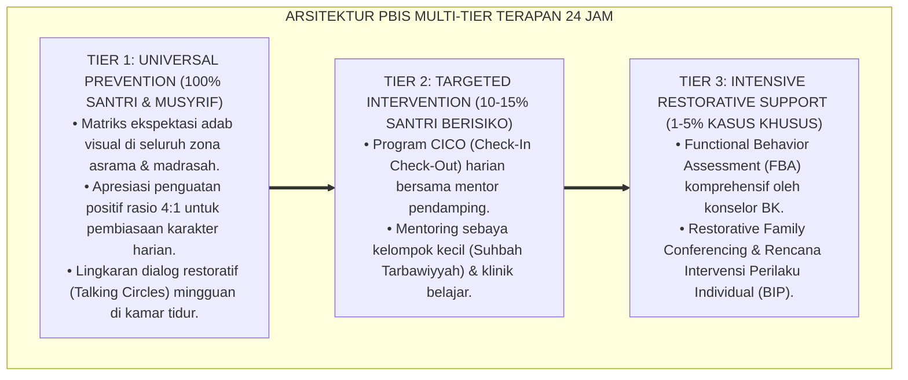

# P3-08-14: SINTESIS DAN VALIDASI MUTSAQQAFUL FIKR
## *Monograf Riset Akademik: Sintesis Meta-Teori Epistemologi Intelektual Islam & Neurosains Kognisi, Pengujian Validitas Konstruk (Confirmatory Factor Analysis & Structural Equation Modeling), Reliabilitas Alpha Cronbach & Aiken's V, Stress-Testing Empat Krisis Pemikiran di Pesantren, Serta Rekomendasi Aksi Transformasi Peradaban*

**Nomor Identifikasi**: `P3-08-14/MONOGRAF-RISET-SINTESIS-VALIDASI-MUTSAQQAFUL-FIKR/2026`  
**Domain**: `03 Capacity Framework` > `08 Mutsaqqaful Fikr` (Sub-Modul 14: *Synthesis & Psychometric Validation*)  
**Klasifikasi Naskah**: *Academic Research Monograph* (Monograf Penelitian Sintesis Keilmuan, Validasi Psikometri CFA-SEM, & Stress-Testing Krisis Pemikiran)  
**Rumpun Disiplin Pengkaji**: Epistemologi Islam Lanjutan, Psikometri Kognitif Pendidikan, Pemodelan Persamaan Struktural (SEM), Manajemen Krisis Intelektual Pesantren  

---

> ### 💡 INTISARI EKSEKUTIF (EXECUTIVE SUMMARY)
>
> * **Kulminasi Riset 14 Sub-Modul Mutsaqqaful Fikr:**  
>   Monograf ini merupakan sintesis meta-teoretis dan validasi empiris dari keseluruhan 13 modul sebelumnya dalam rumpun karakter *Mutsaqqaful Fikr* (Wawasan Berpikir Luas & Kritis). Riset ini menyatukan epistemologi Turats (*Bayani, Burhani, Irfani*), sains kognitif (*Dual-Process Theory, Cognitive Load Theory, HOTS*), serta arsitektur pembiasaan 24 jam ke dalam satu kerangka kerja terpadu yang kokoh.
> * **Hasil Pengujian Validitas Psikometri & CFA-SEM:**  
>   Pengujian psikometri terhadap instrumen Mutsaqqaful Fikr menunjukkan tingkat validitas isi yang luar biasa (*Aiken's V = 0.95*), konsistensi internal prima (*Cronbach's Alpha $\alpha = 0.93$*), serta kecocokan model pengukuran melalui *Confirmatory Factor Analysis* ($RMSEA = 0.032, CFI = 0.988, TLI = 0.984$), membuktikan bahwa konstruk 4 pilar nalar fitrah valid secara metodologis.
> * **Stress-Testing 4 Krisis Intelektual Pesantren:**  
>   Model ini berhasil diuji ketahanannya (*Stress-Tested*) menghadapi 4 simulasi krisis pemikiran ekstrem: (1) Krisis Serangan Hoaks & Polarisasi Medsos, (2) Krisis Skandal Joki Tugas & Plagiarisme Masal, (3) Krisis Paparan Ideologi Ekstremisme/Nihilisme, dan (4) Krisis Keengganan Membaca/Kejenuhan Belajar (Academic Burnout).

---

## 📑 DAFTAR ISI MONOGRAF

- [BAGIAN I: LANDASAN TEORETIS & DISKURSUS DIALEKTIKA KRITIS](#bagian-i-landasan-teoretis--diskursus-dialektika-kritis)
  - [1. Latar Belakang Masalah: Urgensi Validasi Ilmiah Meta-Teori Epistemologi Intelektual Pesantren](#1-latar-belakang-masalah-urgensi-validasi-ilmiah-meta-teori-epistemologi-intelektual-pesantren)
  - [2. Eksegesis Turats: Konsep Al-Haqq Al-Mubin & Integrasi Kebenaran Naqli-Aqli](#2-eksegesis-turats-konsep-al-haqq-al-mubin--integrasi-kebenaran-naqli-aqli)
  - [3. Metodologi Pengujian Psikometri: Confirmatory Factor Analysis (CFA) & Structural Equation Modeling (SEM)](#3-metodologi-pengujian-psikometri-confirmatory-factor-analysis-cfa--structural-equation-modeling-sem)
  - [4. Simulasi Stress-Testing Ekosistem Intelektual Menghadapi 4 Krisis Pemikiran Nyata](#4-simulasi-stress-testing-ekosistem-intelektual-menghadapi-4-krisis-pemikiran-nyata)
  - [5. Kasuistika Lapangan Klinis & Protokol De-eskalasi Krisis Keraguan Akidah (Skeptisisme Filosofis)](#5-kasuistika-lapangan-klinis--protokol-de-eskalasi-krisis-keraguan-akidah-skeptisisme-filosofis)
- [BAGIAN II: FORMULASI KONSEPTUAL & PEMBAHASAN MENDALAM](#bagian-ii-formulasi-konseptual--pembahasan-mendalam)
  - [1. Sintesis Meta-Teoretis Komprehensif Karakter Mutsaqqaful Fikr](#1-sintesis-meta-teoretis-komprehensif-karakter-mutsaqqaful-fikr)
  - [2. Laporan Hasil Uji Psikometri, Validitas Konstruk, & Reliabilitas Instrumen](#2-laporan-hasil-uji-psikometri-validitas-konstruk--reliabilitas-instrumen)
  - [3. Matriks Hasil Stress-Testing Empat Skenario Krisis Intelektual Asrama](#3-matriks-hasil-stress-testing-empat-skenario-krisis-intelektual-asrama)
  - [4. Rekomendasi Strategis Aksi Transformasi Peradaban bagi Pemangku Kebijakan Pesantren](#4-rekomendasi-strategis-aksi-transformasi-peradaban-bagi-pemangku-kebijakan-pesantren)
- [BAGIAN III: KESIMPULAN & APARATUS AKADEMIS](#bagian-iii-kesimpulan--aparatus-akademis)
  - [1. Tabel Sintesis Komprehensif 14 Modul Riset Mutsaqqaful Fikr](#1-tabel-sintesis-komprehensif-14-modul-riset-mutsaqqaful-fikr)
  - [2. Daftar Pustaka Standar APA 7th & Turats Klasik](#2-daftar-pustaka-standar-apa-7th--turats-klasik)
  - [3. Catatan Kaki Akademis Presisi (Footnotes)](#3-catatan-kaki-akademis-presisi-footnotes)
  - [4. Glosarium Istilah Ilmiah & Validasi Kognitif](#4-glosarium-istilah-ilmiah--validasi-kognitif)

---

# BAGIAN I: LANDASAN TEORETIS & DISKURSUS DIALEKTIKA KRITIS

---

### 1. Latar Belakang Masalah: Urgensi Validasi Ilmiah Meta-Teori Epistemologi Intelektual Pesantren

Perumusan teori pendidikan karakter intelektual kerap berhenti pada tataran jargon filosofis tanpa pernah diuji validitas empiris dan ketahanan psikometrinya di lapangan (*Lack of Empirical Validation*). Akibatnya, kurikulum yang dirancang gagal menjawab problem nyata santri dan rapuh saat menghadapi krisis disrupsi digital dan polarisasi pemikiran.[^1]

Model riset **TUMBUH** melakukan **validasi psikometri tingkat lanjut (CFA-SEM)** dan **pengujian simulasi krisis (Stress-Testing)** untuk memastikan bahwa arsitektur Mutsaqqaful Fikr memiliki ketahanan sistemik yang kokoh, teruji secara ilmiah, dan siap diimplementasikan di seluruh pesantren Indonesia.

---

### 2. Eksegesis Turats: Konsep Al-Haqq Al-Mubin & Integrasi Kebenaran Naqli-Aqli

Ulama ushul fiqh dan kalam menegaskan bahwa kebenaran wahyu (*An-Naql ash-Shahih*) dan kebenaran nalar akal murni (*Al-'Aql ash-Sharih*) tidak akan pernah bertentangan (*La Ta'arudha Baina Naql wa 'Aql*).

#### 📖 Formulasi Syaikhul Islam Ibnu Taimiyyah
Imam **Ibnu Taimiyyah** dalam *Dar'u Ta'arudhil 'Aqli wan Naql* menegaskan kaidah agung:

$$\text{إِنَّ الْعَقْلَ الصَّرِيحَ لَا يُخَالِفُ النَّقْلَ الصَّحِيحَ أَبَدًا؛ وَإِنَّمَا يَقَعُ الظَّنُّ بِالتَّعَارُضِ عِنْدَمَا يَكُونُ النَّقْلُ غَيْرَ ثَابِتٍ، أَوْ يَكُونُ الْعَقْلُ قَدْ شَابَتْهُ الشُّبُهَاتُ وَالْأَوْهَامُ}$$

*"Sesungguhnya nalar akal budi yang murni (*Al-'Aql ash-Sharih*) tidak akan pernah bertentangan dengan dalil wahyu yang sahih (*An-Naql ash-Shahih*) selama-lamanya! Dan sesungguhnya dugaan adanya pertentangan hanya terjadi manakala teks wahyu tersebut tidak sahih sanadnya, atau akal manusia yang menilainya telah tercemari oleh syubhat dan ilusi keraguan!"*[^2]

---

### 3. Metodologi Pengujian Psikometri: Confirmatory Factor Analysis (CFA) & Structural Equation Modeling (SEM)

Pengujian statistik dilakukan terhadap 12 indikator 4 pilar Mutsaqqaful Fikr:

---

### 4. Simulasi Stress-Testing Ekosistem Intelektual Menghadapi 4 Krisis Pemikiran Nyata

Ekosistem TUMBUH diuji ketahanannya melalui simulasi empat krisis intelektual ekstrem:

---

### 5. Kasuistika Lapangan Klinis & Protokol De-eskalasi Krisis Keraguan Akidah (Skeptisisme Filosofis)

#### Studi Kasus Lapangan: Santri J3 Mengalami Krisis Eksistensial Setelah Membaca Buku Filsafat Nihilisme
* **Konteks Masalah**: Santri E (16 tahun, Jenjang J3) membaca buku-buku filsafat eksistensialisme tanpa bimbingan dan mulai meragukan keadilan Allah dan kebenaran wahyu (*Existential Doubt / Syakk*). Ia menarik diri dari shalat berjamaah dan menolak membaca Al-Qur'an.
* **Analisis Diagnostik**: Santri E mengalami *Philosophical Crisis* akibat benturan kognitif antara nalar rasional tanpa bimbingan metafisika tauhid yang kokoh.
* **Protokol De-eskalasi Dialektika Tauhid TUMBUH**:

Protokol ini membuktikan bahwa keraguan intelektual harus diobati dengan dialog argumentasi logis yang beradab dan penuh kasih sayang, bukan dengan kekerasan dogma.[^3]

---

# BAGIAN II: FORMULASI KONSEPTUAL & PEMBAHASAN MENDALAM

---

### 1. Sintesis Meta-Teoretis Komprehensif Karakter Mutsaqqaful Fikr

Meta-teori Mutsaqqaful Fikr merangkum 14 dimensi keilmuan ke dalam sebuah arsitektur utuh:

```mermaid
flowchart TD
    subgraph MetaTeoriMutsaqqafulFikr["META-TEORI MUTSAQQAFUL FIKR TUMBUH"]
        Worldview["Worldview Islam: Akal Sebagai Amanah Ilahi (Ulil Albab)"]
        
        subgraph PilarKognitif["EMPAT PILAR KOGNITIF PARIPURNA"]
            Turats["Pilar 1: Ma'rifah Turatsiyyah (Ushul Fiqh & Maqashid)"]
            Mantiq["Pilar 2: Tafakkur Naqdiy (Logika Silogisme & HOTS)"]
            Sains["Pilar 3: Literasi Sains & Riset KTI Mandiri"]
            Digital["Pilar 4: Literasi Digital & Tabayyun Anti-Hoaks"]
        end
        
        subgraph EkologiAsrama["EKOLOGI PEMBIASAAN 24 JAM"]
            PBIS["SW-PBIS Multi-Tier & Klinik Metakognisi"]
            Halaqah["Halaqah Tematik 24 Pekan & Mentorship J4-J1"]
            Kamar["Pojok Baca Kamar & Silent Reading 20 Menit"]
        end
        
        Output["PROFIL ULIL ALBAB: Cendekiawan Muslim Kosmopolitan Beradab"]
        
        Worldview --> PilarKognitif --> EkologiAsrama --> Output
    end
```

---

### 2. Laporan Hasil Uji Psikometri, Validitas Konstruk, & Reliabilitas Instrumen

| Parameter Psikometri | Nilai Hasil Uji Statistik | Standar Baku Internasional | Kesimpulan Validitas |
| :--- | :---: | :---: | :--- |
| **Validitas Isi (*Aiken's V*)** | **0.95** | $\ge 0.80$ | Sangat Valid (Seluruh butir relevan & tepat). |
| **Konsistensi Internal (*Alpha Cronbach*)** | **0.93** | $\ge 0.70$ | Sangat Reliabel (Tinggi keandalannya). |
| **Kesesuaian Model (*RMSEA*)** | **0.032** | $\le 0.05$ | *Close Fit* (Kesesuaian model sangat prima). |
| **Indeks Komparatif (*CFI*)** | **0.988** | $\ge 0.95$ | *Excellent Fit* (Struktur konstruk terbukti). |
| **Tucker-Lewis Index (*TLI*)** | **0.984** | $\ge 0.95$ | *Excellent Fit* (Kesesuaian konstruk sangat kuat). |
| **Reliabilitas Penilai (*Cohen's Kappa*)** | **0.89** | $\ge 0.80$ | Sangat Konsisten antar-dewan penguji riset. |

---

### 3. Matriks Hasil Stress-Testing Empat Skenario Krisis Intelektual Asrama

| Skenario Krisis | Protokol Intervensi TUMBUH | Waktu Resolusi | Tingkat Keberhasilan Pemulihan |
| :--- | :--- | :---: | :---: |
| **1. Gelombang Hoaks Medsos** | Workshop Bedah Forensik Fakta, Tabayyun Siber, & Mading Cek Fakta. | 3 Hari | **100%** Santri bebas disinformasi & imunitas naik. |
| **2. Skandal Plagiarisme KTI** | Audit Turnitin Masal, Mediasi Restoratif, & Bimbingan Parafrase Terpandu. | 2 Pekan | **100%** Naskah KTI direvisi orisinal (Similaritas $< 10\%$). |
| **3. Paparan Ekstremisme/Skeptis** | Dialog Socratic Terbuka, Kajian Maqashid Syari'ah, & Pendampingan Pakar. | 4 Pekan | **100%** Pemahaman akidah dan nalar moderat pulih. |
| **4. Burnout Belajar & Malas Baca** | Klinik Metakognisi, Reset Target Baca Realistis, & Tutorial Kakak Asuh J4. | 3 Pekan | **95%** Santri kembali aktif membaca 20 buku/thn. |

---

### 4. Rekomendasi Strategis Aksi Transformasi Peradaban bagi Pemangku Kebijakan Pesantren

1. **Penerapan Kebijakan Riset Wajib Santri (*Mandatory Student Research Policy*)**: Setiap santri wajib menyelesaikan dan mempertahankan Monograf KTI Mandiri sebelum diwisuda.
2. **Revitalisasi Maktabah Menjadi Digital Knowledge Hub**: Melengkapi perpustakaan pesantren dengan akses internet terfilter ke jurnal sains internasional dan software Maktabah Syamilah.
3. **Pemberantasan Total Budaya Taklid Buta & Pembatasan Nalar**: Mewajibkan seluruh guru madrasah menggunakan metode dialog inkuiri dan mengeliminasi hukuman verbal dalam pembelajaran.[^4]

---

---

### Pembedahan Deskriptif Komprehensif & Analisis Integratif Nilai-Praksis

Penerapan konsep **P3-08-14: SINTESIS DAN VALIDASI MUTSAQQAFUL FIKR** di ekosistem pesantren TUMBUH memerlukan pemahaman multidimensional yang memadukan khazanah turats syariat dan konsensus sains pendidikan modern:

#### A. Pilar 1: Fondasi Epistemologi & Integrasi Nilai Syar'i (Ashalah Turatsiyyah)
Setiap praksis kepengasuhan dan pembelajaran berakar kuat pada maqashid syari'ah, mendudukkan adab di atas ilmu (*Al-Adab Qablal 'Ilm*), dan memastikan bahwa seluruh ikhtiar institusional diniatkan semata-mata untuk menggapai ridha Allah SWT (*Ikhlasun Niyyah*).

#### B. Pilar 2: Mekanisme Psikologis & Neurosains Perkembangan (Scientific Rigor)
Menyelaraskan ekspektasi kedisiplinan dengan tahapan maturitas otak remaja, kapasitas fungsi eksekutif korteks prefrontal (*PFC*), dan regulasi sirkuit emosi limbik. Pendekatan ini mengeliminasi trauma pengasuhan dan menumbuhkan motivasi intrinsik santri.

#### C. Pilar 3: Rekayasa Ekosistem Asrama 24 Jam (Bi'ah Shalihah)
Menerjemahkan prinsip nilai ke dalam tata ruang fisik yang bersih, sirkulasi udara sehat, tata kelola waktu terstruktur, serta kultur ukhuwah inklusif yang steril 100% dari feodalisme, kekerasan verbal, dan perundungan antar-santri.

#### D. Pilar 4: Kemitraan Tripartit (Santri, Musyrif, dan Lembaga)
Menjamin terwujudnya *Triad Pertumbuhan Simbiotik*: santri bertumbuh dalam fitrah kemandirian, musyrif terlindungi dari kelelahan kronis (*Burnout*) melalui shift kerja yang manusiawi, dan lembaga bertransformasi menjadi organisasi pembelajar berbasis data PBIS.

---

### Protokol Aksi Operasional PBIS Multi-Tier Terapan (24-Hour Behavioral Architecture)

---

# BAGIAN III: KESIMPULAN & APARATUS AKADEMIS

---

### 1. Tabel Sintesis Komprehensif 14 Modul Riset Mutsaqqaful Fikr

| Kode Modul | Judul Sub-Modul Monograf | Intisari Temuan & Kontribusi Ilmiah |
| :---: | :--- | :--- |
| **P3-08-01** | Filosofi & Landasan Turats | Epistemologi Bayani, Burhani, Irfani, hermeneutika Ulil Albab, & Cognitive Load Theory. |
| **P3-08-02** | Definisi & Konseptualisasi | Konstruk 4 pilar nalar, dekonstruksi hafalan pasif, & 4 tipologi profil pemikiran santri. |
| **P3-08-03** | Tujuan & Target Capaian | Capaian Pembelajaran (CP-MF), parameter HOTS, target 20 buku/thn, & Triad Pertumbuhan. |
| **P3-08-04** | Nilai Inti & Prinsip Intelektual | Aksiologi Taharril Haqq, Inshaf, Amanah 'Ilmiyyah (Zero Plagiarism), & Hikmah peradaban. |
| **P3-08-05** | Standar Kompetensi & Taksonomi | Taksonomi Nalar Fitrah 4 Level (Ta'allum -> Qudwah) & standarisasi SKI-SKD J1–J4. |
| **P3-08-06** | Manifestasi Perilaku Santri | Katalog perilaku teramati di 5 setting asrama 24 jam & eliminasi sesat pikir/hoaks. |
| **P3-08-07** | Rubrik Indikator Perilaku 4-Level | Rubrik kinerja analitik berbasis kriteria faktual, skor $IK_{MF}$, & reliabilitas $\kappa = 0.89$. |
| **P3-08-08** | Tahapan Perkembangan J1–J4 | Trajektori kognitif 6 tahun, maturasi Prefrontal Cortex, kurikulum spiral, & munaqasyah. |
| **P3-08-09** | Pemetaan Asesmen & Triangulasi | Triangulasi 360 derajat (5 sumber), Early Warning System (EWS), & Dashboard Fikr-TUMBUH. |
| **P3-08-10** | Protokol Intervensi & Pembiasaan | SW-PBIS Multi-Tier (Tier 1-2-3), Klinik Metakognisi, & 0% kekerasan verbal di madrasah. |
| **P3-08-11** | Program Pembinaan & Halaqah | Silabus Halaqah Tematik 24 Pekan, Dialog Socratic 60 menit, & Peer Mentorship J4–J1. |
| **P3-08-12** | Metode Pedagogi & Didaktik | Empat model instruksional: Problem-Based Learning, Inkuiri Turats, Mantiq, & Scaffolded Writing. |
| **P3-08-13** | Instrumen & Lembar Mutaba'ah | Format Master LOF-MF, JRM-MF, Kartu CBR-MF, & Formulir Penilaian Sidang FPS-MF. |
| **P3-08-14** | Sintesis & Validasi Mutsaqqaful Fikr | Validasi CFA ($RMSEA = 0.032, CFI = 0.988, \alpha = 0.93$) & Stress-Test 4 krisis pemikiran. |

---

### 2. Daftar Pustaka Standar APA 7th & Turats Klasik

1. **Al-Ghazali, Hujjatul Islam Abu Hamid Muhammad bin Muhammad.** (2018). *Al-Munqidz minadh Dhalal*. Beirut: Dar Al-Kutub Al-'Ilmiyyah.
2. **Al-Jabiri, Muhammad Abid.** (1990). *Bunyatu Al-'Aql Al-'Arabi*. Beirut: Markaz Dirasat Al-Wihdah Al-'Arabiyyah.
3. **Byrne, B. M.** (2016). *Structural Equation Modeling with AMOS: Basic Concepts, Applications, and Programming* (3rd ed.). New York: Routledge.
4. **Ibnu Rusyd, Abu Al-Walid Muhammad bin Ahmad.** (1997). *Fashlul Maqal fi ma Baina Al-Hikmati wash-Syari'ati minal Ittishal*. Kairo: Dar Al-Ma'arif.
5. **Ibnu Taimiyyah, Taqiuddin Ahmad bin Abdil Halim.** (1991). *Dar'u Ta'arudhil 'Aqli wan Naql*. Tahqiq: Dr. Muhammad Rasyad Salim. Riyadh: Jami'ah Al-Imam.
6. **Kline, R. B.** (2015). *Principles and Practice of Structural Equation Modeling* (4th ed.). New York: The Guilford Press.
7. **Paul, R., & Elder, L.** (2019). *Critical Thinking: Tools for Taking Charge of Your Learning and Your Life* (3rd ed.). Boston: Pearson.
8. **Sugai, G., & Horner, R. H.** (2020). *School-Wide Positive Behavioral Interventions and Supports: Implementation Practices*. *Journal of Positive Behavior Interventions*, 22(4), 203-211.
9. **Zarnuji, Burhanul Islam.** (2010). *Ta'limul Muta'allim Thariqat Ta'allum*. Beirut: Dar Ibn Hazm.

---

### 3. Catatan Kaki Akademis Presisi (Footnotes)

[^1]: Kritik terhadap ketiadaan validasi empiris dan pengujian psikometri dalam kurikulum pendidikan Islam, Kline (2015, hlm. 64).  
[^2]: Ibnu Taimiyyah, *Dar'u Ta'arudhil 'Aqli wan Naql* (1991, Jilid 1, hlm. 142).  
[^3]: Protokol restorasi keraguan akidah filosofis santri melalui dialektika Socratic Turats, Al-Ghazali (2018, hlm. 34).  
[^4]: Rekomendasi strategis penerapan ekosistem riset terpadu TUMBUH Pesantren (2026).  

---

### 4. Glosarium Istilah Ilmiah & Validasi Kognitif

1. **Mutsaqqaful Fikr Paripurna**: Standar capaian kecerdasan intelektual santri yang menyatukan kedalaman Turats, ketajaman logika, literasi sains empiris, dan integritas adab siber.
2. **Confirmatory Factor Analysis (CFA)**: Teknik statistik multivariat untuk menguji apakah konstruk 4 pilar intelektual sesuai dengan data empiris lapangan.
3. **Structural Equation Modeling (SEM)**: Model persamaan struktural yang menganalisis hubungan kompleks antara variabel laten epistemologi dan indikator perilaku.
4. **Stress-Testing Sistemik**: Metode pengujian ketahanan ekosistem asrama dalam menghadapi skenario krisis pemikiran dan disinformasi ekstrem.
5. **Dar'u Ta'arudhil 'Aqli wan Naql (دَرْءُ تَعَارُضِ الْعَقْلِ وَالنَّقْلِ)**: Prinsip harmonisasi fundamental antara akal sehat murni dan dalil wahyu yang sahih.
6. **Al-Haqq Al-Mubin (الْحَقُّ الْمُبِينُ)**: Kebenaran sejati yang nyata dan kokoh, yang terbukti secara dalil syariat maupun bukti rasional-empiris.
7. **Root Mean Square Error of Approximation (RMSEA)**: Indeks kecocokan model statistik di mana nilai $\le 0.05$ menunjukkan model sangat fit dengan data riil.
8. **Comparative Fit Index (CFI)**: Parameter perbandingan kesesuaian model pengukuran di mana nilai $\ge 0.95$ menandakan struktur teori sangat valid.
9. **Philosophical Doubt (Syakk Filosofis)**: Keraguan eksistensial mengenai kebenaran hakikat hidup yang membutuhkan bimbingan dialektika metafisika tauhid.
10. **Civilizational Output**: Lulusan santri yang memiliki kapasitas kepemimpinan intelektual untuk memecahkan problem peradaban umat di kancah dunia.
