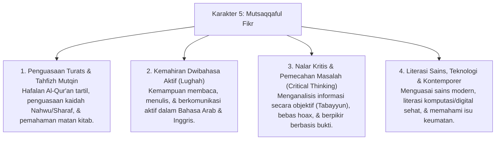

# P3-08-Mutsaqqaful-Fikr-Induk (Karakter 5: Intelektual Luas, Kritis & Mutqin)

## Tujuan
Menetapkan kerangka kapasitas menyeluruh untuk **Karakter 5: Mutsaqqaful Fikr (Intelektual Luas, Kritis & Mutqin)** dalam ekosistem pesantren TUMBUH: membentuk santri yang menguasai khazanah Turats Islam, hafalan Al-Qur'an dan matan kitab yang mutqin, memiliki kemahiran dwibahasa (Arab-Inggris), menguasai literasi sains-teknologi, serta memiliki nalar kritis dan daya analitis yang tajam.

---

## 1. 4 Dimensi Karakter Mutsaqqaful Fikr

---

## 2. Matriks Rubrik 4 Level Capaian Mutsaqqaful Fikr

| Dimensi Perilaku | Level 1: Emerging (T1) | Level 2: Developing (T2) | Level 3: Proficient (T3) | Level 4: Exemplary (T4 - Qudwah) |
| :--- | :--- | :--- | :--- | :--- |
| **Tahfizh & Muraja'ah** | Menyetor hafalan baru namun cepat lupa juz lama, jarang muraja'ah mandiri. | Muraja'ah jika dijadwalkan musyrif, hafalan mutqin pada 2–3 juz awal. | Istiqamah muraja'ah terdistribusi (Spaced Repetition), hafalan mutqin & tartil. | Tasmi' hafalan 5–10 juz sekali duduk, membimbing halaqah tahfizh adik kelas (*Qudwah*). |
| **Literasi Bahasa & Kitab** | Kesulitan membaca teks arab gundul, pasif dalam percakapan bahasa asrama. | Mampu membaca kitab berharakat, mulai aktif menggunakan kosakata bahasa resmi. | Lancar membaca kitab klasik (Fathul Qarib/Riyadhus Shalihin) & pidato bahasa asing. | Mampu membedah syarah kitab tebal, berdebat ilmiah santun dalam Bahasa Arab/Inggris. |
| **Nalar Kritis & Riset** | Menerima mentah-mentah kabar di medsos/teman tanpa tabayyun. | Memeriksa kebenaran informasi sebelum percaya, aktif bertanya di kelas KBM. | Mampu menyusun makalah ilmiah sederhana dengan rujukan literatur valid. | Menghasilkan riset karya ilmiah remaja pesantren / esai pemikiran Islam berbobot. |

---

## 3. Status Dokumen
* **Status**: 🌟 **A+ (Dokumen Induk Mutsaqqaful Fikr)**
* **Level**: Project 3 - `03 Capacity Framework / 08 Mutsaqqaful Fikr`
* **Langkah Berikutnya**: Melengkapi sub-modul 01 hingga 14.
