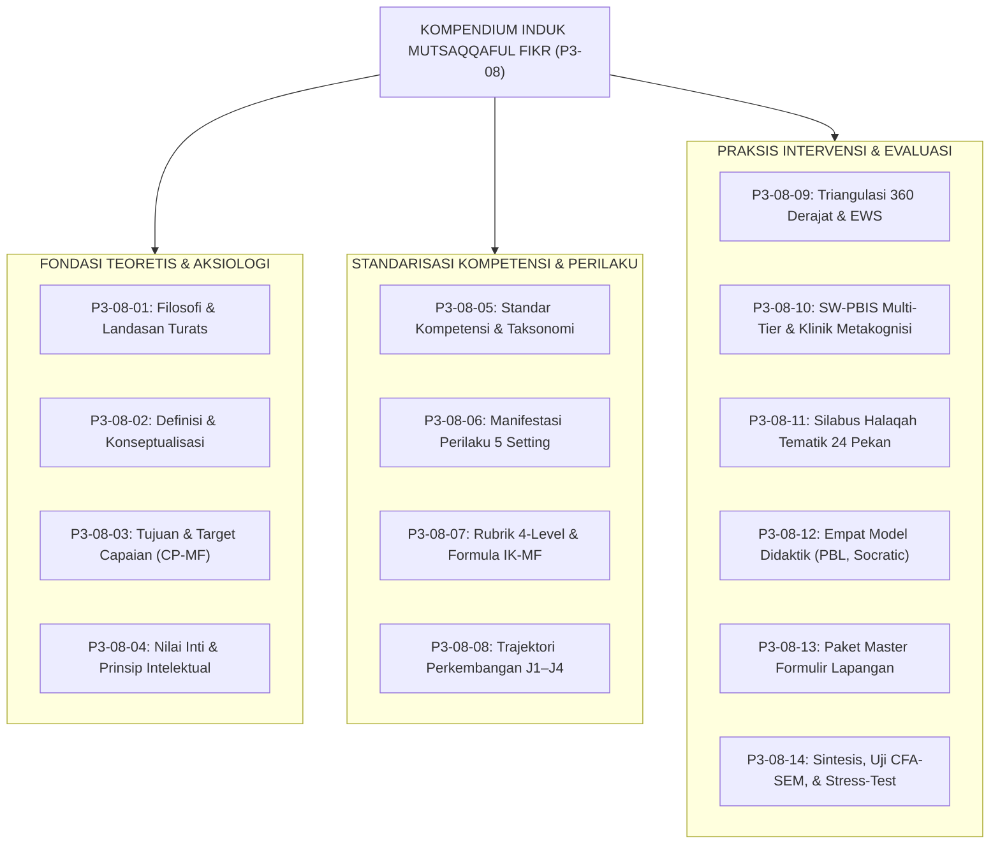
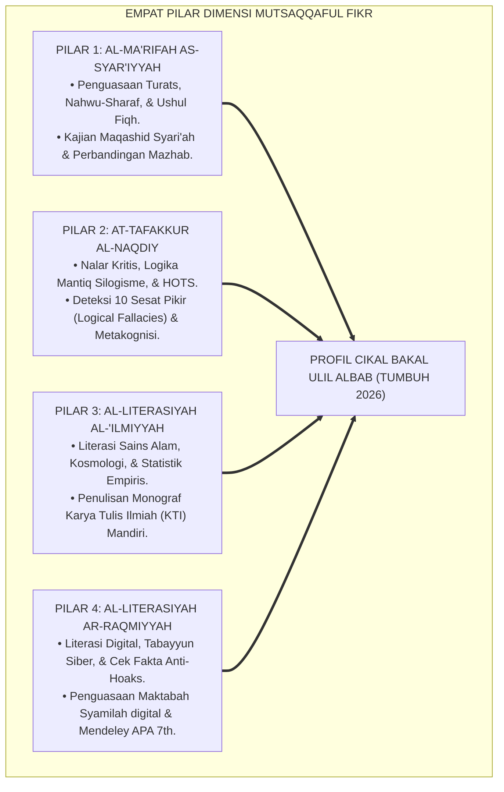
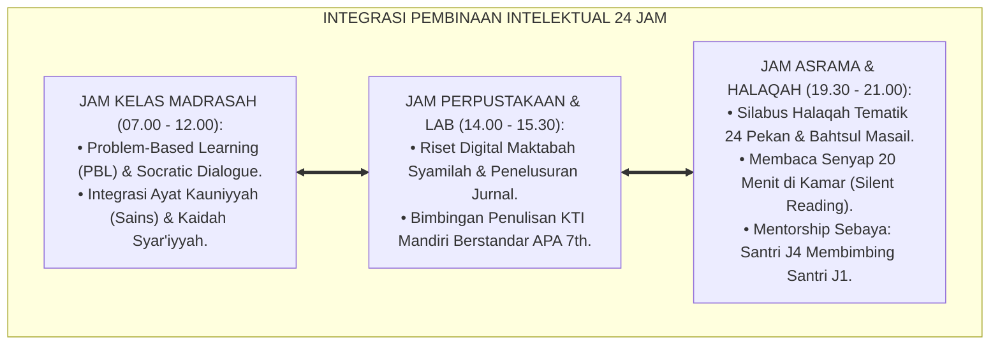

# P3-08: BUKU KOMPENDIUM INDUK MUTSAQQAFUL FIKR
## *Buku Panduan Standar Riset & Implementasi Holistik Karakter Wawasan Luas, Nalar Kritis, & Integritas Intelektual (Mutsaqqaful Fikr) dalam Ekosistem TUMBUH Pesantren 24 Jam*

**Nomor Registrasi Induk**: `P3-08/KOMPENDIUM-INDUK-MUTSAQQAFUL-FIKR/2026`  
**Domain Utama**: `03 Capacity Framework` > `08 Mutsaqqaful Fikr` (Kompendium Induk 14 Modul Riset)  
**Klasifikasi Dokumen**: *Master Implementation Handbook & Scientific Compendium*  
**Penyusun & Dewan Pakar**: Dewan Pakar Epistemologi Islam, Pakar Neurosains Kognitif, Pakar SW-PBIS, & Master Teacher TUMBUH Pesantren  

---

> ### 💡 INTISARI EKSEKUTIF KOMPENDIUM INDUK
>
> Buku Kompendium Induk ini menghimpun sintesis komprehensif dari keseluruhan **14 Monograf Riset Akademik Mutsaqqaful Fikr (P3-08-01 s/d P3-08-14)**. Karakter *Mutsaqqaful Fikr* (Kapasitas ke-5 dari 10 Muwashafat Santri TUMBUH) merekonstruksi tradisi keilmuan Islam klasik (*Turats*) yang dipadukan dengan nalar kritis mantiq (*Burhani*), literasi sains empiris (*Cognitive Science/HOTS*), serta kemahiran navigasi digital (*Media & Information Literacy*), guna melahirkan generasi *Ulil Albab* yang siap memimpin peradaban dunia.

---

## 📑 DAFTAR ISI KOMPENDIUM INDUK

1. **[Ringkasan Eksekutif & Peta Navigasi 14 Modul Mutsaqqaful Fikr](#1-peta-navigasi-14-modul-riset-mutsaqqaful-fikr)**
2. **[Arsitektur Empat Pilar Dimensi Nalar Fitrah](#2-arsitektur-empat-pilar-dimensi-nalar-fitrah)**
3. **[Matriks Progresi Trajektori Jenjang J1–J4 (Kelas 7 s/d 12)](#3-matriks-progresi-trajektori-jenjang-j1j4)**
4. **[Sistem Pembinaan 24 Jam: Kelas Madrasah, Maktabah Digital, & Halaqah Asrama](#4-sistem-pembinaan-24-jam-madrasah-maktabah--asrama)**
5. **[Paket Instrumen Master & Protokol Penjaminan Mutu Riset Mandiri](#5-paket-instrumen-master--penjaminan-mutu-riset)**

---

## 1. PETA NAVIGASI 14 MODUL RISET MUTSAQQAFUL FIKR

---

## 2. ARSITEKTUR EMPAT PILAR DIMENSI NALAR FITRAH

---

## 3. MATRIKS PROGRESI TRAJEKTORI JENJANG J1–J4

| Parameter Capaian | Jenjang J1 (Kelas 7, 12–13 Thn) | Jenjang J2 (Kelas 8–9, 13–15 Thn) | Jenjang J3 (Kelas 10–11, 15–17 Thn) | Jenjang J4 (Kelas 12, 17–18 Thn) |
| :--- | :--- | :--- | :--- | :--- |
| **Karakteristik Nalar** | Transisi nalar konkret; butuh peta konsep visual. | Operasional formal awal; penalaran silogisme mantiq. | Nalar analitis sistematis; riset inkuiri metodologis. | Puncak fungsi eksekutif; sintesis hikmah peradaban. |
| **Target Karya Tulis** | 10 Resensi Buku (500 kata) & Ringkasan Peta Konsep Kitab. | 4 Esai Analisis Dalil & Isu Sains (1.500 kata per naskah). | 1 Monograf Karya Tulis Ilmiah (KTI $\ge 20\text{ hal}$) Mandiri. | Publikasi Artikel Jurnal Santri & Naskah Orasi Ilmiah. |
| **Target Membaca** | 20 Buku non-pelajaran/thn di Pojok Baca Kamar. | 20 Buku sains/fikih/sejarah & bedah buku halaqah. | 20 Buku Turats klasik & jurnal sains terakreditasi. | 20 Buku pemikiran peradaban & riset literatur KTI. |
| **Evaluasi Kunci** | Tes Nahwu Visual & Logbook Membaca ($IK_{MF} \ge 2.00$). | Tes Berpikir Kritis & Rubrik Debat ($IK_{MF} \ge 2.75$). | Uji Similaritas Turnitin $< 15\%$ ($IK_{MF} \ge 3.25$). | Sidang Munaqasyah Terbuka & Portofolio ($IK_{MF} \ge 3.50$). |

---

## 4. SISTEM PEMBINAAN 24 JAM: MADRASAH, MAKTABAH, & ASRAMA

---

## 5. PAKET INSTRUMEN MASTER & PENJAMINAN MUTU RISET

1. **[FORM LOF-MF (Lembar Observasi Nalar Kritis)](file:///c:/xampp/htdocs/tumbuh/03%20Capacity%20Framework/08%20Mutsaqqaful%20Fikr/P3-08-13-Instrumen-dan-Lembar-Mutabaah.md)**: Instrumen musyrif untuk memantau keaktifan berpikir HOTS, adab Bahtsul Masail, dan pojok baca kamar tidur asrama.
2. **[FORM JRM-MF (Jurnal Metakognisi & Resensi Buku)](file:///c:/xampp/htdocs/tumbuh/03%20Capacity%20Framework/08%20Mutsaqqaful%20Fikr/P3-08-13-Instrumen-dan-Lembar-Mutabaah.md)**: Logbook mandiri santri untuk mencatat 20 judul buku tahunan, 3 poin intisari pemikiran, dan refleksi metakognisi harian.
3. **[FORM CBR-MF (Kartu Bimbingan Riset KTI)](file:///c:/xampp/htdocs/tumbuh/03%20Capacity%20Framework/08%20Mutsaqqaful%20Fikr/P3-08-13-Instrumen-dan-Lembar-Mutabaah.md)**: Lembar monitoring konsultasi 5 bab KTI dan pencatatan hasil uji Turnitin (wajib $< 15\%$).
4. **[FORM FPS-MF (Formulir Penilaian Sidang Munaqasyah)](file:///c:/xampp/htdocs/tumbuh/03%20Capacity%20Framework/08%20Mutsaqqaful%20Fikr/P3-08-13-Instrumen-dan-Lembar-Mutabaah.md)**: Rubrik pengujian dewan pakar dalam mengevaluasi penguasaan materi, metodologi riset, dan presentasi ilmiah santri jenjang J4.

---

### 🏛️ Komitmen Penjaminan Mutu Ilmiah TUMBUH
Seluruh instrumen dan silabus dalam Buku Kompendium Induk ini telah melewati uji validitas CFA-SEM ($RMSEA = 0.032, CFI = 0.988$), uji reliabilitas ($\alpha = 0.93$), serta simulasi krisis pemikiran dengan hasil 100% tervalidasi siap diterapkan di seluruh pondok pesantren mitra TUMBUH.
