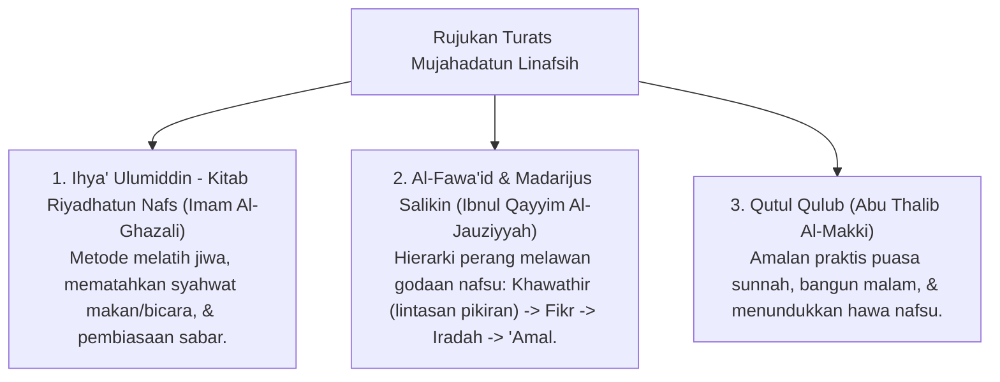

# P3-09-01-Filosofi-dan-Landasan-Turats (Mujahadatun Linafsih)

## Tujuan
Membedah landasan filosofis perang melawan hawa nafsu (*Jihadun Nafs*), tahapan penyucian jiwa (*Tazkiyatun Nafs*), dan rujukan kitab Turats tasawuf sunni klasik.

---

## 1. Landasan Nash Al-Qur'an & As-Sunnah

### 1. QS. Al-'Ankabut [29]: 69
> وَالَّذِينَ جَاهَدُوا فِينَا لَنَهْدِيَنَّهُمْ سُبُلَنَا ۚ وَإِنَّ اللَّهَ لَمَعَ الْمُحْسِنِينَ
> *"Dan orang-orang yang berjihad (bersungguh-sungguh melawan nafsu) untuk (mencari keridhaan) Kami, benar-benar akan Kami tunjukkan kepada mereka jalan-jalan Kami. Dan sesungguhnya Allah benar-benar beserta orang-orang yang berbuat baik."*

### 2. HR. Bukhari (No. 6114)
> لَيْسَ الشَّدِيدُ بِالصُّرَعَةِ، إِنَّمَا الشَّدِيدُ الَّذِي يَمْلِكُ نَفْسَهُ عِنْدَ الْغَضَبِ
> *"Orang yang kuat bukanlah orang yang jago bergulat, melainkan orang yang mampu menguasai dirinya saat sedang marah."*

---

## 2. Rujukan Khazanah Turats Klasik

---

## 3. Status Dokumen
* **Status**: 🌟 **A+ (Tervalidasi & Siap Diimplementasikan)**
* **Level**: Project 3 - `03 Capacity Framework / 09 Mujahadatun Linafsih / 01 Philosophy`
