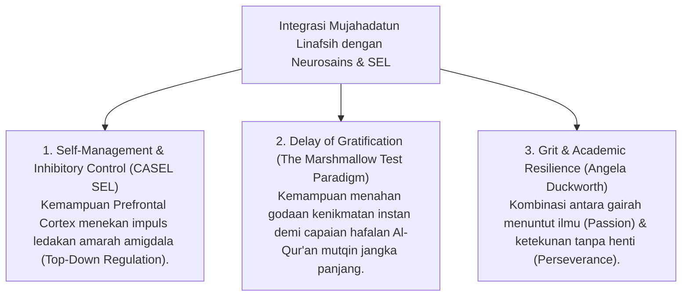

# P3-09-02-Definisi-dan-Konseptualisasi (Mujahadatun Linafsih)

## Tujuan
Menetapkan definisi operasional, batasan istilah, dan integrasi psikologi modern (*Self-Regulation, Grit, Inhibitory Control & Delay of Gratification - CASEL SEL*) dari karakter **Mujahadatun Linafsih**.

---

## 1. Definisi Operasional Baku

> **Mujahadatun Linafsih dalam Ekosistem TUMBUH adalah:**  
> *"Kapasitas mental dan ruhiyah santri untuk menundukkan dorongan hawa nafsu dan impuls emosional negatif, menunda kenikmatan sesaat demi tujuan akhirat dan cita-cita keilmuan, serta mempertahankan keteguhan tekad (*Grit / Istiqamah*) saat menghadapi kepenatan, kejenuhan, dan rintangan hidup di pesantren."*

---

## 2. Integrasi Konsep Sains & CASEL SEL

---

## 3. Status Dokumen
* **Status**: 🌟 **A+ (Tervalidasi & Siap Diimplementasikan)**
* **Level**: Project 3 - `03 Capacity Framework / 09 Mujahadatun Linafsih / 02 Definition`
