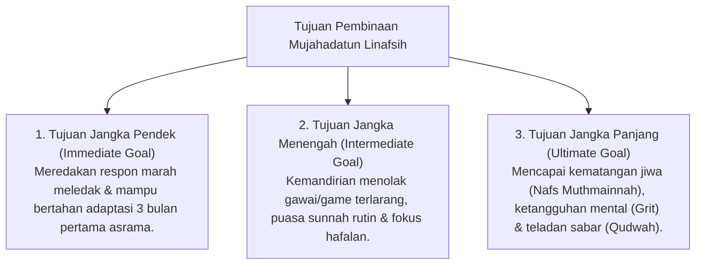

# P3-09-03-Tujuan-dan-Target-Capaian (Mujahadatun Linafsih)

## Tujuan
Menetapkan tujuan jangka pendek, menengah, dan panjang pembinaan karakter **Mujahadatun Linafsih** pada santri di lingkungan pesantren TUMBUH.

---

## 1. 3 Tingkatan Tujuan Pembinaan Regulasi Diri

---

## 2. Target Capaian Kuantitatif & Kualitatif

1. **Target Kuantitatif**:
   - 0% kasus perkelahian fisik akibat luapan amarah tak terkontrol di asrama.
   - 80%+ santri menjalankan puasa sunnah Senin-Kamis secara sukarela.
2. **Target Kualitatif**:
   - Santri memiliki ketenangan jiwa (*Hilm*), tidak mudah tersulut provokasi, dan gigih menuntaskan target hafalan meski dalam kondisi sulit.

---

## 3. Status Dokumen
* **Status**: 🌟 **A+ (Tervalidasi & Siap Diimplementasikan)**
* **Level**: Project 3 - `03 Capacity Framework / 09 Mujahadatun Linafsih / 03 Purpose`
