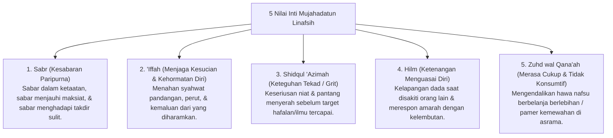

# P3-09-04-Nilai-Inti-dan-Prinsip-Mujahadah (Mujahadatun Linafsih)

## Tujuan
Merumuskan nilai-nilai inti (*Core Values*) dan prinsip dogmatis yang menjiwai karakter **Mujahadatun Linafsih** dalam kehidupan santri.

---

## 1. 5 Nilai Inti Mujahadatun Linafsih

---

## 2. Status Dokumen
* **Status**: 🌟 **A+ (Tervalidasi & Siap Diimplementasikan)**
* **Level**: Project 3 - `03 Capacity Framework / 09 Mujahadatun Linafsih / 04 Core Values`
