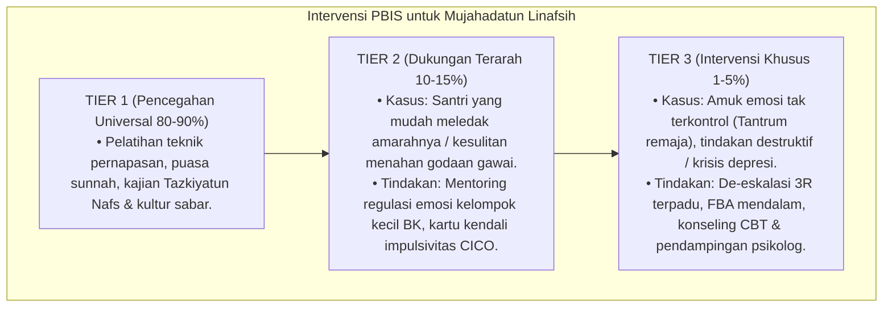

# P3-09-10-Protokol-Intervensi-dan-Pembiasaan (Mujahadatun Linafsih)

## Tujuan
Menetapkan protokol pembiasaan pengendalian diri (*Self-Control SOP*) dan pemetaan intervensi bertingkat (*PBIS Multi-Tier Intervention*) untuk melatih kesabaran dan ketangguhan mental santri.

---

## 1. Protokol Pembiasaan Rutin Asrama (Tier 1: Universal 100%)

1. **Pembiasaan Puasa Sunnah Senin & Kamis**:
   - Dapur pondok menyediakan menu sahur dan buka puasa khusus, doa bersama menjelang berbuka.
2. **Protokol 4 Langkah Menahan Amarah (Sunnah Nabawiyyah)**:
   - (1) Membaca Ta'awwudz $\rightarrow$ (2) Diam tidak membalas $\rightarrow$ (3) Duduk / Berbaring $\rightarrow$ (4) Berwudhu air dingin.
3. **Pemberian Apresiasi Kejujuran & Kesabaran (Rasio 4:1)**:
   - Musyrif memberikan poin apresiasi khusus bagi santri yang mampu menahan diri saat diprovokasi.

---

## 2. Pemetaan Intervensi Khusus PBIS

---

## 3. Status Dokumen
* **Status**: 🌟 **A+ (Tervalidasi & Siap Diimplementasikan)**
* **Level**: Project 3 - `03 Capacity Framework / 09 Mujahadatun Linafsih / 10 Intervention Mapping`
