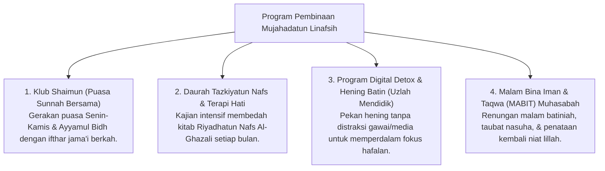

# P3-09-11-Program-Pembinaan-dan-Halaqah (Mujahadatun Linafsih)

## Tujuan
Menetapkan daftar program pembinaan terstruktur, retreat spiritual, dan kegiatan penguatan karakter **Mujahadatun Linafsih** di pesantren TUMBUH.

---

## 1. 4 Program Unggulan Pembinaan Mujahadah

---

## 2. Status Dokumen
* **Status**: 🌟 **A+ (Tervalidasi & Siap Diimplementasikan)**
* **Level**: Project 3 - `03 Capacity Framework / 09 Mujahadatun Linafsih / 11 Programs`
