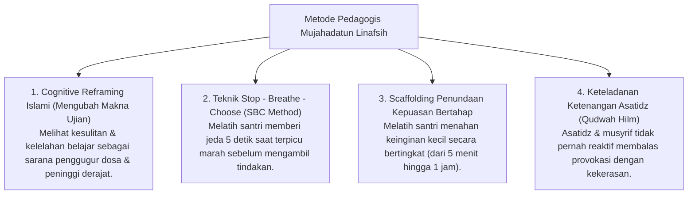

# P3-09-12-Metode-Pedagogi-dan-Didaktik-Mujahadah (Mujahadatun Linafsih)

## Tujuan
Menetapkan metode pedagogis dan pendekatan didaktik psikologis dalam melatihkan regulasi diri, kesabaran, dan ketahanan mental (*Grit*) bagi santri.

---

## 1. 4 Metode Pedagogi Pengajaran Mujahadah

---

## 2. Status Dokumen
* **Status**: 🌟 **A+ (Tervalidasi & Siap Diimplementasikan)**
* **Level**: Project 3 - `03 Capacity Framework / 09 Mujahadatun Linafsih / 12 Methods`
