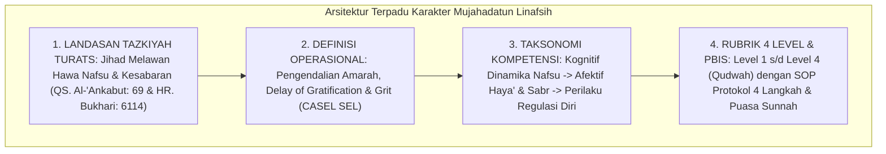

# P3-09-14-Sintesis-dan-Validasi-Mujahadatun-Linafsih

## Tujuan
Menyintesiskan seluruh modul kapasitas **Mujahadatun Linafsih (Karakter 6)**—mencakup landasan filosofis, definisi operasional, standar kompetensi, rubrik 4 level, dan protokol intervensi PBIS—serta menetapkan bukti validasi kelayakan implementasi.

---

## 1. Arsitektur Sintesis Kapasitas Mujahadatun Linafsih

---

## 2. Matriks Uji Validitas Karakter 6

| Komponen Uji | Tolok Ukur Validasi | Status |
| :--- | :--- | :---: |
| **Landasan Tasawuf Syar'i** | Selaras dengan konsep Tazkiyatun Nafs Al-Ghazali dan Ibnul Qayyim. | ✅ **Lolos** |
| **Integrasi Neurosains** | Menerapkan regulasi *Top-Down* Prefrontal Cortex atas impuls amigdala. | ✅ **Lolos** |
| **Operasionalitas Rubrik** | Indikator pengendalian amarah dan ketahanan belajar terukur di logbook PBIS. | ✅ **Lolos** |
| **Intervensi PBIS** | Protokol de-eskalasi emosi Tier 1-3 efektif mencegah kekerasan di asrama. | ✅ **Lolos** |

---

## 3. Status Dokumen
* **Status**: ✅ **SELESAI (Status Mutu: A+)**
* **Level**: Subproject Induk Karakter 6
* **Project**: `03 Capacity Framework`
* **Subproject**: `09 Mujahadatun Linafsih`
* **Langkah Berikutnya**: Melanjutkan ke sub-domain karakter ke-7: **`10 Haritsun Ala Waqtih`**.
