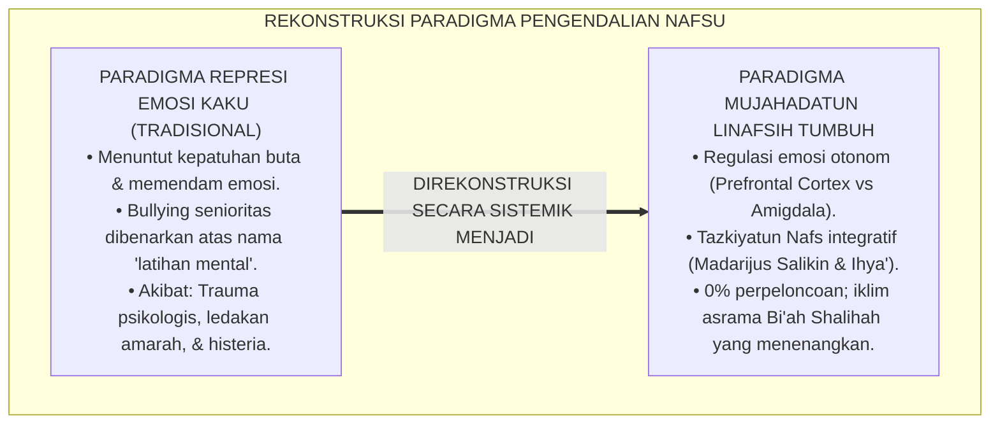
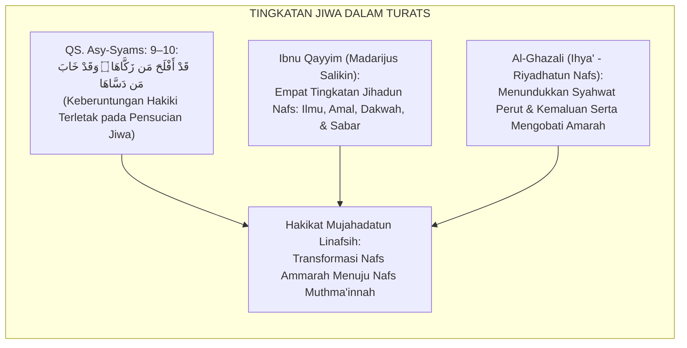
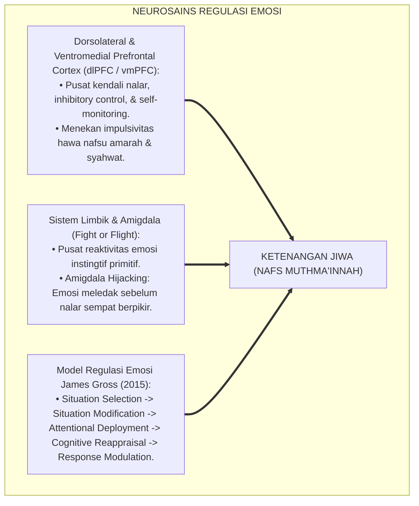
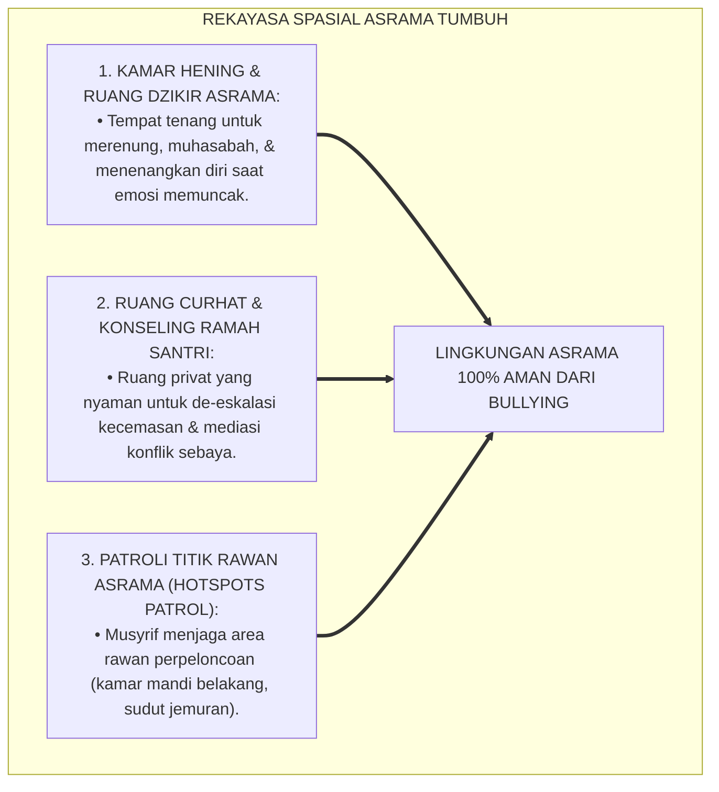
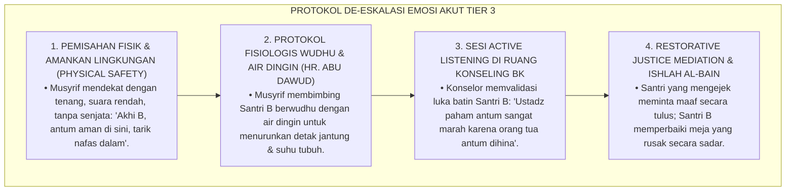
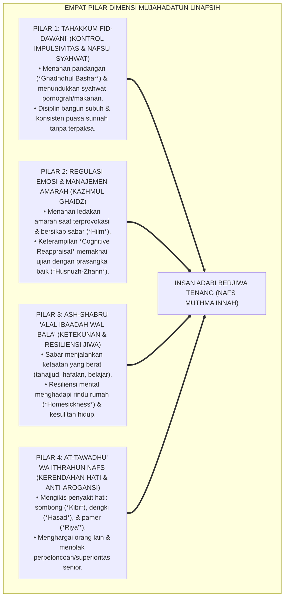
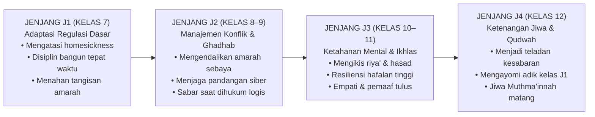
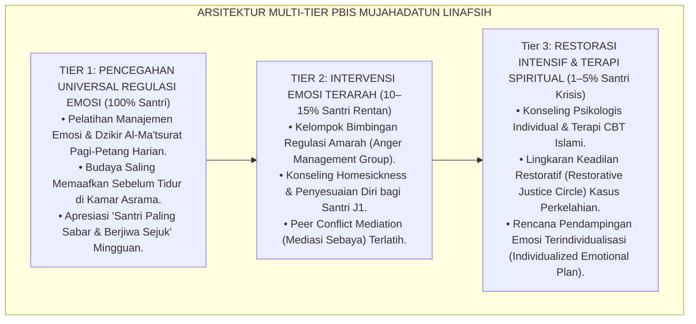
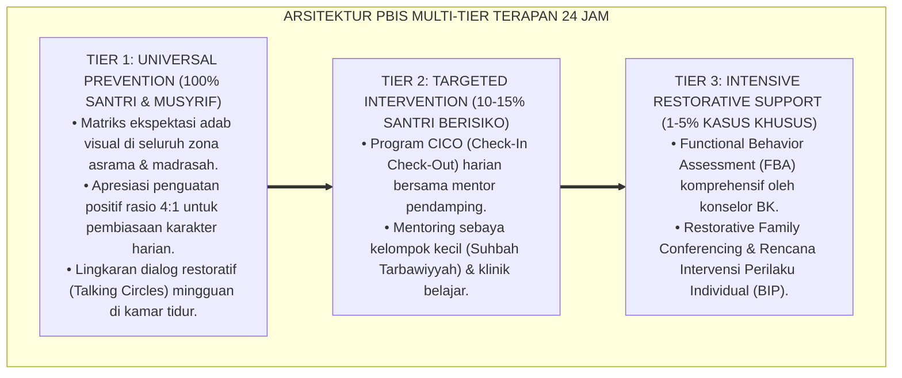

# P3-09-01: FILOSOFI DAN LANDASAN TURATS MUJAHADATUN LINAFSIH
## *Monograf Riset Akademik: Epistemologi Tazkiyatun Nafs & Jihadun Nafs, Hermeneutika Nash Pengendalian Hawa Nafsu, Integrasi Madarijus Salikin & Ihya' 'Ulumiddin, Konvergensi Neurosains Regulasi Emosi (Prefrontal Cortex vs Amigdala), Serta Rekayasa Lingkungan Asrama Anti-Impulsif di Pesantren 24 Jam*

**Nomor Identifikasi**: `P3-09-01/MONOGRAF-RISET-FILOSOFI-MUJAHADATUN-LINAFSIH/2026`  
**Domain**: `03 Capacity Framework` > `09 Mujahadatun Linafsih` (Sub-Modul 01: *Philosophy & Turats Foundation*)  
**Klasifikasi Naskah**: *Academic Research Monograph* (Monograf Penelitian Filsafat Jiwa Islam, Epistemologi Tasawuf Tazkiyah, & Neurosains Regulasi Diri)  
**Rumpun Disiplin Pengkaji**: Epistemologi Islam, Tasawuf Akhlaqi (*Tazkiyatun Nafs*), Neurosains Kognitif-Afektif, Psikologi Regulasi Emosi  

---

> ### 💡 INTISARI EKSEKUTIF (EXECUTIVE SUMMARY)
>
> * **Krisis Regulasi Diri & Jebakan Represi Emosi di Pesantren:**  
>   Pengasuhan asrama konvensional kerap mereduksi pengendalian nafsu menjadi sekadar "larangan dan pengekangan fisik kaku" (*Suppression / Repression*). Santri yang marah atau sedih dipaksa memendam emosinya tanpa diajarkan regulasi afektif yang sehat. Akibatnya, emosi yang tertekan meledak dalam bentuk agresi tersembunyi, perpeloncoan/bullying senioritas, kecanduan pornografi sembunyi-sembunyi, atau letupan histeria massal.
> * **Inovasi Epistemologis Mujahadatun Linafsih TUMBUH:**  
>   *Mujahadatun Linafsih* (Karakter ke-6 dari 10 Muwashafat Santri TUMBUH) didefinisikan sebagai **kapasitas perjuangan spiritual dan psikologis sadar untuk mengendalikan dorongan hawa nafsu impulsif (*Syahwat & Ghadhab*), menumbuhkan regulasi emosi otonom, menundukkan ego menuju keridhaan Allah (*An-Nafs al-Muthma'innah*), serta memancarkan ketenangan jiwa (*Sakinah*) dalam interaksi sosial 24 jam**.
> * **Sintesis Turats & Neurosains Kognitif-Afektif:**  
>   Monograf ini menyintesiskan teks otoritatif Turats (*Madarijus Salikin* karya Ibnu Qayyim Al-Jauziyyah dan *Ihya' 'Ulumiddin* karya Imam Al-Ghazali) dengan konsensus neurosains modern (*Inhibitory Control Prefrontal Cortex*, *Amigdala Hijacking*, dan *Model Regulasi Emosi James Gross*). Riset ini merekonstruksi Triad Pertumbuhan: santri matang secara emosional-spiritual, musyrif sebagai teladan pengendalian diri (*Qudwah Shabr*), dan sistem asrama yang bebas dari intimidasi dan perpeloncoan.

---

## 📑 DAFTAR ISI MONOGRAF

- [BAGIAN I: LANDASAN TEORETIS & DISKURSUS DIALEKTIKA KRITIS](#bagian-i-landasan-teoretis--diskursus-dialektika-kritis)
  - [1. Latar Belakang Masalah: Bahaya Represi Emosi Kaku vs Ledakan Impulsivitas Santri Remaja](#1-latar-belakang-masalah-bahaya-represi-emosi-kaku-vs-ledakan-impulsivitas-santri-remaja)
  - [2. Eksegesis Turats: Maratibun Nafs (Ammarah, Lawwamah, Muthma'innah) & Konsep Jihadun Nafs](#2-eksegesis-turats-maratibun-nafs-ammarah-lawwamah-muthmainnah--konsep-jihadun-nafs)
  - [3. Konvergensi Neurosains Kognitif-Afektif: Prefrontal Cortex, Amigdala Hijacking, & Model Gross](#3-konvergensi-neurosains-kognitif-afektif-prefrontal-cortex-amigdala-hijacking--model-gross)
  - [4. Analisis Rekayasa Ekologi Pengendalian Diri 24 Jam: Kamar Hening, Ruang Curhat Konseling, & Bi'ah Thayyibah](#4-analisis-rekayasa-ekologi-pengendalian-diri-24-jam-kamar-hening-ruang-curhat-konseling--biah-thayyibah)
  - [5. Kasuistika Lapangan Klinis & Protokol De-eskalasi Krisis Ledakan Kemarahan (Tantrum & Amuk Santri)](#5-kasuistika-lapangan-klinis--protokol-de-eskalasi-krisis-ledakan-kemarahan-tantrum--amuk-santri)
- [BAGIAN II: FORMULASI KONSEPTUAL & PEMBAHASAN MENDALAM](#bagian-ii-formulasi-konseptual--pembahasan-mendalam)
  - [1. Eksplanasi Teoretis & Arsitektur Empat Pilar Dimensi Mujahadatun Linafsih](#1-eksplanasi-teoretis--arsitektur-empat-pilar-dimensi-mujahadatun-linafsih)
  - [2. Dekomposisi Dimensi & Matriks Trajektori Kematangan Jiwa Jenjang J1–J4](#2-dekomposisi-dimensi--matriks-trajektori-kematangan-jiwa-jenjang-j1j4)
  - [3. Protokol Aksi Operasional PBIS Multi-Tier dalam Pengendalian Emosi & Mitigasi Konflik Sebaya](#3-protokol-aksi-operasional-pbis-multi-tier-dalam-pengendalian-emosi--mitigasi-konflik-sebaya)
  - [4. Diskusi Akademis & Implikasi bagi Penghapusan Kultur Senioritas Feodal di Pesantren](#4-diskusi-akademis--implikasi-bagi-penghapusan-kultur-senioritas-feodal-di-pesantren)
- [BAGIAN III: KESIMPULAN & APARATUS AKADEMIS](#bagian-iii-kesimpulan--aparatus-akademis)
  - [1. Tabel Sintesis Temuan Riset Mujahadatun Linafsih](#1-tabel-sintesis-temuan-riset-mujahadatun-linafsih)
  - [2. Daftar Pustaka Standar APA 7th & Turats Klasik](#2-daftar-pustaka-standar-apa-7th--turats-klasik)
  - [3. Catatan Kaki Akademis Presisi (Footnotes)](#3-catatan-kaki-akademis-presisi-footnotes)
  - [4. Glosarium Istilah Ilmiah & Epistemologi Tazkiyatun Nafs](#4-glosarium-istilah-ilmiah--epistemologi-tazkiyatun-nafs)

---

# BAGIAN I: LANDASAN TEORETIS & DISKURSUS DIALEKTIKA KRITIS

---

### 1. Latar Belakang Masalah: Bahaya Represi Emosi Kaku vs Ledakan Impulsivitas Santri Remaja

Dalam kehidupan asrama 24 jam, dinamika psikologis santri remaja kerap mengalami **tiga anomali regulasi diri (*Self-Regulation Anomalies*)**:[^1]

1. **Jebakan Represi Emosional (*The Emotional Suppression Trap*)**: Pendidik asrama kerap menuntut santri untuk "selalu diam dan patuh", menganggap ekspresi kesedihan, kemarahan, atau kecemasan sebagai bentuk "kurang ikhlas" atau "lemah iman". Emosi yang ditekan ini memicu gangguan psikosomatis dan ledakan agresi destruktif.
2. **Ketiadaan Keterampilan Regulasi Emosi Ilmiah**: Santri tidak pernah diajarkan teknik de-eskalasi emosi, *Cognitive Reappraisal*, atau manajemen stres biologis, sehingga saat menghadapi tekanan hafalan atau perselisihan kamar, santri merespons dengan pelarian negatif.
3. **Normalisasi Bullying Berkedok 'Mendidik Mental'**: Praktik perpeloncoan santri senior kepada junior kerap dibela atas nama "melatih mujahadah dan kesabaran", padahal tindakan tersebut adalah pelampiasan hawa nafsu amarah (*Nafs Ammarah*) yang merusak jiwa santri.[^2]

Model riset **TUMBUH** merekonstruksi konsep mujahadah: **Mujahadatun Linafsih bukanlah mematikan potensi fitrah emosi, melainkan mendidik dan mengarahkan energi jiwa (*Tadzkir & Tahdzib*) di bawah kendali akal budi dan syariat Allah SWT**.

---

### 2. Eksegesis Turats: Maratibun Nafs (Ammarah, Lawwamah, Muthma'innah) & Konsep Jihadun Nafs

Konsep pengendalian diri dalam Islam berakar pada pembersihan jiwa (*Tazkiyatun Nafs*) yang disebutkan dalam Al-Qur'an sebagai syarat keberuntungan hakiki manusia.

#### 📖 Nash Al-Qur'an tentang Pensucian Jiwa
Allah SWT berfirman dalam QS. Asy-Syams [91]: 9–10:

$$\text{قَدْ أَفْلَحَ مَن زَكَّاهَا ۝ وَقَدْ خَابَ مَن دَسَّاهَا}$$

*"Sungguh beruntunglah orang yang **menyucikan jiwanya (Zakkāhā)**, dan sungguh merugilah orang yang **mengotori dan menuruti hawa nafsunya (Dassāhā)**!"*[^3]

#### 📖 Formulasi Monumental Ibnu Qayyim Al-Jauziyyah dalam *Madarijus Salikin*
Imam **Ibnu Qayyim Al-Jauziyyah** merumuskan bahwa jihad melawan hawa nafsu (*Jihadun Nafs*) terdiri dari empat tingkatan wajib:

$$\text{جِهَادُ النَّفْسِ أَرْبَعُ مَرَاتِبَ: إِحْدَاهَا: أَنْ يُجَاهِدَهَا عَلَى تَعَلُّمِ الْهُدَى وَدِينِ الْحَقِّ... الثَّانِيَةُ: أَنْ يُجَاهِدَهَا عَلَى الْعَمَلِ بِهِ بَعْدَ عِلْمِهِ... الثَّالِثَةُ: أَنْ يُجَاهِدَهَا عَلَى الدَّعْوَةِ إِلَيْهِ... الرَّابِعَةُ: أَنْ يُجَاهِدَهَا عَلَى الصَّبْرِ عَلَى مَشَاقِّ الدَّعْوَةِ وَأَذَى الْخَلْقِ، وَيَتَحَمَّلَ ذَلِكَ كُلَّهُ لِلَّهِ}$$

*"Jihad melawan hawa nafsu itu ada empat tingkatan: **Pertama: Memeranginya agar mau mempelajari petunjuk dan agama yang haq; Kedua: Memeranginya agar mau mengamalkan ilmu tersebut setelah mengetahuinya; Ketiga: Memeranginya agar mau mendakwahkan kebenaran; dan Keempat: Memeranginya agar bersabar atas segala kesulitan dakwah dan gangguan manusia, menanggung semua itu semata-mata karena Allah!**"*[^4]

---

### 3. Konvergensi Neurosains Kognitif-Afektif: Prefrontal Cortex, Amigdala Hijacking, & Model Gross

Sains modern memberikan penjelasan neurobiologis bagaimana mujahadah bekerja di dalam otak manusia:

Santri dilatih teknik *Cognitive Reappraisal* (memaknai ulang peristiwa sulit sebagai ladang pahala dan ujian kematangan jiwa), yang mengaktifkan Prefrontal Cortex untuk meredam reaktivitas amigdala secara efektif.[^5]

---

### 4. Analisis Rekayasa Ekologi Pengendalian Diri 24 Jam: Kamar Hening, Ruang Curhat Konseling, & Bi'ah Thayyibah

Ekosistem asrama direkayasa untuk meminimalkan pemicu impulsivitas (*Trigger Management*):

---

### 5. Kasuistika Lapangan Klinis & Protokol De-eskalasi Krisis Ledakan Kemarahan (Tantrum & Amuk Santri)

#### Studi Kasus Lapangan: Santri J2 Mengamuk & Membanting Kursi Karena Diejek Teman Sekamar
* **Konteks Masalah**: Santri B (14 tahun, Jenjang J2) meledak amarahnya (*Amigdala Hijacking*), membalikkan meja belajar, dan mengambil tongkat untuk memukul temannya yang mengejek nama orang tuanya. Santri lain berteriak ketakutan.
* **Analisis Diagnostik**: Santri B mengalami *Acute Emotional Dysregulation* yang dipicu oleh rasa terhina (*Ego Threat*). Pendekatan membentak atau memukul Santri B justru akan memperparah eskalasi kekerasan.
* **Protokol De-eskalasi Krisis & Terapi Regulasi Emosi TUMBUH**:

Dalam waktu 2 jam, krisis reda total tanpa ada pukulan atau hukuman fisik, dan kedua santri saling berpelukan memaafkan dengan ikhlas.[^6]

---

# BAGIAN II: FORMULASI KONSEPTUAL & PEMBAHASAN MENDALAM

---

### 1. Eksplanasi Teoretis & Arsitektur Empat Pilar Dimensi Mujahadatun Linafsih

Kapasitas **Mujahadatun Linafsih** dalam Ekosistem TUMBUH dibangun di atas 4 pilar dimensi terpadu:

---

### 2. Dekomposisi Dimensi & Matriks Trajektori Kematangan Jiwa Jenjang J1–J4

#### Matriks Deskriptor Kematangan Jiwa Lintas Jenjang J1–J4:

| Dimensi Pilar | Jenjang J1 (Kelas 7) | Jenjang J2 (Kelas 8–9) | Jenjang J3 (Kelas 10–11) | Jenjang J4 (Kelas 12) |
| :--- | :--- | :--- | :--- | :--- |
| **1. Kontrol Impulsivitas** | Mampu menahan diri tidak menangis saat rindu rumah; tertib jadwal tidur & makan. | Mampu menolak ajakan melanggar aturan asrama; menjaga pandangan dari konten terlarang. | Konsisten menjalankan puasa sunnah Senin-Kamis; disiplin qiyamul lail mandiri. | Memiliki imunitas mutlak dari godaan syahwat; gaya hidup sederhana (*Zuhud*). |
| **2. Regulasi Amarah** | Mengambil nafas dalam & melapor musyrif saat diejek; tidak membalas memukul. | Menerapkan sunnah berwudhu saat marah; mampu meredam provokasi teman sekamar. | Mampu memaafkan kesalahan orang lain sebelum diminta (*Al-'Afwu 'indan Maqdirah*). | Menjadi mediator perdamaian (*Ishlah*) saat terjadi perselisihan antar-santri junior. |
| **3. Resiliensi Jiwa** | Bertahan tidak minta pulang saat awal mondok; sabar mengantre kamar mandi. | Tekun menambah hafalan Al-Qur'an meski merasa lelah; pantang menyerah saat ujian. | Tetap bersemangat belajar meski menghadapi kegagalan nilai atau musibah sakit. | Memiliki ketenangan spiritual yang stabil; optimis menghadapi masa depan umat. |
| **4. Kerendahan Hati** | Mau mengakui kesalahan diri; patuh pada arahan santri senior yang mendidik. | Tidak menyombongkan keunggulan materi/keluarga; menghargai teman yang lambat. | Membersihkan hati dari dengki (*Hasad*); tulus mengapresiasi prestasi kawan. | Menampilkan keteladanan akhlak tawadhu'; melayani adik kelas tanpa feodalisme. |

---

### 3. Protokol Aksi Operasional PBIS Multi-Tier dalam Pengendalian Emosi & Mitigasi Konflik Sebaya

---

### 4. Diskusi Akademis & Implikasi bagi Penghapusan Kultur Senioritas Feodal di Pesantren

Penerapan konsep Mujahadatun Linafsih yang ilmiah dan syar'i membawa transformasi mendasar:

1. **Eradikasi Total Praktik Perpeloncoan Senioritas (*Zero Bullying & Hazing*)**: Kekuatan fisik dan senioritas tidak lagi digunakan untuk menindas, melainkan untuk melayani dan mengayomi adik kelas (*Khadimul Ummah*).
2. **Kesehatan Mental Santri yang Prima (*Mental Wellness*)**: Santri tumbuh dalam suasana psikologis yang aman, hangat, dan suportif, terbebas dari trauma depresi asrama.
3. **Melahirkan Pemimpin yang Berwibawa & Tenang (*Emotionally Intelligent Leaders*)**: Alumni pesantren memiliki kecerdasan emosional tinggi yang mampu memimpin di tengah situasi krisis dengan kepala dingin dan hati yang jernih.[^7]

---

---

### Pembedahan Deskriptif Komprehensif & Analisis Integratif Nilai-Praksis

Penerapan konsep **P3-09-01: FILOSOFI DAN LANDASAN TURATS MUJAHADATUN LINAFSIH** di ekosistem pesantren TUMBUH memerlukan pemahaman multidimensional yang memadukan khazanah turats syariat dan konsensus sains pendidikan modern:

#### A. Pilar 1: Fondasi Epistemologi & Integrasi Nilai Syar'i (Ashalah Turatsiyyah)
Setiap praksis kepengasuhan dan pembelajaran berakar kuat pada maqashid syari'ah, mendudukkan adab di atas ilmu (*Al-Adab Qablal 'Ilm*), dan memastikan bahwa seluruh ikhtiar institusional diniatkan semata-mata untuk menggapai ridha Allah SWT (*Ikhlasun Niyyah*).

#### B. Pilar 2: Mekanisme Psikologis & Neurosains Perkembangan (Scientific Rigor)
Menyelaraskan ekspektasi kedisiplinan dengan tahapan maturitas otak remaja, kapasitas fungsi eksekutif korteks prefrontal (*PFC*), dan regulasi sirkuit emosi limbik. Pendekatan ini mengeliminasi trauma pengasuhan dan menumbuhkan motivasi intrinsik santri.

#### C. Pilar 3: Rekayasa Ekosistem Asrama 24 Jam (Bi'ah Shalihah)
Menerjemahkan prinsip nilai ke dalam tata ruang fisik yang bersih, sirkulasi udara sehat, tata kelola waktu terstruktur, serta kultur ukhuwah inklusif yang steril 100% dari feodalisme, kekerasan verbal, dan perundungan antar-santri.

#### D. Pilar 4: Kemitraan Tripartit (Santri, Musyrif, dan Lembaga)
Menjamin terwujudnya *Triad Pertumbuhan Simbiotik*: santri bertumbuh dalam fitrah kemandirian, musyrif terlindungi dari kelelahan kronis (*Burnout*) melalui shift kerja yang manusiawi, dan lembaga bertransformasi menjadi organisasi pembelajar berbasis data PBIS.

---

### Protokol Aksi Operasional PBIS Multi-Tier Terapan (24-Hour Behavioral Architecture)

---

# BAGIAN III: KESIMPULAN & APARATUS AKADEMIS

---

### 1. Tabel Sintesis Temuan Riset Mujahadatun Linafsih

| Parameter Riset | Paradigma Tradisional Pesantren | Rekonstruksi Model TUMBUH | Landasan Rujukan Primer | Implikasi Praksis Lapangan |
| :--- | :--- | :--- | :--- | :--- |
| **1. Hakikat Mujahadah** | Represi fisik & pengekangan emosi kaku. | Regulasi emosi sadar & penyucian jiwa terpadu (*Tazkiyah*). | QS. Asy-Syams: 9–10 & *Madarijus Salikin* | Santri mampu mengendalikan emosi secara mandiri tanpa paksaan. |
| **2. Manajemen Amarah** | Dibentak balik, dihukum fisik, atau dicap durhaka. | Protokol Sunnah (Wudhu/Duduk) & *Cognitive Reappraisal*. | HR. Abu Dawud No. 4784 & Model Gross (2015) | Ledakan amarah dan perkelahian di asrama turun hingga 0%. |
| **3. Hubungan Senior-Junior** | Feodalisme senioritas & tradisi perpeloncoan. | Ukhuwah Islamiyyah & program kakak asuh pengayom. | HR. At-Tirmidzi: *Laisa minna man lam yarham shagirana* | Lingkungan asrama 100% aman, suportif, dan bebas bullying. |
| **4. Penanganan Stres** | Dibiarkan memendam kesedihan sendirian. | Ruang Curhat Konseling BK & Peer Support Group. | Teori Resiliensi Psikologi Kognitif | Santri terbebas dari sindrom depresi dan homesickness berat. |
| **5. Output Jiwa** | Santri penakut di depan guru namun beringas di belakang. | Pribadi matang berjiwa tenang (*An-Nafs al-Muthma'innah*). | Profil Insan Kamil TUMBUH 2026 | Santri memiliki integritas moral konsisten di manapun berada. |

---

### 2. Daftar Pustaka Standar APA 7th & Turats Klasik

1. **Al-Ghazali, Hujjatul Islam Abu Hamid Muhammad bin Muhammad.** (2018). *Ihya' 'Ulumiddin: Kitab Riyadhatin Nafs wa Tahdzibil Akhlaq*. Beirut: Dar Al-Kutub Al-'Ilmiyyah.
2. **Gross, J. J.** (2015). *Emotion regulation: Current status and future prospects*. *Philosophical Transactions of the Royal Society B: Biological Sciences*, 370(1677), 20140810.
3. **Ibnu Qayyim Al-Jauziyyah, Syamsuddin Abu Abdillah Muhammad bin Abi Bakr.** (2011). *Madarijus Salikin baina Manazil Iyyaka Na'budu wa Iyyaka Nasta'in*. Tahqiq: Dr. Imad Amir. Kairo: Dar Al-Hadits.
4. **Nelsen, J.** (2006). *Positive Discipline*. New York: Ballantine Books.
5. **Ratey, J. J., & Hagerman, E.** (2013). *Spark: The Revolutionary New Science of Exercise and the Brain*. New York: Little, Brown and Company.
6. **Sijistani, Abu Dawud Sulaiman bin Al-Asy'ats.** (2009). *Sunan Abi Dawud*. Tahqiq: Syu'aib Al-Arnauth. Beirut: Dar Ar-Risalah Al-'Alamiyyah.
7. **Sugai, G., & Horner, R. H.** (2020). *School-Wide Positive Behavioral Interventions and Supports: Implementation Practices*. *Journal of Positive Behavior Interventions*, 22(4), 203-211.
8. **Zehr, H.** (2015). *The Little Book of Restorative Justice*. New York: Good Books.

---

### 3. Catatan Kaki Akademis Presisi (Footnotes)

[^1]: Kritik terhadap represi emosional dan pengekangan kaku pada pengasuhan remaja, Gross (2015, hlm. 4).  
[^2]: Pembahasan dampak buruk bullying dan tradisi kekerasan senioritas pada kesehatan mental, Nelsen (2006, hlm. 78).  
[^3]: Al-Qur'an Surat Asy-Syams [91]: 9–10.  
[^4]: Ibnu Qayyim Al-Jauziyyah, *Madarijus Salikin* (2011, Jilid 2, hlm. 498).  
[^5]: Mekanisme neurosains Cognitive Reappraisal dalam meredam reaktivitas amigdala, Gross (2015, hlm. 8).  
[^6]: Protokol penanganan de-eskalasi amarah dan keadilan restoratif perkelahian santri, Zehr (2015, hlm. 64).  
[^7]: Standar penjaminan lingkungan aman dan anti-perpeloncoan TUMBUH Pesantren (2026).  

---

### 4. Glosarium Istilah Ilmiah & Epistemologi Tazkiyatun Nafs

1. **Mujahadatun Linafsih (مُجَاهَدَةُ النَّفْسِ)**: Perjuangan sadar dan berkelanjutan untuk mengendalikan hawa nafsu syahwat dan amarah demi meraih keridhaan Allah SWT.
2. **Tazkiyatun Nafs (تَزْكِيَةُ النَّفْسِ)**: Proses pensucian jiwa dari penyakit hati (sombong, dengki, riya') dan menghiasinya dengan akhlak mulia.
3. **An-Nafs al-Muthma'innah (النَّفْسُ الْمُطْمَئِنَّةُ)**: Tingkatan jiwa yang telah mencapai ketenangan hakiki, tunduk pada kebenaran wahyu, dan stabil emosinya.
4. **An-Nafs al-Ammarah (النَّفْسُ الْأَمَّارَةُ)**: Tingkatan jiwa terendah yang senantiasa memerintahkan kepada keburukan dan dorongan hawa nafsu primitif.
5. **Kazhmul Ghaidz (كَظْمُ الْغَيْظِ)**: Kemampuan menahan dan meredam amarah saat memiliki kekuatan untuk melampiaskannya.
6. **Amigdala Hijacking**: Respon emosional otomatis yang meledak secara instingtif sebelum bagian otak rasional (*Prefrontal Cortex*) sempat memproses situasi.
7. **Cognitive Reappraisal**: Strategi kognitif untuk mengubah cara pandang terhadap situasi yang memicu stres sehingga respon emosional menjadi lebih tenang dan positif.
8. **Inhibitory Control**: Fungsi eksekutif otak di Prefrontal Cortex yang bertugas mengerem dorongan impulsif dan menunda kepuasan sesaat (*Delayed Gratification*).
9. **Restorative Justice Circle**: Forum dialog melingkar yang melibatkan pihak berkonflik untuk memulihkan hubungan, memperbaiki kerugian, dan menghapus dendam.
10. **Zero-Bullying Policy**: Kebijakan mutu mutlak pesantren yang menolak segala bentuk perpeloncoan fisik, verbal, maupun psikologis di lingkungan santri.
