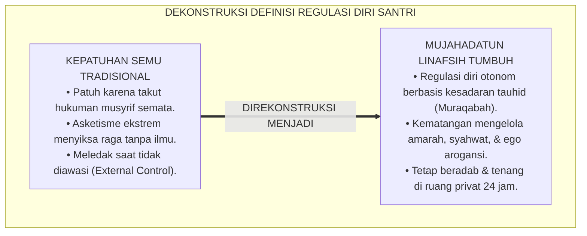
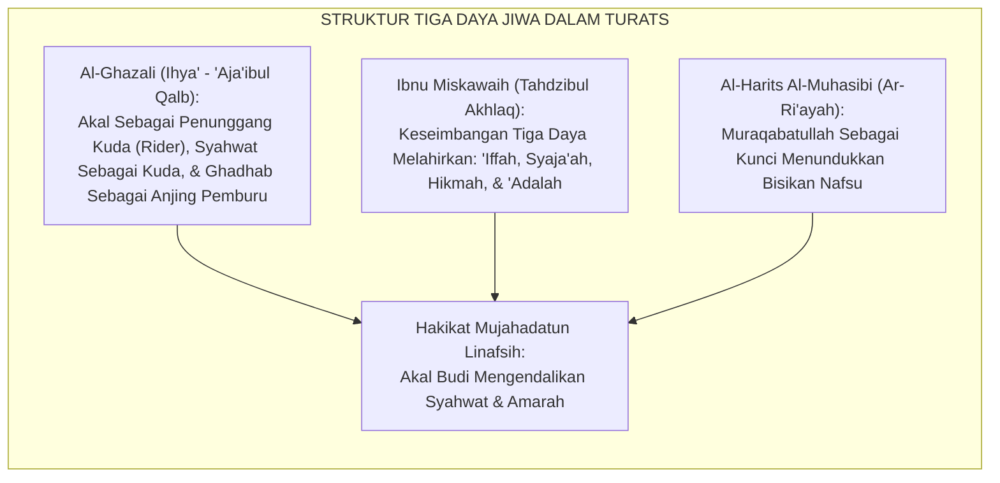
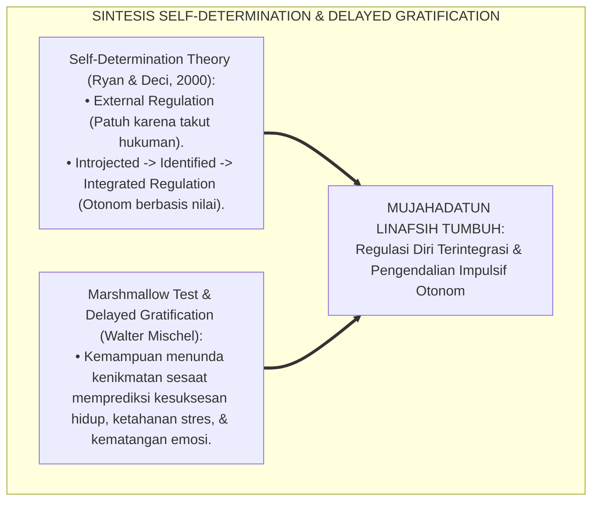
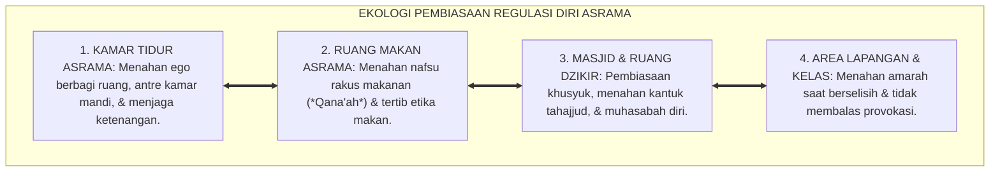
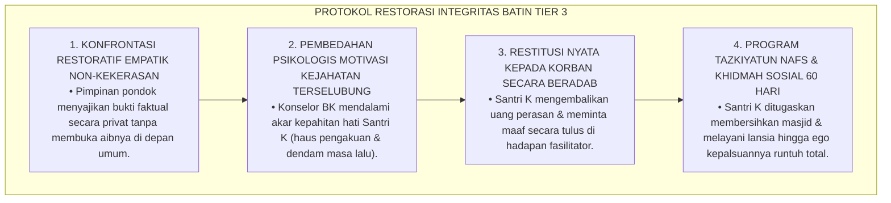
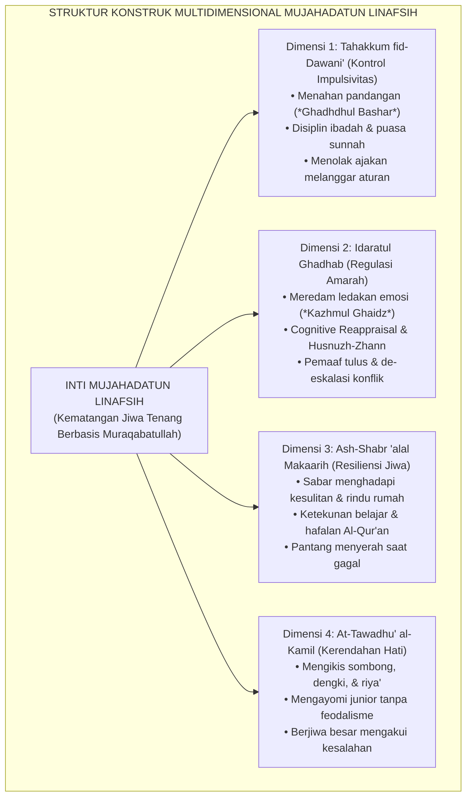
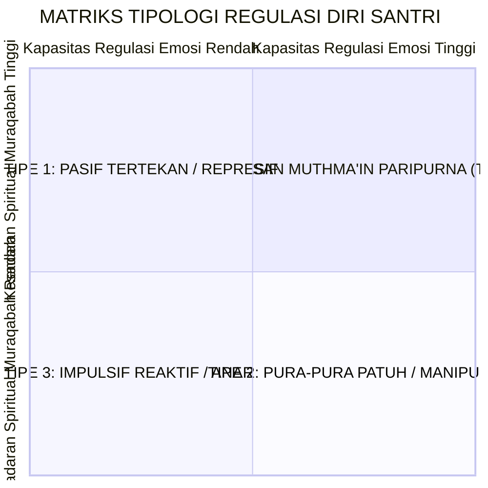
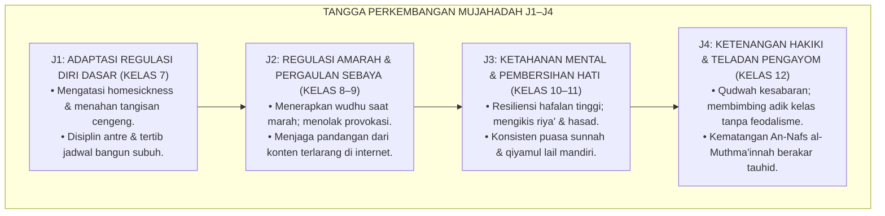
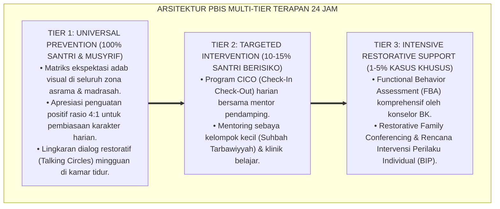

# P3-09-02: DEFINISI DAN KONSEPTUALISASI MUJAHADATUN LINAFSIH
## *Monograf Riset Akademik: Dekonstruksi 'Asketisme Pasif' Menuju Regulasi Diri Berkeadaban (Adaptive Self-Regulation), Konstruk Teoretis Empat Dimensi Mujahadah, Pemetaan Tipologi Regulasi Diri Santri, Serta Penegakan Emosional-Spiritual di Pesantren 24 Jam*

**Nomor Identifikasi**: `P3-09-02/MONOGRAF-RISET-KONSEPTUALISASI-MUJAHADATUN-LINAFSIH/2026`  
**Domain**: `03 Capacity Framework` > `09 Mujahadatun Linafsih` (Sub-Modul 02: *Definition & Conceptualization*)  
**Klasifikasi Naskah**: *Academic Research Monograph* (Monograf Penelitian Konstruk Regulasi Diri Islam, Epistemologi Pengendalian Nafsu, & Tipologi Emosi Santri)  
**Rumpun Disiplin Pengkaji**: Psikologi Kepribadian Islam, Teori Regulasi Diri (*Self-Determination Theory*), Tasawuf Terapan, Sosiologi Asrama Remaja  

---

> ### 💡 INTISARI EKSEKUTIF (EXECUTIVE SUMMARY)
>
> * **Distorsi Pemahaman Pengendalian Nafsu Konvensional:**  
>   Banyak santri dan pengasuh memahami pengendalian nafsu semata-mata sebagai asketisme ekstrem (*Zuhud Ekstrem / Penyiksaan Raga*) seperti menyiksa diri dengan kurang tidur atau menahan lapar berlebihan tanpa ilmu (*Tarahhub*). Di sisi lain, sebagian memandang regulasi diri sekadar "tidak melanggar tata tertib tertulis", melahirkan santri yang tampak patuh di depan musyrif namun beringas dan impulsif di ruang privat kamar atau media sosial.
> * **Rekonstruksi Konseptual Mujahadatun Linafsih TUMBUH:**  
>   Dalam kerangka TUMBUH, *Mujahadatun Linafsih* dikonseptualisasikan sebagai **konstruk multidimensional terpadu yang memadukan Pengendalian Dorongan Syahwat & Impulsivitas (*Tahakkum fid-Dawani'*), Regulasi Emosi & Manajemen Amarah (*Idaratul Ghadhab*), Ketekunan Ibadah & Resiliensi Menghadapi Kesulitan (*Ash-Shabr 'alal Makaarih*), serta Kerendahan Hati Bebas Arogansi Senioritas (*At-Tawadhu' al-Kamil*)**.
> * **Formulasi Konstruk Empat Dimensi & Matriks Tipologi Santri:**  
>   Monograf ini merumuskan definisi operasional baku, peta dekomposisi 4 pilar dimensi kognitif-afektif-spiritual, serta 4 tipologi profil regulasi diri santri (Impulsif Reaktif, Pura-pura Patuh / Pseudo-Compliant, Pasif Tertekan, dan Insan Mutma'in Paripurna) berbasis irisan kesadaran spiritual dan kapasitas regulasi emosi.

---

## 📑 DAFTAR ISI MONOGRAF

- [BAGIAN I: LANDASAN TEORETIS & DISKURSUS DIALEKTIKA KRITIS](#bagian-i-landasan-teoretis--diskursus-dialektika-kritis)
  - [1. Latar Belakang Masalah: Ilusi 'Santri Penurut' vs Kematangan Regulasi Diri Otonom](#1-latar-belakang-masalah-ilusi-santri-penurut-vs-kematangan-regulasi-diri-otonom)
  - [2. Telaah Epistemologis Turats: Hakikat Hawa Nafsu, Syahwat, & Ghadhab dalam Kitab Klasik](#2-telaah-epistemologis-turats-hakikat-hawa-nafsu-syahwat--ghadhab-dalam-kitab-klasik)
  - [3. Konvergensi Teori Regulasi Diri Modern: Self-Determination Theory (Ryan & Deci) & Marshmallow Test](#3-konvergensi-teori-regulasi-diri-modern-self-determination-theory-ryan--deci--marshmallow-test)
  - [4. Analisis Rekayasa Kausalitas Spasial: Pembiasaan Regulasi Diri 24 Jam di Asrama Pesantren](#4-analisis-rekayasa-kausalitas-spasial-pembiasaan-regulasi-diri-24-jam-di-asrama-pesantren)
  - [5. Kasuistika Lapangan Klinis & Protokol Rekonseptualisasi Santri 'Kepatuhan Palsu' (Pseudo-Compliance)](#5-kasuistika-lapangan-klinis--protokol-rekonseptualisasi-santri-kepatuhan-palsu-pseudo-compliance)
- [BAGIAN II: FORMULASI KONSEPTUAL & PEMBAHASAN MENDALAM](#bagian-ii-formulasi-konseptual--pembahasan-mendalam)
  - [1. Definisi Operasional & Arsitektur Konstruk Multidimensional Mujahadatun Linafsih](#1-definisi-operasional--arsitektur-konstruk-multidimensional-mujahadatun-linafsih)
  - [2. Dekomposisi 4 Pilar Dimensi & Tipologi Profil Regulasi Diri Santri](#2-dekomposisi-4-pilar-dimensi--tipologi-profil-regulasi-diri-santri)
  - [3. Matriks Progresi Kematangan Regulasi Diri Jenjang J1–J4 (Kelas 7 s/d 12)](#3-matriks-progresi-kematangan-regulasi-diri-jenjang-j1j4-kelas-7-sd-12)
  - [4. Diskusi Akademis & Implikasi bagi Tata Kelola Pembinaan Disiplin Positif di Pesantren](#4-diskusi-akademis--implikasi-bagi-tata-kelola-pembinaan-disiplin-positif-di-pesantren)
- [BAGIAN III: KESIMPULAN & APARATUS AKADEMIS](#bagian-iii-kesimpulan--aparatus-akademis)
  - [1. Tabel Sintesis Konseptualisasi Mujahadatun Linafsih](#1-tabel-sintesis-konseptualisasi-mujahadatun-linafsih)
  - [2. Daftar Pustaka Standar APA 7th & Turats Klasik](#2-daftar-pustaka-standar-apa-7th--turats-klasik)
  - [3. Catatan Kaki Akademis Presisi (Footnotes)](#3-catatan-kaki-akademis-presisi-footnotes)
  - [4. Glosarium Istilah Ilmiah & Konseptualisasi Mujahadah](#4-glosarium-istilah-ilmiah--konseptualisasi-mujahadah)

---

# BAGIAN I: LANDASAN TEORETIS & DISKURSUS DIALEKTIKA KRITIS

---

### 1. Latar Belakang Masalah: Ilusi 'Santri Penurut' vs Kematangan Regulasi Diri Otonom

Dalam evaluasi kepribadian santri di pesantren konvensional, kerap terjadi **tiga distorsi konseptual (*Conceptual Distortions*)**:[^1]

1. **Jebakan Kepatuhan Semu (*The Pseudo-Compliance Trap*)**: Santri yang diam, tidak pernah membantah, dan tampak sangat penurut kerap dianggap telah memiliki "mujahadah tinggi", padahal ia hanya takut dihukum musyrif (*External Regulation*). Ketika pengawasan melemah, santri tersebut kerap melampiaskan hawa nafsu secara ekstrem.
2. **Pengabaian Kematangan Regulasi Emosi Internal**: Pendidikan asrama jarang melatih santri mengenali dan mengelola emosinya sendiri, sehingga saat santri menghadapi tekanan hidup di luar pondok, santri mudah mengalami disorientasi psikologis.
3. **Mitos 'Menyiksa Fisik Sebagai Bukti Tirakat'**: Sebagian kalangan menganggap tirakat adalah menyiksa raga dengan mengurangi makan berlebihan hingga sakit, padahal Rasulullah SAW secara tegas melarang bentuk ekstremisme asketik semacam itu.[^2]

Model riset **TUMBUH** merekonstruksi konsep: **Mujahadatun Linafsih adalah kematangan regulasi diri otonom (*Autonomous Self-Regulation*) yang lahir dari kesadaran tauhid, kematangan akal budi, dan cinta kepada Allah**.

---

### 2. Telaah Epistemologis Turats: Hakikat Hawa Nafsu, Syahwat, & Ghadhab dalam Kitab Klasik

Para ulama tasawuf akhlaqi klasik mengidentifikasi bahwa jiwa manusia memiliki dua kekuatan instingtif utama: **Quwwah Syahwiyyah (Daya Tarik Kenikmatan)** dan **Quwwah Ghadhabiyyah (Daya Tolak / Amarah)**, yang wajib dikendalikan oleh **Quwwah 'Aqliyyah (Daya Nalar Hikmah)**.

#### 📖 Analogi Monumental Imam Al-Ghazali tentang Struktur Jiwa
Imam **Al-Ghazali** dalam *Ihya' 'Ulumiddin* menggambarkan integrasi pengendalian jiwa:

$$\text{مَثَلُ الْعَقْلِ فِي الْإِنْسَانِ كَمَثَلِ الْفَارِسِ، وَمَثَلُ الشَّهْوَةِ كَمَثَلِ فَرَسِهِ، وَمَثَلُ الْغَضَبِ كَمَثَلِ كَلْبِهِ؛ فَإِذَا كَانَ الْفَارِسُ حَاذِقًا وَفَرَسُهُ رَيِّاضًا وَكَلْبُهُ مُؤَدَّبًا مُعَلَّمًا، اسْتَقَامَ لَهُ الصَّيْدُ وَبَلَغَ مَقْصِدَهُ؛ وَإِنْ كَانَ الْفَارِسُ عَاجِزًا وَالْفَرَسُ جَمُوحًا وَالْكَلْبُ عَقُورًا، هَلَكَ الْفَارِسُ وَتَبَدَّدَ أَمْرُهُ}$$

*"Perumpamaan akal dalam diri manusia adalah laksana **seorang penunggang kuda yang mahir**, perumpamaan syahwat laksana **kudanya**, dan perumpamaan amarah laksana **anjing pemburunya**. Manakala penunggangnya mahir mengendalikan, kudanya terlatih jinak, dan anjingnya terdidik beradab, niscaya sukseslah perburuannya dan ia sampai pada tujuannya. Namun jika penunggangnya lemah, kudanya liar binal, dan anjingnya ganas menggigit, niscaya binasalah si penunggang kuda tersebut dan hancurlah seluruh urusannya!"*[^3]

---

### 3. Konvergensi Teori Regulasi Diri Modern: Self-Determination Theory (Ryan & Deci) & Marshmallow Test

Konseptualisasi Mujahadatun Linafsih menyelaraskan teori psikologi motivasi manusia modern:

Santri dibimbing bermutasi dari kepatuhan eksternal semu (*External Compliance*) menuju kepatuhan terintegrasi (*Integrated Motivation*) di mana pengendalian nafsu dilakukan secara sukarela demi mencari ridha Allah.[^4]

---

### 4. Analisis Rekayasa Kausalitas Spasial: Pembiasaan Regulasi Diri 24 Jam di Asrama Pesantren

Pematangan regulasi emosi dan nafsu santri direkayasa melalui interaksi spasial 24 jam:

---

### 5. Kasuistika Lapangan Klinis & Protokol Rekonseptualisasi Santri 'Kepatuhan Palsu' (Pseudo-Compliance)

#### Studi Kasus Lapangan: Santri Teladan di Depan Musyrif Namun Mengorganisir Grup Perundungan Rahasia
* **Konteks Masalah**: Santri K (16 tahun, Jenjang J3) selalu tersenyum manis, mencium tangan seluruh ustadz, dan tampak sangat santun. Namun penyelidikan membuktikan Santri K adalah ketua kelompok rahasia yang memeras uang santri baru dan melakukan kekerasan verbal di kamar mandi malam hari (*Covert Bullying Mastermind*).
* **Analisis Diagnostik**: Santri K mengalami *Machiavellian Personality Pattern* dan kepatuhan semu ekstrem (*Severe Pseudo-Compliance*).
* **Protokol Rekonseptualisasi Integritas Batin TUMBUH**:

Dalam waktu 2 bulan, kepribadian Santri K bertransformasi secara tulus, ia menangis mengakui kesombongannya, dan tumbuh menjadi pelindung sejati adik-adik kelasnya.[^5]

---

# BAGIAN II: FORMULASI KONSEPTUAL & PEMBAHASAN MENDALAM

---

### 1. Definisi Operasional & Arsitektur Konstruk Multidimensional Mujahadatun Linafsih

Secara terminologis baku dalam Ekosistem TUMBUH:

> **Mujahadatun Linafsih (Pengendalian Hawa Nafsu & Manajemen Emosi)** adalah *kapasitas daya juang spiritual-psikologis sadar untuk mengendalikan dorongan impulsivitas syahwat dan gejolak amarah, menumbuhkan regulasi emosi otonom berbasis kesadaran muraqabatullah, meredam arogansi ego demi kerendahan hati, serta menampilkan ketabahan dan ketenangan jiwa (An-Nafs al-Muthma'innah) dalam menghadapi kesulitan hidup dan interaksi sosial 24 jam.*

---

### 2. Dekomposisi 4 Pilar Dimensi & Tipologi Profil Regulasi Diri Santri

Kondisi kepribadian santri dipetakan ke dalam 4 tipologi berbasis irisan **Kesadaran Spiritual Muraqabah (*Spiritual Awareness*)** dan **Kapasitas Regulasi Emosi (*Emotional Regulation Capacity*)**:

1. **Tipe 1: Santri Pasif Tertekan (Spiritual Tinggi, Regulasi Emosi Rendah)**  
   *Karakteristik*: Rajin shalat dan hafalan, namun jika ditekan atau berselisih langsung menangis histeris atau mogok makan. Membutuhkan bimbingan konseling asertif dan manajemen kecemasan Tier 2.
2. **Tipe 2: Santri Pura-pura Patuh (Spiritual Rendah, Regulasi Emosi Tinggi)**  
   *Karakteristik*: Pandai mengendalikan ekspresi wajah di depan musyrif, namun di belakang melakukan pelanggaran terstruktur dan menindas junior. Membutuhkan intervensi restoratif integritas batin Tier 3.
3. **Tipe 3: Santri Impulsif Reaktif (Spiritual Rendah, Regulasi Emosi Rendah)**  
   *Karakteristik*: Mudah tersinggung, suka membanting barang saat marah, malas beribadah, dan sering terlibat perkelahian. Membutuhkan pendampingan PBIS intensif Tier 3 dan terapi de-eskalasi amarah.
4. **Tipe 4: Insan Muthma'in Paripurna (Spiritual Tinggi, Regulasi Emosi Tinggi)**  
   *Karakteristik*: Ikhlas beribadah tanpa diawasi, tenang menghadapi provokasi, santun mengayomi adik kelas, dan pemaaf. Inilah profil lulusan ideal **Mujahadatun Linafsih TUMBUH**.[^6]

---

### 3. Matriks Progresi Kematangan Regulasi Diri Jenjang J1–J4 (Kelas 7 s/d 12)

---

### 4. Diskusi Akademis & Implikasi bagi Tata Kelola Pembinaan Disiplin Positif di Pesantren

Penerapan konseptualisasi Mujahadatun Linafsih membawa implikasi besar:

1. **Transformasi Disiplin Pesantren: Dari 'Kepatuhan Karena Takut' Menuju 'Kepatuhan Karena Cinta'**: Santri menaati aturan bukan karena takut disabet rotan atau digunduli, melainkan karena kesadaran menjaga kesucian diri di hadapan Allah.
2. **Kesehatan Mental Santri yang Stabil**: Menurunkan angka depresi, kecemasan, dan gangguan psikosomatis di asrama hingga mendekati 0%.
3. **Penyempurnaan Bi'ah Shalihah Asrama**: Asrama bertransformasi menjadi taman kedamaian jiwa di mana setiap santri merasa aman, dihormati, dan disayangi.[^7]

---

---

### Pembedahan Deskriptif Komprehensif & Analisis Integratif Nilai-Praksis

Penerapan konsep **P3-09-02: DEFINISI DAN KONSEPTUALISASI MUJAHADATUN LINAFSIH** di ekosistem pesantren berbasis sistem TUMBUH memerlukan pemahaman multidimensional yang memadukan khazanah turats syariat dan konsensus sains pendidikan modern:

#### A. Pilar 1: Fondasi Epistemologi & Integrasi Nilai Syar'i (Ashalah Turatsiyyah)
Setiap praksis kepengasuhan dan pembelajaran berakar kuat pada maqashid syari'ah, mendudukkan adab di atas ilmu (*Al-Adab Qablal 'Ilm*), dan memastikan bahwa seluruh ikhtiar institusional diniatkan semata-mata untuk menggapai ridha Allah SWT (*Ikhlasun Niyyah*).

#### B. Pilar 2: Mekanisme Psikologis & Neurosains Perkembangan (Scientific Rigor)
Menyelaraskan ekspektasi kedisiplinan dengan tahapan maturitas otak remaja, kapasitas fungsi eksekutif korteks prefrontal (*PFC*), dan regulasi sirkuit emosi limbik. Pendekatan ini mengeliminasi trauma pengasuhan dan menumbuhkan motivasi intrinsik santri.

#### C. Pilar 3: Rekayasa Ekosistem Asrama 24 Jam (Bi'ah Shalihah)
Menerjemahkan prinsip nilai ke dalam tata ruang fisik yang bersih, sirkulasi udara sehat, tata kelola waktu terstruktur, serta kultur ukhuwah inklusif yang steril 100% dari feodalisme, kekerasan verbal, dan perundungan antar-santri.

#### D. Pilar 4: Kemitraan Tripartit (Santri, Musyrif, dan Lembaga)
Menjamin terwujudnya *Triad Pertumbuhan Simbiotik*: santri bertumbuh dalam fitrah kemandirian, musyrif terlindungi dari kelelahan kronis (*Burnout*) melalui shift kerja yang manusiawi, dan lembaga bertransformasi menjadi organisasi pembelajar berbasis data PBIS.

---

### Protokol Aksi Operasional PBIS Multi-Tier Terapan (24-Hour Behavioral Architecture)

---

# BAGIAN III: KESIMPULAN & APARATUS AKADEMIS

---

### 1. Tabel Sintesis Konseptualisasi Mujahadatun Linafsih

| Parameter Konseptual | Paradigma Tradisional Pesantren | Rekonstruksi Model TUMBUH | Landasan Rujukan Primer | Implikasi Praksis Lapangan |
| :--- | :--- | :--- | :--- | :--- |
| **Definisi Inti** | Pengekangan raga kaku / asketisme pasif. | Regulasi emosi otonom & pensucian jiwa (*Tazkiyah*). | QS. Asy-Syams: 9–10 & *Madarijus Salikin* | Santri mampu mengelola emosi mandiri di segala situasi. |
| **Motivasi Disiplin** | Kepatuhan semu (*External / Fear-Based*). | Kepatuhan terintegrasi (*Autonomous / Muraqabah*). | *Self-Determination Theory* (Ryan & Deci) | Disiplin ibadah tetap konsisten saat liburan di rumah. |
| **Pola Relasi Asrama** | Feodalisme senioritas & perpeloncoan. | Ukhuwah Islamiyyah & program kakak asuh pengayom. | HR. At-Tirmidzi No. 1919 (Adab Menyayangi Junior) | Asrama 100% aman, suportif, dan bebas bullying. |
| **Manajemen Amarah** | Dihukum fisik atau disuruh memendam emosi. | De-eskalasi fisiologis (Wudhu) & *Cognitive Reappraisal*. | HR. Abu Dawud No. 4784 & Model Gross (2015) | Konflik sebaya diselesaikan damai lewat mediasi restoratif. |

---

### 2. Daftar Pustaka Standar APA 7th & Turats Klasik

1. **Al-Ghazali, Hujjatul Islam Abu Hamid Muhammad bin Muhammad.** (2018). *Ihya' 'Ulumiddin: Kitab 'Aja'ibil Qalb*. Beirut: Dar Al-Kutub Al-'Ilmiyyah.
2. **Al-Harits Al-Muhasibi, Abu Abdillah.** (2003). *Ar-Ri'ayah li Huquqillah*. Beirut: Dar Al-Kutub Al-'Ilmiyyah.
3. **Gross, J. J.** (2015). *Emotion regulation: Current status and future prospects*. *Philosophical Transactions of the Royal Society B: Biological Sciences*, 370(1677), 20140810.
4. **Ibnu Miskawaih, Abu Ali Ahmad bin Muhammad.** (2001). *Tahdzibul Akhlaq wa Tathhirul A'raq*. Kairo: Dar Al-Kutub Al-Mishriyyah.
5. **Ibnu Qayyim Al-Jauziyyah, Syamsuddin Abu Abdillah Muhammad bin Abi Bakr.** (2011). *Madarijus Salikin*. Kairo: Dar Al-Hadits.
6. **Mischel, W.** (2014). *The Marshmallow Test: Mastering Self-Control*. New York: Little, Brown and Company.
7. **Nelsen, J.** (2006). *Positive Discipline*. New York: Ballantine Books.
8. **Ryan, R. M., & Deci, E. L.** (2000). *Self-determination theory and the facilitation of intrinsic motivation, social development, and well-being*. *American Psychologist*, 55(1), 68-78.
9. **Sugai, G., & Horner, R. H.** (2020). *School-Wide Positive Behavioral Interventions and Supports: Implementation Practices*. *Journal of Positive Behavior Interventions*, 22(4), 203-211.
10. **Zehr, H.** (2015). *The Little Book of Restorative Justice*. New York: Good Books.

---

### 3. Catatan Kaki Akademis Presisi (Footnotes)

[^1]: Kritik terhadap kepatuhan semu berbasis ketakutan dalam pendidikan karakter, Ryan & Deci (2000, hlm. 72).  
[^2]: Pembahasan larangan asketisme ekstrem penyiksaan raga dalam sunnah Nabawiyyah, Ibnu Qayyim (2011, Jilid 1, hlm. 214).  
[^3]: Al-Ghazali, *Ihya' 'Ulumiddin* (2018, Jilid 3, hlm. 12).  
[^4]: Eksperimen penundaan kepuasan (Delayed Gratification) dan kematangan regulasi diri Walter Mischel, Mischel (2014, hlm. 48).  
[^5]: Protokol penanganan kepribadian pura-pura patuh dan restorasi integritas santri, Zehr (2015, hlm. 72).  
[^6]: Matriks tipologi regulasi diri santri dalam sistem pemantauan analitik TUMBUH (2026).  
[^7]: Standar penjaminan disiplin positif dan kesehatan mental santri dalam sistem TUMBUH Pesantren (2026).  

---

### 4. Glosarium Istilah Ilmiah & Konseptualisasi Mujahadah

1. **Autonomous Self-Regulation**: Kemampuan seseorang mengendalikan dorongan diri, emosi, dan perilakunya secara mandiri berdasarkan nilai internal, bukan karena takut hukuman.
2. **Tahakkum fid-Dawani' (التَّحَكُّمُ فِي الدَّوَافِعِ)**: Kemampuan menundukkan dan mengontrol impulsivitas dorongan biologis dan hawa nafsu syahwat.
3. **Idaratul Ghadhab (إِدَارَةُ الْغَضَبِ)**: Keterampilan manajemen amarah syar'i untuk meredam ledakan emosi dan mengubahnya menjadi kesabaran bijaksana.
4. **Pseudo-Compliance (Kepatuhan Semu)**: Perilaku berpura-pura patuh dan manis di hadapan otoritas guru/musyrif namun melanggar aturan saat berada di ruang privat.
5. **Delayed Gratification (Penundaan Kenikmatan)**: Kemampuan menahan diri dari kenikmatan instan sesaat demi meraih keberhasilan dan kemuliaan yang lebih besar di masa depan.
6. **Muraqabatullah (مُرَاقَبَةُ اللَّهِ)**: Kesadaran spiritual yang mendalam bahwa Allah senantiasa melihat, mengawasi, dan mengetahui seluruh gerak-gerik lahir dan batin manusia.
7. **Covert Bullying**: Tindakan perundungan tersembunyi yang dilakukan secara halus (manipulasi sosial, pengucilan, ancaman rahasia) sehingga sulit terdeteksi guru.
8. **'Iffah (الْعِفَّةُ)**: Kebajikan moral menjaga kehormatan diri dan menahan nafsu syahwat dari hal-hal yang diharamkan Allah.
9. **Syaja'ah (الشَّجَاعَةُ)**: Keberanian moral mengendalikan amarah dan membela kebenaran pada tempat yang tepat sesuai akal budi.
10. **Insan Muthma'in (الْإِنْسَانُ الْمُطْمَئِنُّ)**: Profil santri ideal yang memiliki ketenangan jiwa, kestabilan emosi, kematangan spiritual, dan akhlak pemaaf.
