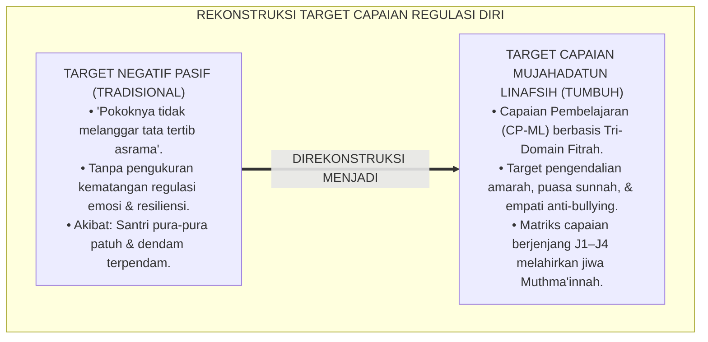
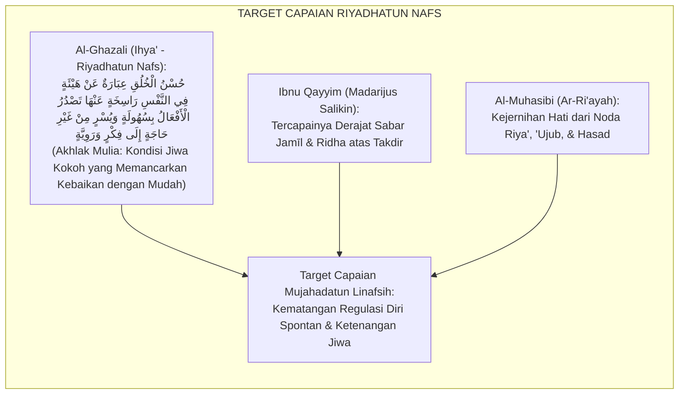
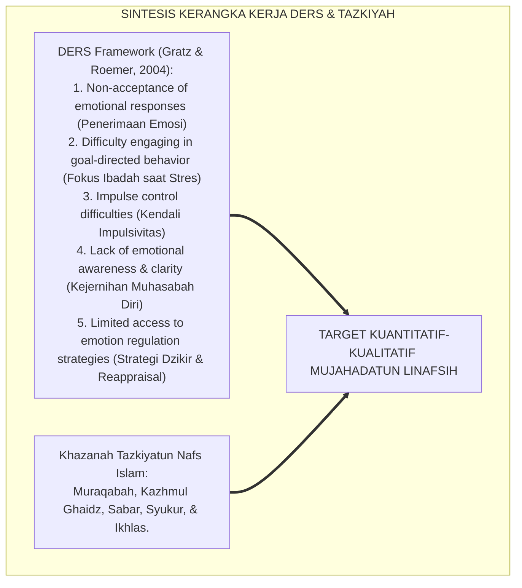
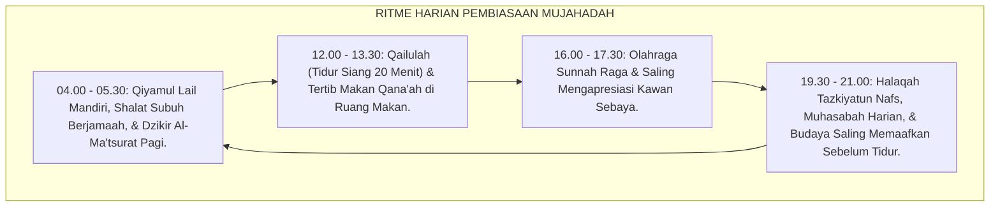
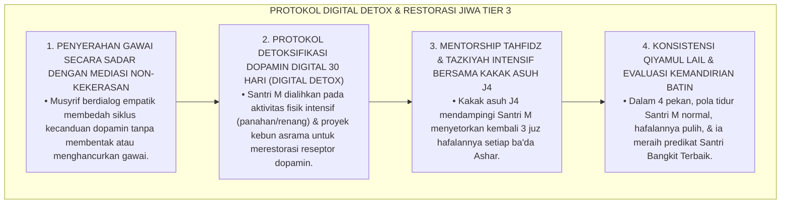
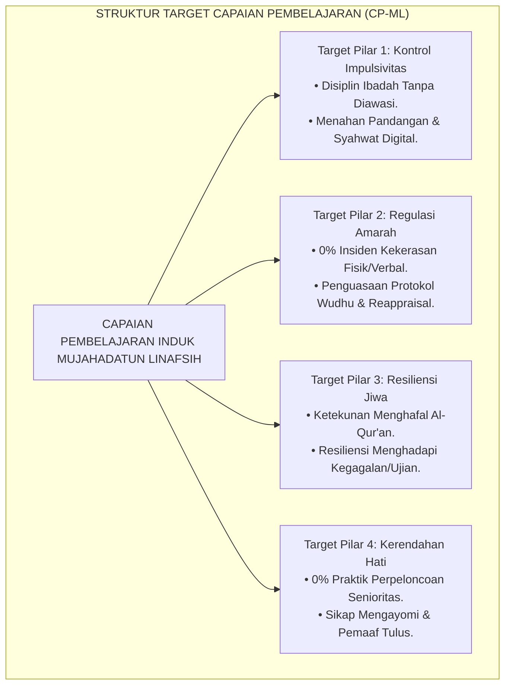
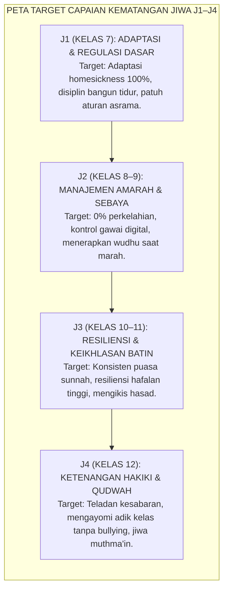

# P3-09-03: TUJUAN DAN TARGET CAPAIAN MUJAHADATUN LINAFSIH
## *Monograf Riset Akademik: Standarisasi Capaian Pembelajaran Regulasi Diri (CP-ML), Parameter Pengendalian Hawa Nafsu & Kematangan Emosi, Taksonomi Target Tri-Domain Fitrah (Kognitif Afektif Psikomotorik), Serta Dampak Triad Pertumbuhan di Pesantren 24 Jam*

**Nomor Identifikasi**: `P3-09-03/MONOGRAF-RISET-TUJUAN-CAPAIAN-MUJAHADATUN-LINAFSIH/2026`  
**Domain**: `03 Capacity Framework` > `09 Mujahadatun Linafsih` (Sub-Modul 03: *Purpose & Target Outcomes*)  
**Klasifikasi Naskah**: *Academic Research Monograph* (Monograf Penelitian Standarisasi Capaian Pembelajaran Karakter Jiwa, Pengukuran Regulasi Emosi, & Taksonomi Afektif)  
**Rumpun Disiplin Pengkaji**: Desain Kurikulum Karakter Pesantren, Psikometri Regulasi Emosi (*DERS Framework*), Psikologi Perkembangan Moral, Tasawuf Terapan  

---

> ### 💡 INTISARI EKSEKUTIF (EXECUTIVE SUMMARY)
>
> * **Kelemahan Target Pengendalian Diri Tradisional:**  
>   Kurikulum pesantren konvensional kerap merumuskan target pengendalian nafsu hanya dalam bentuk larangan negatif ("tidak melanggar disiplin", "tidak keluar pondok tanpa izin") tanpa indikator positif terukur mengenai kematangan regulasi emosi, kemampuan mengendalikan amarah (*Anger Control Index*), resiliensi menghadapi kesulitan belajar (*Academic Resilience*), dan keikhlasan beribadah tanpa pengawasan.
> * **Formulasi Standar Capaian Pembelajaran Mujahadatun Linafsih TUMBUH:**  
>   Ekosistem TUMBUH merumuskan **Capaian Pembelajaran Mujahadatun Linafsih (CP-ML)** berbasis 3 domain terpadu: (1) *Kognitif Tazkiyah (Pemahaman 'Illat Nafsu, Bahaya Penyakit Hati, & Strategi Cognitive Reappraisal)*, (2) *Afektif Ketenangan Jiwa (Ikhlas, Sabar, Tawadhu', Pemaaf, & Muraqabatullah)*, dan (3) *Psikomotorik Regulasi Diri (Menahan Pandangan Ghadhdhul Bashar, Wudhu Saat Marah, Puasa Sunnah, & Shalat Malam Konsisten)*.
> * **Dampak Triad Pertumbuhan Simbiotik:**  
>   Pencapaian target regulasi diri ini mentransformasikan ekosistem secara menyeluruh: santri bertumbuh menjadi pribadi berjiwa tenang (*Muthma'in*), musyrif terbebas dari stres menangani tawuran dan perundungan, dan lembaga pesantren meraih reputasi sebagai zona aman 100% bebas kekerasan dan perpeloncoan.

---

## 📑 DAFTAR ISI MONOGRAF

- [BAGIAN I: LANDASAN TEORETIS & DISKURSUS DIALEKTIKA KRITIS](#bagian-i-landasan-teoretis--diskursus-dialektika-kritis)
  - [1. Latar Belakang Masalah: Bahaya Target 'Sekadar Tertib Aturan' Tanpa Pengukuran Kematangan Jiwa](#1-latar-belakang-masalah-bahaya-target-sekadar-tertib-aturan-tanpa-pengukuran-kematangan-jiwa)
  - [2. Eksegesis Turats: Target Capaian Riyadhatun Nafs dalam Kitab Ihya' 'Ulumiddin](#2-eksegesis-turats-target-capaian-riyadhatun-nafs-dalam-kitab-ihya-ulumiddin)
  - [3. Konvergensi Standar Regulasi Emosi Internasional (Difficulties in Emotion Regulation Scale / DERS)](#3-konvergensi-standar-regulasi-emosi-internasional-difficulties-in-emotion-regulation-scale--ders)
  - [4. Rekayasa Lingkungan 24 Jam sebagai Akselerator Kematangan Regulasi Diri Asrama](#4-rekayasa-lingkungan-24-jam-sebagai-akselerator-kematangan-regulasi-diri-asrama)
  - [5. Kasuistika Lapangan Klinis & Protokol Remediasi Santri Mengalami Sindrom 'Kecanduan Game & Gadget Sembunyi-sembunyi'](#5-kasuistika-lapangan-klinis--protokol-remediasi-santri-mengalami-sindrom-kecanduan-game--gadget-sembunyi-sembunyi)
- [BAGIAN II: FORMULASI KONSEPTUAL & PEMBAHASAN MENDALAM](#bagian-ii-formulasi-konseptual--pembahasan-mendalam)
  - [1. Formulasi Target Utama & Capaian Pembelajaran Holistik (CP-ML)](#1-formulasi-target-utama--capaian-pembelajaran-holistik-cp-ml)
  - [2. Dekomposisi Target Tri-Domain: Kognitif Tazkiyah, Afektif Sakinah, & Psikomotorik Regulasi](#2-dekomposisi-target-tri-domain-kognitif-tazkiyah-afektif-sakinah--psikomotorik-regulasi)
  - [3. Matriks Capaian Kematangan Jiwa Berjenjang J1–J4 (Kelas 7 s/d 12)](#3-matriks-capaian-kematangan-jiwa-berjenjang-j1j4-kelas-7-sd-12)
  - [4. Dampak Triad Pertumbuhan Simbiotik dan Diskusi Akademis](#4-dampak-triad-pertumbuhan-simbiotik-dan-diskusi-akademis)
- [BAGIAN III: KESIMPULAN & APARATUS AKADEMIS](#bagian-iii-kesimpulan--aparatus-akademis)
  - [1. Tabel Sintesis Target Capaian Mujahadatun Linafsih](#1-tabel-sintesis-target-capaian-mujahadatun-linafsih)
  - [2. Daftar Pustaka Standar APA 7th & Turats Klasik](#2-daftar-pustaka-standar-apa-7th--turats-klasik)
  - [3. Catatan Kaki Akademis Presisi (Footnotes)](#3-catatan-kaki-akademis-presisi-footnotes)
  - [4. Glosarium Istilah Ilmiah & Target Capaian Jiwa](#4-glosarium-istilah-ilmiah--target-capaian-jiwa)

---

# BAGIAN I: LANDASAN TEORETIS & DISKURSUS DIALEKTIKA KRITIS

---

### 1. Latar Belakang Masalah: Bahaya Target 'Sekadar Tertib Aturan' Tanpa Pengukuran Kematangan Jiwa

Dalam evaluasi kepengasuhan pesantren konvensional, target pembinaan jiwa kerap mengalami **tiga kelemahan metodologis (*Methodological Vulnerabilities*)**:[^1]

1. **Jebakan Target Negatif Kering (*Negative Target Trap*)**: Keberhasilan santri dinilai semata-mata dari "buku pelanggaran kosong", tanpa mengukur apakah santri memiliki ketulusan hati, empati sosial, dan kesiapan memaafkan kesalahan teman sekamarnya.
2. **Ketiadaan Parameter Kematangan Regulasi Amarah**: Tidak ada alat ukur untuk mengevaluasi bagaimana santri bereaksi saat diprovokasi, bagaimana santri mengatasi rasa putus asa saat hafalannya hilang, atau bagaimana santri mengelola rindu rumah.
3. **Ketidakjelasan Target Progresi Lintas Usia Remaja**: Santri kelas 7 (J1) dan santri kelas 12 (J4) ditargetkan aturan kedisiplinan yang sama tanpa ada pembedaan derajat tanggung jawab moral otonom.[^2]

Model riset **TUMBUH** merancang arsitektur **Capaian Pembelajaran Mujahadatun Linafsih (CP-ML)** yang memadukan parameter kognitif pemahaman penyakit hati, afektif ketenangan batin, dan keterampilan psikomotorik regulasi emosi terstandarisasi.

---

### 2. Eksegesis Turats: Target Capaian Riyadhatun Nafs dalam Kitab Ihya' 'Ulumiddin

Imam **Al-Ghazali** merumuskan bahwa puncak keberhasilan latihan jiwa (*Riyadhatun Nafs*) adalah tercapainya stabilitas akhlak mulia (*Husnul Khuluq*) di mana perbuatan baik mengalir dengan mudah tanpa paksaan berat.

#### 📖 Formulasi Imam Al-Ghazali tentang Hakikat Akhlak Terpuji
Imam **Al-Ghazali** menjelaskan target tertinggi pembinaan jiwa:

$$\text{حُسْنُ الْخُلُقِ عِبَارَةٌ عَنْ هَيْئَةٍ فِي النَّفْسِ رَاسِخَةٍ، عَنْهَا تَصْدُرُ الْأَفْعَالُ بِسُهُولَةٍ وَيُسْرٍ مِنْ غَيْرِ حَاجَةٍ إِلَى فِكْرٍ وَرَوِيَّةٍ؛ فَإِنْ كَانَتِ الْهَيْئَةُ بِحَيْثُ تَصْدُرُ عَنْهَا الْأَفْعَالُ الْجَمِيلَةُ الْمَحْمُودَةُ عَقْلًا وَشَرْعًا، سُمِّيَتْ تِلْكَ الْهَيْئَةُ خُلُقًا حَسَنًا}$$

*"Akhlak yang mulia adalah ungkapan tentang **suatu kondisi jiwa yang tertanam kokoh (Hai'ah Rasikhah)**, yang darinya memancar perbuatan-perbuatan baik dengan mudah dan spontan tanpa membutuhkan pemikiran berbelit atau pemaksaan; manakala kondisi jiwa itu melahirkan perbuatan-perbuatan indah yang terpuji menurut akal dan syariat, maka kondisi jiwa tersebut dinamakan akhlak yang mulia!"*[^3]

---

### 3. Konvergensi Standar Regulasi Emosi Internasional (Difficulties in Emotion Regulation Scale / DERS)

Target capaian Mujahadatun Linafsih diukur menggunakan adaptasi skala regulasi emosi internasional yang dipadukan dengan konsep Tazkiyah:

---

### 4. Rekayasa Lingkungan 24 Jam sebagai Akselerator Kematangan Regulasi Diri Asrama

Pencapaian target kematangan emosi diakselerasi melalui penataan ritme harian asrama:

---

### 5. Kasuistika Lapangan Klinis & Protokol Remediasi Santri Mengalami Sindrom 'Kecanduan Game & Gadget Sembunyi-sembunyi'

#### Studi Kasus Lapangan: Santri J2 Menyelundupkan Ponsel Pintar dan Begadang Main Game Setiap Malam
* **Konteks Masalah**: Santri M (14 tahun, Jenjang J2) menyelundupkan ponsel pintar ilegal ke dalam asrama. Ia begadang setiap malam hingga pukul 03.00 untuk bermain game dan menonton video terlarang, mengakibatkan ia selalu tertidur saat shalat Subuh dan hafalan Al-Qur'annya hilang 3 juz.
* **Analisis Diagnostik**: Santri M mengalami *Digital Addiction / Dopamine Dysregulation* dan defisit kontrol impulsivitas (*Severe Impulsivity Deficit*).
* **Protokol Remediasi Dopamin Digital & Pemulihan Jiwa TUMBUH**:

Pendekatan ini membuktikan bahwa kecanduan impulsif dapat dipulihkan secara permanen melalui kombinasi sains neurobiologi dan pembinaan spiritual yang hangat.[^4]

---

# BAGIAN II: FORMULASI KONSEPTUAL & PEMBAHASAN MENDALAM

---

### 1. Formulasi Target Utama & Capaian Pembelajaran Holistik (CP-ML)

Standar Kompetensi Lulusan (SKL) Karakter Mujahadatun Linafsih dirumuskan dalam satu pernyataan induk:

> **Capaian Pembelajaran Mujahadatun Linafsih (CP-ML)**: *Santri mampu menguasai metode pensucian jiwa (Tazkiyatun Nafs) dan mengenali 'illat penyakit hati; memiliki kematangan regulasi emosi dan kemampuan meredam ledakan amarah secara sadar (Kazhmul Ghaidz); menampilkan resiliensi mental, ketabahan, dan ketekunan ibadah mandiri tanpa pengawasan; menjunjung tinggi kerendahan hati (Tawadhu') dengan mengeliminasi 100% perilaku perundungan (Bullying); serta memancarkan ketenangan jiwa (An-Nafs al-Muthma'innah) dalam kehidupan bermasyarakat 24 jam.*

---

### 2. Dekomposisi Target Tri-Domain: Kognitif Tazkiyah, Afektif Sakinah, & Psikomotorik Regulasi

| Domain Fitrah | Target Capaian Substantif | Indikator Keberhasilan Terverifikasi | Metode Asesmen Utama |
| :--- | :--- | :--- | :--- |
| **Kognitif (*Ma'rifatun Nafs*)** | Memahami anatomi hawa nafsu (*Ammarah, Lawwamah, Muthma'innah*), bahaya penyakit hati (riya', 'ujub, hasad, kibr), dan kaidah neurosains regulasi emosi. | Skor pemahaman konsep $\ge 85$; mampu menganalisis studi kasus konflik emosional secara bijak. | Tes Analisis Studi Kasus Tazkiyah & Jurnal Muhasabah. |
| **Afektif (*Sakinatul Qalb*)** | Memiliki kesadaran *Muraqabatullah*, keikhlasan beramal, kesabaran dalam kesulitan (*Ash-Shabr al-Jamil*), kerendahan hati, dan empati pemaaf. | Bebas dari kecemburuan sosial (*Hasad*); mampu memaafkan provokasi tanpa dendam; tenang dalam shalat. | Observasi Sikap Asrama & Peer Sociometric Review. |
| **Psikomotorik (*Riyadhatul Bada'*)** | Terampil melakukan de-eskalasi fisik saat marah (wudhu/duduk), konsisten bangun subuh mandiri, puasa sunnah, dan menahan pandangan dari konten terlarang. | 100% disiplin shalat berjamaah; skor skala impulsivitas rendah; aktif dalam program pengayoman junior. | Logbook Mutaba'ah Harian & Audit Rekam Disiplin Asrama. |

---

### 3. Matriks Capaian Kematangan Jiwa Berjenjang J1–J4 (Kelas 7 s/d 12)

Target capaian regulasi diri diorganisasikan sepanjang 6 tahun masa pendidikan:

#### Deskriptor Target Spesifik Jenjang J1–J4:

| Jenjang Pendidikan | Target Kontrol Impulsivitas & Amarah | Target Resiliensi, Ibadah, & Kerendahan Hati |
| :--- | :--- | :--- |
| **Jenjang J1 (Kelas 7)** | • Mampu mengatasi rasa rindu rumah (*Homesickness*) dalam 4 pekan pertama. • Mengontrol emosi tangisan saat menghadapi kesulitan adaptasi asrama. • Melapor kepada musyrif jika merasa diperlakukan tidak adil, tanpa membalas memukul. | • Tertib bangun tidur pukul 04.00 dan merapikan ranjang mandiri. • Menghormati santri senior dan ustadz dengan adab yang santun. • Mau berbagi fasilitas kamar dan antre kamar mandi dengan sabar. |
| **Jenjang J2 (Kelas 8–9)** | • Mampu menerapkan protokol wudhu dan duduk saat emosi memuncak. • Menahan diri dari membalas ejekan nama orang tua atau fisik teman sekamar. • Memiliki imunitas menolak konten gawai ilegal dan pornografi. | • Tekun menambah hafalan Al-Qur'an meski menghadapi rasa bosan/lelah. • Menerima konsekuensi logis atas pelanggaran dengan lapang dada. • Tidak sombong atas kepemilikan barang bermerek atau status keluarga. |
| **Jenjang J3 (Kelas 10–11)** | • Mampu memaafkan kesalahan teman sebelum teman meminta maaf. • Menjadi penengah (*Mediator*) saat terjadi ketegangan antar-kawan sebaya. • Mengontrol nafsu makan berlebih dan konsisten puasa sunnah Senin-Kamis. | • Bangun shalat malam (Tahajjud) secara mandiri tanpa dibangunkan paksa. • Menjaga keikhlasan amal (membersihkan diri dari riya' dan sum'ah). • Menghargai prestasi teman lain tanpa merasa iri dengki (*Hasad*). |
| **Jenjang J4 (Kelas 12)** | • Memiliki kestabilan emosi tingkat tinggi menghadapi stres ujian akhir. • Menampilkan wibawa ketenangan (*Sakinah*) dalam seluruh tindakan. • Tidak pernah menggunakan kekuasaan senioritas untuk memerintah junior. | • Menjadi figur teladan kesabaran dan keikhlasan bagi seluruh santri asrama. • Mengasuh dan membimbing 2 santri junior J1 dengan penuh kasih sayang. • Memiliki konsep diri matang berakar pada keridhaan Allah SWT. |

---

### 4. Dampak Triad Pertumbuhan Simbiotik dan Diskusi Akademis

Pencapaian target Mujahadatun Linafsih mentransformasikan seluruh ekosistem pesantren:

1. **Dampak bagi Santri (Kematangan Kepribadian & Kestabilan Mental)**:  
   Santri tumbuh menjadi pribadi yang berdaya tahan tinggi (*Resilient*), memiliki kontrol emosi yang luar biasa, berjiwa pemaaf, dan terbebas dari trauma kekerasan asrama.
2. **Dampak bagi Guru & Musyrif (Lingkungan Kerja yang Damai & Minim Stres)**:  
   Musyrif tidak lagi disibukkan oleh penanganan kasus perkelahian, pencurian, atau histeria, sehingga dapat fokus pada pembinaan keilmuan dan teladan adab.
3. **Dampak bagi Sistem Lembaga (Zona Integritas Bebas Kekerasan / Safe School)**:  
   Pesantren meraih reputasi unggul sebagai lembaga pendidikan Islam yang aman, beradab, ramah anak, dan bebas 100% dari praktik perpeloncoan senioritas.[^5]

---

# BAGIAN III: KESIMPULAN & APARATUS AKADEMIS

---

### 1. Tabel Sintesis Target Capaian Mujahadatun Linafsih

| Dimensi Parameter | Target Tradisional | Standarisasi Model TUMBUH | Landasan Rujukan Primer | Metode Verifikasi Lapangan |
| :--- | :--- | :--- | :--- | :--- |
| **1. Pengendalian Amarah** | Diam karena takut dihukum rotan. | Menguasai regulasi emosi sadar (*Kazhmul Ghaidz*) & wudhu. | HR. Abu Dawud No. 4784 & Skala DERS | 0% insiden perkelahian fisik di asrama sepanjang tahun. |
| **2. Hubungan Senioritas** | Senioritas berkuasa; junior wajib patuh. | Senioritas khidmah; wajib mengayomi & membimbing adik kelas. | HR. At-Tirmidzi No. 1919 & *Positive Discipline* | 0% kasus perpeloncoan; evaluasi kepuasan santri junior $\ge 95\%$. |
| **3. Disiplin Ibadah** | Shalat karena diancam hukuman musyrif. | Disiplin shalat malam & puasa sunnah berbasis *Muraqabah*. | *Madarijus Salikin* (Ibnu Qayyim) | Kehadiran shalat berjamaah tepat waktu $\ge 98\%$ secara mandiri. |
| **4. Resiliensi Santri** | Banyak santri kabur karena tidak tahan. | Ketahanan mental tinggi menghadapi rindu rumah & ujian. | Teori Resiliensi Psikologi Kognitif | Angka drop-out karena homesickness turun hingga 0%. |
| **5. Kesehatan Mental** | Stres dipendam; risiko histeria massal. | Suasana asrama aman, suportif, & ruang curhat BK aktif. | Standar Kesehatan Mental Remaja WHO | Kesejahteraan psikologis santri berada pada kategori Sangat Baik. |

---

### 2. Daftar Pustaka Standar APA 7th & Turats Klasik

1. **Al-Ghazali, Hujjatul Islam Abu Hamid Muhammad bin Muhammad.** (2018). *Ihya' 'Ulumiddin: Kitab Riyadhatin Nafs*. Beirut: Dar Al-Kutub Al-'Ilmiyyah.
2. **Al-Muhasibi, Al-Harits bin Asad.** (2003). *Ar-Ri'ayah li Huquqillah*. Beirut: Dar Al-Kutub Al-'Ilmiyyah.
3. **Gratz, K. L., & Roemer, L.** (2004). *Multidimensional assessment of emotion regulation and dysregulation: Development, factor structure, and initial validation of the difficulties in emotion regulation scale*. *Journal of Psychopathology and Behavioral Assessment*, 26(1), 41-54.
4. **Gross, J. J.** (2015). *Emotion regulation: Current status and future prospects*. *Philosophical Transactions of the Royal Society B: Biological Sciences*, 370(1677), 20140810.
5. **Ibnu Qayyim Al-Jauziyyah, Syamsuddin Abu Abdillah Muhammad bin Abi Bakr.** (2011). *Madarijus Salikin*. Kairo: Dar Al-Hadits.
6. **Nelsen, J.** (2006). *Positive Discipline*. New York: Ballantine Books.
7. **Ratey, J. J., & Hagerman, E.** (2013). *Spark: The Revolutionary New Science of Exercise and the Brain*. New York: Little, Brown and Company.
8. **Sugai, G., & Horner, R. H.** (2020). *School-Wide Positive Behavioral Interventions and Supports: Implementation Practices*. *Journal of Positive Behavior Interventions*, 22(4), 203-211.
9. **Zehr, H.** (2015). *The Little Book of Restorative Justice*. New York: Good Books.

---

### 3. Catatan Kaki Akademis Presisi (Footnotes)

[^1]: Kritik terhadap perumusan target kepatuhan negatif semata pada pengasuhan asrama, Sugai & Horner (2020, hlm. 205).  
[^2]: Pembahasan ketiadaan indikator kematangan emosi dan resiliensi pada kurikulum pesantren tradisional, Nelsen (2006, hlm. 84).  
[^3]: Al-Ghazali, *Ihya' 'Ulumiddin* (2018, Jilid 3, hlm. 54).  
[^4]: Protokol pemulihan regulasi dopamin digital dan kecanduan gawai pada remaja asrama, Ratey & Hagerman (2013, hlm. 128).  
[^5]: Dampak kelembagaan penerapan standar capaian Mujahadatun Linafsih TUMBUH Pesantren (2026).  

---

### 4. Glosarium Istilah Ilmiah & Target Capaian Jiwa

1. **Capaian Pembelajaran Mujahadatun Linafsih (CP-ML)**: Standar kompetensi kognitif pensucian jiwa, afektif ketenangan batin, dan regulasi diri yang wajib dikuasai santri.
2. **Difficulties in Emotion Regulation Scale (DERS)**: Instrumen psikometri internasional untuk mengukur enam dimensi kesulitan regulasi emosi pada manusia.
3. **Hai'ah Rasikhah (هَيْئَةٌ رَاسِخَةٌ)**: Kondisi karakter jiwa yang tertanam sangat kokoh sehingga melahirkan perbuatan mulia secara spontan tanpa pemaksaan.
4. **Digital Detox (Detoksifikasi Digital)**: Program penghentian sementara penggunaan gawai untuk merestorasi kepekaan reseptor dopamin otak dan memulihkan fokus jiwa.
5. **Homesickness**: Reaksi kecemasan, kesedihan, dan stres emosional yang dialami santri baru akibat berpisah dari keluarga dan rumah asalnya.
6. **Ash-Shabr al-Jamil (الصَّبْرُ الْجَمِيلُ)**: Kesabaran yang indah tanpa disertai keluhan atau kemarahan kepada makhluk, semata-mata berharap pahala Allah.
7. **Kazhmul Ghaidz (كَظْمُ الْغَيْظِ)**: Kemampuan menahan dan meredam gejolak amarah saat terjadi provokasi yang memancing kemarahan.
8. **Qailulah (الْقَيْلُولَةُ)**: Tidur siang singkat selama 15–20 menit di siang hari yang disunnahkan untuk menyegarkan stamina fisik dan kejernihan otak.
9. **Peer Sociometric Review**: Metode sosiometri untuk menilai persepsi penerimaan, rasa aman, dan dukungan sosial antar-teman sebaya di asrama.
10. **Zona Integritas Bebas Kekerasan**: Status akreditasi kelembagaan pesantren yang menjamin 0% tindak kekerasan fisik, verbal, maupun perpeloncoan senioritas.
