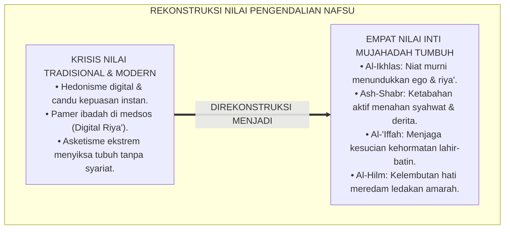
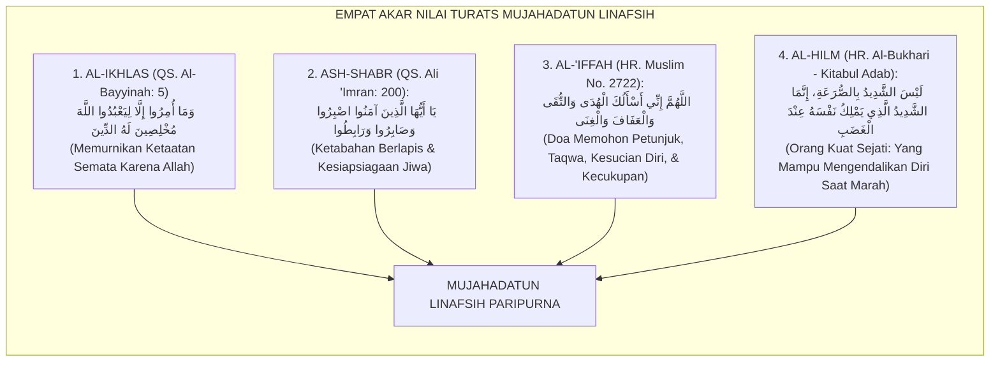
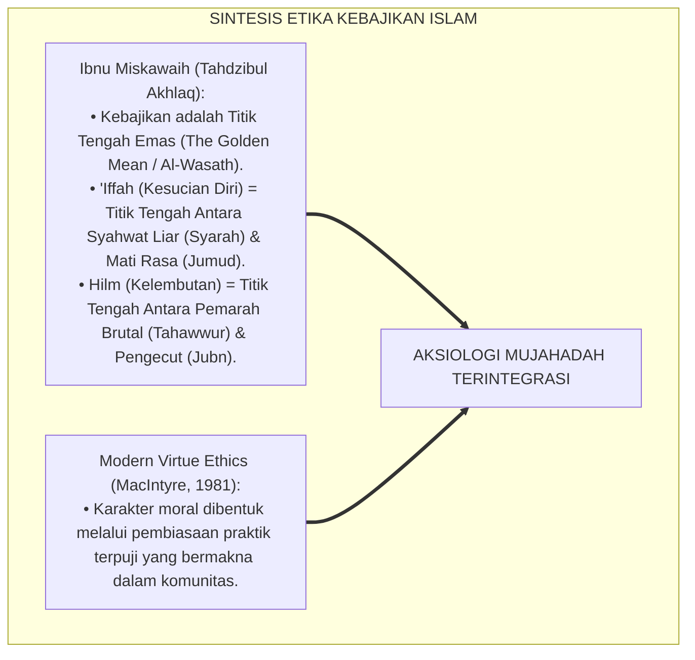
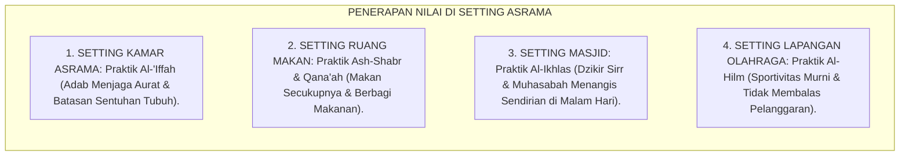
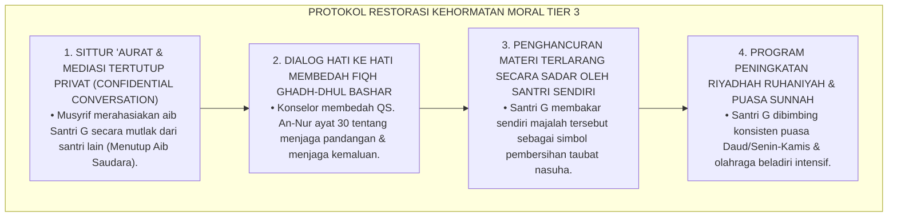
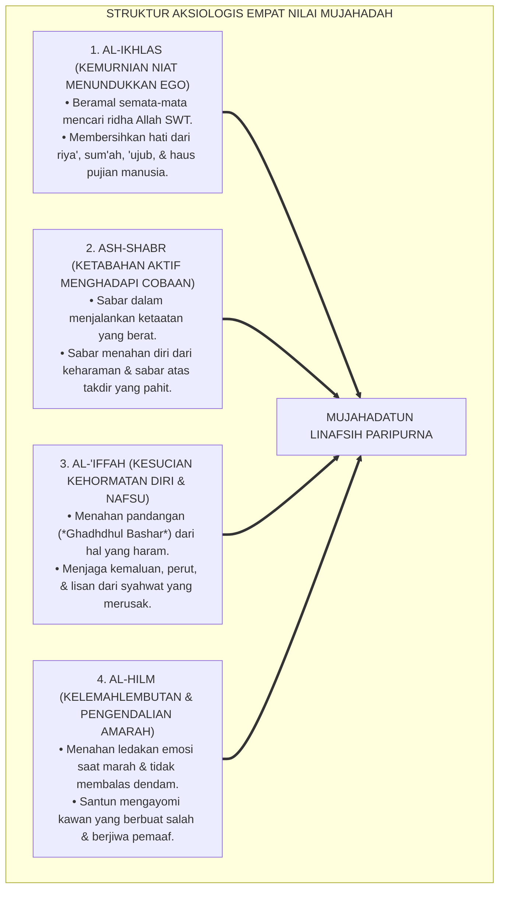
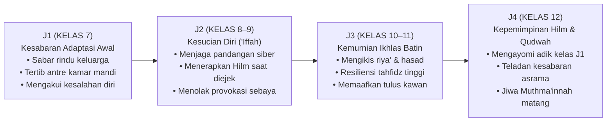

# P3-09-04: NILAI INTI DAN PRINSIP MUJAHADATUN LINAFSIH
## *Monograf Riset Akademik: Aksiologi Pengendalian Diri dalam Islam, Empat Nilai Inti Mujahadah (Al-Ikhlas, Ash-Shabr, Al-'Iffah, & Al-Hilm), Dialektika Nilai Sejati vs Asketisme Ekstrem/Hedonisme Modern, Serta Pembentukan Pribadi Berkarakter Kokoh di Pesantren 24 Jam*

**Nomor Identifikasi**: `P3-09-04/MONOGRAF-RISET-NILAI-PRINSIP-MUJAHADATUN-LINAFSIH/2026`  
**Domain**: `03 Capacity Framework` > `09 Mujahadatun Linafsih` (Sub-Modul 04: *Core Values & Mujahadah Principles*)  
**Klasifikasi Naskah**: *Academic Research Monograph* (Monograf Penelitian Aksiologi Tasawuf Islam, Etika Kebajikan Moral, & Filsafat Nilai Pengendalian Diri)  
**Rumpun Disiplin Pengkaji**: Aksiologi Akhlaq Islam, Filsafat Moral Tasawuf, Etika Kebajikan (*Virtue Ethics*), Sosiologi Nilai Asrama Pesantren  

---

> ### 💡 INTISARI EKSEKUTIF (EXECUTIVE SUMMARY)
>
> * **Krisis Nilai & Polarisasi Pengendalian Diri di Era Modern:**  
>   Generasi santri kontemporer menghadapi dua tarikan kutub ekstrem yang merusak jiwa: (1) *Hedonisme & Permisivisme Digital Modern* yang menuntut pemenuhan nafsu instan tanpa batas (*Instant Gratification Culture*), dan (2) *Asketisme Ekstrem Jahil* yang menyiksa raga tanpa ilmu dan mengabaikan hak-hak biologis tubuh secara tidak syar'i.
> * **Empat Nilai Inti Mujahadatun Linafsih TUMBUH:**  
>   Ekosistem TUMBUH menetapkan **Empat Nilai Inti Pengendalian Diri (*Al-Qiyam al-Arba'ah lil-Mujahadah*)**: (1) *Al-Ikhlas* (Kemurnian Niat Menundukkan Riya' & Haus Pengakuan), (2) *Ash-Shabr* (Ketabahan Aktif Menghadapi Godaan Syahwat & Kesulitan), (3) *Al-'Iffah* (Penjagaan Kesucian Moral dari Hawa Nafsu Rendah), dan (4) *Al-Hilm* (Kelemahlembutan & Pengendalian Amarah Saat Memiliki Kuasa).
> * **Harmonisasi Nilai dalam Triad Pertumbuhan:**  
>   Nilai-nilai ini menuntun santri menjadi pribadi yang tangguh dan tenang, melindungi musyrif dari arogansi kekuasaan dan kekerasan emosional, serta menegakkan kultur asrama yang penuh kasih sayang dan saling memuliakan martabat kemanusiaan.

---

## 📑 DAFTAR ISI MONOGRAF

- [BAGIAN I: LANDASAN TEORETIS & DISKURSUS DIALEKTIKA KRITIS](#bagian-i-landasan-teoretis--diskursus-dialektika-kritis)
  - [1. Latar Belakang Masalah: Bahaya Hedonisme Instan Digital vs Asketisme Ekstrem Menyiksa Raga](#1-latar-belakang-masalah-bahaya-hedonisme-instan-digital-vs-asketisme-ekstrem-menyiksa-raga)
  - [2. Eksegesis Turats: Kajian Mendalam Empat Pilar Nilai Mujahadah Salafush Shalih](#2-eksegesis-turats-kajian-mendalam-empat-pilar-nilai-mujahadah-salafush-shalih)
  - [3. Konvergensi Sains Etika Kebajikan (Virtue Ethics) & Teori Karakter Aristotelian-Islam](#3-konvergensi-sains-etika-kebajikan-virtue-ethics--teori-karakter-aristotelian-islam)
  - [4. Analisis Rekayasa Ekologi Nilai 24 Jam: Dari Ruang Kelas Menuju Ruang Privat Kamar Asrama](#4-analisis-rekayasa-ekologi-nilai-24-jam-dari-ruang-kelas-menuju-ruang-privat-kamar-asrama)
  - [5. Kasuistika Lapangan Klinis & Protokol Restoratif Pelanggaran Nilai Kesucian Moral ('Iffah)](#5-kasuistika-lapangan-klinis--protokol-restoratif-pelanggaran-nilai-kesucian-moral-iffah)
- [BAGIAN II: FORMULASI KONSEPTUAL & PEMBAHASAN MENDALAM](#bagian-ii-formulasi-konseptual--pembahasan-mendalam)
  - [1. Eksplanasi Teoretis Empat Nilai Inti Mujahadatun Linafsih](#1-eksplanasi-teoretis-empat-nilai-inti-mujahadatun-linafsih)
  - [2. Matriks Dialektika: Membedakan Nilai Pengendalian Diri Sejati vs Distorsi Ekstrem](#2-matriks-dialektika-membedakan-nilai-pengendalian-diri-sejati-vs-distorsi-ekstrem)
  - [3. Matriks Progresi Internalisasi Nilai Mujahadah Jenjang J1–J4](#3-matriks-progresi-internalisasi-nilai-mujahadah-jenjang-j1j4)
  - [4. Diskusi Akademis: Implikasi Aksiologis bagi Pembentukan Kultur Asrama Penuh Keberkahan](#4-diskusi-akademis-implikasi-aksiologis-bagi-pembentukan-kultur-asrama-penuh-keberkahan)
- [BAGIAN III: KESIMPULAN & APARATUS AKADEMIS](#bagian-iii-kesimpulan--aparatus-akademis)
  - [1. Tabel Sintesis Nilai Inti & Prinsip Mujahadatun Linafsih](#1-tabel-sintesis-nilai-inti--prinsip-mujahadatun-linafsih)
  - [2. Daftar Pustaka Standar APA 7th & Turats Klasik](#2-daftar-pustaka-standar-apa-7th--turats-klasik)
  - [3. Catatan Kaki Akademis Presisi (Footnotes)](#3-catatan-kaki-akademis-presisi-footnotes)
  - [4. Glosarium Istilah Ilmiah & Aksiologi Mujahadah](#4-glosarium-istilah-ilmiah--aksiologi-mujahadah)

---

# BAGIAN I: LANDASAN TEORETIS & DISKURSUS DIALEKTIKA KRITIS

---

### 1. Latar Belakang Masalah: Bahaya Hedonisme Instan Digital vs Asketisme Ekstrem Menyiksa Raga

Dalam kehidupan santri era digital, terjadi **tiga krisis aksiologis pengendalian diri (*Axiological Crises*)**:[^1]

1. **Jebakan Hedonisme Instan & Candu Digital (*The Instant Gratification Trap*)**: Akses informasi tanpa batas memicu keinginan memuaskan hasrat secara instan (makanan cepat saji, scrolling media sosial berjam-jam, game online), mengikis daya tahan santri dalam menjalani proses belajar yang panjang.
2. **Krisis Keikhlasan Akibat Fenomena 'Pamer Ibadah' (*Digital Riya'*)**: Perilaku memamerkan hafalan Al-Qur'an, shalat tahajjud, atau tangisan taubat di media sosial demi mendapatkan *likes* dan pujian, menghancurkan nilai keikhlasan batin.
3. **Ekstremisme Asketik Tanpa Dasar Ilmu**: Sebagian santri memaksakan diri tidak tidur berhari-hari atau tidak makan menu bergizi dengan anggapan "agar cepat sakti / cepat hafal", yang berakhir pada kerusakan lambung dan kegagalan studi.[^2]

Model riset **TUMBUH** merekonstruksi aksiologi nilai: **Mujahadah sejati adalah jalan pertengahan (*Al-Wasathiyyah*) yang menyatukan pembersihan hati, keteguhan menahan syahwat, kelembutan mengelola amarah, dan penjagaan hak-hak fisik tubuh secara proporsional**.

---

### 2. Eksegesis Turats: Kajian Mendalam Empat Pilar Nilai Mujahadah Salafush Shalih

Para ulama salafush shalih mencontohkan integrasi empat pilar kebajikan jiwa dalam khazanah Islam:

#### 📖 1. Nilai Al-Ikhlas (Menundukkan Ego & Haus Pujian)
Imam **Al-Fudhail bin 'Iyadh** menegaskan hakikat keikhlasan:

$$\text{تَرْكُ الْعَمَلِ مِنْ أَجْلِ النَّاسِ رِيَاءٌ، وَالْعَمَلُ مِنْ أَجْلِ النَّاسِ شِرْكٌ، وَالْإِخْلَاصُ أَنْ يُعَافِيَكَ اللَّهُ مِنْهُمَا}$$

*"Meninggalkan suatu amal karena manusia adalah riya', beramal demi dipuji manusia adalah syirik (kecil), dan **keikhlasan sejati adalah manakala Allah menyelamatkanmu dari kedua penyakit tersebut**!"*[^3]

#### 📖 2. Nilai Al-Hilm (Kekuatan Mengendalikan Diri Saat Marah)
Rasulullah SAW bersabda menegaskan definisi pahlawan sejati:

$$\text{لَيْسَ الشَّدِيدُ بِالصُّرَعَةِ، إِنَّمَا الشَّدِيدُ الَّذِي يَمْلِكُ نَفْسَهُ عِنْدَ الْغَضَبِ}$$

*"Bukanlah orang yang kuat itu yang jago bergulat merobohkan musuh, melainkan **orang yang kuat sejati adalah orang yang mampu menguasai dan mengendalikan dirinya di saat marah memuncak!**"* (HR. Al-Bukhari No. 6114 dan Muslim No. 2609).[^4]

---

### 3. Konvergensi Sains Etika Kebajikan (Virtue Ethics) & Teori Karakter Aristotelian-Islam

Nilai-nilai Mujahadatun Linafsih menyelaraskan teori kebajikan moral (*Virtue Ethics*) Ibnu Miskawaih dan Al-Ghazali:

---

### 4. Analisis Rekayasa Ekologi Nilai 24 Jam: Dari Ruang Kelas Menuju Ruang Privat Kamar Asrama

Internalisasi nilai dihidupkan melalui penataan aturan spasial yang penuh adab:

---

### 5. Kasuistika Lapangan Klinis & Protokol Restoratif Pelanggaran Nilai Kesucian Moral ('Iffah)

#### Studi Kasus Lapangan: Santri J3 Kedapatan Menyimpan Foto Tidak Senonoh di Dalam Loker Kamar
* **Konteks Masalah**: Santri G (16 tahun, Jenjang J3) kedapatan menyimpan majalah/foto yang melanggar batas kesucian (*Breach of 'Iffah*). Musyrif kamar yang menemukan barang tersebut berniat mempermalukannya di depan seluruh santri saat apel pagi.
* **Analisis Diagnostik**: Santri G mengalami godaan syahwat pubertas remaja (*Adolescent Sexual Impulsivity*). Tindakan mempermalukannya di depan umum (*Public Shaming*) akan menghancurkan martabat dirinya dan memicu perilaku memberontak yang lebih destruktif.
* **Protokol Resolusi Restoratif Menjaga Kehormatan TUMBUH**:

Dalam waktu 4 pekan, kehormatan moral Santri G pulih sepenuhnya, ia sangat bersyukur karena aibnya ditutup oleh musyrif, dan ia menjadi santri yang sangat menjaga pandangan matanya.[^5]

---

# BAGIAN II: FORMULASI KONSEPTUAL & PEMBAHASAN MENDALAM

---

### 1. Eksplanasi Teoretis Empat Nilai Inti Mujahadatun Linafsih

Empat nilai inti mujahadah diartikulasikan secara terperinci:

---

### 2. Matriks Dialektika: Membedakan Nilai Pengendalian Diri Sejati vs Distorsi Ekstrem

| Nilai Inti Syar'i | Nilai Sejati (*Al-Wasathiyyah*) | Distorsi Berlebih (*Al-Ghuluww / Ifrath*) | Distorsi Kurang (*At-Tafrih / Tafrith*) |
| :--- | :--- | :--- | :--- |
| **Al-Ikhlas (Ketulusan)** | Beramal semata-mata mengharap ridha Allah secara tenang. | *Was-was* ekstrem yang membuat seseorang berhenti beramal karena takut riya'. | Beramal demi pamer di media sosial, riya', sum'ah, dan mencari jabatan. |
| **Ash-Shabr (Ketabahan)** | Tabah berikhtiar dan menanggung kesulitan hidup dengan ikhlas. | Sikap pasrah buta (*Fatalisme*) menerima kezaliman tanpa mau berikhtiar mengubahnya. | Cengeng, mudah putus asa, mengeluh di medsos, dan gampang menyerah. |
| **Al-'Iffah (Kesucian Diri)** | Menjaga syahwat pada batasan halal dan menjaga pandangan mata. | Mengharamkan hal yang halal (menolak makan bergizi atau membenci lawan jenis secara ekstrem). | Pergaulan bebas, pornografi, candu game online, dan gaya hidup hedonis. |
| **Al-Hilm (Kelembutan)** | Menahan amarah saat diprovokasi dan memaafkan dengan bijak. | Membiarkan kemungkaran merajalela tanpa ada rasa cemburu membela agama (*Dayyuts*). | Cepat marah (*Temperamental*), suka memukul, membanting barang, dan membalas dendam. |

---

### 3. Matriks Progresi Internalisasi Nilai Mujahadah Jenjang J1–J4

---

### 4. Diskusi Akademis: Implikasi Aksiologis bagi Pembentukan Kultur Asrama Penuh Keberkahan

Penerapan nilai-nilai mujahadah ini menghadirkan peradaban pesantren yang agung:

1. **Institusi Bebas Arogansi Senioritas (*Dignified Senior Leadership*)**: Senioritas menjadi wadah khidmah penuh kasih sayang (*Rahmatan lil-Adna*), bukan alat penindasan feodal.
2. **Kultur Saling Menjaga Aib Saudara (*Satrul 'Aurāt*)**: Santri dan musyrif saling melindungi kehormatan diri dari pencemaran nama baik, membangun ikatan kepercayaan batin yang kokoh.
3. **Penyempurnaan Kedamaian Ruhani Pesantren**: Menghadirkan ketenangan jiwa (*Sakinah*) yang membuat santri betah menuntut ilmu bertahun-tahun di asrama.[^6]

---

# BAGIAN III: KESIMPULAN & APARATUS AKADEMIS

---

### 1. Tabel Sintesis Nilai Inti & Prinsip Mujahadatun Linafsih

| Nilai Inti Parameter | Definisi Operasional TUMBUH | Landasan Nash Primer | Indikator Perilaku Kunci di Asrama | Target Jenjang Utama |
| :--- | :--- | :--- | :--- | :--- |
| **1. Al-Ikhlas** | Kemurnian niat beribadah dan beramal semata-mata mencari ridha Allah. | QS. Al-Bayyinah: 5 & Kaidah *Innamal A'malu bin Niyyat* | Shalat malam dan tilawah mandiri tanpa pamer di media sosial. | J1 s/d J4 (Mendasari Seluruh Fase) |
| **2. Ash-Shabr** | Ketabahan aktif menahan godaan syahwat dan menjalani kesulitan belajar. | QS. Ali 'Imran: 200 & *Madarijus Salikin* | Tekun menambah hafalan Al-Qur'an meski lelah; pantang putus asa. | J1 s/d J4 (Ketahanan Mental Santri) |
| **3. Al-'Iffah** | Menjaga kesucian kehormatan diri dari dorongan syahwat terlarang. | HR. Muslim No. 2722 & QS. An-Nur: 30 | Menahan pandangan (*Ghadhdhul Bashar*); adab menutup aurat di asrama. | J2 s/d J4 (Fase Pubertas Remaja) |
| **4. Al-Hilm** | Kelemahlembutan hati dan kemampuan menahan amarah saat diprovokasi. | HR. Al-Bukhari No. 6114 & *Tahdzibul Akhlaq* | Menerapkan wudhu saat marah; memaafkan teman sekamar yang salah. | J2 s/d J4 (Fokus Hubungan Sosial) |

---

### 2. Daftar Pustaka Standar APA 7th & Turats Klasik

1. **Al-Bukhari, Abu Abdillah Muhammad bin Ismail.** (2002). *Shahih Al-Bukhari*. Riyadh: Bait Al-Afkar Ad-Dauliyyah.
2. **Al-Ghazali, Hujjatul Islam Abu Hamid Muhammad bin Muhammad.** (2018). *Ihya' 'Ulumiddin: Kitab Ash-Shabr wasy-Syukr*. Beirut: Dar Al-Kutub Al-'Ilmiyyah.
3. **Al-Muhasibi, Al-Harits bin Asad.** (2003). *Ar-Ri'ayah li Huquqillah*. Beirut: Dar Al-Kutub Al-'Ilmiyyah.
4. **Ibnu Miskawaih, Abu Ali Ahmad bin Muhammad.** (2001). *Tahdzibul Akhlaq wa Tathhirul A'raq*. Kairo: Dar Al-Kutub Al-Mishriyyah.
5. **Ibnu Qayyim Al-Jauziyyah, Syamsuddin Abu Abdillah Muhammad bin Abi Bakr.** (2011). *Madarijus Salikin*. Kairo: Dar Al-Hadits.
6. **MacIntyre, A.** (1981). *After Virtue: A Study in Moral Theory*. Notre Dame: University of Notre Dame Press.
7. **Muslim bin Al-Hajjaj An-Naisaburi.** (2006). *Shahih Muslim*. Riyadh: Dar Thayyibah.
8. **Nelsen, J.** (2006). *Positive Discipline*. New York: Ballantine Books.
9. **Sugai, G., & Horner, R. H.** (2020). *School-Wide Positive Behavioral Interventions and Supports: Implementation Practices*. *Journal of Positive Behavior Interventions*, 22(4), 203-211.
10. **Zehr, H.** (2015). *The Little Book of Restorative Justice*. New York: Good Books.

---

### 3. Catatan Kaki Akademis Presisi (Footnotes)

[^1]: Kritik terhadap krisis hedonisme instan dan permisivisme digital pada remaja modern, MacIntyre (1981, hlm. 68).  
[^2]: Pembahasan larangan asketisme ekstrem penyiksaan tubuh dalam syariat Islam, Ibnu Qayyim (2011, Jilid 2, hlm. 112).  
[^3]: Diriwayatkan oleh Imam Abu Nu'aim dalam *Hilyatul Auliya'* (Jilid 8, hlm. 95) dari Al-Fudhail bin 'Iyadh.  
[^4]: HR. Al-Bukhari dalam *Shahih Al-Bukhari* (No. 6114), Kitab *Al-Adab*.  
[^5]: Protokol penanganan kasus pelanggaran kesucian moral remaja berbasis penutupan aib dan restorasi, Zehr (2015, hlm. 82).  
[^6]: Standar aksiologi dan kultur keberkahan asrama TUMBUH Pesantren (2026).  

---

### 4. Glosarium Istilah Ilmiah & Aksiologi Mujahadah

1. **Al-Wasathiyyah (الْوَسَطِيَّةُ)**: Prinsip jalan tengah yang adil dan seimbang dalam beragama, menjauhi ekstremitas berlebih (*Ghuluww*) maupun kelalaian (*Tafrih*).
2. **Al-Ikhlas (الْإِخْلَاصُ)**: Pemurnian niat dan tindakan semata-mata demi mencari ridha Allah SWT, bersih dari pamrih pujian manusia.
3. **Ash-Shabr (الصَّبْرُ)**: Ketabahan aktif menahan diri dari larangan Allah, konsisten menjalankan kewajiban, dan ridha atas ketentuan takdir-Nya.
4. **Al-'Iffah (الْعِفَّةُ)**: Penjagaan kesucian kehormatan diri dan martabat moral dari segala bentuk godaan syahwat yang diharamkan.
5. **Al-Hilm (الْحِلْمُ)**: Sifat kelemahlembutan hati, kesabaran, dan kemampuan menahan gejolak amarah saat memiliki kekuatan untuk membalas.
6. **Satrul 'Aurāt (سَتْرُ الْعَوْرَاتِ)**: Kewajiban moral menutup dan merahasiakan aib kelemahan saudara sesama muslim dari konsumsi publik.
7. **Instant Gratification**: Kecenderungan psikologis menuntut pemenuhan kepuasan hasrat secara langsung tanpa mau bersabar melalui proses.
8. **Digital Riya'**: Perilaku memamerkan aktivitas ibadah atau kebaikan di media sosial demi meraih sanjungan, pengikut, dan popularitas semu.
9. **Virtue Ethics**: Teori etika moral yang menekankan pentingnya pengembangan karakter kebajikan internal daripada sekadar kepatuhan pada aturan kaku.
10. **The Golden Mean**: Konsep titik tengah kebajikan Aristotelian-Miskawaih yang menempatkan moralitas di antara dua ekstrem keburukan.
