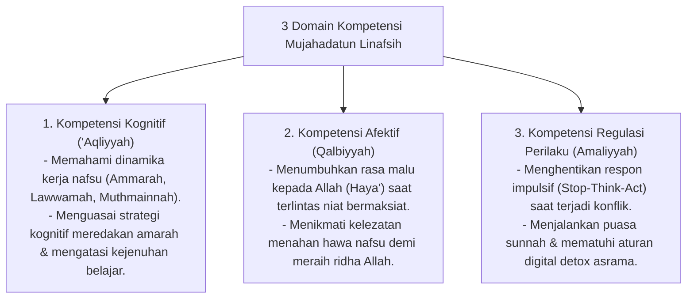

# P3-09-05-Standar-Kompetensi-dan-Taksonomi (Mujahadatun Linafsih)

## Tujuan
Menetapkan **Standar Capaian Pembelajaran & Taksonomi Kompetensi** karakter Mujahadatun Linafsih untuk seluruh jenjang santri di pesantren TUMBUH.

---

## 1. 3 Domain Kompetensi Mujahadatun Linafsih

---

## 2. Matriks Capaian Berjenjang Sesuai Jenjang Kemandirian TUMBUH (J1–J4)

* **Jenjang T1 (Kelas 7 / 10 Baru)**: Mengatasi homesickness, menahan godaan pulang, mengendalikan tangisan dan amarah awal adaptasi.
* **Jenjang T2 (Kelas 8 / 11)**: Mampu menahan diri dari menyontek dan gawai ilegal, istiqamah puasa Senin-Kamis sebulan minimal 4x.
* **Jenjang T3 (Kelas 9 / 12)**: Memiliki ketahanan mental belajar tinggi (*Grit*), mampu meredakan kemarahan dengan tenang tanpa dendam.
* **Jenjang T4 (Santri Akhir / Teladan)**: Mencapai stabilitas emosi matang (*Nafs Muthmainnah*), menjadi figur penenteram (*Qudwah*) saat terjadi gesekan di asrama.

---

## 3. Status Dokumen
* **Status**: 🌟 **A+ (Tervalidasi & Siap Diimplementasikan)**
* **Level**: Project 3 - `03 Capacity Framework / 09 Mujahadatun Linafsih / 05 Competencies`
