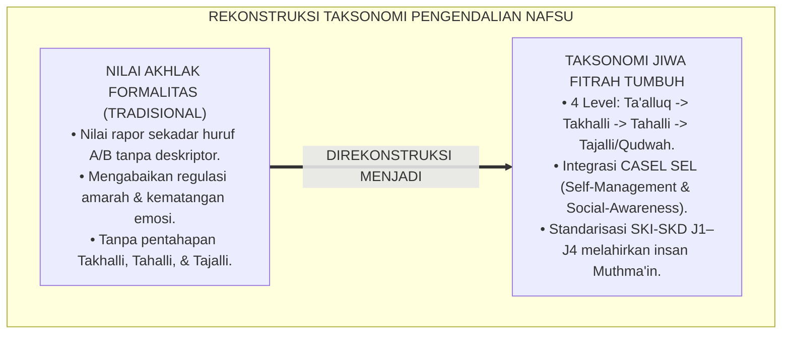
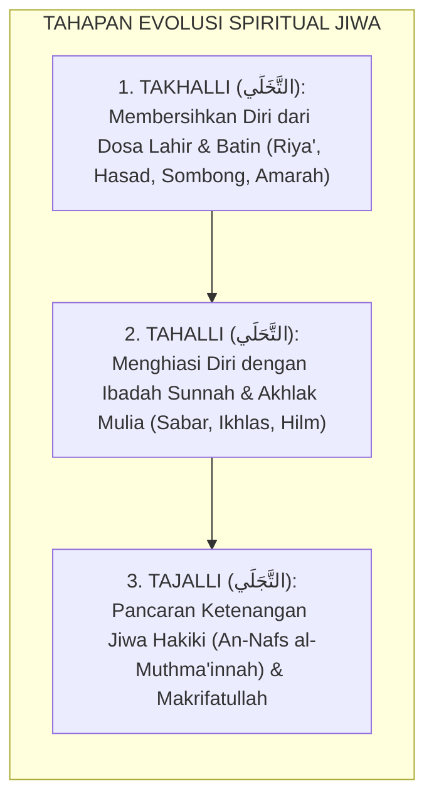
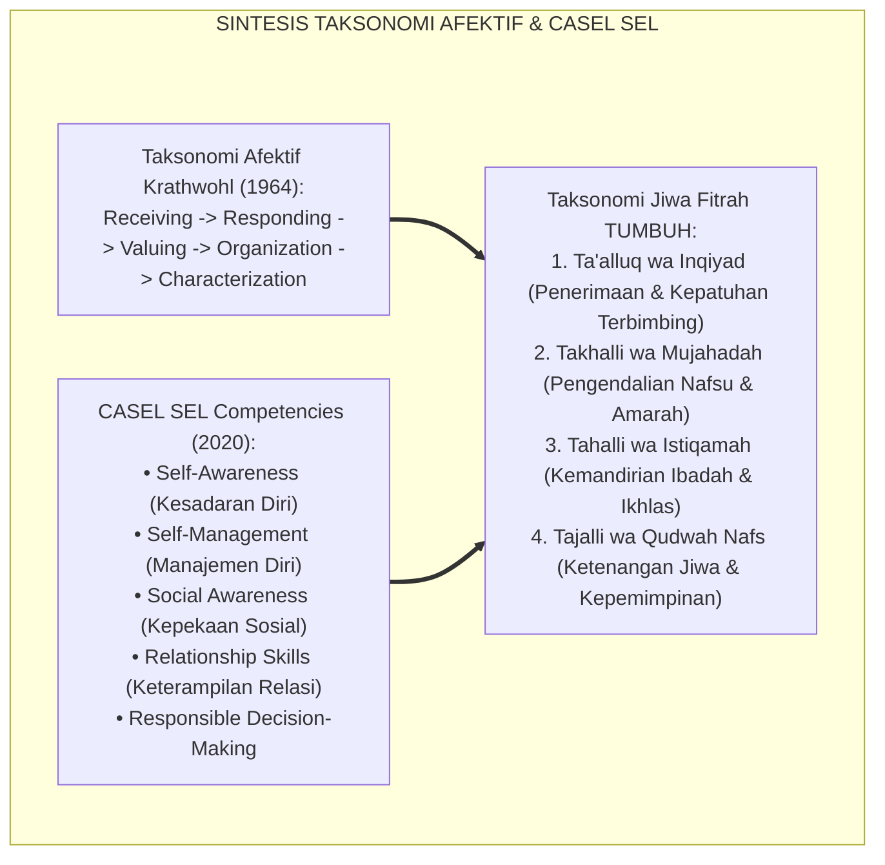
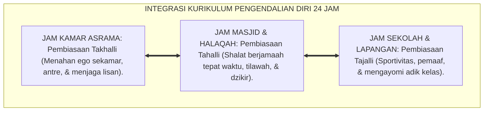
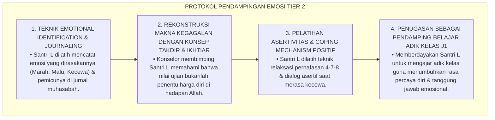
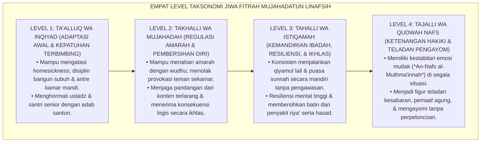
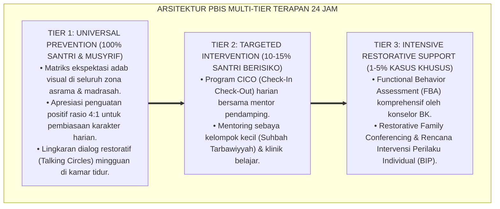

# P3-09-05: STANDAR KOMPETENSI DAN TAKSONOMI MUJAHADATUN LINAFSIH
## *Monograf Riset Akademik: Taksonomi Kematangan Jiwa Berbasis Maratibut Tazkiyah, Matriks Standar Kompetensi Inti dan Dasar (SKI-SKD Pengendalian Diri), Gradasi Empat Tingkat Regulasi Diri, Serta Penyelarasan Taksonomi Krathwohl & CASEL SEL dengan Jenjang J1–J4 di Pesantren 24 Jam*

**Nomor Identifikasi**: `P3-09-05/MONOGRAF-RISET-TAKSONOMI-MUJAHADATUN-LINAFSIH/2026`  
**Domain**: `03 Capacity Framework` > `09 Mujahadatun Linafsih` (Sub-Modul 05: *Competency Standards & Taxonomy*)  
**Klasifikasi Naskah**: *Academic Research Monograph* (Monograf Penelitian Desain Kurikulum Afektif, Standarisasi Kompetensi Jiwa, & Taksonomi Regulasi Emosi)  
**Rumpun Disiplin Pengkaji**: Desain Kurikulum Afektif Pesantren, Taksonomi Krathwohl (Afektif), CASEL Social-Emotional Learning, Tasawuf Akhlaqi  

---

> ### 💡 INTISARI EKSEKUTIF (EXECUTIVE SUMMARY)
>
> * **Ketiadaan Taksonomi Afektif Terukur dalam Pendidikan Pesantren:**  
>   Evaluasi karakter santri di madrasah dan asrama sering kali tidak memiliki taksonomi afektif yang jelas. Penilaian akhlak hanya berupa nilai huruf "A" atau "B" di rapor tanpa kriteria terstandarisasi apakah santri masih berada pada tingkat *Kepatuhan Karena Paksaan (Compliance)*, telah mencapai *Internalisasi Nilai (Internalization)*, atau telah menjadi *Teladan Pengendalian Diri (Exemplary Character)*.
> * **Taksonomi Jiwa Fitrah Mujahadatun Linafsih TUMBUH:**  
>   Ekosistem TUMBUH merumuskan **Taksonomi Kematangan Jiwa Fitrah Terpadu (*Maratibut Tazkiyah wal Inqiyad*)** yang memadukan 4 tingkat kematangan regulasi diri: (1) *Level 1: Ta'alluq wa Inqiyad (Adaptasi Awal & Kepatuhan Terbimbing)*, (2) *Level 2: Takhalli wa Mujahadah (Pengendalian Amarah & Pembersihan Diri Awal)*, (3) *Level 3: Tahalli wa Istiqamah (Kemandirian Ibadah, Resiliensi, & Ikhlas Batin)*, dan (4) *Level 4: Tajalli wa Qudwah Nafs (Ketenangan Jiwa Hakiki & Kepemimpinan Penuh Kasih)*.
> * **Standardisasi SKI-SKD Jenjang J1–J4:**  
>   Monograf ini memetakan Standar Kompetensi Inti (SKI) dan Standar Kompetensi Dasar (SKD) untuk setiap jenjang kemandirian (J1 s/d J4, Kelas 7 s/d 12), menjamin bahwa setiap santri lulus dengan kematangan emosional, kestabilan jiwa, dan integritas akhlak pemaaf yang kokoh.

---

## 📑 DAFTAR ISI MONOGRAF

- [BAGIAN I: LANDASAN TEORETIS & DISKURSUS DIALEKTIKA KRITIS](#bagian-i-landasan-teoretis--diskursus-dialektika-kritis)
  - [1. Latar Belakang Masalah: Kegagalan Evaluasi Karakter Tanpa Taksonomi Afektif yang Presisi](#1-latar-belakang-masalah-kegagalan-evaluasi-karakter-tanpa-taksonomi-afektif-yang-presisi)
  - [2. Eksegesis Turats: Konsep Takhalli, Tahalli, & Tajalli dalam Tradisi Tazkiyatun Nafs](#2-eksegesis-turats-konsep-takhalli-tahalli--tajalli-dalam-tradisi-tazkiyatun-nafs)
  - [3. Konvergensi Taksonomi Afektif Modern: Krathwohl's Affective Taxonomy & 5 Kompetensi CASEL SEL](#3-konvergensi-taksonomi-afektif-modern-krathwohls-affective-taxonomy--5-kompetensi-casel-sel)
  - [4. Analisis Rekayasa Kurikulum Jiwa Terpadu 24 Jam: Dari Kamar Tidur Menuju Ruang Publik Asrama](#4-analisis-rekayasa-kurikulum-jiwa-terpadu-24-jam-dari-kamar-tidur-menuju-ruang-publik-asrama)
  - [5. Kasuistika Lapangan Klinis & Protokol Pendampingan Santri Mengalami Stagnasi Kematangan Afektif](#5-kasuistika-lapangan-klinis--protokol-pendampingan-santri-mengalami-stagnasi-kematangan-afektif)
- [BAGIAN II: FORMULASI KONSEPTUAL & PEMBAHASAN MENDALAM](#bagian-ii-formulasi-konseptual--pembahasan-mendalam)
  - [1. Eksplanasi Teoretis Taksonomi Jiwa Fitrah TUMBUH](#1-eksplanasi-teoretis-taksonomi-jiwa-fitrah-tumbuh)
  - [2. Matriks Standar Kompetensi Inti dan Dasar (SKI-SKD) Mujahadatun Linafsih](#2-matriks-standar-kompetensi-inti-dan-dasar-ski-skd-mujahadatun-linafsih)
  - [3. Matriks Gradasi Taksonomi 4 Level Lintas Jenjang J1–J4](#3-matriks-gradasi-taksonomi-4-level-lintas-jenjang-j1j4)
  - [4. Diskusi Akademis & Implikasi bagi Standarisasi Kelulusan Karakter Santri Pesantren](#4-diskusi-akademis--implikasi-bagi-standarisasi-kelulusan-karakter-santri-pesantren)
- [BAGIAN III: KESIMPULAN & APARATUS AKADEMIS](#bagian-iii-kesimpulan--aparatus-akademis)
  - [1. Tabel Sintesis Standar Kompetensi & Taksonomi Mujahadatun Linafsih](#1-tabel-sintesis-standar-kompetensi--taksonomi-mujahadatun-linafsih)
  - [2. Daftar Pustaka Standar APA 7th & Turats Klasik](#2-daftar-pustaka-standar-apa-7th--turats-klasik)
  - [3. Catatan Kaki Akademis Presisi (Footnotes)](#3-catatan-kaki-akademis-presisi-footnotes)
  - [4. Glosarium Istilah Ilmiah & Taksonomi Jiwa](#4-glosarium-istilah-ilmiah--taksonomi-jiwa)

---

# BAGIAN I: LANDASAN TEORETIS & DISKURSUS DIALEKTIKA KRITIS

---

### 1. Latar Belakang Masalah: Kegagalan Evaluasi Karakter Tanpa Taksonomi Afektif yang Presisi

Dalam kurikulum pesantren konvensional, evaluasi pembinaan jiwa kerap mengalami **tiga kebuntuan taksonomis (*Taxonomic Deadlocks*)**:[^1]

1. **Jebakan Penilaian Afektif Formalitas (*Subjective Letter Grade Trap*)**: Nilai budi pekerti/akhlak di rapor diberikan secara seragam tanpa rubrik berjenjang yang memetakan apakah santri mampu menahan amarah, apakah santri ikhlas beribadah, atau apakah santri gemar mengintimidasi junior.
2. **Ketiadaan Gradasi Internalisasi Nilai Moral**: Pengasuh menyamaratakan tuntutan psikologis santri kelas 7 dan kelas 12, tanpa memahami tahapan perkembangan internalisasi nilai dari kepatuhan eksternal menuju karakterisasi otonom.
3. **Pengabaian Keterampilan Social-Emotional Learning (SEL)**: Taksonomi madrasah tidak mewadahi keterampilan krusial seperti kesadaran diri (*Self-Awareness*), manajemen diri (*Self-Management*), dan pengambilan keputusan bertanggung jawab (*Responsible Decision-Making*).[^2]

Model riset **TUMBUH** merancang **Taksonomi Jiwa Fitrah Mujahadatun Linafsih** yang memadukan khazanah *Tazkiyatun Nafs* klasik dengan taksonomi afektif modern Krathwohl dan CASEL SEL.

---

### 2. Eksegesis Turats: Konsep Takhalli, Tahalli, & Tajalli dalam Tradisi Tazkiyatun Nafs

Para ulama tasawuf akhlaqi klasik merumuskan tiga tahapan evolusi spiritual jiwa manusia yang sangat sistematis.

#### 📖 Formulasi Imam Ahmad Zarruq dalam *Qawa'idut Tashawwuf*
Syaikh **Ahmad Zarruq** dalam *Qawa'idut Tashawwuf* menjelaskan urutan metodologis pembinaan jiwa:

$$\text{لَا يَصِحُّ التَّحَلِّي بِالْفَضَائِلِ إِلَّا بَعْدَ التَّخَلِّي عَنِ الرَّذَائِلِ؛ فَإِنَّ تَطْهِيرَ الْمَحَلِّ شَرْطٌ لِحُلُولِ الطَّاهِرِ فِيهِ؛ فَإِذَا صَحَّ التَّخَلِّي وَالتَّحَلِّي، أَشْرَقَتْ أَنْوَارُ التَّجَلِّي فِي الْقَلْبِ بِالسَّكِينَةِ وَالطُّمَأْنِينَةِ}$$

*"Tidaklah sah menghiasi diri dengan kebajikan-kebajikan mulia (*At-Tahalli*) melainkan setelah **membersihkan diri dari kehinaan dosa dan penyakit hati (At-Takhalli)**; karena sesungguhnya pensucian wadah merupakan syarat mutlak bagi masuknya sesuatu yang suci ke dalamnya. Maka manakala Takhalli dan Tahalli telah benar, niscaya memancarlah cahaya Tajalli di dalam hati dengan penuh ketenangan (*Sakinah*) dan ketenteraman batin (*Thuma'ninah*)!"*[^3]

---

### 3. Konvergensi Taksonomi Afektif Modern: Krathwohl's Affective Taxonomy & 5 Kompetensi CASEL SEL

Standar kompetensi Mujahadatun Linafsih memadukan Taksonomi Afektif Krathwohl dan kerangka CASEL SEL:

---

### 4. Analisis Rekayasa Kurikulum Jiwa Terpadu 24 Jam: Dari Kamar Tidur Menuju Ruang Publik Asrama

Pembentukan kompetensi jiwa santri diintegrasikan ke dalam seluruh ekosistem pesantren:

---

### 5. Kasuistika Lapangan Klinis & Protokol Pendampingan Santri Mengalami Stagnasi Kematangan Afektif

#### Studi Kasus Lapangan: Santri J3 Masih Sering Menangis Histeris & Merajuk Saat Nilai Ujiannya Turun
* **Konteks Masalah**: Santri L (16 tahun, Jenjang J3) memiliki kecerdasan kognitif tinggi, namun saat nilai ujiannya turun atau dikritik guru, ia mengurung diri di kamar, menangis histeris, dan menolak makan (*Emotional Regression / Tantrum Remaja*).
* **Analisis Diagnostik**: Santri L mengalami *Affective Developmental Delay* dan *Low Frustration Tolerance*, di mana kematangan emosinya tertinggal pada level anak-anak.
* **Protokol Intervensi Kematangan Afektif TUMBUH**:

Dalam waktu 4 pekan, kestabilan emosi Santri L meningkat pesat, ia mampu menerima kritik dengan senyuman dan tidak pernah lagi merajuk saat menghadapi kesulitan.[^4]

---

# BAGIAN II: FORMULASI KONSEPTUAL & PEMBAHASAN MENDALAM

---

### 1. Eksplanasi Teoretis Taksonomi Jiwa Fitrah TUMBUH

Taksonomi Jiwa Fitrah Mujahadatun Linafsih dirumuskan dalam 4 level hierarkis komprehensif:

---

### 2. Matriks Standar Kompetensi Inti dan Dasar (SKI-SKD) Mujahadatun Linafsih

#### Standar Kompetensi Inti (SKI):
* **SKI-1 (Sikap Spiritual-Tazkiyah)**: Menghayati kesadaran *Muraqabatullah* untuk mengendalikan hawa nafsu syahwat dan amarah demi meraih keridhaan Allah SWT.
* **SKI-2 (Sikap Sosial-Pengendalian Diri)**: Menampilkan regulasi emosi matang, pemaaf tulus, kerendahan hati (*Tawadhu'*), dan mengeliminasi 100% perilaku perundungan (*Bullying*).
* **SKI-3 (Kognitif-Pemahaman Penyakit Hati)**: Memahami anatomi nafsu, bahaya penyakit hati (riya', hasad, sombong), dan strategi psikologis regulasi diri.
* **SKI-4 (Psikomotorik-Riyadhah Praktis)**: Menampilkan keterampilan de-eskalasi amarah fisik (wudhu/duduk), konsistensi ibadah mandiri, dan puasa sunnah.

#### Matriks Standar Kompetensi Dasar (SKD) Berdasarkan 4 Pilar:

| Pilar Karakter | Kode SKD | Deskripsi Standar Kompetensi Dasar (SKD) |
| :--- | :--- | :--- |
| **Pilar 1: Kontrol Impulsivitas** | **SKD-ML-1.1** **SKD-ML-1.2** **SKD-ML-1.3** | Menerapkan adab menjaga pandangan (*Ghadhdhul Bashar*) dari konten digital terlarang. Mampu menahan nafsu makan berlebih (*Qana'ah*) dan tertib antre fasilitas asrama. Menolak ajakan melanggar tata tertib asrama atas dasar kesadaran muraqabah. |
| **Pilar 2: Regulasi Amarah** | **SKD-ML-2.1** **SKD-ML-2.2** **SKD-ML-2.3** | Mempraktikkan protokol sunnah (berwudhu, duduk/berbaring) saat emosi memuncak. Menerapkan teknik *Cognitive Reappraisal* untuk meredam provokasi teman sekamar. Menampilkan sikap pemaaf tulus (*Al-'Afwu*) dan memediasi perselisihan kawan. |
| **Pilar 3: Resiliensi Jiwa** | **SKD-ML-3.1** **SKD-ML-3.2** **SKD-ML-3.3** | Mengatasi kecemasan rindu rumah (*Homesickness*) melalui penguatan ruhiyah. Menampilkan ketekunan dan ketabahan (*Ash-Shabr*) dalam menambah hafalan Al-Qur'an. Bangun qiyamul lail dan menjalankan puasa sunnah secara mandiri tanpa paksaan. |
| **Pilar 4: Kerendahan Hati** | **SKD-ML-4.1** **SKD-ML-4.2** **SKD-ML-4.3** | Membersihkan hati dari penyakit iri dengki (*Hasad*) dan pamer amal (*Riya'*). Mengikis arogansi senioritas dan memperlakukan santri junior dengan penuh kasih. Berjiwa besar mengakui kesalahan pribadi dan bersedia melakukan restitusi moral. |

---

### 3. Matriks Gradasi Taksonomi 4 Level Lintas Jenjang J1–J4

| Dimensi Pilar | Jenjang J1 (Kelas 7) *Level 1: Ta'alluq* | Jenjang J2 (Kelas 8–9) *Level 2: Takhalli* | Jenjang J3 (Kelas 10–11) *Level 3: Tahalli* | Jenjang J4 (Kelas 12) *Level 4: Tajalli* |
| :--- | :--- | :--- | :--- | :--- |
| **1. Kontrol Impulsivitas** | Menahan tangisan rindu rumah; tertib jadwal tidur & makan. | Menolak ajakan melanggar aturan; menjaga pandangan dari konten pornografi. | Konsisten puasa sunnah Senin-Kamis; disiplin tahajjud mandiri. | Memiliki imunitas mutlak dari godaan syahwat; gaya hidup zuhud beradab. |
| **2. Regulasi Amarah** | Menarik nafas dalam & melapor musyrif; tidak membalas memukul. | Menerapkan wudhu saat marah; mampu meredam provokasi sekamar. | Memaafkan kesalahan orang lain sebelum diminta (*Al-'Afwu*). | Menjadi mediator perdamaian (*Ishlah*) konflik santri junior. |
| **3. Resiliensi Jiwa** | Bertahan mondok tanpa cengeng; sabar mengantre kamar mandi. | Tekun menambah hafalan Al-Qur'an meski lelah; pantang menyerah. | Tetap bersemangat belajar meski nilai turun; optimisme spiritual. | Ketenangan jiwa stabil (*Sakinah*); teguh membela kemaslahatan umat. |
| **4. Kerendahan Hati** | Mau mengakui kesalahan diri; patuh arahan pengasuh. | Tidak menyombongkan materi; menghargai kawan yang lambat. | Membersihkan hati dari dengki; tulus mengapresiasi kawan. | Qudwah tawadhu'; melayani dan mengayomi adik kelas tanpa feodalisme. |

---

### 4. Diskusi Akademis & Implikasi bagi Standarisasi Kelulusan Karakter Santri Pesantren

Penerapan taksonomi jiwa fitrah menghadirkan standar mutu baru kelulusan pesantren:

1. **Sertifikasi Kematangan Regulasi Diri (*Emotional-Spiritual Maturity Certification*)**: Kelulusan santri jenjang J4 mensyaratkan pencapaian skor minimal pada instrumen evaluasi kepribadian dan rekam jejak anti-bullying.
2. **Penghapusan Total Hukuman Fisik Menuju Disiplin Positif Restoratif**: Pembinaan santri berpijak pada prinsip *Firm & Kind*, menumbuhkan tanggung jawab moral dari dalam jiwa.
3. **Kaderisasi Pemimpin Bangsa Berintegritas Tinggi**: Menjamin bahwa alumni pesantren memiliki kestabilan mental dan kebersihan hati yang siap memimpin di tengah gelombang fitnah zaman.[^5]

---

---

### Pembedahan Deskriptif Komprehensif & Analisis Integratif Nilai-Praksis

Penerapan konsep **P3-09-05: STANDAR KOMPETENSI DAN TAKSONOMI MUJAHADATUN LINAFSIH** di ekosistem pesantren berbasis sistem TUMBUH memerlukan pemahaman multidimensional yang memadukan khazanah turats syariat dan konsensus sains pendidikan modern:

#### A. Pilar 1: Fondasi Epistemologi & Integrasi Nilai Syar'i (Ashalah Turatsiyyah)
Setiap praksis kepengasuhan dan pembelajaran berakar kuat pada maqashid syari'ah, mendudukkan adab di atas ilmu (*Al-Adab Qablal 'Ilm*), dan memastikan bahwa seluruh ikhtiar institusional diniatkan semata-mata untuk menggapai ridha Allah SWT (*Ikhlasun Niyyah*).

#### B. Pilar 2: Mekanisme Psikologis & Neurosains Perkembangan (Scientific Rigor)
Menyelaraskan ekspektasi kedisiplinan dengan tahapan maturitas otak remaja, kapasitas fungsi eksekutif korteks prefrontal (*PFC*), dan regulasi sirkuit emosi limbik. Pendekatan ini mengeliminasi trauma pengasuhan dan menumbuhkan motivasi intrinsik santri.

#### C. Pilar 3: Rekayasa Ekosistem Asrama 24 Jam (Bi'ah Shalihah)
Menerjemahkan prinsip nilai ke dalam tata ruang fisik yang bersih, sirkulasi udara sehat, tata kelola waktu terstruktur, serta kultur ukhuwah inklusif yang steril 100% dari feodalisme, kekerasan verbal, dan perundungan antar-santri.

#### D. Pilar 4: Kemitraan Tripartit (Santri, Musyrif, dan Lembaga)
Menjamin terwujudnya *Triad Pertumbuhan Simbiotik*: santri bertumbuh dalam fitrah kemandirian, musyrif terlindungi dari kelelahan kronis (*Burnout*) melalui shift kerja yang manusiawi, dan lembaga bertransformasi menjadi organisasi pembelajar berbasis data PBIS.

---

### Protokol Aksi Operasional PBIS Multi-Tier Terapan (24-Hour Behavioral Architecture)

---

# BAGIAN III: KESIMPULAN & APARATUS AKADEMIS

---

### 1. Tabel Sintesis Standar Kompetensi & Taksonomi Mujahadatun Linafsih

| Tingkat Taksonomi | Karakteristik Utama | Indikator Kinerja Teramati | Target Jenjang | Metode Evaluasi Utama |
| :--- | :--- | :--- | :--- | :--- |
| **Level 1: Ta'alluq wa Inqiyad** | Adaptasi awal, kepatuhan terbimbing, & kontrol cengeng. | Adaptasi homesickness $\le 4\text{ pekan}$; tertib bangun subuh & antre. | Jenjang J1 (Kelas 7) | Logbook Adaptasi Asrama & Observasi Musyrif Kamar. |
| **Level 2: Takhalli wa Mujahadah** | Pengendalian amarah, wudhu, & penolakan provokasi. | 0% perkelahian fisik; menjaga pandangan siber; menerima konsekuensi logis. | Jenjang J2 (Kelas 8–9) | Skala DERS & Lembar Observasi Interaksi Sebaya. |
| **Level 3: Tahalli wa Istiqamah** | Kemandirian ibadah, resiliensi tinggi, & ikhlas batin. | Konsisten tahajjud & puasa sunnah; bebas riya' & hasad; pemaaf. | Jenjang J3 (Kelas 10–11) | Jurnal Muhasabah Batin & Peer Sociometric Review. |
| **Level 4: Tajalli & Qudwah Nafs** | Ketenangan jiwa hakiki (*Muthma'in*) & teladan pengayom. | Kestabilan emosi mutlak; mengayomi adik kelas; 0% perpeloncoan. | Jenjang J4 (Kelas 12) | Evaluasi 360 Derajat & Sidang Kelayakan Karakter. |

---

### 2. Daftar Pustaka Standar APA 7th & Turats Klasik

1. **Al-Ghazali, Hujjatul Islam Abu Hamid Muhammad bin Muhammad.** (2018). *Ihya' 'Ulumiddin: Kitab Riyadhatin Nafs*. Beirut: Dar Al-Kutub Al-'Ilmiyyah.
2. **Collaborative for Academic, Social, and Emotional Learning (CASEL).** (2020). *CASEL's SEL Framework: What Are the Core Competence Areas and Where Are They Promoted?* Chicago: CASEL.
3. **Ibnu Qayyim Al-Jauziyyah, Syamsuddin Abu Abdillah Muhammad bin Abi Bakr.** (2011). *Madarijus Salikin*. Kairo: Dar Al-Hadits.
4. **Krathwohl, D. R., Bloom, B. S., & Masia, B. B.** (1964). *Taxonomy of Educational Objectives: The Classification of Educational Goals. Handbook II: Affective Domain*. New York: David McKay Company.
5. **Nelsen, J.** (2006). *Positive Discipline*. New York: Ballantine Books.
6. **Sugai, G., & Horner, R. H.** (2020). *School-Wide Positive Behavioral Interventions and Supports: Implementation Practices*. *Journal of Positive Behavior Interventions*, 22(4), 203-211.
7. **Zarruq, Ahmad bin Ahmad bin Muhammad.** (2005). *Qawa'idut Tashawwuf*. Tahqiq: Dr. Abdul Majid Khaial. Kairo: Dar As-Salam.
8. **Zehr, H.** (2015). *The Little Book of Restorative Justice*. New York: Good Books.

---

### 3. Catatan Kaki Akademis Presisi (Footnotes)

[^1]: Kritik terhadap ketiadaan taksonomi afektif terukur dalam evaluasi pendidikan karakter, Krathwohl, Bloom, & Masia (1964, hlm. 38).  
[^2]: Kerangka kerja kompetensi Social-Emotional Learning (SEL) dalam pembinaan remaja, CASEL (2020, hlm. 4).  
[^3]: Ahmad Zarruq, *Qawa'idut Tashawwuf* (2005, Kaidah Ke-12, hlm. 28).  
[^4]: Protokol pendampingan kestabilan emosi remaja dan toleransi frustrasi belajar, Nelsen (2006, hlm. 96).  
[^5]: Standar sertifikasi kelulusan karakter jiwa dan penjaminan mutu TUMBUH Pesantren (2026).  

---

### 4. Glosarium Istilah Ilmiah & Taksonomi Jiwa

1. **Taksonomi Jiwa Fitrah**: Hierarki perkembangan kematangan spiritual-afektif yang menyatukan konsep Takhalli, Tahalli, Tajalli dengan taksonomi Krathwohl dan CASEL SEL.
2. **Ta'alluq wa Inqiyad (تَعَلُّقٌ وَانْقِيَادٌ)**: Tingkat taksonomi awal yang menekankan penerimaan aturan, adaptasi lingkungan baru, dan kepatuhan terbimbing.
3. **Takhalli wa Mujahadah (تَخَلٍّ وَمُجَاهَدَةٌ)**: Tingkat taksonomi kedua yang berfokus pada pengendalian dorongan syahwat, manajemen amarah, dan pembersihan diri.
4. **Tahalli wa Istiqamah (تَحَلٍّ وَاسْتِقَامَةٌ)**: Tingkat taksonomi ketiga di mana santri konsisten beribadah mandiri, memiliki resiliensi mental, dan keikhlasan batin.
5. **Tajalli wa Qudwah Nafs (تَجَلٍّ وَقُدْوَةُ النَّفْسِ)**: Tingkat taksonomi puncak di mana santri mencapai ketenangan jiwa hakiki (*Muthma'innah*) dan menjadi teladan kasih sayang.
6. **Affective Domain (Ranah Afektif)**: Ranah pembelajaran yang berkaitan dengan emosi, sikap, apresiasi, motivasi, dan internalisasi nilai-nilai moral.
7. **CASEL SEL Framework**: Kerangka kerja pengembangan kompetensi sosial-emosional internasional (kesadaran diri, manajemen diri, kepekaan sosial, relasi, keputusan).
8. **Low Frustration Tolerance**: Ketidakmampuan psikologis seseorang untuk menoleransi kesulitan atau penundaan keinginan, yang memicu reaksi marah atau merajuk.
9. **Standar Kompetensi Inti (SKI) Jiwa**: Parameter kematangan afektif, spiritual, dan regulasi diri yang wajib dicapai santri sepanjang masa pendidikan.
10. **Emotional Regression (Regresi Emosi)**: Kemunduran sementara respon perilaku remaja ke tahap anak-anak saat menghadapi tekanan psikologis yang berat.
