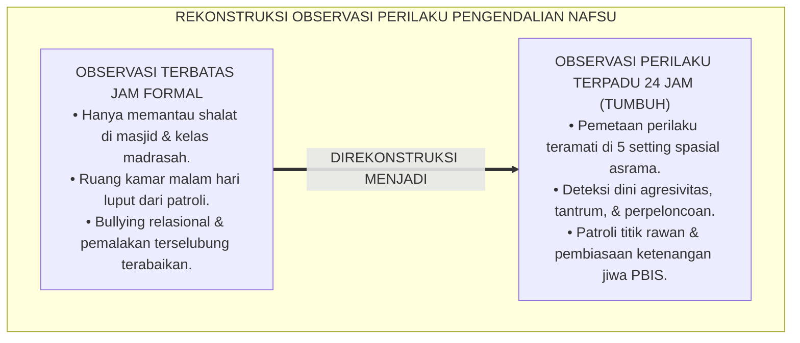
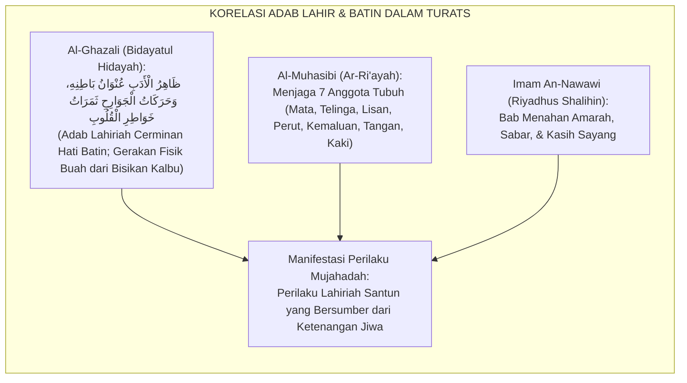
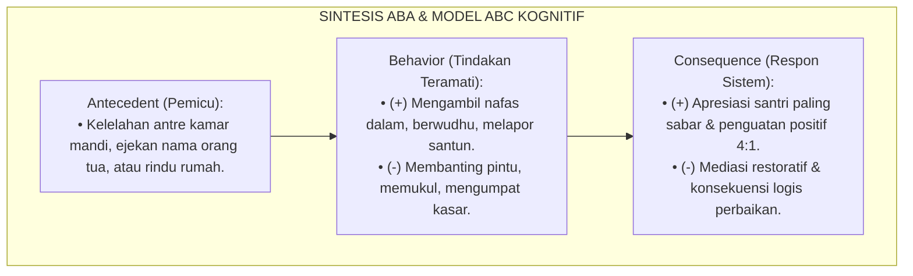
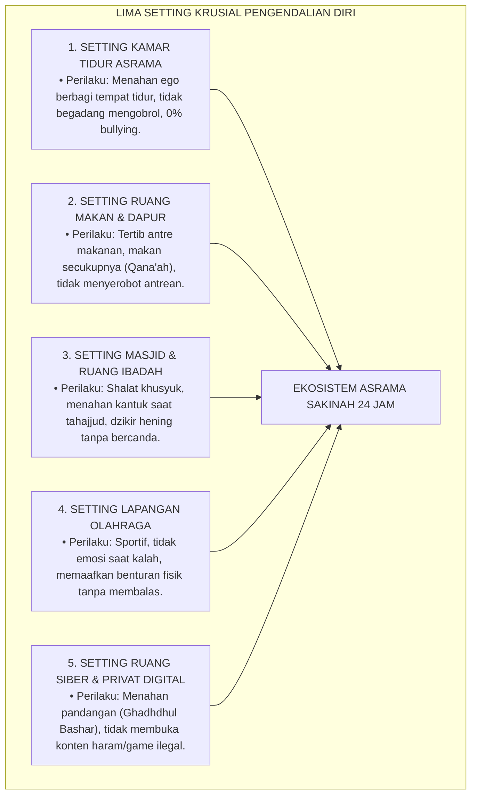
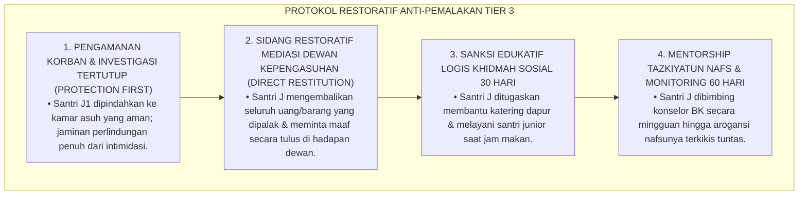
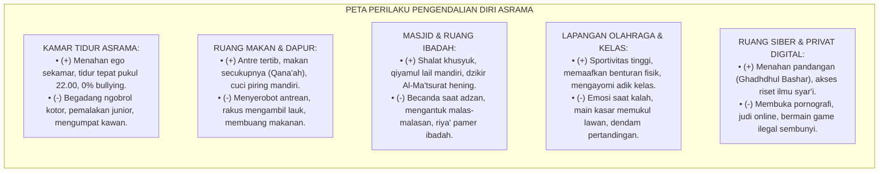
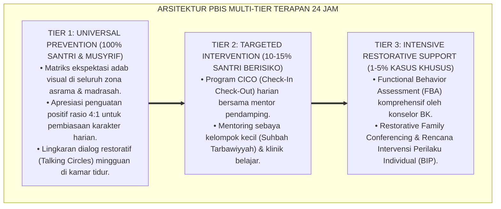

# P3-09-06: MANIFESTASI PERILAKU SANTRI MUJAHADATUN LINAFSIH
## *Monograf Riset Akademik: Tipologi Indikator Perilaku Regulasi Diri Teramati (Observable Self-Regulation Behaviors), Pemetaan Setting 24 Jam (Kamar Tidur Asrama, Ruang Makan/Dapur, Masjid, Lapangan Olahraga, & Ruang Privat Digital), Eliminasi Perilaku Defisit (Tantrum, Bullying Senioritas, Pornografi), Serta Pembentukan Bi'ah Shalihah di Pesantren*

**Nomor Identifikasi**: `P3-09-06/MONOGRAF-RISET-MANIFESTASI-PERILAKU-MUJAHADATUN-LINAFSIH/2026`  
**Domain**: `03 Capacity Framework` > `09 Mujahadatun Linafsih` (Sub-Modul 06: *Behavioral Manifestations*)  
**Klasifikasi Naskah**: *Academic Research Monograph* (Monograf Penelitian Observasi Perilaku Afektif, Ekologi Sosial Asrama, & Analitik Perilaku PBIS)  
**Rumpun Disiplin Pengkaji**: Analisis Perilaku Terapan (*Applied Behavior Analysis*), Sosiologi Interaksi Asrama, Psikologi Perkembangan Remaja, Manajemen Disiplin Positif  

---

> ### 💡 INTISARI EKSEKUTIF (EXECUTIVE SUMMARY)
>
> * **Kelemahan Evaluasi Pengendalian Diri yang Bersifat Abstrak:**  
>   Banyak pengasuh pesantren mengukur "kesabaran" dan "keikhlasan" santri secara abstrak tanpa indikator perilaku yang teramati (*Observable Behaviors*). Akibatnya, perilaku agresif terselubung (*Passive-Aggressive*), perpeloncoan saat musyrif tidak ada di kamar tidur, dan pelanggaran di ruang privat gawai tidak terdeteksi hingga terjadi kasus kekerasan fisik fatal.
> * **Katalog Manifestasi Perilaku Regulasi Diri 24 Jam TUMBUH:**  
>   Ekosistem TUMBUH merumuskan **Katalog Manifestasi Perilaku Teramati (*Observable Self-Regulation Behavior Matrix*)** yang memetakan perilaku santri ke dalam dua kutub distingtif: *Indikator Perilaku Konstruktif-Sakinah (Target Benchmark Pengendalian Diri)* dan *Indikator Perilaku Defisit/Impulsif (Target Intervensi PBIS)* di 5 setting utama kehidupan asrama 24 jam.
> * **Standardisasi Observasi & Budaya Perlindungan Santri:**  
>   Matriks ini menjadi pedoman operasional harian bagi musyrif asrama, guru madrasah, pembimbing kamar, dan konselor BK untuk memantau, mendokumentasikan, dan memperkuat pembiasaan pengendalian nafsu secara adil dan objektif.

---

## 📑 DAFTAR ISI MONOGRAF

- [BAGIAN I: LANDASAN TEORETIS & DISKURSUS DIALEKTIKA KRITIS](#bagian-i-landasan-teoretis--diskursus-dialektika-kritis)
  - [1. Latar Belakang Masalah: Bahaya Pengabaian Perilaku Impulsif Terselubung di Asrama 24 Jam](#1-latar-belakang-masalah-bahaya-pengabaian-perilaku-impulsif-terselubung-di-asrama-24-jam)
  - [2. Eksegesis Turats: Konsep Al-Adab al-Batiniyyah wazh-Zhahiriyyah dalam Kitab Tasawuf](#2-eksegesis-turats-konsep-al-adab-al-batiniyyah-wazh-zhahiriyyah-dalam-kitab-tasawuf)
  - [3. Konvergensi Sains Analisis Perilaku Terapan (ABA) & Model ABC Kognitif](#3-konvergensi-sains-analisis-perilaku-terapan-aba--model-abc-kognitif)
  - [4. Analisis Rekayasa Kausalitas Setting 24 Jam: Kamar Tidur, Ruang Makan, Masjid, & Lapangan](#4-analisis-rekayasa-kausalitas-setting-24-jam-kamar-tidur-ruang-makan-masjid--lapangan)
  - [5. Kasuistika Lapangan Klinis & Protokol De-eskalasi Santri Melakukan Pemalakan / Pemerasan di Kamar Asrama](#5-kasuistika-lapangan-klinis--protokol-de-eskalasi-santri-melakukan-pemalakan--pemerasan-di-kamar-asrama)
- [BAGIAN II: FORMULASI KONSEPTUAL & PEMBAHASAN MENDALAM](#bagian-ii-formulasi-konseptual--pembahasan-mendalam)
  - [1. Katalog Manifestasi Perilaku Berdasarkan Empat Pilar Mujahadatun Linafsih](#1-katalog-manifestasi-perilaku-berdasarkan-empat-pilar-mujahadatun-linafsih)
  - [2. Pemetaan Matriks Perilaku Lintas Setting Spasial Asrama 24 Jam](#2-pemetaan-matriks-perilaku-lintas-setting-spasial-asrama-24-jam)
  - [3. Matriks Diferensiasi Perilaku Jiwa Tenang vs Perilaku Defisit Berdasarkan Jenjang J1–J4](#3-matriks-diferensiasi-perilaku-jiwa-tenang-vs-perilaku-defisit-berdasarkan-jenjang-j1j4)
  - [4. Diskusi Akademis & Implikasi bagi Penegakan Kebijakan Zero-Bullying di Pesantren](#4-diskusi-akademis--implikasi-bagi-penegakan-kebijakan-zero-bullying-di-pesantren)
- [BAGIAN III: KESIMPULAN & APARATUS AKADEMIS](#bagian-iii-kesimpulan--aparatus-akademis)
  - [1. Tabel Sintesis Manifestasi Perilaku Mujahadatun Linafsih](#1-tabel-sintesis-manifestasi-perilaku-mujahadatun-linafsih)
  - [2. Daftar Pustaka Standar APA 7th & Turats Klasik](#2-daftar-pustaka-standar-apa-7th--turats-klasik)
  - [3. Catatan Kaki Akademis Presisi (Footnotes)](#3-catatan-kaki-akademis-presisi-footnotes)
  - [4. Glosarium Istilah Ilmiah & Observasi Perilaku Afektif](#4-glosarium-istilah-ilmiah--observasi-perilaku-afektif)

---

# BAGIAN I: LANDASAN TEORETIS & DISKURSUS DIALEKTIKA KRITIS

---

### 1. Latar Belakang Masalah: Bahaya Pengabaian Perilaku Impulsif Terselubung di Asrama 24 Jam

Dalam dinamika kehidupan asrama pesantren konvensional, evaluasi perilaku santri kerap mengalami **tiga distorsi observasional (*Observational Vulnerabilities*)**:[^1]

1. **Jebakan Pengawasan Hanya di Jam Formal (*Formal Hours Blindspot*)**: Musyrif mengawasi santri hanya saat jam belajar di kelas atau shalat berjamaah di masjid, namun abai terhadap dinamika di ruang privat asrama (pukul 21.30–04.00), di mana kasus perpeloncoan, pemalakan, dan konflik emosional paling rawan terjadi.
2. **Ketiadaan Pembedaan Agresi Terbuka vs Agresi Relasional**: Pengasuh hanya menindak perkelahian fisik terbuka, sementara perundungan verbal, pengucilan sosial (*Social Exclusion*), dan rumor fitnah diabaikan.
3. **Normalisasi Emosi Marah Berlebih Sebagai 'Wajar'**: Sifat pemarah, membanting pintu, atau mengumpat kerap dibiarkan tanpa bimbingan de-eskalasi emosi ilmiah.[^2]

Model riset **TUMBUH** merancang sistem indikator perilaku pengendalian diri yang **konkret, teramati (*observable*), terukur, dan dipantau sepanjang 24 jam**.

---

### 2. Eksegesis Turats: Konsep Al-Adab al-Batiniyyah wazh-Zhahiriyyah dalam Kitab Tasawuf

Para ulama tasawuf akhlaqi menegaskan bahwa kesucian batin (*Al-Adab al-Batin*) pasti akan memancarkan perilaku fisik lahiriah yang teratur dan santun (*Al-Adab azh-Zhahir*).

#### 📖 Formulasi Hujjatul Islam Imam Al-Ghazali
Imam **Al-Ghazali** dalam *Bidayatul Hidayah* menjelaskan:

$$\text{اعْلَمْ أَنَّ الْأَدَبَ الظَّاهِرَ عُنْوَانُ الْأَدَبِ الْبَاطِنِ، وَأَنَّ حَرَكَاتِ الْجَوَارِحِ ثَمَرَاتُ خَوَاطِرِ الْقُلُوبِ، وَالْأَعْمَالَ نَتَائِجُ الْأَخْلَاقِ؛ فَمَنْ لَمْ يَخْشَعْ قَلْبُهُ لَمْ تَخْشَعْ جَوَارِحُهُ، وَمَنْ لَمْ يَمْلِكْ نَفْسَهُ عِنْدَ الْغَضَبِ لَمْ يَسْتَقِمْ لَهُ أَدَبٌ}$$

*"Ketahuilah bahwa adab lahiriah adalah cerminan dari adab batiniah, dan sesungguhnya **gerakan anggota tubuh adalah buah dari lintasan hati**, dan amal perbuatan adalah hasil dari akhlak jiwa. Maka barangsiapa yang hatinya tidak khusyuk, niscaya anggota tubuhnya tidak akan tenang; dan barangsiapa yang tidak mampu menguasai nafsunya saat marah, niscaya tidak akan lurus adab perilakunya!"*[^3]

---

### 3. Konvergensi Sains Analisis Perilaku Terapan (ABA) & Model ABC Kognitif

Pemantauan manifestasi perilaku santri memadukan prinsip ABA dan Model Antecedent-Behavior-Consequence (ABC):

---

### 4. Analisis Rekayasa Kausalitas Setting 24 Jam: Kamar Tidur, Ruang Makan, Masjid, & Lapangan

Perilaku pengendalian diri santri dipantau secara konkret di 5 setting lingkungan fisik:

---

### 5. Kasuistika Lapangan Klinis & Protokol De-eskalasi Santri Melakukan Pemalakan / Pemerasan di Kamar Asrama

#### Studi Kasus Lapangan: Santri J3 Memalak Makanan & Uang Saku Santri Baru J1 di Kamar Asrama
* **Konteks Masalah**: Santri J (16 tahun, Jenjang J3) memanfaatkan fisik besarnya untuk meminta paksa jatah makanan dan uang saku santri baru J1 di kamar tidurnya setiap malam Jumat (*Extortion / Pemalakan Terselubung*). Santri J1 merasa tertekan dan berniat kabur dari pondok.
* **Analisis Diagnostik**: Santri J mengalami *Bullying Impulsivity* dan arogansi kekuatan fisik yang merusak nilai *At-Tawadhu'*.
* **Protokol De-eskalasi Restoratif & Perlindungan Korban TUMBUH**:

Dalam waktu 4 pekan, perilaku Santri J berubah drastis menjadi santun, ia sangat menyayangi adik kelasnya, dan asrama kembali aman tenteram.[^4]

---

# BAGIAN II: FORMULASI KONSEPTUAL & PEMBAHASAN MENDALAM

---

### 1. Katalog Manifestasi Perilaku Berdasarkan Empat Pilar Mujahadatun Linafsih

Tabel berikut menyajikan pemetaan komparatif antara perilaku berjiwa tenang yang diharapkan (*Target Benchmarks*) dan perilaku impulsif/defisit yang harus diintervensi (*Deficit Indicators*):

| Pilar Mujahadatun Linafsih | Manifestasi Perilaku Konstruktif-Sakinah (*Target Benchmarks*) | Manifestasi Perilaku Defisit/Impulsif (*Intervention Targets*) |
| :--- | :--- | :--- |
| **1. Kontrol Impulsivitas** | • Menahan pandangan (*Ghadhdhul Bashar*) saat berhadapan dengan lawan jenis/gawai. • Konsisten menjalankan puasa sunnah Senin-Kamis tanpa terpaksa. • Makan dan minum secara qana'ah, tertib, dan tidak berlebihan. • Menolak ajakan melanggar tata tertib asrama atau kabur dari pondok. • Menjaga kebersihan dan adab menutup aurat di kamar mandi/kamar tidur. | • Membuka situs terlarang/pornografi saat ada akses gawai digital. • Rakus mengambil makanan berlebihan dan membuang sisa makanan. • Menyelundupkan barang-barang ilegal (ponsel, rokok, komik terlarang). • Mengabaikan adab menutup aurat di lingkungan kamar mandi/asrama. • Tidak mampu menahan kantuk dan tidur berlebihan sepanjang hari. |
| **2. Regulasi Amarah** | • Mengambil nafas dalam, duduk, atau berwudhu saat merasa sangat marah. • Memaafkan kawan yang menabrak atau berbuat salah tanpa membalas membentak. • Menggunakan kalimat yang santun saat menyampaikan ketidaksetujuan. • Menjadi penengah yang mendamaikan perselisihan teman sekamar. • Mengakui kesalahan pribadi dengan lapang dada tanpa membela diri berlebihan. | • Berteriak histeris, mengumpat kasar, atau mencaci nama orang tua teman. • Membanting pintu, melempar barang, atau memukul fisik kawan saat marah. • Menyimpan dendam dan merencanakan pembalasan kepada santri lain. • Memprovokasi kawan sekamar untuk memusuhi santri tertentu (*Ghasyashah*). • Keras kepala menolak meminta maaf meski telah terbukti bersalah. |
| **3. Resiliensi Jiwa** | • Mengatasi rindu keluarga (*Homesickness*) dengan doa dan fokus belajar. • Tekun menambah hafalan Al-Qur'an meski merasa lelah atau sulit menghafal. • Bangun qiyamul lail dan tahajjud secara mandiri tanpa diseret paksa. • Menerima kegagalan nilai ujian dengan semangat untuk belajar lebih giat. • Sabar mengantre fasilitas umum (kamar mandi, telepon, makan) dengan tertib. | • Menangis cengeng berhari-hari dan memaksa orang tua menjemput pulang. • Menyerah menghafal Al-Qur'an dan beralasan pura-pura sakit ke Poskestren. • Sangat sulit dibangunkan subuh; merajuk dan membolos shalat berjamaah. • Putus asa dan mengurung diri di kamar saat nilainya turun. • Menyerobot antrean kamar mandi dan bertengkar memperebutkan fasilitas. |
| **4. Kerendahan Hati** | • Menampilkan sikap tawadhu' dan tidak memamerkan kekayaan keluarga. • Mengayomi, membimbing, dan melindungi santri junior tanpa feodalisme. • Tulus mengapresiasi dan mendoakan keberhasilan hafalan/prestasi kawan. • Melakukan ibadah secara ikhlas dan sembunyi-sembunyi tanpa pamer di medsos. • Mau mendengarkan nasihat dan kritik dari siapa pun dengan hati terbuka. | • Bersikap sombong, memamerkan pakaian bermerek, dan meremehkan santri miskin. • Melakukan perpeloncoan, memalak uang/makanan, atau memerintah adik kelas. • Iri dengki (*Hasad*) dan menyebarkan rumor buruk saat kawan berprestasi. • Melakukan ibadah hanya saat dilihat ustadz (*Riya' & Sum'ah*). • Meremehkan teguran musyrif dan merasa dirinya lebih hebat dari orang lain. |

---

### 2. Pemetaan Matriks Perilaku Lintas Setting Spasial Asrama 24 Jam

---

### 3. Matriks Diferensiasi Perilaku Jiwa Tenang vs Perilaku Defisit Berdasarkan Jenjang J1–J4

| Jenjang Pendidikan | Indikator Perilaku Konstruktif Utama (*Benchmark J1–J4*) | Indikator Perilaku Kritis yang Wajib Diintervensi |
| :--- | :--- | :--- |
| **Jenjang J1 (Kelas 7)** | • Mampu menahan rasa rindu rumah (*Homesickness*) tanpa menangis histeris. • Bangun tidur subuh tepat waktu dan merapikan ranjang mandiri. • Antre kamar mandi dan ruang makan dengan sabar dan tertib. | • Merajuk mogok makan atau mengurung diri di kamar mandi asrama. • Mengambil barang milik teman tanpa izin (*Ghashab / Mencuri*). • Menolak berbicara dan bermusuhan dengan teman sekamar. |
| **Jenjang J2 (Kelas 8–9)** | • Menunjukkan kemampuan meredam amarah dengan protokol wudhu. • Menolak ajakan teman untuk melanggar aturan keluar pondok. • Menjaga pandangan dari gambar dan konten yang tidak senonoh. | • Terlibat perkelahian fisik atau adu mulut menggunakan kata-kata kotor. • Menyelundupkan ponsel pintar ilegal untuk bermain game malam hari. • Mengolok-olok kekurangan fisik atau nama orang tua teman sekamar. |
| **Jenjang J3 (Kelas 10–11)** | • Konsisten menjalankan puasa sunnah Senin-Kamis dan tahajjud mandiri. • Mampu memaafkan kesalahan teman sebelum teman meminta maaf. • Membersihkan hati dari sifat dengki dan tulus mengapresiasi kawan. | • Melakukan perpeloncoan atau memalak santri baru jenjang J1. • Memamerkan ibadah di media sosial demi mencari sanjungan (*Riya'*). • Menyimpan dendam dan memboikot santri lain secara berkelompok. |
| **Jenjang J4 (Kelas 12)** | • Menjadi figur teladan kesabaran, keikhlasan, dan ketenangan jiwa. • Mengayomi dan membimbing adik kelas junior dengan penuh kasih sayang. • Memiliki kestabilan emosi tingkat tinggi menghadapi stres ujian akhir. | • Menggunakan kekuasaan senioritas untuk bertindak sewenang-wenang. • Bersikap arogan dan menolak nasihat ustadz dengan dalih 'sudah senior'. • Apatis terhadap ketertiban asrama dan memberi contoh buruk pada junior. |

---

### 4. Diskusi Akademis & Implikasi bagi Penegakan Kebijakan Zero-Bullying di Pesantren

Penerapan katalog manifestasi perilaku Mujahadatun Linafsih mentransformasikan kultur asrama:

1. **Eradikasi Total Tindak Kekerasan & Bullying (*Zero Tolerance to Violence*)**: Asrama menjadi lingkungan yang sangat aman secara fisik dan psikologis bagi seluruh santri, tanpa rasa takut diintimidasi.
2. **Kemandirian Disiplin Berbasis Kesadaran Batin**: Santri menaati aturan asrama secara sukarela dan bahagia, menghilangkan kebutuhan akan pengawasan represif musyrif.
3. **Penyempurnaan Bi'ah Shalihah**: Terciptanya suasana persaudaraan sejati (*Ukhuwah Islamiyyah*) di mana yang tua menyayangi yang muda, dan yang muda menghormati yang tua.[^5]

---

---

### Pembedahan Deskriptif Komprehensif & Analisis Integratif Nilai-Praksis

Penerapan konsep **P3-09-06: MANIFESTASI PERILAKU SANTRI MUJAHADATUN LINAFSIH** di ekosistem pesantren TUMBUH memerlukan pemahaman multidimensional yang memadukan khazanah turats syariat dan konsensus sains pendidikan modern:

#### A. Pilar 1: Fondasi Epistemologi & Integrasi Nilai Syar'i (Ashalah Turatsiyyah)
Setiap praksis kepengasuhan dan pembelajaran berakar kuat pada maqashid syari'ah, mendudukkan adab di atas ilmu (*Al-Adab Qablal 'Ilm*), dan memastikan bahwa seluruh ikhtiar institusional diniatkan semata-mata untuk menggapai ridha Allah SWT (*Ikhlasun Niyyah*).

#### B. Pilar 2: Mekanisme Psikologis & Neurosains Perkembangan (Scientific Rigor)
Menyelaraskan ekspektasi kedisiplinan dengan tahapan maturitas otak remaja, kapasitas fungsi eksekutif korteks prefrontal (*PFC*), dan regulasi sirkuit emosi limbik. Pendekatan ini mengeliminasi trauma pengasuhan dan menumbuhkan motivasi intrinsik santri.

#### C. Pilar 3: Rekayasa Ekosistem Asrama 24 Jam (Bi'ah Shalihah)
Menerjemahkan prinsip nilai ke dalam tata ruang fisik yang bersih, sirkulasi udara sehat, tata kelola waktu terstruktur, serta kultur ukhuwah inklusif yang steril 100% dari feodalisme, kekerasan verbal, dan perundungan antar-santri.

#### D. Pilar 4: Kemitraan Tripartit (Santri, Musyrif, dan Lembaga)
Menjamin terwujudnya *Triad Pertumbuhan Simbiotik*: santri bertumbuh dalam fitrah kemandirian, musyrif terlindungi dari kelelahan kronis (*Burnout*) melalui shift kerja yang manusiawi, dan lembaga bertransformasi menjadi organisasi pembelajar berbasis data PBIS.

---

### Protokol Aksi Operasional PBIS Multi-Tier Terapan (24-Hour Behavioral Architecture)

---

# BAGIAN III: KESIMPULAN & APARATUS AKADEMIS

---

### 1. Tabel Sintesis Manifestasi Perilaku Mujahadatun Linafsih

| Setting Kehidupan 24 Jam | Tantangan Perilaku Kunci | Manifestasi Perilaku Diharapkan (TUMBUH) | Protokol Pengawasan Musyrif | Bukti Terukur Capaian |
| :--- | :--- | :--- | :--- | :--- |
| **1. Kamar Tidur Asrama** | Bullying malam hari, begadang kotor. | Menahan ego, tidur tepat waktu, adab ukhuwah kamar. | Patroli Titik Rawan & Pemeriksaan Kamar Malam. | 0% kasus perpeloncoan kamar; tidur tertib $\ge 98\%$. |
| **2. Ruang Makan & Dapur** | Berebut antrean, rakus makanan. | Antre tertib, makan qana'ah, cuci piring mandiri. | Monitoring Antrean & Evaluasi Sisa Makanan. | Antrean berjalan hening; sisa makanan terbuang 0%. |
| **3. Masjid & Ibadah** | Mengantuk, shalat terpaksa, riya'. | Khusyuk, qiyamul lail mandiri, dzikir Al-Ma'tsurat. | Absensi Kehadiran Shalat & Observasi Ibadah Sunnah. | Kehadiran shalat berjamaah tepat waktu $\ge 98\%$. |
| **4. Lapangan Olahraga** | Emosi saat kalah, membalas memukul. | Sportif, menerapkan hilm, memaafkan benturan fisik. | Observasi Wasit Beradab & Evaluasi Fair Play. | 0% insiden perkelahian dalam pertandingan olahraga. |
| **5. Ruang Siber & Digital** | Pornografi, game adiktif ilegal. | Ghadhdhul bashar, imunitas nafsu siber, riset ilmu. | Filter DNS Asrama & Pemeriksaan Loker Berkala. | 0% temuan materi terlarang dalam inspeksi asrama. |

---

### 2. Daftar Pustaka Standar APA 7th & Turats Klasik

1. **Al-Ghazali, Hujjatul Islam Abu Hamid Muhammad bin Muhammad.** (2018). *Bidayatul Hidayah*. Beirut: Dar Al-Kutub Al-'Ilmiyyah.
2. **Al-Muhasibi, Al-Harits bin Asad.** (2003). *Ar-Ri'ayah li Huquqillah*. Beirut: Dar Al-Kutub Al-'Ilmiyyah.
3. **Cooper, J. O., Heron, T. E., & Heward, W. L.** (2020). *Applied Behavior Analysis* (3rd ed.). Boston: Pearson.
4. **Ibnu Qayyim Al-Jauziyyah, Syamsuddin Abu Abdillah Muhammad bin Abi Bakr.** (2011). *Madarijus Salikin*. Kairo: Dar Al-Hadits.
5. **Nawawi, Abu Zakariya Muhyiddin Yahya bin Syaraf.** (2014). *Riyadhus Shalihin min Kalami Sayyidil Mursalin*. Beirut: Dar Ibn Hazm.
6. **Nelsen, J.** (2006). *Positive Discipline*. New York: Ballantine Books.
7. **Ratey, J. J., & Hagerman, E.** (2013). *Spark: The Revolutionary New Science of Exercise and the Brain*. New York: Little, Brown and Company.
8. **Sugai, G., & Horner, R. H.** (2020). *School-Wide Positive Behavioral Interventions and Supports: Implementation Practices*. *Journal of Positive Behavior Interventions*, 22(4), 203-211.
9. **Zehr, H.** (2015). *The Little Book of Restorative Justice*. New York: Good Books.

---

### 3. Catatan Kaki Akademis Presisi (Footnotes)

[^1]: Kritik terhadap pengabaian perilaku agresi tersembunyi dan perpeloncoan malam hari di asrama, Cooper, Heron, & Heward (2020, hlm. 248).  
[^2]: Pembahasan dampak buruk normalisasi emosi meledak-ledak pada kepribadian remaja, Nelsen (2006, hlm. 92).  
[^3]: Al-Ghazali, *Bidayatul Hidayah* (2018, hlm. 18).  
[^4]: Protokol penanganan de-eskalasi pemalakan dan pemulihan ukhuwah santri asrama, Zehr (2015, hlm. 78).  
[^5]: Dampak kelembagaan penerapan standar Bi'ah Shalihah anti-perpeloncoan TUMBUH Pesantren (2026).  

---

### 4. Glosarium Istilah Ilmiah & Observasi Perilaku Afektif

1. **Observable Self-Regulation Behaviors**: Tindakan nyata pengendalian emosi, penahanan nafsu, dan kesabaran santri yang dapat diamati dan dihitung frekuensinya secara objektif.
2. **Ghadhdhul Bashar (غَضُّ الْبَصَرِ)**: Sikap menahan dan memalingkan pandangan mata dari hal-hal yang diharamkan Allah SWT, baik di dunia nyata maupun dunia maya.
3. **Qana'ah (الْقَنَاعَةُ)**: Sikap rela dan merasa cukup dengan rezeki halal yang Allah berikan serta tidak rakus menuntut kenikmatan materi berlebih.
4. **Social Exclusion (Pengucilan Sosial)**: Bentuk perundungan relasional di mana seorang santri dijauhi, diboikot, atau tidak diajak bicara oleh kelompoknya secara sengaja.
5. **Ghashab (الْغَصْبُ)**: Mengambil dan memanfaatkan barang milik orang lain tanpa izin pemiliknya yang sah (seperti memakai sandal/baju kawan sembarangan).
6. **Hotspots Patrol**: Kegiatan patroli rutin musyrif di area-area fisik asrama yang rawan terjadi pelanggaran dan perpeloncoan (kamar mandi belakang, sudut jemuran).
7. **Restorative Restitution**: Tindakan nyata pelaku pelanggaran untuk memperbaiki kesalahan dan mengganti kerugian yang dialami korban secara bermartabat.
8. **Digital Dopamine Regulation**: Kemampuan mengendalikan dorongan mengecek gawai atau bermain game demi menjaga keseimbangan sistem saraf dan fokus batin.
9. **Al-Adab azh-Zhahir (الْأَدَبُ الظَّاهِرُ)**: Perilaku lahiriah anggota tubuh yang santun, tertib, dan sesuai tuntunan syariat sebagai buah dari kesucian hati.
10. **Zero Tolerance to Bullying**: Sikap tegas kelembagaan pesantren yang tidak memberikan toleransi sedikit pun terhadap segala bentuk tindak kekerasan dan intimidasi santri.
