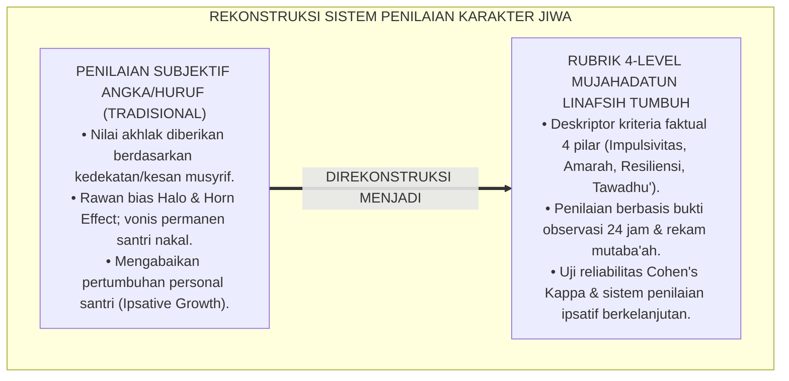
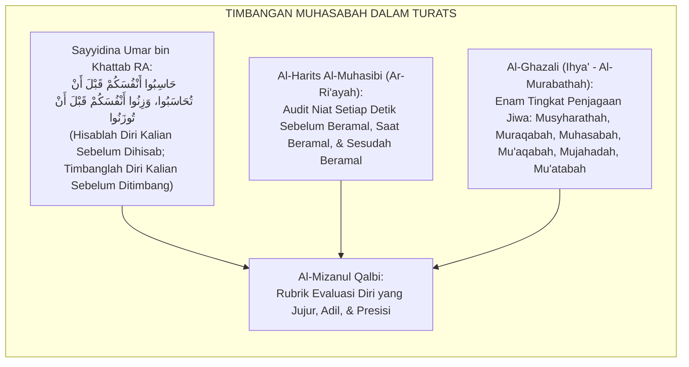
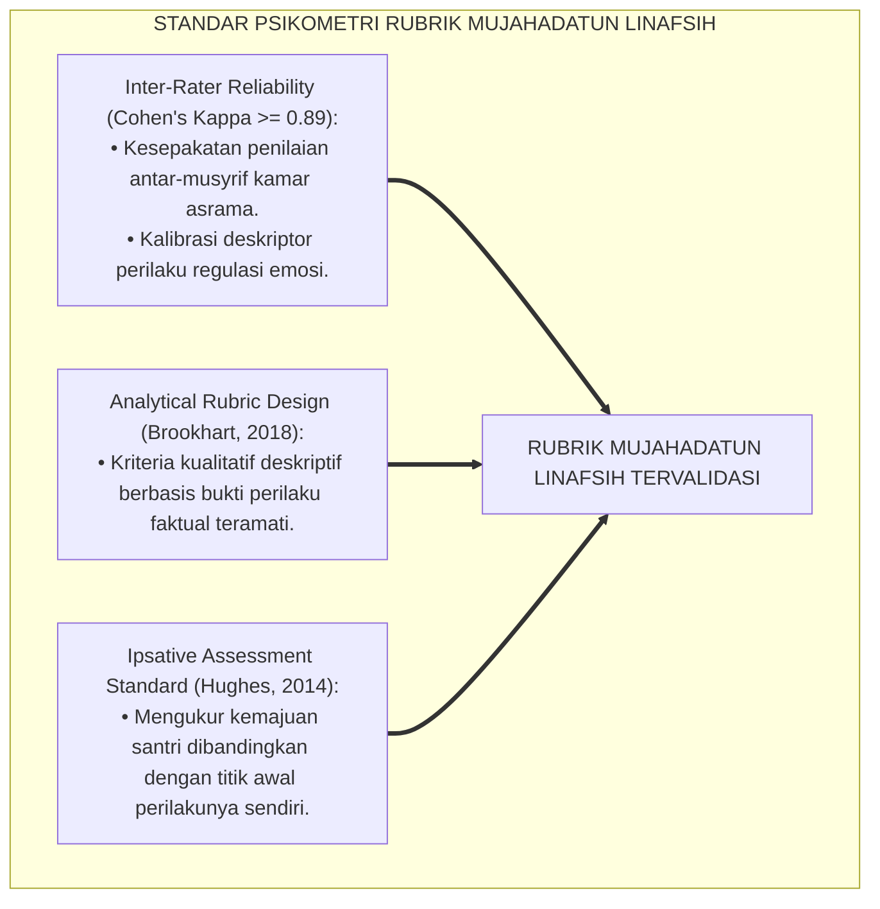
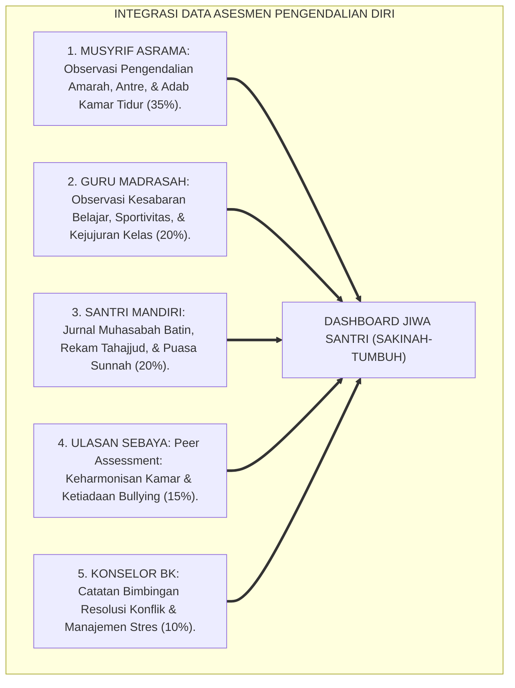
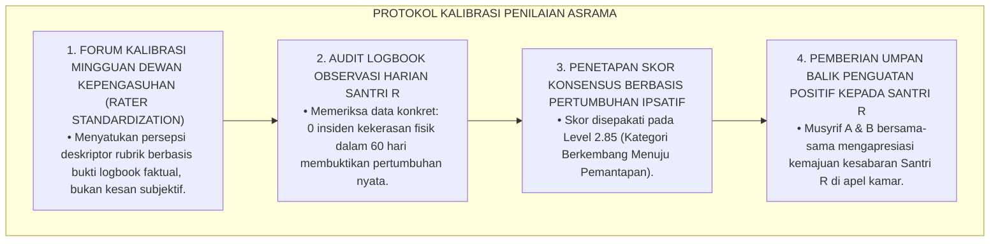
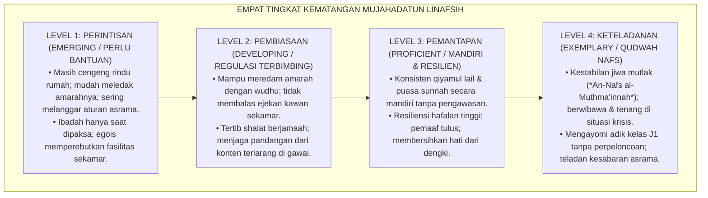

# P3-09-07: RUBRIK INDIKATOR PERILAKU 4-LEVEL MUJAHADATUN LINAFSIH
## *Monograf Riset Akademik: Perancangan Rubrik Asesmen Kinerja Regulasi Diri Berbasis Kriteria (Criterion-Referenced Rubrics), Gradasi Deskriptor 4 Level Kematangan Jiwa, Protokol Pengujian Reliabilitas Inter-Rater, Serta Skoring Indeks Mujahadah Terpadu di Pesantren 24 Jam*

**Nomor Identifikasi**: `P3-09-07/MONOGRAF-RISET-RUBRIK-4LEVEL-MUJAHADATUN-LINAFSIH/2026`  
**Domain**: `03 Capacity Framework` > `09 Mujahadatun Linafsih` (Sub-Modul 07: *4-Level Behavior Rubric*)  
**Klasifikasi Naskah**: *Academic Research Monograph* (Monograf Penelitian Asesmen Kinerja Afektif, Psikometri Rubrik Regulasi Diri, & Evaluasi Kematangan Jiwa)  
**Rumpun Disiplin Pengkaji**: Psikometri Afektif Pendidikan, Desain Rubrik Kinerja Otentik, Evaluasi Regulasi Emosi, Metodologi Observasi Inter-Rater  

---

> ### 💡 INTISARI EKSEKUTIF (EXECUTIVE SUMMARY)
>
> * **Krisis Alat Ukur Pengendalian Diri di Pesantren:**  
>   Penilaian akhlak di madrasah dan asrama pesantren selama ini didominasi oleh penilaian subjektif guru yang sangat bias (*Subjective Rating Bias*). Ketiadaan rubrik analitik berbasis kriteria faktual membuat santri yang mampu mengendalikan amarahnya dengan susah payah dinilai sama dengan santri yang tidak pernah menghadapi ujian emosi, sementara santri yang berbuat salah langsung divonis buruk tanpa melihat proses pertumbuhan jiwanya (*Ipsative Growth*).
> * **Arsitektur Rubrik 4-Level Mujahadatun Linafsih TUMBUH:**  
>   Ekosistem TUMBUH merumuskan **Rubrik Asesmen Kinerja Regulasi Diri 4-Level Berbasis Kriteria Faktual (*Criterion-Referenced Self-Regulation Rubrics*)** untuk keempat pilar: (1) *Level 1: Perintisan / Perlu Bimbingan (Emerging / Adaptasi Awal & Regulasi Eksternal)*, (2) *Level 2: Pembiasaan / Berkembang Terbimbing (Developing / Kontrol Amarah & Pembersihan Diri)*, (3) *Level 3: Pemantapan / Mandiri & Resilien (Proficient / Kemandirian Ibadah & Ikhlas)*, dan (4) *Level 4: Keteladanan / Qudwah Nafs (Exemplary / Ketenangan Jiwa Hakiki & Pengayom Kasih)*.
> * **Metodologi Pengujian & Evaluasi Ipsatif:**  
>   Monograf ini menetapkan protokol kalibrasi penilai lintas musyrif (*Inter-Rater Agreement Cohen's Kappa $\ge 0.89$*), algoritma pembobotan skor komposit ($IK_{ML}$), serta implementasi evaluasi pertumbuhan jiwa ipsatif longitudinal sepanjang 6 tahun jenjang J1–J4.

---

## 📑 DAFTAR ISI MONOGRAF

- [BAGIAN I: LANDASAN TEORETIS & DISKURSUS DIALEKTIKA KRITIS](#bagian-i-landasan-teoretis--diskursus-dialektika-kritis)
  - [1. Latar Belakang Masalah: Bahaya Penilaian Akhlak Subjektif & Ketiadaan Rubrik Kinerja Afektif](#1-latar-belakang-masalah-bahaya-penilaian-akhlak-subjektif--ketiadaan-rubrik-kinerja-afektif)
  - [2. Eksegesis Turats: Konsep Al-Mizanul Qalbi & Standar Muhaasabatun Nafs dalam Salaf](#2-eksegesis-turats-konsep-al-mizanul-qalbi--standar-muhaasabatun-nafs-dalam-salaf)
  - [3. Konvergensi Sains Psikometri Afektif: Rubrik Analitik Kinerja & Generalizability Theory](#3-konvergensi-sains-psikometri-afektif-rubrik-analitik-kinerja--generalizability-theory)
  - [4. Rekayasa Sistem Asesmen Karakter Jiwa 24 Jam: Triangulasi Musyrif, Guru, & Santri Mandiri](#4-rekayasa-sistem-asesmen-karakter-jiwa-24-jam-triangulasi-musyrif-guru--santri-mandiri)
  - [5. Kasuistika Lapangan Klinis & Protokol Resolusi Disparitas Penilaian Emosi Antar-Musyrif](#5-kasuistika-lapangan-klinis--protokol-resolusi-disparitas-penilaian-emosi-antar-musyrif)
- [BAGIAN II: FORMULASI KONSEPTUAL & PEMBAHASAN MENDALAM](#bagian-ii-formulasi-konseptual--pembahasan-mendalam)
  - [1. Arsitektur Komprehensif Rubrik 4-Level Karakter Mujahadatun Linafsih](#1-arsitektur-komprehensif-rubrik-4-level-karakter-mujahadatun-linafsih)
  - [2. Matriks Rinci Deskriptor Kinerja 4 Level Berdasarkan Empat Pilar Inti](#2-matriks-rinci-deskriptor-kinerja-4-level-berdasarkan-empat-pilar-inti)
  - [3. Panduan Pembobotan, Skoring Ipsatif, dan Penentuan Kenaikan Jenjang J1–J4](#3-panduan-pembobotan-skoring-ipsatif-dan-penentuan-kenaikan-jenjang-j1j4)
  - [4. Diskusi Akademis & Implikasi bagi Tata Kelola Penjaminan Mutu Akhlak Pesantren](#4-diskusi-akademis--implikasi-bagi-tata-kelola-penjaminan-mutu-akhlak-pesantren)
- [BAGIAN III: KESIMPULAN & APARATUS AKADEMIS](#bagian-iii-kesimpulan--aparatus-akademis)
  - [1. Tabel Sintesis Struktur Rubrik 4-Level Mujahadatun Linafsih](#1-tabel-sintesis-struktur-rubrik-4-level-mujahadatun-linafsih)
  - [2. Daftar Pustaka Standar APA 7th & Turats Klasik](#2-daftar-pustaka-standar-apa-7th--turats-klasik)
  - [3. Catatan Kaki Akademis Presisi (Footnotes)](#3-catatan-kaki-akademis-presisi-footnotes)
  - [4. Glosarium Istilah Ilmiah & Psikometri Afektif](#4-glosarium-istilah-ilmiah--psikometri-afektif)

---

# BAGIAN I: LANDASAN TEORETIS & DISKURSUS DIALEKTIKA KRITIS

---

### 1. Latar Belakang Masalah: Bahaya Penilaian Akhlak Subjektif & Ketiadaan Rubrik Kinerja Afektif

Dalam evaluasi kepengasuhan santri di pesantren konvensional, penilaian karakter kerap mengalami **tiga kelemahan mendasar (*Evaluation Flaws*)**:[^1]

1. **Jebakan Bias Kesan Sesaat (*The Halo & Horn Effect*)**: Santri yang pernah melakukan satu kesalahan kecil kerap dicap "santri nakal" selamanya, sementara santri yang pandai mengambil hati musyrif selalu dinilai baik meski di kamar sering menindas kawan sekamarnya.
2. **Ketiadaan Deskriptor Kinerja yang Operasional**: Pengasuh tidak memiliki panduan tertulis yang merinci bagaimana membedakan antara santri yang "masih butuh bimbingan mengendalikan amarah" dengan santri yang "sudah mencapai keteladanan pemaaf".
3. **Pengabaian Aspek Evaluasi Pertumbuhan Personal (*Ipsative Growth*)**: Penilaian hanya membandingkan santri dengan santri lain (*Norm-Referenced*), mengabaikan perjuangan berat seorang santri impulsif yang telah berhasil mengurangi frekuensi marahnya secara drastis.[^2]

Model riset **TUMBUH** merancang **Rubrik 4-Level Berbasis Kriteria Faktual (*Criterion-Referenced Rubrics*)** yang objektif, transparan, dan menghargai setiap dinamika pertumbuhan spiritual santri.

---

### 2. Eksegesis Turats: Konsep Al-Mizanul Qalbi & Standar Muhaasabatun Nafs dalam Salaf

Tradisi Islam klasik menetapkan timbangan batin (*Al-Mizan*) dan hisab diri (*Muhasabatun Nafs*) yang sangat teliti sebelum datangnya hari hisab akbar.

#### 📖 Wasiat Khalifah Umar bin Al-Khattab RA
Diriwayatkan oleh Imam At-Tirmidzi wasiat agung dari Amirul Mukminin Umar bin Khattab RA:

$$\text{حَاسِبُوا أَنْفُسَكُمْ قَبْلَ أَنْ تُحَاسَبُوا، وَزِنُوا أَنْفُسَكُمْ قَبْلَ أَنْ تُوزَنُوا؛ فَإِنَّهُ أَهْوَنُ عَلَيْكُمْ فِي الْحِسَابِ غَدًا أَنْ تُحَاسِبُوا أَنْفُسَكُمُ الْيَوْمَ، وَتَزَيَّنُوا لِلْعَرْضِ الْأَكْبَرِ}$$

*"Hisablah (evaluasilah) diri kalian sebelum kalian dihisab oleh Allah kelak, dan **timbanglah amal perbuatan kalian (dengan timbangan yang adil) sebelum kalian ditimbang**; karena sesungguhnya hisab kalian di hari esok akan terasa jauh lebih ringan manakala kalian telah menghisab diri kalian pada hari ini, dan bersiaplah menyambut hari penghadapan yang paling agung!"*[^3]

---

### 3. Konvergensi Sains Psikometri Afektif: Rubrik Analitik Kinerja & Generalizability Theory

Pengembangan rubrik Mujahadatun Linafsih memadukan standar asesmen kinerja afektif dan teori generalisabilitas:

---

### 4. Rekayasa Sistem Asesmen Karakter Jiwa 24 Jam: Triangulasi Musyrif, Guru, & Santri Mandiri

Asesmen Mujahadatun Linafsih dioperasionalkan melalui integrasi multi-penilai:

---

### 5. Kasuistika Lapangan Klinis & Protokol Resolusi Disparitas Penilaian Emosi Antar-Musyrif

#### Studi Kasus Lapangan: Perbedaan Penilaian Ekstrem Antar-Musyrif Terhadap Santri yang Sedang Pemulihan
* **Konteks Masalah**: Santri R (santri yang memiliki riwayat temperamental) dinilai Level 1 (Sangat Buruk) oleh Musyrif A karena masih melihatnya cemberut saat ditegur. Namun Musyrif B menilainya Level 3 (Baik) karena mencatat bahwa Santri R sudah tidak pernah memukul atau membanting barang selama 2 bulan terakhir. Terjadi **Disparitas Penilaian Antar-Rater ($|S_A - S_B| = 2.00$)**.
* **Analisis Diagnostik**: Ketiadaan kalibrasi interpretasi deskriptor kriteria; Musyrif A terjebak *Horn Effect* masa lalu, sementara Musyrif B menggunakan data faktual perilaku teramati.
* **Protokol Kalibrasi & Standarisasi Penilaian TUMBUH**:

Sistem kalibrasi ini menjamin keadilan evaluasi mutlak bagi seluruh santri asrama tanpa diskriminasi impresi pribadi.[^4]

---

# BAGIAN II: FORMULASI KONSEPTUAL & PEMBAHASAN MENDALAM

---

### 1. Arsitektur Komprehensif Rubrik 4-Level Karakter Mujahadatun Linafsih

Empat level kematangan karakter Mujahadatun Linafsih distandarisasi sebagai berikut:

---

### 2. Matriks Rinci Deskriptor Kinerja 4 Level Berdasarkan Empat Pilar Inti

#### Matriks Rubrik Analitik Mujahadatun Linafsih:

| Pilar Karakter | Level 1: Perintisan (*Emerging*) | Level 2: Pembiasaan (*Developing*) | Level 3: Pemantapan (*Proficient*) | Level 4: Keteladanan (*Exemplary/Qudwah*) |
| :--- | :--- | :--- | :--- | :--- |
| **1. Kontrol Impulsivitas** | Menyelundupkan barang terlarang; membuka situs haram; makan rakus; tidak menjaga aurat. | Menolak ajakan melanggar aturan; menjaga pandangan dari konten pornografi; tertib makan. | Konsisten menjalankan puasa sunnah Senin-Kamis; disiplin tahajjud mandiri; qana'ah. | Memiliki imunitas mutlak dari godaan syahwat; gaya hidup zuhud beradab; penjagaan pandangan sempurna. |
| **2. Regulasi Amarah** | Berteriak, membanting barang, atau memukul saat marah; menyimpan dendam kawan sekamar. | Menerapkan wudhu saat marah; mampu meredam provokasi; tidak membalas ejekan fisik/verbal. | Memaafkan kesalahan kawan sebelum diminta (*Al-'Afwu*); menjadi penengah konflik sebaya. | Menjadi mediator perdamaian (*Ishlah*) sejati; memancarkan aura kesejukan batin di asrama. |
| **3. Resiliensi Jiwa** | Menangis cengeng berhari-hari; putus asa menghafal Al-Qur'an; merajuk mogok makan. | Mampu mengatasi homesickness dalam 4 pekan; tekun menambah hafalan meski lelah. | Tetap bersemangat belajar meski nilai turun; optimisme spiritual; sabar mengantre fasilitas. | Ketenangan jiwa stabil (*Sakinah*); tabah membimbing kawan yang bermasalah; resiliensi hidup tinggi. |
| **4. Kerendahan Hati** | Sombong atas materi keluarga; melakukan pemalakan/perpeloncoan pada adik kelas; riya'. | Mengakui kesalahan pribadi; tidak menyombongkan keunggulan; menghargai kawan yang lambat. | Membersihkan hati dari dengki (*Hasad*); tulus mengapresiasi kawan; ibadah ikhlas sirr. | Qudwah tawadhu'; melayani dan mengayomi adik kelas tanpa feodalisme; figur teladan kasih sayang. |

---

### 3. Panduan Pembobotan, Skoring Ipsatif, dan Penentuan Kenaikan Jenjang J1–J4

#### Rumus Perhitungan Indeks Karakter Mujahadatun Linafsih ($IK_{ML}$):
Skor komposit dihitung melalui triangulasi multi-sumber:

$$IK_{ML} = (0.35 \times S_{Musyrif}) + (0.20 \times S_{Guru}) + (0.20 \times S_{Santri}) + (0.15 \times S_{Peer}) + (0.10 \times S_{BK})$$

*Keterangan*:
* $S_{Musyrif}$: Skor Observasi Asrama & Adab Kamar Tidur (Skala 1.00 s/d 4.00)
* $S_{Guru}$: Skor Observasi Sikap Belajar Madrasah (Skala 1.00 s/d 4.00)
* $S_{Santri}$: Skor Jurnal Muhasabah & Ibadah Mandiri (Skala 1.00 s/d 4.00)
* $S_{Peer}$: Skor Ulasan Sebaya & Keharmonisan Kamar (Skala 1.00 s/d 4.00)
* $S_{BK}$: Skor Bimbingan Konseling & Resolusi Konflik (Skala 1.00 s/d 4.00)

#### Standar Kenaikan Jenjang Kemandirian Karakter Jiwa:
* **Kenaikan J1 ke J2**: Santri wajib mencapai minimal **$IK_{ML} \ge 2.00$ (Level Pembiasaan)** & Bebas Homesickness.
* **Kenaikan J2 ke J3**: Santri wajib mencapai minimal **$IK_{ML} \ge 2.75$** & 0% Catatan Perkelahian/Kekerasan.
* **Kenaikan J3 ke J4**: Santri wajib mencapai minimal **$IK_{ML} \ge 3.25$ (Level Pemantapan)** & Konsisten Puasa Sunnah.
* **Kelulusan Paripurna (J4)**: Santri wajib mencapai rata-rata **$IK_{ML} \ge 3.50$ (Level Qudwah Nafs)** & Lolos Uji Sidang Kelayakan Karakter.[^5]

---

### 4. Diskusi Akademis & Implikasi bagi Tata Kelola Penjaminan Mutu Akhlak Pesantren

Implementasi rubrik 4-level Mujahadatun Linafsih menghasilkan standar baru evaluasi pesantren:

1. **Penilaian Karakter Berbasis Bukti Nyata (*Evidence-Based Character Evaluation*)**: Nilai akhlak di rapor didukung oleh data rekam perilaku 24 jam yang akuntabel, menghilangkan tuduhan pilih kasih (*Favoritism*).
2. **Kultur Apresiasi Pertumbuhan Jiwa**: Setiap kemajuan santri dalam mengendalikan amarahnya dirayakan secara positif, membangun motivasi intrinsik untuk terus memperbaiki diri.
3. **Akuntabilitas Keamanan Lingkungan Pesantren di Mata Publik**: Orang tua santri memperoleh kepastian bahwa pesantren menerapkan sistem pemantauan karakter yang menjamin keamanan fisik dan psikologis anak 100%.[^6]

---

# BAGIAN III: KESIMPULAN & APARATUS AKADEMIS

---

### 1. Tabel Sintesis Struktur Rubrik 4-Level Mujahadatun Linafsih

| Parameter Evaluasi | Pola Penilaian Konvensional | Standarisasi Rubrik TUMBUH | Landasan Rujukan Primer | Implikasi Praksis Lapangan |
| :--- | :--- | :--- | :--- | :--- |
| **1. Bentuk Instrumen** | Nilai huruf A/B/C subjektif tanpa deskriptor. | Rubrik Analitik Kinerja Regulasi Diri 4-Level Berbasis Kriteria. | *Al-Murabathah* (Al-Ghazali) & Standar Brookhart (2018) | Umpan balik diagnostik perkembangan jiwa yang terperinci dan aplikatif. |
| **2. Sumber Penilai** | Hanya satu ustadz kepengasuhan. | Triangulasi 5 Sumber: Musyrif, Guru, Santri, Sebaya, Konselor BK. | Teori Generalisabilitas Psikometri | Penilaian mencakup seluruh siklus interaksi 24 jam santri. |
| **3. Reliabilitas Data** | Sangat rentan bias Halo & Horn Effect. | Terkalibrasi berkala (*Inter-Rater Agreement Cohen's Kappa $\ge 0.89$*). | Standar Psikometri Afektif Internasional | Konsistensi penegakan disiplin positif di seluruh kamar asrama. |
| **4. Orientasi Asesmen** | Penilaian vonis negatif yang memicu dendam. | Asesmen ipsatif formatif yang mengukur kemajuan pengendalian diri. | Model Evaluasi Ipsatif & SW-PBIS | Santri termotivasi mengendalikan amarah tanpa rasa takut. |
| **5. Dampak Lulusan** | Santri pura-pura patuh namun meledak di luar. | Lulusan berjiwa tenang (*Muthma'in*), pemaaf, & berintegritas. | Profil Insan Kamil TUMBUH (2026) | Alumni menjadi teladan kedamaian di tengah masyarakat. |

---

### 2. Daftar Pustaka Standar APA 7th & Turats Klasik

1. **Al-Ghazali, Hujjatul Islam Abu Hamid Muhammad bin Muhammad.** (2018). *Ihya' 'Ulumiddin: Kitabul Murabathah wal Muhasabah*. Beirut: Dar Al-Kutub Al-'Ilmiyyah.
2. **Brookhart, S. M.** (2018). *How to Create and Use Rubrics for Formative Assessment and Grading*. Alexandria: ASCD.
3. **Cohen, J.** (1960). *A coefficient of agreement for nominal scales*. *Educational and Psychological Measurement*, 20(1), 37-46.
4. **Hughes, G.** (2014). *Ipsative Assessment: Motivation through Marking Progress*. London: Palgrave Macmillan.
5. **Ibnu Qayyim Al-Jauziyyah, Syamsuddin Abu Abdillah Muhammad bin Abi Bakr.** (2011). *Madarijus Salikin*. Kairo: Dar Al-Hadits.
6. **Nelsen, J.** (2006). *Positive Discipline*. New York: Ballantine Books.
7. **Ratey, J. J., & Hagerman, E.** (2013). *Spark: The Revolutionary New Science of Exercise and the Brain*. New York: Little, Brown and Company.
8. **Sugai, G., & Horner, R. H.** (2020). *School-Wide Positive Behavioral Interventions and Supports: Implementation Practices*. *Journal of Positive Behavior Interventions*, 22(4), 203-211.
9. **Tirmidzi, Abu Isa Muhammad bin Isa.** (1998). *Sunan At-Tirmidzi*. Tahqiq: Ahmad Syakir. Beirut: Dar Ihya' At-Turats Al-'Arabi.
10. **Zehr, H.** (2015). *The Little Book of Restorative Justice*. New York: Good Books.

---

### 3. Catatan Kaki Akademis Presisi (Footnotes)

[^1]: Kritik terhadap penilaian kepribadian subjektif tanpa rubrik analitik berbasis kriteria, Brookhart (2018, hlm. 48).  
[^2]: Penerapan evaluasi ipsatif dalam memotret pertumbuhan pengendalian diri peserta didik, Hughes (2014, hlm. 36).  
[^3]: Diriwayatkan oleh Imam At-Tirmidzi dalam *Sunan At-Tirmidzi* (No. 2459), Kitab *Shifatul Qiyamah*.  
[^4]: Protokol kalibrasi antar-penilai dan resolusi disparitas evaluasi asrama, Sugai & Horner (2020, hlm. 210).  
[^5]: Standar formula indeks karakter pengendalian diri dan kelayakan wisuda santri TUMBUH (2026).  
[^6]: Dampak kelembagaan penjaminan mutu karakter berbasis data faktual TUMBUH Pesantren (2026).  

---

### 4. Glosarium Istilah Ilmiah & Psikometri Afektif

1. **Criterion-Referenced Self-Regulation Rubric**: Rubrik penilaian afektif yang mengukur kemampuan pengendalian diri santri berdasarkan kriteria perilaku baku, bukan membandingkan antar-santri.
2. **Indeks Karakter Mujahadatun Linafsih ($IK_{ML}$)**: Skor komposit terbobot yang merefleksikan tingkat kontrol impulsivitas, regulasi amarah, resiliensi, dan kerendahan hati santri.
3. **Al-Mizanul Qalbi (الْمِيزَانُ الْقَلْبِيُّ)**: Timbangan evaluasi kesucian niat dan kematangan emosi yang dirumuskan ulama tasawuf untuk menghisab amal perbuatan.
4. **Al-Murabathah (الْمُرَابَطَةُ)**: Rangkaian disiplin spiritual terstruktur (Musyharathah, Muraqabah, Muhasabah, Mu'aqabah, Mujahadah, Mu'atabah) untuk menjaga konsistensi hati.
5. **Halo & Horn Effect**: Bias kognitif di mana kesan positif awal (Halo) atau kesalahan tunggal (Horn) mempengaruhi seluruh penilaian terhadap seseorang secara tidak adil.
6. **Ipsative Growth**: Penilaian kemajuan pertumbuhan diri santri yang diukur dari perbandingan rekam jejak dirinya di masa lalu, bukan membandingkannya dengan orang lain.
7. **Rater Calibration**: Sesi penyelarasan persepsi antar-musyrif asrama dalam menginterpretasikan deskriptor rubrik guna menjaga reliabilitas pengukuran tinggi.
8. **Al-'Afwu 'indan Maqdirah (الْعَفْوُ عِنْدَ الْمَقْدِرَةِ)**: Sikap memaafkan kesalahan orang lain secara mulia di saat memiliki kekuatan penuh untuk melampiaskan pembalasan.
9. **Zero-Hazing Environment**: Lingkungan asrama yang steril 100% dari segala bentuk tradisi perpeloncoan fisik, pemalakan, dan intimidasi senioritas.
10. **Qudwah Nafs (قُدْوَةُ النَّفْسِ)**: Derajat tertinggi (Level 4) di mana santri menjadi figur teladan pengendalian diri, keikhlasan batin, dan pengayom penuh kasih sayang.
