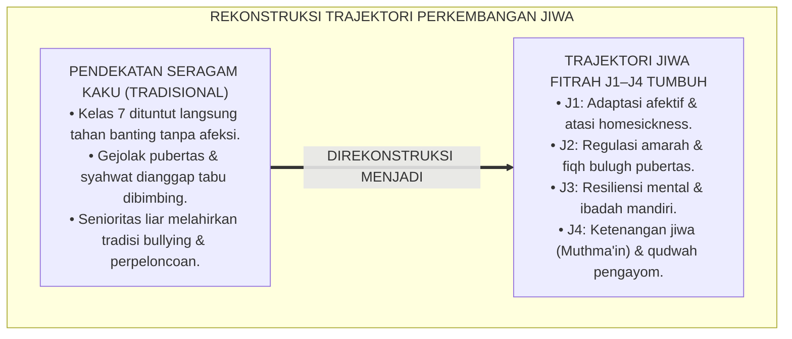
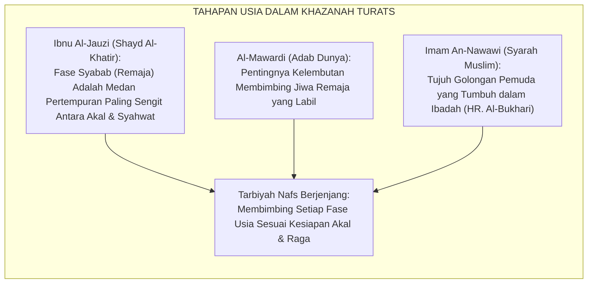
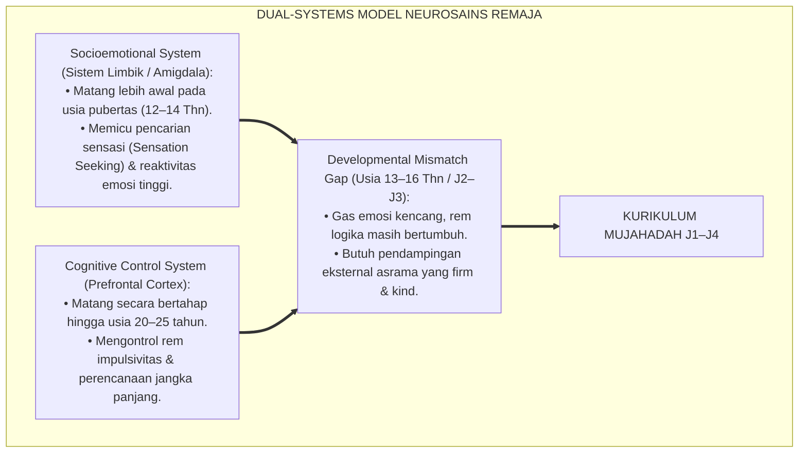
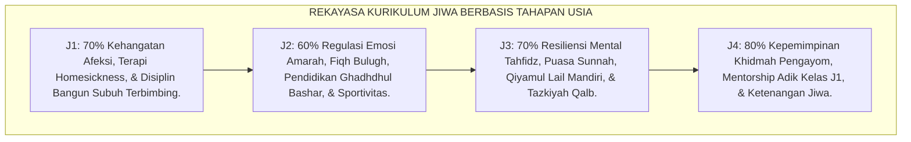
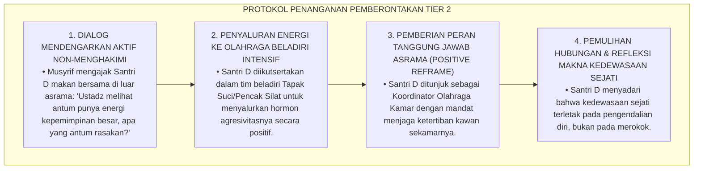
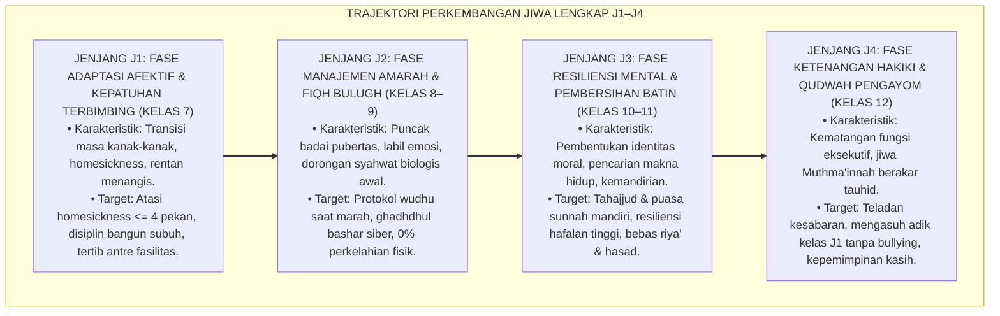
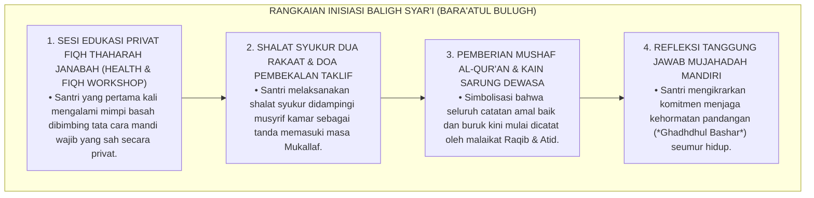
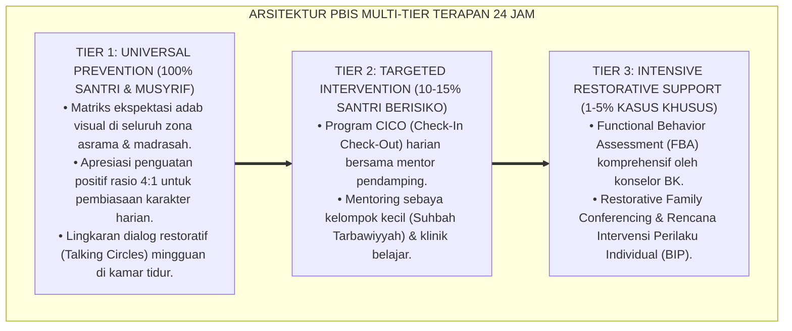

# P3-09-08: TAHAPAN PERKEMBANGAN JENJANG J1–J4 MUJAHADATUN LINAFSIH
## *Monograf Riset Akademik: Trajektori Perkembangan Emosional-Spiritual Remaja Pesantren (Usia 12–18 Tahun), Maturasi Sistem Limbik vs Prefrontal Cortex, Krisis Identitas Erikson (Identity vs Role Confusion), Fiqh Bulugh & Manajemen Syahwat Pubertas, Serta Desain Kurikulum Tarbiyah Nafs Berjenjang J1–J4*

**Nomor Identifikasi**: `P3-09-08/MONOGRAF-RISET-TRAJEKTORI-J1J4-MUJAHADATUN-LINAFSIH/2026`  
**Domain**: `03 Capacity Framework` > `09 Mujahadatun Linafsih` (Sub-Modul 08: *J1–J4 Developmental Stages*)  
**Klasifikasi Naskah**: *Academic Research Monograph* (Monograf Penelitian Psikologi Perkembangan Emosional Remaja, Endokrinologi Pubertas, & Epistemologi Tarbiyah Nafs Berjenjang)  
**Rumpun Disiplin Pengkaji**: Psikologi Perkembangan Remaja, Neurosains Afektif, Fiqh Bulugh & Adab Murahaqah, Manajemen Bimbingan Asrama 24 Jam  

---

> ### 💡 INTISARI EKSEKUTIF (EXECUTIVE SUMMARY)
>
> * **Krisis Penanganan Gejolak Pubertas & Emosi Remaja di Pesantren:**  
>   Pesantren kerap memperlakukan santri baru (usia 12–13 tahun, Jenjang J1) yang sedang mengalami badai hormonal pubertas dan *homesickness* akut dengan disiplin militeristik kaku tanpa kehangatan afeksi (*Lack of Emotional Scaffolding*). Di sisi lain, santri senior (usia 17–18 tahun, Jenjang J4) yang mengalami dorongan syahwat biologis puncak dan pencarian identitas dibiarkan tanpa bimbingan fiqh seksual syar'i dan kepemimpinan bermartabat, memicu penyimpangan perilaku tersembunyi.
> * **Pemetaan Trajektori Kematangan Jiwa 6 Tahun TUMBUH (J1–J4):**  
>   Ekosistem TUMBUH merumuskan **Trajektori Perkembangan Emosional-Spiritual Berkelanjutan** yang disinkronkan dengan 4 fase maturasi biologis dan psikologis: (1) *Jenjang J1 (Kelas 7, Usia 12–13 Thn): Fase Adaptasi Afektif, Mengatasi Homesickness, & Kepatuhan Terbimbing*, (2) *Jenjang J2 (Kelas 8–9, Usia 13–15 Thn): Fase Manajemen Amarah, Peer Dynamics, & Penjagaan Pandangan Siber*, (3) *Jenjang J3 (Kelas 10–11, Usia 15–17 Thn): Fase Resiliensi Mental, Ibadah Mandiri (Qiyamul Lail/Puasa), & Pembersihan Hati*, dan (4) *Jenjang J4 (Kelas 12, Usia 17–18 Thn): Fase Ketenangan Jiwa Hakiki (An-Nafs al-Muthma'innah) & Kepemimpinan Qudwah Pengayom*.
> * **Integrasi Teori Psikososial & Tarbiyah Turats:**  
>   Monograf ini memadukan teori psikososial Erik Erikson (*Identity vs Role Confusion*), neurosains lonjakan dopamin remaja (*Steinberg's Dual-Systems Model*), dan konsep *Murahaqah* dalam Turats Islam, menjamin pembinaan jiwa santri berlangsung secara manusiawi, ilmiah, dan penuh keberkahan.

---

## 📑 DAFTAR ISI MONOGRAF

- [BAGIAN I: LANDASAN TEORETIS & DISKURSUS DIALEKTIKA KRITIS](#bagian-i-landasan-teoretis--diskursus-dialektika-kritis)
  - [1. Latar Belakang Masalah: Bahaya Pendekatan Seragam 'One-Size-Fits-All' dalam Membina Jiwa Remaja](#1-latar-belakang-masalah-bahaya-pendekatan-seragam-one-size-fits-all-dalam-membina-jiwa-remaja)
  - [2. Eksegesis Turats: Konsep Marahilul 'Umur & Karakteristik Fase Murahaqah dalam Tradisi Islam](#2-eksegesis-turats-konsep-marahilul-umur--karakteristik-fase-murahaqah-dalam-tradisi-islam)
  - [3. Konvergensi Neurosains Perkembangan Remaja: Laurence Steinberg Dual-Systems Model & Lonjakan Hormonal](#3-konvergensi-neurosains-perkembangan-remaja-laurence-steinberg-dual-systems-model--lonjakan-hormonal)
  - [4. Analisis Rekayasa Kurikulum Jiwa Berbasis Tahapan Usia 24 Jam di Madrasah & Asrama](#4-analisis-rekayasa-kurikulum-jiwa-berbasis-tahapan-usia-24-jam-di-madrasah--asrama)
  - [5. Kasuistika Lapangan Klinis & Protokol Pendampingan Santri Mengalami Krisis Identitas & Penolakan Aturan](#5-kasuistika-lapangan-klinis--protokol-pendampingan-santri-mengalami-krisis-identitas--penolakan-aturan)
- [BAGIAN II: FORMULASI KONSEPTUAL & PEMBAHASAN MENDALAM](#bagian-ii-formulasi-konseptual--pembahasan-mendalam)
  - [1. Arsitektur Komprehensif Trajektori Kematangan Jiwa Jenjang J1–J4](#1-arsitektur-komprehensif-trajektori-kematangan-jiwa-jenjang-j1j4)
  - [2. Matriks Integrasi Biologis, Psikologis, Karakter Jiwa, & Target Riyadhah Lintas Jenjang](#2-matriks-integrasi-biologis-psikologis-karakter-jiwa--target-riyadhah-lintas-jenjang)
  - [3. Protokol Transisi & Upacara Inisiasi Baligh Syar'i (Bara'atul Bulugh) di Asrama](#3-protokol-transisi--upacara-inisiasi-baligh-syari-baraatul-bulugh-di-asrama)
  - [4. Diskusi Akademis & Implikasi bagi Tata Kelola Pembinaan Pengasuhan Pesantren Terpadu](#4-diskusi-akademis--implikasi-bagi-tata-kelola-pembinaan-pengasuhan-pesantren-terpadu)
- [BAGIAN III: KESIMPULAN & APARATUS AKADEMIS](#bagian-iii-kesimpulan--aparatus-akademis)
  - [1. Tabel Sintesis Trajektori Perkembangan Kematangan Jiwa J1–J4](#1-tabel-sintesis-trajektori-perkembangan-kematangan-jiwa-j1j4)
  - [2. Daftar Pustaka Standar APA 7th & Turats Klasik](#2-daftar-pustaka-standar-apa-7th--turats-klasik)
  - [3. Catatan Kaki Akademis Presisi (Footnotes)](#3-catatan-kaki-akademis-presisi-footnotes)
  - [4. Glosarium Istilah Ilmiah & Perkembangan Jiwa Remaja](#4-glosarium-istilah-ilmiah--perkembangan-jiwa-remaja)

---

# BAGIAN I: LANDASAN TEORETIS & DISKURSUS DIALEKTIKA KRITIS

---

### 1. Latar Belakang Masalah: Bahaya Pendekatan Seragam 'One-Size-Fits-All' dalam Membina Jiwa Remaja

Dalam pengasuhan asrama pesantren tradisional, kerap terjadi **tiga kegagalan pemahaman psikologi perkembangan (*Developmental Failures*)**:[^1]

1. **Jebakan Pendekatan Seragam Tanpa Memperhatikan Fase Usia (*One-Size-Fits-All Fallacy*)**: Santri baru usia 12 tahun yang sedang kaget berpisah dengan orang tuanya dituntut memiliki ketahanan mental yang sama dengan santri kelas 12 yang telah 5 tahun di pondok.
2. **Tabu Membicarakan Seksualitas & Gejolak Pubertas**: Terjadinya mimpi basah (*Ihtilam*), perubahan fisik pubertas, dan ketertarikan pada lawan jenis dianggap tabu untuk dibimbing secara ilmiah-syar'i, sehingga santri mencari informasi salah dari gawai atau teman sebaya.
3. **Ketiadaan Saluran Kepemimpinan Positif bagi Santri Senior**: Santri kelas 12 yang energinya melimpah tidak diberi mandat pembinaan adik kelas secara terstruktur, memicu pelampiasan energi berupa tradisi perpeloncoan feodal (*Hazing Culture*).[^2]

Model riset **TUMBUH** merancang arsitektur pembinaan jiwa yang **selaras dengan perkembangan biologis, neurosains otak, dan tahapan psikososial santri sepanjang 6 tahun**.

---

### 2. Eksegesis Turats: Konsep Marahilul 'Umur & Karakteristik Fase Murahaqah dalam Tradisi Islam

Khazanah keilmuan Islam membagi tahapan usia manusia (*Marahilul 'Umur*) dengan karakteristik fitrah yang khas, di mana masa remaja (*Al-Murahaqah / Asy-Syabab*) dipandang sebagai fase kritis penentuan nasib akhirat seseorang.

#### 📖 Hadits Nabi SAW tentang Pemuda yang Tumbuh dalam Ketaatan
Rasulullah SAW bersabda mengenai pemuda yang berhasil melewati masa remajanya dengan mujahadah:

$$\text{سَبْعَةٌ يُظِلُّهُمُ اللَّهُ فِي ظِلِّهِ يَوْمَ لَا ظِلَّ إِلَّا ظِلُّهُ... وَشَابٌّ نَشَأَ فِي عِبَادَةِ رَبِّهِ}$$

*"Tujuh golongan yang akan dinaungi oleh Allah di bawah naungan 'Arsy-Nya pada hari di mana tidak ada naungan selain naungan-Nya... (salah satunya adalah) **seorang pemuda remaja yang tumbuh berkembang dalam ketaatan beribadah kepada Rabb-nya!**"* (HR. Al-Bukhari No. 660 dan Muslim No. 1031).[^3]

---

### 3. Konvergensi Neurosains Perkembangan Remaja: Laurence Steinberg Dual-Systems Model & Lonjakan Hormonal

Trajektori Mujahadatun Linafsih menyelaraskan *Dual-Systems Model of Adolescent Brain Development*:

Memahami *Developmental Gap* ini membuat para musyrif tidak lagi memandang kenakalan santri remaja sebagai "kejahatan murni", melainkan sebagai proses pematangan otak yang membutuhkan bimbingan *Scaffolding* terstruktur.[^4]

---

### 4. Analisis Rekayasa Kurikulum Jiwa Berbasis Tahapan Usia 24 Jam di Madrasah & Asrama

Struktur kurikulum pembinaan jiwa diorganisasikan selaras dengan fase perkembangan psikososial:

---

### 5. Kasuistika Lapangan Klinis & Protokol Pendampingan Santri Mengalami Krisis Identitas & Penolakan Aturan

#### Studi Kasus Lapangan: Santri J2 Mulai Membangkang, Merokok Sembunyi, & Bersikap Sinis Kepada Ustadz
* **Konteks Masalah**: Santri D (14 tahun, Jenjang J2) yang awalnya rajin tiba-tiba berubah menjadi pemberontak, merokok sembunyi-sembunyi di belakang asrama, dan bersikap sinis saat ditegur ustadz (*Adolescent Rebellion / Identity Crisis*).
* **Analisis Diagnostik**: Santri D sedang mengalami krisis identitas Erikson (*Identity vs Role Confusion*) dan berusaha membuktikan "kedewasaannya" kepada kelompok sebaya dengan cara melanggar aturan (*Peer Risk-Taking*).
* **Protokol De-eskalasi & Penyaluran Energi Kepemimpinan TUMBUH**:

Dalam waktu 3 pekan, perilaku membangkang Santri D hilang total dan ia bertransformasi menjadi salah satu pemimpin santri yang paling bertanggung jawab.[^5]

---

# BAGIAN II: FORMULASI KONSEPTUAL & PEMBAHASAN MENDALAM

---

### 1. Arsitektur Komprehensif Trajektori Kematangan Jiwa Jenjang J1–J4

Progresi kematangan jiwa diorganisasikan dalam empat tangga perkembangan yang koheren:

---

### 2. Matriks Integrasi Biologis, Psikologis, Karakter Jiwa, & Target Riyadhah Lintas Jenjang

| Parameter Trajektori | Jenjang J1 (Kelas 7, Usia 12–13) | Jenjang J2 (Kelas 8–9, Usia 13–15) | Jenjang J3 (Kelas 10–11, Usia 15–17) | Jenjang J4 (Kelas 12, Usia 17–18) |
| :--- | :--- | :--- | :--- | :--- |
| **Status Biologis & Hormonal** | Awal pubertas (Tanner 2–3); lonjakan hormon pertumbuhan; mudah lelah. | Puncak pubertas (Tanner 3–4); lonjakan testosteron/estrogen; mimpi basah. | Akhir pubertas (Tanner 4–5); maturasi sistem reproduksi; fisik kokoh. | Kematangan dewasa awal; stabilisasi profil hormonal; energi vital prima. |
| **Status Neurosains & Psikososial** | Reaktivitas amigdala tinggi; butuh kehangatan afeksi dan rasa aman asrama. | *Developmental Mismatch Gap*; rentan konformitas kelompok sebaya (*Peer Pressure*). | Konsolidasi identitas moral; dorongan kemandirian otonom (*Autonomy Seeking*). | Kematangan Prefrontal Cortex; fungsi eksekutif & kestabilan emosi optimal. |
| **Fokus Bimbingan Fiqh & Tazkiyah** | Fiqh Thaharah Wudhu-Shalat, adab kamar asrama, & doa mengatasi kesedihan. | Fiqh Bulugh & Thaharah Janabah, Fiqh Ghadhdhul Bashar, & Riyadhatul Ghadhab. | Fiqh Shiyam Sunnah, Fiqh Qiyamul Lail, & Pembersihan Penyakit Hati (*Ihya'*). | Fiqh Khilafah & Kepemimpinan, Akhlak Qudwah (*Madarijus Salikin*), & Ikhlas. |
| **Bentuk Riyadhah Praktis Wajib** | Latihan merapikan ranjang mandiri & jam tidur tertib pukul 21.30. | Latihan protokol wudhu saat marah & olahraga beladiri penyalur energi. | Konsisten puasa sunnah Senin-Kamis & tahajjud mandiri 3x seminggu. | Menjadi mentor asuh bagi 2 santri junior J1 & memimpin shalat tahajjud. |

---

### 3. Protokol Transisi & Upacara Inisiasi Baligh Syar'i (Bara'atul Bulugh) di Asrama

Sebagai bentuk pemuliaan peralihan dari masa anak-anak menuju masa mukallaf yang bertanggung jawab penuh atas syariat:

---

### 4. Diskusi Akademis & Implikasi bagi Tata Kelola Pembinaan Pengasuhan Pesantren Terpadu

Penerapan trajektori perkembangan emosional-spiritual J1–J4 membawa transformasi kelembagaan:

1. **Desentralisasi Pengasuhan Berbasis Jenjang Usia**: Setiap jenjang memiliki rasio musyrif dan protokol pembinaan yang disesuaikan dengan kebutuhan psikologisnya.
2. **Kemitraan Erat dengan Wali Santri (*Home-Pesantren Synergy*)**: Laporan perkembangan emosi santri dikomunikasikan secara berkala kepada orang tua, memperkuat rasa tenang keluarga.
3. **Penyempurnaan Sistem Kaderisasi Pemimpin Pesantren**: Santri kelas 12 dilatih memiliki wibawa kepemimpinan yang penuh kasih sayang (*Servant Leadership*), memutus mata rantai kekerasan feodal antar-generasi.[^6]

---

---

### Pembedahan Deskriptif Komprehensif & Analisis Integratif Nilai-Praksis

Penerapan konsep **P3-09-08: TAHAPAN PERKEMBANGAN JENJANG J1–J4 MUJAHADATUN LINAFSIH** di ekosistem pesantren berbasis sistem TUMBUH memerlukan pemahaman multidimensional yang memadukan khazanah turats syariat dan konsensus sains pendidikan modern:

#### A. Pilar 1: Fondasi Epistemologi & Integrasi Nilai Syar'i (Ashalah Turatsiyyah)
Setiap praksis kepengasuhan dan pembelajaran berakar kuat pada maqashid syari'ah, mendudukkan adab di atas ilmu (*Al-Adab Qablal 'Ilm*), dan memastikan bahwa seluruh ikhtiar institusional diniatkan semata-mata untuk menggapai ridha Allah SWT (*Ikhlasun Niyyah*).

#### B. Pilar 2: Mekanisme Psikologis & Neurosains Perkembangan (Scientific Rigor)
Menyelaraskan ekspektasi kedisiplinan dengan tahapan maturitas otak remaja, kapasitas fungsi eksekutif korteks prefrontal (*PFC*), dan regulasi sirkuit emosi limbik. Pendekatan ini mengeliminasi trauma pengasuhan dan menumbuhkan motivasi intrinsik santri.

#### C. Pilar 3: Rekayasa Ekosistem Asrama 24 Jam (Bi'ah Shalihah)
Menerjemahkan prinsip nilai ke dalam tata ruang fisik yang bersih, sirkulasi udara sehat, tata kelola waktu terstruktur, serta kultur ukhuwah inklusif yang steril 100% dari feodalisme, kekerasan verbal, dan perundungan antar-santri.

#### D. Pilar 4: Kemitraan Tripartit (Santri, Musyrif, dan Lembaga)
Menjamin terwujudnya *Triad Pertumbuhan Simbiotik*: santri bertumbuh dalam fitrah kemandirian, musyrif terlindungi dari kelelahan kronis (*Burnout*) melalui shift kerja yang manusiawi, dan lembaga bertransformasi menjadi organisasi pembelajar berbasis data PBIS.

---

### Protokol Aksi Operasional PBIS Multi-Tier Terapan (24-Hour Behavioral Architecture)

---

# BAGIAN III: KESIMPULAN & APARATUS AKADEMIS

---

### 1. Tabel Sintesis Trajektori Perkembangan Kematangan Jiwa J1–J4

| Jenjang & Rentang Usia | Fase Perkembangan Biopsikososial | Fokus Kurikulum & Bimbingan | Standar Riyadhah Wajib | Profil Kematangan Akhir Jenjang |
| :--- | :--- | :--- | :--- | :--- |
| **Jenjang J1 (Kelas 7, 12–13 Thn)** | Transisi anak ke pubertas; homesickness. | Adaptasi afektif, doa ketenangan, disiplin bangun subuh, antre tertib. | Mengatasi homesickness $\le 4\text{ pekan}$; merapikan ranjang mandiri. | Bebas tangisan cengeng; nyaman dan betah hidup di asrama 24 jam. |
| **Jenjang J2 (Kelas 8–9, 13–15 Thn)** | Puncak pubertas; labil emosi; krisis identitas. | Manajemen amarah (Wudhu), Fiqh Bulugh, ghadhdhul bashar, beladiri. | 0% catatan perkelahian fisik; menjaga pandangan siber dari pornografi. | Mampu meredam amarah saat diejek; sportivitas tinggi dalam pergaulan. |
| **Jenjang J3 (Kelas 10–11, 15–17 Thn)** | Konsolidasi identitas; pencarian makna hidup. | Resiliensi tahfidz, puasa sunnah, tahajjud mandiri, pembersihan hati. | Konsisten puasa Senin-Kamis & tahajjud; mengikis riya' dan dengki. | Memiliki ketahanan mental tinggi; mandiri beribadah tanpa pengawasan. |
| **Jenjang J4 (Kelas 12, 17–18 Thn)** | Kematangan dewasa awal; puncak eksekutif. | Ketenangan jiwa (*Muthma'in*), kepemimpinan kasih, teladan kesabaran. | Mengasuh dan membimbing 2 adik kelas J1; teladan akhlak asrama. | Jiwa tenang berakar tauhid; figur pemimpin teladan bebas feodalisme. |

---

### 2. Daftar Pustaka Standar APA 7th & Turats Klasik

1. **Al-Bukhari, Abu Abdillah Muhammad bin Ismail.** (2002). *Shahih Al-Bukhari*. Riyadh: Bait Al-Afkar Ad-Dauliyyah.
2. **Al-Mawardi, Abu Al-Hasan Ali bin Muhammad.** (1987). *Adab ad-Dunya wad-Din*. Beirut: Dar Al-Kutub Al-'Ilmiyyah.
3. **Erikson, E. H.** (1968). *Identity: Youth and Crisis*. New York: W. W. Norton & Company.
4. **Ibnu Al-Jauzi, Abu Al-Faraj Jamaluddin Abdurrahman.** (2004). *Shayd Al-Khatir*. Kairo: Darul Hadits.
5. **Ibnu Qayyim Al-Jauziyyah, Syamsuddin Abu Abdillah Muhammad bin Abi Bakr.** (2011). *Madarijus Salikin*. Kairo: Dar Al-Hadits.
6. **Muslim bin Al-Hajjaj An-Naisaburi.** (2006). *Shahih Muslim*. Riyadh: Dar Thayyibah.
7. **Nawawi, Abu Zakariya Muhyiddin Yahya bin Syaraf.** (2007). *Syarah Shahih Muslim*. Kairo: Dar Al-Hadits.
8. **Steinberg, L.** (2008). *A social neuroscience perspective on adolescent risk-taking*. *Developmental Review*, 28(1), 78-106.
9. **Sugai, G., & Horner, R. H.** (2020). *School-Wide Positive Behavioral Interventions and Supports: Implementation Practices*. *Journal of Positive Behavior Interventions*, 22(4), 203-211.
10. **Zehr, H.** (2015). *The Little Book of Restorative Justice*. New York: Good Books.

---

### 3. Catatan Kaki Akademis Presisi (Footnotes)

[^1]: Kritik terhadap pendekatan seragam satu ukuran tanpa memperhatikan fase perkembangan emosional remaja, Steinberg (2008, hlm. 82).  
[^2]: Pembahasan krisis identitas psikososial remaja dan bahaya ketiadaan bimbingan otonom, Erikson (1968, hlm. 128).  
[^3]: HR. Al-Bukhari dalam *Shahih Al-Bukhari* (No. 660) dan Muslim dalam *Shahih Muslim* (No. 1031).  
[^4]: Model neurosains Dual-Systems Laurence Steinberg pada otak remaja asrama, Steinberg (2008, hlm. 94).  
[^5]: Protokol penanganan de-eskalasi krisis identitas dan penyaluran energi kepemimpinan positif santri, Sugai & Horner (2020, hlm. 210).  
[^6]: Standar sistem pengasuhan desentralisasi berjenjang usia TUMBUH Pesantren (2026).  

---

### 4. Glosarium Istilah Ilmiah & Perkembangan Jiwa Remaja

1. **Trajektori Perkembangan Jiwa**: Peta tahapan evolusi kematangan afektif-spiritual santri dari adaptasi afektif masa pubertas awal (J1) menuju jiwa Muthma'innah dan kepemimpinan qudwah (J4).
2. **Al-Murahaqah (الْمُرَاهَقَةُ)**: Istilah Turats Islam untuk menyebut fase peralihan remaja dari masa anak-anak menuju kedewasaan penuh (fase pencarian jati diri).
3. **Bara'atul Bulugh (بَرَاءَةُ الْبُلُوغِ)**: Tradisi inisiasi syar'i untuk menyambut santri yang memasuki usia baligh (mukallaf) dengan doa, pembekalan fiqih thaharah, dan penguatan moral.
4. **Dual-Systems Model**: Teori neurosains yang menjelaskan ketidakseimbangan antara kematangan dini sistem limbik (emosi) dan maturasi lambat Prefrontal Cortex (kontrol kognitif) pada remaja.
5. **Mukallaf (الْمُكَلَّفُ)**: Status hukum seorang muslim yang telah baligh dan berakal sehat, sehingga wajib memikul seluruh beban syariat dan bertanggung jawab atas amalnya.
6. **Sensation Seeking**: Kecenderungan psikologis remaja untuk mencari pengalaman baru yang menantang dan memacu adrenalin akibat lonjakan dopamin otak.
7. **Identity vs Role Confusion**: Tahap kelima perkembangan psikososial Erik Erikson di mana remaja berjuang menemukan identitas diri yang sejati atau terjebak dalam kebingungan peran.
8. **Ihtilam (الِاحْتِلَامُ)**: Peristiwa keluarnya air mani saat tidur (mimpi basah) yang menjadi salah satu tanda biologis utama baligh menurut syariat Islam.
9. **Peer Pressure (Tekanan Sebaya)**: Pengaruh kuat kelompok teman sebaya yang mendorong remaja untuk mengikuti perilaku kelompok, baik positif maupun negatif.
10. **Servant Leadership (Kepemimpinan Pelayan)**: Paradigma kepemimpinan santri senior yang memandang kekuasaan sebagai sarana untuk melayani, melindungi, dan menyayangi santri junior.
