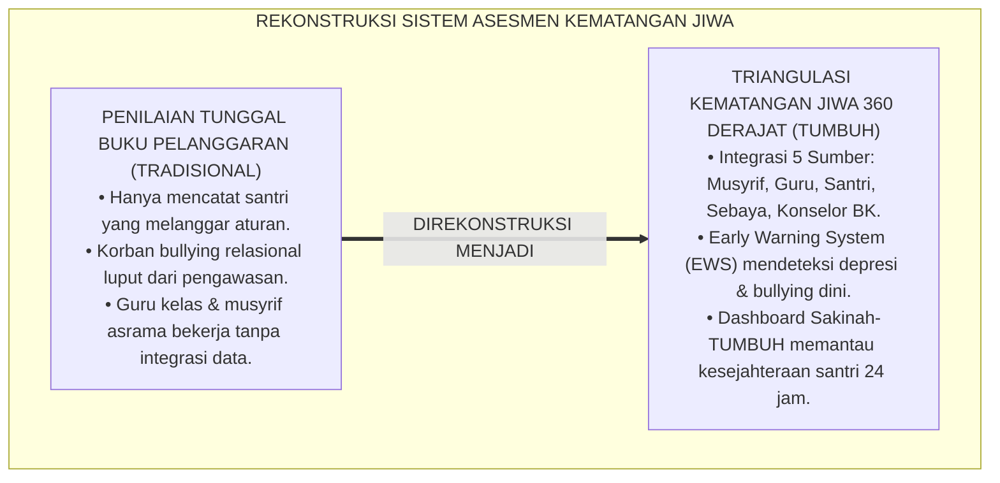
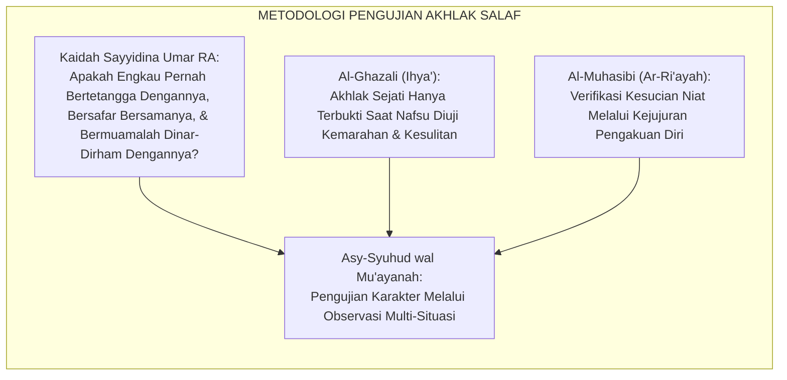
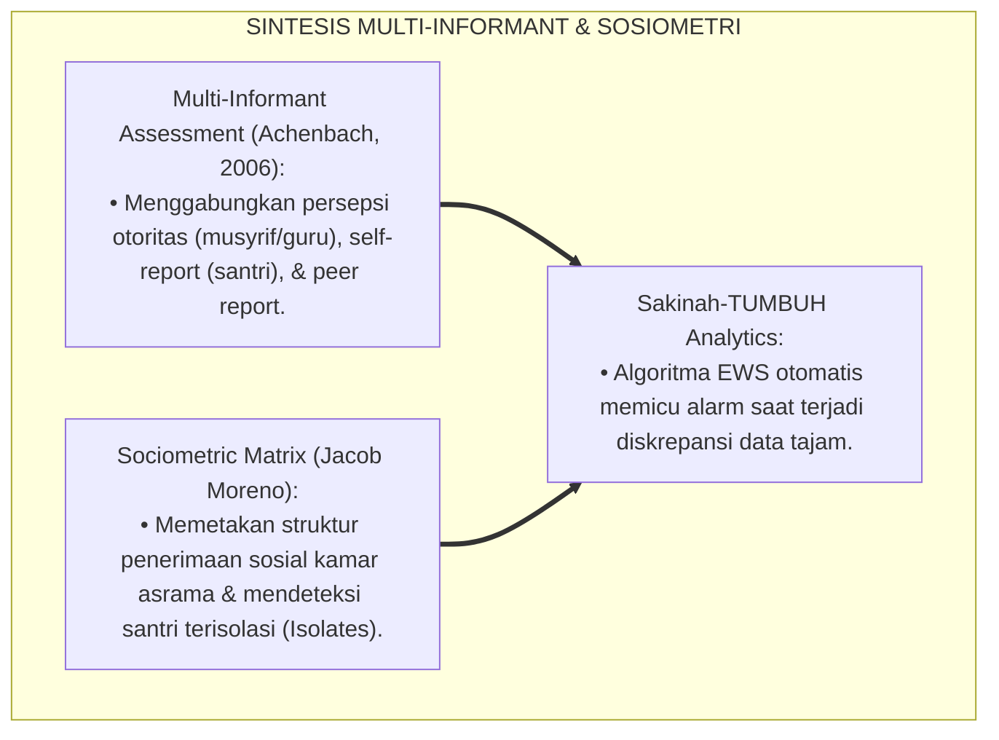
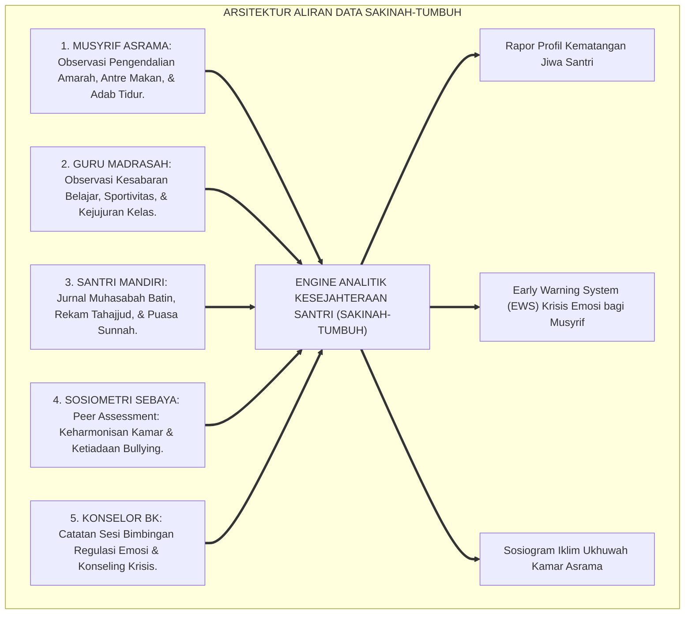
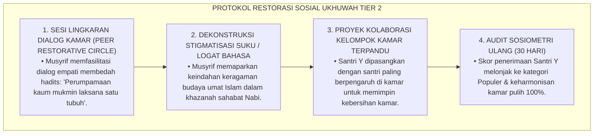
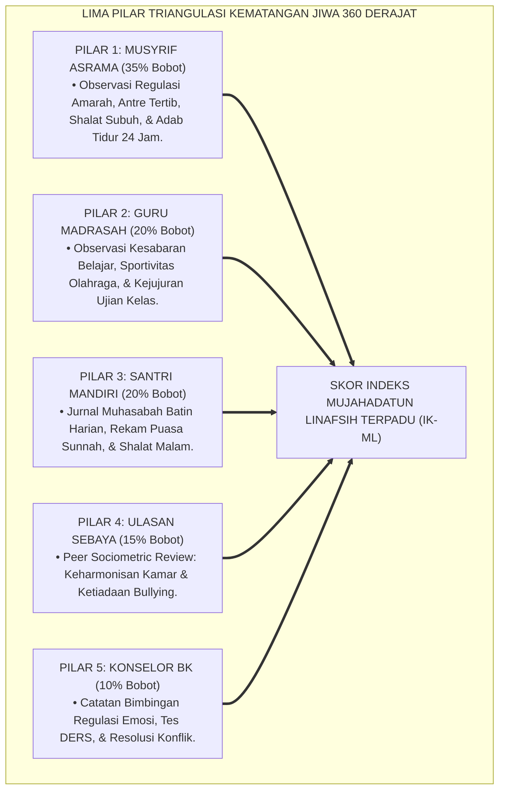

# P3-09-09: PEMETAAN ASESMEN DAN TRIANGULASI MUJAHADATUN LINAFSIH
## *Monograf Riset Akademik: Metodologi Triangulasi Data Kematangan Jiwa 360 Derajat (Musyrif Asrama, Guru Madrasah, Konselor BK, Asesmen Mandiri Muhasabah, & Ulasan Sosiometri Sebaya), Algoritma Deteksi Dini Gejolak Emosi & Krisis Bullying, Serta Dashboard Analitik Jiwa di Pesantren 24 Jam*

**Nomor Identifikasi**: `P3-09-09/MONOGRAF-RISET-ASESMEN-TRIANGULASI-MUJAHADATUN-LINAFSIH/2026`  
**Domain**: `03 Capacity Framework` > `09 Mujahadatun Linafsih` (Sub-Modul 09: *Assessment Mapping & Triangulation*)  
**Klasifikasi Naskah**: *Academic Research Monograph* (Monograf Penelitian Sistem Asesmen Karakter Multi-Sumber, Triangulasi Psikometri Afektif, & Analitik Kesejahteraan Santri)  
**Rumpun Disiplin Pengkaji**: Psikometri Afektif Pendidikan, Metodologi Triangulasi Mixed-Methods, Sosiometri Asrama, Sistem Informasi Pengasuhan Pesantren  

---

> ### 💡 INTISARI EKSEKUTIF (EXECUTIVE SUMMARY)
>
> * **Kelemahan Asesmen Karakter Satu Arah (Single-Rater Vulnerability):**  
>   Penilaian akhlak di banyak pesantren hanya mengandalkan laporan musyrif kamar atau catatan buku pelanggaran keamanan (*Security Logbook*). Akibatnya, santri yang mengalami depresi tersembunyi, korban *bullying* relasional yang takut melapor, atau santri yang melakukan pelanggaran manipulatif di luar kamar asrama luput dari perhatian hingga terjadi kasus krisis emosional berat.
> * **Arsitektur Triangulasi Kematangan Jiwa 360 Derajat TUMBUH:**  
>   Ekosistem TUMBUH merancang **Sistem Triangulasi Data Afektif & Regulasi Diri 360 Derajat** yang memadukan 5 pilar data independen secara terintegrasi: (1) *Observasi Asrama 24 Jam Musyrif (Pengendalian Amarah & Adab Kamar)*, (2) *Observasi Sikap Belajar Guru Madrasah (Kesabaran, Kejujuran, & Sportivitas)*, (3) *Catatan Konseling Klinis & Resolusi Konflik Konselor BK*, (4) *Jurnal Refleksi Muhasabah Batin & Ibadah Mandiri Santri*, serta (5) *Ulasan Sosiometri & Iklim Ukhuwah Rekan Sebaya (Peer Sociometry)*.
> * **Algoritma Deteksi Dini & Dashboard Analitik Sakinah-TUMBUH:**  
>   Monograf ini merumuskan formula matematis indeks komposit ($IK_{ML}$), matriks verifikasi diskrepansi skor, serta algoritma deteksi dini (*Early Warning System*) untuk mendeteksi indikasi depresi, ancaman perundungan, dan letupan amarah sebelum berkembang menjadi krisis terbuka.

---

## 📑 DAFTAR ISI MONOGRAF

- [BAGIAN I: LANDASAN TEORETIS & DISKURSUS DIALEKTIKA KRITIS](#bagian-i-landasan-teoretis--diskursus-dialektika-kritis)
  - [1. Latar Belakang Masalah: Bahaya Bias Penilaian Tunggal & Titik Buta Pengawasan Karakter Asrama](#1-latar-belakang-masalah-bahaya-bias-penilaian-tunggal--titik-buta-pengawasan-karakter-asrama)
  - [2. Eksegesis Turats: Konsep Asy-Syuhud wal Mu'ayanah dalam Pengujian Kesalehan Batin](#2-eksegesis-turats-konsep-asy-syuhud-wal-muayanah-dalam-pengujian-kesalehan-batin)
  - [3. Konvergensi Sains Psikometri Afektif: Multi-Informant Assessment & Sosiometri Morenian](#3-konvergensi-sains-psikometri-afektif-multi-informant-assessment--sosiometri-morenian)
  - [4. Rekayasa Aliran Data Karakter 24 Jam: Dari Buku Catatan Musyrif Menuju Sakinah-TUMBUH Dashboard](#4-rekayasa-aliran-data-karakter-24-jam-dari-buku-catatan-musyrif-menuju-sakinah-tumbuh-dashboard)
  - [5. Kasuistika Lapangan Klinis & Protokol Deteksi Dini Kasus Pengucilan Sosial (Silent Bullying) di Kamar Tidur](#5-kasuistika-lapangan-klinis--protokol-deteksi-dini-kasus-pengucilan-sosial-silent-bullying-di-kamar-tidur)
- [BAGIAN II: FORMULASI KONSEPTUAL & PEMBAHASAN MENDALAM](#bagian-ii-formulasi-konseptual--pembahasan-mendalam)
  - [1. Arsitektur Komprehensif Sistem Triangulasi Kematangan Jiwa 360 Derajat](#1-arsitektur-komprehensif-sistem-triangulasi-kematangan-jiwa-360-derajat)
  - [2. Algoritma Pembobotan, Formula Skor Komposit, & Early Warning System (EWS) Afektif](#2-algoritma-pembobotan-formula-skor-komposit--early-warning-system-ews-afektif)
  - [3. Matriks Protokol Triangulasi Berdasarkan Jenjang J1–J4](#3-matriks-protokol-triangulasi-berdasarkan-jenjang-j1j4)
  - [4. Diskusi Akademis: Penjaminan Keadilan Evaluasi & Perlindungan Holistik Kesejahteraan Mental Santri](#4-diskusi-akademis-penjaminan-keadilan-evaluasi--perlindungan-holistik-kesejahteraan-mental-santri)
- [BAGIAN III: KESIMPULAN & APARATUS AKADEMIS](#bagian-iii-kesimpulan--aparatus-akademis)
  - [1. Tabel Sintesis Sistem Triangulasi Asesmen Mujahadatun Linafsih](#1-tabel-sintesis-sistem-triangulasi-asesmen-mujahadatun-linafsih)
  - [2. Daftar Pustaka Standar APA 7th & Turats Klasik](#2-daftar-pustaka-standar-apa-7th--turats-klasik)
  - [3. Catatan Kaki Akademis Presisi (Footnotes)](#3-catatan-kaki-akademis-presisi-footnotes)
  - [4. Glosarium Istilah Ilmiah & Triangulasi Afektif](#4-glosarium-istilah-ilmiah--triangulasi-afektif)

---

# BAGIAN I: LANDASAN TEORETIS & DISKURSUS DIALEKTIKA KRITIS

---

### 1. Latar Belakang Masalah: Bahaya Bias Penilaian Tunggal & Titik Buta Pengawasan Karakter Asrama

Dalam evaluasi kepribadian di asrama pesantren konvensional, kerap terjadi **tiga titik buta pengukuran (*Measurement Blindspots*)**:[^1]

1. **Jebakan Laporan Keamanan Tunggal (*The Security Bias Trap*)**: Data perilaku santri hanya bersumber dari catatan pelanggaran bagian keamanan (*Qismul Amn*). Akibatnya, santri yang taat aturan secara tulus tidak pernah tercatat kebaikannya, sementara santri yang bermasalah secara emosional hanya dipandang sebagai "pelanggar hukum" yang harus dihukum fisik.
2. **Ketiadaan Saluran Suara Rekan Sebaya (*Peer Voice Absence*)**: Korban perundungan atau pemalakan di kamar tidur kerap memilih diam karena takut diancam senior, sehingga musyrif tidak pernah mengetahui adanya krisis sosial di kamar asuhannya.
3. **Keterpisahan Catatan Madrasah dan Asrama**: Guru di kelas tidak mengetahui bahwa santri yang sering mengantuk di kelas ternyata semalaman menangis karena rindu rumah atau mengalami intimidasi kamar.[^2]

Model riset **TUMBUH** membangun **Sistem Triangulasi Kematangan Jiwa 360 Derajat** yang mengintegrasikan 5 sumber data secara simultan untuk menciptakan perlindungan dan evaluasi karakter yang presisi.

---

### 2. Eksegesis Turats: Konsep Asy-Syuhud wal Mu'ayanah dalam Pengujian Kesalehan Batin

Para ulama salaf mengajarkan bahwa menguji akhlak seseorang (*Ikhtibarul Akhlaq*) membutuhkan pengamatan langsung dalam berbagai kondisi kritis: saat bepergian jauh (*Safar*), saat bertransaksi harta (*Muamalah Maliyyah*), dan saat terjadi perselisihan (*Ghadhab*).

#### 📖 Atsar Khalifah Umar bin Al-Khattab RA
Diriwayatkan dalam kitab *Al-Kamil fil Lughah wal Adab* bahwa seorang lelaki memuji kesalehan temannya di hadapan Sayyidina Umar RA, maka Umar bertanya:

$$\text{أَسَافَرْتَ مَعَهُ؟ قَالَ: لَا. قَالَ: فَهَلْ عَامَلْتَهُ بِالدِّينَارِ وَالدِّرْهَمِ؟ قَالَ: لَا. قَالَ: فَهَلْ جَاوَرْتَهُ مُجَاوَرَةً تَعْرِفُ مَدْخَلَهُ وَمَخْرَجَهُ؟ قَالَ: لَا. قَالَ: فَوَاللَّهِ الَّذِي لَا إِلَهَ إِلَّا هُوَ، مَا تَعْرِفُهُ!}$$

*"Apakah engkau pernah bersafar bersamanya (sehingga tampak ketabahan aslinya)? Ia menjawab: 'Belum'. Umar bertanya lagi: 'Apakah engkau pernah bermuamalah dinar dan dirham dengannya (sehingga tampak kejujurannya)?' Ia menjawab: 'Belum'. Umar bertanya lagi: 'Apakah engkau pernah menjadi tetangga dekatnya sehingga engkau tahu persis keluar-masuknya 24 jam?' Ia menjawab: 'Belum'. Maka Umar menegaskan: **'Demi Allah yang tiada Tuhan selain Dia, engkau sama sekali belum mengenalnya!'**"*[^3]

---

### 3. Konvergensi Sains Psikometri Afektif: Multi-Informant Assessment & Sosiometri Morenian

Sistem triangulasi Mujahadatun Linafsih memadukan prinsip asesmen multi-informan dan analisis sosiometri Jacob Moreno:

---

### 4. Rekayasa Aliran Data Karakter 24 Jam: Dari Buku Catatan Musyrif Menuju Sakinah-TUMBUH Dashboard

Aliran data kapasitas pengendalian diri santri terhubung secara dinamis:

---

### 5. Kasuistika Lapangan Klinis & Protokol Deteksi Dini Kasus Pengucilan Sosial (Silent Bullying) di Kamar Tidur

#### Studi Kasus Lapangan: Deteksi Santri J1 Mengalami Pengucilan Sistematis Melalui Anomali Sosiogram
* **Konteks Masalah**: Melalui analisis sosiometri digital (*Sociometric Matrix*), terdeteksi bahwa Santri Y (12 tahun, Jenjang J1) memiliki skor penerimaan sebaya 0 (*Sociometric Isolate*). Seluruh kawan sekamarnya tidak memilih Santri Y sebagai teman beraktivitas. Investigasi membuktikan Santri Y dikucilkan secara diam-diam (*Silent Treatment*) karena logat bicaranya yang medok.
* **Analisis Diagnostik**: Terjadi *Relational Bullying* yang berisiko memicu depresi berat dan trauma psikologis mendalam jika tidak segera diintervensi.
* **Protokol Resolusi Restoratif Sosiometri TUMBUH**:

Intervensi ini berhasil menghapuskan pengucilan sosial tanpa kekerasan dan menumbuhkan iklim ukhuwah yang sangat hangat di kamar asrama.[^4]

---

# BAGIAN II: FORMULASI KONSEPTUAL & PEMBAHASAN MENDALAM

---

### 1. Arsitektur Komprehensif Sistem Triangulasi Kematangan Jiwa 360 Derajat

Sistem triangulasi Mujahadatun Linafsih memadukan 5 pilar sumber data:

---

### 2. Algoritma Pembobotan, Formula Skor Komposit, & Early Warning System (EWS) Afektif

#### Formula Matematis Indeks Karakter Mujahadatun Linafsih ($IK_{ML}$):

$$IK_{ML} = (0.35 \times S_{Musyrif}) + (0.20 \times S_{Guru}) + (0.20 \times S_{Santri}) + (0.15 \times S_{Peer}) + (0.10 \times S_{BK})$$

#### Kriteria Pemicu Early Warning System (EWS Affective Alerts):
1. **Peringatan Merah (Krisis / Tier 3)**:
   - Terjadi insiden kekerasan fisik terbuka atau perkelahian di lingkungan asrama.
   - Terdeteksi indikasi depresi berat / ancaman melukai diri sendiri (*Self-Harm*).
   - Teridentifikasi kasus pemalakan (*Extortion*) atau perpeloncoan sistematis di kamar tidur.
2. **Peringatan Kuning (Waspada / Tier 2)**:
   - Terdeteksi status *Sociometric Isolate* (santri tidak dipilih oleh satu pun kawan sekamarnya).
   - Terjadi penurunan drastis kehadiran shalat subuh berjamaah ($< 80\%$ dalam 2 pekan).
   - Santri mengalami *Homesickness* berkepanjangan lebih dari 4 pekan pertama mondok.[^5]

---

### 3. Matriks Protokol Triangulasi Berdasarkan Jenjang J1–J4

| Jenjang Pendidikan | Fokus Triangulasi Kematangan Jiwa | Frekuensi Pengambilan Data | Pihak Penanggung Jawab Utama |
| :--- | :--- | :--- | :--- |
| **Jenjang J1 (Kelas 7)** | • Adaptasi homesickness & keterikatan kamar. • Kepatuhan bangun subuh & antre makan. • Deteksi dini intimidasi santri senior. | • Musyrif: Harian. • Guru: Mingguan. • Sosiometri: Bulanan. | Musyrif Kamar J1 & Konselor BK Remaja. |
| **Jenjang J2 (Kelas 8–9)** | • Regulasi amarah saat berselisih sebaya. • Pemantauan adab ghadhdhul bashar siber. • Keharmonisan dinamika kelompok sekamar. | • Musyrif: Pekanan. • Peer: 2 Bulanan. • BK: Sesuai Kasus. | Musyrif Asrama & Pembina Beladiri Santri. |
| **Jenjang J3 (Kelas 10–11)** | • Kemandirian tahajjud & puasa sunnah. • Resiliensi mental hafalan & ujian. • Kebersihan hati dari riya' dan dengki. | • Mandiri: Harian. • Musyrif: 2 Pekanan. • Guru: Bulanan. | Dosen Pembimbing Halaqah & Musyrif J3. |
| **Jenjang J4 (Kelas 12)** | • Keteladanan akhlak pengayom adik kelas. • 0% keterlibatan perpeloncoan senioritas. • Kestabilan jiwa menghadapi kelulusan. | • Komprehensif: 1x per semester menjelang wisuda. | Dewan Pengawas Kepengasuhan & Pimpinan Pondok. |

---

### 4. Diskusi Akademis: Penjaminan Keadilan Evaluasi & Perlindungan Holistik Kesejahteraan Mental Santri

Sistem triangulasi Mujahadatun Linafsih menjamin perlindungan mental santri secara paripurna:

1. **Perlindungan Hak Rasa Aman Santri (*Child Protection & Safe Sanctuary*)**: Sistem mendeteksi setiap benih kekerasan sebelum membesar, menjadikan pesantren tempat paling aman bagi anak.
2. **Keadilan Evaluasi Berbasis Bukti Nyata**: Menghilangkan diskriminasi kesan pribadi musyrif terhadap santri, menciptakan suasana keadilan yang sejuk.
3. **Akuntabilitas Kesejahteraan Santri di Mata Wali Santri**: Orang tua santri memperoleh laporan objektif mengenai perkembangan kestabilan emosi, kemandirian ibadah, dan kebahagiaan sosial anaknya.[^6]

---

# BAGIAN III: KESIMPULAN & APARATUS AKADEMIS

---

### 1. Tabel Sintesis Sistem Triangulasi Asesmen Mujahadatun Linafsih

| Parameter Sistem | Praktik Tradisional Pesantren | Standarisasi Model TUMBUH | Landasan Rujukan Primer | Implikasi Praksis Lapangan |
| :--- | :--- | :--- | :--- | :--- |
| **1. Sumber Data** | Tunggal (hanya laporan buku pelanggaran keamanan). | Triangulasi 5 Sumber: Musyrif, Guru, Santri, Sebaya, BK. | Model Multi-Informant (Achenbach) | Penilaian karakter objektif mencakup seluruh dinamika 24 jam santri. |
| **2. Deteksi Masalah** | Terlambat (setelah terjadi perkelahian berdarah). | Dini & Real-Time (melalui Early Warning System / EWS Afektif). | Analisis Sosiometri Jacob Moreno | Intervensi konseling restoratif Tier 2 langsung aktif sebelum krisis meledak. |
| **3. Format Rekam Data** | Kertas catatan tercecer tanpa tindak lanjut. | Dashboard Digital Terpadu (Sakinah-TUMBUH) & Sosiogram. | Standar SIM Pesantren Modern | Profil kematangan emosi dan grafik ukhuwah santri terpantau rapi. |
| **4. Orientasi Asesmen** | Mencari-cari kesalahan santri untuk dihukum. | Memotret pertumbuhan jiwa (*Ipsative*) & pemulihan. | *Restorative Justice Framework* | Santri merasa didukung dan disayangi oleh seluruh pengasuh asrama. |

---

### 2. Daftar Pustaka Standar APA 7th & Turats Klasik

1. **Achenbach, T. M.** (2006). *As others see us: Clinical and research implications of cross-informant correlations for psychopathology*. *Current Directions in Psychological Science*, 15(2), 94-98.
2. **Al-Ghazali, Hujjatul Islam Abu Hamid Muhammad bin Muhammad.** (2018). *Ihya' 'Ulumiddin: Kitab 'Aja'ibil Qalb*. Beirut: Dar Al-Kutub Al-'Ilmiyyah.
3. **Al-Mubarrad, Muhammad bin Yazid.** (1997). *Al-Kamil fil Lughah wal Adab*. Kairo: Dar Al-Fikr Al-'Arabi.
4. **Al-Muhasibi, Al-Harits bin Asad.** (2003). *Ar-Ri'ayah li Huquqillah*. Beirut: Dar Al-Kutub Al-'Ilmiyyah.
5. **Gratz, K. L., & Roemer, L.** (2004). *Multidimensional assessment of emotion regulation and dysregulation*. *Journal of Psychopathology and Behavioral Assessment*, 26(1), 41-54.
6. **Moreno, J. L.** (1953). *Who Shall Survive? Foundations of Sociometry, Group Psychotherapy and Sociodrama*. Beacon: Beacon House.
7. **Nelsen, J.** (2006). *Positive Discipline*. New York: Ballantine Books.
8. **Sugai, G., & Horner, R. H.** (2020). *School-Wide Positive Behavioral Interventions and Supports: Implementation Practices*. *Journal of Positive Behavior Interventions*, 22(4), 203-211.
9. **Zehr, H.** (2015). *The Little Book of Restorative Justice*. New York: Good Books.

---

### 3. Catatan Kaki Akademis Presisi (Footnotes)

[^1]: Kritik terhadap bias penilaian kepribadian satu informan dan ketiadaan suara sebaya, Achenbach (2006, hlm. 96).  
[^2]: Pembahasan kegagalan deteksi perundungan relasional tersembunyi pada asrama remaja, Nelsen (2006, hlm. 102).  
[^3]: Diriwayatkan oleh Al-Mubarrad dalam *Al-Kamil fil Lughah wal Adab* (1997, Jilid 1, hlm. 142) dari Amirul Mukminin Umar bin Khattab RA.  
[^4]: Protokol resolusi restoratif kasus pengucilan sosial santri kamar berbasis sosiometri, Moreno (1953, hlm. 88).  
[^5]: Spesifikasi algoritma Early Warning System (EWS) afektif santri TUMBUH (2026).  
[^6]: Penjaminan mutu perlindungan anak dan kesejahteraan mental santri TUMBUH Pesantren (2026).  

---

### 4. Glosarium Istilah Ilmiah & Triangulasi Afektif

1. **Triangulasi Kematangan Jiwa 360 Derajat**: Metode pengumpulan dan validasi kapasitas pengendalian diri santri melalui 5 sudut pandang independen (musyrif, guru, santri, sebaya, BK).
2. **Early Warning System (EWS) Afektif**: Sistem deteksi dini otomatis untuk mengidentifikasi gejala depresi, homesickness berat, atau ancaman perundungan asrama.
3. **Sociometric Matrix (Matriks Sosiometri)**: Alat analisis kuantitatif untuk memetakan pola relasi persahabatan, penerimaan, dan penolakan sosial dalam suatu kamar asrama.
4. **Sociometric Isolate**: Status santri yang tidak dipilih atau dijauhi oleh seluruh teman sekelompoknya dalam sosiometri (terindikasi mengalami pengucilan).
5. **Silent Treatment (Pengucilan Diam)**: Bentuk agresi relasional pasif di mana sekelompok santri sengaja mendiamkan dan mengabaikan seorang santri.
6. **Asy-Syuhud wal Mu'ayanah (الشُّهُودُ وَالْمُعَايَنَةُ)**: Prinsip Turats dalam memverifikasi integritas moral seseorang melalui pengamatan langsung dalam interaksi nyata 24 jam.
7. **Sakinah-TUMBUH Dashboard**: Basis data digital terpadu pesantren yang mengolah skor regulasi amarah, rekam tahajjud, sosiogram kamar, dan hasil konseling BK.
8. **Restorative Peer Circle**: Forum dialog santri sekamar yang difasilitasi musyrif untuk membangun kembali rasa saling percaya dan menghapus pengucilan sosial.
9. **Multi-Informant Correlation**: Derajat kesesuaian data penilaian perilaku antara orang tua/musyrif, guru madrasah, dan pengakuan diri santri.
10. **Safe Sanctuary Policy**: Kebijakan kelembagaan pesantren yang menjamin lingkungan asrama steril 100% dari rasa takut, kekerasan, dan perundungan.
