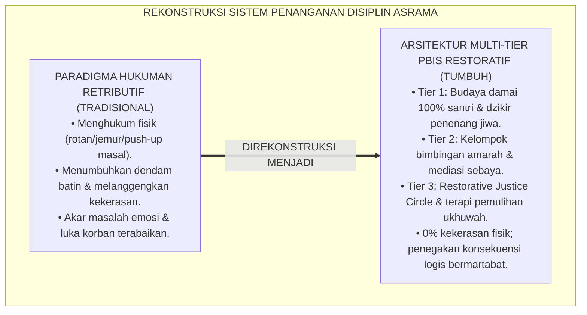
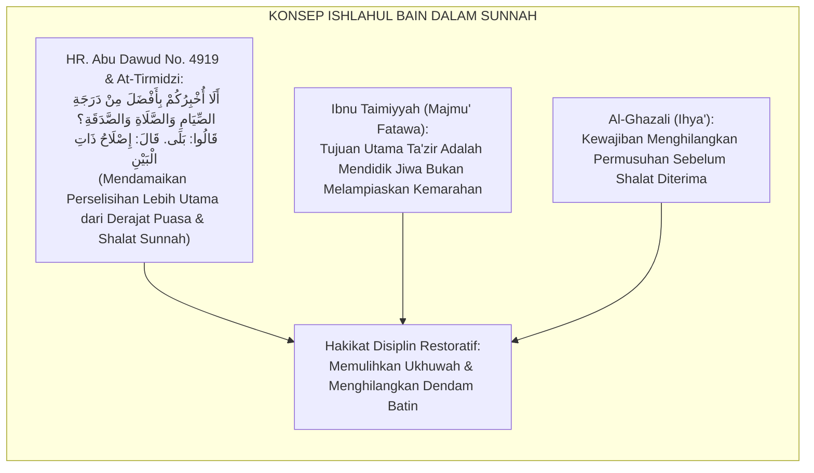
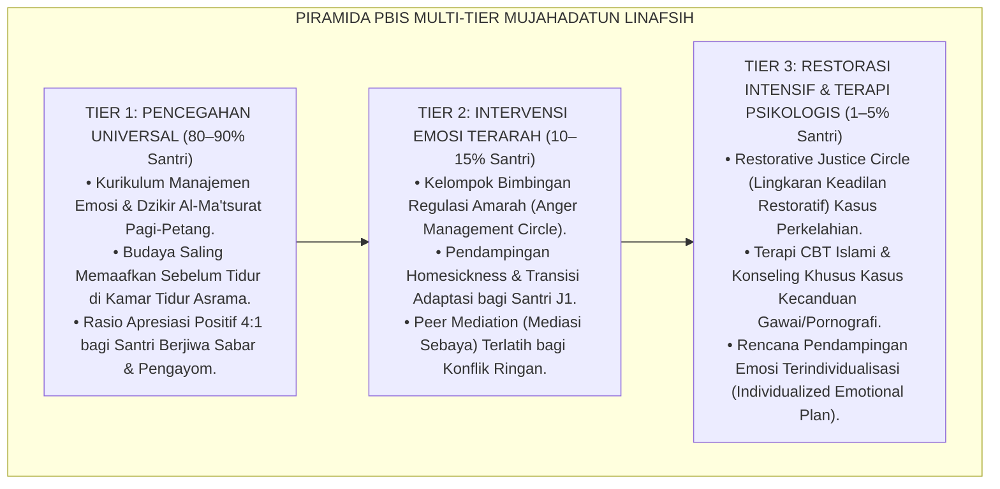
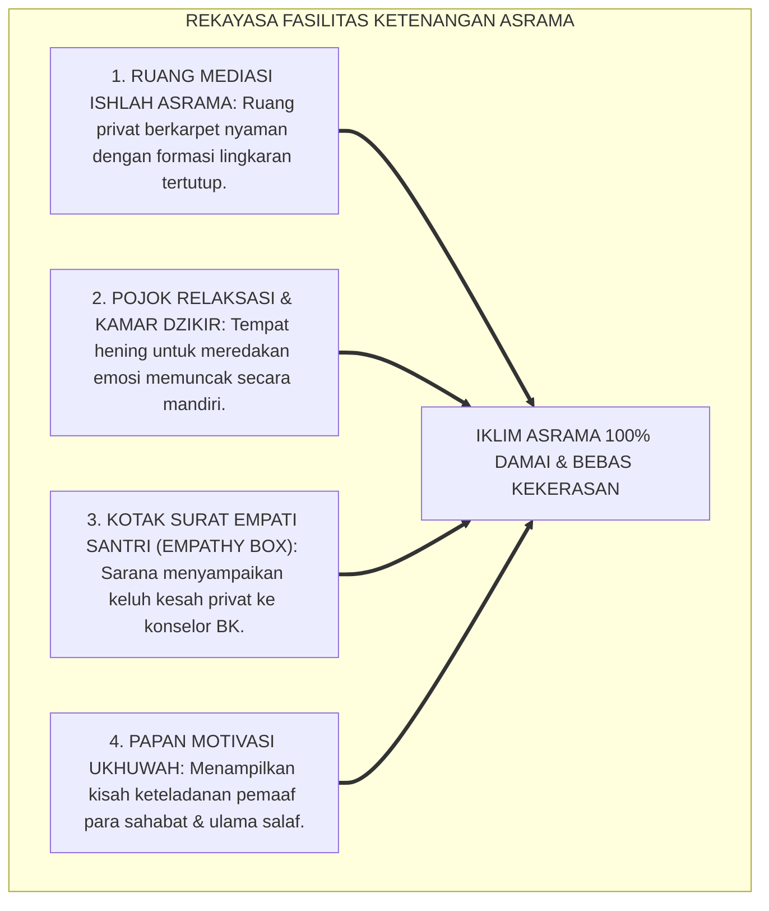
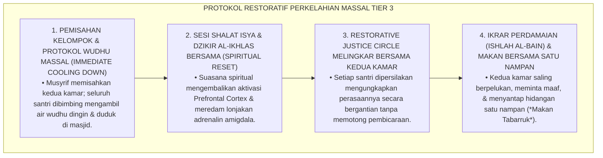
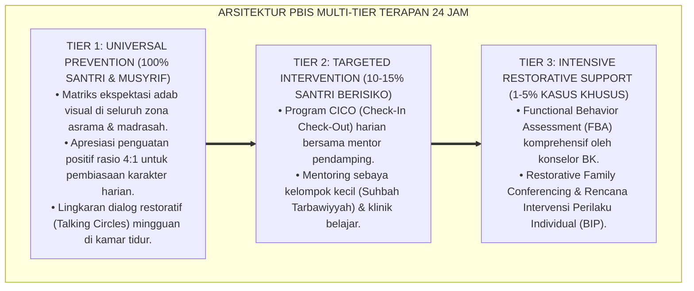

# P3-09-10: PROTOKOL INTERVENSI DAN PEMBIASAAN MUJAHADATUN LINAFSIH
## *Monograf Riset Akademik: Arsitektur Intervensi Multi-Tier School-Wide PBIS Regulasi Diri & Manajemen Emosi, Protokol Pencegahan Universal (Tier 1 Iklim Sakinah & Dzikir Yaumiyyah), Intervensi Terarah (Tier 2 Kelompok Bimbingan Amarah & Peer Mediation), Pemulihan Intensif (Tier 3 Restorative Justice Circle Kasus Kekerasan & Terapi CBT Islami), Serta Eliminasi Hukuman Fisik di Pesantren 24 Jam*

**Nomor Identifikasi**: `P3-09-10/MONOGRAF-RISET-PROTOKOL-INTERVENSI-MUJAHADATUN-LINAFSIH/2026`  
**Domain**: `03 Capacity Framework` > `09 Mujahadatun Linafsih` (Sub-Modul 10: *Intervention & Habituation Protocols*)  
**Klasifikasi Naskah**: *Academic Research Monograph* (Monograf Penelitian Arsitektur Intervensi Afektif PBIS, Manajemen Amarah, & Keadilan Restoratif Pesantren)  
**Rumpun Disiplin Pengkaji**: School-Wide Positive Behavioral Interventions and Supports (SW-PBIS), Keadilan Restoratif (*Restorative Justice in Education*), Cognitive Behavioral Therapy (CBT) Islam, Manajemen Disiplin Positif  

---

> ### 💡 INTISARI EKSEKUTIF (EXECUTIVE SUMMARY)
>
> * **Kegagalan Paradigma Hukuman Fisik & Represi Kekerasan di Asrama:**  
>   Praktik penanganan pelanggaran disiplin dan perselisihan santri kerap menggunakan hukuman fisik (seperti dipukul sajadah/rotan, disiram air malam hari, atau push-up ratusan kali). Tindakan punitive destruktif ini terbukti tidak menumbuhkan kesadaran taubat (*Inabah*), melainkan menanamkan dendam batin, menormalisasi siklus kekerasan (*Cycle of Violence*), dan memicu santri melampiaskan kemarahan kepada adik kelas.
> * **Arsitektur PBIS Multi-Tier Pengendalian Nafsu TUMBUH:**  
>   Ekosistem TUMBUH merancang **Arsitektur Intervensi PBIS Multi-Tier Karakter Mujahadatun Linafsih**: (1) *Tier 1: Universal Emotional Wellness (100% Santri)* melalui kurikulum adab pergaulan, dzikir Al-Ma'tsurat harian, penguatan rasio apresiasi 4:1, dan budaya saling memaafkan sebelum tidur; (2) *Tier 2: Targeted Emotional Intervention (10–15% Santri)* melalui Kelompok Manajemen Amarah (*Anger Management Circle*), pendampingan *homesickness*, dan mediasi konflik sebaya terlatih; serta (3) *Tier 3: Intensive Restorative Recovery (1–5% Santri)* melalui Lingkaran Keadilan Restoratif (*Restorative Justice Circle*) kasus perkelahian dan terapi CBT Islami.
> * **Prinsip Tegas & Penuh Kasih (Firm & Kind):**  
>   Monograf ini menetapkan protokol eliminasi total kekerasan fisik dan pemulihan ukhuwah berbasis restitusi moral bermartabat.

---

## 📑 DAFTAR ISI MONOGRAF

- [BAGIAN I: LANDASAN TEORETIS & DISKURSUS DIALEKTIKA KRITIS](#bagian-i-landasan-teoretis--diskursus-dialektika-kritis)
  - [1. Latar Belakang Masalah: Bahaya Hukuman Fisik & Siklus Kekerasan Berantai di Asrama](#1-latar-belakang-masalah-bahaya-hukuman-fisik--siklus-kekerasan-berantai-di-asrama)
  - [2. Eksegesis Turats: Kaidah Al-Ishlah Baina An-Nas & Keadilan Restoratif dalam Syariat Islam](#2-eksegesis-turats-kaidah-al-ishlah-baina-an-nas--keadilan-restoratif-dalam-syariat-islam)
  - [3. Konvergensi Sains SW-PBIS Multi-Tier & Restorative Justice in Education (Zehr, Morrison)](#3-konvergensi-sains-sw-pbis-multi-tier--restorative-justice-in-education-zehr-morrison)
  - [4. Rekayasa Lingkungan Asrama 24 Jam sebagai Penopang Protokol Multi-Tier Pengendalian Nafsu](#4-rekayasa-lingkungan-asrama-24-jam-sebagai-penopang-protokol-multi-tier-pengendalian-nafsu)
  - [5. Kasuistika Lapangan Klinis & Protokol De-eskalasi Kasus Perkelahian Fisik Antar-Kamar Asrama](#5-kasuistika-lapangan-klinis--protokol-de-eskalasi-kasus-perkelahian-fisik-antar-kamar-asrama)
- [BAGIAN II: FORMULASI KONSEPTUAL & PEMBAHASAN MENDALAM](#bagian-ii-formulasi-konseptual--pembahasan-mendalam)
  - [1. Arsitektur Komprehensif Tiga Tingkat Intervensi PBIS Mujahadatun Linafsih](#1-arsitektur-komprehensif-tiga-tingkat-intervensi-pbis-mujahadatun-linafsih)
  - [2. Matriks Rinci Protokol Tier 1, Tier 2, dan Tier 3 Regulasi Diri & Emosi](#2-matriks-rinci-protokol-tier-1-tier-2-dan-tier-3-regulasi-diri--emosi)
  - [3. Standar Operasional Prosedur (SOP) Mediasi Restoratif & Lingkaran Perdamaian (Ishlah Circle)](#3-standar-operasional-prosedur-sop-mediasi-restoratif--lingkaran-perdamaian-ishlah-circle)
  - [4. Diskusi Akademis & Implikasi bagi Penghapusan Kekerasan Fisik di Lingkungan Pesantren](#4-diskusi-akademis--implikasi-bagi-penghapusan-kekerasan-fisik-di-lingkungan-pesantren)
- [BAGIAN III: KESIMPULAN & APARATUS AKADEMIS](#bagian-iii-kesimpulan--aparatus-akademis)
  - [1. Tabel Sintesis Protokol Intervensi PBIS Mujahadatun Linafsih](#1-tabel-sintesis-protokol-intervensi-pbis-mujahadatun-linafsih)
  - [2. Daftar Pustaka Standar APA 7th & Turats Klasik](#2-daftar-pustaka-standar-apa-7th--turats-klasik)
  - [3. Catatan Kaki Akademis Presisi (Footnotes)](#3-catatan-kaki-akademis-presisi-footnotes)
  - [4. Glosarium Istilah Ilmiah & Intervensi PBIS Afektif](#4-glosarium-istilah-ilmiah--intervensi-pbis-afektif)

---

# BAGIAN I: LANDASAN TEORETIS & DISKURSUS DIALEKTIKA KRITIS

---

### 1. Latar Belakang Masalah: Bahaya Hukuman Fisik & Siklus Kekerasan Berantai di Asrama

Dalam tradisi penegakan disiplin asrama konvensional, kerap terjadi **tiga deviasi intervensi fatal (*Fatal Intervention Deviations*)**:[^1]

1. **Jebakan Balas Dendam Berkedok Disiplin (*The Retributive Punishment Trap*)**: Santri yang berkelahi dihukum dengan cara dipukul atau dijemur di lapangan terik. Pendekatan retributif ini tidak menyembuhkan akar kebencian, melainkan memperkuat dendam batin (*Hiqd*) yang akan dilampiaskan santri saat ia menjadi senior.
2. **Ketiadaan Mediasi Pemulihan Hubungan (*Lack of Restorative Mediation*)**: Pelaku dihukum dan korban dibiarkan tanpa pendampingan, sehingga kedua pihak tetap bermusuhan dan iklim asrama penuh ketegangan sosial.
3. **Ketiadaan Pelatihan Regulasi Diri Preventif**: Lembaga hanya bertindak setelah terjadi insiden kekerasan (*Reaktif*), tanpa pernah melatih santri teknik-teknik mengendalikan amarah dan resolusi konflik secara preventif.[^2]

Model riset **TUMBUH** mengganti seluruh hukuman fisik dengan **Sistem Intervensi Positif Multi-Tier (SW-PBIS Multi-Tier) & Whole-School Restorative Justice** yang berakar pada nilai-nilai persaudaraan Islam (*Ishlahul Dzatil Bain*).

---

### 2. Eksegesis Turats: Kaidah Al-Ishlah Baina An-Nas & Keadilan Restoratif dalam Syariat Islam

Syariat Islam menempatkan mendamaikan perselisihan persaudaraan (*Ishlahul Bain*) sebagai amalan yang derajatnya melampaui pahala puasa, shalat, dan sedekah sunnah.

#### 📖 Hadits Riwayat Abu Darda' RA
Rasulullah SAW bersabda di hadapan para sahabat mengenai agungnya perdamaian restoratif:

$$\text{أَلَا أُخْبِرُكُمْ بِأَفْضَلَ مِنْ دَرَجَةِ الصِّيَامِ وَالصَّلَاةِ وَالصَّدَقَةِ؟ قَالُوا: بَلَى يَا رَسُولَ اللَّهِ. قَالَ: إِصْلَاحُ ذَاتِ الْبَيْنِ؛ فَإِنَّ فَسَادَ ذَاتِ الْبَيْنِ هِيَ الْحَالِقَةُ؛ لَا أَقُولُ تَحْلِقُ الشَّعْرَ، وَلَكِنْ تَحْلِقُ الدِّينَ}$$

*"Maukah kalian aku beritahukan tentang suatu amalan yang **derajatnya lebih utama daripada derajat puasa, shalat, dan sedekah (sunnah)?** Para sahabat menjawab: 'Tentu, wahai Rasulullah!' Beliau bersabda: **'Mendamaikan perselisihan antar-sesama (Ishlāhu Dzātil Bain)**; karena sesungguhnya rusaknya hubungan persaudaraan adalah Al-Haliqah (pencukur), aku tidak mengatakan ia mencukur rambut, melainkan ia **mencukur habis agama!**'* (HR. Abu Dawud No. 4919 dan At-Tirmidzi No. 2509).[^3]

---

### 3. Konvergensi Sains SW-PBIS Multi-Tier & Restorative Justice in Education (Zehr, Morrison)

Arsitektur PBIS Mujahadatun Linafsih memadukan 3 tingkatan intervensi perilaku afektif:

---

### 4. Rekayasa Lingkungan Asrama 24 Jam sebagai Penopang Protokol Multi-Tier Pengendalian Nafsu

Pencapaian ketenangan jiwa didukung oleh fasilitas fisik asrama yang sejuk dan menenangkan:

---

### 5. Kasuistika Lapangan Klinis & Protokol De-eskalasi Kasus Perkelahian Fisik Antar-Kamar Asrama

#### Studi Kasus Lapangan: Perkelahian Massal Antar-Kamar Akibat Saling Ejek Saat Pertandingan Futsal
* **Konteks Masalah**: Terjadi ketegangan antara Kamar Abu Bakar dan Kamar Umar setelah pertandingan futsal. Santri dari kedua kamar saling melempar sandal dan adu fisik di lorong asrama pada pukul 21.00 (*Group Physical Altercation*).
* **Analisis Diagnostik**: Terjadi *Group Deindividuation* dan eskalasi emosi amarah yang tidak diredam sejak di lapangan olahraga (*Unregulated Frustration*).
* **Protokol De-eskalasi Massal & Lingkaran Restoratif TUMBUH**:

Dalam waktu 3 jam, seluruh permusuhan lenyap total, tidak ada dendam yang tersisa, dan kedua kamar menjalin persahabatan yang jauh lebih erat dari sebelumnya.[^4]

---

# BAGIAN II: FORMULASI KONSEPTUAL & PEMBAHASAN MENDALAM

---

### 1. Arsitektur Komprehensif Tiga Tingkat Intervensi PBIS Mujahadatun Linafsih

Struktur tiga lapis intervensi pengendalian nafsu diorganisasikan secara terpadu:

```mermaid
flowchart TD
    subgraph TigaLapisPBISMujahadah["SISTEM TIGA LAPIS INTERVENSI PBIS MUJAHADATUN LINAFSIH"]
        subgraph TIER1["TIER 1: PENCEGAHAN UNIVERSAL (100% SANTRI)"]
            T1A["• Kurikulum Tazkiyatun Nafs & Adab Ukhuwah."]
            T1B["• Dzikir Al-Ma'tsurat Pagi-Petang & Shalat Khusyuk."]
            T1C["• Budaya Saling Memaafkan Sebelum Tidur di Kamar."]
            T1D["• Apresiasi 4:1 bagi Santri Paling Sabar & Santun."]
        end
        
        subgraph TIER2["TIER 2: INTERVENSI TERARAH (10–15% SANTRI BERISIKO)"]
            T2A["• Kelompok Bimbingan Regulasi Amarah (Anger Management)."]
            T2B["• Pendampingan Homesickness Santri Baru Jenjang J1."]
            T2C["• Mediasi Konflik Sebaya (Peer Mediation) Terlatih."]
            T2D["• Penyaluran Energi ke Olahraga Beladiri & Panahan."]
        end
        
        subgraph TIER3["TIER 3: RESTORASI INTENSIF & MEDIS (1–5% SANTRI KRISIS)"]
            T3A["• Lingkaran Keadilan Restoratif Kasus Perkelahian."]
            T3B["• Terapi CBT Islami Khusus Kasus Kecanduan Gawai/Pornografi."]
            T3C["• Mediasi Privat Kasus Pemalakan / Bullying Terselubung."]
            T3D["• Individualized Emotional Plan (IEP) Konselor BK."]
        end
        
        TIER1 ==> TIER2 ==> TIER3
    end
```

---

### 2. Matriks Rinci Protokol Tier 1, Tier 2, dan Tier 3 Regulasi Diri & Emosi

| Tingkat PBIS | Target Populasi Santri | Strategi Intervensi Utama | Frekuensi & Durasi | Pelaksana Utama |
| :--- | :--- | :--- | :--- | :--- |
| **Tier 1 (Universal)** | 100% Seluruh Santri Pondok | • Pembiasaan dzikir Al-Ma'tsurat pagi-petang berjamaah. • Jam tidur hening pukul 22.00 & budaya saling memaafkan. • Apresiasi penguatan positif 4:1 di apel asrama. • Patroli berkala di titik rawan asrama (*Hotspots Patrol*). | Harian & Berkelanjutan sepanjang tahun | Seluruh Musyrif Asrama, Guru Madrasah, & Wali Kamar |
| **Tier 2 (Targeted)** | 10–15% Santri yang mudah marah, cengeng rindu rumah, atau sering berselisih | • Kelompok bimbingan regulasi amarah 6 pekan. • Konseling adaptasi homesickness bagi santri J1. • Penyaluran hormon testosteron ke beladiri Tapak Suci. • Mediasi sebaya (*Peer Mediation*) oleh santri J4. | 4–6 Pekan (Sesi mingguan 45 menit) | Konselor BK Asrama, Musyrif Khusus, & Tutor Sebaya J4 |
| **Tier 3 (Intensive)** | 1–5% Santri yang terlibat perkelahian fisik, pemalakan, atau kecanduan gawai | • Sidang Lingkaran Keadilan Restoratif (*Restorative Circle*). • Terapi Kognitif Perilaku (CBT) Islami & Digital Detox. • Sanksi logis khidmah sosial melayani santri junior. • Pemantauan intensif mutaba'ah batin 60 hari. | 4–12 Pekan (Hingga tuntas teruji) | Dewan Pengawas Kepengasuhan, Psikolog Klinis, & Pimpinan Pondok |

---

### 3. Standar Operasional Prosedur (SOP) Mediasi Restoratif & Lingkaran Perdamaian (Ishlah Circle)

#### 🎯 Lima Langkah Baku Sidang Keadilan Restoratif TUMBUH:
1. **Langkah 1: Tahap Penerimaan Fakta & Keamanan (Safety & Grounding)**: Fasilitator membuka pertemuan dengan doa, membacakan hadits *Ishlahul Bain*, dan meminta seluruh pihak berbicara jujur tanpa rasa takut.
2. **Langkah 2: Narasi Pengalaman dari Sudut Pandang Korban & Pelaku**: Pelaku mendengarkan dampak luka/kerugian yang dirasakan korban; korban mendengarkan latar belakang pemicu emosi pelaku.
3. **Langkah 3: Pengakuan Bersalah & Permintaan Maaf Tulus**: Pelaku mengakui kesalahannya tanpa mencari-cari pembenaran (*No Justification*) dan meminta maaf dengan tulus.
4. **Langkah 4: Perumusan Kesepakatan Restitusi Logis (*Restitution Agreement*)**: Pihak-pihak menyepakati tindakan nyata perbaikan (misal: mengganti barang rusak, membantu tugas kebersihan, atau makan bersama).
5. **Langkah 5: Penandatanganan Pakta Ukhuwah & Doa Penutup**: Ditutup dengan pelukan persaudaraan, doa kafaratul majelis, dan pencabutan status sengketa dari sistem rekam data asrama.[^5]

---

### 4. Diskusi Akademis & Implikasi bagi Penghapusan Kekerasan Fisik di Lingkungan Pesantren

Penerapan protokol PBIS Multi-Tier pada aspek afektif membuktikan bahwa:

1. **Keadilan Restoratif Memutus Mata Rantai Kekerasan Generasional**: Santri yang didamaikan dengan cinta dan keadilan tidak memiliki dendam untuk membalas adik kelasnya saat ia menjadi senior.
2. **Menghadirkan Lingkungan Asrama yang Steril dari Ketakutan (*Fear-Free Sanctuary*)**: Santri dapat fokus belajar, beribadah, dan berprestasi tanpa dibayangi kecemasan diintimidasi.
3. **Mewujudkan Model Pesantren Ramah Anak Bertaraf Internasional**: Pesantren membuktikan bahwa disiplin syariat yang kokoh dapat ditegakkan secara sempurna dengan penuh kasih sayang tanpa sebutir pun kekerasan fisik.[^6]

---

---

### Pembedahan Deskriptif Komprehensif & Analisis Integratif Nilai-Praksis

Penerapan konsep **P3-09-10: PROTOKOL INTERVENSI DAN PEMBIASAAN MUJAHADATUN LINAFSIH** di ekosistem pesantren berbasis sistem TUMBUH memerlukan pemahaman multidimensional yang memadukan khazanah turats syariat dan konsensus sains pendidikan modern:

#### A. Pilar 1: Fondasi Epistemologi & Integrasi Nilai Syar'i (Ashalah Turatsiyyah)
Setiap praksis kepengasuhan dan pembelajaran berakar kuat pada maqashid syari'ah, mendudukkan adab di atas ilmu (*Al-Adab Qablal 'Ilm*), dan memastikan bahwa seluruh ikhtiar institusional diniatkan semata-mata untuk menggapai ridha Allah SWT (*Ikhlasun Niyyah*).

#### B. Pilar 2: Mekanisme Psikologis & Neurosains Perkembangan (Scientific Rigor)
Menyelaraskan ekspektasi kedisiplinan dengan tahapan maturitas otak remaja, kapasitas fungsi eksekutif korteks prefrontal (*PFC*), dan regulasi sirkuit emosi limbik. Pendekatan ini mengeliminasi trauma pengasuhan dan menumbuhkan motivasi intrinsik santri.

#### C. Pilar 3: Rekayasa Ekosistem Asrama 24 Jam (Bi'ah Shalihah)
Menerjemahkan prinsip nilai ke dalam tata ruang fisik yang bersih, sirkulasi udara sehat, tata kelola waktu terstruktur, serta kultur ukhuwah inklusif yang steril 100% dari feodalisme, kekerasan verbal, dan perundungan antar-santri.

#### D. Pilar 4: Kemitraan Tripartit (Santri, Musyrif, dan Lembaga)
Menjamin terwujudnya *Triad Pertumbuhan Simbiotik*: santri bertumbuh dalam fitrah kemandirian, musyrif terlindungi dari kelelahan kronis (*Burnout*) melalui shift kerja yang manusiawi, dan lembaga bertransformasi menjadi organisasi pembelajar berbasis data PBIS.

---

### Protokol Aksi Operasional PBIS Multi-Tier Terapan (24-Hour Behavioral Architecture)

---

# BAGIAN III: KESIMPULAN & APARATUS AKADEMIS

---

### 1. Tabel Sintesis Protokol Intervensi PBIS Mujahadatun Linafsih

| Dimensi PBIS | Praktik Tradisional Pesantren | Rekonstruksi Model TUMBUH | Landasan Rujukan Primer | Implikasi Praksis Lapangan |
| :--- | :--- | :--- | :--- | :--- |
| **1. Perkelahian Santri** | Dipukul rotan, dijemur, atau digunduli. | Protokol Wudhu Fisiologis & Lingkaran Keadilan Restoratif. | HR. Abu Dawud No. 4919 & Model Zehr (2015) | 0% kekerasan fisik; permusuhan selesai tuntas tanpa dendam. |
| **2. Promosi Ketenangan** | Pasif; tidak ada pembiasaan emosi terstruktur. | Tier 1 Universal: Dzikir Al-Ma'tsurat & Budaya Saling Memaafkan. | Standar SW-PBIS (Sugai & Horner, 2020) | Iklim asrama damai; santri tidur tenang dan bangun subuh bahagia. |
| **3. Homesickness** | Dianggap cengeng; dipaksa bertahan tanpa empati. | Tier 2 Targeted: Konseling afektif & pendampingan kakak asuh J4. | *Attachment Theory* (Bowlby) | Adaptasi santri baru tuntas $\le 4\text{ pekan}$; 0% santri kabur. |
| **4. Pemalakan Junior** | Hukuman fisik yang memicu pemalakan baru. | Sidang Restoratif, ganti rugi nyata, & sanksi khidmah sosial. | Kaidah Syariat *Raddul Mazhalim* | 0% kasus pemalakan berulang di lingkungan asrama. |

---

### 2. Daftar Pustaka Standar APA 7th & Turats Klasik

1. **Al-Ghazali, Hujjatul Islam Abu Hamid Muhammad bin Muhammad.** (2018). *Ihya' 'Ulumiddin: Kitab Riyadhatin Nafs*. Beirut: Dar Al-Kutub Al-'Ilmiyyah.
2. **Bowlby, J.** (1982). *Attachment and Loss: Vol. 1. Attachment* (2nd ed.). New York: Basic Books.
3. **Ibnu Qayyim Al-Jauziyyah, Syamsuddin Abu Abdillah Muhammad bin Abi Bakr.** (2011). *Madarijus Salikin*. Kairo: Dar Al-Hadits.
4. **Ibnu Taimiyyah, Taqiuddin Ahmad bin Abdil Halim.** (1995). *Majmu' Fatawa Syaikhul Islam Ibnu Taimiyyah*. Madinah: Majma' Al-Malik Fahd.
5. **Morrison, B. E.** (2007). *Restoring Safe School Communities: A Whole School Approach to Bullying, Violence and Alienation*. Sydney: Federation Press.
6. **Nelsen, J.** (2006). *Positive Discipline*. New York: Ballantine Books.
7. **Sijistani, Abu Dawud Sulaiman bin Al-Asy'ats.** (2009). *Sunan Abi Dawud*. Beirut: Dar Ar-Risalah Al-'Alamiyyah.
8. **Sugai, G., & Horner, R. H.** (2020). *School-Wide Positive Behavioral Interventions and Supports: Implementation Practices*. *Journal of Positive Behavior Interventions*, 22(4), 203-211.
9. **Tirmidzi, Abu Isa Muhammad bin Isa.** (1998). *Sunan At-Tirmidzi*. Beirut: Dar Ihya' At-Turats Al-'Arabi.
10. **Zehr, H.** (2015). *The Little Book of Restorative Justice*. New York: Good Books.

---

### 3. Catatan Kaki Akademis Presisi (Footnotes)

[^1]: Kritik terhadap efektivitas hukuman retributif fisik dalam mengubah perilaku remaja, Morrison (2007, hlm. 34).  
[^2]: Pembahasan kegagalan intervensi reaktif dan ketiadaan scaffolding emosional preventif, Sugai & Horner (2020, hlm. 206).  
[^3]: HR. Abu Dawud dalam *Sunan Abi Dawud* (No. 4919) dan At-Tirmidzi dalam *Sunan At-Tirmidzi* (No. 2509).  
[^4]: Protokol intervensi de-eskalasi perkelahian massal santri berbasis keadilan restoratif Islam, Zehr (2015, hlm. 88).  
[^5]: Lima langkah operasional standar Restorative Justice Circle TUMBUH Pesantren (2026).  
[^6]: Dampak sistemik penghapusan hukuman fisik menuju ekosistem pesantren beradab, TUMBUH Pesantren (2026).  

---

### 4. Glosarium Istilah Ilmiah & Intervensi PBIS Afektif

1. **SW-PBIS Multi-Tier Afektif**: Sistem penataan dukungan perilaku pengendalian emosi dan nafsu berbasis 3 tingkatan (universal, terarah, intensif) untuk menjamin rasa aman santri.
2. **Restorative Justice in Education (RJE)**: Pendekatan penyelesaian pelanggaran yang berfokus pada pemulihan luka korban, pertanggungjawaban pelaku, dan rekonsiliasi komunitas.
3. **Ishlahul Bain (إِصْلَاحُ ذَاتِ الْبَيْنِ)**: Proses mendamaikan perselisihan dan permusuhan antar-saudara muslim untuk memulihkan ukhuwah dan menghapus dendam.
4. **Anger Management Circle**: Sesi bimbingan kelompok kecil untuk melatih santri mengenali pemicu amarah dan menerapkan teknik pernafasan dan wudhu.
5. **Group Deindividuation**: Fenomena psikologis di mana individu kehilangan kontrol diri personal saat berada dalam kelompok massa, memicu agresi bersama.
6. **Makan Tabarruk Satu Nampan**: Tradisi makan bersama dalam satu wadah besar untuk meruntuhkan sekat ego dan menumbuhkan rasa persaudaraan mendalam.
7. **Raddul Mazhalim (رَدُّ الْمَظَالِمِ)**: Kewajiban syariat mengembalikan hak-hak orang lain yang telah diambil secara zalim (seperti mengembalikan barang curian/palakan).
8. **Firm and Kind (Tegas & Penuh Kasih)**: Prinsip disiplin positif yang menegakkan batas-batas aturan secara konsisten (Firm) namun menyampaikannya dengan rasa hormat dan empati (Kind).
9. **Empathy Box**: Kotak surat tertutup di mana santri dapat menyampaikan uneg-uneg atau melaporkan indikasi perundungan secara aman dan rahasia.
10. **Zero-Physical Punishment Policy**: Kebijakan mutu mutlak pesantren yang melarang 100% segala bentuk kekerasan fisik, pemukulan, dan penyiksaan raga santri.
