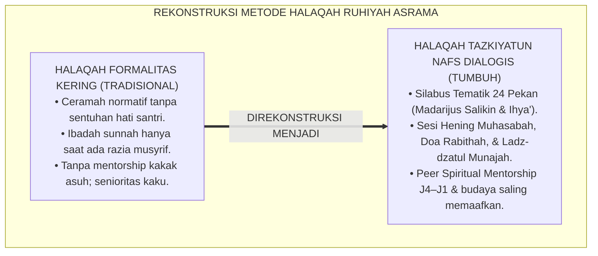
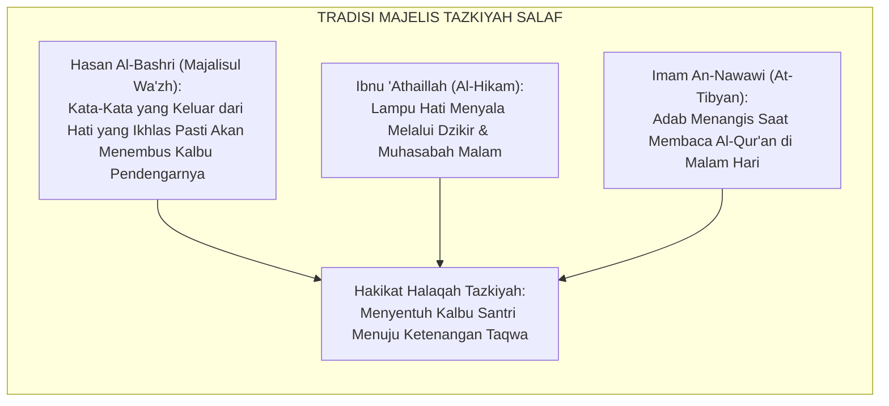
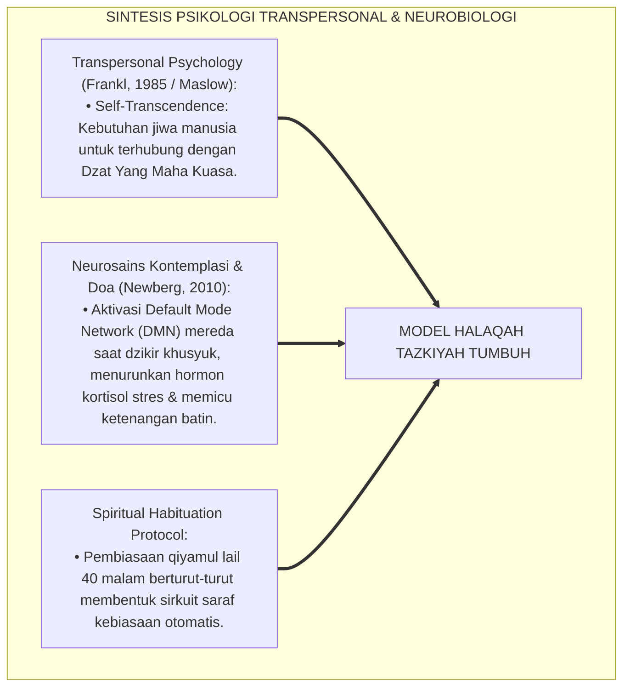
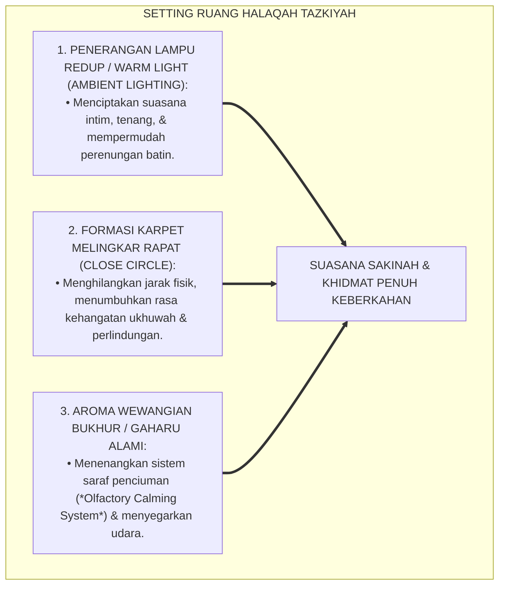
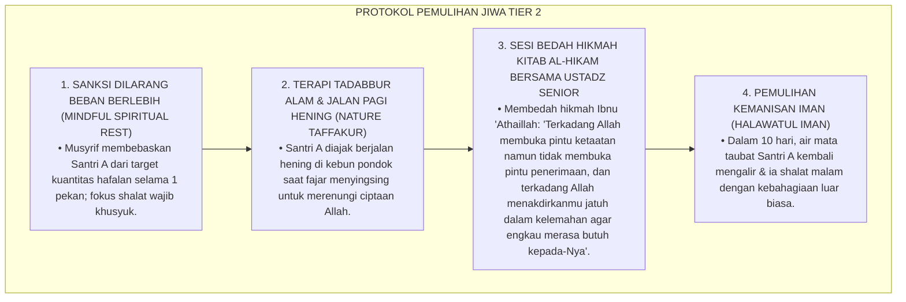
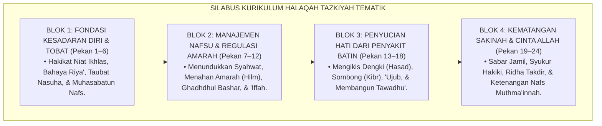
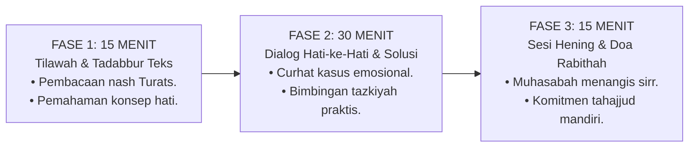
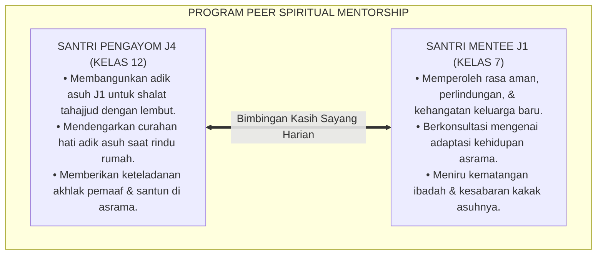
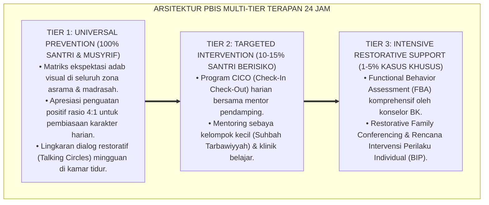

# P3-09-11: PROGRAM PEMBINAAN DAN HALAQAH MUJAHADATUN LINAFSIH
## *Monograf Riset Akademik: Desain Kurikulum Halaqah Tazkiyatun Nafs Tematik 24 Pekan, Integrasi Kajian Madarijus Salikin & Kitab Riyadhatin Nafs Ihya', Program Pembiasaan Qiyamul Lail Mandiri & Puasa Sunnah, Program Mentorship Ukhuwah Kakak Asuh J4–J1, Serta Tradisi Muhasabah Malam di Pesantren 24 Jam*

**Nomor Identifikasi**: `P3-09-11/MONOGRAF-RISET-HALAQAH-PEMBINAAN-MUJAHADATUN-LINAFSIH/2026`  
**Domain**: `03 Capacity Framework` > `09 Mujahadatun Linafsih` (Sub-Modul 11: *Coaching Programs & Halaqah*)  
**Klasifikasi Naskah**: *Academic Research Monograph* (Monograf Penelitian Desain Kurikulum Halaqah Ruhiyah, Pedagogi Tazkiyah Pesantren, & Model Mentorship Ukhuwah)  
**Rumpun Disiplin Pengkaji**: Desain Kurikulum Non-Formal Pesantren, Pedagogi Tasawuf Amali, Psikologi Pembiasaan Karakter, Manajemen Asrama 24 Jam  

---

> ### 💡 INTISARI EKSEKUTIF (EXECUTIVE SUMMARY)
>
> * **Kelesuan Pembinaan Ruhiyah Asrama Konvensional:**  
>   Sesi pembinaan malam di asrama sering kali terperangkap menjadi rutinitas pembacaan teks kaku tanpa penghayatan kalbu (*Ritualistic Monotony*), di mana santri sekadar hadir mengisi absensi tanpa pernah diajak bermuhasabah mendalam, mengenali penyakit hatinya (riya', dengki, sombong), atau dilatih mengelola gejolak emosi pubertasnya secara terbimbing.
> * **Inovasi Kurikulum Halaqah Tazkiyah Tematik 24 Pekan TUMBUH:**  
>   Ekosistem TUMBUH merancang **Silabus Kurikulum Halaqah Tazkiyatun Nafs Tematik 24 Pekan Terstruktur** dengan formula waktu presisi 60 menit: (1) *15 Menit Tilawah & Tadabbur Teks Tazkiyah Turats (Madarijus Salikin / Ihya')*, (2) *30 Menit Dialog Reflektif Hati-ke-Hati & Studi Kasus Pengendalian Emosi*, dan (3) *15 Menit Sesi Hening Muhasabah, Doa Rabithah, & Komitmen Ibadah Mandiri*.
> * **Program Mentorship Ukhuwah Kakak Asuh J4–J1 & Budaya Saling Memaafkan:**  
>   Program ini diperkuat oleh sistem pendampingan ukhuwah sebaya (*Peer Spiritual Mentorship*) di mana setiap santri kelas 12 (J4) menjadi figur teladan pengayom bagi 2 santri kelas 7 (J1), menjamin transfer kehangatan kasih sayang dan eliminasi tuntas budaya senioritas feodal di asrama.

---

## 📑 DAFTAR ISI MONOGRAF

- [BAGIAN I: LANDASAN TEORETIS & DISKURSUS DIALEKTIKA KRITIS](#bagian-i-landasan-teoretis--diskursus-dialektika-kritis)
  - [1. Latar Belakang Masalah: Bahaya Halaqah Formalitas Kering vs Kebutuhan Sentuhan Batin Remaja](#1-latar-belakang-masalah-bahaya-halaqah-formalitas-kering-vs-kebutuhan-sentuhan-batin-remaja)
  - [2. Eksegesis Turats: Majelis Tazkiyah & Tradisi Tarbiyah Ruhiyah dalam Khazanah Salaf](#2-eksegesis-turats-majelis-tazkiyah--tradisi-tarbiyah-ruhiyah-dalam-khazanah-salaf)
  - [3. Konvergensi Sains Psikologi Transpersonal & Teori Pembiasaan Spiritual (Spiritual Habituation)](#3-konvergensi-sains-psikologi-transpersonal--teori-pembiasaan-spiritual-spiritual-habituation)
  - [4. Rekayasa Ekologi Ruang Halaqah Asrama: Penerangan Redup, Karpet Melingkar, & Suasana Khusyuk](#4-rekayasa-ekologi-ruang-halaqah-asrama-penerangan-redup-karpet-melingkar--suasana-khusyuk)
  - [5. Kasuistika Lapangan Klinis & Protokol Pendampingan Santri Mengalami Kebuntuan Spiritual (Futur / Spiritual Dryness)](#5-kasuistika-lapangan-klinis--protokol-pendampingan-santri-mengalami-kebuntuan-spiritual-futur--spiritual-dryness)
- [BAGIAN II: FORMULASI KONSEPTUAL & PEMBAHASAN MENDALAM](#bagian-ii-formulasi-konseptual--pembahasan-mendalam)
  - [1. Silabus Kurikulum Halaqah Tazkiyatun Nafs Tematik 24 Pekan Komprehensif](#1-silabus-kurikulum-halaqah-tazkiyatun-nafs-tematik-24-pekan-komprehensif)
  - [2. Protokol Struktur Sesi Halaqah 60 Menit Berbasis Dialog Reflektif Hati](#2-protokol-struktur-sesi-halaqah-60-menit-berbasis-dialog-reflektif-hati)
  - [3. Desain Program Peer Spiritual Mentorship (Kakak Asuh J4 Mengayomi Santri J1)](#3-desain-program-peer-spiritual-mentorship-kakak-asuh-j4-mengayomi-santri-j1)
  - [4. Diskusi Akademis: Implikasi Budaya Muhasabah Malam bagi Pematangan Akhlak Santri](#4-diskusi-akademis-implikasi-budaya-muhasabah-malam-bagi-pematangan-akhlak-santri)
- [BAGIAN III: KESIMPULAN & APARATUS AKADEMIS](#bagian-iii-kesimpulan--aparatus-akademis)
  - [1. Tabel Sintesis Program Pembinaan & Halaqah Mujahadatun Linafsih](#1-tabel-sintesis-program-pembinaan--halaqah-mujahadatun-linafsih)
  - [2. Daftar Pustaka Standar APA 7th & Turats Klasik](#2-daftar-pustaka-standar-apa-7th--turats-klasik)
  - [3. Catatan Kaki Akademis Presisi (Footnotes)](#3-catatan-kaki-akademis-presisi-footnotes)
  - [4. Glosarium Istilah Ilmiah & Pedagogi Halaqah Tazkiyah](#4-glosarium-istilah-ilmiah--pedagogi-halaqah-tazkiyah)

---

# BAGIAN I: LANDASAN TEORETIS & DISKURSUS DIALEKTIKA KRITIS

---

### 1. Latar Belakang Masalah: Bahaya Halaqah Formalitas Kering vs Kebutuhan Sentuhan Batin Remaja

Dalam dinamika pembinaan santri di asrama tradisional, kerap terjadi **tiga kelemahan pedagogis ruhiyah (*Spiritual Pedagogical Flaws*)**:[^1]

1. **Jebakan Ceramah Normatif Kering (*Dry Normative Lecturing*)**: Halaqah malam hanya diisi dengan pembacaan terjemah teks secara terburu-buru tanpa memberikan ruang bagi santri untuk mencurahkan kegelisahan hatinya, rasa bersalah atas dosa, atau beban mental belajarnya.
2. **Ketiadaan Pembiasaan Ibadah Sunnah Berkelanjutan**: Santri hanya shalat tahajjud saat ada razia musyrif, tanpa pernah diajarkan merasakan kenikmatan bermunajat (*Ladz-dzatul Munajah*) di sepertiga malam terakhir.
3. **Ketiadaan Sistem Pendampingan Ukhuwah Personal**: Santri baru yang kesepian dibiarkan tanpa pendampingan kakak asuh, memicu kerentanan terhadap godaan kabur dari pondok atau mencari pelarian negatif.[^2]

Model riset **TUMBUH** merekonstruksi tradisi halaqah: **Halaqah Tazkiyatun Nafs adalah oase penyucian kalbu dan pemulihan jiwa yang menghangatkan ukhuwah dan menumbuhkan ketenangan batin (*Sakinah*)**.

---

### 2. Eksegesis Turats: Majelis Tazkiyah & Tradisi Tarbiyah Ruhiyah dalam Khazanah Salaf

Sejarah Islam mencatat bahwa majelis para ulama salaf senantiasa memadukan ketajaman ilmu fiqih dengan kelembutan air mata penyucian jiwa (*Majalisur Raqa'iq*).

#### 📖 Wasiat Imam Hasan Al-Bashri tentang Majelis Hati
Imam **Hasan Al-Bashri** berkata kepada seorang penceramah yang bicaranya tidak menyentuh hati jamaah:

$$\text{يَا هَذَا، إِنَّ فِي قَلْبِكَ لَمَرَضًا، أَوْ فِي قَلْبِي؛ فَإِنَّ الْكَلَامَ إِذَا خَرَجَ مِنَ الْقَلْبِ وَقَعَ فِي الْقَلْبِ، وَإِذَا خَرَجَ مِنَ اللِّسَانِ لَمْ يُجَاوِزِ الْآذَانَ}$$

*"Wahai saudaraku, sesungguhnya ada penyakit di dalam hatimu atau di dalam hatiku; karena sesungguhnya **perkataan yang tulus keluar dari lubuk hati yang suci pasti akan langsung menghujam ke dalam hati pendengarnya**, namun jika perkataan itu hanya keluar dari ujung lisan, niscaya ia tidak akan pernah melampaui daun telinga!"*[^3]

---

### 3. Konvergensi Sains Psikologi Transpersonal & Teori Pembiasaan Spiritual (Spiritual Habituation)

Desain Halaqah Tazkiyah menyelaraskan psikologi transpersonal dan neurobiologi ketenangan jiwa:

---

### 4. Rekayasa Ekologi Ruang Halaqah Asrama: Penerangan Redup, Karpet Melingkar, & Suasana Khusyuk

Setting fisik ruang halaqah diatur secara ergonomis untuk mendukung kekhusyukan batin:

---

### 5. Kasuistika Lapangan Klinis & Protokol Pendampingan Santri Mengalami Kebuntuan Spiritual (Futur / Spiritual Dryness)

#### Studi Kasus Lapangan: Santri J3 Mengalami Kejenuhan Ibadah (Futur), Malas Shalat Malam, & Merasa Hatinya 'Kering'
* **Konteks Masalah**: Santri A (16 tahun, Jenjang J3) yang sebelumnya rajin tahajjud tiba-tiba mengalami *Spiritual Dryness / Futur*. Ia merasa shalatnya hampa, malas tilawah Al-Qur'an, dan menangis mengeluh kepada musyrif: "Ustadz, hati saya mati rasa, saya tidak bisa menangis lagi saat berdoa".
* **Analisis Diagnostik**: Santri A mengalami *Spiritual Burnout* akibat beban kognitif berlebih dan ketiadaan variasi riyadhah yang membahagiakan jiwa.
* **Protokol Pemulihan Batin (Spiritual Renewal) TUMBUH**:

Intervensi ini membuktikan bahwa penyakit batin *futur* diobati dengan pemahaman hikmah tauhid dan kasih sayang, bukan dengan bentakan atau ancaman neraka.[^4]

---

# BAGIAN II: FORMULASI KONSEPTUAL & PEMBAHASAN MENDALAM

---

### 1. Silabus Kurikulum Halaqah Tazkiyatun Nafs Tematik 24 Pekan Komprehensif

Kurikulum halaqah asrama disusun terstruktur sepanjang 2 semester (24 pekan):

#### Rincian Tema Mingguan Silabus 24 Pekan:

| Pekan | Tema Utama Halaqah Tazkiyah | Dalil Turats & Rujukan Kitab | Target Keterampilan Regulasi Diri |
| :---: | :--- | :--- | :--- |
| **01** | Menata Niat: Hakikat Beramal Lillaahi Ta'ala | Hadits *Innamal A'malu bin Niyyat* & *Ihya'* | Mengidentifikasi motivasi batin belajar di asrama. |
| **02** | Anatomi Nafsu: Mengenal Tiga Tingkatan Jiwa | QS. Yusuf: 53, QS. Al-Qiyamah: 2, QS. Al-Fajr: 27 | Membedakan bisikan hawa nafsu vs bisikan fitrah. |
| **03** | Taubat Nasuha: Menghapus Luka Dosa Masa Lalu | *Madarijus Salikin* (Ibnu Qayyim Al-Jauziyyah) | Praktik shalat taubat & istighfar penenang jiwa. |
| **04** | Muraqabatullah: Merasakan Pengawasan Allah 24 Jam | QS. Al-Hadid: 4 & *Ar-Ri'ayah* (Al-Muhasibi) | Menjaga adab di ruang privat kamar tidur. |
| **05** | Mengatasi Rindu Rumah (*Homesickness*) | QS. Ar-Ra'd: 28 (Ketenangan dengan Dzikir) | Praktik teknik regulasi pernafasan 4-7-8 & doa. |
| **06** | Muhasabah Malam: Seni Menghitung Diri Sendiri | Wasiat Sayyidina Umar RA (*Hasibu Anfusakum*) | Menulis jurnal refleksi muhasabah sebelum tidur. |
| **07** | Menundukkan Syahwat Gawai & Dopamin Digital | QS. An-Nur: 30–31 & *Bidayatul Hidayah* | Menerapkan adab ghadhdhul bashar di dunia siber. |
| **08** | Seni Mengendalikan Amarah: Meneladani Sifat Hilm | HR. Al-Bukhari No. 6114 & Sunan Abu Dawud | Praktik protokol wudhu & meredam provokasi teman. |
| **09** | Puasa Sunnah: Perisai Penunduk Hawa Nafsu | HR. Al-Bukhari (*Ash-Shiyamu Junnah*) | Disiplin puasa sunnah Senin-Kamis secara ikhlas. |
| **10** | Menjaga Kesucian Pergaulan Sebaya (*'Iffah*) | *Tahdzibul Akhlaq* (Ibnu Miskawaih) | Adab menjaga aurat dan batasan sentuhan fisik. |
| **11** | Rahasia Shalat Khusyuk: Mi'raj Orang Beriman | *Kitab As-Shalah* (Ibnu Qayyim) | Menghadirkan hati dalam setiap gerakan shalat. |
| **12** | Menghidupkan Sepertiga Malam (*Ladz-dzatul Munajah*) | QS. Al-Isra': 79 & *Ihya' 'Ulumiddin* | Membangun kebiasaan bangun qiyamul lail mandiri. |
| **13** | Bahaya Penyakit Riya' & Pamer Amal di Medsos | QS. Al-Ma'un: 4–6 & *Jami'ul 'Ulum wal Hikam* | Menyembunyikan amal ibadah sunnah (*Amal Sirr*). |
| **14** | Mengikis Ujub: Merasa Lebih Hebat dari Kawan | *Al-Hikam* (Ibnu 'Athaillah As-Sakandari) | Mengakui seluruh keberhasilan adalah karunia Allah. |
| **15** | Mengobati Dengki (*Hasad*): Mendoakan Kawan | HR. Muslim (*Doa untuk Saudara Tanpa Sepengetahuannya*) | Tulus mengapresiasi dan mendoakan prestasi kawan. |
| **16** | Hakikat Tawadhu': Menghancurkan Arogansi Senior | HR. Muslim No. 2588 (*Man Tawadha'a Lillaah*) | Melayani dan menyayangi santri junior tanpa feodalisme. |
| **17** | Menjaga Lisan dari Ghibah & Namimah | QS. Al-Hujurat: 12 & *Riyadhus Shalihin* | Budaya berbicara baik atau diam (*Fal-Yaqul Khairan*). |
| **18** | Kelapangan Hati Memaafkan Kesalahan Saudara | QS. An-Nur: 22 (*Ala Tuhibbuna an Yaghfirallah*) | Mempraktikkan budaya saling memaafkan di kamar. |
| **19** | Kesabaran Aktif (*Ash-Shabr al-Jamil*) | QS. Al-Baqarah: 153 & *Madarijus Salikin* | Resiliensi tinggi menghadapi kesulitan belajar & sakit. |
| **20** | Syukur Hakiki: Menikmati Setiap Nikmat Sederhana | QS. Ibrahim: 7 & *Ihya' 'Ulumiddin* | Menghargai makanan asrama & fasilitas pondok. |
| **21** | Menghadapi Kejenuhan (*Futur*) dalam Ibadah | Hadits *Inna Likulli 'Amalin Syirratan wa Fatrah* | Strategi pemulihan semangat ruhiyah secara bijak. |
| **22** | Ridha atas Ketentuan Takdir Ilahi | *Kitab Ar-Ridha* (Ibnu Qayyim Al-Jauziyyah) | Menghilangkan rasa cemas atas masa depan. |
| **23** | Menuju Derajat *An-Nafs al-Muthma'innah* | QS. Al-Fajr: 27–30 & *Tafsir Ibnu Katsir* | Kestabilan jiwa menghadapi ujian kelulusan. |
| **24** | Malam Qiyamul Lail Akbar & Ikrar Ukhuwah Abadi | Doa Rabithah & Musyafahah Antar-Kamar | Mengukuhkan persaudaraan suci seumur hidup. |

---

### 2. Protokol Struktur Sesi Halaqah 60 Menit Berbasis Dialog Reflektif Hati

---

### 3. Desain Program Peer Spiritual Mentorship (Kakak Asuh J4 Mengayomi Santri J1)

Setiap santri kelas 12 (Jenjang J4) dipasangkan dengan 2 santri kelas 7 (Jenjang J1) sebagai figur pengayom spiritual dan sahabat hati:

---

### 4. Diskusi Akademis: Implikasi Budaya Muhasabah Malam bagi Pematangan Akhlak Santri

Penerapan program pembinaan dan halaqah tazkiyah menghadirkan transformasi mendalam:

1. **Penyembuhan Luka Batin Santri (*Inner Healing*)**: Santri memiliki ruang katarsis emosional yang sehat di hadapan Allah dan musyrif, menyembuhkan trauma masa lalu.
2. **Kemandirian Ibadah Tanpa Paksaan (*Autonomous Worship*)**: Santri mendirikan shalat malam dan berpuasa sunnah atas dasar kerinduan cinta kepada Allah, bukan karena takut dihukum musyrif.
3. **Kaderisasi Pemimpin Bangsa Berjiwa Sejuk (*Spiritually Mature Leaders*)**: Lulusan pesantren memiliki integritas batin yang kokoh, tidak mudah tergiur godaan materi, dan mampu memimpin dengan hati yang jernih.[^5]

---

---

### Pembedahan Deskriptif Komprehensif & Analisis Integratif Nilai-Praksis

Penerapan konsep **P3-09-11: PROGRAM PEMBINAAN DAN HALAQAH MUJAHADATUN LINAFSIH** di ekosistem pesantren berbasis sistem TUMBUH memerlukan pemahaman multidimensional yang memadukan khazanah turats syariat dan konsensus sains pendidikan modern:

#### A. Pilar 1: Fondasi Epistemologi & Integrasi Nilai Syar'i (Ashalah Turatsiyyah)
Setiap praksis kepengasuhan dan pembelajaran berakar kuat pada maqashid syari'ah, mendudukkan adab di atas ilmu (*Al-Adab Qablal 'Ilm*), dan memastikan bahwa seluruh ikhtiar institusional diniatkan semata-mata untuk menggapai ridha Allah SWT (*Ikhlasun Niyyah*).

#### B. Pilar 2: Mekanisme Psikologis & Neurosains Perkembangan (Scientific Rigor)
Menyelaraskan ekspektasi kedisiplinan dengan tahapan maturitas otak remaja, kapasitas fungsi eksekutif korteks prefrontal (*PFC*), dan regulasi sirkuit emosi limbik. Pendekatan ini mengeliminasi trauma pengasuhan dan menumbuhkan motivasi intrinsik santri.

#### C. Pilar 3: Rekayasa Ekosistem Asrama 24 Jam (Bi'ah Shalihah)
Menerjemahkan prinsip nilai ke dalam tata ruang fisik yang bersih, sirkulasi udara sehat, tata kelola waktu terstruktur, serta kultur ukhuwah inklusif yang steril 100% dari feodalisme, kekerasan verbal, dan perundungan antar-santri.

#### D. Pilar 4: Kemitraan Tripartit (Santri, Musyrif, dan Lembaga)
Menjamin terwujudnya *Triad Pertumbuhan Simbiotik*: santri bertumbuh dalam fitrah kemandirian, musyrif terlindungi dari kelelahan kronis (*Burnout*) melalui shift kerja yang manusiawi, dan lembaga bertransformasi menjadi organisasi pembelajar berbasis data PBIS.

---

### Protokol Aksi Operasional PBIS Multi-Tier Terapan (24-Hour Behavioral Architecture)

---

# BAGIAN III: KESIMPULAN & APARATUS AKADEMIS

---

### 1. Tabel Sintesis Program Pembinaan & Halaqah Mujahadatun Linafsih

| Komponen Program | Pola Halaqah Konvensional | Standarisasi Halaqah TUMBUH | Landasan Rujukan Primer | Bukti Capaian Lapangan |
| :--- | :--- | :--- | :--- | :--- |
| **1. Silabus Pembinaan** | Spontan tanpa kurikulum batin terstruktur. | Silabus Tematik 24 Pekan Tazkiyatun Nafs (*Madarijus Salikin*). | *Ihya' 'Ulumiddin* (Al-Ghazali) | 100% sesi halaqah memiliki modul dan tujuan batin terukur. |
| **2. Suasana Sesi** | Ruangan terang benderang, kaku, monolog. | Formasi melingkar rapat, lampu redup, hening, bukhur wangi. | *Majalisur Raqa'iq* Ulama Salaf | Santri khusyuk; air mata muhasabah mengalir tulus. |
| **3. Program Mentorship** | Hubungan senior-junior bernuansa perpeloncoan. | *Peer Spiritual Mentorship* (Santri J4 mengayomi adik kelas J1). | HR. At-Tirmidzi No. 1919 & Ukhuwah | 0% kasus bullying; adik kelas merasa aman dan dicintai. |
| **4. Pembiasaan Malam** | Begadang mengobrol sia-sia hingga larut. | Muhasabah Yaumiyyah & Budaya Saling Memaafkan Sebelum Tidur. | Wasiat Sayyidina Umar RA | Santri tidur tepat pukul 22.00 dan bangun tahajjud segar. |

---

### 2. Daftar Pustaka Standar APA 7th & Turats Klasik

1. **Al-Ghazali, Hujjatul Islam Abu Hamid Muhammad bin Muhammad.** (2018). *Ihya' 'Ulumiddin: Kitab 'Aja'ibil Qalb wa Riyadhatin Nafs*. Beirut: Dar Al-Kutub Al-'Ilmiyyah.
2. **Al-Muhasibi, Al-Harits bin Asad.** (2003). *Ar-Ri'ayah li Huquqillah*. Beirut: Dar Al-Kutub Al-'Ilmiyyah.
3. **Frankl, V. E.** (1985). *Man's Search for Meaning*. New York: Washington Square Press.
4. **Ibnu 'Athaillah As-Sakandari, Tajuddin Abu Al-Fadhl Ahmad bin Muhammad.** (2006). *Al-Hikam Al-'Athaiyyah*. Tahqiq: Dr. Muhammad Said Ramadhan Al-Buthi. Damaskus: Dar Al-Fikr.
5. **Ibnu Qayyim Al-Jauziyyah, Syamsuddin Abu Abdillah Muhammad bin Abi Bakr.** (2011). *Madarijus Salikin*. Kairo: Dar Al-Hadits.
6. **Nawawi, Abu Zakariya Muhyiddin Yahya bin Syaraf.** (2014). *At-Tibyan fi Adabi Hamalatil Qur'an*. Beirut: Dar Ibn Hazm.
7. **Newberg, A. B.** (2010). *Principles of Neurotheology*. Farnham: Ashgate Publishing.
8. **Sugai, G., & Horner, R. H.** (2020). *School-Wide Positive Behavioral Interventions and Supports: Implementation Practices*. *Journal of Positive Behavior Interventions*, 22(4), 203-211.
9. **Tirmidzi, Abu Isa Muhammad bin Isa.** (1998). *Sunan At-Tirmidzi*. Beirut: Dar Ihya' At-Turats Al-'Arabi.
10. **Zehr, H.** (2015). *The Little Book of Restorative Justice*. New York: Good Books.

---

### 3. Catatan Kaki Akademis Presisi (Footnotes)

[^1]: Kritik terhadap model pembinaan ruhiyah formalitas tanpa menyentuh dimensi afektif santri, Frankl (1985, hlm. 76).  
[^2]: Pembahasan ketiadaan pendampingan spiritual sebaya dalam pengasuhan asrama remaja, Sugai & Horner (2020, hlm. 208).  
[^3]: Diriwayatkan oleh Imam Abu Nu'aim dalam *Hilyatul Auliya'* (Jilid 2, hlm. 148) dari Al-Hasan Al-Bashri.  
[^4]: Protokol pemulihan kejenuhan spiritual (futur) berbasis neuroteologi dan tadabbur alam, Newberg (2010, hlm. 112).  
[^5]: Dampak kelembagaan penerapan kurikulum halaqah tazkiyah tematik TUMBUH Pesantren (2026).  

---

### 4. Glosarium Istilah Ilmiah & Pedagogi Halaqah Tazkiyah

1. **Halaqah Tazkiyatun Nafs**: Majelis pembinaan spiritual malam di asrama yang difokuskan untuk membersihkan penyakit hati, meredam nafsu, dan mematangkan emosi.
2. **Ladz-dzatul Munajah (لَذَّةُ الْمُنَاجَاةِ)**: Kenikmatan dan kelezatan spiritual yang dirasakan seorang hamba saat bermunajat dan berdialog dengan Allah di sepertiga malam terakhir.
3. **Futur (الْفُتُورُ)**: Kondisi penurunan semangat atau kelesuan spiritual sementara setelah sebelumnya berada dalam masa puncak ketaatan.
4. **Doa Rabithah**: Doa pertautan hati yang dibaca bersama untuk mengikat rasa cinta persaudaraan suci antar-santri karena Allah SWT.
5. **Peer Spiritual Mentorship**: Program pembinaan di mana santri kelas 12 (J4) menjadi figur teladan pengayom dan pembimbing ibadah adik kelasnya (J1).
6. **Amal Sirr (عَمَلُ السِّرِّ)**: Amalan ibadah sunnah yang dilakukan secara sembunyi-sembunyi tanpa diketahui orang lain demi menjaga keikhlasan batin.
7. **Default Mode Network (DMN)**: Jaringan saraf otak yang mereda aktivitasnya saat melakukan meditasi dzikir khusyuk, menurunkan kecemasan dan stres ego.
8. **Spiritual Burnout**: Kelelahan emosional-ruhani akibat memaksakan kuantitas ibadah tanpa disertai pemahaman hikmah dan kebahagiaan batin.
9. **Halawatul Iman (حَلَاوَةُ الْإِيمَانِ)**: Kemanisan iman yang dirasakan di dalam kalbu yang membuat ketaatan terasa membahagiakan dan maksiat terasa memuakkan.
10. **Sakinatul Qalb (سَكِينَةُ الْقَلْبِ)**: Ketenangan, kedamaian, dan ketenteraman batin yang Allah turunkan ke dalam hati orang-orang yang beriman.
