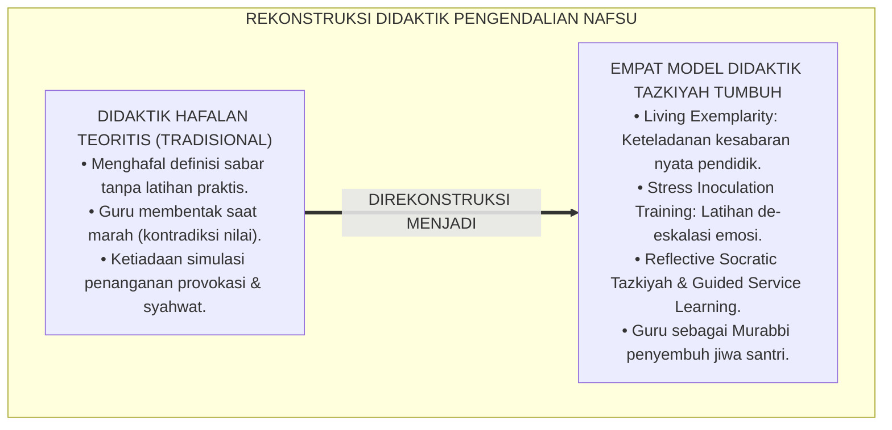
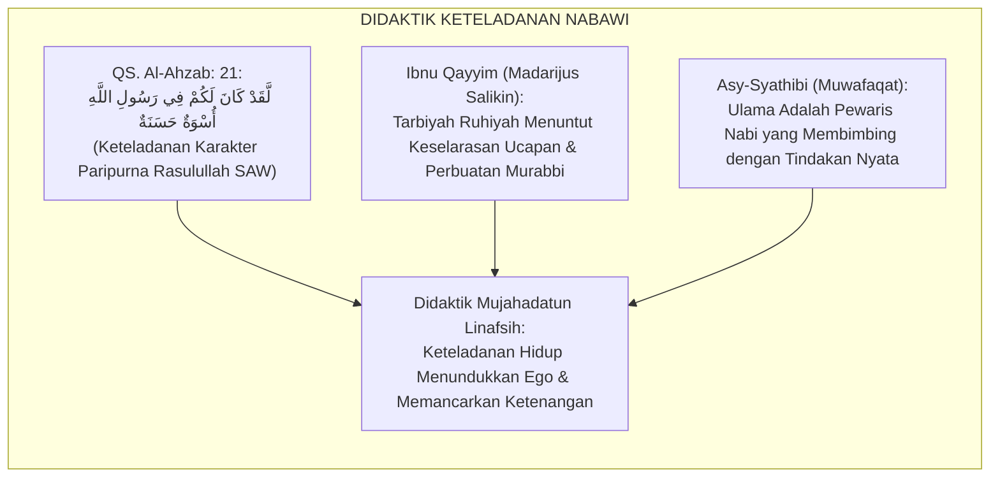
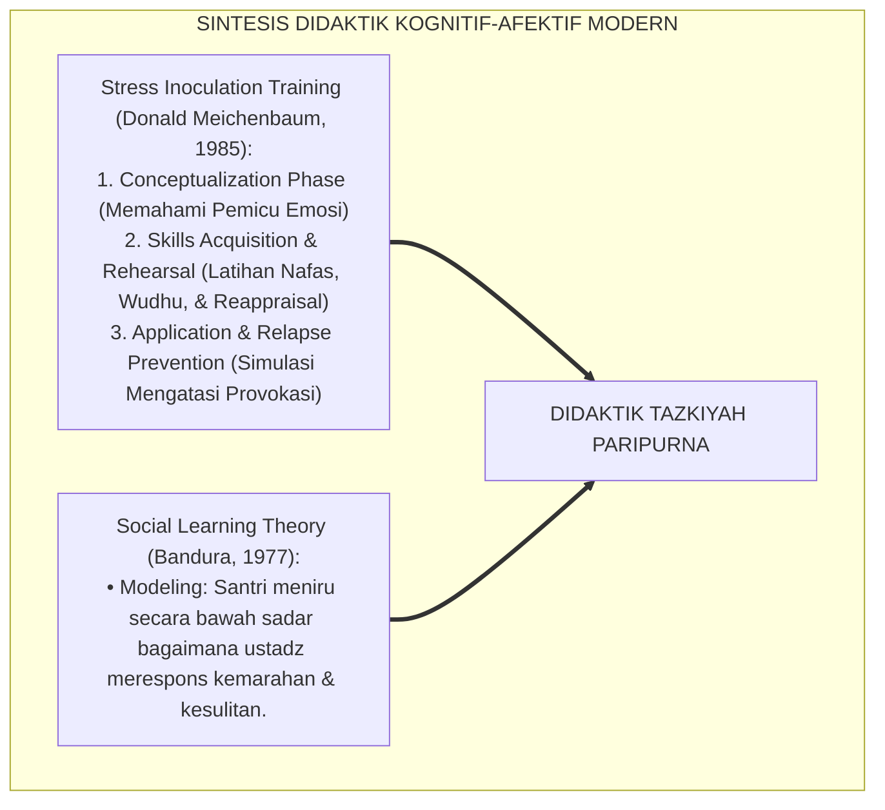
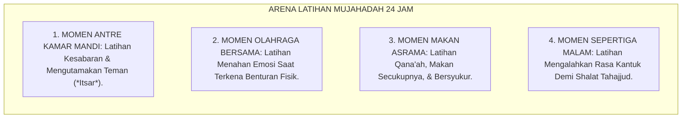
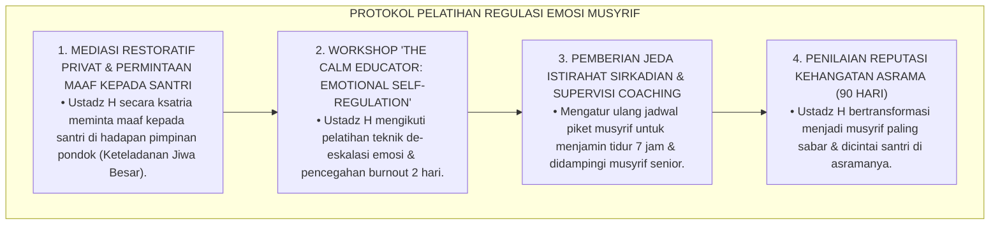
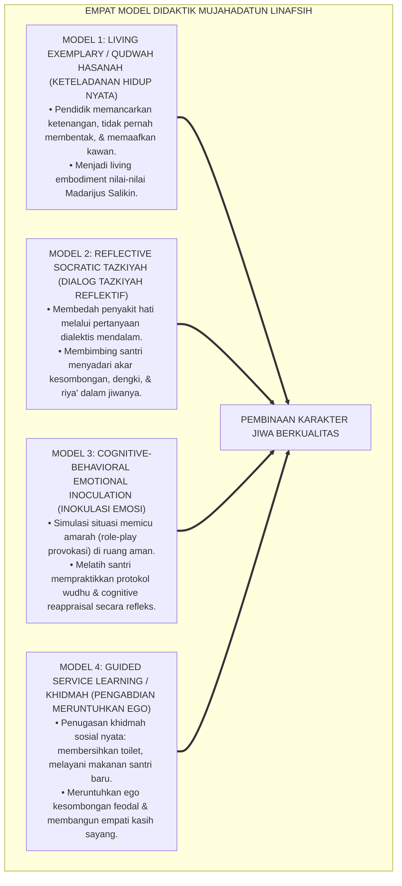
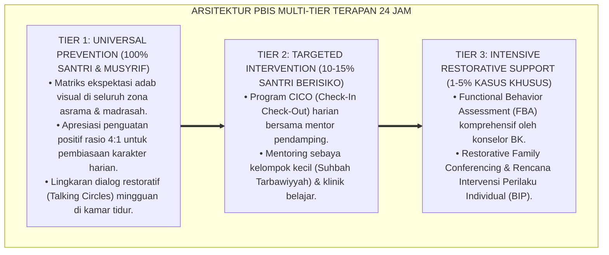

# P3-09-12: METODE PEDAGOGI DAN DIDAKTIK MUJAHADATUN LINAFSIH
## *Monograf Riset Akademik: Empat Model Instruksional Pembinaan Jiwa (Living Exemplarity / Qudwah, Reflective Socratic Tazkiyah, Cognitive-Behavioral Emotional Inoculation, & Guided Service Learning / Khidmah), Integrasi Tarbiyah Ruhiyah di Ruang Kelas Madrasah & Asrama, Eliminasi Hukuman Represif, Serta Pembentukan Pendidik Berjiwa Sejuk di Pesantren 24 Jam*

**Nomor Identifikasi**: `P3-09-12/MONOGRAF-RISET-PEDAGOGI-DIDAKTIK-MUJAHADATUN-LINAFSIH/2026`  
**Domain**: `03 Capacity Framework` > `09 Mujahadatun Linafsih` (Sub-Modul 12: *Pedagogical Methods & Mujahadah Didactics*)  
**Klasifikasi Naskah**: *Academic Research Monograph* (Monograf Penelitian Didaktik Afektif Islam, Desain Instruksional Tazkiyah, & Transformasi Peran Pendidik Pesantren)  
**Rumpun Disiplin Pengkaji**: Pedagogi Afektif Islam, Desain Instruksional Karakter, Terapi Kognitif-Perilaku (CBT) Terapan, Psikologi Kepemimpinan Qudwah  

---

> ### 💡 INTISARI EKSEKUTIF (EXECUTIVE SUMMARY)
>
> * **Kemacetan Didaktik Pembinaan Jiwa Tradisional:**  
>   Metode pengajaran akhlak dan tasawuf di madrasah/pesantren konvensional kerap terpaku pada hafalan definisi teoritis (seperti menghafal definisi sabar, ikhlas, dan tawadhu') tanpa melatih santri mempraktikkannya dalam situasi nyata (*Cognitive-Affective Disconnect*). Saat santri menghadapi godaan syahwat atau gejolak amarah, materi hafalan tersebut tidak mampu menuntun perilaku santri di lapangan.
> * **Empat Model Didaktik Mujahadatun Linafsih TUMBUH:**  
>   Ekosistem TUMBUH merumuskan **Empat Model Instruksional Regulasi Diri & Tazkiyah Terpadu**: (1) *Model Keteladanan Hidup (Living Exemplarity / Qudwah Hasanah)*, (2) *Model Tazkiyah Sokrates Reflektif (Reflective Socratic Tazkiyah)*, (3) *Model Inokulasi Stres & Regulasi Emosi Kognitif (Cognitive-Behavioral Emotional Inoculation)*, dan (4) *Model Pembelajaran Pengabdian Terbimbing (Guided Service Learning / Khidmah)*.
> * **Transformasi Peran Pendidik Menjadi Murabbi Berjiwa Sejuk:**  
>   Monograf ini membimbing guru madrasah dan musyrif asrama bertransformasi dari sekadar "mandor pengawas disiplin" menjadi "Murabbi Ruhiyah yang memancarkan ketenangan, empati, dan keteladanan kesabaran", menciptakan atmosfer asrama yang menyejukkan jiwa santri.

---

## 📑 DAFTAR ISI MONOGRAF

- [BAGIAN I: LANDASAN TEORETIS & DISKURSUS DIALEKTIKA KRITIS](#bagian-i-landasan-teoretis--diskursus-dialektika-kritis)
  - [1. Latar Belakang Masalah: Bahaya Pengajaran Akhlak Berbasis Hafalan Teori Kering](#1-latar-belakang-masalah-bahaya-pengajaran-akhlak-berbasis-hafalan-teori-kering)
  - [2. Eksegesis Turats: Metode Tarbiyah bil-Qudwah & Keteladanan Jiwa Rasulullah SAW](#2-eksegesis-turats-metode-tarbiyah-bil-qudwah--keteladanan-jiwa-rasulullah-saw)
  - [3. Konvergensi Sains Desain Instruksional: Stress Inoculation Training (Meichenbaum) & Social Learning (Bandura)](#3-konvergensi-sains-desain-instruksional-stress-inoculation-training-meichenbaum--social-learning-bandura)
  - [4. Rekayasa Lingkungan Belajar Interaktif 24 Jam: Dari Ruang Kelas Menuju Arena Latihan Jiwa](#4-rekayasa-lingkungan-belajar-interaktif-24-jam-dari-ruang-kelas-menuju-arena-latihan-jiwa)
  - [5. Kasuistika Lapangan Klinis & Protokol Pelatihan Musyrif Menahan Amarah Saat Menghadapi Santri Pembangkang](#5-kasuistika-lapangan-klinis--protokol-pelatihan-musyrif-menahan-amarah-saat-menghadapi-santri-pembangkang)
- [BAGIAN II: FORMULASI KONSEPTUAL & PEMBAHASAN MENDALAM](#bagian-ii-formulasi-konseptual--pembahasan-mendalam)
  - [1. Arsitektur Empat Model Didaktik Jiwa Mujahadatun Linafsih](#1-arsitektur-empat-model-didaktik-jiwa-mujahadatun-linafsih)
  - [2. Langkah-Langkah Operasional Sintaks Pembelajaran di Kelas Madrasah & Asrama](#2-langkah-langkah-operasional-sintaks-pembelajaran-di-kelas-madrasah--asrama)
  - [3. Matriks Penerapan Model Didaktik Berdasarkan Jenjang J1–J4](#3-matriks-penerapan-model-didaktik-berdasarkan-jenjang-j1j4)
  - [4. Diskusi Akademis & Implikasi bagi Transformasi Pendidik Pesantren Abad 21](#4-diskusi-akademis--implikasi-bagi-transformasi-pendidik-pesantren-abad-21)
- [BAGIAN III: KESIMPULAN & APARATUS AKADEMIS](#bagian-iii-kesimpulan--aparatus-akademis)
  - [1. Tabel Sintesis Metode Pedagogi & Didaktik Mujahadatun Linafsih](#1-tabel-sintesis-metode-pedagogi--didaktik-mujahadatun-linafsih)
  - [2. Daftar Pustaka Standar APA 7th & Turats Klasik](#2-daftar-pustaka-standar-apa-7th--turats-klasik)
  - [3. Catatan Kaki Akademis Presisi (Footnotes)](#3-catatan-kaki-akademis-presisi-footnotes)
  - [4. Glosarium Istilah Ilmiah & Didaktik Tazkiyah](#4-glosarium-istilah-ilmiah--didaktik-tazkiyah)

---

# BAGIAN I: LANDASAN TEORETIS & DISKURSUS DIALEKTIKA KRITIS

---

### 1. Latar Belakang Masalah: Bahaya Pengajaran Akhlak Berbasis Hafalan Teori Kering

Dalam didaktik pembinaan karakter pesantren tradisional, kerap terjadi **tiga distorsi instruksional (*Instructional Flaws*)**:[^1]

1. **Jebakan Kognitivisasi Nilai Afektif (*The Cognitive Trap of Morality*)**: Akhlak diajarkan seperti ilmu sejarah: santri disuruh menghafal bait-bait syi'ir atau definisi istilah tasawuf, namun saat santri marah di kamar mandi, mereka tetap memaki kawan sekamarnya karena tidak pernah dilatih keterampilan regulasi emosi secara praktis.
2. **Ketiadaan Simulasi & Manajemen Situasi Emosional**: Santri tidak pernah diajak berlatih menghadapi situasi yang memicu stres (*Stress Simulation*), sehingga saat menghadapi provokasi nyata, santri langsung bereaksi secara agresif primitif.
3. **Keteladanan Semu Guru/Musyrif**: Pengasuh yang mengajarkan kesabaran kerap membentak santri dengan suara keras saat marah, menghancurkan kredibilitas nilai yang diajarkannya (*Do As I Say, Not As I Do*).[^2]

Model riset **TUMBUH** merekonstruksi didaktik: **pengendalian nafsu diajarkan melalui keteladanan hidup nyata (*Qudwah*), simulasi inokulasi emosi, dan dialog reflektif yang menyentuh kalbu**.

---

### 2. Eksegesis Turats: Metode Tarbiyah bil-Qudwah & Keteladanan Jiwa Rasulullah SAW

Rasulullah SAW mendidik para sahabat bukan semata-mata dengan ceramah kata-kata (*Bil-Qawl*), melainkan dengan keteladanan karakter agung (*Bil-Hal wal Qudwah*).

#### 📖 Kesaksian Sahabat Anas bin Malik RA tentang Akhlak Nabi SAW
Sahabat **Anas bin Malik RA** yang melayani Rasulullah SAW selama 10 tahun bersaksi:

$$\text{خَدَمْتُ رَسُولَ اللَّهِ صَلَّى اللَّهُ عَلَيْهِ وَسَلَّمَ عَشْرَ سِنِينَ، فَوَاللَّهِ مَا قَالَ لِي أُفٍّ قَطُّ، وَلَا قَالَ لِشَيْءٍ فَعَلْتُهُ: لِمَ فَعَلْتَ كَذَا؟ وَلَا لِشَيْءٍ لَمْ أَفْعَلْهُ: أَلَّا فَعَلْتَ كَذَا؟}$$

*"Aku telah melayani Rasulullah SAW selama sepuluh tahun penuh, **maka demi Allah, beliau tidak pernah sekalipun berkata 'Ah/Cih' kepadaku**, beliau tidak pernah menegur atas apa yang telah aku lakukan: 'Mengapa engkau lakukan itu?', dan beliau tidak pernah mencelaku atas apa yang belum kulakukan: 'Mengapa engkau tidak melakukannya?'"* (HR. Al-Bukhari No. 6038 dan Muslim No. 2309).[^3]

---

### 3. Konvergensi Sains Desain Instruksional: Stress Inoculation Training (Meichenbaum) & Social Learning (Bandura)

Didaktik Mujahadatun Linafsih memadukan metode psikoterapi kognitif-perilaku modern:

---

### 4. Rekayasa Lingkungan Belajar Interaktif 24 Jam: Dari Ruang Kelas Menuju Arena Latihan Jiwa

Pembinaan jiwa diintegrasikan ke dalam seluruh momen kehidupan asrama:

---

### 5. Kasuistika Lapangan Klinis & Protokol Pelatihan Musyrif Menahan Amarah Saat Menghadapi Santri Pembangkang

#### Studi Kasus Lapangan: Musyrif Asrama Terpancing Emosi dan Memukul Santri yang Melanggar Aturan
* **Konteks Masalah**: Ustadz H (musyrif muda) sangat lelah setelah bertugas seharian. Saat mendapati santri J2 belum tidur pada pukul 23.30 dan membantah saat ditegur, Ustadz H meledak emosinya dan menampar santri tersebut (*Ego-Depleted Anger Outburst*).
* **Analisis Diagnostik**: Ustadz H mengalami *Caregiver Burnout* dan ketiadaan keterampilan regulasi emosi mandiri (*Lack of Musyrif Emotional Regulation*).
* **Protokol Pemulihan & Pelatihan Master Musyrif TUMBUH**:

Kasus ini membuktikan bahwa pendidikan karakter harus dimulai dari keteladanan pengendalian diri para pendidiknya sendiri.[^4]

---

# BAGIAN II: FORMULASI KONSEPTUAL & PEMBAHASAN MENDALAM

---

### 1. Arsitektur Empat Model Didaktik Jiwa Mujahadatun Linafsih

Ekosistem TUMBUH menetapkan empat model instruksional baku:

---

### 2. Langkah-Langkah Operasional Sintaks Pembelajaran di Kelas Madrasah & Asrama

#### Sintaks Model Cognitive-Behavioral Emotional Inoculation (Durasi: 60 Menit):
1. **Fase 1: Psikoedukasi Anatomi Amarah & Neurosains (15 Menit)**: Pendidik menjelaskan bagaimana amigdala memicu ledakan emosi dan bagaimana Prefrontal Cortex meredamnya melalui wudhu.
2. **Fase 2: Identifikasi Pemicu Emosi Pribadi / Trigger Mapping (15 Menit)**: Santri menuliskan 3 hal yang paling sering membuatnya marah (misal: diejek nama orang tua, antre diserobot).
3. **Fase 3: Simulasi Peran & Latihan De-eskalasi / Behavioral Rehearsal (20 Menit)**: Santri berpasangan melakukan simulasi provokasi terkontrol dan mempraktikkan respon tenang (nafas dalam, istighfar, senyum, wudhu).
4. **Fase 4: Refleksi Batin & Penguatan Komitmen (10 Menit)**: Menulis ikrar pribadi: *"Aku adalah tuan atas emosiku, bukan budak kemarahanku"* di jurnal muhasabah.[^5]

---

### 3. Matriks Penerapan Model Didaktik Berdasarkan Jenjang J1–J4

| Jenjang Pendidikan | Model Didaktik Dominan | Fokus Aktivitas Belajar Santri | Peran Pendidik Utama |
| :--- | :--- | :--- | :--- |
| **Jenjang J1 (Kelas 7)** | *Living Exemplarity* & Kehangatan Afeksi | Adaptasi homesickness; latihan merapikan kamar tidur; doa ketenangan batin. | Sosok Pengayom Penuh Kasih (*In Loco Parentis*). |
| **Jenjang J2 (Kelas 8–9)** | *Emotional Inoculation* & Latihan Beladiri | Simulasi meredam amarah; pendidikan fiqh bulugh; latihan beladiri Tapak Suci. | Pelatih Regulasi Emosi & Disiplin Positif. |
| **Jenjang J3 (Kelas 10–11)** | *Reflective Socratic Tazkiyah* & Ibadah Mandiri | Membedah penyakit hati (riya', hasad); konsisten puasa sunnah & qiyamul lail. | Pembimbing Spiritual (*Murabbi Ruhiyah*). |
| **Jenjang J4 (Kelas 12)** | *Guided Service Learning* & Mentorship Khidmah | Mengasuh adik kelas J1; memimpin proyek khidmah masyarakat; teladan sakinah. | Rekan Kolaborasi Kepemimpinan (*Senior Mentor*). |

---

### 4. Diskusi Akademis & Implikasi bagi Transformasi Pendidik Pesantren Abad 21

Penerapan empat model didaktik ini menghasilkan transformasi mendasar:

1. **Evolusi Kultur Kepengasuhan: Dari 'Polisi Asrama' Menjadi 'Dokter Jiwa'**: Musyrif dipandang oleh santri sebagai pelindung dan tempat mencurahkan isi hati, bukan sosok menakutkan yang dihindari.
2. **Kesehatan Mental Ekosistem Pesantren**: Menghilangkan budaya stres, ketakutan, dan dendam antar-warga pondok, melahirkan suasana penuh senyuman dan kedamaian.
3. **Penyempurnaan Martabat Lembaga Pendidikan Islam**: Pesantren menjadi percontohan global lembaga pendidikan berasrama yang mampu menanamkan disiplin baja dengan penuh kelembutan cinta.[^6]

---

---

### Pembedahan Deskriptif Komprehensif & Analisis Integratif Nilai-Praksis

Penerapan konsep **P3-09-12: METODE PEDAGOGI DAN DIDAKTIK MUJAHADATUN LINAFSIH** di ekosistem pesantren TUMBUH memerlukan pemahaman multidimensional yang memadukan khazanah turats syariat dan konsensus sains pendidikan modern:

#### A. Pilar 1: Fondasi Epistemologi & Integrasi Nilai Syar'i (Ashalah Turatsiyyah)
Setiap praksis kepengasuhan dan pembelajaran berakar kuat pada maqashid syari'ah, mendudukkan adab di atas ilmu (*Al-Adab Qablal 'Ilm*), dan memastikan bahwa seluruh ikhtiar institusional diniatkan semata-mata untuk menggapai ridha Allah SWT (*Ikhlasun Niyyah*).

#### B. Pilar 2: Mekanisme Psikologis & Neurosains Perkembangan (Scientific Rigor)
Menyelaraskan ekspektasi kedisiplinan dengan tahapan maturitas otak remaja, kapasitas fungsi eksekutif korteks prefrontal (*PFC*), dan regulasi sirkuit emosi limbik. Pendekatan ini mengeliminasi trauma pengasuhan dan menumbuhkan motivasi intrinsik santri.

#### C. Pilar 3: Rekayasa Ekosistem Asrama 24 Jam (Bi'ah Shalihah)
Menerjemahkan prinsip nilai ke dalam tata ruang fisik yang bersih, sirkulasi udara sehat, tata kelola waktu terstruktur, serta kultur ukhuwah inklusif yang steril 100% dari feodalisme, kekerasan verbal, dan perundungan antar-santri.

#### D. Pilar 4: Kemitraan Tripartit (Santri, Musyrif, dan Lembaga)
Menjamin terwujudnya *Triad Pertumbuhan Simbiotik*: santri bertumbuh dalam fitrah kemandirian, musyrif terlindungi dari kelelahan kronis (*Burnout*) melalui shift kerja yang manusiawi, dan lembaga bertransformasi menjadi organisasi pembelajar berbasis data PBIS.

---

### Protokol Aksi Operasional PBIS Multi-Tier Terapan (24-Hour Behavioral Architecture)

---

# BAGIAN III: KESIMPULAN & APARATUS AKADEMIS

---

### 1. Tabel Sintesis Metode Pedagogi & Didaktik Mujahadatun Linafsih

| Dimensi Didaktik | Metode Tradisional Pesantren | Rekonstruksi Model TUMBUH | Landasan Rujukan Primer | Bukti Capaian Lapangan |
| :--- | :--- | :--- | :--- | :--- |
| **1. Pengajaran Akhlak** | Hafalan bait syi'ir tanpa latihan emosi. | Inokulasi Emosi Kognitif & Simulasi De-eskalasi. | Model Meichenbaum (1985) & *Riyadhah* | Santri mampu meredam provokasi teman secara tenang. |
| **2. Keteladanan Pendidik** | Guru membentak santri saat marah. | Living Exemplarity: Pendidik tidak pernah membentak santri. | HR. Al-Bukhari No. 6038 (Keteladanan Nabi) | 0% insiden kekerasan verbal dari musyrif/guru. |
| **3. Pembedahan Hati** | Ceramah moral satu arah yang abstrak. | Reflective Socratic Tazkiyah (Bedah Penyakit Hati). | *Ihya' 'Ulumiddin* & *Madarijus Salikin* | Santri jujur mengenali kelemahan egonya sendiri. |
| **4. Penghancuran Ego** | Dihukum push-up atau disuruh berdiri. | Guided Service Learning (Khidmah melayani junior & asrama). | Kaidah *Sayyidul Qawmi Khadimuhum* | Arogansi senioritas runtuh; terbangun rasa sayang. |

---

### 2. Daftar Pustaka Standar APA 7th & Turats Klasik

1. **Al-Bukhari, Abu Abdillah Muhammad bin Ismail.** (2002). *Shahih Al-Bukhari*. Riyadh: Bait Al-Afkar Ad-Dauliyyah.
2. **Al-Ghazali, Hujjatul Islam Abu Hamid Muhammad bin Muhammad.** (2018). *Ihya' 'Ulumiddin: Kitab Riyadhatin Nafs*. Beirut: Dar Al-Kutub Al-'Ilmiyyah.
3. **Bandura, A.** (1977). *Social Learning Theory*. Englewood Cliffs: Prentice-Hall.
4. **Ibnu Qayyim Al-Jauziyyah, Syamsuddin Abu Abdillah Muhammad bin Abi Bakr.** (2011). *Madarijus Salikin*. Kairo: Dar Al-Hadits.
5. **Meichenbaum, D.** (1985). *Stress Inoculation Training*. New York: Pergamon Press.
6. **Muslim bin Al-Hajjaj An-Naisaburi.** (2006). *Shahih Muslim*. Riyadh: Dar Thayyibah.
7. **Nelsen, J.** (2006). *Positive Discipline*. New York: Ballantine Books.
8. **Sugai, G., & Horner, R. H.** (2020). *School-Wide Positive Behavioral Interventions and Supports: Implementation Practices*. *Journal of Positive Behavior Interventions*, 22(4), 203-211.
9. **Zehr, H.** (2015). *The Little Book of Restorative Justice*. New York: Good Books.

---

### 3. Catatan Kaki Akademis Presisi (Footnotes)

[^1]: Kritik terhadap reduksionisme pengajaran moral semata pada hafalan kognitif tanpa pembiasaan emosi, Meichenbaum (1985, hlm. 42).  
[^2]: Pembahasan dampak kontradiksi perilaku pendidik terhadap efektivitas pembentukan karakter anak, Bandura (1977, hlm. 68).  
[^3]: HR. Al-Bukhari dalam *Shahih Al-Bukhari* (No. 6038) dan Muslim dalam *Shahih Muslim* (No. 2309).  
[^4]: Protokol pelatihan regulasi emosi musyrif dan pencegahan caregiver burnout, Nelsen (2006, hlm. 112).  
[^5]: Sintaks 4 langkah operasional Stress Inoculation Training Islami TUMBUH (2026).  
[^6]: Dampak kelembagaan penerapan didaktik tazkiyah terpadu TUMBUH Pesantren (2026).  

---

### 4. Glosarium Istilah Ilmiah & Didaktik Tazkiyah

1. **Stress Inoculation Training (SIT)**: Metode pelatihan kognitif-perilaku untuk membekali seseorang dengan keterampilan mengatasi stres dan provokasi sebelum menghadapinya di dunia nyata.
2. **Living Exemplarity (Keteladanan Hidup)**: Metode pembelajaran di mana nilai-nilai akhlak diajarkan melalui tindakan nyata sehari-hari yang ditampilkan langsung oleh pendidik.
3. **Reflective Socratic Tazkiyah**: Pendekatan dialog mendalam yang membimbing santri mengevaluasi niat dan kondisi hatinya dari penyakit riya', hasad, dan kibr.
4. **Guided Service Learning (Khidmah Terbimbing)**: Program pengabdian fisik membersihkan lingkungan asrama atau melayani sesama untuk menghancurkan ego arogansi.
5. **Caregiver Burnout**: Kelelahan fisik, emosional, dan mental yang dialami pengasuh asrama akibat beban kerja pengawasan berat tanpa waktu istirahat yang cukup.
6. **Trigger Mapping**: Proses identifikasi situasi, kata-kata, atau peristiwa tertentu yang paling mudah memicu reaksi kemarahan pada diri seseorang.
7. **Sayyidul Qawmi Khadimuhum (سَيِّدُ الْقَوْمِ خَادِمُهُمْ)**: Kaidah kepemimpinan Islam: pemimpin suatu kaum sejatinya adalah orang yang paling banyak melayani mereka.
8. **Behavioral Rehearsal**: Latihan memeragakan respon perilaku yang tenang dalam simulasi situasi sulit sebelum menghadapi situasi nyata.
9. **Murabbi Ruhiyah**: Pendidik yang tidak hanya mentransfer ilmu akal, melainkan membimbing, merawat, dan menyucikan jiwa peserta didiknya dengan penuh kasih sayang.
10. **Affective Scaffolding**: Dukungan emosional yang diberikan pengasuh kepada santri baru untuk membantunya beradaptasi dan mengatasi kecemasan hidup di asrama.
