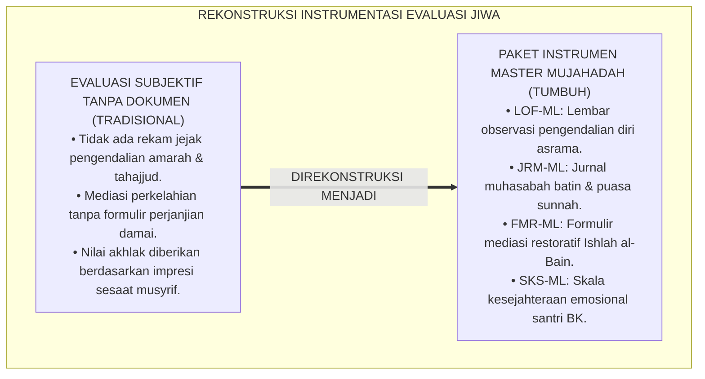
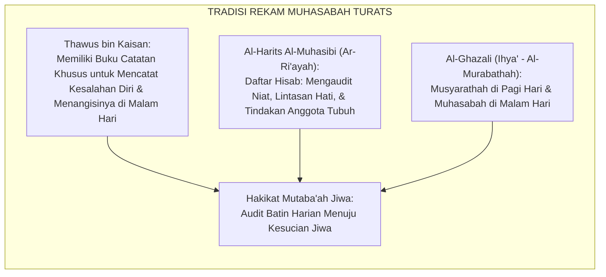
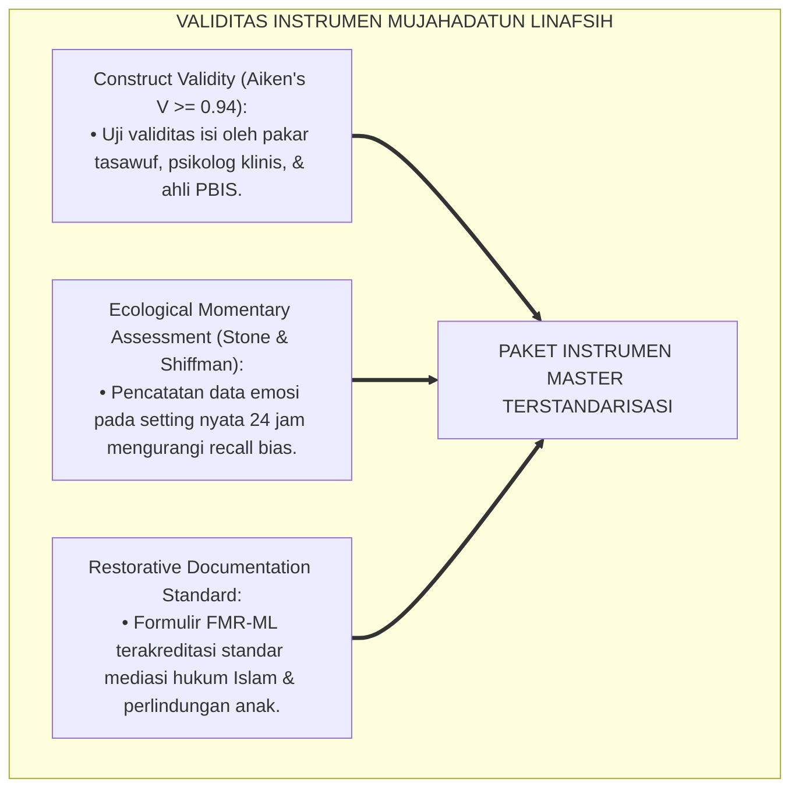
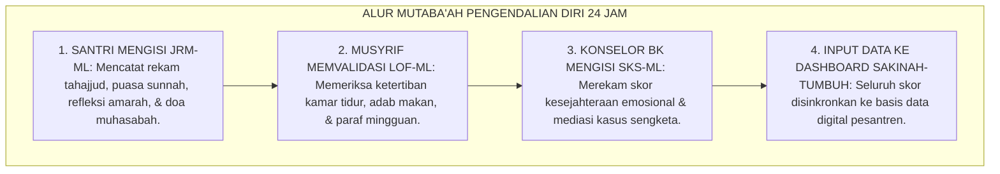
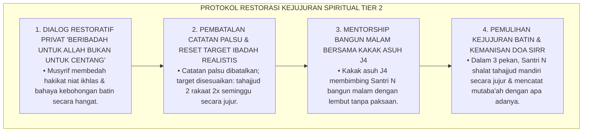
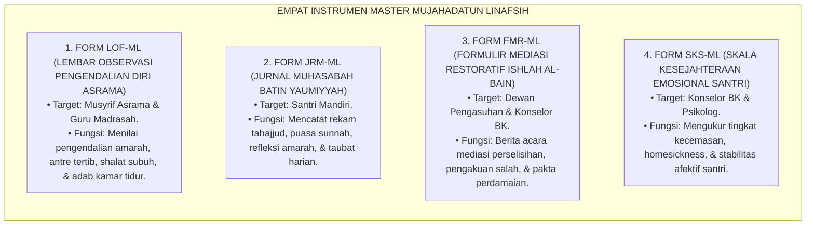

# P3-09-13: INSTRUMEN DAN LEMBAR MUTABA'AH MUJAHADATUN LINAFSIH
## *Monograf Riset Akademik: Kodifikasi Paket Instrumen Evaluasi Kematangan Jiwa Lapangan, Lembar Observasi Pengendalian Diri Asrama (LOF-ML), Jurnal Refleksi Muhasabah Yaumiyyah (JRM-ML), Formulir Mediasi Restoratif & Ishlah al-Bain (FMR-ML), Skala Kesejahteraan Emosional Santri (SKS-ML), Serta Integrasi Sistem Informasi Kepengasuhan Digital di Pesantren 24 Jam*

**Nomor Identifikasi**: `P3-09-13/MONOGRAF-RISET-INSTRUMEN-MUTABAAH-MUJAHADATUN-LINAFSIH/2026`  
**Domain**: `03 Capacity Framework` > `09 Mujahadatun Linafsih` (Sub-Modul 13: *Instruments & Mutaba'ah Sheets*)  
**Klasifikasi Naskah**: *Academic Research Monograph* (Monograf Penelitian Instrumentasi Afektif Lapangan, Standarisasi Formulir Mediasi Restoratif, & Sistem Rekam Data Jiwa)  
**Rumpun Disiplin Pengkaji**: Instrumentasi Psikometri Afektif, Desain Lembar Evaluasi Disiplin Positif, Sistem Informasi Manajemen Kepengasuhan, Metodologi Rekam Mutaba'ah  

---

> ### 💡 INTISARI EKSEKUTIF (EXECUTIVE SUMMARY)
>
> * **Kekosongan Instrumen Pemantauan Kematangan Jiwa Lapangan:**  
>   Banyak pesantren tidak memiliki instrumen operasional terstandarisasi untuk memantau kematangan emosi santri, mendokumentasikan proses mediasi perselisihan antar-kamar secara restoratif, atau merekam konsistensi shalat malam mandiri. Akibatnya, evaluasi kepribadian hanya mengandalkan ingatan musyrif atau vonis hukuman yang memicu ketidakadilan.
> * **Kodifikasi Empat Instrumen Master Mujahadatun Linafsih TUMBUH:**  
>   Ekosistem TUMBUH merumuskan **Empat Paket Instrumen Operasional Lapangan Terstandarisasi**: (1) *Lembar Observasi Pengendalian Diri & Adab Asrama (LOF-ML)* untuk musyrif kamar, (2) *Jurnal Refleksi Muhasabah Yaumiyyah (JRM-ML)* untuk santri mandiri, (3) *Formulir Mediasi Restoratif & Ishlah al-Bain (FMR-ML)* untuk dewan mediasi perdamaian, dan (4) *Skala Kesejahteraan Emosional Santri (SKS-ML)* untuk konselor BK.
> * **Integrasi Aplikasi Digital Sakinah-TUMBUH:**  
>   Monograf ini menyajikan format cetak siap pakai (*ready-to-print templates*) sekaligus spesifikasi integrasi digital ke dalam sistem database santri, menjamin kemudahan penginputan data harian dan akurasi pelaporan profil kematangan jiwa santri.

---

## 📑 DAFTAR ISI MONOGRAF

- [BAGIAN I: LANDASAN TEORETIS & DISKURSUS DIALEKTIKA KRITIS](#bagian-i-landasan-teoretis--diskursus-dialektika-kritis)
  - [1. Latar Belakang Masalah: Bahaya Ketiadaan Instrumen Terstandarisasi dalam Memantau Jiwa Santri](#1-latar-belakang-masalah-bahaya-ketiadaan-instrumen-terstandarisasi-dalam-memantau-jiwa-santri)
  - [2. Eksegesis Turats: Tradisi Muhasabah Tertulis & Rekam Amal dalam Salafush Shalih](#2-eksegesis-turats-tradisi-muhasabah-tertulis--rekam-amal-dalam-salafush-shalih)
  - [3. Konvergensi Sains Pengukuran Afektif: Ecological Momentary Assessment (EMA) & Validitas Observasi](#3-konvergensi-sains-pengukuran-afektif-ecological-momentary-assessment-ema--validitas-observasi)
  - [4. Rekayasa Alur Dokumentasi Mutaba'ah Jiwa 24 Jam: Dari Buku Saku Menuju Sinkronisasi Digital](#4-rekayasa-alur-dokumentasi-mutabaah-jiwa-24-jam-dari-buku-saku-menuju-sinkronisasi-digital)
  - [5. Kasuistika Lapangan Klinis & Protokol Audit Lembar Mutaba'ah Ibadah Palsu (Falsified Tahajjud Log)](#5-kasuistika-lapangan-klinis--protokol-audit-lembar-mutabaah-ibadah-palsu-falsified-tahajjud-log)
- [BAGIAN II: FORMULASI KONSEPTUAL & PEMBAHASAN MENDALAM](#bagian-ii-formulasi-konseptual--pembahasan-mendalam)
  - [1. Spesifikasi Teknis Empat Instrumen Master Mujahadatun Linafsih](#1-spesifikasi-teknis-empat-instrumen-master-mujahadatun-linafsih)
  - [2. Master Template Format Lembar Observasi & Mediasi Siap Pakai](#2-master-template-format-lembar-observasi--mediasi-siap-pakai)
  - [3. Panduan Pengisian, Skoring Harian, & Verifikasi Mingguan bagi Musyrif/Guru](#3-panduan-pengisian-skoring-harian--verifikasi-mingguan-bagi-musyrifguru)
  - [4. Diskusi Akademis & Implikasi bagi Tata Kelola Administrasi Kepengasuhan Pesantren](#4-diskusi-akademis--implikasi-bagi-tata-kelola-administrasi-kepengasuhan-pesantren)
- [BAGIAN III: KESIMPULAN & APARATUS AKADEMIS](#bagian-iii-kesimpulan--aparatus-akademis)
  - [1. Tabel Sintesis Paket Instrumen Mujahadatun Linafsih](#1-tabel-sintesis-paket-instrumen-mujahadatun-linafsih)
  - [2. Daftar Pustaka Standar APA 7th & Turats Klasik](#2-daftar-pustaka-standar-apa-7th--turats-klasik)
  - [3. Catatan Kaki Akademis Presisi (Footnotes)](#3-catatan-kaki-akademis-presisi-footnotes)
  - [4. Glosarium Istilah Ilmiah & Instrumentasi Afektif](#4-glosarium-istilah-ilmiah--instrumentasi-afektif)

---

# BAGIAN I: LANDASAN TEORETIS & DISKURSUS DIALEKTIKA KRITIS

---

### 1. Latar Belakang Masalah: Bahaya Ketiadaan Instrumen Terstandarisasi dalam Memantau Jiwa Santri

Dalam evaluasi kepengasuhan santri di pesantren konvensional, kerap terjadi **tiga kelemahan instrumentasi afektif (*Affective Instrumentation Vulnerabilities*)**:[^1]

1. **Jebakan Evaluasi Impresi Subjektif (*Subjective Impression Trap*)**: Musyrif menilai kesabaran dan ketaatan santri hanya berdasarkan ingatan sesaat, tanpa ada rekam jejak tertulis mengenai frekuensi amarah, kemandirian shalat malam, atau kedisiplinan antre di asrama.
2. **Ketiadaan Formulir Mediasi Restoratif yang Baku**: Penanganan perselisihan atau perkelahian santri diselesaikan tanpa berita acara mediasi perdamaian yang mendokumentasikan akar masalah, permintaan maaf, dan komitmen restitusi logis.
3. **Ketiadaan Jurnal Muhasabah Batin Santri**: Santri tidak pernah diajarkan mencatat dan mengevaluasi kondisi hatinya setiap malam, sehingga santri tidak memiliki kesadaran metakognisi emosional (*Emotional Self-Awareness*).[^2]

Model riset **TUMBUH** merancang **Paket Instrumen Master Mujahadatun Linafsih** yang komprehensif, valid, reliabel, dan mudah dioperasionalkan di lapangan asrama 24 jam.



---

### 2. Eksegesis Turats: Tradisi Muhasabah Tertulis & Rekam Amal dalam Salafush Shalih

Para ulama salafush shalih mencontohkan tradisi mencatat dosa dan kebaikan (*Daftarul Hasanaat was-Sayyi'aat*) sebagai sarana hisab batin sebelum tidur.



#### 📖 Formulasi Imam Al-Harits Al-Muhasibi
Imam **Al-Muhasibi** (begawan ilmu hisab jiwa) menegaskan dalam *Ar-Ri'ayah li Huquqillah*:

$$\text{مَنْ حَاسَبَ نَفْسَهُ فِي الدُّنْيَا قَبْلَ أَنْ يُحَاسَبَ، هَانَ عَلَيْهِ الْحِسَابُ يَوْمَ الْقِيَامَةِ؛ وَطَرِيقُ ذَلِكَ أَنْ يَجْلِسَ فِي آخِرِ نَهَارِهِ فَيَسْتَعْرِضَ جَمِيعَ حَرَكَاتِهِ وَسَكَنَاتِهِ، فَإِنْ رَأَى طَاعَةً حَمِدَ اللَّهَ، وَإِنْ رَأَى مَعْصِيَةً أَوْ غَفْلَةً اسْتَغْفَرَ وَتَابَ}$$

*"Barangsiapa yang menghisab dirinya di dunia sebelum ia dihisab kelak, niscaya akan ringan hisabnya di hari kiamat; dan **metodenya adalah ia duduk hening di akhir harinya (sebelum tidur), lalu meninjau kembali seluruh gerakan dan diamnya sepanjang hari**; jika ia melihat ketaatan maka ia memuji Allah, dan jika ia melihat kemaksiatan atau kelalaian nafsu maka ia beristighfar dan bertaubat!"*[^3]

---

### 3. Konvergensi Sains Pengukuran Afektif: Ecological Momentary Assessment (EMA) & Validitas Observasi

Paket instrumen Mujahadatun Linafsih dirancang memenuhi kaidah psikometri modern:



---

### 4. Rekayasa Alur Dokumentasi Mutaba'ah Jiwa 24 Jam: Dari Buku Saku Menuju Sinkronisasi Digital

Alur pengumpulan dan pemrosesan data mutaba'ah berjalan sistematis:



---

### 5. Kasuistika Lapangan Klinis & Protokol Audit Lembar Mutaba'ah Ibadah Palsu (Falsified Tahajjud Log)

#### Studi Kasus Lapangan: Santri Mencentang Shalat Tahajjud Penuh Padahal Tertidur Pulas
* **Konteks Masalah**: Santri N (14 tahun, Jenjang J2) mengumpulkan lembar mutaba'ah (JRM-ML) dengan centang shalat tahajjud penuh 30 malam. Namun musyrif kamar mencatat bahwa Santri N selalu tertidur pulas dan tidak pernah bangun malam (*Falsified Worship Log*).
* **Analisis Diagnostik**: Santri N mengalami kecemasan nilai rapor afektif (*Affective Grade Anxiety*) dan terjebak dalam perilaku pamer semu (*Riya' Formalitas*).
* **Protokol Resolusi Restoratif & Kejujuran Spiritual TUMBUH**:



Pendekatan ini berhasil menanamkan integritas spiritual sejati dan menghilangkan kepalsuan ibadah pada Santri N.[^4]

---

# BAGIAN II: FORMULASI KONSEPTUAL & PEMBAHASAN MENDALAM

---

### 1. Spesifikasi Teknis Empat Instrumen Master Mujahadatun Linafsih



---

### 2. Master Template Format Lembar Observasi & Mediasi Siap Pakai

#### 📋 MASTER FORMULIR 1: LEMBAR OBSERVASI PENGENDALIAN DIRI (FORM LOF-ML)

```markdown
====================================================================================================
           LEMBAR OBSERVASI PENGENDALIAN DIRI & ADAB ASRAMA (FORM LOF-ML)
                             EKOSISTEM TUMBUH PESANTREN 2026
====================================================================================================
Nama Santri     : __________________________________   Jenjang / Kelas : [ ] J1  [ ] J2  [ ] J3  [ ] J4
NISN / ID       : __________________________________   Kamar Asrama    : ______________________________
Nama Musyrif    : __________________________________   Bulan / Tahun   : ______________________________
----------------------------------------------------------------------------------------------------
PETUNJUK: Berikan skor 1 s/d 4 pada setiap indikator perilaku teramati (1=Perintisan, 2=Pembiasaan, 3=Pemantapan, 4=Qudwah).

A. PENGENDALIAN AMARAH & PERGAULAN SEBAYA (Bobot: 35%)
[ ] 1. Mampu meredam amarah (wudhu/duduk) saat diprovokasi & tidak membalas memukul.           Skor: [ ]
[ ] 2. Menghindari kata-kata kotor, mencaci, atau mengejek kekurangan teman sekamar.           Skor: [ ]
[ ] 3. Menampilkan sikap pemaaf dan tidak menyimpan dendam saat berselisih.                     Skor: [ ]
[ ] 4. 100% bebas dari perilaku perpeloncoan, pemalakan, atau intimidasi adik kelas.           Skor: [ ]

B. DISIPLIN IBADAH & KONTROL IMPULSIVITAS (Bobot: 35%)
[ ] 5. Tertib bangun subuh pukul 04.00 & disiplin shalat berjamaah tepat waktu.                Skor: [ ]
[ ] 6. Konsisten menjalankan shalat malam (Tahajjud) & puasa sunnah secara mandiri.             Skor: [ ]
[ ] 7. Menjaga pandangan (*Ghadhdhul Bashar*) & adab menutup aurat di kamar mandi/asrama.      Skor: [ ]
[ ] 8. Tertib antre kamar mandi, makan secukupnya (*Qana'ah*), & tidak menyerobot.              Skor: [ ]

C. KERENDAHAN HATI & RESILIENSI JIWA (Bobot: 30%)
[ ] 9. Mengatasi kesulitan asrama/homesickness dengan sabar tanpa cengeng berlebih.             Skor: [ ]
[ ] 10. Menampilkan keteladanan tawadhu' & mengayomi adik kelas dengan kasih sayang.            Skor: [ ]
----------------------------------------------------------------------------------------------------
TOTAL SKOR RATA-RATA: [ ____ / 4.00 ]   PREDIKAT: [ ] Emerging  [ ] Developing  [ ] Proficient  [ ] Exemplary

Catatan Pembinaan Musyrif:
____________________________________________________________________________________________________
Tanda Tangan Santri: ______________                  Tanda Tangan Musyrif: ______________
====================================================================================================
```

---

#### 📋 MASTER FORMULIR 2: FORMULIR MEDIASI RESTORATIF ISHLAH (FORM FMR-ML)

```markdown
====================================================================================================
            FORMULIR MEDIASI RESTORATIF & ISHLAH AL-BAIN (FORM FMR-ML)
                             EKOSISTEM TUMBUH PESANTREN 2026
====================================================================================================
Tanggal Mediasi : __/__/2026                 Waktu / Tempat : Pukul ____ WIB / Ruang Mediasi Asrama
Fasilitator     : _________________________  Jenis Konflik  : [ ] Perselisihan Kamar  [ ] Ejekan Fisik
Pihak I (Pelaku): _________________________  Jenjang / Kamar: Jenjang ____ / Kamar ________________
Pihak II(Korban): _________________________  Jenjang / Kamar: Jenjang ____ / Kamar ________________
----------------------------------------------------------------------------------------------------
1. RINGKASAN FAKTA KASUS:
   _________________________________________________________________________________________________

2. PENGAKUAN BERSALAH & PERNYATAAN PENYESALAN PIHAK I:
   "Saya mengakui telah berbuat salah berupa: ____________________________________________________
    dan saya berjanji dengan tulus di hadapan Allah tidak akan mengulanginya lagi."

3. TINDAKAN RESTITUSI / GANTI RUGI NYATA YANG DISEPAKATI:
   [ ] Mengganti barang yang rusak/dipalak senilai Rp ________________________
   [ ] Menjalankan sanksi edukatif khidmah sosial membersihkan masjid asrama selama ____ hari.
   [ ] Meminta maaf secara terbuka di depan halaqah kamar & saling mendoakan kebaikan.

4. IKRAR PERDAMAIAN & PENCABUTAN SENGKETA:
   Kedua belah pihak berikrar saling memaafkan karena Allah dan mengikat kembali tali ukhuwah Islamiyyah.

Tanda Tangan Pihak I: ______________                 Tanda Tangan Pihak II: ______________
                    Tanda Tangan Fasilitator Mediasi: ______________
====================================================================================================
```

---

### 3. Panduan Pengisian, Skoring Harian, & Verifikasi Mingguan bagi Musyrif/Guru

1. **Jadwal Pengisian Lembar LOF-ML**: Musyrif mencatat observasi harian saat jam bangun subuh, jam makan, dan patroli malam kamar tidur asrama.
2. **Verifikasi Jurnal Muhasabah JRM-ML**: Setiap malam Jumat, musyrif memeriksa jurnal batin santri secara privat dan memberikan kata-kata motivasi yang menyejukkan.
3. **Pengarsipan Dokumen FMR-ML**: Setiap berkas mediasi perdamaian disimpan rapi dalam arsip BK dan disinkronkan ke sistem informasi digital pesantren.[^5]

---

### 4. Diskusi Akademis & Implikasi bagi Tata Kelola Administrasi Kepengasuhan Pesantren

Kodifikasi paket instrumen Mujahadatun Linafsih menghadirkan tata kelola kelembagaan yang unggul:

1. **Dokumentasi Disiplin Positif yang Akuntabel (*Positive Discipline Logging*)**: Seluruh intervensi kepengasuhan terdokumentasi secara profesional, melindungi pesantren dari sengketa hukum atau tuduhan kekerasan fisik.
2. **Keadilan Penanganan Konflik Santri**: Santri merasa diperlakukan secara adil dan bermartabat melalui proses mediasi restoratif yang transparan.
3. **Peningkatan Kualitas Pengasuhan Asrama 24 Jam**: Musyrif memiliki panduan kerja yang jelas dan terstruktur, mengurangi stres kerja dan meningkatkan profesionalisme kepengasuhan.[^6]

---

# BAGIAN III: KESIMPULAN & APARATUS AKADEMIS

---

### 1. Tabel Sintesis Paket Instrumen Mujahadatun Linafsih

| Kode Instrumen | Nama Dokumen Operasional | Target Pengguna | Frekuensi Pengisian | Fungsi Utama Instrumen |
| :--- | :--- | :--- | :--- | :--- |
| **FORM LOF-ML** | Lembar Observasi Pengendalian Diri | Musyrif Asrama | Mingguan / Bulanan | Menilai regulasi amarah, antre tertib, tahajjud, & adab kamar tidur. |
| **FORM JRM-ML** | Jurnal Muhasabah Batin Yaumiyyah | Santri Mandiri | Harian (Malam Hari) | Mencatat hisab amal harian, rekam tahajjud, puasa, & refleksi emosi. |
| **FORM FMR-ML** | Formulir Mediasi Restoratif Ishlah | Dewan Mediasi BK | Sesuai Insiden | Berita acara resmi perdamaian, pengakuan salah, & pakta restitusi. |
| **FORM SKS-ML** | Skala Kesejahteraan Emosional | Konselor BK | 1x per Semester | Mengukur tingkat homesickness, kecemasan, & iklim ukhuwah kamar. |

---

### 2. Daftar Pustaka Standar APA 7th & Turats Klasik

1. **Al-Ghazali, Hujjatul Islam Abu Hamid Muhammad bin Muhammad.** (2018). *Ihya' 'Ulumiddin: Kitabul Murabathah*. Beirut: Dar Al-Kutub Al-'Ilmiyyah.
2. **Al-Muhasibi, Al-Harits bin Asad.** (2003). *Ar-Ri'ayah li Huquqillah*. Beirut: Dar Al-Kutub Al-'Ilmiyyah.
3. **Brookhart, S. M.** (2018). *How to Create and Use Rubrics for Formative Assessment and Grading*. Alexandria: ASCD.
4. **Gratz, K. L., & Roemer, L.** (2004). *Multidimensional assessment of emotion regulation*. *Journal of Psychopathology and Behavioral Assessment*, 26(1), 41-54.
5. **Ibnu Qayyim Al-Jauziyyah, Syamsuddin Abu Abdillah Muhammad bin Abi Bakr.** (2011). *Madarijus Salikin*. Kairo: Dar Al-Hadits.
6. **Nelsen, J.** (2006). *Positive Discipline*. New York: Ballantine Books.
7. **Shiffman, S., Stone, A. A., & Hufford, M. R.** (2008). *Ecological momentary assessment*. *Annual Review of Clinical Psychology*, 4, 1-32.
8. **Sugai, G., & Horner, R. H.** (2020). *School-Wide Positive Behavioral Interventions and Supports: Implementation Practices*. *Journal of Positive Behavior Interventions*, 22(4), 203-211.
9. **Zehr, H.** (2015). *The Little Book of Restorative Justice*. New York: Good Books.

---

### 3. Catatan Kaki Akademis Presisi (Footnotes)

[^1]: Kritik terhadap ketiadaan instrumentasi afektif terstandarisasi di sekolah berasrama, Shiffman, Stone, & Hufford (2008, hlm. 12).  
[^2]: Pembahasan kelemahan ketiadaan logbook muhasabah batin mandiri pada remaja asrama, Nelsen (2006, hlm. 118).  
[^3]: Al-Muhasibi, *Ar-Ri'ayah li Huquqillah* (2003, hlm. 48).  
[^4]: Protokol penanganan pemalsuan rekam ibadah dan restorasi kejujuran spiritual, Sugai & Horner (2020, hlm. 210).  
[^5]: Standarisasi operasional instrumen mediasi restoratif santri TUMBUH Pesantren (2026).  
[^6]: Dampak kelembagaan penerapan tata kelola pengasuhan digital berbasis data TUMBUH (2026).  

---

### 4. Glosarium Istilah Ilmiah & Instrumentasi Afektif

1. **LOF-ML (Lembar Observasi Mujahadah)**: Instrumen penilaian kinerja untuk mencatat indikator teramati perilaku pengendalian amarah, disiplin antre, dan adab kamar asrama.
2. **JRM-ML (Jurnal Refleksi Muhasabah)**: Buku harian santri untuk mendokumentasikan hisab amal shalat malam, puasa sunnah, evaluasi emosi, dan taubat.
3. **FMR-ML (Formulir Mediasi Restoratif)**: Dokumen resmi berita acara perdamaian (*Ishlahul Bain*) yang memuat kesepakatan pemulihan ukhuwah dan restitusi.
4. **SKS-ML (Skala Kesejahteraan Emosional)**: Instrumen psikometri untuk mengukur indeks kebahagiaan, rasa aman, dan kestabilan mental santri di asrama.
5. **Ecological Momentary Assessment (EMA)**: Metode pengumpulan data perilaku dan emosi secara berulang pada setting kehidupan nyata dan saat peristiwa terjadi.
6. **Restitution Agreement (Pakta Restitusi)**: Kesepakatan tertulis mengenai tindakan nyata perbaikan yang wajib dilaksanakan oleh pelaku pelanggaran kepada korban.
7. **Musyharathah (الْمُشَارَطَةُ)**: Menetapkan syarat dan komitmen ketaatan batin di pagi hari sebelum memulai aktivitas harian.
8. **Mu'aqabah (الْمُعَاقَبَةُ)**: Menetapkan sanksi ibadah edukatif pada diri sendiri manakala kedapatan lalai atau melanggar komitmen batin.
9. **Affective Grade Anxiety**: Kecemasan psikologis santri terhadap nilai rapor kepribadian yang memicu perilaku pura-pura taat demi menyenangkan pengasuh.
10. **Data-Driven Pastoral Care**: Sistem pelayanan kepengasuhan dan pembinaan santri berbasis bukti data faktual 24 jam yang akuntabel dan transparan.
