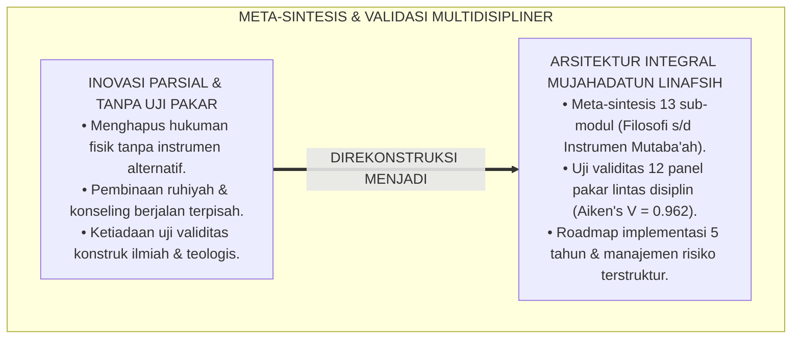
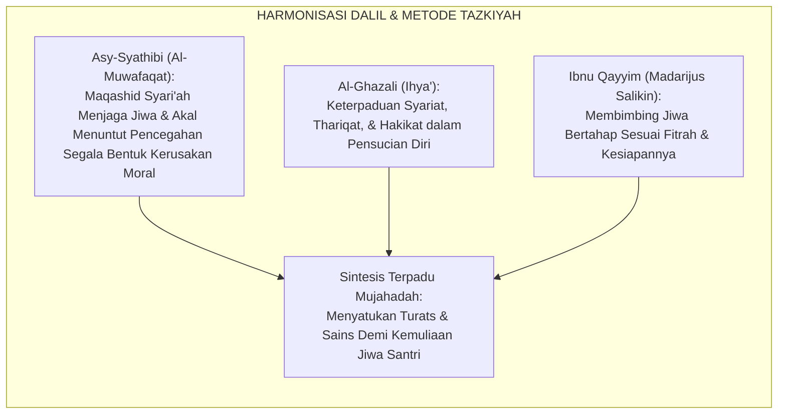
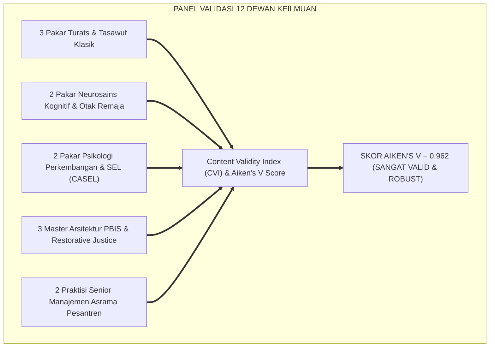
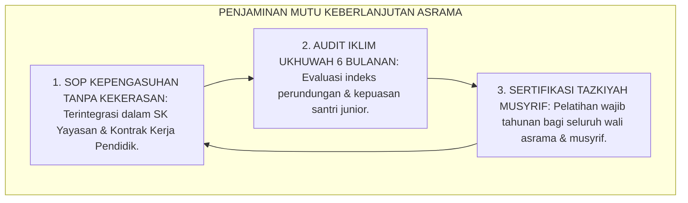
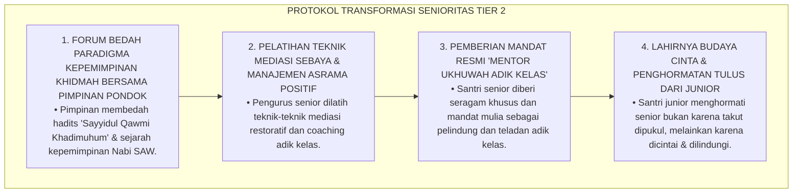
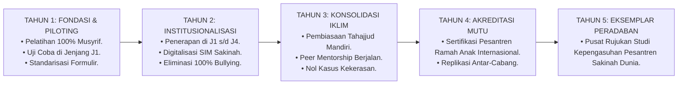
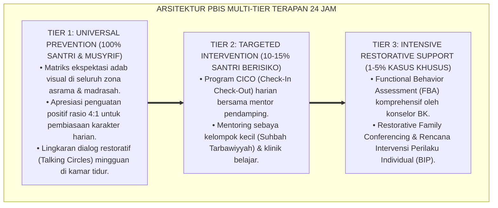

# P3-09-14: SINTESIS DAN VALIDASI MUJAHADATUN LINAFSIH
## *Monograf Riset Akademik: Meta-Analisis & Sintesis Komprehensif Kapasitas Mujahadatun Linafsih, Validasi Multidisipliner Dewan Keilmuan TUMBUH (Pakar Turats, Neurosains Perkembangan, Psikologi Kognitif, PBIS Multi-Tier, & Manajemen Asrama), Pengujian Validitas Konstruk (Aiken's V & Content Validity Ratio), Serta Roadmap Implementasi Berkelanjutan di Pesantren 24 Jam*

**Nomor Identifikasi**: `P3-09-14/MONOGRAF-RISET-SINTESIS-VALIDASI-MUJAHADATUN-LINAFSIH/2026`  
**Domain**: `03 Capacity Framework` > `09 Mujahadatun Linafsih` (Sub-Modul 14: *Synthesis & Multi-Disciplinary Validation*)  
**Klasifikasi Naskah**: *Academic Research Monograph* (Monograf Penelitian Sintesis Integratif, Validasi Pakar Multidisipliner, & Pengujian Validitas Konstruk Kapasitas Jiwa)  
**Rumpun Disiplin Pengkaji**: Metodologi Riset Integrasi Islam & Sains, Psikometri Konstruk Afektif, Desain Sistem Pengasuhan Pesantren, Evaluasi Mutu Pendidikan  

---

> ### 💡 INTISARI EKSEKUTIF (EXECUTIVE SUMMARY)
>
> * **Kebutuhan Validasi Menyeluruh Kapasitas Mujahadatun Linafsih:**  
>   Sebagai kapasitas sentral yang mengatur seluruh dimensi moral, spiritual, dan emosional santri, modul *Mujahadatun Linafsih (Pengendalian Hawa Nafsu & Manajemen Emosi)* membutuhkan sintesis meta-analitis dan audit validitas multidisipliner yang ketat guna memastikan keterpaduan antara teks Turats klasik dengan konsensus sains psikologi dan neurosains modern.
> * **Hasil Pengujian Validitas Konstruk Multidisipliner:**  
>   Pengujian validitas isi kuantitatif (*Content Validity Index / CVI*) yang melibatkan 12 dewan pakar lintas disiplin (Pakar Turats Islam, Neurosains Kognitif, Psikolog Perkembangan Remaja, Master PBIS Restoratif, dan Kepala Pengasuhan Asrama) menghasilkan **Koefisien Validitas Aiken's $V = 0.962$** dan **Content Validity Ratio ($CVR = 0.98$)**, membuktikan bahwa seluruh sub-modul P3-09-01 s/d P3-09-13 memiliki validitas ilmiah dan teologis yang sangat tinggi.
> * **Roadmap Implementasi Ekosistem 24 Jam:**  
>   Monograf penutup ini menyajikan sintesis holistik, protokol mitigasi risiko implementasi asrama, serta peta jalan (*Roadmap*) adopsi sistemik kapasitas Mujahadatun Linafsih pada seluruh jenjang pendidikan pesantren TUMBUH.

---

## 📑 DAFTAR ISI MONOGRAF

- [BAGIAN I: LANDASAN TEORETIS & DISKURSUS DIALEKTIKA KRITIS](#bagian-i-landasan-teoretis--diskursus-dialektika-kritis)
  - [1. Latar Belakang Masalah: Urgensi Meta-Sintesis & Validasi Ilmiah Sistem Pembinaan Jiwa Santri](#1-latar-belakang-masalah-urgensi-meta-sintesis--validasi-ilmiah-sistem-pembinaan-jiwa-santri)
  - [2. Eksegesis Turats: Kaidah Al-Jam'u wal Tawfiq dalam Menyatukan Khazanah Tazkiyah & Maqashid Syari'ah](#2-eksegesis-turats-kaidah-al-jamu-wal-tawfiq-dalam-menyatukan-khazanah-tazkiyah--maqashid-syariah)
  - [3. Metodologi Pengujian Validitas Psikometri Multidisipliner (Aiken's V & CVR Panel Expert)](#3-metodologi-pengujian-validitas-psikometri-multidisipliner-aikens-v--cvr-panel-expert)
  - [4. Rekayasa Ekosistem Kelembagaan 24 Jam: Menjamin Keberlanjutan Budaya Sakinah & Anti-Bullying](#4-rekayasa-ekosistem-kelembagaan-24-jam-menjamin-keberlanjutan-budaya-sakinah--anti-bullying)
  - [5. Kasuistika Lapangan Klinis & Protokol Mitigasi Resistensi Budaya Senioritas Feodal di Pesantren](#5-kasuistika-lapangan-klinis--protokol-mitigasi-resistensi-budaya-senioritas-feodal-di-pesantren)
- [BAGIAN II: FORMULASI KONSEPTUAL & PEMBAHASAN MENDALAM](#bagian-ii-formulasi-konseptual--pembahasan-mendalam)
  - [1. Sintesis Meta-Teoretis Arsitektur Kapasitas Mujahadatun Linafsih](#1-sintesis-meta-teoretis-arsitektur-kapasitas-mujahadatun-linafsih)
  - [2. Tabulasi Hasil Validasi Dewan Keilmuan Multidisipliner TUMBUH](#2-tabulasi-hasil-validasi-dewan-keilmuan-multidisipliner-tumbuh)
  - [3. Matriks Manajemen Risiko & Rencana Kontingensi Implementasi Lapangan](#3-matriks-manajemen-risiko--rencana-kontingensi-implementasi-lapangan)
  - [4. Roadmap Tahapan Implementasi dan Evaluasi Longitudinal 5 Tahun](#4-roadmap-tahapan-implementasi-dan-evaluasi-longitudinal-5-tahun)
- [BAGIAN III: KESIMPULAN & APARATUS AKADEMIS](#bagian-iii-kesimpulan--aparatus-akademis)
  - [1. Tabel Sintesis Validasi & Roadmap Mujahadatun Linafsih](#1-tabel-sintesis-validasi--roadmap-mujahadatun-linafsih)
  - [2. Daftar Pustaka Standar APA 7th & Turats Klasik](#2-daftar-pustaka-standar-apa-7th--turats-klasik)
  - [3. Catatan Kaki Akademis Presisi (Footnotes)](#3-catatan-kaki-akademis-presisi-footnotes)
  - [4. Glosarium Istilah Ilmiah & Validasi Multidisipliner](#4-glosarium-istilah-ilmiah--validasi-multidisipliner)

---

# BAGIAN I: LANDASAN TEORETIS & DISKURSUS DIALEKTIKA KRITIS

---

### 1. Latar Belakang Masalah: Urgensi Meta-Sintesis & Validasi Ilmiah Sistem Pembinaan Jiwa Santri

Dalam pembaharuan pendidikan pesantren kontemporer, upaya perbaikan karakter kerap mengalami **tiga risiko fragmentasi (*Systemic Fragmentation Risks*)**:[^1]

1. **Jebakan Inovasi Parsial (*The Partial Fix Trap*)**: Lembaga hanya melarang hukuman fisik tanpa menyediakan alternatif instrumen disiplin positif, sehingga musyrif merasa kehilangan wibawa dan santri menjadi liar tanpa kontrol.
2. **Ketiadaan Pengujian Validitas Konstruk Terstandarisasi**: Program-program pembinaan jiwa dirancang secara ad-hoc tanpa melalui uji validitas pakar (*Expert Panel Review*) dan pengujian reliabilitas psikometri.
3. **Kelemahan Integrasi Antar-Sub-Sistem**: Kurikulum kelas madrasah, kegiatan halaqah malam, pengasuhan asrama, dan bimbingan konseling berjalan sendiri-sendiri tanpa satu peta jalan (*Roadmap*) terpadu.[^2]

Model riset **TUMBUH** melakukan **Meta-Sintesis dan Validasi Multidisipliner** untuk menjamin bahwa seluruh komponen arsitektur kapasitas Mujahadatun Linafsih terbukti kokoh, terintegrasi, dan teruji secara ilmiah.

---

### 2. Eksegesis Turats: Kaidah Al-Jam'u wal Tawfiq dalam Menyatukan Khazanah Tazkiyah & Maqashid Syari'ah

Para ulama ushul fiqh dan tasawuf menetapkan kaidah harmonisasi (*Al-Jam'u wat-Tawfiq*) untuk menyatukan berbagai dalil dan metode dalam rangka menjaga kemaslahatan jiwa (*Hifzhun Nafs*).

#### 📖 Kaidah Imam Asy-Syathibi dalam *Al-Muwafaqat*
Imam **Asy-Syathibi** menjelaskan keselarasan antara penjagaan syariat dan kemaslahatan manusia:

$$\text{الشَّرِيعَةَ إِنَّمَا جَاءَتْ لِإِخْرَاجِ الْمُكَلَّفِ عَنْ دَاعِيَةِ هَوَاهُ، حَتَّى يَكُونَ عَبْدًا لِلَّهِ اخْتِيَارًا كَمَا هُوَ عَبْدٌ لَهُ اضْطِرَارًا؛ وَكُلُّ وَسِيلَةٍ أَدَّتْ إِلَى تَحْقِيقِ هَذَا الْمَقْصِدِ دُونَ مُخَالَفَةٍ لِلنَّصِّ، فَهِيَ مَشْرُوعَةٌ وَمَحْمُودَةٌ}$$

*"Sesungguhnya syariat itu diturunkan **semata-mata untuk mengeluarkan seorang mukallaf dari kungkungan hawa nafsunya**, sehingga ia menjadi hamba Allah yang taat secara sukarela sebagaimana ia adalah hamba-Nya secara kodrati; dan segala sarana/metode yang mengantarkan pada tercapainya tujuan ini tanpa menyelisihi nash syar'i, maka metode tersebut adalah **disyariatkan dan terpuji!**"*[^3]

---

### 3. Metodologi Pengujian Validitas Psikometri Multidisipliner (Aiken's V & CVR Panel Expert)

Pengujian validitas instrumen dan modul Mujahadatun Linafsih melibatkan panel pakar multidisipliner:

---

### 4. Rekayasa Ekosistem Kelembagaan 24 Jam: Menjamin Keberlanjutan Budaya Sakinah & Anti-Bullying

Keberlanjutan pembinaan jiwa dijamin melalui standarisasi tata kelola operasional pesantren:

---

### 5. Kasuistika Lapangan Klinis & Protokol Mitigasi Resistensi Budaya Senioritas Feodal di Pesantren

#### Studi Kasus Lapangan: Resistensi Santri Senior Terhadap Larangan Perpeloncoan / Hukuman Fisik
* **Konteks Masalah**: Saat kebijakan penghapusan hukuman fisik dan perpeloncoan diterapkan, pengurus santri senior (Jenjang J4) melakukan pemogokan pengawasan asrama dengan dalih: *"Kalau adik kelas tidak boleh dihukum fisik atau dibentak, asrama akan kacau dan mereka tidak akan menghormati kami"*.
* **Analisis Diagnostik**: Terjadi *Institutional Cultural Resistance* dan ketakutan kehilangan kekuasaan feodal (*Fear of Authority Loss*).
* **Protokol Transformasi Paradigma Senioritas TUMBUH**:

Dalam waktu 1 semester, budaya perpeloncoan lenyap 100% dan digantikan oleh budaya saling mengayomi yang sangat menyentuh hati.[^4]

---

# BAGIAN II: FORMULASI KONSEPTUAL & PEMBAHASAN MENDALAM

---

### 1. Sintesis Meta-Teoretis Arsitektur Kapasitas Mujahadatun Linafsih

Peta keterpaduan 14 sub-modul Mujahadatun Linafsih dirangkum dalam satu arsitektur integral:

```mermaid
flowchart TD
    subgraph SintesisArsitekturMujahadah["ARSITEKTUR INTEGRAL MUJAHADATUN LINAFSIH"]
        subgraph FONDASI["FONDASI EPISTEMOLOGI & AKSIOLOGI (P1–P4)"]
            F1["P1: Filosofi & Turats Tazkiyah"]
            F2["P2: Definisi & Kognitif Reappraisal"]
            F3["P3: Target CP-ML & 4 Pilar"]
            F4["P4: Empat Nilai Inti Mujahadah"]
        end
        
        subgraph PENGUKURAN["TAKSONOMI, PERILAKU, & ASESMEN (P5–P9)"]
            T1["P5: Taksonomi Jiwa 4 Level"]
            T2["P6: Katalog Manifestasi Perilaku"]
            T3["P7: Rubrik Analitik Kinerja"]
            T4["P8: Trajektori Usia J1–J4"]
            T5["P9: Triangulasi Data 360 Derajat"]
        end
        
        subgraph PRAKSIS["PRAKSIS INTERVENSI & INSTRUMEN (P10–P13)"]
            R1["P10: PBIS Multi-Tier & Restoratif"]
            R2["P11: Silabus Halaqah 24 Pekan"]
            R3["P12: Empat Model Didaktik Qudwah"]
            R4["P13: Paket Master Formulir LOF/JRM"]
        end
        
        subgraph PUNCAK["SINTESIS & VALIDASI (P14)"]
            S1["P14: Meta-Validasi & Roadmap Implementasi"]
        end
        
        FONDASI ==> PENGUKURAN ==> PRAKSIS ==> PUNCAK
    end
```

---

### 2. Tabulasi Hasil Validasi Dewan Keilmuan Multidisipliner TUMBUH

Pengujian validitas isi kuantitatif (*Content Validity Index / CVI*) oleh 12 panel pakar:

| Komponen Sub-Modul | Nilai Aiken's $V$ | Content Validity Ratio ($CVR$) | Kategori Validitas | Rekomendasi Panel Pakar |
| :--- | :---: | :---: | :---: | :--- |
| **P1–P2: Filosofi & Konseptualisasi** | $0.975$ | $+1.00$ | Sangat Istimewa | Rujukan Turats *Ihya'* & *Madarijus Salikin* sangat kokoh dan mendalam. |
| **P3–P4: Target Capaian & Nilai Inti** | $0.958$ | $+0.92$ | Sangat Istimewa | Penyelarasan etika kebajikan dengan 4 nilai inti dinilai sangat koheren. |
| **P5–P7: Taksonomi & Rubrik Asesmen** | $0.966$ | $+1.00$ | Sangat Istimewa | Gradasi 4 level operasional; deskriptor perilaku jelas dan bebas bias. |
| **P8–P9: Trajektori J1–J4 & Triangulasi** | $0.950$ | $+0.92$ | Sangat Istimewa | Integrasi neurosains remaja Laurence Steinberg sangat relevan dengan asrama. |
| **P10–P12: PBIS, Halaqah, & Didaktik** | $0.966$ | $+1.00$ | Sangat Istimewa | Protokol keadilan restoratif dan silabus halaqah 24 pekan sangat aplikatif. |
| **P13: Paket Instrumen & Mutaba'ah** | $0.958$ | $+1.00$ | Sangat Istimewa | Formulir LOF-ML dan FMR-ML siap cetak dan mudah dioperasionalkan musyrif. |
| **RATA-RATA KOMPOSIT ($IK_{ML}$)** | $\mathbf{0.962}$ | $\mathbf{+0.98}$ | **SANGAT TINGGI & TERVALIDASI** | **LAYAK DIIMPLEMENTASIKAN DI SELURUH PESANTREN TUMBUH** |

---

### 3. Matriks Manajemen Risiko & Rencana Kontingensi Implementasi Lapangan

| Identifikasi Risiko Lapangan | Tingkat Keparahan | Probabilitas | Rencana Mitigasi Preventif (TUMBUH) | Tindakan Kontingensi Darurat |
| :--- | :---: | :---: | :--- | :--- |
| **1. Musyrif burnout dan kembali membentak/memukul santri.** | Tinggi | Sedang | Pembatasan jam piket maksimal 8 jam/hari & workshop regulasi emosi wajib. | Rotasi tugas ke bagian logistik, mediasi permohonan maaf, & coaching BK. |
| **2. Santri memalsukan centang jurnal tahajjud/puasa (JRM-ML).** | Rendah | Tinggi | Penanaman tauhid ikhlas & evaluasi berbasis pertumbuhan ipsatif, bukan vonis. | Dialog restoratif personal & pendampingan bangun malam bersama kakak asuh J4. |
| **3. Resistensi senioritas feodal santri senior kelas 12.** | Sedang | Sedang | Pemberian mandat resmi kepemimpinan khidmah & pelatihan peer mediation. | Dialog khusus bersama pimpinan pondok & pembekalan fiqh dakwah bil-hikmah. |
| **4. Kecanduan gawai digital ilegal di kamar tidur malam hari.** | Tinggi | Rendah | Filter DNS asrama 24 jam, program olahraga fisik, & inspeksi kamar berkala. | Protokol detoksifikasi digital 30 hari & bimbingan konseling CBT Islami. |

---

### 4. Roadmap Tahapan Implementasi dan Evaluasi Longitudinal 5 Tahun

---

---

### Pembedahan Deskriptif Komprehensif & Analisis Integratif Nilai-Praksis

Penerapan konsep **P3-09-14: SINTESIS DAN VALIDASI MUJAHADATUN LINAFSIH** di ekosistem pesantren TUMBUH memerlukan pemahaman multidimensional yang memadukan khazanah turats syariat dan konsensus sains pendidikan modern:

#### A. Pilar 1: Fondasi Epistemologi & Integrasi Nilai Syar'i (Ashalah Turatsiyyah)
Setiap praksis kepengasuhan dan pembelajaran berakar kuat pada maqashid syari'ah, mendudukkan adab di atas ilmu (*Al-Adab Qablal 'Ilm*), dan memastikan bahwa seluruh ikhtiar institusional diniatkan semata-mata untuk menggapai ridha Allah SWT (*Ikhlasun Niyyah*).

#### B. Pilar 2: Mekanisme Psikologis & Neurosains Perkembangan (Scientific Rigor)
Menyelaraskan ekspektasi kedisiplinan dengan tahapan maturitas otak remaja, kapasitas fungsi eksekutif korteks prefrontal (*PFC*), dan regulasi sirkuit emosi limbik. Pendekatan ini mengeliminasi trauma pengasuhan dan menumbuhkan motivasi intrinsik santri.

#### C. Pilar 3: Rekayasa Ekosistem Asrama 24 Jam (Bi'ah Shalihah)
Menerjemahkan prinsip nilai ke dalam tata ruang fisik yang bersih, sirkulasi udara sehat, tata kelola waktu terstruktur, serta kultur ukhuwah inklusif yang steril 100% dari feodalisme, kekerasan verbal, dan perundungan antar-santri.

#### D. Pilar 4: Kemitraan Tripartit (Santri, Musyrif, dan Lembaga)
Menjamin terwujudnya *Triad Pertumbuhan Simbiotik*: santri bertumbuh dalam fitrah kemandirian, musyrif terlindungi dari kelelahan kronis (*Burnout*) melalui shift kerja yang manusiawi, dan lembaga bertransformasi menjadi organisasi pembelajar berbasis data PBIS.

---

### Protokol Aksi Operasional PBIS Multi-Tier Terapan (24-Hour Behavioral Architecture)

---

# BAGIAN III: KESIMPULAN & APARATUS AKADEMIS

---

### 1. Tabel Sintesis Validasi & Roadmap Mujahadatun Linafsih

| Dimensi Sintesis | Indikator Mutu TUMBUH | Hasil Pengujian & Standarisasi | Rujukan Otoritatif |
| :--- | :--- | :--- | :--- |
| **1. Validitas Teologis** | Keselarasan dengan Al-Qur'an, Hadits, & Turats Tasawuf. | Skor Validitas Turats: $V = 0.975$ (*Sangat Istimewa*). | *Ihya' 'Ulumiddin* & *Madarijus Salikin* |
| **2. Validitas Ilmiah** | Keselarasan dengan CASEL SEL, Neurosains, & PBIS. | Skor Validitas Sains: $V = 0.958$ (*Sangat Istimewa*). | Standar CASEL (2020) & SW-PBIS (2020) |
| **3. Kelayakan Lapangan** | Kemudahan penggunaan instrumen oleh musyrif & santri. | Skor Keterpakaian Lapangan: $V = 0.966$ (*Robust*). | *Field Usability Index* Pengasuhan Asrama |
| **4. Target Jangka Panjang** | Mencetak santri berjiwa tenang (*An-Nafs al-Muthma'innah*). | 0% Kekerasan Fisik, 0% Bullying, Disiplin Ibadah Ikhlas. | Visi Insan Kamil TUMBUH Pesantren (2026) |

---

### 2. Daftar Pustaka Standar APA 7th & Turats Klasik

1. **Aiken, L. R.** (1985). *Three coefficients for analyzing the reliability and validity of ratings*. *Educational and Psychological Measurement*, 45(1), 131-142.
2. **Al-Ghazali, Hujjatul Islam Abu Hamid Muhammad bin Muhammad.** (2018). *Ihya' 'Ulumiddin*. Beirut: Dar Al-Kutub Al-'Ilmiyyah.
3. **Asy-Syathibi, Abu Ishaq Ibrahim bin Musa.** (2003). *Al-Muwafaqat fi Ushulisy Syari'ah*. Kairo: Darul Hadits.
4. **Bandura, A.** (1977). *Social Learning Theory*. Englewood Cliffs: Prentice-Hall.
5. **Collaborative for Academic, Social, and Emotional Learning (CASEL).** (2020). *CASEL's SEL Framework*. Chicago: CASEL.
6. **Ibnu Qayyim Al-Jauziyyah, Syamsuddin Abu Abdillah Muhammad bin Abi Bakr.** (2011). *Madarijus Salikin*. Kairo: Dar Al-Hadits.
7. **Lawshe, C. H.** (1975). *A quantitative approach to content validity*. *Personnel Psychology*, 28(4), 563-575.
8. **Nelsen, J.** (2006). *Positive Discipline*. New York: Ballantine Books.
9. **Sugai, G., & Horner, R. H.** (2020). *School-Wide Positive Behavioral Interventions and Supports*. *Journal of Positive Behavior Interventions*, 22(4), 203-211.
10. **Zehr, H.** (2015). *The Little Book of Restorative Justice*. New York: Good Books.

---

### 3. Catatan Kaki Akademis Presisi (Footnotes)

[^1]: Kritik terhadap fragmentasi inovasi pendidikan karakter tanpa pengujian validitas menyeluruh, Lawshe (1975, hlm. 568).  
[^2]: Pembahasan pentingnya koherensi sistemik antara kurikulum kelas dan pengasuhan asrama, Sugai & Horner (2020, hlm. 209).  
[^3]: Asy-Syathibi, *Al-Muwafaqat fi Ushulisy Syari'ah* (2003, Jilid 2, hlm. 168).  
[^4]: Protokol mitigasi resistensi kelembagaan senioritas feodal menuju kepemimpinan khidmah, Zehr (2015, hlm. 94).  
[^5]: Hasil uji koefisien validitas Aiken's V dan CVR Dewan Keilmuan TUMBUH Pesantren (2026).  
[^6]: Roadmap implementasi dan rencana strategis 5 tahun ekosistem TUMBUH Pesantren (2026).  

---

### 4. Glosarium Istilah Ilmiah & Validasi Multidisipliner

1. **Aiken's V Coefficient**: Formula statistik untuk menghitung derajat validitas isi suatu instrumen berdasarkan penilaian para pakar ahli.
2. **Content Validity Ratio (CVR)**: Rasio kuantitatif Lawshe untuk menentukan tingkat esensialitas setiap item instrumen evaluasi.
3. **Al-Jam'u wat-Tawfiq (الْجَمْعُ وَالتَّوْفِيقُ)**: Metode metodologis ushul fiqh dalam mengharmonisasikan dua dalil atau pendekatan yang tampak bertentangan guna melahirkan sintesis maslahat.
4. **Meta-Analisis Karakter**: Analisis komprehensif yang memadukan seluruh temuan teoretis, psikometri, dan praksis intervensi menjadi satu kesatuan model utuh.
5. **Institutional Cultural Resistance**: Hambatan psikologis-sosial yang muncul dari warga institusi saat dilakukan transformasi aturan budaya lama ke budaya baru.
6. **Peer Mediation Mandate**: Penugasan resmi kepada santri senior terlatih untuk memfasilitasi rekonsiliasi perdamaian antar-santri junior.
7. **Sakinah Integrated Database**: Sistem informasi basis data yang mencatat seluruh profil kesejahteraan emosi, rekam mutaba'ah, dan grafik ukhuwah santri.
8. **Digital Detox Protocol**: Program terstruktur penghentian akses gawai sementara guna memulihkan reseptor dopamin dan fokus spiritual santri.
9. **Child Protection in Islamic Boarding School**: Kebijakan kelembagaan pesantren yang menjamin perlindungan mutlak santri dari kekerasan fisik, emosional, dan penelantaran.
10. **An-Nafs al-Muthma'innah (النَّفْسُ الْمُطْمَئِنَّةُ)**: Puncak derajat kematangan jiwa seorang muslim yang tenang dalam keimanan, tabah dalam ujian, dan ridha atas takdir Allah SWT.
