# P3-09: DOKUMEN INDUK KAPASITAS 09 — MUJAHADATUN LINAFSIH
## *Arsitektur Pengendalian Hawa Nafsu, Manajemen Emosi, Pembentukan Jiwa Sakinah (An-Nafs al-Muthma'innah), & Budaya Asrama 24 Jam Bebas Bullying di Ekosistem TUMBUH Pesantren*

**Nomor Identifikasi**: `P3-09/DOKUMEN-INDUK-KAPASITAS-MUJAHADATUN-LINAFSIH/2026`  
**Domain**: `03 Capacity Framework` > `09 Mujahadatun Linafsih` (Kapasitas Kesembilan)  
**Klasifikasi Naskah**: *Master Navigation & Architecture Document* (Dokumen Induk Peta Jalan Riset & Navigasi 14 Monograf Ilmiah)  
**Rumpun Disiplin Pengkaji**: Tasawuf Akhlaqi, Neurosains Kognitif & Otak Remaja, CASEL Social-Emotional Learning, School-Wide PBIS Multi-Tier, Keadilan Restoratif  

---

> ### 💡 INTISARI EKSEKUTIF (EXECUTIVE SUMMARY)
>
> * **Kedudukan Strategis Kapasitas Mujahadatun Linafsih:**  
>   *Mujahadatun Linafsih* (Pengendalian Hawa Nafsu & Manajemen Emosi) adalah benteng pertahanan spiritual dan psikologis santri dalam menjaga fitrah kesucian dirinya. Tanpa pengendalian diri yang kokoh, ilmu pengetahuan yang luas (*Mutsaqqaful Fikr*) dan fisik yang kuat (*Qawiyyul Jism*) akan mudah tergelincir menjadi alat kesombongan intelektual, intimidasi kekuatan (*Bullying*), dan pemenuhan syahwat liar.
> * **Integrasi Holistik Turats & Neurosains Kognitif:**  
>   Kapasitas ini memadukan khazanah *Tazkiyatun Nafs* klasik (karya Hujjatul Islam Imam Al-Ghazali, Ibnu Qayyim Al-Jauziyyah, dan Al-Harits Al-Muhasibi) dengan konsensus sains modern (*Prefrontal Cortex Executive Functions, Laurence Steinberg Dual-Systems Model, Cognitive Reappraisal Gross, dan Whole-School Restorative Justice*).
> * **Struktur Lengkap 14 Berkas Monograf Riset Ilmiah:**  
>   Dokumen induk ini memetakan dan menghubungkan 14 berkas monograf penelitian akademik komprehensif (~350 KB total riset) yang dirancang untuk menjadi pedoman kelembagaan, kurikulum madrasah, dan SOP asrama 24 jam.

---

## 📑 PETA NAVIGASI 14 MONOGRAF RISET MUJAHADATUN LINAFSIH

Berikut adalah daftar lengkap 14 monograf riset akademik dalam gugus **Kapasitas 09: Mujahadatun Linafsih**:

```mermaid
flowchart TD
    subgraph GugusKapasitas09["STRUKTUR 14 MONOGRAF KAPASITAS 09: MUJAHADATUN LINAFSIH"]
        subgraph FONDASI["I. FONDASI TEOLOGIS & KONSEPTUAL"]
            M01["[P3-09-01] Filosofi & Landasan Turats Tazkiyah"]
            M02["[P3-09-02] Definisi & Neurosains Cognitive Reappraisal"]
            M03["[P3-09-03] Tujuan & Standar Capaian Pembelajaran (CP-ML)"]
            M04["[P3-09-04] Empat Nilai Inti & Prinsip Mujahadah"]
        end

        subgraph PENGUKURAN["II. TAKSONOMI, PERILAKU, & ASESMEN"]
            M05["[P3-09-05] Taksonomi Kematangan Jiwa 4 Level (SKI-SKD)"]
            M06["[P3-09-06] Manifestasi Perilaku Teramati di 5 Setting 24 Jam"]
            M07["[P3-09-07] Rubrik Analitik Kinerja Regulasi Diri 4-Level"]
            M08["[P3-09-08] Trajektori Perkembangan Jenjang J1–J4 (Usia 12–18)"]
            M09["[P3-09-09] Pemetaan Asesmen & Triangulasi 360 Derajat"]
        end

        subgraph PRAKSIS["III. INTERVENSI, DIDAKTIK, & INSTRUMEN"]
            M10["[P3-09-10] Protokol Intervensi PBIS Multi-Tier & Restoratif"]
            M11["[P3-09-11] Program Pembinaan & Silabus Halaqah 24 Pekan"]
            M12["[P3-09-12] Empat Model Pedagogi & Didaktik Qudwah"]
            M13["[P3-09-13] Paket Master Instrumen Lapangan (LOF/JRM/FMR/SKS)"]
            M14["[P3-09-14] Sintesis Meta-Teoretis & Validasi Multidisipliner"]
        end

        FONDASI ==> PENGUKURAN ==> PRAKSIS
    end
```

---

## 📚 DESKRIPSI RINGKAS 14 BERKAS MONOGRAF

1. **[P3-09-01: Filosofi dan Landasan Turats](file:///c:/xampp/htdocs/tumbuh/03%20Capacity%20Framework/09%20Mujahadatun%20Linafsih/P3-09-01-Filosofi-dan-Landasan-Turats.md)**  
   *Membahas epistemologi Tazkiyatun Nafs, Jihad Akbar melawan hawa nafsu, tiga tingkatan jiwa (Ammarah, Lawwamah, Muthma'innah), dan integrasi neurosains Prefrontal Cortex.*
2. **[P3-09-02: Definisi dan Konseptualisasi](file:///c:/xampp/htdocs/tumbuh/03%20Capacity%20Framework/09%20Mujahadatun%20Linafsih/P3-09-02-Definisi-dan-Konseptualisasi.md)**  
   *Membahas batas ontologis Mujahadah, sintesis model regulasi emosi James Gross (Cognitive Reappraisal), 4 pilar kapasitas (Impulsivitas, Amarah, Resiliensi, Tawadhu'), dan eliminasi represi emosi palsu.*
3. **[P3-09-03: Tujuan dan Target Capaian](file:///c:/xampp/htdocs/tumbuh/03%20Capacity%20Framework/09%20Mujahadatun%20Linafsih/P3-09-03-Tujuan-dan-Target-Capaian.md)**  
   *Membahas Capaian Pembelajaran Mujahadatun Linafsih (CP-ML), dekomposisi target Tri-Domain (Kognitif, Afektif, Psikomotorik), skala DERS, dan dampak Triad Pertumbuhan.*
4. **[P3-09-04: Nilai Inti dan Prinsip Mujahadah](file:///c:/xampp/htdocs/tumbuh/03%20Capacity%20Framework/09%20Mujahadatun%20Linafsih/P3-09-04-Nilai-Inti-dan-Prinsip-Mujahadah.md)**  
   *Membahas aksiologi empat nilai inti (Al-Ikhlas, Ash-Shabr, Al-'Iffah, Al-Hilm), dialektika jalan tengah (Al-Wasathiyyah) vs hedonisme digital/asketisme ekstrem, dan etika kebajikan.*
5. **[P3-09-05: Standar Kompetensi dan Taksonomi](file:///c:/xampp/htdocs/tumbuh/03%20Capacity%20Framework/09%20Mujahadatun%20Linafsih/P3-09-05-Standar-Kompetensi-dan-Taksonomi.md)**  
   *Membahas Taksonomi Jiwa Fitrah 4 Level (Ta'alluq, Takhalli, Tahalli, Tajalli/Qudwah), integrasi taksonomi Krathwohl & CASEL SEL, serta matriks SKI-SKD J1–J4.*
6. **[P3-09-06: Manifestasi Perilaku Santri](file:///c:/xampp/htdocs/tumbuh/03%20Capacity%20Framework/09%20Mujahadatun%20Linafsih/P3-09-06-Manifestasi-Perilaku-Santri.md)**  
   *Membahas katalog indikator perilaku teramati (konstruktif vs defisit) di 5 setting asrama 24 jam (kamar tidur, ruang makan, masjid, lapangan, dan ruang digital).*
7. **[P3-09-07: Rubrik Indikator Perilaku 4-Level](file:///c:/xampp/htdocs/tumbuh/03%20Capacity%20Framework/09%20Mujahadatun%20Linafsih/P3-09-07-Rubrik-Indikator-Perilaku-4-Level.md)**  
   *Membahas rubrik analitik berbasis kriteria faktual, uji reliabilitas inter-rater (Cohen's Kappa >= 0.89), algoritma indeks komposit IK-ML, dan asesmen pertumbuhan ipsatif.*
8. **[P3-09-08: Tahapan Perkembangan Jenjang J1–J4](file:///c:/xampp/htdocs/tumbuh/03%20Capacity%20Framework/09%20Mujahadatun%20Linafsih/P3-09-08-Tahapan-Perkembangan-Jenjang-J1-J4.md)**  
   *Membahas trajektori kematangan emosional-spiritual usia 12–18 tahun, Dual-Systems Model Steinberg, Fiqh Bulugh pubertas, dan upacara inisiasi Bara'atul Bulugh.*
9. **[P3-09-09: Pemetaan Asesmen dan Triangulasi](file:///c:/xampp/htdocs/tumbuh/03%20Capacity%20Framework/09%20Mujahadatun%20Linafsih/P3-09-09-Pemetaan-Asesmen-dan-Triangulasi.md)**  
   *Membahas sistem triangulasi 360 derajat (musyrif, guru, santri mandiri, sebaya, konselor BK), analisis sosiometri Morenian, dan Early Warning System (EWS) krisis emosi.*
10. **[P3-09-10: Protokol Intervensi dan Pembiasaan](file:///c:/xampp/htdocs/tumbuh/03%20Capacity%20Framework/09%20Mujahadatun%20Linafsih/P3-09-10-Protokol-Intervensi-dan-Pembiasaan.md)**  
    *Membahas arsitektur intervensi PBIS Multi-Tier (Universal Tier 1, Targeted Tier 2, Intensive Tier 3), Lingkaran Keadilan Restoratif (Ishlah Circle), dan SOP eliminasi kekerasan fisik.*
11. **[P3-09-11: Program Pembinaan dan Halaqah](file:///c:/xampp/htdocs/tumbuh/03%20Capacity%20Framework/09%20Mujahadatun%20Linafsih/P3-09-11-Program-Pembinaan-dan-Halaqah.md)**  
    *Membahas silabus tematik 24 pekan halaqah tazkiyah, struktur sesi 60 menit dialog batin, program mentorship kakak asuh J4–J1, dan tradisi muhasabah sebelum tidur.*
12. **[P3-09-12: Metode Pedagogi dan Didaktik Mujahadah](file:///c:/xampp/htdocs/tumbuh/03%20Capacity%20Framework/09%20Mujahadatun%20Linafsih/P3-09-12-Metode-Pedagogi-dan-Didaktik-Mujahadah.md)**  
    *Membahas empat model didaktik (Living Exemplarity, Reflective Socratic Tazkiyah, Stress Inoculation Training, Guided Service Learning), dan transformasi pendidik menjadi Murabbi berjiwa sejuk.*
13. **[P3-09-13: Instrumen dan Lembar Mutaba'ah](file:///c:/xampp/htdocs/tumbuh/03%20Capacity%20Framework/09%20Mujahadatun%20Linafsih/P3-09-13-Instrumen-dan-Lembar-Mutabaah.md)**  
    *Membahas kodifikasi empat paket instrumen siap pakai (Form LOF-ML, JRM-ML, FMR-ML, SKS-ML) dan integrasi sistem basis data digital Sakinah-TUMBUH.*
14. **[P3-09-14: Sintesis dan Validasi Mujahadatun Linafsih](file:///c:/xampp/htdocs/tumbuh/03%20Capacity%20Framework/09%20Mujahadatun%20Linafsih/P3-09-14-Sintesis-dan-Validasi-Mujahadatun-Linafsih.md)**  
    *Membahas meta-analisis menyeluruh, hasil validasi 12 dewan pakar multidisipliner (Aiken's V = 0.962), matriks mitigasi risiko lapangan, dan roadmap 5 tahun.*

---

## 🎯 STANDAR PENJAMINAN MUTU DAN KELULUSAN SANTRI

Pencapaian kapasitas **Mujahadatun Linafsih** menjadi prasyarat mutlak kelulusan santri di seluruh pesantren jejaring TUMBUH. Santri yang lulus dinyatakan memiliki:
1. **Kematangan Jiwa Tenang (*An-Nafs al-Muthma'innah*)**: Mampu mengendalikan amarah, tidak temperamental, dan memaafkan kesalahan sesama dengan lapang dada.
2. **Kemandirian Ibadah & Tazkiyah**: Konsisten mendirikan shalat malam (Tahajjud) dan puasa sunnah secara mandiri atas dasar kecintaan kepada Allah SWT.
3. **Keteladanan Karakter Tanpa Kekerasan (*Zero Bullying Character*)**: Memiliki rekam jejak 100% bersih dari tindak kekerasan fisik, verbal, maupun perpeloncoan feodal terhadap santri junior.
