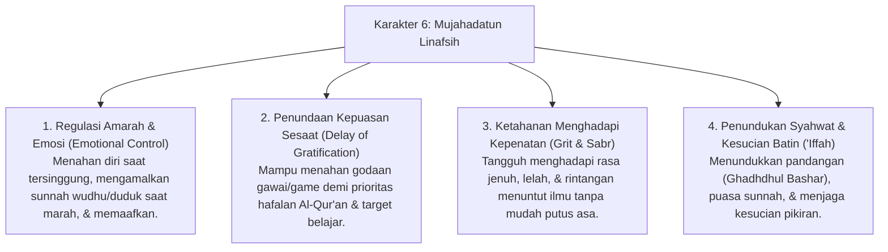

# P3-09-Mujahadatun-Linafsih-Induk (Karakter 6: Regulasi Diri & Penundukan Hawa Nafsu)

## Tujuan
Menetapkan kerangka kapasitas menyeluruh untuk **Karakter 6: Mujahadatun Linafsih (Regulasi Diri & Penundukan Hawa Nafsu)** dalam ekosistem pesantren TUMBUH: membina santri agar memiliki kemampuan mengendalikan dorongan nafsu hewaniyah (*Shahwat*), meregulasi amarah (*Ghadhab*), menunda kepuasan sesaat (*Delay of Gratification*), gigih menghadapi kepenatan menuntut ilmu (*Grit*), serta mencapai ketenteraman batin (*Nafs Muthmainnah*).

---

## 1. 4 Dimensi Karakter Mujahadatun Linafsih

---

## 2. Matriks Rubrik 4 Level Capaian Mujahadatun Linafsih

| Dimensi Perilaku | Level 1: Emerging (T1) | Level 2: Developing (T2) | Level 3: Proficient (T3) | Level 4: Exemplary (T4 - Qudwah) |
| :--- | :--- | :--- | :--- | :--- |
| **Pengendalian Amarah** | Mengamuk, membanting barang, atau memukul saat tersinggung/marah. | Mampu menahan pukulan fisik, namun masih berteriak/mengeluarkan kata kasar. | Tenang saat marah, segera berwudhu/duduk, dan mampu meredakan emosi mandiri. | Menjadi penyejuk suasana, membalas perlakuan buruk teman dengan kebaikan (*Ihsan*). |
| **Penundaan Kepuasan (Gawai/Main)** | Mencuri-curi kesempatan membawa gawai terlarang atau bolos belajar untuk bermain. | Mentaati aturan tanpa gawai jika diawasi, namun gelisah & sulit fokus belajar. | Mampu mengalihkan fokus secara sukarela ke aktivitas membaca/hafalan yang produktif. | Menikmati proses belajar dan menjadi teladan kedisiplinan *Digital Detox* bagi teman. |
| **Ketahanan Menghadapi Jenuh (Grit)** | Menangis meminta pulang ke rumah setiap kali menghadapi ujian/hafalan sulit. | Bertahan di pondok namun belajar setengah hati saat merasa jenuh. | Memiliki ketangguhan mental (*Grit*), mencari strategi belajar baru saat menemui kebuntuan. | Menguatkan dan memotivasi rekan sekamar yang sedang terpuruk/putus asa (*Tawashau bis Shabr*). |

---

## 3. Status Dokumen
* **Status**: 🌟 **A+ (Dokumen Induk Mujahadatun Linafsih)**
* **Level**: Project 3 - `03 Capacity Framework / 09 Mujahadatun Linafsih`
* **Langkah Berikutnya**: Melengkapi sub-modul 01 hingga 14.
