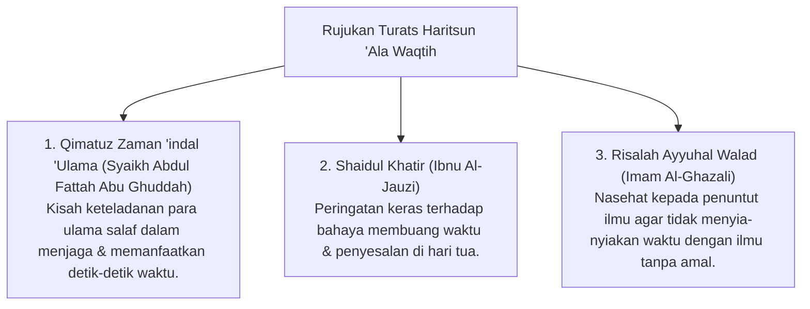

# P3-10-01-Filosofi-dan-Landasan-Turats (Haritsun 'Ala Waqtih)

## Tujuan
Membedah landasan filosofis hakikat waktu dalam pandangan Islam (*Ontologi Waktu*), sumpah Allah atas waktu dalam Al-Qur'an, dan rujukan kitab Turats tentang kedisiplinan ulama mengelola waktu.

---

## 1. Landasan Nash Al-Qur'an & As-Sunnah

### 1. QS. Al-'Ashr [103]: 1-3
> وَالْعَصْرِ ۝ إِنَّ الْإِنْسَانَ لَفِي خُسْرٍ ۝ إِلَّا الَّذِينَ آمَنُوا وَعَمِلُوا الصَّالِحَاتِ وَتَوَاصَوْا بِالْحَقِّ وَتَوَاصَوْا بِالصَّبْرِ
> *"Demi masa. Sungguh, manusia berada dalam kerugian, kecuali orang-orang yang beriman dan mengerjakan kebajikan serta saling menasihati untuk kebenaran dan saling menasihati untuk kesabaran."*

### 2. HR. Bukhari (No. 6412)
> نِعْمَتَانِ مَغْبُونٌ فِيهِمَا كَثِيرٌ مِنَ النَّاسِ: الصِّحَّةُ وَالْفَرَاغُ
> *"Ada dua kenikmatan yang banyak manusia tertipu padanya: kesehatan dan waktu luang."*

---

## 2. Rujukan Khazanah Turats Klasik

---

## 3. Status Dokumen
* **Status**: 🌟 **A+ (Tervalidasi & Siap Diimplementasikan)**
* **Level**: Project 3 - `03 Capacity Framework / 10 Haritsun Ala Waqtih / 01 Philosophy`
