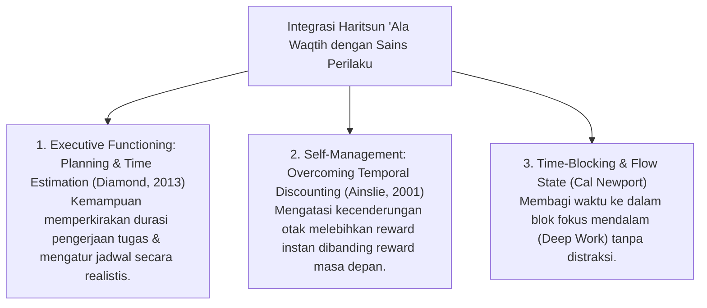

# P3-10-02-Definisi-dan-Konseptualisasi (Haritsun 'Ala Waqtih)

## Tujuan
Menetapkan definisi operasional, batasan istilah, dan integrasi sains manajemen waktu modern (*Time Management, Executive Functioning, & Procrastination Mitigation - CASEL SEL*) dari karakter **Haritsun 'Ala Waqtih**.

---

## 1. Definisi Operasional Baku

> **Haritsun 'Ala Waqtih dalam Ekosistem TUMBUH adalah:**  
> *"Kapasitas kedisiplinan dan kesadaran tinggi santri dalam mengelola, menjaga, dan mengoptimalkan setiap unit waktu untuk amal shalih dan penuntutan ilmu, yang termanifestasikan dalam ketepatan waktu hadir (*Punctuality*), penolakan terhadap perilaku menunda tugas (*Anti-Procrastination*), serta kemampuan memprioritaskan hal-hal yang urgen dan penting."*

---

## 2. Integrasi Konsep Sains & CASEL SEL

---

## 3. Status Dokumen
* **Status**: 🌟 **A+ (Tervalidasi & Siap Diimplementasikan)**
* **Level**: Project 3 - `03 Capacity Framework / 10 Haritsun Ala Waqtih / 02 Definition`
