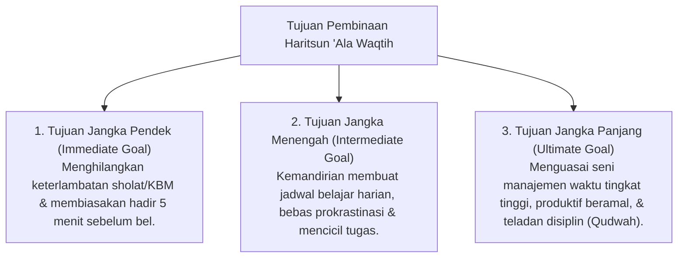

# P3-10-03-Tujuan-dan-Target-Capaian (Haritsun 'Ala Waqtih)

## Tujuan
Menetapkan tujuan jangka pendek, menengah, dan panjang pembinaan karakter **Haritsun 'Ala Waqtih** pada santri di lingkungan pesantren TUMBUH.

---

## 1. 3 Tingkatan Tujuan Pembinaan Waktu

---

## 2. Target Capaian Kuantitatif & Kualitatif

1. **Target Kuantitatif**:
   - Tingkat ketepatan waktu (*Punctuality Rate*) santri di seluruh agenda mencapai **98%+**.
   - 0% tugas sekolah/tahfizh yang terbengkalai karena menunda waktu.
2. **Target Kualitatif**:
   - Santri memiliki ritme hidup yang tenang, tidak tergesa-gesa karena selalu mempersiapkan segala sesuatu lebih awal (*The 5-Minute Early Habit*).

---

## 3. Status Dokumen
* **Status**: 🌟 **A+ (Tervalidasi & Siap Diimplementasikan)**
* **Level**: Project 3 - `03 Capacity Framework / 10 Haritsun Ala Waqtih / 03 Purpose`
