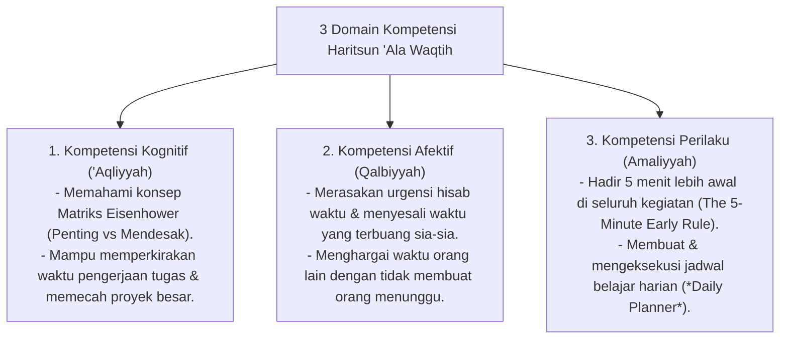

# P3-10-05-Standar-Kompetensi-dan-Taksonomi (Haritsun 'Ala Waqtih)

## Tujuan
Menetapkan **Standar Capaian Pembelajaran & Taksonomi Kompetensi** karakter Haritsun 'Ala Waqtih untuk seluruh jenjang santri di pesantren TUMBUH.

---

## 1. 3 Domain Kompetensi Haritsun 'Ala Waqtih

---

## 2. Matriks Capaian Berjenjang Sesuai Tangga TUMBUH

* **Jenjang T1 (Kelas 7 / 10 Baru)**: Mematuhi lonceng bel asrama, tidak terlambat sholat dan kelas, belajar mengatur waktu mencuci baju.
* **Jenjang T2 (Kelas 8 / 11)**: Mampu membagi waktu antara hafalan tahfizh dan tugas sekolah, berhenti mengobrol saat jam tidur pk 22.00.
* **Jenjang T3 (Kelas 9 / 12)**: Menguasai teknik Time-Blocking mandiri, mencicil persiapan ujian jauh-jauh hari, produktif di waktu luang.
* **Jenjang T4 (Santri Akhir / Teladan)**: Mengatur manajemen waktu kepengurusan organisasi santri secara profesional, menjadi teladan disiplin waktu bagi adik kelas (*Qudwah*).

---

## 3. Status Dokumen
* **Status**: 🌟 **A+ (Tervalidasi & Siap Diimplementasikan)**
* **Level**: Project 3 - `03 Capacity Framework / 10 Haritsun Ala Waqtih / 05 Competencies`
