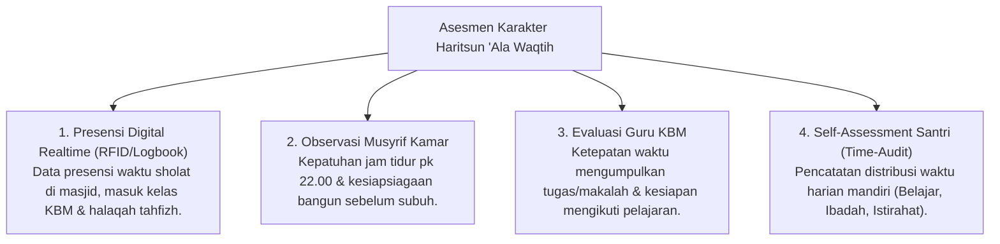

# P3-10-09-Pemetaan-Asesmen-dan-Triangulasi (Haritsun 'Ala Waqtih)

## Tujuan
Menetapkan pemetaan instrumen asesmen dan metode triangulasi data 360 derajat untuk mengukur ketercapaian karakter **Haritsun 'Ala Waqtih**.

---

## 1. Matriks Triangulasi Asesmen Disiplin Waktu

---

## 2. Status Dokumen
* **Status**: 🌟 **A+ (Tervalidasi & Siap Diimplementasikan)**
* **Level**: Project 3 - `03 Capacity Framework / 10 Haritsun Ala Waqtih / 09 Assessment Mapping`
