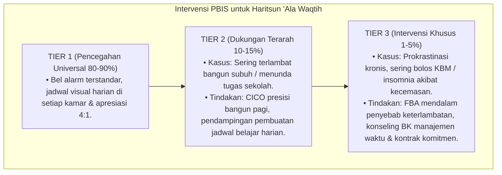

# P3-10-10-Protokol-Intervensi-dan-Pembiasaan (Haritsun 'Ala Waqtih)

## Tujuan
Menetapkan protokol pembiasaan manajemen waktu (*Punctuality SOP*) dan pemetaan intervensi bertingkat (*PBIS Multi-Tier Intervention*) untuk menghilangkan keterlambatan dan perilaku menunda waktu.

---

## 1. Protokol Pembiasaan Rutin Asrama (Tier 1: Universal 100%)

1. **Aturan 5 Menit Lebih Awal (*The 5-Minute Early Rule*)**:
   - Menjadi budaya seluruh civitas pondok untuk hadir 5 menit sebelum bel di seluruh agenda.
2. **Kaidah Keheningan Jam Tidur (*Lights-Out Policy*)**:
   - Pk 22.00 lampu kamar dimatikan, seluruh santri berada di ranjang masing-masing.
3. **Pemberian Apresiasi Kamar Tertepat Waktu (Poin Kebaikan)**:
   - Kamar dengan rekor presensi sholat dan KBM 100% tepat waktu mendapatkan apresiasi mingguan.

---

## 2. Pemetaan Intervensi Khusus PBIS

---

## 3. Status Dokumen
* **Status**: 🌟 **A+ (Tervalidasi & Siap Diimplementasikan)**
* **Level**: Project 3 - `03 Capacity Framework / 10 Haritsun Ala Waqtih / 10 Intervention Mapping`
