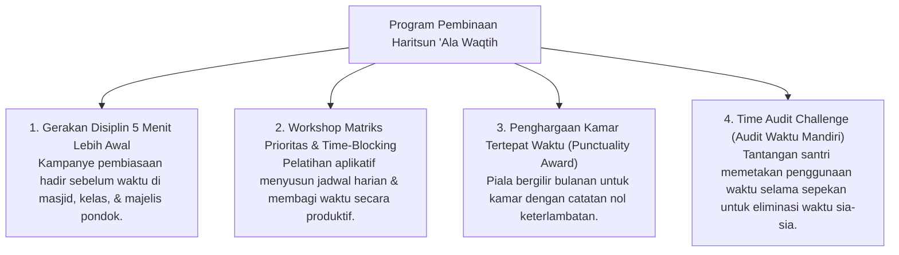

# P3-10-11-Program-Pembinaan-dan-Halaqah (Haritsun 'Ala Waqtih)

## Tujuan
Menetapkan daftar program pembinaan terstruktur, workshop manajemen waktu, dan kampanye disiplin santri di pesantren TUMBUH.

---

## 1. 4 Program Unggulan Pembinaan Manajemen Waktu

---

## 2. Status Dokumen
* **Status**: 🌟 **A+ (Tervalidasi & Siap Diimplementasikan)**
* **Level**: Project 3 - `03 Capacity Framework / 10 Haritsun Ala Waqtih / 11 Programs`
