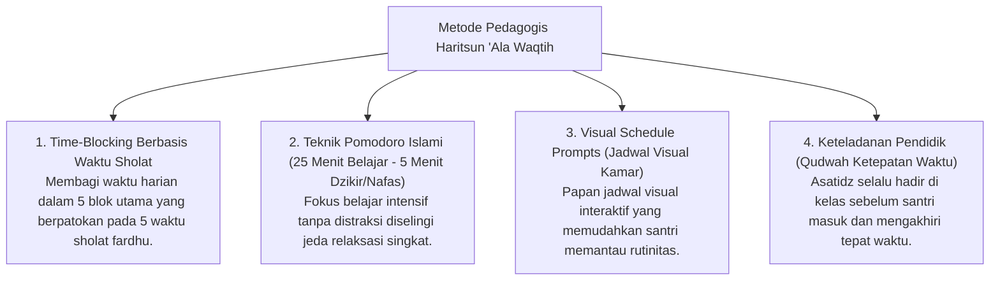

# P3-10-12-Metode-Pedagogi-dan-Didaktik-Waktu (Haritsun 'Ala Waqtih)

## Tujuan
Menetapkan metode pedagogis dan pendekatan didaktik dalam melatihkan manajemen waktu, penundaan prokrastinasi, dan penjadwalan presisi bagi santri.

---

## 1. 4 Metode Didaktik Pengajaran Disiplin Waktu

---

## 2. Status Dokumen
* **Status**: 🌟 **A+ (Tervalidasi & Siap Diimplementasikan)**
* **Level**: Project 3 - `03 Capacity Framework / 10 Haritsun Ala Waqtih / 12 Methods`
