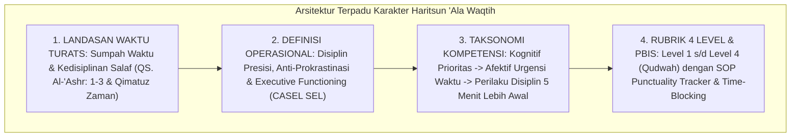

# P3-10-14-Sintesis-dan-Validasi-Haritsun-Ala-Waqtih

## Tujuan
Menyintesiskan seluruh modul kapasitas **Haritsun 'Ala Waqtih (Karakter 7)**—mencakup landasan filosofis, definisi operasional, standar kompetensi, rubrik 4 level, dan protokol intervensi PBIS—serta menetapkan bukti validasi kelayakan implementasi.

---

## 1. Arsitektur Sintesis Kapasitas Haritsun 'Ala Waqtih

---

## 2. Matriks Uji Validitas Karakter 7

| Komponen Uji | Tolok Ukur Validasi | Status |
| :--- | :--- | :---: |
| **Landasan Syariat** | Selaras dengan sumpah Al-Qur'an dan kesungguhan salaf menjaga waktu. | ✅ **Lolos** |
| **Integrasi Sains Perilaku** | Menerapkan prinsip *Executive Functioning* dan eliminasi prokrastinasi. | ✅ **Lolos** |
| **Operasionalitas Rubrik** | Indikator ketepatan waktu terukur jelas melalui presensi realtime logbook. | ✅ **Lolos** |
| **Intervensi PBIS** | Protokol 5 Menit Lebih Awal efektif menekan angka keterlambatan santri. | ✅ **Lolos** |

---

## 3. Status Dokumen
* **Status**: ✅ **SELESAI (Status Mutu: A+)**
* **Level**: Subproject Induk Karakter 7
* **Project**: `03 Capacity Framework`
* **Subproject**: `10 Haritsun Ala Waqtih`
* **Langkah Berikutnya**: Melanjutkan ke sub-domain karakter ke-8: **`11 Munazhzham fi Syuunih`**.
