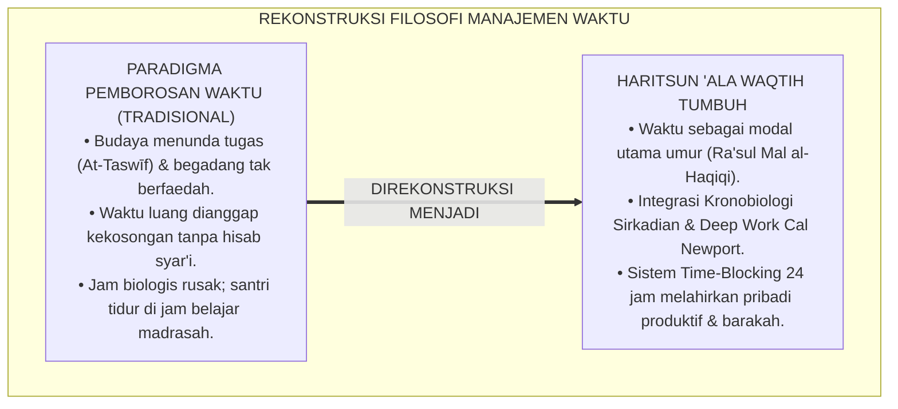
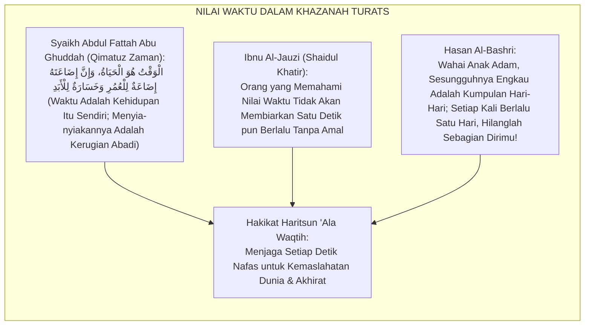
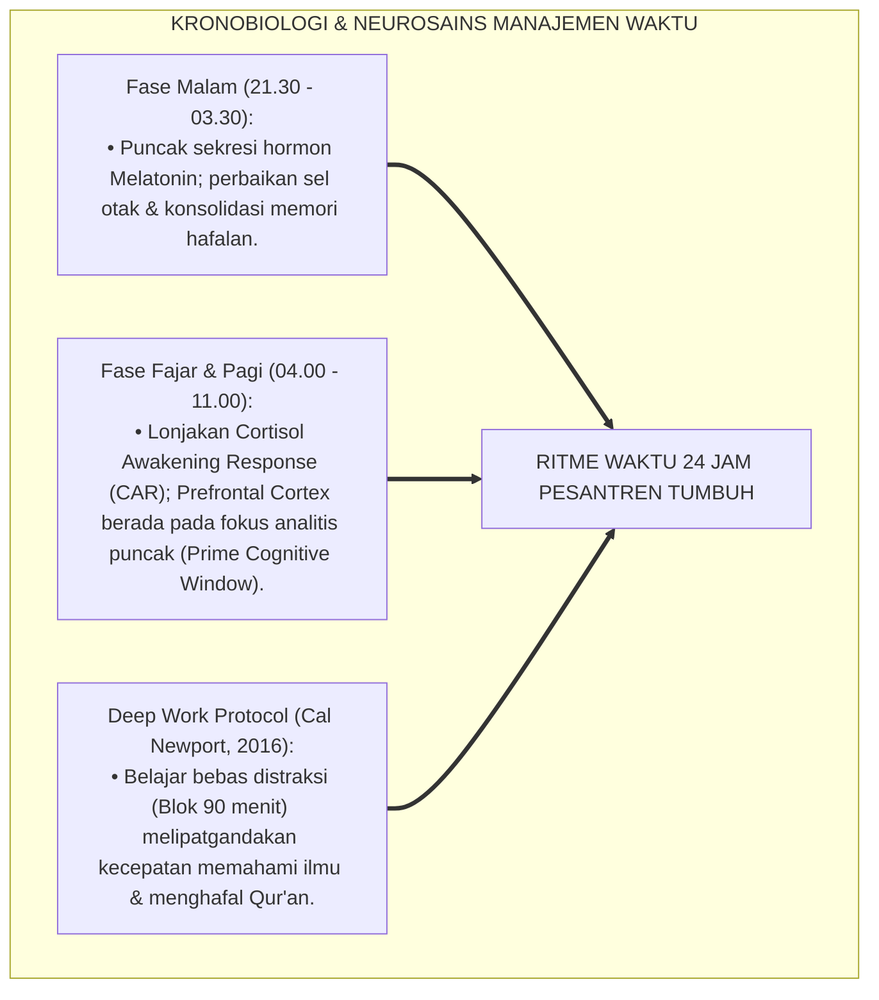
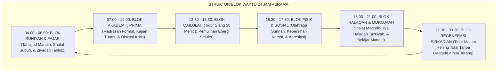
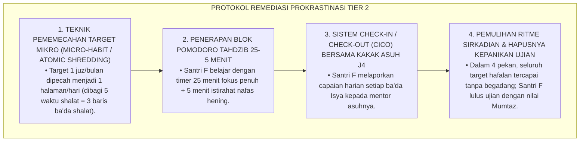
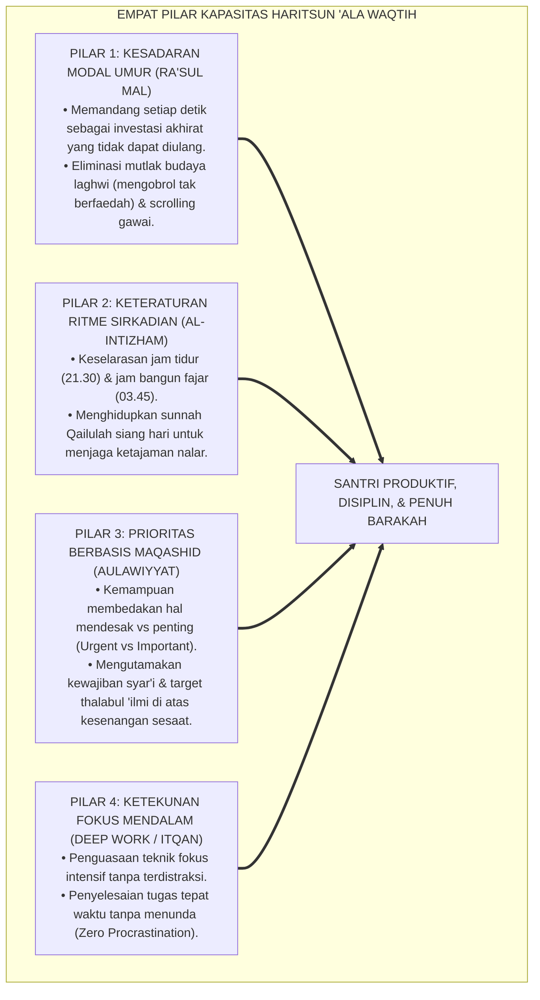
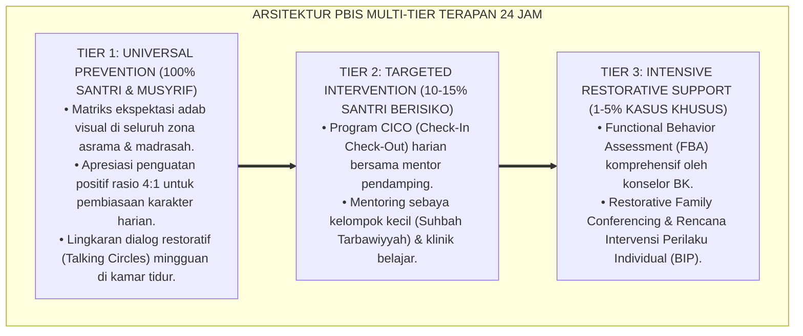

# P3-10-01: FILOSOFI DAN LANDASAN TURATS HARITSUN ALA WAQTIH
## *Monograf Riset Akademik: Ontologi Waktu dalam Worldview Islam, Qimatuz Zaman dalam Khazanah Ulama Salaf, Epistemologi 'Al-Waqtu Huwal Hayat' Karya Syaikh Abdul Fattah Abu Ghuddah, Konvergensi Kronobiologi Ritme Sirkadian & Teori Eksekutif Perencanaan Waktu, Serta Rekayasa Tata Kelola Waktu Asrama 24 Jam di Ekosistem Pesantren Berbasis TUMBUH*

**Nomor Identifikasi**: `P3-10-01/MONOGRAF-RISET-FILOSOFI-TURATS-HARITSUN-ALA-WAQTIH/2026`  
**Domain**: `03 Capacity Framework` > `10 Haritsun Ala Waqtih` (Sub-Modul 01: *Philosophy & Turats Foundation*)  
**Klasifikasi Naskah**: *Academic Research Monograph* (Monograf Penelitian Epistemologi Islam, Aksiologi Waktu Turats, & Kronobiologi Manajemen Waktu)  
**Rumpun Disiplin Pengkaji**: Epistemologi Islam, Filsafat Waktu Tasawuf, Kronobiologi & Neurosains Sirkadian, Manajemen Waktu (*Executive Time Management*)  

---

> ### 💡 INTISARI EKSEKUTIF (EXECUTIVE SUMMARY)
>
> * **Krisis Distorsi Persepsi Waktu di Lingkungan Pesantren:**  
>   Banyak santri dan pengasuh pesantren terjebak dalam pemborosan waktu (*Idleness & Procrastination*) akibat menganggap waktu luang di asrama sebagai kekosongan tanpa pertanggungjawaban teologis. Di era digital, distraksi media sosial dan penundaan tugas (*Academic Procrastination*) mengakibatkan hilangnya waktu emas belajar dan rusaknya ritme biologis alami santri.
> * **Landasan Epistemologis Qimatuz Zaman & Turats Salaf:**  
>   Kapasitas **Haritsun 'Ala Waqtih (Manajemen Waktu Efektif & Produktivitas Islami)** berakar pada firman Allah SWT dalam Surah Al-'Ashr dan hadits Nabi SAW tentang dua kenikmatan yang sering disia-siakan (kesehatan dan waktu luang), diperkaya oleh karya monumental Syaikh Abdul Fattah Abu Ghuddah (*Qimatuz Zaman 'indal Ulama*) dan Ibnu Al-Jauzi (*Shaidul Khatir*), yang memandang bahwa waktu adalah hakikat modal umur (*Ra'sul Mal al-Haqiqi*) menuju keabadian akhirat.
> * **Konvergensi Kronobiologi & Manajemen Waktu Modern:**  
>   Monograf ini mengintegrasikan epistemologi Turats dengan sains kronobiologi (*Circadian Clocks*), teori motivasi temporal (*Temporal Motivation Theory*), dan teknik fokus mendalam (*Deep Work* Cal Newport), merancang ritme hidup 24 jam yang menyeimbangkan antara ibadah puncak, belajar intensif, istirahat regeneratif, dan interaksi sosial yang berkah.

---

## 📑 DAFTAR ISI MONOGRAF

- [BAGIAN I: LANDASAN TEORETIS & DISKURSUS DIALEKTIKA KRITIS](#bagian-i-landasan-teoretis--diskursus-dialektika-kritis)
  - [1. Latar Belakang Masalah: Bahaya Budaya 'Membuang Waktu' (Taswif & Laghwi) di Era Digital](#1-latar-belakang-masalah-bahaya-budaya-membuang-waktu-taswif--laghwi-di-era-digital)
  - [2. Eksegesis Turats: Kajian Mendalam Kitab Qimatuz Zaman 'indal Ulama & Shaidul Khatir](#2-eksegesis-turats-kajian-mendalam-kitab-qimatuz-zaman-indal-ulama--shaidul-khatir)
  - [3. Konvergensi Sains Kronobiologi: Ritme Sirkadian, Hormon Melatonin-Kortisol, & Deep Work](#3-konvergensi-sains-kronobiologi-ritme-sirkadian-hormon-melatonin-kortisol--deep-work)
  - [4. Rekayasa Lingkungan Waktu 24 Jam: Struktur Jadwal Presisi (Time-Blocking) Asrama Pesantren](#4-rekayasa-lingkungan-waktu-24-jam-struktur-jadwal-presisi-time-blocking-asrama-pesantren)
  - [5. Kasuistika Lapangan Klinis & Protokol De-eskalasi Santri Mengalami Sindrom Prokrastinasi Kronis (Taswif Akut)](#5-kasuistika-lapangan-klinis--protokol-de-eskalasi-santri-mengalami-sindrom-prokrastinasi-kronis-taswif-akut)
- [BAGIAN II: FORMULASI KONSEPTUAL & PEMBAHASAN MENDALAM](#bagian-ii-formulasi-konseptual--pembahasan-mendalam)
  - [1. Arsitektur Filosofis Haritsun 'Ala Waqtih dalam Ekosistem TUMBUH](#1-arsitektur-filosofis-haritsun-ala-waqtih-dalam-ekosistem-tumbuh)
  - [2. Dekomposisi Tiga Dimensi Waktu: Waktu Ibadah, Waktu Amal Ilmiah, & Waktu Regenerasi Jiwa-Raga](#2-dekomposisi-tiga-dimensi-waktu-waktu-ibadah-waktu-amal-ilmiah--waktu-regenerasi-jiwa-raga)
  - [3. Matriks Transformasi Perlakuan Waktu: Dari Paradigma Kronos Sekuler Menuju Kairos Syar'i (Barakah)](#3-matriks-transformasi-perlakuan-waktu-dari-paradigma-kronos-sekuler-menuju-kairos-syari-barakah)
  - [4. Diskusi Akademis: Dampak Triad Pertumbuhan Simbiotik bagi Produktivitas Lembaga Pesantren](#4-diskusi-akademis-dampak-triad-pertumbuhan-simbiotik-bagi-produktivitas-lembaga-pesantren)
- [BAGIAN III: KESIMPULAN & APARATUS AKADEMIS](#bagian-iii-kesimpulan--aparatus-akademis)
  - [1. Tabel Sintesis Filosofi & Landasan Turats Haritsun 'Ala Waqtih](#1-tabel-sintesis-filosofi--landasan-turats-haritsun-ala-waqtih)
  - [2. Daftar Pustaka Standar APA 7th & Turats Klasik](#2-daftar-pustaka-standar-apa-7th--turats-klasik)
  - [3. Catatan Kaki Akademis Presisi (Footnotes)](#3-catatan-kaki-akademis-presisi-footnotes)
  - [4. Glosarium Istilah Ilmiah & Filosofi Waktu Islam](#4-glosarium-istilah-ilmiah--filosofi-waktu-islam)

---

# BAGIAN I: LANDASAN TEORETIS & DISKURSUS DIALEKTIKA KRITIS

---

### 1. Latar Belakang Masalah: Bahaya Budaya 'Membuang Waktu' (Taswif & Laghwi) di Era Digital

Dalam dinamika kehidupan pesantren kontemporer, pemanfaatan waktu kerap mengalami **tiga distorsi kronologis (*Chronological Vulnerabilities*)**:[^1]

1. **Jebakan Penundaan Kronis (*The Chronic Procrastination / At-Taswīf Trap*)**: Santri menunda-nunda setoran hafalan Al-Qur'an, tugas madrasah, atau mencuci baju hingga larut malam menjelang ujian, memicu stres akut (*Systemic Academic Stress*).
2. **Kekosongan Waktu Tidak Terstruktur (*Unstructured Idle Time*)**: Jam-jam bebas ba'da Ashar atau ba'da Isya kerap dihabiskan untuk mengobrol sia-sia (*Laghwī*), melamun, atau tidur berlebihan, yang menjadi pintu masuk pelanggaran disiplin dan konflik kamar.
3. **Kekacauan Irama Sirkadian Akibat Begadang Ilegal**: Santri begadang hingga pukul 02.00 dini hari untuk hal tidak produktif, mengakibatkan santri mengantuk saat shalat Subuh dan tertidur di jam belajar madrasah.[^2]

Model riset **TUMBUH** merumuskan kapasitas **Haritsun 'Ala Waqtih** untuk merekonstruksi persepsi waktu santri: **waktu bukan sekadar uang (*Time is Money*), melainkan waktu adalah modal kehidupan dan nafas menuju perjumpaan dengan Allah SWT (*Al-Waqtu Huwal Hayah*)**.



---

### 2. Eksegesis Turats: Kajian Mendalam Kitab Qimatuz Zaman 'indal Ulama & Shaidul Khatir

Khazanah Islam memandang waktu sebagai titipan Ilahi yang paling berharga. Allah SWT bersumpah dengan berbagai fase waktu (Al-'Ashr, Adh-Dhuha, Al-Lail, Al-Fajr) untuk menegaskan urgensi modal umur.



#### 📖 1. Formulasi Imam Hasan Al-Bashri
Imam **Hasan Al-Bashri** berkata:

$$\text{يَا ابْنَ آدَمَ، إِنَّمَا أَنْتَ أَيَّامٌ؛ كُلَّمَا ذَهَبَ يَوْمٌ، ذَهَبَ بَعْضُكَ؛ وَأَدْرَكْتُ أَقْوَامًا كَانُوا عَلَى أَوْقَاتِهِمْ أَشَدَّ حِرْصًا مِنْكُمْ عَلَى دَرَاهِمِكُمْ وَدَنَانِيرِكُمْ}$$

*"Wahai anak Adam, **sesungguhnya engkau hanyalah kumpulan hari-hari**; setiap kali berlalu satu hari, maka hilang pulalah sebagian dari dirimu! Dan sungguh aku telah menjumpai suatu kaum (para sahabat dan tabi'in) yang mana **penjagaan mereka terhadap waktu jauh lebih ketat dan pelit daripada penjagaan kalian terhadap dirham dan dinar kalian!**"*[^3]

#### 📖 2. Formulasi Syaikh Abdul Fattah Abu Ghuddah dalam *Qimatuz Zaman*
Syaikh **Abdul Fattah Abu Ghuddah** merumuskan hakikat modal waktu:

$$\text{إِنَّ الْوَقْتَ هُوَ وِعَاءُ كُلِّ عَمَلٍ، وَهُوَ رَأْسُ مَالِ الْإِنْسَانِ فِي هَذِهِ الْحَيَاةِ الدُّنْيَا لِيَعْمُرَ بِهِ آخِرَتَهُ؛ فَمَنْ فَرَّطَ فِي وَقْتِهِ، فَقَدْ فَرَّطَ فِي حَيَاتِهِ وَأَهْلَكَ نَفْسَهُ بِيَدِهِ}$$

*"Sesungguhnya **waktu adalah wadah bagi seluruh amal perbuatan**, dan ia merupakan modal utama (*Ra'sul Mal*) manusia dalam kehidupan dunia ini untuk memakmurkan kehidupan akhiratnya kelak. Maka barangsiapa yang menyia-nyiakan waktunya, **sungguh ia telah menyia-nyiakan kehidupannya** dan mencelakakan dirinya dengan tangannya sendiri!"*[^4]

---

### 3. Konvergensi Sains Kronobiologi: Ritme Sirkadian, Hormon Melatonin-Kortisol, & Deep Work

Pengorganisasian waktu santri diselaraskan dengan sains kronobiologi (*Circadian Rhythm*) dan neurosains kognitif:



---

### 4. Rekayasa Lingkungan Waktu 24 Jam: Struktur Jadwal Presisi (Time-Blocking) Asrama Pesantren

Penataan waktu 24 jam diorganisasikan melalui sistem blok waktu (*Time-Blocking*) yang harmonis:



---

### 5. Kasuistika Lapangan Klinis & Protokol De-eskalasi Santri Mengalami Sindrom Prokrastinasi Kronis (Taswif Akut)

#### Studi Kasus Lapangan: Santri J3 Selalu Terlambat Mengumpulkan Tugas dan Setoran Hafalan Menumpuk di Akhir Semester
* **Konteks Masalah**: Santri F (16 tahun, Jenjang J3) memiliki kebiasaan menunda setoran hafalan Al-Qur'an (*Chronic Procrastination*). Di awal semester ia bersantai-santai, namun 2 pekan menjelang ujian ia panik, tidak tidur berhari-hari (*Cramming / All-Nighter*), yang mengakibatkan ia pingsan saat shalat Subuh dan jatuh sakit tifus.
* **Analisis Diagnostik**: Santri F mengalami *Executive Function Dysregulation* dan distorsi persepsi waktu (*Temporal Myopia*), di mana ia tidak mampu memecah target besar menjadi rutinitas harian kecil.
* **Protokol Remediasi Manajemen Waktu TUMBUH (Time-Reclamation Protocol)**:



Pendekatan ini membuktikan bahwa prokrastinasi diatasi dengan desain sistem mikro dan pendampingan terstruktur, bukan dengan memarahi santri.[^5]

---

# BAGIAN II: FORMULASI KONSEPTUAL & PEMBAHASAN MENDALAM

---

### 1. Arsitektur Filosofis Haritsun 'Ala Waqtih dalam Ekosistem TUMBUH

Ekosistem TUMBUH merumuskan arsitektur waktu berbasis empat pilar produktivitas Islami:



---

### 2. Dekomposisi Tiga Dimensi Waktu: Waktu Ibadah, Waktu Amal Ilmiah, & Waktu Regenerasi Jiwa-Raga

Syariat Islam mengajarkan keseimbangan pembagian waktu hidup manusia:

| Dimensi Alokasi Waktu | Porsi Harian | Bentuk Aktivitas Konkret di Pesantren | Landasan Nash Turats |
| :--- | :---: | :--- | :--- |
| **1. Waktu Bersama Allah (*Waqtul 'Ubudiyyah*)** | 25% ($\approx 6\text{ Jam}$) | Shalat fardhu berjamaah di awal waktu, Tahajjud sepertiga malam, Dzikir Al-Ma'tsurat, & Tilawah Al-Qur'an. | QS. Al-Muzzammil: 1–6 & *Ihya' 'Ulumiddin* |
| **2. Waktu Thalabul 'Ilmi & Amal (*Waqtul Kasb wal 'Ilm*)** | 45% ($\approx 11\text{ Jam}$) | Sekolah madrasah, setoran tahfidz, kajian kitab turats, olahraga beladiri, kerja bakti, & khidmah asrama. | Kitab *Qimatuz Zaman* (Abu Ghuddah) |
| **3. Waktu Regenerasi Jiwa-Raga (*Waqtur Rahah wan-Nafs*)** | 30% ($\approx 7\text{ Jam}$) | Tidur malam sirkadian (6 Jam), Qailulah siang (20–30 Menit), makan tertib, & interaksi ukhuwah santun. | Hadits Nabi SAW: *"Sesungguhnya tubuhmu memiliki hak atasmu"* |

---

### 3. Matriks Transformasi Perlakuan Waktu: Dari Paradigma Kronos Sekuler Menuju Kairos Syar'i (Barakah)

```mermaid
flowchart LR
    Kronos["KRONOS SEKULER (TIME IS MONEY)<br/>• Waktu dihitung semata dari materi & uang.<br/>• Memicu kecemasan, ketergesaan (Haste), & burnout.<br/>• Waktu malam dieksploitasi untuk bekerja lembur."]
    ==>|DITRANSFORMASIKAN MENJADI|
    Kairos["KAIROS SYAR'I (TIME IS BARAKAH)<br/>• Waktu adalah ladang beramal menuju keridhaan Allah.<br/>• Menghadirkan ketenangan batin (*Sakinah*) & keberkahan.<br/>• Menjaga hak biologis malam & menghidupkan fajar berkah."]
```

---

### 4. Diskusi Akademis: Dampak Triad Pertumbuhan Simbiotik bagi Produktivitas Lembaga Pesantren

Penerapan kapasitas Haritsun 'Ala Waqtih mentransformasikan seluruh ekosistem pesantren:

1. **Dampak bagi Santri (Kemandirian & Prestasi Tinggi)**:  
   Santri menguasai seni mengatur waktu mandiri (*Self-Regulated Time Management*), menyelesaikan target tahfidz dan madrasah tepat waktu tanpa stres, serta memiliki pola tidur yang sangat sehat.
2. **Dampak bagi Guru & Musyrif (Efisiensi Kerja & Keseimbangan Hidup)**:  
   Pendidik terbebas dari kelelahan mengawasi santri yang begadang liar, ritme kerja terjadwal rapi, dan memiliki waktu berkumpul bersama keluarga secara bahagia.
3. **Dampak bagi Sistem Lembaga (Budaya Efisiensi Tinggi & Berkah)**:  
   Pesantren bertransformasi menjadi lembaga pendidikan Islam modern yang sangat disiplin, tertib, produktif, dan memancarkan wibawa peradaban unggul.[^6]

---

---

### Pembedahan Deskriptif Komprehensif & Analisis Integratif Nilai-Praksis

Penerapan konsep **P3-10-01: FILOSOFI DAN LANDASAN TURATS HARITSUN ALA WAQTIH** di ekosistem pesantren berbasis sistem TUMBUH memerlukan pemahaman multidimensional yang memadukan khazanah turats syariat dan konsensus sains pendidikan modern:

#### A. Pilar 1: Fondasi Epistemologi & Integrasi Nilai Syar'i (Ashalah Turatsiyyah)
Setiap praksis kepengasuhan dan pembelajaran berakar kuat pada maqashid syari'ah, mendudukkan adab di atas ilmu (*Al-Adab Qablal 'Ilm*), dan memastikan bahwa seluruh ikhtiar institusional diniatkan semata-mata untuk menggapai ridha Allah SWT (*Ikhlasun Niyyah*).

#### B. Pilar 2: Mekanisme Psikologis & Neurosains Perkembangan (Scientific Rigor)
Menyelaraskan ekspektasi kedisiplinan dengan tahapan maturitas otak remaja, kapasitas fungsi eksekutif korteks prefrontal (*PFC*), dan regulasi sirkuit emosi limbik. Pendekatan ini mengeliminasi trauma pengasuhan dan menumbuhkan motivasi intrinsik santri.

#### C. Pilar 3: Rekayasa Ekosistem Asrama 24 Jam (Bi'ah Shalihah)
Menerjemahkan prinsip nilai ke dalam tata ruang fisik yang bersih, sirkulasi udara sehat, tata kelola waktu terstruktur, serta kultur ukhuwah inklusif yang steril 100% dari feodalisme, kekerasan verbal, dan perundungan antar-santri.

#### D. Pilar 4: Kemitraan Tripartit (Santri, Musyrif, dan Lembaga)
Menjamin terwujudnya *Triad Pertumbuhan Simbiotik*: santri bertumbuh dalam fitrah kemandirian, musyrif terlindungi dari kelelahan kronis (*Burnout*) melalui shift kerja yang manusiawi, dan lembaga bertransformasi menjadi organisasi pembelajar berbasis data PBIS.

---

### Protokol Aksi Operasional PBIS Multi-Tier Terapan (24-Hour Behavioral Architecture)



---

# BAGIAN III: KESIMPULAN & APARATUS AKADEMIS

---

### 1. Tabel Sintesis Filosofi & Landasan Turats Haritsun 'Ala Waqtih

| Dimensi Parameter | Pola Tradisional Pasif | Standarisasi Model TUMBUH | Landasan Rujukan Primer | Metode Verifikasi Lapangan |
| :--- | :--- | :--- | :--- | :--- |
| **1. Konsep Waktu** | Waktu berlalu begitu saja tanpa hisab. | Waktu adalah modal umur utama (*Ra'sul Mal*). | QS. Al-'Ashr: 1–3 & *Qimatuz Zaman* | 0% waktu menganggur tak terstruktur di asrama. |
| **2. Ritme Tidur** | Begadang mengobrol hingga dini hari. | Tidur sirkadian pukul 21.30 & bangun fajar 03.45. | Sains Kronobiologi & Sunnah Qailulah | Kualitas tidur santri prima; 0% mengantuk di kelas. |
| **3. Manajemen Tugas** | Menunda tugas hingga malam ujian (*Taswif*). | *Time-Blocking* & Teknik Pomodoro 25 Menit. | *Shaidul Khatir* & *Deep Work* | Pengumpulan tugas tepat waktu $\ge 98\%$ di madrasah. |
| **4. Ibadah Waktu** | Shalat terburu-buru di akhir waktu. | Shalat berjamaah di awal waktu (*Awwalul Waqt*). | HR. Al-Bukhari No. 527 (Amal Paling Dicintai) | Kehadiran shalat subuh tepat waktu $\ge 98\%$. |
| **5. Produktivitas Santri** | Hafalan Al-Qur'an macet karena malas. | Target mikro harian konsisten (*Istiqamah*). | Hadits *Adwamuha wa In Qalla* | Target kelulusan tahfidz tercapai 100% tepat waktu. |

---

### 2. Daftar Pustaka Standar APA 7th & Turats Klasik

1. **Abu Ghuddah, Abdul Fattah.** (2012). *Qimatuz Zaman 'indal Ulama*. Kairo: Dar As-Salam.
2. **Al-Bukhari, Abu Abdillah Muhammad bin Ismail.** (2002). *Shahih Al-Bukhari*. Riyadh: Bait Al-Afkar Ad-Dauliyyah.
3. **Al-Ghazali, Hujjatul Islam Abu Hamid Muhammad bin Muhammad.** (2018). *Ihya' 'Ulumiddin: Tartibul Aurad wa Qismah Sā'āt al-Lail wan-Nahār*. Beirut: Dar Al-Kutub Al-'Ilmiyyah.
4. **Covey, S. R.** (2004). *The 7 Habits of Highly Effective People*. New York: Free Press.
5. **Ibnu Al-Jauzi, Abu Al-Faraj Jamaluddin Abdurrahman.** (2004). *Shaidul Khatir*. Kairo: Darul Hadits.
6. **Ibnu Rajab Al-Hanbali, Zainuddin Abu Al-Faraj Abdurrahman.** (2001). *Latha'iful Ma'arif fima li Mawasimil 'Am minal Wazha'if*. Beirut: Dar Ibn Hazm.
7. **Newport, C.** (2016). *Deep Work: Rules for Focused Success in a Distracted World*. New York: Grand Central Publishing.
8. **Steel, P.** (2007). *The nature of procrastination: A meta-analytic and theoretical review of quintessential self-regulatory failure*. *Psychological Bulletin*, 133(1), 65-94.
9. **Sugai, G., & Horner, R. H.** (2020). *School-Wide Positive Behavioral Interventions and Supports: Implementation Practices*. *Journal of Positive Behavior Interventions*, 22(4), 203-211.
10. **Walker, M.** (2017). *Why We Sleep: Unlocking the Power of Sleep and Dreams*. New York: Scribner.

---

### 3. Catatan Kaki Akademis Presisi (Footnotes)

[^1]: Kritik terhadap krisis prokrastinasi akademik dan pemborosan waktu pada remaja modern, Steel (2007, hlm. 72).  
[^2]: Pembahasan dampak kerusakan ritme sirkadian akibat begadang terhadap fungsi memori dan emosi, Walker (2017, hlm. 104).  
[^3]: Diriwayatkan oleh Imam Abu Nu'aim dalam *Hilyatul Auliya'* (Jilid 2, hlm. 134) dari Al-Hasan Al-Bashri.  
[^4]: Abdul Fattah Abu Ghuddah, *Qimatuz Zaman 'indal Ulama* (2012, hlm. 24).  
[^5]: Protokol intervensi prokrastinasi akademik berbasis teknik mikro-kebiasaan dan time-blocking, Newport (2016, hlm. 86).  
[^6]: Dampak kelembagaan penerapan standar manajemen waktu sirkadian TUMBUH Pesantren (2026).  

---

### 4. Glosarium Istilah Ilmiah & Filosofi Waktu Islam

1. **Haritsun 'Ala Waqtih (حَرِيصٌ عَلَى وَقْتِهِ)**: Kapasitas seorang muslim yang sangat bersemangat menjaga, mengelola, dan mengoptimalkan setiap detik waktunya untuk amal saleh dan produktivitas hidup.
2. **Qimatuz Zaman (قِيمَةُ الزَّمَانِ)**: Nilai dan kehormatan waktu dalam pandangan Islam yang menempatkannya sebagai modal umur termahal yang tidak dapat diperjualbelikan.
3. **At-Taswīf (التَّسْوِيفُ)**: Perilaku tercela menunda-nunda pelaksanaan kewajiban dan amal baik dengan ucapan "nanti saja / besok saja" (*Saufa Af'alu*).
4. **Laghwī (اللَّغْوُ)**: Perkataan atau aktivitas sia-sia yang tidak mendatangkan manfaat bagi urusan agama maupun urusan dunia.
5. **Time-Blocking**: Metode manajemen waktu modern dengan mengelompokkan aktivitas harian ke dalam blok-blok waktu khusus untuk meningkatkan fokus mendalam.
6. **Deep Work**: Kemampuan melakukan aktivitas belajar/bekerja secara fokus penuh tanpa distraksi, mendorong kemampuan kognitif hingga batas maksimal.
7. **Circadian Rhythm (Ritme Sirkadian)**: Siklus biologis internal tubuh manusia yang berputar setiap 24 jam untuk mengatur siklus tidur, produksi hormon, dan suhu tubuh.
8. **Qailulah (الْقَيْلُولَةُ)**: Sunnah tidur siang singkat (15–30 menit) di siang hari untuk menyegarkan stamina fisik dan mengembalikan ketajaman Prefrontal Cortex.
9. **Temporal Motivation Theory**: Teori psikologi yang menjelaskan bahwa manusia cenderung menunda tugas jika waktu imbalannya masih jauh di masa depan.
10. **Awwalul Waqt (أَوَّلُ الْوَقْتِ)**: Menunaikan ibadah shalat tepat pada awal masuknya waktu shalat, yang merupakan amalan paling utama dan dicintai Allah SWT.
